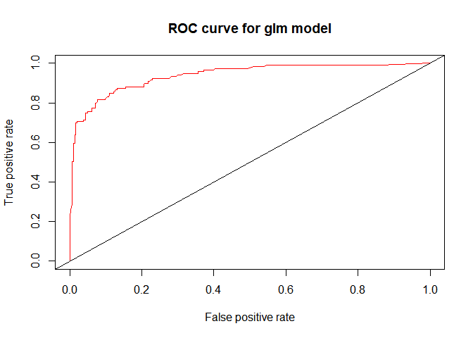

ADP transaction data analysis
================
jakinpilla
2019-04-25

``` r
rm(list=ls()); gc()
```

    ##          used (Mb) gc trigger (Mb) max used (Mb)
    ## Ncells 509837 27.3    1152102 61.6   609148 32.6
    ## Vcells 989502  7.6    8388608 64.0  1599023 12.2

``` r
getwd()
```

    ## [1] "C:/Users/Daniel/ADP_performance_test"

``` r
Packages <- c('tidyverse', 'data.table', 'reshape2', 'caret', 'rpart', 'GGally', 
              'ROCR', 'randomForest', 'ranger','e1071')
lapply(Packages, library, character.only=T)
```

    ## -- Attaching packages ----------------------------------------------------- tidyverse 1.2.1 --

    ## √ ggplot2 3.1.0     √ purrr   0.2.5
    ## √ tibble  1.4.2     √ dplyr   0.7.8
    ## √ tidyr   0.8.2     √ stringr 1.3.1
    ## √ readr   1.3.1     √ forcats 0.3.0

    ## -- Conflicts -------------------------------------------------------- tidyverse_conflicts() --
    ## x dplyr::filter() masks stats::filter()
    ## x dplyr::lag()    masks stats::lag()

    ## 
    ## Attaching package: 'data.table'

    ## The following objects are masked from 'package:dplyr':
    ## 
    ##     between, first, last

    ## The following object is masked from 'package:purrr':
    ## 
    ##     transpose

    ## 
    ## Attaching package: 'reshape2'

    ## The following objects are masked from 'package:data.table':
    ## 
    ##     dcast, melt

    ## The following object is masked from 'package:tidyr':
    ## 
    ##     smiths

    ## Loading required package: lattice

    ## 
    ## Attaching package: 'caret'

    ## The following object is masked from 'package:purrr':
    ## 
    ##     lift

    ## 
    ## Attaching package: 'GGally'

    ## The following object is masked from 'package:dplyr':
    ## 
    ##     nasa

    ## Loading required package: gplots

    ## 
    ## Attaching package: 'gplots'

    ## The following object is masked from 'package:stats':
    ## 
    ##     lowess

    ## randomForest 4.6-14

    ## Type rfNews() to see new features/changes/bug fixes.

    ## 
    ## Attaching package: 'randomForest'

    ## The following object is masked from 'package:dplyr':
    ## 
    ##     combine

    ## The following object is masked from 'package:ggplot2':
    ## 
    ##     margin

    ## Warning: package 'ranger' was built under R version 3.5.3

    ## 
    ## Attaching package: 'ranger'

    ## The following object is masked from 'package:randomForest':
    ## 
    ##     importance

    ## [[1]]
    ##  [1] "forcats"   "stringr"   "dplyr"     "purrr"     "readr"    
    ##  [6] "tidyr"     "tibble"    "ggplot2"   "tidyverse" "stats"    
    ## [11] "graphics"  "grDevices" "utils"     "datasets"  "methods"  
    ## [16] "base"     
    ## 
    ## [[2]]
    ##  [1] "data.table" "forcats"    "stringr"    "dplyr"      "purrr"     
    ##  [6] "readr"      "tidyr"      "tibble"     "ggplot2"    "tidyverse" 
    ## [11] "stats"      "graphics"   "grDevices"  "utils"      "datasets"  
    ## [16] "methods"    "base"      
    ## 
    ## [[3]]
    ##  [1] "reshape2"   "data.table" "forcats"    "stringr"    "dplyr"     
    ##  [6] "purrr"      "readr"      "tidyr"      "tibble"     "ggplot2"   
    ## [11] "tidyverse"  "stats"      "graphics"   "grDevices"  "utils"     
    ## [16] "datasets"   "methods"    "base"      
    ## 
    ## [[4]]
    ##  [1] "caret"      "lattice"    "reshape2"   "data.table" "forcats"   
    ##  [6] "stringr"    "dplyr"      "purrr"      "readr"      "tidyr"     
    ## [11] "tibble"     "ggplot2"    "tidyverse"  "stats"      "graphics"  
    ## [16] "grDevices"  "utils"      "datasets"   "methods"    "base"      
    ## 
    ## [[5]]
    ##  [1] "rpart"      "caret"      "lattice"    "reshape2"   "data.table"
    ##  [6] "forcats"    "stringr"    "dplyr"      "purrr"      "readr"     
    ## [11] "tidyr"      "tibble"     "ggplot2"    "tidyverse"  "stats"     
    ## [16] "graphics"   "grDevices"  "utils"      "datasets"   "methods"   
    ## [21] "base"      
    ## 
    ## [[6]]
    ##  [1] "GGally"     "rpart"      "caret"      "lattice"    "reshape2"  
    ##  [6] "data.table" "forcats"    "stringr"    "dplyr"      "purrr"     
    ## [11] "readr"      "tidyr"      "tibble"     "ggplot2"    "tidyverse" 
    ## [16] "stats"      "graphics"   "grDevices"  "utils"      "datasets"  
    ## [21] "methods"    "base"      
    ## 
    ## [[7]]
    ##  [1] "ROCR"       "gplots"     "GGally"     "rpart"      "caret"     
    ##  [6] "lattice"    "reshape2"   "data.table" "forcats"    "stringr"   
    ## [11] "dplyr"      "purrr"      "readr"      "tidyr"      "tibble"    
    ## [16] "ggplot2"    "tidyverse"  "stats"      "graphics"   "grDevices" 
    ## [21] "utils"      "datasets"   "methods"    "base"      
    ## 
    ## [[8]]
    ##  [1] "randomForest" "ROCR"         "gplots"       "GGally"      
    ##  [5] "rpart"        "caret"        "lattice"      "reshape2"    
    ##  [9] "data.table"   "forcats"      "stringr"      "dplyr"       
    ## [13] "purrr"        "readr"        "tidyr"        "tibble"      
    ## [17] "ggplot2"      "tidyverse"    "stats"        "graphics"    
    ## [21] "grDevices"    "utils"        "datasets"     "methods"     
    ## [25] "base"        
    ## 
    ## [[9]]
    ##  [1] "ranger"       "randomForest" "ROCR"         "gplots"      
    ##  [5] "GGally"       "rpart"        "caret"        "lattice"     
    ##  [9] "reshape2"     "data.table"   "forcats"      "stringr"     
    ## [13] "dplyr"        "purrr"        "readr"        "tidyr"       
    ## [17] "tibble"       "ggplot2"      "tidyverse"    "stats"       
    ## [21] "graphics"     "grDevices"    "utils"        "datasets"    
    ## [25] "methods"      "base"        
    ## 
    ## [[10]]
    ##  [1] "e1071"        "ranger"       "randomForest" "ROCR"        
    ##  [5] "gplots"       "GGally"       "rpart"        "caret"       
    ##  [9] "lattice"      "reshape2"     "data.table"   "forcats"     
    ## [13] "stringr"      "dplyr"        "purrr"        "readr"       
    ## [17] "tidyr"        "tibble"       "ggplot2"      "tidyverse"   
    ## [21] "stats"        "graphics"     "grDevices"    "utils"       
    ## [25] "datasets"     "methods"      "base"

Data Wraggling \> Sectecting vars \> Spilting Data \> Modeling \>
Evaluating \> Comparing \> Predicting… Date Loading—-

``` r
data_with_gender <- read_csv('./data/data_total_with_gender_final.csv') 
```

    ## Parsed with column specification:
    ## cols(
    ##   .default = col_double(),
    ##   custid = col_character(),
    ##   gender = col_character(),
    ##   top_prod = col_character()
    ## )

    ## See spec(...) for full column specifications.

``` r
data_with_gender %>%
  select(custid, gender) -> cust_gender

data_total <- read_csv('./data/data_total.csv') 
```

    ## Parsed with column specification:
    ## cols(
    ##   .default = col_double(),
    ##   custid = col_character(),
    ##   first_cnt.prod = col_character(),
    ##   second_cnt.prod = col_character(),
    ##   third_cnt.prod = col_character(),
    ##   first_money.prod_ct = col_character(),
    ##   second_money.prod_ct = col_character(),
    ##   third_money.prod_ct = col_character()
    ## )
    ## See spec(...) for full column specifications.

``` r
data_total %>% colnames()
```

    ##  [1] "custid"               "ct_dairy"             "ct_drink"            
    ##  [4] "ct_fastfood"          "ct_fruite"            "ct_house_prod"       
    ##  [7] "ct_makeup"            "ct_meat"              "ct_sauce"            
    ## [10] "ct_seafood"           "ct_snack"             "ct_vegetable"        
    ## [13] "coverage"             "g_paid"               "buyed_prod_num"      
    ## [16] "hf_6-11"              "hf_12-17"             "hf_18-23"            
    ## [19] "wdf_Sun"              "wdf_Mon"              "wdf_Tue"             
    ## [22] "wdf_Wed"              "wdf_Thu"              "wdf_Fri"             
    ## [25] "wdf_Sat"              "n_distinct(prod)"     "ct_cov"              
    ## [28] "vdays"                "day_mean_amt"         "day_cov"             
    ## [31] "first_cnt.prod"       "second_cnt.prod"      "third_cnt.prod"      
    ## [34] "first_money.prod_ct"  "second_money.prod_ct" "third_money.prod_ct"

``` r
cust_gender %>%
  left_join(data_total, by = "custid") -> data

data %>% colnames()
```

    ##  [1] "custid"               "gender"               "ct_dairy"            
    ##  [4] "ct_drink"             "ct_fastfood"          "ct_fruite"           
    ##  [7] "ct_house_prod"        "ct_makeup"            "ct_meat"             
    ## [10] "ct_sauce"             "ct_seafood"           "ct_snack"            
    ## [13] "ct_vegetable"         "coverage"             "g_paid"              
    ## [16] "buyed_prod_num"       "hf_6-11"              "hf_12-17"            
    ## [19] "hf_18-23"             "wdf_Sun"              "wdf_Mon"             
    ## [22] "wdf_Tue"              "wdf_Wed"              "wdf_Thu"             
    ## [25] "wdf_Fri"              "wdf_Sat"              "n_distinct(prod)"    
    ## [28] "ct_cov"               "vdays"                "day_mean_amt"        
    ## [31] "day_cov"              "first_cnt.prod"       "second_cnt.prod"     
    ## [34] "third_cnt.prod"       "first_money.prod_ct"  "second_money.prod_ct"
    ## [37] "third_money.prod_ct"

``` r
data %>%
  select_if(is.numeric) -> var_num

summary(var_num); glimpse(var_num)
```

    ##     ct_dairy         ct_drink       ct_fastfood      ct_fruite     
    ##  Min.   :0.0000   Min.   :0.0000   Min.   :0.000   Min.   :0.0000  
    ##  1st Qu.:0.0000   1st Qu.:0.0000   1st Qu.:0.000   1st Qu.:0.0000  
    ##  Median :0.0400   Median :0.0000   Median :0.010   Median :0.0000  
    ##  Mean   :0.1296   Mean   :0.1103   Mean   :0.108   Mean   :0.1242  
    ##  3rd Qu.:0.1600   3rd Qu.:0.1200   3rd Qu.:0.130   3rd Qu.:0.1700  
    ##  Max.   :1.0000   Max.   :1.0000   Max.   :1.000   Max.   :1.0000  
    ##  ct_house_prod      ct_makeup           ct_meat          ct_sauce      
    ##  Min.   :0.0000   Min.   :0.000000   Min.   :0.0000   Min.   :0.00000  
    ##  1st Qu.:0.0000   1st Qu.:0.000000   1st Qu.:0.0000   1st Qu.:0.00000  
    ##  Median :0.0000   Median :0.000000   Median :0.0000   Median :0.00000  
    ##  Mean   :0.1001   Mean   :0.005539   Mean   :0.1146   Mean   :0.03445  
    ##  3rd Qu.:0.1200   3rd Qu.:0.000000   3rd Qu.:0.1500   3rd Qu.:0.02000  
    ##  Max.   :1.0000   Max.   :1.000000   Max.   :1.0000   Max.   :1.00000  
    ##    ct_seafood         ct_snack       ct_vegetable       coverage     
    ##  Min.   :0.00000   Min.   :0.0000   Min.   :0.0000   Min.   :0.0900  
    ##  1st Qu.:0.00000   1st Qu.:0.0000   1st Qu.:0.0000   1st Qu.:0.1800  
    ##  Median :0.00000   Median :0.0100   Median :0.0000   Median :0.3600  
    ##  Mean   :0.07152   Mean   :0.1239   Mean   :0.0776   Mean   :0.4102  
    ##  3rd Qu.:0.08000   3rd Qu.:0.1500   3rd Qu.:0.0900   3rd Qu.:0.6400  
    ##  Max.   :1.00000   Max.   :1.0000   Max.   :1.0000   Max.   :1.0000  
    ##      g_paid       buyed_prod_num     hf_6-11          hf_12-17     
    ##  Min.   :    40   Min.   :  1.0   Min.   :0.0000   Min.   :0.0000  
    ##  1st Qu.:  9560   1st Qu.:  2.0   1st Qu.:0.0000   1st Qu.:0.1400  
    ##  Median : 29340   Median :  6.0   Median :0.0000   Median :0.5600  
    ##  Mean   : 65447   Mean   : 13.4   Mean   :0.1607   Mean   :0.5283  
    ##  3rd Qu.: 87260   3rd Qu.: 17.0   3rd Qu.:0.2100   3rd Qu.:0.9400  
    ##  Max.   :827854   Max.   :140.0   Max.   :1.0000   Max.   :1.0000  
    ##     hf_18-23        wdf_Sun         wdf_Mon         wdf_Tue      
    ##  Min.   :0.000   Min.   :0.000   Min.   :0.000   Min.   :0.0000  
    ##  1st Qu.:0.000   1st Qu.:0.000   1st Qu.:0.000   1st Qu.:0.0000  
    ##  Median :0.130   Median :0.000   Median :0.000   Median :0.0000  
    ##  Mean   :0.311   Mean   :0.142   Mean   :0.141   Mean   :0.1394  
    ##  3rd Qu.:0.590   3rd Qu.:0.180   3rd Qu.:0.180   3rd Qu.:0.1900  
    ##  Max.   :1.000   Max.   :1.000   Max.   :1.000   Max.   :1.0000  
    ##     wdf_Wed          wdf_Thu          wdf_Fri          wdf_Sat      
    ##  Min.   :0.0000   Min.   :0.0000   Min.   :0.0000   Min.   :0.0000  
    ##  1st Qu.:0.0000   1st Qu.:0.0000   1st Qu.:0.0000   1st Qu.:0.0000  
    ##  Median :0.0000   Median :0.0100   Median :0.0000   Median :0.0000  
    ##  Mean   :0.1446   Mean   :0.1783   Mean   :0.1071   Mean   :0.1477  
    ##  3rd Qu.:0.1900   3rd Qu.:0.2300   3rd Qu.:0.1000   3rd Qu.:0.2000  
    ##  Max.   :1.0000   Max.   :1.0000   Max.   :1.0000   Max.   :1.0000  
    ##  n_distinct(prod)     ct_cov           vdays         day_mean_amt   
    ##  Min.   : 1.000   Min.   :0.4537   Min.   : 1.000   Min.   :    40  
    ##  1st Qu.: 2.000   1st Qu.:1.2508   1st Qu.: 1.000   1st Qu.:  4273  
    ##  Median : 5.000   Median :1.7794   Median : 4.000   Median :  7032  
    ##  Mean   : 8.454   Mean   :1.9235   Mean   : 7.569   Mean   :  8673  
    ##  3rd Qu.:12.000   3rd Qu.:2.5266   3rd Qu.:10.000   3rd Qu.: 10747  
    ##  Max.   :48.000   Max.   :3.1623   Max.   :72.000   Max.   :111860  
    ##     day_cov      
    ##  Min.   :0.0000  
    ##  1st Qu.:0.0000  
    ##  Median :0.6447  
    ##  Mean   :0.5708  
    ##  3rd Qu.:0.8757  
    ##  Max.   :2.0310

    ## Observations: 2,089
    ## Variables: 29
    ## $ ct_dairy           <dbl> 0.39, 0.01, 0.00, 0.07, 0.03, 0.00, 0.38, 0...
    ## $ ct_drink           <dbl> 0.61, 0.00, 0.10, 0.19, 0.02, 0.00, 0.00, 0...
    ## $ ct_fastfood        <dbl> 0.00, 0.11, 0.00, 0.15, 0.13, 1.00, 0.12, 0...
    ## $ ct_fruite          <dbl> 0.00, 0.24, 0.00, 0.12, 0.04, 0.00, 0.02, 0...
    ## $ ct_house_prod      <dbl> 0.00, 0.05, 0.00, 0.01, 0.36, 0.00, 0.00, 0...
    ## $ ct_makeup          <dbl> 0, 0, 0, 0, 0, 0, 0, 0, 0, 0, 0, 0, 0, 0, 0...
    ## $ ct_meat            <dbl> 0.00, 0.56, 0.50, 0.17, 0.29, 0.00, 0.00, 0...
    ## $ ct_sauce           <dbl> 0.00, 0.00, 0.23, 0.05, 0.05, 0.00, 0.08, 0...
    ## $ ct_seafood         <dbl> 0.00, 0.00, 0.00, 0.07, 0.03, 0.00, 0.24, 0...
    ## $ ct_snack           <dbl> 0.00, 0.00, 0.18, 0.00, 0.03, 0.00, 0.00, 0...
    ## $ ct_vegetable       <dbl> 0.00, 0.02, 0.00, 0.16, 0.04, 0.00, 0.18, 0...
    ## $ coverage           <dbl> 0.18, 0.55, 0.36, 0.82, 0.91, 0.09, 0.55, 0...
    ## $ g_paid             <dbl> 5840, 90168, 9980, 201546, 93693, 3980, 425...
    ## $ buyed_prod_num     <dbl> 2, 9, 4, 35, 22, 1, 11, 8, 17, 6, 6, 81, 10...
    ## $ `hf_6-11`          <dbl> 0.00, 0.28, 0.00, 0.23, 0.10, 1.00, 0.30, 0...
    ## $ `hf_12-17`         <dbl> 0.00, 0.72, 0.00, 0.77, 0.48, 0.00, 0.70, 0...
    ## $ `hf_18-23`         <dbl> 1.00, 0.00, 1.00, 0.00, 0.42, 0.00, 0.00, 1...
    ## $ wdf_Sun            <dbl> 0.00, 0.00, 0.00, 0.16, 0.05, 0.00, 0.00, 0...
    ## $ wdf_Mon            <dbl> 0.00, 0.00, 0.00, 0.19, 0.43, 0.00, 0.29, 0...
    ## $ wdf_Tue            <dbl> 0.00, 0.24, 0.50, 0.00, 0.03, 1.00, 0.44, 0...
    ## $ wdf_Wed            <dbl> 1.00, 0.05, 0.00, 0.07, 0.24, 0.00, 0.28, 0...
    ## $ wdf_Thu            <dbl> 0.00, 0.71, 0.00, 0.09, 0.15, 0.00, 0.00, 0...
    ## $ wdf_Fri            <dbl> 0.00, 0.00, 0.00, 0.00, 0.10, 0.00, 0.00, 0...
    ## $ wdf_Sat            <dbl> 0.00, 0.00, 0.50, 0.49, 0.00, 0.00, 0.00, 0...
    ## $ `n_distinct(prod)` <dbl> 2, 7, 4, 24, 15, 1, 9, 2, 13, 6, 6, 25, 8, ...
    ## $ ct_cov             <dbl> 2.1789812, 1.8126624, 1.6509274, 0.7624593,...
    ## $ vdays              <dbl> 1, 4, 2, 9, 15, 1, 4, 5, 9, 3, 1, 34, 9, 5,...
    ## $ day_mean_amt       <dbl> 5840.000, 22542.000, 4990.000, 22394.000, 6...
    ## $ day_cov            <dbl> 0.00000000, 0.60567863, 0.01133638, 0.46121...

Scaling—-

``` r
scale(var_num) -> scaled_var_num # return matrix
as_tibble(scaled_var_num) -> var_num_tibble; head(var_num_tibble)
```

    ## # A tibble: 6 x 29
    ##   ct_dairy ct_drink ct_fastfood ct_fruite ct_house_prod ct_makeup ct_meat
    ##      <dbl>    <dbl>       <dbl>     <dbl>         <dbl>     <dbl>   <dbl>
    ## 1    1.18    2.25       -0.550    -0.585         -0.502    -0.103  -0.559
    ## 2   -0.544  -0.498       0.0104    0.545         -0.251    -0.103   2.17 
    ## 3   -0.590  -0.0467     -0.550    -0.585         -0.502    -0.103   1.88 
    ## 4   -0.271   0.359       0.214    -0.0200        -0.452    -0.103   0.270
    ## 5   -0.453  -0.408       0.112    -0.397          1.30     -0.103   0.856
    ## 6   -0.590  -0.498       4.54     -0.585         -0.502    -0.103  -0.559
    ## # ... with 22 more variables: ct_sauce <dbl>, ct_seafood <dbl>,
    ## #   ct_snack <dbl>, ct_vegetable <dbl>, coverage <dbl>, g_paid <dbl>,
    ## #   buyed_prod_num <dbl>, `hf_6-11` <dbl>, `hf_12-17` <dbl>,
    ## #   `hf_18-23` <dbl>, wdf_Sun <dbl>, wdf_Mon <dbl>, wdf_Tue <dbl>,
    ## #   wdf_Wed <dbl>, wdf_Thu <dbl>, wdf_Fri <dbl>, wdf_Sat <dbl>,
    ## #   `n_distinct(prod)` <dbl>, ct_cov <dbl>, vdays <dbl>,
    ## #   day_mean_amt <dbl>, day_cov <dbl>

``` r
str(data$gender)
```

    ##  chr [1:2089] "m" "f" "m" "f" "f" "m" "m" "m" "f" "f" "m" "f" "f" "f" ...

``` r
colnames(data)
```

    ##  [1] "custid"               "gender"               "ct_dairy"            
    ##  [4] "ct_drink"             "ct_fastfood"          "ct_fruite"           
    ##  [7] "ct_house_prod"        "ct_makeup"            "ct_meat"             
    ## [10] "ct_sauce"             "ct_seafood"           "ct_snack"            
    ## [13] "ct_vegetable"         "coverage"             "g_paid"              
    ## [16] "buyed_prod_num"       "hf_6-11"              "hf_12-17"            
    ## [19] "hf_18-23"             "wdf_Sun"              "wdf_Mon"             
    ## [22] "wdf_Tue"              "wdf_Wed"              "wdf_Thu"             
    ## [25] "wdf_Fri"              "wdf_Sat"              "n_distinct(prod)"    
    ## [28] "ct_cov"               "vdays"                "day_mean_amt"        
    ## [31] "day_cov"              "first_cnt.prod"       "second_cnt.prod"     
    ## [34] "third_cnt.prod"       "first_money.prod_ct"  "second_money.prod_ct"
    ## [37] "third_money.prod_ct"

``` r
data %>% 
  select(gender) %>%
  cbind(var_num_tibble) %>%
  as_tibble() -> data_with_sex.tibble

glimpse(data_with_sex.tibble)
```

    ## Observations: 2,089
    ## Variables: 30
    ## $ gender             <chr> "m", "f", "m", "f", "f", "m", "m", "m", "f"...
    ## $ ct_dairy           <dbl> 1.18441360, -0.54429715, -0.58978954, -0.27...
    ## $ ct_drink           <dbl> 2.25395954, -0.49776793, -0.04666507, 0.359...
    ## $ ct_fastfood        <dbl> -0.54967586, 0.01043241, -0.54967586, 0.214...
    ## $ ct_fruite          <dbl> -0.58483560, 0.54486263, -0.58483560, -0.01...
    ## $ ct_house_prod      <dbl> -0.50179444, -0.25118514, -0.50179444, -0.4...
    ## $ ct_makeup          <dbl> -0.1029125, -0.1029125, -0.1029125, -0.1029...
    ## $ ct_meat            <dbl> -0.55918674, 2.17273649, 1.88003043, 0.2701...
    ## $ ct_sauce           <dbl> -0.31980041, -0.31980041, 1.81547619, 0.144...
    ## $ ct_seafood         <dbl> -0.448944207, -0.448944207, -0.448944207, -...
    ## $ ct_snack           <dbl> -0.55769047, -0.55769047, 0.25272370, -0.55...
    ## $ ct_vegetable       <dbl> -0.4809438, -0.3569843, -0.4809438, 0.51073...
    ## $ coverage           <dbl> -0.8481238, 0.5147742, -0.1850923, 1.509321...
    ## $ g_paid             <dbl> -0.6450602, 0.2675337, -0.6002573, 1.472861...
    ## $ buyed_prod_num     <dbl> -0.6253433, -0.2413670, -0.5156358, 1.18483...
    ## $ `hf_6-11`          <dbl> -0.570354007, 0.423187794, -0.570354007, 0....
    ## $ `hf_12-17`         <dbl> -1.3857289, 0.5027235, -1.3857289, 0.633866...
    ## $ `hf_18-23`         <dbl> 1.86677622, -0.84256864, 1.86677622, -0.842...
    ## $ wdf_Sun            <dbl> -0.573411716, -0.573411716, -0.573411716, 0...
    ## $ wdf_Mon            <dbl> -0.57786739, -0.57786739, -0.57786739, 0.20...
    ## $ wdf_Tue            <dbl> -0.588748212, 0.425040782, 1.523312192, -0....
    ## $ wdf_Wed            <dbl> 3.54459442, -0.39180520, -0.59898413, -0.30...
    ## $ wdf_Thu            <dbl> -0.62792177, 1.87235285, -0.62792177, -0.31...
    ## $ wdf_Fri            <dbl> -0.46553450, -0.46553450, -0.46553450, -0.4...
    ## $ wdf_Sat            <dbl> -0.59381451, -0.59381451, 1.41675067, 1.376...
    ## $ `n_distinct(prod)` <dbl> -0.75343266, -0.16976403, -0.51996520, 1.81...
    ## $ ct_cov             <dbl> 0.3205771, -0.1391285, -0.3420951, -1.45706...
    ## $ vdays              <dbl> -0.68948230, -0.37458756, -0.58451739, 0.15...
    ## $ day_mean_amt       <dbl> -0.382789998, 1.874083518, -0.497647051, 1....
    ## $ day_cov            <dbl> -1.33151414, 0.08129379, -1.30507086, -0.25...

``` r
data_with_sex.tibble$gender %>% as.factor()
```

    ##    [1] m f m f f m m m f f m f f f m m f f f m m m f f f m f m m m f m m m
    ##   [35] m f m m f m f f m f f f m f f f f f m m m f m f f f f f f f f m m f
    ##   [69] f m m m m f f f m f f f f f f m f f f m f m m f m f m m f m f f f m
    ##  [103] f f m f f f f f m m m f f f m f f m m m f f m m f f m m m f f f m f
    ##  [137] f f f m f f m m f f m f f f f m f m f f m m f m f m m m f f m f f f
    ##  [171] f m m m f f f f f f m f f f m m f f m f m m f m f m m f f f f f m f
    ##  [205] f f f f m f f m f f m f f m f m m m f m m m m f f f f m f f m f f m
    ##  [239] f f m f f f f f f m f f m f f f f m m m f f f f f m f f m f f f f f
    ##  [273] f m f m f f f f f f f m f f f m f f f m f f f f m f m f m f f m m f
    ##  [307] m f f m f m m f f f f f f m m f f f m f f f f f m m f f m m f f m m
    ##  [341] f f f m m f f f f f f f m f f f f f f f m f f f m f m f f f f m f f
    ##  [375] f m m m f f f f m m f f f m m m m m f f m f f f f f m f f m f f f f
    ##  [409] f f m m f f f f m f f m m f f f f f m f m f m f f f f f f f m f f f
    ##  [443] f m f m f m f f f m m f f f f f f f f m f m f m f m f f f f f f m f
    ##  [477] f m f f m m f m f f f f m f f f f f f f f m f f f f f f f f m f m f
    ##  [511] f f f f f f f f f f f m f f f f f m f f f m f f m f f f f f f f m f
    ##  [545] f f f m m m f f f f f f f f f f f m m f f f f f f m f f f m f f f m
    ##  [579] m f f m m f f m m m m m f m f m f m m f f f m m f f f f f f f f f f
    ##  [613] f f m m m f f f f m f f f f f f f f f m f f f f m m m f f f f f f m
    ##  [647] f m m m f f f f f m f m f f f f f f f f f f f f f f f f f f m m m f
    ##  [681] f f f m f f m f f f m f f f f f f f f f f m m f f m f f f m m f f m
    ##  [715] m f f f f m f f f f m f f f m f f m m f f f f f f m f f f m f f m f
    ##  [749] m f f m m f f f f m f m f f f f m m f f f f f f f m f f f f f f f f
    ##  [783] f f f f f f m f f f m m m f f f m f m f f f m m f f f f m m m m f f
    ##  [817] f f m f f f f f f f f m f f m f f f m m f f m f f f m f f f m f m m
    ##  [851] f f f f f f f f f f f f f m f f f m f f f f f f f f m f m f f f m f
    ##  [885] f f f m f m f f f f f m f f f f f f f f f f f f f m m m f f m m f f
    ##  [919] f f m f f m f m f m f f f f f f f f f f f f f f m f f m f f m f f f
    ##  [953] f m f m f m m f f f f m m f f m f f m f f f m f f f f f f m f m f f
    ##  [987] f m m f m f m f m f f f m m f f f f f f f f f f m m f f f f f f m f
    ## [1021] f f f f f m f f f f f f f m f f f f f f m f m f f f f f f f f f f f
    ## [1055] f f f f m f f f f f f f f f f f f f f f f f m f f f f f f m f f f m
    ## [1089] f f m f f f f f f f f f f f f m m f f f f f f m m f f f m f f f f f
    ## [1123] f m f f f f f m f m f m f f f f f f f f f f f m f f f f f f f f f f
    ## [1157] m m f f f m f f f f m f f f f m f f m f f f f f f f f m m f f f f f
    ## [1191] f f m f m f f f f f f f f f f f f f f f m f f f f f f m m f f f f m
    ## [1225] m m m m m f f f f f m m f m f f f m f m f f f f m m f f f f f f f m
    ## [1259] f f f m f m f f f f f f f f f f f m m m m f m f f f f f f f m m m m
    ## [1293] m f m f f f m m f m m f m f m f f m f f f f f f m f f f f m f m m m
    ## [1327] m f m f f m m f f f f f f m f f f f m f f f f f m f f m f f m f f f
    ## [1361] f f f m f m f m f f m m f f m f f m f m f f m f f m f f f f m f f f
    ## [1395] m f f f m f f m m m f f m m f f f m m m f f f f f f m f m m f f f f
    ## [1429] f f f m m f f f m m m f f f f f m m f f f f m f f f f m m f f f m f
    ## [1463] m m f m m f f m m m f m f f f m f f f f f f f f f f m f f f f m m m
    ## [1497] m f f f f f m f m f f f m f f f f f m f f f m f m f m f f f f f m f
    ## [1531] f f f m f f m m m f f f m f f f f f m f f f f f f f f m f f f f f f
    ## [1565] f f m f m f m f f f m f f f m f f m f m f f f m f m m f f f m f f m
    ## [1599] f f m f f f f m m f f f m f m m m m f f f f f f f f m f f f f f f m
    ## [1633] f f f f f m f f f m m f f m m f m f m f m m f m f f m f m f f f m f
    ## [1667] f f f f f f f f f f f f f f f f m f m f m m f m m m m f f f f m f f
    ## [1701] m m f f f m f f m m f f f m m m f f f f f m f m f f m f m f f f f f
    ## [1735] f f f f f f f m f f m f f m f f m f f f f m f f f f m f m m f f f f
    ## [1769] f f f f m f m f m m f f f m m f f f f m m m m f f m f f f f f f f f
    ## [1803] f f m f f f m m f f f f f f m f f m m m f f f f f f m f f f f m f f
    ## [1837] f f m m f f f m f f m f f f f f f f f f m f f m f f f m f f f f f f
    ## [1871] m m f f m f f f m f f f m f m f m f f f m m f f f f f f f f f f f m
    ## [1905] m f m m f m m m f m f f f f m f m f f f f f f f m m f f f f f f f f
    ## [1939] f f f f f f f f f f f f m f m m f f m m m m f f m f f f f f f f f f
    ## [1973] f f f f f f m f m m f f f m m f f m m f f f f f f f f f f f f f f m
    ## [2007] f m f f f f f f m f f f f m m f f f f f f f f f m m f f f m f m f m
    ## [2041] f m f f f f f f f f f m f f f m f f f f f f f f f m f f f f f f f f
    ## [2075] f f f f f f f m f m f f f m f
    ## Levels: f m

``` r
data_with_sex.tibble$gender  <- factor(data_with_sex.tibble$gender, levels = c("f", "m"), labels = c(0, 1))

df <- data_with_sex.tibble
nrow(df)
```

    ## [1] 2089

``` r
library(janitor)
```

    ## Warning: package 'janitor' was built under R version 3.5.3

``` r
df <- clean_names(df)
df %>% colnames()
```

    ##  [1] "gender"          "ct_dairy"        "ct_drink"       
    ##  [4] "ct_fastfood"     "ct_fruite"       "ct_house_prod"  
    ##  [7] "ct_makeup"       "ct_meat"         "ct_sauce"       
    ## [10] "ct_seafood"      "ct_snack"        "ct_vegetable"   
    ## [13] "coverage"        "g_paid"          "buyed_prod_num" 
    ## [16] "hf_6_11"         "hf_12_17"        "hf_18_23"       
    ## [19] "wdf_sun"         "wdf_mon"         "wdf_tue"        
    ## [22] "wdf_wed"         "wdf_thu"         "wdf_fri"        
    ## [25] "wdf_sat"         "n_distinct_prod" "ct_cov"         
    ## [28] "vdays"           "day_mean_amt"    "day_cov"

ML—-

Data splitting—

``` r
idx <- createDataPartition(df$gender, p=c(.6, .4), list=F); 
idx[1:10]; length(idx)
```

    ##  [1]  1  6  7  8 10 11 14 16 17 18

    ## [1] 1255

df.train data

``` r
df.train <- df[idx, ]
df.valid.test <- df[-idx, ]

nrow(df.train)
```

    ## [1] 1255

``` r
nrow(df.valid.test)
```

    ## [1] 834

``` r
dim(df.train)
```

    ## [1] 1255   30

``` r
head(df.train)
```

    ## # A tibble: 6 x 30
    ##   gender ct_dairy ct_drink ct_fastfood ct_fruite ct_house_prod ct_makeup
    ##   <fct>     <dbl>    <dbl>       <dbl>     <dbl>         <dbl>     <dbl>
    ## 1 1         1.18     2.25      -0.550     -0.585        -0.502    -0.103
    ## 2 1        -0.590   -0.498      4.54      -0.585        -0.502    -0.103
    ## 3 1         1.14    -0.498      0.0614    -0.491        -0.502    -0.103
    ## 4 1         2.19     1.26      -0.550     -0.585        -0.502    -0.103
    ## 5 0         2.78    -0.498     -0.550     -0.161        -0.502    -0.103
    ## 6 1        -0.590   -0.498      1.59      -0.585         0.751    -0.103
    ## # ... with 23 more variables: ct_meat <dbl>, ct_sauce <dbl>,
    ## #   ct_seafood <dbl>, ct_snack <dbl>, ct_vegetable <dbl>, coverage <dbl>,
    ## #   g_paid <dbl>, buyed_prod_num <dbl>, hf_6_11 <dbl>, hf_12_17 <dbl>,
    ## #   hf_18_23 <dbl>, wdf_sun <dbl>, wdf_mon <dbl>, wdf_tue <dbl>,
    ## #   wdf_wed <dbl>, wdf_thu <dbl>, wdf_fri <dbl>, wdf_sat <dbl>,
    ## #   n_distinct_prod <dbl>, ct_cov <dbl>, vdays <dbl>, day_mean_amt <dbl>,
    ## #   day_cov <dbl>

Validation data—–

``` r
head(df.valid.test)
```

    ## # A tibble: 6 x 30
    ##   gender ct_dairy ct_drink ct_fastfood ct_fruite ct_house_prod ct_makeup
    ##   <fct>     <dbl>    <dbl>       <dbl>     <dbl>         <dbl>     <dbl>
    ## 1 0        -0.544  -0.498       0.0104    0.545         -0.251    -0.103
    ## 2 1        -0.590  -0.0467     -0.550    -0.585         -0.502    -0.103
    ## 3 0        -0.271   0.359       0.214    -0.0200        -0.452    -0.103
    ## 4 0        -0.453  -0.408       0.112    -0.397          1.30     -0.103
    ## 5 0        -0.271  -0.137       0.672    -0.585         -0.502    -0.103
    ## 6 0        -0.271  -0.272      -0.550    -0.444         -0.402    -0.103
    ## # ... with 23 more variables: ct_meat <dbl>, ct_sauce <dbl>,
    ## #   ct_seafood <dbl>, ct_snack <dbl>, ct_vegetable <dbl>, coverage <dbl>,
    ## #   g_paid <dbl>, buyed_prod_num <dbl>, hf_6_11 <dbl>, hf_12_17 <dbl>,
    ## #   hf_18_23 <dbl>, wdf_sun <dbl>, wdf_mon <dbl>, wdf_tue <dbl>,
    ## #   wdf_wed <dbl>, wdf_thu <dbl>, wdf_fri <dbl>, wdf_sat <dbl>,
    ## #   n_distinct_prod <dbl>, ct_cov <dbl>, vdays <dbl>, day_mean_amt <dbl>,
    ## #   day_cov <dbl>

``` r
idx <- createDataPartition(df.valid.test$gender, p=c(.5, .5), list=F)
idx[1:5]; length(idx)
```

    ## [1] 1 2 3 6 7

    ## [1] 417

``` r
df.valid <- df.valid.test[idx, ]
df.test <- df.valid.test[-idx, ]

dim(df.valid); head(df.valid)
```

    ## [1] 417  30

    ## # A tibble: 6 x 30
    ##   gender ct_dairy ct_drink ct_fastfood ct_fruite ct_house_prod ct_makeup
    ##   <fct>     <dbl>    <dbl>       <dbl>     <dbl>         <dbl>     <dbl>
    ## 1 0        -0.544  -0.498       0.0104    0.545         -0.251    -0.103
    ## 2 1        -0.590  -0.0467     -0.550    -0.585         -0.502    -0.103
    ## 3 0        -0.271   0.359       0.214    -0.0200        -0.452    -0.103
    ## 4 0        -0.271  -0.272      -0.550    -0.444         -0.402    -0.103
    ## 5 0        -0.590  -0.498       1.69      0.168         -0.101    -0.103
    ## 6 1        -0.590  -0.498       4.54     -0.585         -0.502    -0.103
    ## # ... with 23 more variables: ct_meat <dbl>, ct_sauce <dbl>,
    ## #   ct_seafood <dbl>, ct_snack <dbl>, ct_vegetable <dbl>, coverage <dbl>,
    ## #   g_paid <dbl>, buyed_prod_num <dbl>, hf_6_11 <dbl>, hf_12_17 <dbl>,
    ## #   hf_18_23 <dbl>, wdf_sun <dbl>, wdf_mon <dbl>, wdf_tue <dbl>,
    ## #   wdf_wed <dbl>, wdf_thu <dbl>, wdf_fri <dbl>, wdf_sat <dbl>,
    ## #   n_distinct_prod <dbl>, ct_cov <dbl>, vdays <dbl>, day_mean_amt <dbl>,
    ## #   day_cov <dbl>

``` r
dim(df.test); head(df.test)
```

    ## [1] 417  30

    ## # A tibble: 6 x 30
    ##   gender ct_dairy ct_drink ct_fastfood ct_fruite ct_house_prod ct_makeup
    ##   <fct>     <dbl>    <dbl>       <dbl>     <dbl>         <dbl>     <dbl>
    ## 1 0       -0.453    -0.408       0.112   -0.397          1.30     -0.103
    ## 2 0       -0.271    -0.137       0.672   -0.585         -0.502    -0.103
    ## 3 0        0.229    -0.362       0.163   -0.161          0.350    -0.103
    ## 4 0       -0.453     0.224       0.520   -0.585          0.551    -0.103
    ## 5 1       -0.590    -0.498       2.45    -0.585         -0.502    -0.103
    ## 6 1       -0.0439    0.359      -0.193   -0.0671         0.350    -0.103
    ## # ... with 23 more variables: ct_meat <dbl>, ct_sauce <dbl>,
    ## #   ct_seafood <dbl>, ct_snack <dbl>, ct_vegetable <dbl>, coverage <dbl>,
    ## #   g_paid <dbl>, buyed_prod_num <dbl>, hf_6_11 <dbl>, hf_12_17 <dbl>,
    ## #   hf_18_23 <dbl>, wdf_sun <dbl>, wdf_mon <dbl>, wdf_tue <dbl>,
    ## #   wdf_wed <dbl>, wdf_thu <dbl>, wdf_fri <dbl>, wdf_sat <dbl>,
    ## #   n_distinct_prod <dbl>, ct_cov <dbl>, vdays <dbl>, day_mean_amt <dbl>,
    ## #   day_cov <dbl>

``` r
1255 + 417 + 417 
```

    ## [1] 2089

There are disappeared data which have NA values and so on… Model
Training with df.train dataset

Setting fitControl—-

``` r
fitControl <- trainControl(method='repeatedcv', number=10, repeats = 3)
```

Models Fitting—-

GLM—-

``` r
glm_m <- train(gender ~ ., data = df.train, 
               method = 'glm', 
               family = binomial(link='logit'))
```

    ## Warning: glm.fit: fitted probabilities numerically 0 or 1 occurred
    
    ## Warning: glm.fit: fitted probabilities numerically 0 or 1 occurred
    
    ## Warning: glm.fit: fitted probabilities numerically 0 or 1 occurred
    
    ## Warning: glm.fit: fitted probabilities numerically 0 or 1 occurred
    
    ## Warning: glm.fit: fitted probabilities numerically 0 or 1 occurred
    
    ## Warning: glm.fit: fitted probabilities numerically 0 or 1 occurred
    
    ## Warning: glm.fit: fitted probabilities numerically 0 or 1 occurred
    
    ## Warning: glm.fit: fitted probabilities numerically 0 or 1 occurred
    
    ## Warning: glm.fit: fitted probabilities numerically 0 or 1 occurred
    
    ## Warning: glm.fit: fitted probabilities numerically 0 or 1 occurred
    
    ## Warning: glm.fit: fitted probabilities numerically 0 or 1 occurred
    
    ## Warning: glm.fit: fitted probabilities numerically 0 or 1 occurred
    
    ## Warning: glm.fit: fitted probabilities numerically 0 or 1 occurred

``` r
glm_m
```

    ## Generalized Linear Model 
    ## 
    ## 1255 samples
    ##   29 predictor
    ##    2 classes: '0', '1' 
    ## 
    ## No pre-processing
    ## Resampling: Bootstrapped (25 reps) 
    ## Summary of sample sizes: 1255, 1255, 1255, 1255, 1255, 1255, ... 
    ## Resampling results:
    ## 
    ##   Accuracy   Kappa 
    ##   0.8940597  0.7367

CART—-

``` r
colnames(df.train)
```

    ##  [1] "gender"          "ct_dairy"        "ct_drink"       
    ##  [4] "ct_fastfood"     "ct_fruite"       "ct_house_prod"  
    ##  [7] "ct_makeup"       "ct_meat"         "ct_sauce"       
    ## [10] "ct_seafood"      "ct_snack"        "ct_vegetable"   
    ## [13] "coverage"        "g_paid"          "buyed_prod_num" 
    ## [16] "hf_6_11"         "hf_12_17"        "hf_18_23"       
    ## [19] "wdf_sun"         "wdf_mon"         "wdf_tue"        
    ## [22] "wdf_wed"         "wdf_thu"         "wdf_fri"        
    ## [25] "wdf_sat"         "n_distinct_prod" "ct_cov"         
    ## [28] "vdays"           "day_mean_amt"    "day_cov"

``` r
glimpse(df.train)
```

    ## Observations: 1,255
    ## Variables: 30
    ## $ gender          <fct> 1, 1, 1, 1, 0, 1, 0, 1, 0, 0, 1, 1, 1, 0, 0, 1...
    ## $ ct_dairy        <dbl> 1.18441360, -0.58978954, 1.13892121, 2.1852461...
    ## $ ct_drink        <dbl> 2.25395954, -0.49776793, -0.49776793, 1.261533...
    ## $ ct_fastfood     <dbl> -0.54967586, 4.54221754, 0.06135134, -0.549675...
    ## $ ct_fruite       <dbl> -0.5848356, -0.5848356, -0.4906941, -0.5848356...
    ## $ ct_house_prod   <dbl> -0.50179444, -0.50179444, -0.50179444, -0.5017...
    ## $ ct_makeup       <dbl> -0.1029125, -0.1029125, -0.1029125, -0.1029125...
    ## $ ct_meat         <dbl> -0.5591867, -0.5591867, -0.5591867, -0.5591867...
    ## $ ct_sauce        <dbl> -0.31980041, -0.31980041, 0.42290449, -0.31980...
    ## $ ct_seafood      <dbl> -0.44894421, -0.44894421, 1.05763322, -0.44894...
    ## $ ct_snack        <dbl> -0.55769047, -0.55769047, -0.55769047, -0.5576...
    ## $ ct_vegetable    <dbl> -0.4809438, -0.4809438, 0.6346915, -0.4809438,...
    ## $ coverage        <dbl> -0.8481238, -1.1796395, 0.5147742, -0.8481238,...
    ## $ g_paid          <dbl> -0.6450602, -0.6651890, -0.2477862, -0.5222310...
    ## $ buyed_prod_num  <dbl> -0.6253433, -0.6801970, -0.1316595, -0.2962208...
    ## $ hf_6_11         <dbl> -0.5703540, 2.9780096, 0.4941551, -0.5703540, ...
    ## $ hf_12_17        <dbl> -1.3857289, -1.3857289, 0.4502665, -1.3857289,...
    ## $ hf_18_23        <dbl> 1.86677622, -0.84256864, -0.84256864, 1.866776...
    ## $ wdf_sun         <dbl> -0.573411716, -0.573411716, -0.573411716, -0.5...
    ## $ wdf_mon         <dbl> -0.57786739, -0.57786739, 0.61101342, 0.283046...
    ## $ wdf_tue         <dbl> -0.58874821, 3.63537260, 1.26986494, 0.0871111...
    ## $ wdf_wed         <dbl> 3.54459442, -0.59898413, 0.56121786, 0.1468600...
    ## $ wdf_thu         <dbl> -0.627921772, -0.627921772, -0.627921772, 0.63...
    ## $ wdf_fri         <dbl> -0.4655345, -0.4655345, -0.4655345, -0.4655345...
    ## $ wdf_sat         <dbl> -0.5938145, -0.5938145, -0.5938145, -0.2319128...
    ## $ n_distinct_prod <dbl> -0.75343266, -0.87016638, 0.06370342, -0.75343...
    ## $ ct_cov          <dbl> 0.320577083, 1.554548178, -0.762410552, 0.3213...
    ## $ vdays           <dbl> -0.6894823, -0.6894823, -0.3745876, -0.2696227...
    ## $ day_mean_amt    <dbl> -0.382789998, -0.634124254, 0.265476718, -0.70...
    ## $ day_cov         <dbl> -1.3315141, -1.3315141, -0.6233698, -0.1532830...

``` r
cart_m <- train(gender ~ ., data = df.train, 
                method = 'rpart',
                trControl = trainControl(method='none', sampling='up'))
```

RF—-

``` r
rf_m <- train(gender ~ ., data = df.train, method='rf', 
              trControl=fitControl)
rf_m
```

    ## Random Forest 
    ## 
    ## 1255 samples
    ##   29 predictor
    ##    2 classes: '0', '1' 
    ## 
    ## No pre-processing
    ## Resampling: Cross-Validated (10 fold, repeated 3 times) 
    ## Summary of sample sizes: 1130, 1130, 1130, 1129, 1130, 1130, ... 
    ## Resampling results across tuning parameters:
    ## 
    ##   mtry  Accuracy   Kappa    
    ##    2    0.9089012  0.7661707
    ##   15    0.9080927  0.7682012
    ##   29    0.9070196  0.7660246
    ## 
    ## Accuracy was used to select the optimal model using the largest value.
    ## The final value used for the model was mtry = 2.

``` r
model_arch <- df.valid %>% # model_val
  mutate(GLM  = predict(glm_m, df.valid),
         CART = predict(cart_m, df.valid),
         RF = predict(rf_m, df.valid))

model_arch %>%
  select('gender', 'GLM', 'CART', 'RF') -> model_pred_result; model_pred_result
```

    ## # A tibble: 417 x 4
    ##    gender GLM   CART  RF   
    ##    <fct>  <fct> <fct> <fct>
    ##  1 0      0     0     0    
    ##  2 1      1     0     0    
    ##  3 0      0     0     0    
    ##  4 0      0     0     0    
    ##  5 0      0     0     0    
    ##  6 1      1     1     1    
    ##  7 0      0     0     0    
    ##  8 1      0     1     0    
    ##  9 0      0     0     0    
    ## 10 1      1     1     1    
    ## # ... with 407 more rows

``` r
library(yardstick)
```

    ## For binary classification, the first factor level is assumed to be the event.
    ## Set the global option `yardstick.event_first` to `FALSE` to change this.

    ## 
    ## Attaching package: 'yardstick'

    ## The following objects are masked from 'package:caret':
    ## 
    ##     precision, recall

    ## The following object is masked from 'package:readr':
    ## 
    ##     spec

``` r
metrics(model_arch, truth=gender, estimate = GLM)
```

    ## # A tibble: 2 x 3
    ##   .metric  .estimator .estimate
    ##   <chr>    <chr>          <dbl>
    ## 1 accuracy binary         0.897
    ## 2 kap      binary         0.745

``` r
metrics(model_arch, truth=gender, estimate = CART)
```

    ## # A tibble: 2 x 3
    ##   .metric  .estimator .estimate
    ##   <chr>    <chr>          <dbl>
    ## 1 accuracy binary         0.849
    ## 2 kap      binary         0.669

``` r
metrics(model_arch, truth=gender, estimate = RF)
```

    ## # A tibble: 2 x 3
    ##   .metric  .estimator .estimate
    ##   <chr>    <chr>          <dbl>
    ## 1 accuracy binary         0.914
    ## 2 kap      binary         0.778

RF is winner…

``` r
varImp(rf_m)
```

    ## rf variable importance
    ## 
    ##   only 20 most important variables shown (out of 29)
    ## 
    ##                 Overall
    ## ct_cov           100.00
    ## coverage          88.62
    ## n_distinct_prod   72.26
    ## buyed_prod_num    69.55
    ## day_cov           60.50
    ## vdays             52.72
    ## g_paid            49.08
    ## hf_12_17          39.37
    ## hf_18_23          30.85
    ## ct_dairy          27.06
    ## day_mean_amt      24.02
    ## ct_vegetable      21.16
    ## ct_fastfood       18.51
    ## ct_fruite         17.13
    ## ct_snack          15.10
    ## ct_drink          14.29
    ## ct_meat           12.69
    ## ct_house_prod     12.55
    ## wdf_wed           12.22
    ## wdf_sat           11.62

``` r
yhat_rf <- predict(rf_m, df.test, type='prob')$`1`
yhat_rf[1:10]
```

    ##  [1] 0.000 0.000 0.000 0.024 0.280 0.000 0.988 0.986 0.032 0.108

``` r
y_obs <- df.test$gender

# ROC curve and AUC----
library(ROCR)
```

Prediction Objection :: Probability and Labels…

``` r
pred_rf <- prediction(yhat_rf, y_obs) 
```

Performance Object :: Prediction Object, ‘tpr’, ‘fpr’…

``` r
perf_rf <- performance(pred_rf, 'tpr', 'fpr')
```

ROC Curve…

``` r
plot(perf_rf, main='ROC curve for glm model', col = 'red') 
abline(0,1)
```

<!-- -->

AUC…

``` r
performance(pred_rf, 'auc')@y.values[[1]] # auc
```

    ## [1] 0.9387795

xgBoost—-

``` r
# library(xgboost)
# xgboost_m <- train(gender ~., data = df.train, method = 'xgbLinear', 
#                    trControl = fitControl)

# Evaluation with validation data----
model_arch <- df.valid %>% # model_val
  mutate(GLM  = predict(glm_m, df.valid),
         CART = predict(cart_m, df.valid),
         RF = predict(rf_m, df.valid))
         # XGB = predict(xgboost_m, df.valid))

model_arch %>%
  select(gender, GLM, CART, RF) -> model_pred_result # select(gender, GLM, CART, RF, XGB)

head(model_pred_result, 30)
```

    ## # A tibble: 30 x 4
    ##    gender GLM   CART  RF   
    ##    <fct>  <fct> <fct> <fct>
    ##  1 0      0     0     0    
    ##  2 1      1     0     0    
    ##  3 0      0     0     0    
    ##  4 0      0     0     0    
    ##  5 0      0     0     0    
    ##  6 1      1     1     1    
    ##  7 0      0     0     0    
    ##  8 1      0     1     0    
    ##  9 0      0     0     0    
    ## 10 1      1     1     1    
    ## # ... with 20 more rows

``` r
library(yardstick)

metrics(model_arch, truth=gender, estimate = GLM)
```

    ## # A tibble: 2 x 3
    ##   .metric  .estimator .estimate
    ##   <chr>    <chr>          <dbl>
    ## 1 accuracy binary         0.897
    ## 2 kap      binary         0.745

``` r
metrics(model_arch, truth=gender, estimate = CART)
```

    ## # A tibble: 2 x 3
    ##   .metric  .estimator .estimate
    ##   <chr>    <chr>          <dbl>
    ## 1 accuracy binary         0.849
    ## 2 kap      binary         0.669

``` r
metrics(model_arch, truth=gender, estimate = RF)
```

    ## # A tibble: 2 x 3
    ##   .metric  .estimator .estimate
    ##   <chr>    <chr>          <dbl>
    ## 1 accuracy binary         0.911
    ## 2 kap      binary         0.772

``` r
# metrics(model_arch, truth=gender, estimate = XGB)

predict(rf_m, df.valid, type='prob') %>% head()
```

    ##       0     1
    ## 1 0.934 0.066
    ## 2 0.524 0.476
    ## 3 0.988 0.012
    ## 4 0.988 0.012
    ## 5 0.986 0.014
    ## 6 0.014 0.986

Model performance

``` r
df.test_perf <- df.test %>% # model_test
  mutate(GLM = predict(glm_m, df.test),
         CART = predict(cart_m, df.test),
         RF = predict(rf_m, df.test))
         # XGB = predict(xgboost_m, df.test))

metrics(df.test_perf, truth=gender, estimate = GLM)
```

    ## # A tibble: 2 x 3
    ##   .metric  .estimator .estimate
    ##   <chr>    <chr>          <dbl>
    ## 1 accuracy binary         0.885
    ## 2 kap      binary         0.710

``` r
metrics(df.test_perf, truth=gender, estimate = CART)
```

    ## # A tibble: 2 x 3
    ##   .metric  .estimator .estimate
    ##   <chr>    <chr>          <dbl>
    ## 1 accuracy binary         0.813
    ## 2 kap      binary         0.583

``` r
metrics(df.test_perf, truth=gender, estimate = RF)
```

    ## # A tibble: 2 x 3
    ##   .metric  .estimator .estimate
    ##   <chr>    <chr>          <dbl>
    ## 1 accuracy binary         0.899
    ## 2 kap      binary         0.734

``` r
# metrics(df.test_perf, truth=gender, estimate = XGB)
```
