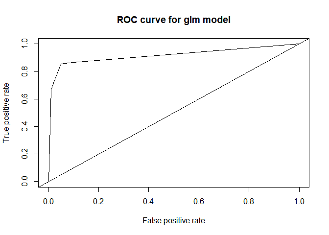
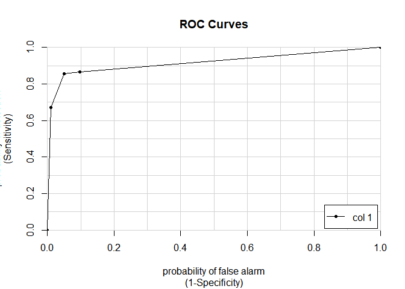

ADP ML with transaction dataset
================
jakinpilla
2019-04-26

``` r
rm(list=ls()); gc()
```

    ##          used (Mb) gc trigger (Mb) max used (Mb)
    ## Ncells 510096 27.3    1152842 61.6   609148 32.6
    ## Vcells 990176  7.6    8388608 64.0  1598968 12.2

``` r
getwd()
```

    ## [1] "C:/Users/Daniel/ADP_performance_test"

Data Wraggling \> Sectecting vars \> Spilting Data \> Modeling \>
Evaluating \> Comparing \> Predicting…

Date Loading—-

``` r
data_with_gender <- read_csv('./data/data_total_with_gender_final.csv') 
```

    ## Parsed with column specification:
    ## cols(
    ##   .default = col_double(),
    ##   custid = col_character(),
    ##   gender = col_character(),
    ##   top_prod = col_character()
    ## )

    ## See spec(...) for full column specifications.

``` r
data_with_gender %>%
  select(custid, gender) -> cust_gender

data_total <- read_csv('./data/data_total.csv') 
```

    ## Parsed with column specification:
    ## cols(
    ##   .default = col_double(),
    ##   custid = col_character(),
    ##   first_cnt.prod = col_character(),
    ##   second_cnt.prod = col_character(),
    ##   third_cnt.prod = col_character(),
    ##   first_money.prod_ct = col_character(),
    ##   second_money.prod_ct = col_character(),
    ##   third_money.prod_ct = col_character()
    ## )
    ## See spec(...) for full column specifications.

``` r
data_total %>% colnames()
```

    ##  [1] "custid"               "ct_dairy"             "ct_drink"            
    ##  [4] "ct_fastfood"          "ct_fruite"            "ct_house_prod"       
    ##  [7] "ct_makeup"            "ct_meat"              "ct_sauce"            
    ## [10] "ct_seafood"           "ct_snack"             "ct_vegetable"        
    ## [13] "coverage"             "g_paid"               "buyed_prod_num"      
    ## [16] "hf_6-11"              "hf_12-17"             "hf_18-23"            
    ## [19] "wdf_Sun"              "wdf_Mon"              "wdf_Tue"             
    ## [22] "wdf_Wed"              "wdf_Thu"              "wdf_Fri"             
    ## [25] "wdf_Sat"              "n_distinct(prod)"     "ct_cov"              
    ## [28] "vdays"                "day_mean_amt"         "day_cov"             
    ## [31] "first_cnt.prod"       "second_cnt.prod"      "third_cnt.prod"      
    ## [34] "first_money.prod_ct"  "second_money.prod_ct" "third_money.prod_ct"

``` r
cust_gender %>%
  left_join(data_total, by = "custid") -> data

data %>% colnames()
```

    ##  [1] "custid"               "gender"               "ct_dairy"            
    ##  [4] "ct_drink"             "ct_fastfood"          "ct_fruite"           
    ##  [7] "ct_house_prod"        "ct_makeup"            "ct_meat"             
    ## [10] "ct_sauce"             "ct_seafood"           "ct_snack"            
    ## [13] "ct_vegetable"         "coverage"             "g_paid"              
    ## [16] "buyed_prod_num"       "hf_6-11"              "hf_12-17"            
    ## [19] "hf_18-23"             "wdf_Sun"              "wdf_Mon"             
    ## [22] "wdf_Tue"              "wdf_Wed"              "wdf_Thu"             
    ## [25] "wdf_Fri"              "wdf_Sat"              "n_distinct(prod)"    
    ## [28] "ct_cov"               "vdays"                "day_mean_amt"        
    ## [31] "day_cov"              "first_cnt.prod"       "second_cnt.prod"     
    ## [34] "third_cnt.prod"       "first_money.prod_ct"  "second_money.prod_ct"
    ## [37] "third_money.prod_ct"

``` r
data %>%
  select_if(is.numeric) -> var_num

glimpse(var_num)
```

    ## Observations: 2,089
    ## Variables: 29
    ## $ ct_dairy           <dbl> 0.39, 0.01, 0.00, 0.07, 0.03, 0.00, 0.38, 0...
    ## $ ct_drink           <dbl> 0.61, 0.00, 0.10, 0.19, 0.02, 0.00, 0.00, 0...
    ## $ ct_fastfood        <dbl> 0.00, 0.11, 0.00, 0.15, 0.13, 1.00, 0.12, 0...
    ## $ ct_fruite          <dbl> 0.00, 0.24, 0.00, 0.12, 0.04, 0.00, 0.02, 0...
    ## $ ct_house_prod      <dbl> 0.00, 0.05, 0.00, 0.01, 0.36, 0.00, 0.00, 0...
    ## $ ct_makeup          <dbl> 0, 0, 0, 0, 0, 0, 0, 0, 0, 0, 0, 0, 0, 0, 0...
    ## $ ct_meat            <dbl> 0.00, 0.56, 0.50, 0.17, 0.29, 0.00, 0.00, 0...
    ## $ ct_sauce           <dbl> 0.00, 0.00, 0.23, 0.05, 0.05, 0.00, 0.08, 0...
    ## $ ct_seafood         <dbl> 0.00, 0.00, 0.00, 0.07, 0.03, 0.00, 0.24, 0...
    ## $ ct_snack           <dbl> 0.00, 0.00, 0.18, 0.00, 0.03, 0.00, 0.00, 0...
    ## $ ct_vegetable       <dbl> 0.00, 0.02, 0.00, 0.16, 0.04, 0.00, 0.18, 0...
    ## $ coverage           <dbl> 0.18, 0.55, 0.36, 0.82, 0.91, 0.09, 0.55, 0...
    ## $ g_paid             <dbl> 5840, 90168, 9980, 201546, 93693, 3980, 425...
    ## $ buyed_prod_num     <dbl> 2, 9, 4, 35, 22, 1, 11, 8, 17, 6, 6, 81, 10...
    ## $ `hf_6-11`          <dbl> 0.00, 0.28, 0.00, 0.23, 0.10, 1.00, 0.30, 0...
    ## $ `hf_12-17`         <dbl> 0.00, 0.72, 0.00, 0.77, 0.48, 0.00, 0.70, 0...
    ## $ `hf_18-23`         <dbl> 1.00, 0.00, 1.00, 0.00, 0.42, 0.00, 0.00, 1...
    ## $ wdf_Sun            <dbl> 0.00, 0.00, 0.00, 0.16, 0.05, 0.00, 0.00, 0...
    ## $ wdf_Mon            <dbl> 0.00, 0.00, 0.00, 0.19, 0.43, 0.00, 0.29, 0...
    ## $ wdf_Tue            <dbl> 0.00, 0.24, 0.50, 0.00, 0.03, 1.00, 0.44, 0...
    ## $ wdf_Wed            <dbl> 1.00, 0.05, 0.00, 0.07, 0.24, 0.00, 0.28, 0...
    ## $ wdf_Thu            <dbl> 0.00, 0.71, 0.00, 0.09, 0.15, 0.00, 0.00, 0...
    ## $ wdf_Fri            <dbl> 0.00, 0.00, 0.00, 0.00, 0.10, 0.00, 0.00, 0...
    ## $ wdf_Sat            <dbl> 0.00, 0.00, 0.50, 0.49, 0.00, 0.00, 0.00, 0...
    ## $ `n_distinct(prod)` <dbl> 2, 7, 4, 24, 15, 1, 9, 2, 13, 6, 6, 25, 8, ...
    ## $ ct_cov             <dbl> 2.1789812, 1.8126624, 1.6509274, 0.7624593,...
    ## $ vdays              <dbl> 1, 4, 2, 9, 15, 1, 4, 5, 9, 3, 1, 34, 9, 5,...
    ## $ day_mean_amt       <dbl> 5840.000, 22542.000, 4990.000, 22394.000, 6...
    ## $ day_cov            <dbl> 0.00000000, 0.60567863, 0.01133638, 0.46121...

Scaling and Making gender var ————————————————

``` r
scale(var_num) -> scaled_var_num # return matrix
as_tibble(scaled_var_num) -> var_num_tibble; head(var_num_tibble)
```

    ## # A tibble: 6 x 29
    ##   ct_dairy ct_drink ct_fastfood ct_fruite ct_house_prod ct_makeup ct_meat
    ##      <dbl>    <dbl>       <dbl>     <dbl>         <dbl>     <dbl>   <dbl>
    ## 1    1.18    2.25       -0.550    -0.585         -0.502    -0.103  -0.559
    ## 2   -0.544  -0.498       0.0104    0.545         -0.251    -0.103   2.17 
    ## 3   -0.590  -0.0467     -0.550    -0.585         -0.502    -0.103   1.88 
    ## 4   -0.271   0.359       0.214    -0.0200        -0.452    -0.103   0.270
    ## 5   -0.453  -0.408       0.112    -0.397          1.30     -0.103   0.856
    ## 6   -0.590  -0.498       4.54     -0.585         -0.502    -0.103  -0.559
    ## # ... with 22 more variables: ct_sauce <dbl>, ct_seafood <dbl>,
    ## #   ct_snack <dbl>, ct_vegetable <dbl>, coverage <dbl>, g_paid <dbl>,
    ## #   buyed_prod_num <dbl>, `hf_6-11` <dbl>, `hf_12-17` <dbl>,
    ## #   `hf_18-23` <dbl>, wdf_Sun <dbl>, wdf_Mon <dbl>, wdf_Tue <dbl>,
    ## #   wdf_Wed <dbl>, wdf_Thu <dbl>, wdf_Fri <dbl>, wdf_Sat <dbl>,
    ## #   `n_distinct(prod)` <dbl>, ct_cov <dbl>, vdays <dbl>,
    ## #   day_mean_amt <dbl>, day_cov <dbl>

``` r
data %>% 
  select(gender) %>%
  cbind(var_num_tibble) %>%
  as_tibble() -> data_with_sex.tibble
```

Changing gender var class into factor ————————————————

``` r
data_with_sex.tibble$gender  <- factor(data_with_sex.tibble$gender, 
                                       levels = c("f", "m"), labels = c(0, 1))

df <- data_with_sex.tibble
nrow(df)
```

    ## [1] 2089

Cleansing colname for ML with `janitor` package

``` r
library(janitor)
```

    ## Warning: package 'janitor' was built under R version 3.5.3

``` r
df <- clean_names(df)

df %>% glimpse()
```

    ## Observations: 2,089
    ## Variables: 30
    ## $ gender          <fct> 1, 0, 1, 0, 0, 1, 1, 1, 0, 0, 1, 0, 0, 0, 1, 1...
    ## $ ct_dairy        <dbl> 1.18441360, -0.54429715, -0.58978954, -0.27134...
    ## $ ct_drink        <dbl> 2.25395954, -0.49776793, -0.04666507, 0.359327...
    ## $ ct_fastfood     <dbl> -0.54967586, 0.01043241, -0.54967586, 0.214108...
    ## $ ct_fruite       <dbl> -0.58483560, 0.54486263, -0.58483560, -0.01998...
    ## $ ct_house_prod   <dbl> -0.50179444, -0.25118514, -0.50179444, -0.4516...
    ## $ ct_makeup       <dbl> -0.1029125, -0.1029125, -0.1029125, -0.1029125...
    ## $ ct_meat         <dbl> -0.55918674, 2.17273649, 1.88003043, 0.2701471...
    ## $ ct_sauce        <dbl> -0.31980041, -0.31980041, 1.81547619, 0.144390...
    ## $ ct_seafood      <dbl> -0.448944207, -0.448944207, -0.448944207, -0.0...
    ## $ ct_snack        <dbl> -0.55769047, -0.55769047, 0.25272370, -0.55769...
    ## $ ct_vegetable    <dbl> -0.4809438, -0.3569843, -0.4809438, 0.5107320,...
    ## $ coverage        <dbl> -0.8481238, 0.5147742, -0.1850923, 1.5093215, ...
    ## $ g_paid          <dbl> -0.6450602, 0.2675337, -0.6002573, 1.4728614, ...
    ## $ buyed_prod_num  <dbl> -0.6253433, -0.2413670, -0.5156358, 1.1848305,...
    ## $ hf_6_11         <dbl> -0.570354007, 0.423187794, -0.570354007, 0.245...
    ## $ hf_12_17        <dbl> -1.3857289, 0.5027235, -1.3857289, 0.6338660, ...
    ## $ hf_18_23        <dbl> 1.86677622, -0.84256864, 1.86677622, -0.842568...
    ## $ wdf_sun         <dbl> -0.573411716, -0.573411716, -0.573411716, 0.07...
    ## $ wdf_mon         <dbl> -0.57786739, -0.57786739, -0.57786739, 0.20105...
    ## $ wdf_tue         <dbl> -0.588748212, 0.425040782, 1.523312192, -0.588...
    ## $ wdf_wed         <dbl> 3.54459442, -0.39180520, -0.59898413, -0.30893...
    ## $ wdf_thu         <dbl> -0.62792177, 1.87235285, -0.62792177, -0.31098...
    ## $ wdf_fri         <dbl> -0.46553450, -0.46553450, -0.46553450, -0.4655...
    ## $ wdf_sat         <dbl> -0.59381451, -0.59381451, 1.41675067, 1.376539...
    ## $ n_distinct_prod <dbl> -0.75343266, -0.16976403, -0.51996520, 1.81470...
    ## $ ct_cov          <dbl> 0.3205771, -0.1391285, -0.3420951, -1.4570630,...
    ## $ vdays           <dbl> -0.68948230, -0.37458756, -0.58451739, 0.15023...
    ## $ day_mean_amt    <dbl> -0.382789998, 1.874083518, -0.497647051, 1.854...
    ## $ day_cov         <dbl> -1.33151414, 0.08129379, -1.30507086, -0.25568...

``` r
colnames(df) <- colnames(df) %>% make.names()
```

ML ————————————————

Data splitting ————————————————

``` r
idx <- caret::createDataPartition(df$gender, p=c(.6, .4), list=F); 
idx[1:10]; length(idx)
```

    ##  [1]  1  2  3  4  5  6  8  9 10 12

    ## [1] 1255

df.train data ————————————————

``` r
df.train <- df[idx, ]
df.valid.test <- df[-idx, ]

nrow(df.train)
```

    ## [1] 1255

``` r
nrow(df.valid.test)
```

    ## [1] 834

``` r
dim(df.train)
```

    ## [1] 1255   30

``` r
head(df.train)
```

    ## # A tibble: 6 x 30
    ##   gender ct_dairy ct_drink ct_fastfood ct_fruite ct_house_prod ct_makeup
    ##   <fct>     <dbl>    <dbl>       <dbl>     <dbl>         <dbl>     <dbl>
    ## 1 1         1.18    2.25       -0.550    -0.585         -0.502    -0.103
    ## 2 0        -0.544  -0.498       0.0104    0.545         -0.251    -0.103
    ## 3 1        -0.590  -0.0467     -0.550    -0.585         -0.502    -0.103
    ## 4 0        -0.271   0.359       0.214    -0.0200        -0.452    -0.103
    ## 5 0        -0.453  -0.408       0.112    -0.397          1.30     -0.103
    ## 6 1        -0.590  -0.498       4.54     -0.585         -0.502    -0.103
    ## # ... with 23 more variables: ct_meat <dbl>, ct_sauce <dbl>,
    ## #   ct_seafood <dbl>, ct_snack <dbl>, ct_vegetable <dbl>, coverage <dbl>,
    ## #   g_paid <dbl>, buyed_prod_num <dbl>, hf_6_11 <dbl>, hf_12_17 <dbl>,
    ## #   hf_18_23 <dbl>, wdf_sun <dbl>, wdf_mon <dbl>, wdf_tue <dbl>,
    ## #   wdf_wed <dbl>, wdf_thu <dbl>, wdf_fri <dbl>, wdf_sat <dbl>,
    ## #   n_distinct_prod <dbl>, ct_cov <dbl>, vdays <dbl>, day_mean_amt <dbl>,
    ## #   day_cov <dbl>

Validation data ————————————————

``` r
head(df.valid.test)
```

    ## # A tibble: 6 x 30
    ##   gender ct_dairy ct_drink ct_fastfood ct_fruite ct_house_prod ct_makeup
    ##   <fct>     <dbl>    <dbl>       <dbl>     <dbl>         <dbl>     <dbl>
    ## 1 1         1.14    -0.498      0.0614    -0.491        -0.502    -0.103
    ## 2 1        -0.590   -0.498      1.59      -0.585         0.751    -0.103
    ## 3 1        -0.590   -0.498     -0.550     -0.585        -0.502    -0.103
    ## 4 0        -0.590   -0.498     -0.550      2.52          0.701    -0.103
    ## 5 0         0.275    0.495      0.774     -0.585        -0.301    -0.103
    ## 6 1        -0.590   -0.498      4.54      -0.585        -0.502    -0.103
    ## # ... with 23 more variables: ct_meat <dbl>, ct_sauce <dbl>,
    ## #   ct_seafood <dbl>, ct_snack <dbl>, ct_vegetable <dbl>, coverage <dbl>,
    ## #   g_paid <dbl>, buyed_prod_num <dbl>, hf_6_11 <dbl>, hf_12_17 <dbl>,
    ## #   hf_18_23 <dbl>, wdf_sun <dbl>, wdf_mon <dbl>, wdf_tue <dbl>,
    ## #   wdf_wed <dbl>, wdf_thu <dbl>, wdf_fri <dbl>, wdf_sat <dbl>,
    ## #   n_distinct_prod <dbl>, ct_cov <dbl>, vdays <dbl>, day_mean_amt <dbl>,
    ## #   day_cov <dbl>

``` r
idx <- createDataPartition(df.valid.test$gender, p=c(.5, .5), list=F)
idx[1:5]; length(idx)
```

    ## [1] 1 2 3 4 5

    ## [1] 417

``` r
df.valid <- df.valid.test[idx, ]
df.test <- df.valid.test[-idx, ]

dim(df.valid); head(df.valid)
```

    ## [1] 417  30

    ## # A tibble: 6 x 30
    ##   gender ct_dairy ct_drink ct_fastfood ct_fruite ct_house_prod ct_makeup
    ##   <fct>     <dbl>    <dbl>       <dbl>     <dbl>         <dbl>     <dbl>
    ## 1 1         1.14   -0.498       0.0614    -0.491        -0.502    -0.103
    ## 2 1        -0.590  -0.498       1.59      -0.585         0.751    -0.103
    ## 3 1        -0.590  -0.498      -0.550     -0.585        -0.502    -0.103
    ## 4 0        -0.590  -0.498      -0.550      2.52          0.701    -0.103
    ## 5 0         0.275   0.495       0.774     -0.585        -0.301    -0.103
    ## 6 1        -0.590  -0.0467     -0.550     -0.585        -0.502    -0.103
    ## # ... with 23 more variables: ct_meat <dbl>, ct_sauce <dbl>,
    ## #   ct_seafood <dbl>, ct_snack <dbl>, ct_vegetable <dbl>, coverage <dbl>,
    ## #   g_paid <dbl>, buyed_prod_num <dbl>, hf_6_11 <dbl>, hf_12_17 <dbl>,
    ## #   hf_18_23 <dbl>, wdf_sun <dbl>, wdf_mon <dbl>, wdf_tue <dbl>,
    ## #   wdf_wed <dbl>, wdf_thu <dbl>, wdf_fri <dbl>, wdf_sat <dbl>,
    ## #   n_distinct_prod <dbl>, ct_cov <dbl>, vdays <dbl>, day_mean_amt <dbl>,
    ## #   day_cov <dbl>

``` r
dim(df.test); head(df.test)
```

    ## [1] 417  30

    ## # A tibble: 6 x 30
    ##   gender ct_dairy ct_drink ct_fastfood ct_fruite ct_house_prod ct_makeup
    ##   <fct>     <dbl>    <dbl>       <dbl>     <dbl>         <dbl>     <dbl>
    ## 1 1        -0.590   -0.498       4.54     -0.585        -0.502    -0.103
    ## 2 1        -0.590   -0.498      -0.550     2.33         -0.502    -0.103
    ## 3 0        -0.453   -0.408       0.876    -0.585         1.45     -0.103
    ## 4 1        -0.590   -0.498      -0.550    -0.585         1.50     -0.103
    ## 5 0        -0.180   -0.498      -0.550    -0.585        -0.502    -0.103
    ## 6 1        -0.590   -0.498      -0.550     1.77         -0.502    -0.103
    ## # ... with 23 more variables: ct_meat <dbl>, ct_sauce <dbl>,
    ## #   ct_seafood <dbl>, ct_snack <dbl>, ct_vegetable <dbl>, coverage <dbl>,
    ## #   g_paid <dbl>, buyed_prod_num <dbl>, hf_6_11 <dbl>, hf_12_17 <dbl>,
    ## #   hf_18_23 <dbl>, wdf_sun <dbl>, wdf_mon <dbl>, wdf_tue <dbl>,
    ## #   wdf_wed <dbl>, wdf_thu <dbl>, wdf_fri <dbl>, wdf_sat <dbl>,
    ## #   n_distinct_prod <dbl>, ct_cov <dbl>, vdays <dbl>, day_mean_amt <dbl>,
    ## #   day_cov <dbl>

``` r
1255 + 417 + 417 
```

    ## [1] 2089

There are disappeared data which have NA values and so on ——————-

Model Training with df.train dataset ————————————————

Setting fitControl ————————————————

``` r
fitControl <- trainControl(method='repeatedcv', 
                           number=10,
                           repeats = 3)
```

Models Fitting ————————————————

GLM ————————————————

``` r
colnames(df.train) %>% make.names() -> colnames(df.train)
colnames(df.test) %>% make.names() -> colnames(df.test)

glm_m <- train(gender ~ ., data = df.train, 
               method = 'glm', 
               trControl = fitControl,
               family = binomial(link='logit'))

glm_m
```

    ## Generalized Linear Model 
    ## 
    ## 1255 samples
    ##   29 predictor
    ##    2 classes: '0', '1' 
    ## 
    ## No pre-processing
    ## Resampling: Cross-Validated (10 fold, repeated 3 times) 
    ## Summary of sample sizes: 1129, 1130, 1130, 1130, 1129, 1130, ... 
    ## Resampling results:
    ## 
    ##   Accuracy   Kappa    
    ##   0.8943005  0.7370877

CART ————————————————

``` r
cart_m <- train(gender ~ ., data = df.train, 
                method = 'rpart',
                trControl = fitControl)

cart_m
```

    ## CART 
    ## 
    ## 1255 samples
    ##   29 predictor
    ##    2 classes: '0', '1' 
    ## 
    ## No pre-processing
    ## Resampling: Cross-Validated (10 fold, repeated 3 times) 
    ## Summary of sample sizes: 1130, 1129, 1129, 1130, 1129, 1129, ... 
    ## Resampling results across tuning parameters:
    ## 
    ##   cp           Accuracy   Kappa    
    ##   0.008356546  0.9038640  0.7555820
    ##   0.020891365  0.9028164  0.7486942
    ##   0.643454039  0.8219317  0.4340738
    ## 
    ## Accuracy was used to select the optimal model using the largest value.
    ## The final value used for the model was cp = 0.008356546.

`The final value used for the model was cp = 0.006963788` mean?

RF ————————————————

``` r
rf_m <- train(gender ~ ., data = df.train, method='rf', 
              trControl=fitControl)
rf_m
```

    ## Random Forest 
    ## 
    ## 1255 samples
    ##   29 predictor
    ##    2 classes: '0', '1' 
    ## 
    ## No pre-processing
    ## Resampling: Cross-Validated (10 fold, repeated 3 times) 
    ## Summary of sample sizes: 1130, 1130, 1129, 1129, 1129, 1130, ... 
    ## Resampling results across tuning parameters:
    ## 
    ##   mtry  Accuracy   Kappa    
    ##    2    0.9038490  0.7506659
    ##   15    0.9046446  0.7560568
    ##   29    0.8987970  0.7417269
    ## 
    ## Accuracy was used to select the optimal model using the largest value.
    ## The final value used for the model was mtry = 15.

Model Evaluating ————————————————

``` r
model_arch <- df.valid %>% # model_val
  mutate(GLM  = predict(glm_m, df.valid),
         CART = predict(cart_m, df.valid),
         RF = predict(rf_m, df.valid))

model_arch %>%
  select('gender', 'GLM', 'CART', 'RF') -> model_pred_result; model_pred_result
```

    ## # A tibble: 417 x 4
    ##    gender GLM   CART  RF   
    ##    <fct>  <fct> <fct> <fct>
    ##  1 1      0     0     0    
    ##  2 1      0     0     0    
    ##  3 1      1     1     1    
    ##  4 0      0     0     0    
    ##  5 0      0     0     0    
    ##  6 1      0     0     0    
    ##  7 1      1     1     1    
    ##  8 1      1     1     1    
    ##  9 1      1     1     1    
    ## 10 1      1     1     1    
    ## # ... with 407 more rows

``` r
library(yardstick)
```

    ## For binary classification, the first factor level is assumed to be the event.
    ## Set the global option `yardstick.event_first` to `FALSE` to change this.

    ## 
    ## Attaching package: 'yardstick'

    ## The following objects are masked from 'package:caret':
    ## 
    ##     precision, recall

    ## The following object is masked from 'package:readr':
    ## 
    ##     spec

``` r
metrics(model_arch, truth=gender, estimate = GLM)
```

    ## # A tibble: 2 x 3
    ##   .metric  .estimator .estimate
    ##   <chr>    <chr>          <dbl>
    ## 1 accuracy binary         0.909
    ## 2 kap      binary         0.768

``` r
metrics(model_arch, truth=gender, estimate = CART)
```

    ## # A tibble: 2 x 3
    ##   .metric  .estimator .estimate
    ##   <chr>    <chr>          <dbl>
    ## 1 accuracy binary         0.906
    ## 2 kap      binary         0.763

``` r
metrics(model_arch, truth=gender, estimate = RF)
```

    ## # A tibble: 2 x 3
    ##   .metric  .estimator .estimate
    ##   <chr>    <chr>          <dbl>
    ## 1 accuracy binary         0.911
    ## 2 kap      binary         0.774

RF is winner…

``` r
varImp(rf_m)
```

    ## rf variable importance
    ## 
    ##   only 20 most important variables shown (out of 29)
    ## 
    ##                 Overall
    ## ct_cov          100.000
    ## coverage         54.781
    ## day_cov          21.575
    ## n_distinct_prod  19.457
    ## hf_12_17         13.944
    ## g_paid            9.931
    ## buyed_prod_num    9.725
    ## hf_18_23          8.266
    ## day_mean_amt      7.780
    ## vdays             7.668
    ## ct_fruite         4.811
    ## ct_snack          4.506
    ## ct_meat           4.440
    ## wdf_tue           4.216
    ## ct_vegetable      4.078
    ## ct_dairy          3.254
    ## ct_house_prod     3.046
    ## wdf_wed           2.852
    ## wdf_sat           2.745
    ## ct_drink          2.708

Predict with winner model and test datset
————————————————

``` r
predict(rf_m, df.test, type='prob') %>% write_csv("./data/predicted_data.csv")

y_hat_rf <- predict(cart_m, df.test, type='prob')$`1`
y_hat_rf[1:10]
```

    ##  [1] 0.9638554 0.3125000 0.0627907 0.0627907 0.0627907 0.0627907 0.0627907
    ##  [8] 0.0627907 0.0627907 0.0627907

``` r
y_obs <- df.test$gender
```

ROC curve and AUC ————————————————

``` r
library(ROCR)
```

Prediction Objection :: Probability and Labels ————————————————

``` r
pred_rf <- prediction(y_hat_rf, y_obs) 
```

Performance Object :: Prediction Object, ‘tpr’, ‘fpr’ ————————————————

``` r
perf_rf <- performance(pred_rf, 'tpr', 'fpr')
```

ROC Curve ————————————————

``` r
plot(perf_rf, main='ROC curve for glm model') 
abline(0,1)
```

<!-- -->

Instead ————————————————

``` r
library(caTools)
colAUC(y_hat_rf, y_obs, plotROC = T)
```

<!-- -->

    ##              [,1]
    ## 0 vs. 1 0.8945491

AUC ————————————————

``` r
performance(pred_rf, 'auc')@y.values[[1]] # auc
```

    ## [1] 0.8945491

xgBoost—-

Evaluation with validation data—-

``` r
model_arch <- df.valid %>% # model_val
  mutate(GLM  = predict(glm_m, df.valid),
         CART = predict(cart_m, df.valid),
         RF = predict(rf_m, df.valid))
         # XGB = predict(xgboost_m, df.valid))

model_arch %>%
  select(gender, GLM, CART, RF) -> model_pred_result # select(gender, GLM, CART, RF, XGB)

head(model_pred_result, 30)
```

    ## # A tibble: 30 x 4
    ##    gender GLM   CART  RF   
    ##    <fct>  <fct> <fct> <fct>
    ##  1 1      0     0     0    
    ##  2 1      0     0     0    
    ##  3 1      1     1     1    
    ##  4 0      0     0     0    
    ##  5 0      0     0     0    
    ##  6 1      0     0     0    
    ##  7 1      1     1     1    
    ##  8 1      1     1     1    
    ##  9 1      1     1     1    
    ## 10 1      1     1     1    
    ## # ... with 20 more rows

``` r
library(yardstick)

metrics(model_arch, truth=gender, estimate = GLM)
```

    ## # A tibble: 2 x 3
    ##   .metric  .estimator .estimate
    ##   <chr>    <chr>          <dbl>
    ## 1 accuracy binary         0.909
    ## 2 kap      binary         0.768

``` r
metrics(model_arch, truth=gender, estimate = CART)
```

    ## # A tibble: 2 x 3
    ##   .metric  .estimator .estimate
    ##   <chr>    <chr>          <dbl>
    ## 1 accuracy binary         0.906
    ## 2 kap      binary         0.763

``` r
metrics(model_arch, truth=gender, estimate = RF)
```

    ## # A tibble: 2 x 3
    ##   .metric  .estimator .estimate
    ##   <chr>    <chr>          <dbl>
    ## 1 accuracy binary         0.911
    ## 2 kap      binary         0.774

``` r
# metrics(model_arch, truth=gender, estimate = XGB)

predict(rf_m, df.valid, type='prob') %>% head()
```

    ##       0     1
    ## 1 0.992 0.008
    ## 2 0.754 0.246
    ## 3 0.024 0.976
    ## 4 0.808 0.192
    ## 5 0.998 0.002
    ## 6 0.942 0.058

Model performance

``` r
df.test_perf <- df.test %>% # model_test
  mutate(GLM = predict(glm_m, df.test),
         CART = predict(cart_m, df.test),
         RF = predict(rf_m, df.test))
         # XGB = predict(xgboost_m, df.test))

metrics(df.test_perf, truth=gender, estimate = GLM)
```

    ## # A tibble: 2 x 3
    ##   .metric  .estimator .estimate
    ##   <chr>    <chr>          <dbl>
    ## 1 accuracy binary         0.894
    ## 2 kap      binary         0.736

``` r
metrics(df.test_perf, truth=gender, estimate = CART)
```

    ## # A tibble: 2 x 3
    ##   .metric  .estimator .estimate
    ##   <chr>    <chr>          <dbl>
    ## 1 accuracy binary         0.902
    ## 2 kap      binary         0.748

``` r
metrics(df.test_perf, truth=gender, estimate = RF)
```

    ## # A tibble: 2 x 3
    ##   .metric  .estimator .estimate
    ##   <chr>    <chr>          <dbl>
    ## 1 accuracy binary         0.914
    ## 2 kap      binary         0.782

``` r
# metrics(df.test_perf, truth=gender, estimate = XGB)
```
