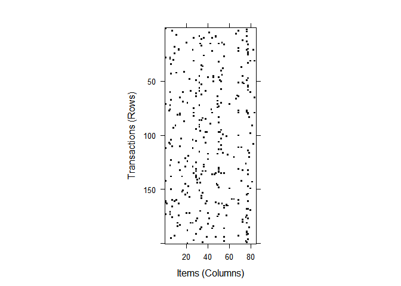
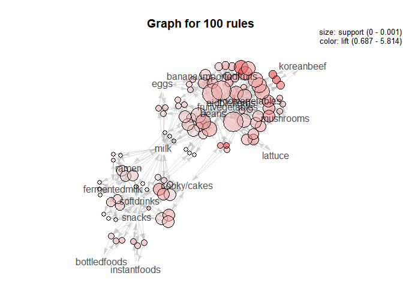
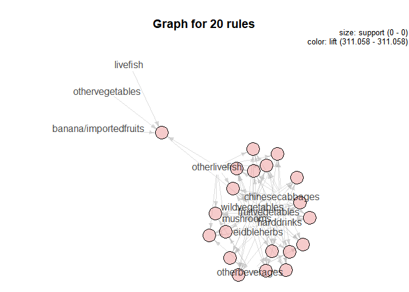
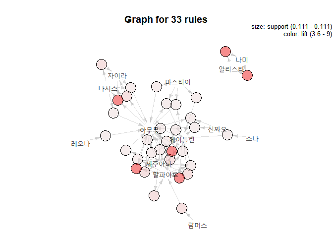

ADP ML\_2\_apriori
================
jakinpilla
2019-05-02

Data loading—-

``` r
tran <- read.csv('./data/transaction.csv', stringsAsFactors = F)
head(tran); dim(tran) ## 27,993건의 거래내역
```

    ##          ymd  time custid             prod  amt
    ## 1 2012-04-01 10:00  C2048       softdrinks  700
    ## 2 2012-04-01 10:00  C2069    fermentedmilk 2990
    ## 3 2012-04-01 10:00  C2069 chilledlivestock 5980
    ## 4 2012-04-01 10:00  C2069      cooky/cakes 3200
    ## 5 2012-04-01 10:00  C2069        mushrooms 1000
    ## 6 2012-04-01 10:00  C0211            bread 5200

    ## [1] 27993     5

Invoice numbering—-

``` r
i=0
group_number = (function(){i = 0; function() i <<- i+1 })()
# df %>% group_by(u,v) %>% mutate(label = group_number())
tran %>% 
  arrange(ymd, time, custid) %>%
  group_by(ymd, time, custid) %>%
  mutate(basket_id = group_number()) %>%
  as.data.frame() %>% # to avoid adding grouped var...
  select(basket_id, prod) -> tran_basket; head(tran_basket)
```

    ##   basket_id             prod
    ## 1         1            bread
    ## 2         2 laundrydetergent
    ## 3         3       softdrinks
    ## 4         4    fermentedmilk
    ## 5         4 chilledlivestock
    ## 6         4      cooky/cakes

Make basket.transaction and basket.transaction sparse format—-

``` r
basket.transaction <- split(tran_basket$prod, tran_basket$basket_id)
basket.transaction[1:5] # list class... 
```

    ## $`1`
    ## [1] "bread"
    ## 
    ## $`2`
    ## [1] "laundrydetergent"
    ## 
    ## $`3`
    ## [1] "softdrinks"
    ## 
    ## $`4`
    ## [1] "fermentedmilk"    "chilledlivestock" "cooky/cakes"     
    ## [4] "mushrooms"       
    ## 
    ## $`5`
    ## [1] "beans"     "mushrooms"

``` r
basket.transaction <- as(basket.transaction, 'transactions')
```

    ## Warning in asMethod(object): removing duplicated items in transactions

``` r
basket.transaction # transaction class...
```

    ## transactions in sparse format with
    ##  16175 transactions (rows) and
    ##  84 items (columns)

1\~5 baskets ————————————————————-

``` r
inspect(basket.transaction[1:5])
```

    ##     items              transactionID
    ## [1] {bread}                        1
    ## [2] {laundrydetergent}             2
    ## [3] {softdrinks}                   3
    ## [4] {chilledlivestock,              
    ##      cooky/cakes,                   
    ##      fermentedmilk,                 
    ##      mushrooms}                    4
    ## [5] {beans,                         
    ##      mushrooms}                    5

Item Frequency :: itemFrequency()———————————————————-

``` r
itemFrequency(basket.transaction[, 1:5])
```

    ##      apple/sweetmelon     artificialpowders          babyproducts 
    ##           0.023369397           0.009768161           0.002720247 
    ##                bakery banana/importedfruits 
    ##           0.014528594           0.044698609

Item Frequency Plot :: itemFrequencyPlot() ——————————

``` r
itemFrequencyPlot(basket.transaction, topN = 20)
```

<!-- -->

``` r
itemFrequencyPlot(basket.transaction, support = .05, 
                  main = 'item frequency plot above support 1%')
```

<!-- -->

Visualize Sparse Marix ——————————

``` r
# windows()
image(basket.transaction[1:100]) # 100 transaction, 100 items...
```

<!-- -->

200 transaction, 100 items….

``` r
image(sample(basket.transaction, 200))
```

<!-- -->

How to set support and confidence? ——————————

``` r
groceryrules <- apriori(basket.transaction) # rule :: 0ro6>?
```

    ## Apriori
    ## 
    ## Parameter specification:
    ##  confidence minval smax arem  aval originalSupport maxtime support minlen
    ##         0.8    0.1    1 none FALSE            TRUE       5     0.1      1
    ##  maxlen target   ext
    ##      10  rules FALSE
    ## 
    ## Algorithmic control:
    ##  filter tree heap memopt load sort verbose
    ##     0.1 TRUE TRUE  FALSE TRUE    2    TRUE
    ## 
    ## Absolute minimum support count: 1617 
    ## 
    ## set item appearances ...[0 item(s)] done [0.00s].
    ## set transactions ...[84 item(s), 16175 transaction(s)] done [0.01s].
    ## sorting and recoding items ... [0 item(s)] done [0.00s].
    ## creating transaction tree ... done [0.00s].
    ## checking subsets of size 1 done [0.00s].
    ## writing ... [0 rule(s)] done [0.00s].
    ## creating S4 object  ... done [0.00s].

``` r
groceryrules <- apriori(basket.transaction, parameter = list(support =0.0001, 
                                                    confidence = 0.0001,
                                                    minlen = 2))
```

    ## Apriori
    ## 
    ## Parameter specification:
    ##  confidence minval smax arem  aval originalSupport maxtime support minlen
    ##       1e-04    0.1    1 none FALSE            TRUE       5   1e-04      2
    ##  maxlen target   ext
    ##      10  rules FALSE
    ## 
    ## Algorithmic control:
    ##  filter tree heap memopt load sort verbose
    ##     0.1 TRUE TRUE  FALSE TRUE    2    TRUE
    ## 
    ## Absolute minimum support count: 1 
    ## 
    ## set item appearances ...[0 item(s)] done [0.00s].
    ## set transactions ...[84 item(s), 16175 transaction(s)] done [0.01s].
    ## sorting and recoding items ... [84 item(s)] done [0.00s].
    ## creating transaction tree ... done [0.01s].
    ## checking subsets of size 1 2 3 4 5 6 7 8 done [0.00s].
    ## writing ... [14487 rule(s)] done [0.00s].
    ## creating S4 object  ... done [0.00s].

``` r
summary(groceryrules)
```

    ## set of 14487 rules
    ## 
    ## rule length distribution (lhs + rhs):sizes
    ##    2    3    4    5    6    7    8 
    ## 4204 7848 1700  485  186   56    8 
    ## 
    ##    Min. 1st Qu.  Median    Mean 3rd Qu.    Max. 
    ##   2.000   2.000   3.000   2.951   3.000   8.000 
    ## 
    ## summary of quality measures:
    ##     support            confidence            lift         
    ##  Min.   :0.0001236   Min.   :0.001421   Min.   :  0.1681  
    ##  1st Qu.:0.0001236   1st Qu.:0.036420   1st Qu.:  1.2555  
    ##  Median :0.0001236   Median :0.103448   Median :  2.8720  
    ##  Mean   :0.0002793   Mean   :0.226284   Mean   :  9.1546  
    ##  3rd Qu.:0.0002473   3rd Qu.:0.272727   3rd Qu.:  7.6010  
    ##  Max.   :0.0072334   Max.   :1.000000   Max.   :311.0577  
    ##      count        
    ##  Min.   :  2.000  
    ##  1st Qu.:  2.000  
    ##  Median :  2.000  
    ##  Mean   :  4.518  
    ##  3rd Qu.:  4.000  
    ##  Max.   :117.000  
    ## 
    ## mining info:
    ##                data ntransactions support confidence
    ##  basket.transaction         16175   1e-04      1e-04

``` r
inspect(groceryrules[1:5])
```

    ##     lhs               rhs            support      confidence  lift    
    ## [1] {powderedmilk} => {harddrinks}   0.0001236476 0.125000000 2.174059
    ## [2] {harddrinks}   => {powderedmilk} 0.0001236476 0.002150538 2.174059
    ## [3] {importedpork} => {cooky/cakes}  0.0001854714 0.176470588 3.236295
    ## [4] {cooky/cakes}  => {importedpork} 0.0001854714 0.003401361 3.236295
    ## [5] {importedpork} => {eidbleherbs}  0.0002472952 0.235294118 4.781259
    ##     count
    ## [1] 2    
    ## [2] 2    
    ## [3] 3    
    ## [4] 3    
    ## [5] 4

Arrange by support ——————————

``` r
inspect(sort(groceryrules, by='support')[1:5])
```

    ##     lhs                  rhs               support     confidence lift    
    ## [1] {beans}           => {fruitvegetables} 0.007233385 0.11079545 1.684320
    ## [2] {fruitvegetables} => {beans}           0.007233385 0.10996241 1.684320
    ## [3] {snacks}          => {softdrinks}      0.006367852 0.11444444 1.314729
    ## [4] {softdrinks}      => {snacks}          0.006367852 0.07315341 1.314729
    ## [5] {eidbleherbs}     => {fruitvegetables} 0.005811437 0.11809045 1.795219
    ##     count
    ## [1] 117  
    ## [2] 117  
    ## [3] 103  
    ## [4] 103  
    ## [5]  94

Arrange by lift ——————————

``` r
inspect(sort(groceryrules, by = "lift")[1:5])
```

    ##     lhs                  rhs                   support confidence     lift count
    ## [1] {chinesecabbages,                                                           
    ##      otherbeverages,                                                            
    ##      otherlivefish}   => {wildvegetables} 0.0001236476          1 311.0577     2
    ## [2] {chinesecabbages,                                                           
    ##      eidbleherbs,                                                               
    ##      otherbeverages}  => {wildvegetables} 0.0001236476          1 311.0577     2
    ## [3] {chinesecabbages,                                                           
    ##      fruitvegetables,                                                           
    ##      otherbeverages}  => {wildvegetables} 0.0001236476          1 311.0577     2
    ## [4] {mushrooms,                                                                 
    ##      otherbeverages,                                                            
    ##      otherlivefish}   => {wildvegetables} 0.0001236476          1 311.0577     2
    ## [5] {harddrinks,                                                                
    ##      mushrooms,                                                                 
    ##      otherbeverages}  => {wildvegetables} 0.0001236476          1 311.0577     2

Find rules which contrain `harddrinks` item ——————————

``` r
harddrinks_rules <- subset(groceryrules, items %in% "harddrinks")
inspect(harddrinks_rules[1:5])
```

    ##     lhs                      rhs            support      confidence 
    ## [1] {powderedmilk}        => {harddrinks}   0.0001236476 0.125000000
    ## [2] {harddrinks}          => {powderedmilk} 0.0001236476 0.002150538
    ## [3] {babyproducts}        => {harddrinks}   0.0002472952 0.090909091
    ## [4] {harddrinks}          => {babyproducts} 0.0002472952 0.004301075
    ## [5] {pre-processedsnacks} => {harddrinks}   0.0003709428 0.103448276
    ##     lift     count
    ## [1] 2.174059 2    
    ## [2] 2.174059 2    
    ## [3] 1.581134 4    
    ## [4] 1.581134 4    
    ## [5] 1.799221 6

Item based rules finding ——————————

``` r
rule_interest_lhs <- subset(groceryrules, lhs %in% c('icecream'))
inspect(rule_interest_lhs[1:5])
```

    ##     lhs           rhs                  support      confidence  lift     
    ## [1] {icecream} => {cosmetics}          0.0002472952 0.008565310 1.4431656
    ## [2] {icecream} => {ready-mademeals}    0.0001236476 0.004282655 0.5631866
    ## [3] {icecream} => {pre-processedmeals} 0.0001236476 0.004282655 0.6474014
    ## [4] {icecream} => {dryfruits}          0.0001236476 0.004282655 0.6535089
    ## [5] {icecream} => {processedlivefish}  0.0001236476 0.004282655 0.8658994
    ##     count
    ## [1] 4    
    ## [2] 2    
    ## [3] 2    
    ## [4] 2    
    ## [5] 2

%in%, %pin%, %ain% ——————————

``` r
# %in% :: at least one item rule matched rules' indexing 
# %pin% :: partially name character matched rules' indexing
# %ain% :: totallgy matched rules' indexing

rule_interest_lhs <- subset(groceryrules, lhs %in% c('bread', 'milk'))
inspect(rule_interest_lhs[1:5])
```

    ##     lhs       rhs                   support      confidence  lift    
    ## [1] {milk} => {koreanconfectionary} 0.0002472952 0.002836879 1.349604
    ## [2] {milk} => {babyproducts}        0.0003091190 0.003546099 1.303594
    ## [3] {milk} => {pre-processedsnacks} 0.0002472952 0.002836879 0.791147
    ## [4] {milk} => {frozenmeat}          0.0003091190 0.003546099 1.147163
    ## [5] {milk} => {fastfoods}           0.0004327666 0.004964539 1.131006
    ##     count
    ## [1] 4    
    ## [2] 5    
    ## [3] 4    
    ## [4] 5    
    ## [5] 7

``` r
rule_interest_lhs <- subset(groceryrules, lhs %pin% c('mi')) # if "mi" character is contained in the rule, the rules are detected...
inspect(rule_interest_lhs[1:5]) 
```

    ##     lhs               rhs                   support      confidence 
    ## [1] {powderedmilk} => {harddrinks}          0.0001236476 0.125000000
    ## [2] {milk}         => {koreanconfectionary} 0.0002472952 0.002836879
    ## [3] {minorcereals} => {babyproducts}        0.0001236476 0.008097166
    ## [4] {milk}         => {babyproducts}        0.0003091190 0.003546099
    ## [5] {minorcereals} => {pre-processedsnacks} 0.0001236476 0.008097166
    ##     lift     count
    ## [1] 2.174059 2    
    ## [2] 1.349604 4    
    ## [3] 2.976629 2    
    ## [4] 1.303594 5    
    ## [5] 2.258132 2

``` r
rule_interest_lhs <- subset(groceryrules, lhs %ain% c('cooky/cakes', 'fermentedmilk'))
inspect(rule_interest_lhs[1:5])
```

    ##     lhs                            rhs            support      confidence
    ## [1] {cooky/cakes,fermentedmilk} => {seasonedmeat} 0.0001236476 0.04166667
    ## [2] {cooky/cakes,fermentedmilk} => {noodles}      0.0001236476 0.04166667
    ## [3] {cooky/cakes,fermentedmilk} => {bakery}       0.0001854714 0.06250000
    ## [4] {cooky/cakes,fermentedmilk} => {candy-gum}    0.0001236476 0.04166667
    ## [5] {cooky/cakes,fermentedmilk} => {seasonings}   0.0001236476 0.04166667
    ##     lift     count
    ## [1] 7.325634 2    
    ## [2] 3.547149 2    
    ## [3] 4.301862 3    
    ## [4] 2.674438 2    
    ## [5] 2.808160 2

Write groceryrules(write()) ——————————

``` r
write(harddrinks_rules, file = "./data/harddrinks_rules.csv", sep = ",", 
      quote = TRUE, row.names = FALSE)
```

Convert rules as datafame ——————————

``` r
harddrinks_rules_df <- as(harddrinks_rules, "data.frame")
str(harddrinks_rules_df)
```

    ## 'data.frame':    1566 obs. of  5 variables:
    ##  $ rules     : Factor w/ 1566 levels "{apple/sweetmelon,eidbleherbs} => {harddrinks}",..: 1529 1406 19 1353 1531 1408 806 1380 1532 1409 ...
    ##  $ support   : num  0.000124 0.000124 0.000247 0.000247 0.000371 ...
    ##  $ confidence: num  0.125 0.00215 0.09091 0.0043 0.10345 ...
    ##  $ lift      : num  2.17 2.17 1.58 1.58 1.8 ...
    ##  $ count     : num  2 2 4 4 6 6 2 2 4 4 ...

``` r
head(harddrinks_rules_df)
```

    ##                                     rules      support  confidence
    ## 1          {powderedmilk} => {harddrinks} 0.0001236476 0.125000000
    ## 2          {harddrinks} => {powderedmilk} 0.0001236476 0.002150538
    ## 77         {babyproducts} => {harddrinks} 0.0002472952 0.090909091
    ## 78         {harddrinks} => {babyproducts} 0.0002472952 0.004301075
    ## 105 {pre-processedsnacks} => {harddrinks} 0.0003709428 0.103448276
    ## 106 {harddrinks} => {pre-processedsnacks} 0.0003709428 0.006451613
    ##         lift count
    ## 1   2.174059     2
    ## 2   2.174059     2
    ## 77  1.581134     4
    ## 78  1.581134     4
    ## 105 1.799221     6
    ## 106 1.799221     6

``` r
harddrinks_rules_df[1:10, ] # %>% View()
```

    ##                                     rules      support  confidence
    ## 1          {powderedmilk} => {harddrinks} 0.0001236476 0.125000000
    ## 2          {harddrinks} => {powderedmilk} 0.0001236476 0.002150538
    ## 77         {babyproducts} => {harddrinks} 0.0002472952 0.090909091
    ## 78         {harddrinks} => {babyproducts} 0.0002472952 0.004301075
    ## 105 {pre-processedsnacks} => {harddrinks} 0.0003709428 0.103448276
    ## 106 {harddrinks} => {pre-processedsnacks} 0.0003709428 0.006451613
    ## 141          {frozenmeat} => {harddrinks} 0.0001236476 0.040000000
    ## 142          {harddrinks} => {frozenmeat} 0.0001236476 0.002150538
    ## 239  {processeddriedfish} => {harddrinks} 0.0002472952 0.072727273
    ## 240  {harddrinks} => {processeddriedfish} 0.0002472952 0.004301075
    ##          lift count
    ## 1   2.1740591     2
    ## 2   2.1740591     2
    ## 77  1.5811339     4
    ## 78  1.5811339     4
    ## 105 1.7992214     6
    ## 106 1.7992214     6
    ## 141 0.6956989     2
    ## 142 0.6956989     2
    ## 239 1.2649071     4
    ## 240 1.2649071     4

Visualization arules :: arulesViz ——————————

Plotting rules ——————————

``` r
groceryrules <- apriori(basket.transaction, parameter = list(support =0.0001, 
                                                             confidence = 0.0001,
                                                             minlen = 3))
```

    ## Apriori
    ## 
    ## Parameter specification:
    ##  confidence minval smax arem  aval originalSupport maxtime support minlen
    ##       1e-04    0.1    1 none FALSE            TRUE       5   1e-04      3
    ##  maxlen target   ext
    ##      10  rules FALSE
    ## 
    ## Algorithmic control:
    ##  filter tree heap memopt load sort verbose
    ##     0.1 TRUE TRUE  FALSE TRUE    2    TRUE
    ## 
    ## Absolute minimum support count: 1 
    ## 
    ## set item appearances ...[0 item(s)] done [0.00s].
    ## set transactions ...[84 item(s), 16175 transaction(s)] done [0.00s].
    ## sorting and recoding items ... [84 item(s)] done [0.00s].
    ## creating transaction tree ... done [0.00s].
    ## checking subsets of size 1 2 3 4 5 6 7 8 done [0.00s].
    ## writing ... [10283 rule(s)] done [0.00s].
    ## creating S4 object  ... done [0.01s].

``` r
plot(groceryrules)
```

    ## To reduce overplotting, jitter is added! Use jitter = 0 to prevent jitter.

<!-- -->

``` r
plot(sort(groceryrules, by='support')[1:20], method='grouped')
```

<!-- -->

``` r
# windows()
plot(groceryrules, method='graph', control=list(type='items'),
     vertex.label.cex = .7, 
     edge.arrow.size= .3,
     edge.arrow.size= 2)
```

    ## Warning: Unknown control parameters: type, vertex.label.cex,
    ## edge.arrow.size, edge.arrow.size

    ## Available control parameters (with default values):
    ## main  =  Graph for 100 rules
    ## nodeColors    =  c("#66CC6680", "#9999CC80")
    ## nodeCol   =  c("#EE0000FF", "#EE0303FF", "#EE0606FF", "#EE0909FF", "#EE0C0CFF", "#EE0F0FFF", "#EE1212FF", "#EE1515FF", "#EE1818FF", "#EE1B1BFF", "#EE1E1EFF", "#EE2222FF", "#EE2525FF", "#EE2828FF", "#EE2B2BFF", "#EE2E2EFF", "#EE3131FF", "#EE3434FF", "#EE3737FF", "#EE3A3AFF", "#EE3D3DFF", "#EE4040FF", "#EE4444FF", "#EE4747FF", "#EE4A4AFF", "#EE4D4DFF", "#EE5050FF", "#EE5353FF", "#EE5656FF", "#EE5959FF", "#EE5C5CFF", "#EE5F5FFF", "#EE6262FF", "#EE6666FF", "#EE6969FF", "#EE6C6CFF", "#EE6F6FFF", "#EE7272FF", "#EE7575FF",  "#EE7878FF", "#EE7B7BFF", "#EE7E7EFF", "#EE8181FF", "#EE8484FF", "#EE8888FF", "#EE8B8BFF", "#EE8E8EFF", "#EE9191FF", "#EE9494FF", "#EE9797FF", "#EE9999FF", "#EE9B9BFF", "#EE9D9DFF", "#EE9F9FFF", "#EEA0A0FF", "#EEA2A2FF", "#EEA4A4FF", "#EEA5A5FF", "#EEA7A7FF", "#EEA9A9FF", "#EEABABFF", "#EEACACFF", "#EEAEAEFF", "#EEB0B0FF", "#EEB1B1FF", "#EEB3B3FF", "#EEB5B5FF", "#EEB7B7FF", "#EEB8B8FF", "#EEBABAFF", "#EEBCBCFF", "#EEBDBDFF", "#EEBFBFFF", "#EEC1C1FF", "#EEC3C3FF", "#EEC4C4FF", "#EEC6C6FF", "#EEC8C8FF",  "#EEC9C9FF", "#EECBCBFF", "#EECDCDFF", "#EECFCFFF", "#EED0D0FF", "#EED2D2FF", "#EED4D4FF", "#EED5D5FF", "#EED7D7FF", "#EED9D9FF", "#EEDBDBFF", "#EEDCDCFF", "#EEDEDEFF", "#EEE0E0FF", "#EEE1E1FF", "#EEE3E3FF", "#EEE5E5FF", "#EEE7E7FF", "#EEE8E8FF", "#EEEAEAFF", "#EEECECFF", "#EEEEEEFF")
    ## edgeCol   =  c("#474747FF", "#494949FF", "#4B4B4BFF", "#4D4D4DFF", "#4F4F4FFF", "#515151FF", "#535353FF", "#555555FF", "#575757FF", "#595959FF", "#5B5B5BFF", "#5E5E5EFF", "#606060FF", "#626262FF", "#646464FF", "#666666FF", "#686868FF", "#6A6A6AFF", "#6C6C6CFF", "#6E6E6EFF", "#707070FF", "#727272FF", "#747474FF", "#767676FF", "#787878FF", "#7A7A7AFF", "#7C7C7CFF", "#7E7E7EFF", "#808080FF", "#828282FF", "#848484FF", "#868686FF", "#888888FF", "#8A8A8AFF", "#8C8C8CFF", "#8D8D8DFF", "#8F8F8FFF", "#919191FF", "#939393FF",  "#959595FF", "#979797FF", "#999999FF", "#9A9A9AFF", "#9C9C9CFF", "#9E9E9EFF", "#A0A0A0FF", "#A2A2A2FF", "#A3A3A3FF", "#A5A5A5FF", "#A7A7A7FF", "#A9A9A9FF", "#AAAAAAFF", "#ACACACFF", "#AEAEAEFF", "#AFAFAFFF", "#B1B1B1FF", "#B3B3B3FF", "#B4B4B4FF", "#B6B6B6FF", "#B7B7B7FF", "#B9B9B9FF", "#BBBBBBFF", "#BCBCBCFF", "#BEBEBEFF", "#BFBFBFFF", "#C1C1C1FF", "#C2C2C2FF", "#C3C3C4FF", "#C5C5C5FF", "#C6C6C6FF", "#C8C8C8FF", "#C9C9C9FF", "#CACACAFF", "#CCCCCCFF", "#CDCDCDFF", "#CECECEFF", "#CFCFCFFF", "#D1D1D1FF",  "#D2D2D2FF", "#D3D3D3FF", "#D4D4D4FF", "#D5D5D5FF", "#D6D6D6FF", "#D7D7D7FF", "#D8D8D8FF", "#D9D9D9FF", "#DADADAFF", "#DBDBDBFF", "#DCDCDCFF", "#DDDDDDFF", "#DEDEDEFF", "#DEDEDEFF", "#DFDFDFFF", "#E0E0E0FF", "#E0E0E0FF", "#E1E1E1FF", "#E1E1E1FF", "#E2E2E2FF", "#E2E2E2FF", "#E2E2E2FF")
    ## alpha     =  0.5
    ## cex   =  1
    ## itemLabels    =  TRUE
    ## labelCol  =  #000000B3
    ## measureLabels     =  FALSE
    ## precision     =  3
    ## layout    =  NULL
    ## layoutParams  =  list()
    ## arrowSize     =  0.5
    ## engine    =  igraph
    ## plot  =  TRUE
    ## plot_options  =  list()
    ## max   =  100
    ## verbose   =  FALSE

    ## Warning: plot: Too many rules supplied. Only plotting the best 100 rules
    ## using 'support' (change control parameter max if needed)

<!-- -->

``` r
plot(groceryrules[1:20], method='graph', control=list(type='items'))
```

    ## Warning: Unknown control parameters: type

    ## Available control parameters (with default values):
    ## main  =  Graph for 20 rules
    ## nodeColors    =  c("#66CC6680", "#9999CC80")
    ## nodeCol   =  c("#EE0000FF", "#EE0303FF", "#EE0606FF", "#EE0909FF", "#EE0C0CFF", "#EE0F0FFF", "#EE1212FF", "#EE1515FF", "#EE1818FF", "#EE1B1BFF", "#EE1E1EFF", "#EE2222FF", "#EE2525FF", "#EE2828FF", "#EE2B2BFF", "#EE2E2EFF", "#EE3131FF", "#EE3434FF", "#EE3737FF", "#EE3A3AFF", "#EE3D3DFF", "#EE4040FF", "#EE4444FF", "#EE4747FF", "#EE4A4AFF", "#EE4D4DFF", "#EE5050FF", "#EE5353FF", "#EE5656FF", "#EE5959FF", "#EE5C5CFF", "#EE5F5FFF", "#EE6262FF", "#EE6666FF", "#EE6969FF", "#EE6C6CFF", "#EE6F6FFF", "#EE7272FF", "#EE7575FF",  "#EE7878FF", "#EE7B7BFF", "#EE7E7EFF", "#EE8181FF", "#EE8484FF", "#EE8888FF", "#EE8B8BFF", "#EE8E8EFF", "#EE9191FF", "#EE9494FF", "#EE9797FF", "#EE9999FF", "#EE9B9BFF", "#EE9D9DFF", "#EE9F9FFF", "#EEA0A0FF", "#EEA2A2FF", "#EEA4A4FF", "#EEA5A5FF", "#EEA7A7FF", "#EEA9A9FF", "#EEABABFF", "#EEACACFF", "#EEAEAEFF", "#EEB0B0FF", "#EEB1B1FF", "#EEB3B3FF", "#EEB5B5FF", "#EEB7B7FF", "#EEB8B8FF", "#EEBABAFF", "#EEBCBCFF", "#EEBDBDFF", "#EEBFBFFF", "#EEC1C1FF", "#EEC3C3FF", "#EEC4C4FF", "#EEC6C6FF", "#EEC8C8FF",  "#EEC9C9FF", "#EECBCBFF", "#EECDCDFF", "#EECFCFFF", "#EED0D0FF", "#EED2D2FF", "#EED4D4FF", "#EED5D5FF", "#EED7D7FF", "#EED9D9FF", "#EEDBDBFF", "#EEDCDCFF", "#EEDEDEFF", "#EEE0E0FF", "#EEE1E1FF", "#EEE3E3FF", "#EEE5E5FF", "#EEE7E7FF", "#EEE8E8FF", "#EEEAEAFF", "#EEECECFF", "#EEEEEEFF")
    ## edgeCol   =  c("#474747FF", "#494949FF", "#4B4B4BFF", "#4D4D4DFF", "#4F4F4FFF", "#515151FF", "#535353FF", "#555555FF", "#575757FF", "#595959FF", "#5B5B5BFF", "#5E5E5EFF", "#606060FF", "#626262FF", "#646464FF", "#666666FF", "#686868FF", "#6A6A6AFF", "#6C6C6CFF", "#6E6E6EFF", "#707070FF", "#727272FF", "#747474FF", "#767676FF", "#787878FF", "#7A7A7AFF", "#7C7C7CFF", "#7E7E7EFF", "#808080FF", "#828282FF", "#848484FF", "#868686FF", "#888888FF", "#8A8A8AFF", "#8C8C8CFF", "#8D8D8DFF", "#8F8F8FFF", "#919191FF", "#939393FF",  "#959595FF", "#979797FF", "#999999FF", "#9A9A9AFF", "#9C9C9CFF", "#9E9E9EFF", "#A0A0A0FF", "#A2A2A2FF", "#A3A3A3FF", "#A5A5A5FF", "#A7A7A7FF", "#A9A9A9FF", "#AAAAAAFF", "#ACACACFF", "#AEAEAEFF", "#AFAFAFFF", "#B1B1B1FF", "#B3B3B3FF", "#B4B4B4FF", "#B6B6B6FF", "#B7B7B7FF", "#B9B9B9FF", "#BBBBBBFF", "#BCBCBCFF", "#BEBEBEFF", "#BFBFBFFF", "#C1C1C1FF", "#C2C2C2FF", "#C3C3C4FF", "#C5C5C5FF", "#C6C6C6FF", "#C8C8C8FF", "#C9C9C9FF", "#CACACAFF", "#CCCCCCFF", "#CDCDCDFF", "#CECECEFF", "#CFCFCFFF", "#D1D1D1FF",  "#D2D2D2FF", "#D3D3D3FF", "#D4D4D4FF", "#D5D5D5FF", "#D6D6D6FF", "#D7D7D7FF", "#D8D8D8FF", "#D9D9D9FF", "#DADADAFF", "#DBDBDBFF", "#DCDCDCFF", "#DDDDDDFF", "#DEDEDEFF", "#DEDEDEFF", "#DFDFDFFF", "#E0E0E0FF", "#E0E0E0FF", "#E1E1E1FF", "#E1E1E1FF", "#E2E2E2FF", "#E2E2E2FF", "#E2E2E2FF")
    ## alpha     =  0.5
    ## cex   =  1
    ## itemLabels    =  TRUE
    ## labelCol  =  #000000B3
    ## measureLabels     =  FALSE
    ## precision     =  3
    ## layout    =  NULL
    ## layoutParams  =  list()
    ## arrowSize     =  0.5
    ## engine    =  igraph
    ## plot  =  TRUE
    ## plot_options  =  list()
    ## max   =  100
    ## verbose   =  FALSE

<!-- -->

``` r
plot(groceryrules[21:40], method='graph', control=list(type='items'))
```

    ## Warning: Unknown control parameters: type

    ## Available control parameters (with default values):
    ## main  =  Graph for 20 rules
    ## nodeColors    =  c("#66CC6680", "#9999CC80")
    ## nodeCol   =  c("#EE0000FF", "#EE0303FF", "#EE0606FF", "#EE0909FF", "#EE0C0CFF", "#EE0F0FFF", "#EE1212FF", "#EE1515FF", "#EE1818FF", "#EE1B1BFF", "#EE1E1EFF", "#EE2222FF", "#EE2525FF", "#EE2828FF", "#EE2B2BFF", "#EE2E2EFF", "#EE3131FF", "#EE3434FF", "#EE3737FF", "#EE3A3AFF", "#EE3D3DFF", "#EE4040FF", "#EE4444FF", "#EE4747FF", "#EE4A4AFF", "#EE4D4DFF", "#EE5050FF", "#EE5353FF", "#EE5656FF", "#EE5959FF", "#EE5C5CFF", "#EE5F5FFF", "#EE6262FF", "#EE6666FF", "#EE6969FF", "#EE6C6CFF", "#EE6F6FFF", "#EE7272FF", "#EE7575FF",  "#EE7878FF", "#EE7B7BFF", "#EE7E7EFF", "#EE8181FF", "#EE8484FF", "#EE8888FF", "#EE8B8BFF", "#EE8E8EFF", "#EE9191FF", "#EE9494FF", "#EE9797FF", "#EE9999FF", "#EE9B9BFF", "#EE9D9DFF", "#EE9F9FFF", "#EEA0A0FF", "#EEA2A2FF", "#EEA4A4FF", "#EEA5A5FF", "#EEA7A7FF", "#EEA9A9FF", "#EEABABFF", "#EEACACFF", "#EEAEAEFF", "#EEB0B0FF", "#EEB1B1FF", "#EEB3B3FF", "#EEB5B5FF", "#EEB7B7FF", "#EEB8B8FF", "#EEBABAFF", "#EEBCBCFF", "#EEBDBDFF", "#EEBFBFFF", "#EEC1C1FF", "#EEC3C3FF", "#EEC4C4FF", "#EEC6C6FF", "#EEC8C8FF",  "#EEC9C9FF", "#EECBCBFF", "#EECDCDFF", "#EECFCFFF", "#EED0D0FF", "#EED2D2FF", "#EED4D4FF", "#EED5D5FF", "#EED7D7FF", "#EED9D9FF", "#EEDBDBFF", "#EEDCDCFF", "#EEDEDEFF", "#EEE0E0FF", "#EEE1E1FF", "#EEE3E3FF", "#EEE5E5FF", "#EEE7E7FF", "#EEE8E8FF", "#EEEAEAFF", "#EEECECFF", "#EEEEEEFF")
    ## edgeCol   =  c("#474747FF", "#494949FF", "#4B4B4BFF", "#4D4D4DFF", "#4F4F4FFF", "#515151FF", "#535353FF", "#555555FF", "#575757FF", "#595959FF", "#5B5B5BFF", "#5E5E5EFF", "#606060FF", "#626262FF", "#646464FF", "#666666FF", "#686868FF", "#6A6A6AFF", "#6C6C6CFF", "#6E6E6EFF", "#707070FF", "#727272FF", "#747474FF", "#767676FF", "#787878FF", "#7A7A7AFF", "#7C7C7CFF", "#7E7E7EFF", "#808080FF", "#828282FF", "#848484FF", "#868686FF", "#888888FF", "#8A8A8AFF", "#8C8C8CFF", "#8D8D8DFF", "#8F8F8FFF", "#919191FF", "#939393FF",  "#959595FF", "#979797FF", "#999999FF", "#9A9A9AFF", "#9C9C9CFF", "#9E9E9EFF", "#A0A0A0FF", "#A2A2A2FF", "#A3A3A3FF", "#A5A5A5FF", "#A7A7A7FF", "#A9A9A9FF", "#AAAAAAFF", "#ACACACFF", "#AEAEAEFF", "#AFAFAFFF", "#B1B1B1FF", "#B3B3B3FF", "#B4B4B4FF", "#B6B6B6FF", "#B7B7B7FF", "#B9B9B9FF", "#BBBBBBFF", "#BCBCBCFF", "#BEBEBEFF", "#BFBFBFFF", "#C1C1C1FF", "#C2C2C2FF", "#C3C3C4FF", "#C5C5C5FF", "#C6C6C6FF", "#C8C8C8FF", "#C9C9C9FF", "#CACACAFF", "#CCCCCCFF", "#CDCDCDFF", "#CECECEFF", "#CFCFCFFF", "#D1D1D1FF",  "#D2D2D2FF", "#D3D3D3FF", "#D4D4D4FF", "#D5D5D5FF", "#D6D6D6FF", "#D7D7D7FF", "#D8D8D8FF", "#D9D9D9FF", "#DADADAFF", "#DBDBDBFF", "#DCDCDCFF", "#DDDDDDFF", "#DEDEDEFF", "#DEDEDEFF", "#DFDFDFFF", "#E0E0E0FF", "#E0E0E0FF", "#E1E1E1FF", "#E1E1E1FF", "#E2E2E2FF", "#E2E2E2FF", "#E2E2E2FF")
    ## alpha     =  0.5
    ## cex   =  1
    ## itemLabels    =  TRUE
    ## labelCol  =  #000000B3
    ## measureLabels     =  FALSE
    ## precision     =  3
    ## layout    =  NULL
    ## layoutParams  =  list()
    ## arrowSize     =  0.5
    ## engine    =  igraph
    ## plot  =  TRUE
    ## plot_options  =  list()
    ## max   =  100
    ## verbose   =  FALSE

<!-- -->

``` r
plot(groceryrules[41:60], method='graph', control=list(type='items'))
```

    ## Warning: Unknown control parameters: type

    ## Available control parameters (with default values):
    ## main  =  Graph for 20 rules
    ## nodeColors    =  c("#66CC6680", "#9999CC80")
    ## nodeCol   =  c("#EE0000FF", "#EE0303FF", "#EE0606FF", "#EE0909FF", "#EE0C0CFF", "#EE0F0FFF", "#EE1212FF", "#EE1515FF", "#EE1818FF", "#EE1B1BFF", "#EE1E1EFF", "#EE2222FF", "#EE2525FF", "#EE2828FF", "#EE2B2BFF", "#EE2E2EFF", "#EE3131FF", "#EE3434FF", "#EE3737FF", "#EE3A3AFF", "#EE3D3DFF", "#EE4040FF", "#EE4444FF", "#EE4747FF", "#EE4A4AFF", "#EE4D4DFF", "#EE5050FF", "#EE5353FF", "#EE5656FF", "#EE5959FF", "#EE5C5CFF", "#EE5F5FFF", "#EE6262FF", "#EE6666FF", "#EE6969FF", "#EE6C6CFF", "#EE6F6FFF", "#EE7272FF", "#EE7575FF",  "#EE7878FF", "#EE7B7BFF", "#EE7E7EFF", "#EE8181FF", "#EE8484FF", "#EE8888FF", "#EE8B8BFF", "#EE8E8EFF", "#EE9191FF", "#EE9494FF", "#EE9797FF", "#EE9999FF", "#EE9B9BFF", "#EE9D9DFF", "#EE9F9FFF", "#EEA0A0FF", "#EEA2A2FF", "#EEA4A4FF", "#EEA5A5FF", "#EEA7A7FF", "#EEA9A9FF", "#EEABABFF", "#EEACACFF", "#EEAEAEFF", "#EEB0B0FF", "#EEB1B1FF", "#EEB3B3FF", "#EEB5B5FF", "#EEB7B7FF", "#EEB8B8FF", "#EEBABAFF", "#EEBCBCFF", "#EEBDBDFF", "#EEBFBFFF", "#EEC1C1FF", "#EEC3C3FF", "#EEC4C4FF", "#EEC6C6FF", "#EEC8C8FF",  "#EEC9C9FF", "#EECBCBFF", "#EECDCDFF", "#EECFCFFF", "#EED0D0FF", "#EED2D2FF", "#EED4D4FF", "#EED5D5FF", "#EED7D7FF", "#EED9D9FF", "#EEDBDBFF", "#EEDCDCFF", "#EEDEDEFF", "#EEE0E0FF", "#EEE1E1FF", "#EEE3E3FF", "#EEE5E5FF", "#EEE7E7FF", "#EEE8E8FF", "#EEEAEAFF", "#EEECECFF", "#EEEEEEFF")
    ## edgeCol   =  c("#474747FF", "#494949FF", "#4B4B4BFF", "#4D4D4DFF", "#4F4F4FFF", "#515151FF", "#535353FF", "#555555FF", "#575757FF", "#595959FF", "#5B5B5BFF", "#5E5E5EFF", "#606060FF", "#626262FF", "#646464FF", "#666666FF", "#686868FF", "#6A6A6AFF", "#6C6C6CFF", "#6E6E6EFF", "#707070FF", "#727272FF", "#747474FF", "#767676FF", "#787878FF", "#7A7A7AFF", "#7C7C7CFF", "#7E7E7EFF", "#808080FF", "#828282FF", "#848484FF", "#868686FF", "#888888FF", "#8A8A8AFF", "#8C8C8CFF", "#8D8D8DFF", "#8F8F8FFF", "#919191FF", "#939393FF",  "#959595FF", "#979797FF", "#999999FF", "#9A9A9AFF", "#9C9C9CFF", "#9E9E9EFF", "#A0A0A0FF", "#A2A2A2FF", "#A3A3A3FF", "#A5A5A5FF", "#A7A7A7FF", "#A9A9A9FF", "#AAAAAAFF", "#ACACACFF", "#AEAEAEFF", "#AFAFAFFF", "#B1B1B1FF", "#B3B3B3FF", "#B4B4B4FF", "#B6B6B6FF", "#B7B7B7FF", "#B9B9B9FF", "#BBBBBBFF", "#BCBCBCFF", "#BEBEBEFF", "#BFBFBFFF", "#C1C1C1FF", "#C2C2C2FF", "#C3C3C4FF", "#C5C5C5FF", "#C6C6C6FF", "#C8C8C8FF", "#C9C9C9FF", "#CACACAFF", "#CCCCCCFF", "#CDCDCDFF", "#CECECEFF", "#CFCFCFFF", "#D1D1D1FF",  "#D2D2D2FF", "#D3D3D3FF", "#D4D4D4FF", "#D5D5D5FF", "#D6D6D6FF", "#D7D7D7FF", "#D8D8D8FF", "#D9D9D9FF", "#DADADAFF", "#DBDBDBFF", "#DCDCDCFF", "#DDDDDDFF", "#DEDEDEFF", "#DEDEDEFF", "#DFDFDFFF", "#E0E0E0FF", "#E0E0E0FF", "#E1E1E1FF", "#E1E1E1FF", "#E2E2E2FF", "#E2E2E2FF", "#E2E2E2FF")
    ## alpha     =  0.5
    ## cex   =  1
    ## itemLabels    =  TRUE
    ## labelCol  =  #000000B3
    ## measureLabels     =  FALSE
    ## precision     =  3
    ## layout    =  NULL
    ## layoutParams  =  list()
    ## arrowSize     =  0.5
    ## engine    =  igraph
    ## plot  =  TRUE
    ## plot_options  =  list()
    ## max   =  100
    ## verbose   =  FALSE

<!-- -->

``` r
sort(groceryrules, by = "lift") -> groceryrules_by_lift

plot(groceryrules_by_lift, method='graph', control=list(type='items'),
     vertex.label.cex = .7, 
     edge.arrow.size= .5,
     edge.arrow.size= 5)
```

    ## Warning: Unknown control parameters: type, vertex.label.cex,
    ## edge.arrow.size, edge.arrow.size

    ## Available control parameters (with default values):
    ## main  =  Graph for 100 rules
    ## nodeColors    =  c("#66CC6680", "#9999CC80")
    ## nodeCol   =  c("#EE0000FF", "#EE0303FF", "#EE0606FF", "#EE0909FF", "#EE0C0CFF", "#EE0F0FFF", "#EE1212FF", "#EE1515FF", "#EE1818FF", "#EE1B1BFF", "#EE1E1EFF", "#EE2222FF", "#EE2525FF", "#EE2828FF", "#EE2B2BFF", "#EE2E2EFF", "#EE3131FF", "#EE3434FF", "#EE3737FF", "#EE3A3AFF", "#EE3D3DFF", "#EE4040FF", "#EE4444FF", "#EE4747FF", "#EE4A4AFF", "#EE4D4DFF", "#EE5050FF", "#EE5353FF", "#EE5656FF", "#EE5959FF", "#EE5C5CFF", "#EE5F5FFF", "#EE6262FF", "#EE6666FF", "#EE6969FF", "#EE6C6CFF", "#EE6F6FFF", "#EE7272FF", "#EE7575FF",  "#EE7878FF", "#EE7B7BFF", "#EE7E7EFF", "#EE8181FF", "#EE8484FF", "#EE8888FF", "#EE8B8BFF", "#EE8E8EFF", "#EE9191FF", "#EE9494FF", "#EE9797FF", "#EE9999FF", "#EE9B9BFF", "#EE9D9DFF", "#EE9F9FFF", "#EEA0A0FF", "#EEA2A2FF", "#EEA4A4FF", "#EEA5A5FF", "#EEA7A7FF", "#EEA9A9FF", "#EEABABFF", "#EEACACFF", "#EEAEAEFF", "#EEB0B0FF", "#EEB1B1FF", "#EEB3B3FF", "#EEB5B5FF", "#EEB7B7FF", "#EEB8B8FF", "#EEBABAFF", "#EEBCBCFF", "#EEBDBDFF", "#EEBFBFFF", "#EEC1C1FF", "#EEC3C3FF", "#EEC4C4FF", "#EEC6C6FF", "#EEC8C8FF",  "#EEC9C9FF", "#EECBCBFF", "#EECDCDFF", "#EECFCFFF", "#EED0D0FF", "#EED2D2FF", "#EED4D4FF", "#EED5D5FF", "#EED7D7FF", "#EED9D9FF", "#EEDBDBFF", "#EEDCDCFF", "#EEDEDEFF", "#EEE0E0FF", "#EEE1E1FF", "#EEE3E3FF", "#EEE5E5FF", "#EEE7E7FF", "#EEE8E8FF", "#EEEAEAFF", "#EEECECFF", "#EEEEEEFF")
    ## edgeCol   =  c("#474747FF", "#494949FF", "#4B4B4BFF", "#4D4D4DFF", "#4F4F4FFF", "#515151FF", "#535353FF", "#555555FF", "#575757FF", "#595959FF", "#5B5B5BFF", "#5E5E5EFF", "#606060FF", "#626262FF", "#646464FF", "#666666FF", "#686868FF", "#6A6A6AFF", "#6C6C6CFF", "#6E6E6EFF", "#707070FF", "#727272FF", "#747474FF", "#767676FF", "#787878FF", "#7A7A7AFF", "#7C7C7CFF", "#7E7E7EFF", "#808080FF", "#828282FF", "#848484FF", "#868686FF", "#888888FF", "#8A8A8AFF", "#8C8C8CFF", "#8D8D8DFF", "#8F8F8FFF", "#919191FF", "#939393FF",  "#959595FF", "#979797FF", "#999999FF", "#9A9A9AFF", "#9C9C9CFF", "#9E9E9EFF", "#A0A0A0FF", "#A2A2A2FF", "#A3A3A3FF", "#A5A5A5FF", "#A7A7A7FF", "#A9A9A9FF", "#AAAAAAFF", "#ACACACFF", "#AEAEAEFF", "#AFAFAFFF", "#B1B1B1FF", "#B3B3B3FF", "#B4B4B4FF", "#B6B6B6FF", "#B7B7B7FF", "#B9B9B9FF", "#BBBBBBFF", "#BCBCBCFF", "#BEBEBEFF", "#BFBFBFFF", "#C1C1C1FF", "#C2C2C2FF", "#C3C3C4FF", "#C5C5C5FF", "#C6C6C6FF", "#C8C8C8FF", "#C9C9C9FF", "#CACACAFF", "#CCCCCCFF", "#CDCDCDFF", "#CECECEFF", "#CFCFCFFF", "#D1D1D1FF",  "#D2D2D2FF", "#D3D3D3FF", "#D4D4D4FF", "#D5D5D5FF", "#D6D6D6FF", "#D7D7D7FF", "#D8D8D8FF", "#D9D9D9FF", "#DADADAFF", "#DBDBDBFF", "#DCDCDCFF", "#DDDDDDFF", "#DEDEDEFF", "#DEDEDEFF", "#DFDFDFFF", "#E0E0E0FF", "#E0E0E0FF", "#E1E1E1FF", "#E1E1E1FF", "#E2E2E2FF", "#E2E2E2FF", "#E2E2E2FF")
    ## alpha     =  0.5
    ## cex   =  1
    ## itemLabels    =  TRUE
    ## labelCol  =  #000000B3
    ## measureLabels     =  FALSE
    ## precision     =  3
    ## layout    =  NULL
    ## layoutParams  =  list()
    ## arrowSize     =  0.5
    ## engine    =  igraph
    ## plot  =  TRUE
    ## plot_options  =  list()
    ## max   =  100
    ## verbose   =  FALSE

    ## Warning: plot: Too many rules supplied. Only plotting the best 100 rules
    ## using 'support' (change control parameter max if needed)

<!-- -->

``` r
plot(groceryrules_by_lift[1:20], method='graph', 
     control=list(type='items'),
     vertex.label.cex = .7, 
     edge.color = 'dark',
     edge.width = 10,
     edge.arrow.size= .5,
     edge.arrow.width = 2,
     edge.arrow.size= 5)
```

    ## Warning: Unknown control parameters: type, vertex.label.cex, edge.color,
    ## edge.width, edge.arrow.size, edge.arrow.width, edge.arrow.size

    ## Available control parameters (with default values):
    ## main  =  Graph for 20 rules
    ## nodeColors    =  c("#66CC6680", "#9999CC80")
    ## nodeCol   =  c("#EE0000FF", "#EE0303FF", "#EE0606FF", "#EE0909FF", "#EE0C0CFF", "#EE0F0FFF", "#EE1212FF", "#EE1515FF", "#EE1818FF", "#EE1B1BFF", "#EE1E1EFF", "#EE2222FF", "#EE2525FF", "#EE2828FF", "#EE2B2BFF", "#EE2E2EFF", "#EE3131FF", "#EE3434FF", "#EE3737FF", "#EE3A3AFF", "#EE3D3DFF", "#EE4040FF", "#EE4444FF", "#EE4747FF", "#EE4A4AFF", "#EE4D4DFF", "#EE5050FF", "#EE5353FF", "#EE5656FF", "#EE5959FF", "#EE5C5CFF", "#EE5F5FFF", "#EE6262FF", "#EE6666FF", "#EE6969FF", "#EE6C6CFF", "#EE6F6FFF", "#EE7272FF", "#EE7575FF",  "#EE7878FF", "#EE7B7BFF", "#EE7E7EFF", "#EE8181FF", "#EE8484FF", "#EE8888FF", "#EE8B8BFF", "#EE8E8EFF", "#EE9191FF", "#EE9494FF", "#EE9797FF", "#EE9999FF", "#EE9B9BFF", "#EE9D9DFF", "#EE9F9FFF", "#EEA0A0FF", "#EEA2A2FF", "#EEA4A4FF", "#EEA5A5FF", "#EEA7A7FF", "#EEA9A9FF", "#EEABABFF", "#EEACACFF", "#EEAEAEFF", "#EEB0B0FF", "#EEB1B1FF", "#EEB3B3FF", "#EEB5B5FF", "#EEB7B7FF", "#EEB8B8FF", "#EEBABAFF", "#EEBCBCFF", "#EEBDBDFF", "#EEBFBFFF", "#EEC1C1FF", "#EEC3C3FF", "#EEC4C4FF", "#EEC6C6FF", "#EEC8C8FF",  "#EEC9C9FF", "#EECBCBFF", "#EECDCDFF", "#EECFCFFF", "#EED0D0FF", "#EED2D2FF", "#EED4D4FF", "#EED5D5FF", "#EED7D7FF", "#EED9D9FF", "#EEDBDBFF", "#EEDCDCFF", "#EEDEDEFF", "#EEE0E0FF", "#EEE1E1FF", "#EEE3E3FF", "#EEE5E5FF", "#EEE7E7FF", "#EEE8E8FF", "#EEEAEAFF", "#EEECECFF", "#EEEEEEFF")
    ## edgeCol   =  c("#474747FF", "#494949FF", "#4B4B4BFF", "#4D4D4DFF", "#4F4F4FFF", "#515151FF", "#535353FF", "#555555FF", "#575757FF", "#595959FF", "#5B5B5BFF", "#5E5E5EFF", "#606060FF", "#626262FF", "#646464FF", "#666666FF", "#686868FF", "#6A6A6AFF", "#6C6C6CFF", "#6E6E6EFF", "#707070FF", "#727272FF", "#747474FF", "#767676FF", "#787878FF", "#7A7A7AFF", "#7C7C7CFF", "#7E7E7EFF", "#808080FF", "#828282FF", "#848484FF", "#868686FF", "#888888FF", "#8A8A8AFF", "#8C8C8CFF", "#8D8D8DFF", "#8F8F8FFF", "#919191FF", "#939393FF",  "#959595FF", "#979797FF", "#999999FF", "#9A9A9AFF", "#9C9C9CFF", "#9E9E9EFF", "#A0A0A0FF", "#A2A2A2FF", "#A3A3A3FF", "#A5A5A5FF", "#A7A7A7FF", "#A9A9A9FF", "#AAAAAAFF", "#ACACACFF", "#AEAEAEFF", "#AFAFAFFF", "#B1B1B1FF", "#B3B3B3FF", "#B4B4B4FF", "#B6B6B6FF", "#B7B7B7FF", "#B9B9B9FF", "#BBBBBBFF", "#BCBCBCFF", "#BEBEBEFF", "#BFBFBFFF", "#C1C1C1FF", "#C2C2C2FF", "#C3C3C4FF", "#C5C5C5FF", "#C6C6C6FF", "#C8C8C8FF", "#C9C9C9FF", "#CACACAFF", "#CCCCCCFF", "#CDCDCDFF", "#CECECEFF", "#CFCFCFFF", "#D1D1D1FF",  "#D2D2D2FF", "#D3D3D3FF", "#D4D4D4FF", "#D5D5D5FF", "#D6D6D6FF", "#D7D7D7FF", "#D8D8D8FF", "#D9D9D9FF", "#DADADAFF", "#DBDBDBFF", "#DCDCDCFF", "#DDDDDDFF", "#DEDEDEFF", "#DEDEDEFF", "#DFDFDFFF", "#E0E0E0FF", "#E0E0E0FF", "#E1E1E1FF", "#E1E1E1FF", "#E2E2E2FF", "#E2E2E2FF", "#E2E2E2FF")
    ## alpha     =  0.5
    ## cex   =  1
    ## itemLabels    =  TRUE
    ## labelCol  =  #000000B3
    ## measureLabels     =  FALSE
    ## precision     =  3
    ## layout    =  NULL
    ## layoutParams  =  list()
    ## arrowSize     =  0.5
    ## engine    =  igraph
    ## plot  =  TRUE
    ## plot_options  =  list()
    ## max   =  100
    ## verbose   =  FALSE

<!-- -->

``` r
plot(groceryrules_by_lift[21:40], method='graph', control=list(type='items'))
```

    ## Warning: Unknown control parameters: type

    ## Available control parameters (with default values):
    ## main  =  Graph for 20 rules
    ## nodeColors    =  c("#66CC6680", "#9999CC80")
    ## nodeCol   =  c("#EE0000FF", "#EE0303FF", "#EE0606FF", "#EE0909FF", "#EE0C0CFF", "#EE0F0FFF", "#EE1212FF", "#EE1515FF", "#EE1818FF", "#EE1B1BFF", "#EE1E1EFF", "#EE2222FF", "#EE2525FF", "#EE2828FF", "#EE2B2BFF", "#EE2E2EFF", "#EE3131FF", "#EE3434FF", "#EE3737FF", "#EE3A3AFF", "#EE3D3DFF", "#EE4040FF", "#EE4444FF", "#EE4747FF", "#EE4A4AFF", "#EE4D4DFF", "#EE5050FF", "#EE5353FF", "#EE5656FF", "#EE5959FF", "#EE5C5CFF", "#EE5F5FFF", "#EE6262FF", "#EE6666FF", "#EE6969FF", "#EE6C6CFF", "#EE6F6FFF", "#EE7272FF", "#EE7575FF",  "#EE7878FF", "#EE7B7BFF", "#EE7E7EFF", "#EE8181FF", "#EE8484FF", "#EE8888FF", "#EE8B8BFF", "#EE8E8EFF", "#EE9191FF", "#EE9494FF", "#EE9797FF", "#EE9999FF", "#EE9B9BFF", "#EE9D9DFF", "#EE9F9FFF", "#EEA0A0FF", "#EEA2A2FF", "#EEA4A4FF", "#EEA5A5FF", "#EEA7A7FF", "#EEA9A9FF", "#EEABABFF", "#EEACACFF", "#EEAEAEFF", "#EEB0B0FF", "#EEB1B1FF", "#EEB3B3FF", "#EEB5B5FF", "#EEB7B7FF", "#EEB8B8FF", "#EEBABAFF", "#EEBCBCFF", "#EEBDBDFF", "#EEBFBFFF", "#EEC1C1FF", "#EEC3C3FF", "#EEC4C4FF", "#EEC6C6FF", "#EEC8C8FF",  "#EEC9C9FF", "#EECBCBFF", "#EECDCDFF", "#EECFCFFF", "#EED0D0FF", "#EED2D2FF", "#EED4D4FF", "#EED5D5FF", "#EED7D7FF", "#EED9D9FF", "#EEDBDBFF", "#EEDCDCFF", "#EEDEDEFF", "#EEE0E0FF", "#EEE1E1FF", "#EEE3E3FF", "#EEE5E5FF", "#EEE7E7FF", "#EEE8E8FF", "#EEEAEAFF", "#EEECECFF", "#EEEEEEFF")
    ## edgeCol   =  c("#474747FF", "#494949FF", "#4B4B4BFF", "#4D4D4DFF", "#4F4F4FFF", "#515151FF", "#535353FF", "#555555FF", "#575757FF", "#595959FF", "#5B5B5BFF", "#5E5E5EFF", "#606060FF", "#626262FF", "#646464FF", "#666666FF", "#686868FF", "#6A6A6AFF", "#6C6C6CFF", "#6E6E6EFF", "#707070FF", "#727272FF", "#747474FF", "#767676FF", "#787878FF", "#7A7A7AFF", "#7C7C7CFF", "#7E7E7EFF", "#808080FF", "#828282FF", "#848484FF", "#868686FF", "#888888FF", "#8A8A8AFF", "#8C8C8CFF", "#8D8D8DFF", "#8F8F8FFF", "#919191FF", "#939393FF",  "#959595FF", "#979797FF", "#999999FF", "#9A9A9AFF", "#9C9C9CFF", "#9E9E9EFF", "#A0A0A0FF", "#A2A2A2FF", "#A3A3A3FF", "#A5A5A5FF", "#A7A7A7FF", "#A9A9A9FF", "#AAAAAAFF", "#ACACACFF", "#AEAEAEFF", "#AFAFAFFF", "#B1B1B1FF", "#B3B3B3FF", "#B4B4B4FF", "#B6B6B6FF", "#B7B7B7FF", "#B9B9B9FF", "#BBBBBBFF", "#BCBCBCFF", "#BEBEBEFF", "#BFBFBFFF", "#C1C1C1FF", "#C2C2C2FF", "#C3C3C4FF", "#C5C5C5FF", "#C6C6C6FF", "#C8C8C8FF", "#C9C9C9FF", "#CACACAFF", "#CCCCCCFF", "#CDCDCDFF", "#CECECEFF", "#CFCFCFFF", "#D1D1D1FF",  "#D2D2D2FF", "#D3D3D3FF", "#D4D4D4FF", "#D5D5D5FF", "#D6D6D6FF", "#D7D7D7FF", "#D8D8D8FF", "#D9D9D9FF", "#DADADAFF", "#DBDBDBFF", "#DCDCDCFF", "#DDDDDDFF", "#DEDEDEFF", "#DEDEDEFF", "#DFDFDFFF", "#E0E0E0FF", "#E0E0E0FF", "#E1E1E1FF", "#E1E1E1FF", "#E2E2E2FF", "#E2E2E2FF", "#E2E2E2FF")
    ## alpha     =  0.5
    ## cex   =  1
    ## itemLabels    =  TRUE
    ## labelCol  =  #000000B3
    ## measureLabels     =  FALSE
    ## precision     =  3
    ## layout    =  NULL
    ## layoutParams  =  list()
    ## arrowSize     =  0.5
    ## engine    =  igraph
    ## plot  =  TRUE
    ## plot_options  =  list()
    ## max   =  100
    ## verbose   =  FALSE

<!-- -->

``` r
plot(groceryrules_by_lift[41:60], method='graph', control=list(type='items'))
```

    ## Warning: Unknown control parameters: type

    ## Available control parameters (with default values):
    ## main  =  Graph for 20 rules
    ## nodeColors    =  c("#66CC6680", "#9999CC80")
    ## nodeCol   =  c("#EE0000FF", "#EE0303FF", "#EE0606FF", "#EE0909FF", "#EE0C0CFF", "#EE0F0FFF", "#EE1212FF", "#EE1515FF", "#EE1818FF", "#EE1B1BFF", "#EE1E1EFF", "#EE2222FF", "#EE2525FF", "#EE2828FF", "#EE2B2BFF", "#EE2E2EFF", "#EE3131FF", "#EE3434FF", "#EE3737FF", "#EE3A3AFF", "#EE3D3DFF", "#EE4040FF", "#EE4444FF", "#EE4747FF", "#EE4A4AFF", "#EE4D4DFF", "#EE5050FF", "#EE5353FF", "#EE5656FF", "#EE5959FF", "#EE5C5CFF", "#EE5F5FFF", "#EE6262FF", "#EE6666FF", "#EE6969FF", "#EE6C6CFF", "#EE6F6FFF", "#EE7272FF", "#EE7575FF",  "#EE7878FF", "#EE7B7BFF", "#EE7E7EFF", "#EE8181FF", "#EE8484FF", "#EE8888FF", "#EE8B8BFF", "#EE8E8EFF", "#EE9191FF", "#EE9494FF", "#EE9797FF", "#EE9999FF", "#EE9B9BFF", "#EE9D9DFF", "#EE9F9FFF", "#EEA0A0FF", "#EEA2A2FF", "#EEA4A4FF", "#EEA5A5FF", "#EEA7A7FF", "#EEA9A9FF", "#EEABABFF", "#EEACACFF", "#EEAEAEFF", "#EEB0B0FF", "#EEB1B1FF", "#EEB3B3FF", "#EEB5B5FF", "#EEB7B7FF", "#EEB8B8FF", "#EEBABAFF", "#EEBCBCFF", "#EEBDBDFF", "#EEBFBFFF", "#EEC1C1FF", "#EEC3C3FF", "#EEC4C4FF", "#EEC6C6FF", "#EEC8C8FF",  "#EEC9C9FF", "#EECBCBFF", "#EECDCDFF", "#EECFCFFF", "#EED0D0FF", "#EED2D2FF", "#EED4D4FF", "#EED5D5FF", "#EED7D7FF", "#EED9D9FF", "#EEDBDBFF", "#EEDCDCFF", "#EEDEDEFF", "#EEE0E0FF", "#EEE1E1FF", "#EEE3E3FF", "#EEE5E5FF", "#EEE7E7FF", "#EEE8E8FF", "#EEEAEAFF", "#EEECECFF", "#EEEEEEFF")
    ## edgeCol   =  c("#474747FF", "#494949FF", "#4B4B4BFF", "#4D4D4DFF", "#4F4F4FFF", "#515151FF", "#535353FF", "#555555FF", "#575757FF", "#595959FF", "#5B5B5BFF", "#5E5E5EFF", "#606060FF", "#626262FF", "#646464FF", "#666666FF", "#686868FF", "#6A6A6AFF", "#6C6C6CFF", "#6E6E6EFF", "#707070FF", "#727272FF", "#747474FF", "#767676FF", "#787878FF", "#7A7A7AFF", "#7C7C7CFF", "#7E7E7EFF", "#808080FF", "#828282FF", "#848484FF", "#868686FF", "#888888FF", "#8A8A8AFF", "#8C8C8CFF", "#8D8D8DFF", "#8F8F8FFF", "#919191FF", "#939393FF",  "#959595FF", "#979797FF", "#999999FF", "#9A9A9AFF", "#9C9C9CFF", "#9E9E9EFF", "#A0A0A0FF", "#A2A2A2FF", "#A3A3A3FF", "#A5A5A5FF", "#A7A7A7FF", "#A9A9A9FF", "#AAAAAAFF", "#ACACACFF", "#AEAEAEFF", "#AFAFAFFF", "#B1B1B1FF", "#B3B3B3FF", "#B4B4B4FF", "#B6B6B6FF", "#B7B7B7FF", "#B9B9B9FF", "#BBBBBBFF", "#BCBCBCFF", "#BEBEBEFF", "#BFBFBFFF", "#C1C1C1FF", "#C2C2C2FF", "#C3C3C4FF", "#C5C5C5FF", "#C6C6C6FF", "#C8C8C8FF", "#C9C9C9FF", "#CACACAFF", "#CCCCCCFF", "#CDCDCDFF", "#CECECEFF", "#CFCFCFFF", "#D1D1D1FF",  "#D2D2D2FF", "#D3D3D3FF", "#D4D4D4FF", "#D5D5D5FF", "#D6D6D6FF", "#D7D7D7FF", "#D8D8D8FF", "#D9D9D9FF", "#DADADAFF", "#DBDBDBFF", "#DCDCDCFF", "#DDDDDDFF", "#DEDEDEFF", "#DEDEDEFF", "#DFDFDFFF", "#E0E0E0FF", "#E0E0E0FF", "#E1E1E1FF", "#E1E1E1FF", "#E2E2E2FF", "#E2E2E2FF", "#E2E2E2FF")
    ## alpha     =  0.5
    ## cex   =  1
    ## itemLabels    =  TRUE
    ## labelCol  =  #000000B3
    ## measureLabels     =  FALSE
    ## precision     =  3
    ## layout    =  NULL
    ## layoutParams  =  list()
    ## arrowSize     =  0.5
    ## engine    =  igraph
    ## plot  =  TRUE
    ## plot_options  =  list()
    ## max   =  100
    ## verbose   =  FALSE

<!-- -->

Before item ——————————

Before buying milk, what items would be purchased? ——————————

``` r
milk_before <- apriori(basket.transaction, 
                       parameter = list(support =0.0005, 
                                        confidence = 0.0001,
                                        minlen = 2), # eliminate white space...
                       appearance = list(default='lhs', rhs='milk'), # to know before items, put the item on rhs 
                       control = list(verbose=F))

inspect(milk_before[1:2, ])
```

    ##     lhs        rhs    support      confidence lift      count
    ## [1] {bread} => {milk} 0.0008037094 0.12871287 1.4765466 13   
    ## [2] {tea}   => {milk} 0.0005564142 0.07758621 0.8900404  9

``` r
inspect(sort(milk_before, by='confidence', decreasing = T)[1:5, ])
```

    ##     lhs                              rhs    support      confidence
    ## [1] {cereals}                     => {milk} 0.0016074189 0.2000000 
    ## [2] {fermentedmilk,softdrinks}    => {milk} 0.0006800618 0.1506849 
    ## [3] {eidbleherbs,fruitvegetables} => {milk} 0.0008655332 0.1489362 
    ## [4] {cooky/cakes,snacks}          => {milk} 0.0007418856 0.1290323 
    ## [5] {bread}                       => {milk} 0.0008037094 0.1287129 
    ##     lift     count
    ## [1] 2.294326 26   
    ## [2] 1.728602 11   
    ## [3] 1.708541 14   
    ## [4] 1.480210 12   
    ## [5] 1.476547 13

After item ——————————

After byying milk, what items would be purchased? ——————————

``` r
milk_after <- apriori(basket.transaction, 
                       parameter = list(support =0.0005, 
                                        confidence = 0.0001,
                                        minlen = 2), # eliminate white space...
                       appearance = list(default='rhs', lhs='milk'),
                       control = list(verbose=F))

inspect(sort(milk_after, by='confidence', decreasing = T)[1:10, ])
```

    ##      lhs       rhs                     support     confidence lift     
    ## [1]  {milk} => {fermentedmilk}         0.005502318 0.06312057 0.9568652
    ## [2]  {milk} => {softdrinks}            0.005131376 0.05886525 0.6762396
    ## [3]  {milk} => {fruitvegetables}       0.004884080 0.05602837 0.8517471
    ## [4]  {milk} => {beans}                 0.004513138 0.05177305 0.7930200
    ## [5]  {milk} => {ramen}                 0.004204019 0.04822695 0.8460639
    ## [6]  {milk} => {snacks}                0.004142195 0.04751773 0.8539992
    ## [7]  {milk} => {eidbleherbs}           0.003771252 0.04326241 0.8791074
    ## [8]  {milk} => {cooky/cakes}           0.003523957 0.04042553 0.7413639
    ## [9]  {milk} => {eggs}                  0.003400309 0.03900709 1.0897059
    ## [10] {milk} => {banana/importedfruits} 0.003029366 0.03475177 0.7774688
    ##      count
    ## [1]  89   
    ## [2]  83   
    ## [3]  79   
    ## [4]  73   
    ## [5]  68   
    ## [6]  67   
    ## [7]  61   
    ## [8]  57   
    ## [9]  55   
    ## [10] 49

LoL Champoion Dataset :: sample-data.csv… ——————————

Load data and transder it into transactions format for apriori
——————————

``` r
df <- read_csv("data/sample-data-1.csv", locale = locale(encoding = "cp949"))
```

    ## Parsed with column specification:
    ## cols(
    ##   id = col_double(),
    ##   names = col_character()
    ## )

``` r
table(df$id) # 18 game players...
```

    ## 
    ##  1  2  3  4  5  6  7  8  9 10 11 12 13 14 15 16 17 18 
    ## 22  8  6  4  5  3  4  4  5  2  4  2  3  4  4  3  3  2

``` r
head(df)
```

    ## # A tibble: 6 x 2
    ##      id names   
    ##   <dbl> <chr>   
    ## 1     1 아무무  
    ## 2     1 레오나  
    ## 3     1 소라카  
    ## 4     1 자이라  
    ## 5     1 모르가나
    ## 6     1 문도

``` r
dim(df)
```

    ## [1] 88  2

``` r
length(unique(df$names))
```

    ## [1] 55

``` r
rioter.list <- split(df$names, df$id)
rioter.transaction <- as(rioter.list, 'transactions')
rioter.transaction
```

    ## transactions in sparse format with
    ##  18 transactions (rows) and
    ##  55 items (columns)

Generate Rules ——————————

``` r
rules <- apriori(rioter.transaction)
```

    ## Apriori
    ## 
    ## Parameter specification:
    ##  confidence minval smax arem  aval originalSupport maxtime support minlen
    ##         0.8    0.1    1 none FALSE            TRUE       5     0.1      1
    ##  maxlen target   ext
    ##      10  rules FALSE
    ## 
    ## Algorithmic control:
    ##  filter tree heap memopt load sort verbose
    ##     0.1 TRUE TRUE  FALSE TRUE    2    TRUE
    ## 
    ## Absolute minimum support count: 1 
    ## 
    ## set item appearances ...[0 item(s)] done [0.00s].
    ## set transactions ...[55 item(s), 18 transaction(s)] done [0.00s].
    ## sorting and recoding items ... [19 item(s)] done [0.00s].
    ## creating transaction tree ... done [0.00s].
    ## checking subsets of size 1 2 3 4 done [0.00s].
    ## writing ... [33 rule(s)] done [0.00s].
    ## creating S4 object  ... done [0.00s].

``` r
summary(rules)
```

    ## set of 33 rules
    ## 
    ## rule length distribution (lhs + rhs):sizes
    ##  2  3  4 
    ## 12 17  4 
    ## 
    ##    Min. 1st Qu.  Median    Mean 3rd Qu.    Max. 
    ##   2.000   2.000   3.000   2.758   3.000   4.000 
    ## 
    ## summary of quality measures:
    ##     support         confidence      lift           count  
    ##  Min.   :0.1111   Min.   :1    Min.   :3.600   Min.   :2  
    ##  1st Qu.:0.1111   1st Qu.:1    1st Qu.:3.600   1st Qu.:2  
    ##  Median :0.1111   Median :1    Median :3.600   Median :2  
    ##  Mean   :0.1111   Mean   :1    Mean   :4.773   Mean   :2  
    ##  3rd Qu.:0.1111   3rd Qu.:1    3rd Qu.:4.500   3rd Qu.:2  
    ##  Max.   :0.1111   Max.   :1    Max.   :9.000   Max.   :2  
    ## 
    ## mining info:
    ##                data ntransactions support confidence
    ##  rioter.transaction            18     0.1        0.8

``` r
rule.list <- as.data.frame(inspect(rules)); head(rule.list)
```

    ##      lhs                             rhs        support   confidence lift
    ## [1]  {나미}                       => {알리스타} 0.1111111 1          9.0 
    ## [2]  {알리스타}                   => {나미}     0.1111111 1          9.0 
    ## [3]  {마스터이}                   => {케이틀린} 0.1111111 1          3.6 
    ## [4]  {마스터이}                   => {아무무}   0.1111111 1          3.6 
    ## [5]  {람머스}                     => {말파이트} 0.1111111 1          4.5 
    ## [6]  {소나}                       => {케이틀린} 0.1111111 1          3.6 
    ## [7]  {세주아니}                   => {말파이트} 0.1111111 1          4.5 
    ## [8]  {세주아니}                   => {케이틀린} 0.1111111 1          3.6 
    ## [9]  {세주아니}                   => {아무무}   0.1111111 1          3.6 
    ## [10] {나서스}                     => {자이라}   0.1111111 1          4.5 
    ## [11] {나서스}                     => {아무무}   0.1111111 1          3.6 
    ## [12] {레오나}                     => {아무무}   0.1111111 1          3.6 
    ## [13] {신짜오,케이틀린}            => {아무무}   0.1111111 1          3.6 
    ## [14] {신짜오,아무무}              => {케이틀린} 0.1111111 1          3.6 
    ## [15] {마스터이,케이틀린}          => {아무무}   0.1111111 1          3.6 
    ## [16] {마스터이,아무무}            => {케이틀린} 0.1111111 1          3.6 
    ## [17] {말파이트,세주아니}          => {케이틀린} 0.1111111 1          3.6 
    ## [18] {세주아니,케이틀린}          => {말파이트} 0.1111111 1          4.5 
    ## [19] {말파이트,케이틀린}          => {세주아니} 0.1111111 1          9.0 
    ## [20] {말파이트,세주아니}          => {아무무}   0.1111111 1          3.6 
    ## [21] {세주아니,아무무}            => {말파이트} 0.1111111 1          4.5 
    ## [22] {말파이트,아무무}            => {세주아니} 0.1111111 1          9.0 
    ## [23] {세주아니,케이틀린}          => {아무무}   0.1111111 1          3.6 
    ## [24] {세주아니,아무무}            => {케이틀린} 0.1111111 1          3.6 
    ## [25] {나서스,자이라}              => {아무무}   0.1111111 1          3.6 
    ## [26] {나서스,아무무}              => {자이라}   0.1111111 1          4.5 
    ## [27] {아무무,자이라}              => {나서스}   0.1111111 1          9.0 
    ## [28] {말파이트,케이틀린}          => {아무무}   0.1111111 1          3.6 
    ## [29] {말파이트,아무무}            => {케이틀린} 0.1111111 1          3.6 
    ## [30] {말파이트,세주아니,케이틀린} => {아무무}   0.1111111 1          3.6 
    ## [31] {말파이트,세주아니,아무무}   => {케이틀린} 0.1111111 1          3.6 
    ## [32] {세주아니,아무무,케이틀린}   => {말파이트} 0.1111111 1          4.5 
    ## [33] {말파이트,아무무,케이틀린}   => {세주아니} 0.1111111 1          9.0 
    ##      count
    ## [1]  2    
    ## [2]  2    
    ## [3]  2    
    ## [4]  2    
    ## [5]  2    
    ## [6]  2    
    ## [7]  2    
    ## [8]  2    
    ## [9]  2    
    ## [10] 2    
    ## [11] 2    
    ## [12] 2    
    ## [13] 2    
    ## [14] 2    
    ## [15] 2    
    ## [16] 2    
    ## [17] 2    
    ## [18] 2    
    ## [19] 2    
    ## [20] 2    
    ## [21] 2    
    ## [22] 2    
    ## [23] 2    
    ## [24] 2    
    ## [25] 2    
    ## [26] 2    
    ## [27] 2    
    ## [28] 2    
    ## [29] 2    
    ## [30] 2    
    ## [31] 2    
    ## [32] 2    
    ## [33] 2

    ##            lhs           rhs   support confidence lift count
    ## [1]     {나미} => {알리스타} 0.1111111          1  9.0     2
    ## [2] {알리스타} =>     {나미} 0.1111111          1  9.0     2
    ## [3] {마스터이} => {케이틀린} 0.1111111          1  3.6     2
    ## [4] {마스터이} =>   {아무무} 0.1111111          1  3.6     2
    ## [5]   {람머스} => {말파이트} 0.1111111          1  4.5     2
    ## [6]     {소나} => {케이틀린} 0.1111111          1  3.6     2

``` r
data.frame(lhs = rule.list$lhs, 
           rhs = rule.list$rhs,
           support = rule.list$support,
           confidence = rule.list$confidence, 
           lift = rule.list$lift,
           count = rule.list$count) -> rule_df
colnames(rule_df)
```

    ## [1] "lhs"        "rhs"        "support"    "confidence" "lift"      
    ## [6] "count"

``` r
glimpse(rule_df)
```

    ## Observations: 33
    ## Variables: 6
    ## $ lhs        <fct> {나미}, {알리스타}, {마스터이}, {마스터이}, {람머스}, {소나}, {세주아니}, ...
    ## $ rhs        <fct> {알리스타}, {나미}, {케이틀린}, {아무무}, {말파이트}, {케이틀린}, {말파이트}...
    ## $ support    <dbl> 0.1111111, 0.1111111, 0.1111111, 0.1111111, 0.11111...
    ## $ confidence <dbl> 1, 1, 1, 1, 1, 1, 1, 1, 1, 1, 1, 1, 1, 1, 1, 1, 1, ...
    ## $ lift       <dbl> 9.0, 9.0, 3.6, 3.6, 4.5, 3.6, 4.5, 3.6, 3.6, 4.5, 3...
    ## $ count      <dbl> 2, 2, 2, 2, 2, 2, 2, 2, 2, 2, 2, 2, 2, 2, 2, 2, 2, ...

``` r
rule_df %>%
  arrange(-lift)
```

    ##                             lhs        rhs   support confidence lift count
    ## 1                        {나미} {알리스타} 0.1111111          1  9.0     2
    ## 2                    {알리스타}     {나미} 0.1111111          1  9.0     2
    ## 3           {말파이트,케이틀린} {세주아니} 0.1111111          1  9.0     2
    ## 4             {말파이트,아무무} {세주아니} 0.1111111          1  9.0     2
    ## 5               {아무무,자이라}   {나서스} 0.1111111          1  9.0     2
    ## 6    {말파이트,아무무,케이틀린} {세주아니} 0.1111111          1  9.0     2
    ## 7                      {람머스} {말파이트} 0.1111111          1  4.5     2
    ## 8                    {세주아니} {말파이트} 0.1111111          1  4.5     2
    ## 9                      {나서스}   {자이라} 0.1111111          1  4.5     2
    ## 10          {세주아니,케이틀린} {말파이트} 0.1111111          1  4.5     2
    ## 11            {세주아니,아무무} {말파이트} 0.1111111          1  4.5     2
    ## 12              {나서스,아무무}   {자이라} 0.1111111          1  4.5     2
    ## 13   {세주아니,아무무,케이틀린} {말파이트} 0.1111111          1  4.5     2
    ## 14                   {마스터이} {케이틀린} 0.1111111          1  3.6     2
    ## 15                   {마스터이}   {아무무} 0.1111111          1  3.6     2
    ## 16                       {소나} {케이틀린} 0.1111111          1  3.6     2
    ## 17                   {세주아니} {케이틀린} 0.1111111          1  3.6     2
    ## 18                   {세주아니}   {아무무} 0.1111111          1  3.6     2
    ## 19                     {나서스}   {아무무} 0.1111111          1  3.6     2
    ## 20                     {레오나}   {아무무} 0.1111111          1  3.6     2
    ## 21            {신짜오,케이틀린}   {아무무} 0.1111111          1  3.6     2
    ## 22              {신짜오,아무무} {케이틀린} 0.1111111          1  3.6     2
    ## 23          {마스터이,케이틀린}   {아무무} 0.1111111          1  3.6     2
    ## 24            {마스터이,아무무} {케이틀린} 0.1111111          1  3.6     2
    ## 25          {말파이트,세주아니} {케이틀린} 0.1111111          1  3.6     2
    ## 26          {말파이트,세주아니}   {아무무} 0.1111111          1  3.6     2
    ## 27          {세주아니,케이틀린}   {아무무} 0.1111111          1  3.6     2
    ## 28            {세주아니,아무무} {케이틀린} 0.1111111          1  3.6     2
    ## 29              {나서스,자이라}   {아무무} 0.1111111          1  3.6     2
    ## 30          {말파이트,케이틀린}   {아무무} 0.1111111          1  3.6     2
    ## 31            {말파이트,아무무} {케이틀린} 0.1111111          1  3.6     2
    ## 32 {말파이트,세주아니,케이틀린}   {아무무} 0.1111111          1  3.6     2
    ## 33   {말파이트,세주아니,아무무} {케이틀린} 0.1111111          1  3.6     2

itemFrequencyPlot() ——————————

``` r
itemFrequencyPlot(rioter.transaction, topN=10)
```

<!-- -->

image() ——————————

``` r
image(rioter.transaction[1:10])
```

<!-- -->

Inspect rules ——————————

``` r
inspect(rules[1:5])
```

    ##     lhs           rhs        support   confidence lift count
    ## [1] {나미}     => {알리스타} 0.1111111 1          9.0  2    
    ## [2] {알리스타} => {나미}     0.1111111 1          9.0  2    
    ## [3] {마스터이} => {케이틀린} 0.1111111 1          3.6  2    
    ## [4] {마스터이} => {아무무}   0.1111111 1          3.6  2    
    ## [5] {람머스}   => {말파이트} 0.1111111 1          4.5  2

Arrangging with list ——————————

``` r
inspect(sort(rules, by = "lift")[1:5])
```

    ##     lhs                    rhs        support   confidence lift count
    ## [1] {나미}              => {알리스타} 0.1111111 1          9    2    
    ## [2] {알리스타}          => {나미}     0.1111111 1          9    2    
    ## [3] {말파이트,케이틀린} => {세주아니} 0.1111111 1          9    2    
    ## [4] {말파이트,아무무}   => {세주아니} 0.1111111 1          9    2    
    ## [5] {아무무,자이라}     => {나서스}   0.1111111 1          9    2

Find all rules which contains `자이라` …——————————

``` r
zaira_rules <- subset(rules, items %in% "자이라")
inspect(zaira_rules)
```

    ##     lhs                rhs      support   confidence lift count
    ## [1] {나서스}        => {자이라} 0.1111111 1          4.5  2    
    ## [2] {나서스,자이라} => {아무무} 0.1111111 1          3.6  2    
    ## [3] {나서스,아무무} => {자이라} 0.1111111 1          4.5  2    
    ## [4] {아무무,자이라} => {나서스} 0.1111111 1          9.0  2

Generate rules with condition list ——————————

``` r
rules <- apriori(rioter.transaction, parameter = list(supp=.06,
                                                      conf=.8))
```

    ## Apriori
    ## 
    ## Parameter specification:
    ##  confidence minval smax arem  aval originalSupport maxtime support minlen
    ##         0.8    0.1    1 none FALSE            TRUE       5    0.06      1
    ##  maxlen target   ext
    ##      10  rules FALSE
    ## 
    ## Algorithmic control:
    ##  filter tree heap memopt load sort verbose
    ##     0.1 TRUE TRUE  FALSE TRUE    2    TRUE
    ## 
    ## Absolute minimum support count: 1 
    ## 
    ## set item appearances ...[0 item(s)] done [0.00s].
    ## set transactions ...[55 item(s), 18 transaction(s)] done [0.00s].
    ## sorting and recoding items ... [19 item(s)] done [0.00s].
    ## creating transaction tree ... done [0.00s].
    ## checking subsets of size 1 2 3 4 done [0.00s].
    ## writing ... [33 rule(s)] done [0.00s].
    ## creating S4 object  ... done [0.00s].

``` r
summary(rules)
```

    ## set of 33 rules
    ## 
    ## rule length distribution (lhs + rhs):sizes
    ##  2  3  4 
    ## 12 17  4 
    ## 
    ##    Min. 1st Qu.  Median    Mean 3rd Qu.    Max. 
    ##   2.000   2.000   3.000   2.758   3.000   4.000 
    ## 
    ## summary of quality measures:
    ##     support         confidence      lift           count  
    ##  Min.   :0.1111   Min.   :1    Min.   :3.600   Min.   :2  
    ##  1st Qu.:0.1111   1st Qu.:1    1st Qu.:3.600   1st Qu.:2  
    ##  Median :0.1111   Median :1    Median :3.600   Median :2  
    ##  Mean   :0.1111   Mean   :1    Mean   :4.773   Mean   :2  
    ##  3rd Qu.:0.1111   3rd Qu.:1    3rd Qu.:4.500   3rd Qu.:2  
    ##  Max.   :0.1111   Max.   :1    Max.   :9.000   Max.   :2  
    ## 
    ## mining info:
    ##                data ntransactions support confidence
    ##  rioter.transaction            18    0.06        0.8

``` r
plot(sort(rules, by='support')[1:20], method='grouped')
```

<!-- -->

``` r
# windows()
plot(rules, method='graph', control=list(type='items'),
     vertex.label.cex = .7, 
     edge.arrow.size= .3,
     edge.arrow.size= 2)
```

    ## Warning: Unknown control parameters: type, vertex.label.cex,
    ## edge.arrow.size, edge.arrow.size

    ## Available control parameters (with default values):
    ## main  =  Graph for 33 rules
    ## nodeColors    =  c("#66CC6680", "#9999CC80")
    ## nodeCol   =  c("#EE0000FF", "#EE0303FF", "#EE0606FF", "#EE0909FF", "#EE0C0CFF", "#EE0F0FFF", "#EE1212FF", "#EE1515FF", "#EE1818FF", "#EE1B1BFF", "#EE1E1EFF", "#EE2222FF", "#EE2525FF", "#EE2828FF", "#EE2B2BFF", "#EE2E2EFF", "#EE3131FF", "#EE3434FF", "#EE3737FF", "#EE3A3AFF", "#EE3D3DFF", "#EE4040FF", "#EE4444FF", "#EE4747FF", "#EE4A4AFF", "#EE4D4DFF", "#EE5050FF", "#EE5353FF", "#EE5656FF", "#EE5959FF", "#EE5C5CFF", "#EE5F5FFF", "#EE6262FF", "#EE6666FF", "#EE6969FF", "#EE6C6CFF", "#EE6F6FFF", "#EE7272FF", "#EE7575FF",  "#EE7878FF", "#EE7B7BFF", "#EE7E7EFF", "#EE8181FF", "#EE8484FF", "#EE8888FF", "#EE8B8BFF", "#EE8E8EFF", "#EE9191FF", "#EE9494FF", "#EE9797FF", "#EE9999FF", "#EE9B9BFF", "#EE9D9DFF", "#EE9F9FFF", "#EEA0A0FF", "#EEA2A2FF", "#EEA4A4FF", "#EEA5A5FF", "#EEA7A7FF", "#EEA9A9FF", "#EEABABFF", "#EEACACFF", "#EEAEAEFF", "#EEB0B0FF", "#EEB1B1FF", "#EEB3B3FF", "#EEB5B5FF", "#EEB7B7FF", "#EEB8B8FF", "#EEBABAFF", "#EEBCBCFF", "#EEBDBDFF", "#EEBFBFFF", "#EEC1C1FF", "#EEC3C3FF", "#EEC4C4FF", "#EEC6C6FF", "#EEC8C8FF",  "#EEC9C9FF", "#EECBCBFF", "#EECDCDFF", "#EECFCFFF", "#EED0D0FF", "#EED2D2FF", "#EED4D4FF", "#EED5D5FF", "#EED7D7FF", "#EED9D9FF", "#EEDBDBFF", "#EEDCDCFF", "#EEDEDEFF", "#EEE0E0FF", "#EEE1E1FF", "#EEE3E3FF", "#EEE5E5FF", "#EEE7E7FF", "#EEE8E8FF", "#EEEAEAFF", "#EEECECFF", "#EEEEEEFF")
    ## edgeCol   =  c("#474747FF", "#494949FF", "#4B4B4BFF", "#4D4D4DFF", "#4F4F4FFF", "#515151FF", "#535353FF", "#555555FF", "#575757FF", "#595959FF", "#5B5B5BFF", "#5E5E5EFF", "#606060FF", "#626262FF", "#646464FF", "#666666FF", "#686868FF", "#6A6A6AFF", "#6C6C6CFF", "#6E6E6EFF", "#707070FF", "#727272FF", "#747474FF", "#767676FF", "#787878FF", "#7A7A7AFF", "#7C7C7CFF", "#7E7E7EFF", "#808080FF", "#828282FF", "#848484FF", "#868686FF", "#888888FF", "#8A8A8AFF", "#8C8C8CFF", "#8D8D8DFF", "#8F8F8FFF", "#919191FF", "#939393FF",  "#959595FF", "#979797FF", "#999999FF", "#9A9A9AFF", "#9C9C9CFF", "#9E9E9EFF", "#A0A0A0FF", "#A2A2A2FF", "#A3A3A3FF", "#A5A5A5FF", "#A7A7A7FF", "#A9A9A9FF", "#AAAAAAFF", "#ACACACFF", "#AEAEAEFF", "#AFAFAFFF", "#B1B1B1FF", "#B3B3B3FF", "#B4B4B4FF", "#B6B6B6FF", "#B7B7B7FF", "#B9B9B9FF", "#BBBBBBFF", "#BCBCBCFF", "#BEBEBEFF", "#BFBFBFFF", "#C1C1C1FF", "#C2C2C2FF", "#C3C3C4FF", "#C5C5C5FF", "#C6C6C6FF", "#C8C8C8FF", "#C9C9C9FF", "#CACACAFF", "#CCCCCCFF", "#CDCDCDFF", "#CECECEFF", "#CFCFCFFF", "#D1D1D1FF",  "#D2D2D2FF", "#D3D3D3FF", "#D4D4D4FF", "#D5D5D5FF", "#D6D6D6FF", "#D7D7D7FF", "#D8D8D8FF", "#D9D9D9FF", "#DADADAFF", "#DBDBDBFF", "#DCDCDCFF", "#DDDDDDFF", "#DEDEDEFF", "#DEDEDEFF", "#DFDFDFFF", "#E0E0E0FF", "#E0E0E0FF", "#E1E1E1FF", "#E1E1E1FF", "#E2E2E2FF", "#E2E2E2FF", "#E2E2E2FF")
    ## alpha     =  0.5
    ## cex   =  1
    ## itemLabels    =  TRUE
    ## labelCol  =  #000000B3
    ## measureLabels     =  FALSE
    ## precision     =  3
    ## layout    =  NULL
    ## layoutParams  =  list()
    ## arrowSize     =  0.5
    ## engine    =  igraph
    ## plot  =  TRUE
    ## plot_options  =  list()
    ## max   =  100
    ## verbose   =  FALSE

<!-- -->

``` r
# 상품 방문 코너 예측...
# 고객당 과거 가장 많이 방문했던 코너들의 이름 순 구하기
# 한 행에 가장 많은 수에 해당하는 컬럼 명 구하기
# 가장 많은 수에 해당하는 코노명 5개 정리하기...
# 이것을 모델로 만들 수는 없을까? 각종 파생변수를 만들고 각장 최대로 방문한 매장을 목적변수로 하면 
# 그리고 그 모델이 예측한 각 분류값들의 확률을 순차적으로 반환하게 하면 되지 않을까?...
# pivotting to_long, to_wide에 대해 철저하게 연습하고 가로행 중 최대값을 가지는 열의 이름, 순차적으로 
# 5개의 열의 이름을 가져오는 방법을 열심히 연습해두자...
# 하루에 1번이상 커밋하고 꼭 문제를 일주에 한 문제정도는 연습하자
# 오늘 일을 잊지 말자.
```
