ADP ML\_3
================
jakinpilla
2019-04-24

``` r
setwd("/home/insa/ADP_performance_test/")
getwd()
```

    ## [1] "/home/insa/ADP_performance_test"

``` r
Packages <- c('plyr', 'tidyverse', 'data.table', 'reshape2', 'caret', 'rpart', 'GGally',
              'ROCR', 'ranger', 'dummies', 'curl', 'gridExtra')
lapply(Packages, library, character.only = T)
```

    ## [[1]]
    ## [1] "plyr"      "stats"     "graphics"  "grDevices" "utils"     "datasets" 
    ## [7] "methods"   "base"     
    ## 
    ## [[2]]
    ##  [1] "forcats"   "stringr"   "dplyr"     "purrr"     "readr"    
    ##  [6] "tidyr"     "tibble"    "ggplot2"   "tidyverse" "plyr"     
    ## [11] "stats"     "graphics"  "grDevices" "utils"     "datasets" 
    ## [16] "methods"   "base"     
    ## 
    ## [[3]]
    ##  [1] "data.table" "forcats"    "stringr"    "dplyr"      "purrr"     
    ##  [6] "readr"      "tidyr"      "tibble"     "ggplot2"    "tidyverse" 
    ## [11] "plyr"       "stats"      "graphics"   "grDevices"  "utils"     
    ## [16] "datasets"   "methods"    "base"      
    ## 
    ## [[4]]
    ##  [1] "reshape2"   "data.table" "forcats"    "stringr"    "dplyr"     
    ##  [6] "purrr"      "readr"      "tidyr"      "tibble"     "ggplot2"   
    ## [11] "tidyverse"  "plyr"       "stats"      "graphics"   "grDevices" 
    ## [16] "utils"      "datasets"   "methods"    "base"      
    ## 
    ## [[5]]
    ##  [1] "caret"      "lattice"    "reshape2"   "data.table" "forcats"   
    ##  [6] "stringr"    "dplyr"      "purrr"      "readr"      "tidyr"     
    ## [11] "tibble"     "ggplot2"    "tidyverse"  "plyr"       "stats"     
    ## [16] "graphics"   "grDevices"  "utils"      "datasets"   "methods"   
    ## [21] "base"      
    ## 
    ## [[6]]
    ##  [1] "rpart"      "caret"      "lattice"    "reshape2"   "data.table"
    ##  [6] "forcats"    "stringr"    "dplyr"      "purrr"      "readr"     
    ## [11] "tidyr"      "tibble"     "ggplot2"    "tidyverse"  "plyr"      
    ## [16] "stats"      "graphics"   "grDevices"  "utils"      "datasets"  
    ## [21] "methods"    "base"      
    ## 
    ## [[7]]
    ##  [1] "GGally"     "rpart"      "caret"      "lattice"    "reshape2"  
    ##  [6] "data.table" "forcats"    "stringr"    "dplyr"      "purrr"     
    ## [11] "readr"      "tidyr"      "tibble"     "ggplot2"    "tidyverse" 
    ## [16] "plyr"       "stats"      "graphics"   "grDevices"  "utils"     
    ## [21] "datasets"   "methods"    "base"      
    ## 
    ## [[8]]
    ##  [1] "ROCR"       "gplots"     "GGally"     "rpart"      "caret"     
    ##  [6] "lattice"    "reshape2"   "data.table" "forcats"    "stringr"   
    ## [11] "dplyr"      "purrr"      "readr"      "tidyr"      "tibble"    
    ## [16] "ggplot2"    "tidyverse"  "plyr"       "stats"      "graphics"  
    ## [21] "grDevices"  "utils"      "datasets"   "methods"    "base"      
    ## 
    ## [[9]]
    ##  [1] "ranger"     "ROCR"       "gplots"     "GGally"     "rpart"     
    ##  [6] "caret"      "lattice"    "reshape2"   "data.table" "forcats"   
    ## [11] "stringr"    "dplyr"      "purrr"      "readr"      "tidyr"     
    ## [16] "tibble"     "ggplot2"    "tidyverse"  "plyr"       "stats"     
    ## [21] "graphics"   "grDevices"  "utils"      "datasets"   "methods"   
    ## [26] "base"      
    ## 
    ## [[10]]
    ##  [1] "dummies"    "ranger"     "ROCR"       "gplots"     "GGally"    
    ##  [6] "rpart"      "caret"      "lattice"    "reshape2"   "data.table"
    ## [11] "forcats"    "stringr"    "dplyr"      "purrr"      "readr"     
    ## [16] "tidyr"      "tibble"     "ggplot2"    "tidyverse"  "plyr"      
    ## [21] "stats"      "graphics"   "grDevices"  "utils"      "datasets"  
    ## [26] "methods"    "base"      
    ## 
    ## [[11]]
    ##  [1] "curl"       "dummies"    "ranger"     "ROCR"       "gplots"    
    ##  [6] "GGally"     "rpart"      "caret"      "lattice"    "reshape2"  
    ## [11] "data.table" "forcats"    "stringr"    "dplyr"      "purrr"     
    ## [16] "readr"      "tidyr"      "tibble"     "ggplot2"    "tidyverse" 
    ## [21] "plyr"       "stats"      "graphics"   "grDevices"  "utils"     
    ## [26] "datasets"   "methods"    "base"      
    ## 
    ## [[12]]
    ##  [1] "gridExtra"  "curl"       "dummies"    "ranger"     "ROCR"      
    ##  [6] "gplots"     "GGally"     "rpart"      "caret"      "lattice"   
    ## [11] "reshape2"   "data.table" "forcats"    "stringr"    "dplyr"     
    ## [16] "purrr"      "readr"      "tidyr"      "tibble"     "ggplot2"   
    ## [21] "tidyverse"  "plyr"       "stats"      "graphics"   "grDevices" 
    ## [26] "utils"      "datasets"   "methods"    "base"

``` r
library(HSAUR)
data('heptathlon')

head(heptathlon)
```

    ##                     hurdles highjump  shot run200m longjump javelin
    ## Joyner-Kersee (USA)   12.69     1.86 15.80   22.56     7.27   45.66
    ## John (GDR)            12.85     1.80 16.23   23.65     6.71   42.56
    ## Behmer (GDR)          13.20     1.83 14.20   23.10     6.68   44.54
    ## Sablovskaite (URS)    13.61     1.80 15.23   23.92     6.25   42.78
    ## Choubenkova (URS)     13.51     1.74 14.76   23.93     6.32   47.46
    ## Schulz (GDR)          13.75     1.83 13.50   24.65     6.33   42.82
    ##                     run800m score
    ## Joyner-Kersee (USA)  128.51  7291
    ## John (GDR)           126.12  6897
    ## Behmer (GDR)         124.20  6858
    ## Sablovskaite (URS)   132.24  6540
    ## Choubenkova (URS)    127.90  6540
    ## Schulz (GDR)         125.79  6411

``` r
dim(heptathlon)
```

    ## [1] 25  8

``` r
rownames(heptathlon)
```

    ##  [1] "Joyner-Kersee (USA)" "John (GDR)"          "Behmer (GDR)"       
    ##  [4] "Sablovskaite (URS)"  "Choubenkova (URS)"   "Schulz (GDR)"       
    ##  [7] "Fleming (AUS)"       "Greiner (USA)"       "Lajbnerova (CZE)"   
    ## [10] "Bouraga (URS)"       "Wijnsma (HOL)"       "Dimitrova (BUL)"    
    ## [13] "Scheider (SWI)"      "Braun (FRG)"         "Ruotsalainen (FIN)" 
    ## [16] "Yuping (CHN)"        "Hagger (GB)"         "Brown (USA)"        
    ## [19] "Mulliner (GB)"       "Hautenauve (BEL)"    "Kytola (FIN)"       
    ## [22] "Geremias (BRA)"      "Hui-Ing (TAI)"       "Jeong-Mi (KOR)"     
    ## [25] "Launa (PNG)"

score transform…

``` r
heptathlon %>%
  as_tibble() %>%
  mutate(hurdles = max(hurdles) - hurdles) %>%
  mutate(run200m = max(run200m) - run200m) %>%
  mutate(run800m = max(run800m) - run800m) -> heptathlon


cor(heptathlon)
```

    ##              hurdles    highjump      shot   run200m   longjump
    ## hurdles  1.000000000 0.811402536 0.6513347 0.7737205 0.91213362
    ## highjump 0.811402536 1.000000000 0.4407861 0.4876637 0.78244227
    ## shot     0.651334688 0.440786140 1.0000000 0.6826704 0.74307300
    ## run200m  0.773720543 0.487663685 0.6826704 1.0000000 0.81720530
    ## longjump 0.912133617 0.782442273 0.7430730 0.8172053 1.00000000
    ## javelin  0.007762549 0.002153016 0.2689888 0.3330427 0.06710841
    ## run800m  0.779257110 0.591162823 0.4196196 0.6168101 0.69951116
    ## score    0.923198458 0.767358719 0.7996987 0.8648825 0.95043678
    ##               javelin     run800m     score
    ## hurdles   0.007762549  0.77925711 0.9231985
    ## highjump  0.002153016  0.59116282 0.7673587
    ## shot      0.268988837  0.41961957 0.7996987
    ## run200m   0.333042722  0.61681006 0.8648825
    ## longjump  0.067108409  0.69951116 0.9504368
    ## javelin   1.000000000 -0.02004909 0.2531466
    ## run800m  -0.020049088  1.00000000 0.7727757
    ## score     0.253146604  0.77277571 1.0000000

``` r
ggpairs(heptathlon)
```

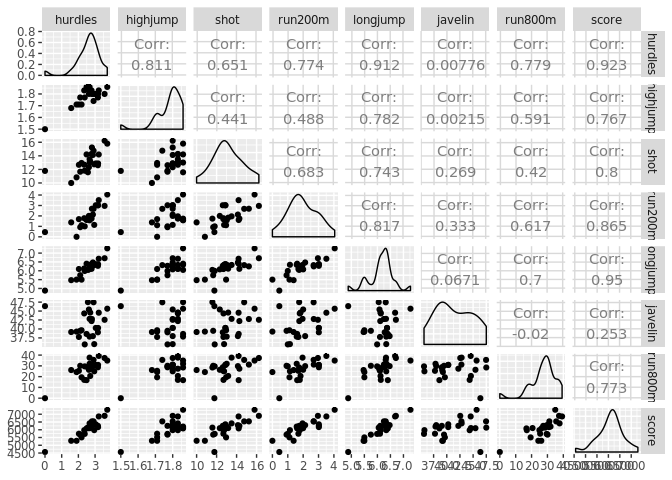<!-- -->

scale()—-

``` r
scale(heptathlon)
```

    ##           hurdles   highjump        shot      run200m    longjump
    ##  [1,]  1.56112593  1.0007405  1.79799456  2.154798275  2.35675020
    ##  [2,]  1.34392580  0.2309401  2.08622065  1.030573634  1.17584459
    ##  [3,]  0.86880052  0.6158403  0.72552539  1.597842949  1.11258179
    ##  [4,]  0.31222519  0.2309401  1.41592742  0.752095971  0.20581498
    ##  [5,]  0.44797527 -0.5388603  1.10088960  0.741781983  0.35342818
    ##  [6,]  0.12217507  0.6158403  0.25632013 -0.000825119  0.37451578
    ##  [7,]  0.62445037  0.2309401 -0.15926167  1.092457559  0.45886618
    ##  [8,]  0.39367523  0.2309401  0.67860487  0.174512669  0.66974218
    ##  [9,]  0.28507517  0.6158403  0.77914885 -0.217418857 -0.08941142
    ## [10,]  0.80092548 -0.1539601 -0.33353791  1.092457559  0.26907778
    ## [11,]  0.12217507  1.0007405 -0.07212355 -0.392756645  0.39560338
    ## [12,]  0.81450048  0.2309401 -0.15926167  1.092457559  0.45886618
    ## [13,] -0.01357501  1.0007405 -1.03064287 -0.227732845 -0.21593703
    ## [14,]  0.17647510  0.6158403  0.02842043 -0.134906957 -0.06832382
    ## [15,]  0.06787504  0.2309401 -0.53462588  0.040430831 -0.15267423
    ## [16,] -0.12217507  1.0007405  0.73222833 -0.361814683  0.52212898
    ## [17,]  0.50227530  0.2309401 -0.24639979 -0.846572097  0.39560338
    ## [18,] -0.31222519  0.6158403 -0.28661739 -0.186476895 -0.04723622
    ## [19,] -0.74662544 -0.9237604 -0.29332032 -0.279302782 -0.11049902
    ## [20,] -0.27150016 -0.1539601 -0.87647543 -0.990967922 -0.34246263
    ## [21,] -0.63802538 -0.1539601 -0.97701941 -1.073479822 -0.84856503
    ## [22,] -0.52942531 -0.9237604 -0.11234115 -0.877514059 -1.37575504
    ## [23,] -1.37107581 -1.3086606 -2.08970618 -0.599036396 -1.43901784
    ## [24,] -0.93667556 -0.9237604 -1.53336279 -2.022366675 -1.37575504
    ## [25,] -3.50235208 -3.6180617 -0.89658423 -1.558237236 -2.68318625
    ##          javelin       run800m        score
    ##  [1,]  1.1782304  0.9098926366  2.111633985
    ##  [2,]  0.3039212  1.1981539571  1.418545189
    ##  [3,]  0.8623510  1.4297279049  1.349939953
    ##  [4,]  0.3659689  0.4600119984  0.790543413
    ##  [5,]  1.6858939  0.9834656096  0.790543413
    ##  [6,]  0.3772503  1.2379557294  0.563618401
    ##  [7,] -0.3391192  0.4238285691  0.458071884
    ##  [8,] -0.9821595  0.2899498805  0.363080019
    ##  [9,]  0.2023885  0.0004824457  0.283920131
    ## [10,] -0.6832022  0.1584834205  0.283920131
    ## [11,] -1.0216445  0.5504705718  0.201242026
    ## [12,] -0.3391192  0.4238285691  0.141432333
    ## [13,]  1.6971753  0.1355672486  0.081622640
    ## [14,]  0.8736324 -0.8160569432  0.032367599
    ## [15,]  1.1161827 -0.1213350997  0.018294730
    ## [16,] -0.8129384 -1.2804109531 -0.006332791
    ## [17,] -1.6139185 -0.2926033320 -0.203352956
    ## [18,]  0.8059439 -1.2514642097 -0.208630282
    ## [19,] -1.0498480 -0.2371220736 -0.606188830
    ## [20,] -1.6364813  0.2597970227 -0.627298133
    ## [21,] -0.5647474  0.3261333098 -0.711735347
    ## [22,] -0.5196217 -0.9607906606 -1.024856681
    ## [23,] -0.6606394 -0.1502818432 -1.408342359
    ## [24,] -0.6267951 -0.3758252195 -1.410101468
    ## [25,]  1.3812958 -3.3018585393 -2.681936998
    ## attr(,"scaled:center")
    ##   hurdles  highjump      shot   run200m  longjump   javelin   run800m 
    ##    2.5800    1.7820   13.1176    1.9608    6.1524   41.4824   27.3760 
    ##     score 
    ## 6090.6000 
    ## attr(,"scaled:scale")
    ##      hurdles     highjump         shot      run200m     longjump 
    ##   0.73664781   0.07794229   1.49188438   0.96955712   0.47421233 
    ##      javelin      run800m        score 
    ##   3.54565612   8.29108809 568.46972948

``` r
iris %>%
  select_if(is.numeric) %>%
  scale() %>%
  as_tibble() %>%
  cbind(., iris$Species) -> iris_scaled
```

select vars—-

``` r
library(mlbench)
data("Soybean")
dim(Soybean)
```

    ## [1] 683  36

``` r
Soybean %>% as_tibble()
```

    ## # A tibble: 683 x 36
    ##    Class date  plant.stand precip temp  hail  crop.hist area.dam sever
    ##    <fct> <fct> <ord>       <ord>  <ord> <fct> <fct>     <fct>    <fct>
    ##  1 diap… 6     0           2      1     0     1         1        1    
    ##  2 diap… 4     0           2      1     0     2         0        2    
    ##  3 diap… 3     0           2      1     0     1         0        2    
    ##  4 diap… 3     0           2      1     0     1         0        2    
    ##  5 diap… 6     0           2      1     0     2         0        1    
    ##  6 diap… 5     0           2      1     0     3         0        1    
    ##  7 diap… 5     0           2      1     0     2         0        1    
    ##  8 diap… 4     0           2      1     1     1         0        1    
    ##  9 diap… 6     0           2      1     0     3         0        1    
    ## 10 diap… 4     0           2      1     0     2         0        2    
    ## # … with 673 more rows, and 27 more variables: seed.tmt <fct>, germ <ord>,
    ## #   plant.growth <fct>, leaves <fct>, leaf.halo <fct>, leaf.marg <fct>,
    ## #   leaf.size <ord>, leaf.shread <fct>, leaf.malf <fct>, leaf.mild <fct>,
    ## #   stem <fct>, lodging <fct>, stem.cankers <fct>, canker.lesion <fct>,
    ## #   fruiting.bodies <fct>, ext.decay <fct>, mycelium <fct>,
    ## #   int.discolor <fct>, sclerotia <fct>, fruit.pods <fct>,
    ## #   fruit.spots <fct>, seed <fct>, mold.growth <fct>, seed.discolor <fct>,
    ## #   seed.size <fct>, shriveling <fct>, roots <fct>

caret::nearZeroVar()—-

``` r
nearZeroVar(Soybean)
```

    ## [1] 19 26 28

``` r
Soybean %>%
  as_tibble() %>%
  select(-nearZeroVar(.)) -> mySoybean; mySoybean
```

    ## # A tibble: 683 x 33
    ##    Class date  plant.stand precip temp  hail  crop.hist area.dam sever
    ##    <fct> <fct> <ord>       <ord>  <ord> <fct> <fct>     <fct>    <fct>
    ##  1 diap… 6     0           2      1     0     1         1        1    
    ##  2 diap… 4     0           2      1     0     2         0        2    
    ##  3 diap… 3     0           2      1     0     1         0        2    
    ##  4 diap… 3     0           2      1     0     1         0        2    
    ##  5 diap… 6     0           2      1     0     2         0        1    
    ##  6 diap… 5     0           2      1     0     3         0        1    
    ##  7 diap… 5     0           2      1     0     2         0        1    
    ##  8 diap… 4     0           2      1     1     1         0        1    
    ##  9 diap… 6     0           2      1     0     3         0        1    
    ## 10 diap… 4     0           2      1     0     2         0        2    
    ## # … with 673 more rows, and 24 more variables: seed.tmt <fct>, germ <ord>,
    ## #   plant.growth <fct>, leaves <fct>, leaf.halo <fct>, leaf.marg <fct>,
    ## #   leaf.size <ord>, leaf.shread <fct>, leaf.malf <fct>, stem <fct>,
    ## #   lodging <fct>, stem.cankers <fct>, canker.lesion <fct>,
    ## #   fruiting.bodies <fct>, ext.decay <fct>, int.discolor <fct>,
    ## #   fruit.pods <fct>, fruit.spots <fct>, seed <fct>, mold.growth <fct>,
    ## #   seed.discolor <fct>, seed.size <fct>, shriveling <fct>, roots <fct>

caret::findCorrelation()—-

``` r
data('Vehicle')
Vehicle %>% as_tibble() -> vehicle; vehicle
```

    ## # A tibble: 846 x 19
    ##     Comp  Circ D.Circ Rad.Ra Pr.Axis.Ra Max.L.Ra Scat.Ra Elong Pr.Axis.Rect
    ##    <dbl> <dbl>  <dbl>  <dbl>      <dbl>    <dbl>   <dbl> <dbl>        <dbl>
    ##  1    95    48     83    178         72       10     162    42           20
    ##  2    91    41     84    141         57        9     149    45           19
    ##  3   104    50    106    209         66       10     207    32           23
    ##  4    93    41     82    159         63        9     144    46           19
    ##  5    85    44     70    205        103       52     149    45           19
    ##  6   107    57    106    172         50        6     255    26           28
    ##  7    97    43     73    173         65        6     153    42           19
    ##  8    90    43     66    157         65        9     137    48           18
    ##  9    86    34     62    140         61        7     122    54           17
    ## 10    93    44     98    197         62       11     183    36           22
    ## # … with 836 more rows, and 10 more variables: Max.L.Rect <dbl>,
    ## #   Sc.Var.Maxis <dbl>, Sc.Var.maxis <dbl>, Ra.Gyr <dbl>,
    ## #   Skew.Maxis <dbl>, Skew.maxis <dbl>, Kurt.maxis <dbl>,
    ## #   Kurt.Maxis <dbl>, Holl.Ra <dbl>, Class <fct>

``` r
vehicle %>%
  select(-Class) %>%
  cor() %>%
  findCorrelation() -> high_cor; high_cor # default =.9
```

    ## [1]  3  8 11  7  9  2

``` r
vehicle %>%
  select(-Class) %>%
  cor() %>%
  findCorrelation(cutoff = .7) -> high_cor; high_cor
```

    ##  [1]  3  8 11  7  9 12  2 13 18 17

``` r
vehicle %>%
  select(-high_cor) -> vehicle_filered; vehicle_filered
```

    ## # A tibble: 846 x 9
    ##     Comp Rad.Ra Pr.Axis.Ra Max.L.Ra Max.L.Rect Skew.Maxis Skew.maxis
    ##    <dbl>  <dbl>      <dbl>    <dbl>      <dbl>      <dbl>      <dbl>
    ##  1    95    178         72       10        159         70          6
    ##  2    91    141         57        9        143         72          9
    ##  3   104    209         66       10        158         73         14
    ##  4    93    159         63        9        143         63          6
    ##  5    85    205        103       52        144        127          9
    ##  6   107    172         50        6        169         85          5
    ##  7    97    173         65        6        143         66         13
    ##  8    90    157         65        9        146         67          3
    ##  9    86    140         61        7        127         64          2
    ## 10    93    197         62       11        146         64          4
    ## # … with 836 more rows, and 2 more variables: Kurt.maxis <dbl>,
    ## #   Class <fct>

PCA ==\> K-means Clustering—-

``` r
heptathlon %>%
  select(-score) %>%
  prcomp(scale = T) -> h.pca; h.pca
```

    ## Standard deviations (1, .., p=7):
    ## [1] 2.1119364 1.0928497 0.7218131 0.6761411 0.4952441 0.2701029 0.2213617
    ## 
    ## Rotation (n x k) = (7 x 7):
    ##                 PC1         PC2         PC3         PC4         PC5
    ## hurdles  -0.4528710  0.15792058 -0.04514996  0.02653873 -0.09494792
    ## highjump -0.3771992  0.24807386 -0.36777902  0.67999172  0.01879888
    ## shot     -0.3630725 -0.28940743  0.67618919  0.12431725  0.51165201
    ## run200m  -0.4078950 -0.26038545  0.08359211 -0.36106580 -0.64983404
    ## longjump -0.4562318  0.05587394  0.13931653  0.11129249 -0.18429810
    ## javelin  -0.0754090 -0.84169212 -0.47156016  0.12079924  0.13510669
    ## run800m  -0.3749594  0.22448984 -0.39585671 -0.60341130  0.50432116
    ##                  PC6         PC7
    ## hurdles  -0.78334101  0.38024707
    ## highjump  0.09939981 -0.43393114
    ## shot     -0.05085983 -0.21762491
    ## run200m   0.02495639 -0.45338483
    ## longjump  0.59020972  0.61206388
    ## javelin  -0.02724076  0.17294667
    ## run800m   0.15555520 -0.09830963

``` r
summary(h.pca)
```

    ## Importance of components:
    ##                           PC1    PC2     PC3     PC4     PC5     PC6
    ## Standard deviation     2.1119 1.0928 0.72181 0.67614 0.49524 0.27010
    ## Proportion of Variance 0.6372 0.1706 0.07443 0.06531 0.03504 0.01042
    ## Cumulative Proportion  0.6372 0.8078 0.88223 0.94754 0.98258 0.99300
    ##                           PC7
    ## Standard deviation     0.2214
    ## Proportion of Variance 0.0070
    ## Cumulative Proportion  1.0000

``` r
screeplot(h.pca, type ='lines')
```

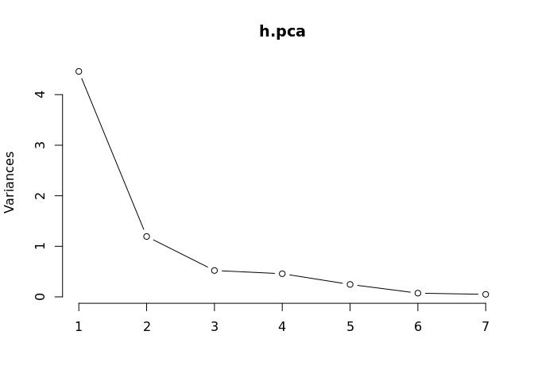<!-- -->

first and second components…

``` r
h.pca
```

    ## Standard deviations (1, .., p=7):
    ## [1] 2.1119364 1.0928497 0.7218131 0.6761411 0.4952441 0.2701029 0.2213617
    ## 
    ## Rotation (n x k) = (7 x 7):
    ##                 PC1         PC2         PC3         PC4         PC5
    ## hurdles  -0.4528710  0.15792058 -0.04514996  0.02653873 -0.09494792
    ## highjump -0.3771992  0.24807386 -0.36777902  0.67999172  0.01879888
    ## shot     -0.3630725 -0.28940743  0.67618919  0.12431725  0.51165201
    ## run200m  -0.4078950 -0.26038545  0.08359211 -0.36106580 -0.64983404
    ## longjump -0.4562318  0.05587394  0.13931653  0.11129249 -0.18429810
    ## javelin  -0.0754090 -0.84169212 -0.47156016  0.12079924  0.13510669
    ## run800m  -0.3749594  0.22448984 -0.39585671 -0.60341130  0.50432116
    ##                  PC6         PC7
    ## hurdles  -0.78334101  0.38024707
    ## highjump  0.09939981 -0.43393114
    ## shot     -0.05085983 -0.21762491
    ## run200m   0.02495639 -0.45338483
    ## longjump  0.59020972  0.61206388
    ## javelin  -0.02724076  0.17294667
    ## run800m   0.15555520 -0.09830963

``` r
h.pca$rotation[, 1:2] # What is principal components...
```

    ##                 PC1         PC2
    ## hurdles  -0.4528710  0.15792058
    ## highjump -0.3771992  0.24807386
    ## shot     -0.3630725 -0.28940743
    ## run200m  -0.4078950 -0.26038545
    ## longjump -0.4562318  0.05587394
    ## javelin  -0.0754090 -0.84169212
    ## run800m  -0.3749594  0.22448984

``` r
h.pca$x # principal components per persons...
```

    ##                PC1         PC2         PC3         PC4         PC5
    ##  [1,] -4.121447626 -1.24240435  0.36991309  0.02300174 -0.42600624
    ##  [2,] -2.882185935 -0.52372600  0.89741472 -0.47545176  0.70306588
    ##  [3,] -2.649633766 -0.67876243 -0.45917668 -0.67962860 -0.10552518
    ##  [4,] -1.343351210 -0.69228324  0.59527044 -0.14067052  0.45392816
    ##  [5,] -1.359025696 -1.75316563 -0.15070126 -0.83595001  0.68719483
    ##  [6,] -1.043847471  0.07940725 -0.67453049 -0.20557253  0.73793351
    ##  [7,] -1.100385639  0.32375304 -0.07343168 -0.48627848 -0.76299122
    ##  [8,] -0.923173639  0.80681365  0.81241866 -0.03022915  0.09086737
    ##  [9,] -0.530250689 -0.14632191  0.16122744  0.61590242  0.56851477
    ## [10,] -0.759819024  0.52601568  0.18316881 -0.66756426 -1.02148109
    ## [11,] -0.556268302  1.39628179 -0.13619463  0.40503603  0.29221101
    ## [12,] -1.186453832  0.35376586 -0.08201243 -0.48123479 -0.78103608
    ## [13,]  0.015461226 -0.80644305 -1.96745373  0.73341733 -0.02177427
    ## [14,]  0.003774223 -0.71479785 -0.32496780  1.06604134 -0.18389959
    ## [15,]  0.090747709 -0.76304501 -0.94571404  0.26883477 -0.18416945
    ## [16,] -0.137225440  0.53724054  1.06529469  1.63144151 -0.21162048
    ## [17,]  0.171128651  1.74319472  0.58701048  0.47103131 -0.05781435
    ## [18,]  0.519252646 -0.72696476 -0.31302308  1.28942720 -0.49779301
    ## [19,]  1.125481833  0.63479040  0.72530080 -0.57961844 -0.15611502
    ## [20,]  1.085697646  1.84722368  0.01452749 -0.25561691  0.19143514
    ## [21,]  1.447055499  0.92446876 -0.64596313 -0.21493997  0.49993839
    ## [22,]  2.014029620  0.09304121  0.64802905  0.02454548  0.24445870
    ## [23,]  2.880298635  0.66150588 -0.74936718 -1.11903480 -0.47418755
    ## [24,]  2.970118607  0.95961101 -0.57118753 -0.11547402  0.58055249
    ## [25,]  6.270021972 -2.83919926  1.03414797 -0.24141489 -0.16568672
    ##                PC6          PC7
    ##  [1,]  0.339329222  0.347921325
    ##  [2,] -0.238087298  0.144015774
    ##  [3,]  0.239190707 -0.129647756
    ##  [4,] -0.091805638 -0.486577968
    ##  [5,] -0.126303968  0.239482044
    ##  [6,]  0.355789386 -0.103414314
    ##  [7,] -0.084844490 -0.142871612
    ##  [8,]  0.151561253  0.034237928
    ##  [9,] -0.265359696 -0.249591589
    ## [10,] -0.396397714 -0.020405097
    ## [11,]  0.344582964 -0.182701990
    ## [12,] -0.233718538 -0.070605615
    ## [13,]  0.004249913  0.036155878
    ## [14,] -0.272903729  0.044351160
    ## [15,] -0.141403697  0.135136482
    ## [16,]  0.280043639 -0.171160984
    ## [17,] -0.147155606  0.520000710
    ## [18,]  0.071211150 -0.005529394
    ## [19,]  0.427484048  0.081522940
    ## [20,]  0.100087033  0.085430091
    ## [21,]  0.072673266 -0.125585203
    ## [22,] -0.640572055 -0.215626046
    ## [23,]  0.180568513 -0.207364881
    ## [24,] -0.183940799  0.381783751
    ## [25,]  0.255722133  0.061044365

``` r
biplot(h.pca, cex=.7)
```

<!-- -->

``` r
library(ykmeans)

h <- data.frame(h.pca$x)

head(h)
```

    ##         PC1         PC2        PC3         PC4        PC5         PC6
    ## 1 -4.121448 -1.24240435  0.3699131  0.02300174 -0.4260062  0.33932922
    ## 2 -2.882186 -0.52372600  0.8974147 -0.47545176  0.7030659 -0.23808730
    ## 3 -2.649634 -0.67876243 -0.4591767 -0.67962860 -0.1055252  0.23919071
    ## 4 -1.343351 -0.69228324  0.5952704 -0.14067052  0.4539282 -0.09180564
    ## 5 -1.359026 -1.75316563 -0.1507013 -0.83595001  0.6871948 -0.12630397
    ## 6 -1.043847  0.07940725 -0.6745305 -0.20557253  0.7379335  0.35578939
    ##          PC7
    ## 1  0.3479213
    ## 2  0.1440158
    ## 3 -0.1296478
    ## 4 -0.4865780
    ## 5  0.2394820
    ## 6 -0.1034143

``` r
keys <- names(h); keys
```

    ## [1] "PC1" "PC2" "PC3" "PC4" "PC5" "PC6" "PC7"

``` r
km <- ykmeans(h, 
              keys, # variable names...
              'PC1', # target names...
              3:6 # number of cluster...
)

km
```

    ##              PC1         PC2         PC3         PC4         PC5
    ## 76  -4.121447626 -1.24240435  0.36991309  0.02300174 -0.42600624
    ## 77  -2.882185935 -0.52372600  0.89741472 -0.47545176  0.70306588
    ## 78  -2.649633766 -0.67876243 -0.45917668 -0.67962860 -0.10552518
    ## 79  -1.343351210 -0.69228324  0.59527044 -0.14067052  0.45392816
    ## 80  -1.359025696 -1.75316563 -0.15070126 -0.83595001  0.68719483
    ## 81  -1.043847471  0.07940725 -0.67453049 -0.20557253  0.73793351
    ## 82  -1.100385639  0.32375304 -0.07343168 -0.48627848 -0.76299122
    ## 83  -0.923173639  0.80681365  0.81241866 -0.03022915  0.09086737
    ## 84  -0.530250689 -0.14632191  0.16122744  0.61590242  0.56851477
    ## 85  -0.759819024  0.52601568  0.18316881 -0.66756426 -1.02148109
    ## 86  -0.556268302  1.39628179 -0.13619463  0.40503603  0.29221101
    ## 87  -1.186453832  0.35376586 -0.08201243 -0.48123479 -0.78103608
    ## 88   0.015461226 -0.80644305 -1.96745373  0.73341733 -0.02177427
    ## 89   0.003774223 -0.71479785 -0.32496780  1.06604134 -0.18389959
    ## 90   0.090747709 -0.76304501 -0.94571404  0.26883477 -0.18416945
    ## 91  -0.137225440  0.53724054  1.06529469  1.63144151 -0.21162048
    ## 92   0.171128651  1.74319472  0.58701048  0.47103131 -0.05781435
    ## 93   0.519252646 -0.72696476 -0.31302308  1.28942720 -0.49779301
    ## 94   1.125481833  0.63479040  0.72530080 -0.57961844 -0.15611502
    ## 95   1.085697646  1.84722368  0.01452749 -0.25561691  0.19143514
    ## 96   1.447055499  0.92446876 -0.64596313 -0.21493997  0.49993839
    ## 97   2.014029620  0.09304121  0.64802905  0.02454548  0.24445870
    ## 98   2.880298635  0.66150588 -0.74936718 -1.11903480 -0.47418755
    ## 99   2.970118607  0.95961101 -0.57118753 -0.11547402  0.58055249
    ## 100  6.270021972 -2.83919926  1.03414797 -0.24141489 -0.16568672
    ##              PC6          PC7 cluster .average.sd
    ## 76   0.339329222  0.347921325       1   0.5721999
    ## 77  -0.238087298  0.144015774       1   0.5721999
    ## 78   0.239190707 -0.129647756       1   0.5721999
    ## 79  -0.091805638 -0.486577968       2   0.5721999
    ## 80  -0.126303968  0.239482044       1   0.5721999
    ## 81   0.355789386 -0.103414314       2   0.5721999
    ## 82  -0.084844490 -0.142871612       2   0.5721999
    ## 83   0.151561253  0.034237928       2   0.5721999
    ## 84  -0.265359696 -0.249591589       2   0.5721999
    ## 85  -0.396397714 -0.020405097       2   0.5721999
    ## 86   0.344582964 -0.182701990       3   0.5721999
    ## 87  -0.233718538 -0.070605615       2   0.5721999
    ## 88   0.004249913  0.036155878       4   0.5721999
    ## 89  -0.272903729  0.044351160       4   0.5721999
    ## 90  -0.141403697  0.135136482       4   0.5721999
    ## 91   0.280043639 -0.171160984       3   0.5721999
    ## 92  -0.147155606  0.520000710       3   0.5721999
    ## 93   0.071211150 -0.005529394       4   0.5721999
    ## 94   0.427484048  0.081522940       5   0.5721999
    ## 95   0.100087033  0.085430091       5   0.5721999
    ## 96   0.072673266 -0.125585203       5   0.5721999
    ## 97  -0.640572055 -0.215626046       5   0.5721999
    ## 98   0.180568513 -0.207364881       5   0.5721999
    ## 99  -0.183940799  0.381783751       5   0.5721999
    ## 100  0.255722133  0.061044365       6   0.5721999

``` r
table(km$cluster)
```

    ## 
    ## 1 2 3 4 5 6 
    ## 4 7 3 4 6 1

``` r
ggplot(km, 
       aes(x = PC1, y = PC2, col = as.factor(cluster))) +
  geom_point(size = 3)
```

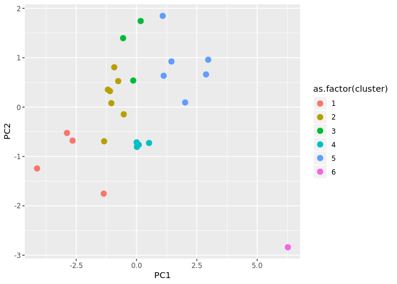<!-- -->

``` r
head(h)
```

    ##         PC1         PC2        PC3         PC4        PC5         PC6
    ## 1 -4.121448 -1.24240435  0.3699131  0.02300174 -0.4260062  0.33932922
    ## 2 -2.882186 -0.52372600  0.8974147 -0.47545176  0.7030659 -0.23808730
    ## 3 -2.649634 -0.67876243 -0.4591767 -0.67962860 -0.1055252  0.23919071
    ## 4 -1.343351 -0.69228324  0.5952704 -0.14067052  0.4539282 -0.09180564
    ## 5 -1.359026 -1.75316563 -0.1507013 -0.83595001  0.6871948 -0.12630397
    ## 6 -1.043847  0.07940725 -0.6745305 -0.20557253  0.7379335  0.35578939
    ##          PC7
    ## 1  0.3479213
    ## 2  0.1440158
    ## 3 -0.1296478
    ## 4 -0.4865780
    ## 5  0.2394820
    ## 6 -0.1034143

``` r
k <- kmeans(h[, 1:2], 5)

plot(h[, 1:2], col = k$cluster, pch = k$cluster, size =3)
```

    ## Warning in plot.window(...): "size" is not a graphical parameter

    ## Warning in plot.xy(xy, type, ...): "size" is not a graphical parameter

    ## Warning in axis(side = side, at = at, labels = labels, ...): "size" is not
    ## a graphical parameter
    
    ## Warning in axis(side = side, at = at, labels = labels, ...): "size" is not
    ## a graphical parameter

    ## Warning in box(...): "size" is not a graphical parameter

    ## Warning in title(...): "size" is not a graphical parameter

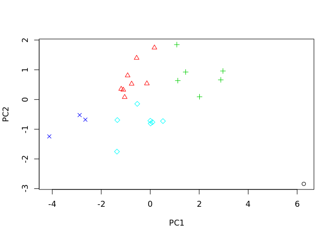<!-- -->

``` r
k$cluster %>% as.factor() -> k$cluster

ggplot(h, aes(PC1, PC2, col = k$cluster)) + geom_point(size = 3)
```

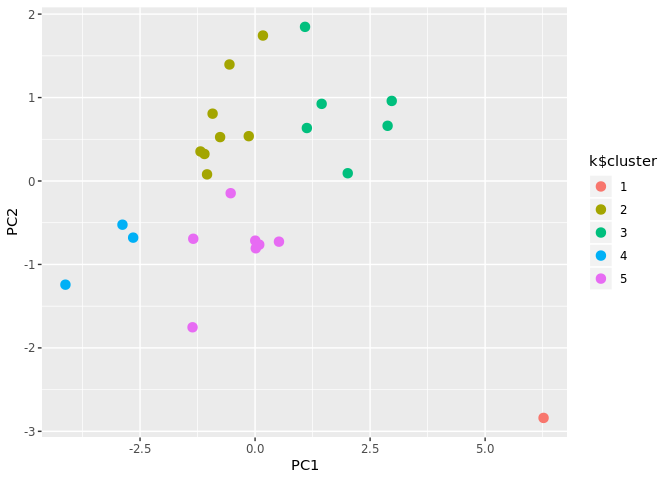<!-- -->

PCA ==\> SVM Classification—- Data Loading…

``` r
library(e1071)

iris %>%
  select(-Species) %>%
  prcomp(scale = T) -> ir.pca; ir.pca
```

    ## Standard deviations (1, .., p=4):
    ## [1] 1.7083611 0.9560494 0.3830886 0.1439265
    ## 
    ## Rotation (n x k) = (4 x 4):
    ##                     PC1         PC2        PC3        PC4
    ## Sepal.Length  0.5210659 -0.37741762  0.7195664  0.2612863
    ## Sepal.Width  -0.2693474 -0.92329566 -0.2443818 -0.1235096
    ## Petal.Length  0.5804131 -0.02449161 -0.1421264 -0.8014492
    ## Petal.Width   0.5648565 -0.06694199 -0.6342727  0.5235971

``` r
ir.pca$x %>% as_tibble() -> ir; ir
```

    ## # A tibble: 150 x 4
    ##      PC1     PC2     PC3      PC4
    ##    <dbl>   <dbl>   <dbl>    <dbl>
    ##  1 -2.26 -0.478   0.127   0.0241 
    ##  2 -2.07  0.672   0.234   0.103  
    ##  3 -2.36  0.341  -0.0441  0.0283 
    ##  4 -2.29  0.595  -0.0910 -0.0657 
    ##  5 -2.38 -0.645  -0.0157 -0.0358 
    ##  6 -2.07 -1.48   -0.0269  0.00659
    ##  7 -2.44 -0.0475 -0.334  -0.0367 
    ##  8 -2.23 -0.222   0.0884 -0.0245 
    ##  9 -2.33  1.11   -0.145  -0.0268 
    ## 10 -2.18  0.467   0.253  -0.0398 
    ## # … with 140 more rows

``` r
ir %>%
  cbind(., species = iris$Species) %>% 
  as_tibble() -> iris_pca

iris_pca
```

    ## # A tibble: 150 x 5
    ##      PC1     PC2     PC3      PC4 species
    ##    <dbl>   <dbl>   <dbl>    <dbl> <fct>  
    ##  1 -2.26 -0.478   0.127   0.0241  setosa 
    ##  2 -2.07  0.672   0.234   0.103   setosa 
    ##  3 -2.36  0.341  -0.0441  0.0283  setosa 
    ##  4 -2.29  0.595  -0.0910 -0.0657  setosa 
    ##  5 -2.38 -0.645  -0.0157 -0.0358  setosa 
    ##  6 -2.07 -1.48   -0.0269  0.00659 setosa 
    ##  7 -2.44 -0.0475 -0.334  -0.0367  setosa 
    ##  8 -2.23 -0.222   0.0884 -0.0245  setosa 
    ##  9 -2.33  1.11   -0.145  -0.0268  setosa 
    ## 10 -2.18  0.467   0.253  -0.0398  setosa 
    ## # … with 140 more rows

Data
Spliting…

``` r
idx <- caret::createDataPartition(iris_pca$species, p = c(.8, .2), list = F)
iris_pca_train <- iris_pca[idx, ]
dim(iris_pca_train)
```

    ## [1] 120   5

``` r
iris_pca_test <-iris_pca[-idx, ]
dim(iris_pca_test)
```

    ## [1] 30  5

Modeling…

``` r
m_svm <- svm(species ~ ., data = iris_pca_train)
m_svm
```

    ## 
    ## Call:
    ## svm(formula = species ~ ., data = iris_pca_train)
    ## 
    ## 
    ## Parameters:
    ##    SVM-Type:  C-classification 
    ##  SVM-Kernel:  radial 
    ##        cost:  1 
    ##       gamma:  0.25 
    ## 
    ## Number of Support Vectors:  68

Predicting…

``` r
y_hat_svm <- predict(m_svm, newdata = iris_pca_test[, 1:4])

table(y_hat_svm)
```

    ## y_hat_svm
    ##     setosa versicolor  virginica 
    ##         10         12          8

Evaluating…

``` r
confusionMatrix(y_hat_svm, iris_pca_test$species)
```

    ## Confusion Matrix and Statistics
    ## 
    ##             Reference
    ## Prediction   setosa versicolor virginica
    ##   setosa         10          0         0
    ##   versicolor      0         10         2
    ##   virginica       0          0         8
    ## 
    ## Overall Statistics
    ##                                           
    ##                Accuracy : 0.9333          
    ##                  95% CI : (0.7793, 0.9918)
    ##     No Information Rate : 0.3333          
    ##     P-Value [Acc > NIR] : 8.747e-12       
    ##                                           
    ##                   Kappa : 0.9             
    ##                                           
    ##  Mcnemar's Test P-Value : NA              
    ## 
    ## Statistics by Class:
    ## 
    ##                      Class: setosa Class: versicolor Class: virginica
    ## Sensitivity                 1.0000            1.0000           0.8000
    ## Specificity                 1.0000            0.9000           1.0000
    ## Pos Pred Value              1.0000            0.8333           1.0000
    ## Neg Pred Value              1.0000            1.0000           0.9091
    ## Prevalence                  0.3333            0.3333           0.3333
    ## Detection Rate              0.3333            0.3333           0.2667
    ## Detection Prevalence        0.3333            0.4000           0.2667
    ## Balanced Accuracy           1.0000            0.9500           0.9000

Visualization….

``` r
y_hat_df <- data.frame(iris_pca_test[, 1:4], y_hat = y_hat_svm)

y_hat_df
```

    ##            PC1          PC2          PC3          PC4      y_hat
    ## 1  -2.25714118 -0.478423832  0.127279624  0.024087508     setosa
    ## 2  -2.07401302  0.671882687  0.233825517  0.102662845     setosa
    ## 3  -2.06870061 -1.484205297 -0.026878250  0.006586116     setosa
    ## 4  -2.20021676 -1.478655729  0.005326251  0.188186988     setosa
    ## 5  -2.21972701 -0.136796175 -0.117599566 -0.269238379     setosa
    ## 6  -1.94532930  0.623529705  0.304620475  0.043416203     setosa
    ## 7  -1.82547925 -0.422280389  0.269564311  0.239069476     setosa
    ## 8  -2.42152026  0.901161067 -0.192609402 -0.009705907     setosa
    ## 9  -2.22200263 -0.994627669  0.180886792 -0.014878291     setosa
    ## 10 -2.19647504 -0.009185585  0.152518539  0.049206884     setosa
    ## 11  0.72889556 -0.592629362  0.093807452  0.004887251 versicolor
    ## 12  1.07188379  0.207725147  0.396925784  0.104387166 versicolor
    ## 13  0.74403715 -0.770438272 -0.148472007 -0.077111455 versicolor
    ## 14 -0.48569562  1.846243998 -0.248432992 -0.040384912 versicolor
    ## 15 -0.03324333  0.437537419 -0.194282030  0.108684396 versicolor
    ## 16  0.70031506  0.063200094  0.444537765  0.043313222 versicolor
    ## 17  0.13035846  1.557055553  0.149482697 -0.009371129 versicolor
    ## 18  0.02337438  1.567225244  0.240745761 -0.032663020 versicolor
    ## 19  0.06935597  0.218770433 -0.290605718 -0.146653279 versicolor
    ## 20  0.28762268  0.852873116 -0.130452657 -0.107043742 versicolor
    ## 21  1.43534213  0.046830701 -0.163083761 -0.234982858 versicolor
    ## 22  2.25223216 -1.914596301 -0.396224508  0.104488870  virginica
    ## 23  1.59732747  0.420292431 -0.023108991  0.058136869  virginica
    ## 24  1.87761053 -0.417849815 -0.026250468  0.145926073  virginica
    ## 25  1.46651849 -0.254768327 -0.037306280 -0.154811637  virginica
    ## 26  1.01754169 -0.064131184 -0.336588365 -0.008625505  virginica
    ## 27  1.85742501 -0.560413289  0.713244682 -0.207519953  virginica
    ## 28  1.19845835  0.808606364  0.164173760 -0.487849130 versicolor
    ## 29  1.57099294 -1.065013214 -0.942695700  0.035486875  virginica
    ## 30  1.84586124 -0.673870645  0.012629804  0.194543500  virginica

``` r
ggplot(y_hat_df,
       aes(x = PC1, y = PC2, col = y_hat)) + geom_point(size = 3)
```

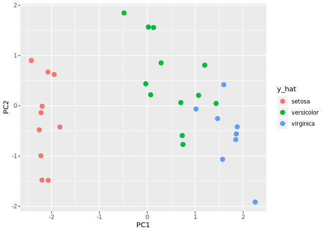<!-- -->

With caret style…

setting fitControl…

``` r
fitControl = trainControl(method = 'repeatedcv', 
                          number = 10, 
                          repeats = 3,
                          verboseIter = T)
```

Model Training…

``` r
iris_svm <- train(species ~ ., 
                  data = iris_pca_train,
                  method = 'svmLinear',
                  trControl = fitControl)
```

    ## + Fold01.Rep1: C=1 
    ## - Fold01.Rep1: C=1 
    ## + Fold02.Rep1: C=1 
    ## - Fold02.Rep1: C=1 
    ## + Fold03.Rep1: C=1 
    ## - Fold03.Rep1: C=1 
    ## + Fold04.Rep1: C=1 
    ## - Fold04.Rep1: C=1 
    ## + Fold05.Rep1: C=1 
    ## - Fold05.Rep1: C=1 
    ## + Fold06.Rep1: C=1 
    ## - Fold06.Rep1: C=1 
    ## + Fold07.Rep1: C=1 
    ## - Fold07.Rep1: C=1 
    ## + Fold08.Rep1: C=1 
    ## - Fold08.Rep1: C=1 
    ## + Fold09.Rep1: C=1 
    ## - Fold09.Rep1: C=1 
    ## + Fold10.Rep1: C=1 
    ## - Fold10.Rep1: C=1 
    ## + Fold01.Rep2: C=1 
    ## - Fold01.Rep2: C=1 
    ## + Fold02.Rep2: C=1 
    ## - Fold02.Rep2: C=1 
    ## + Fold03.Rep2: C=1 
    ## - Fold03.Rep2: C=1 
    ## + Fold04.Rep2: C=1 
    ## - Fold04.Rep2: C=1 
    ## + Fold05.Rep2: C=1 
    ## - Fold05.Rep2: C=1 
    ## + Fold06.Rep2: C=1 
    ## - Fold06.Rep2: C=1 
    ## + Fold07.Rep2: C=1 
    ## - Fold07.Rep2: C=1 
    ## + Fold08.Rep2: C=1 
    ## - Fold08.Rep2: C=1 
    ## + Fold09.Rep2: C=1 
    ## - Fold09.Rep2: C=1 
    ## + Fold10.Rep2: C=1 
    ## - Fold10.Rep2: C=1 
    ## + Fold01.Rep3: C=1 
    ## - Fold01.Rep3: C=1 
    ## + Fold02.Rep3: C=1 
    ## - Fold02.Rep3: C=1 
    ## + Fold03.Rep3: C=1 
    ## - Fold03.Rep3: C=1 
    ## + Fold04.Rep3: C=1 
    ## - Fold04.Rep3: C=1 
    ## + Fold05.Rep3: C=1 
    ## - Fold05.Rep3: C=1 
    ## + Fold06.Rep3: C=1 
    ## - Fold06.Rep3: C=1 
    ## + Fold07.Rep3: C=1 
    ## - Fold07.Rep3: C=1 
    ## + Fold08.Rep3: C=1 
    ## - Fold08.Rep3: C=1 
    ## + Fold09.Rep3: C=1 
    ## - Fold09.Rep3: C=1 
    ## + Fold10.Rep3: C=1 
    ## - Fold10.Rep3: C=1 
    ## Aggregating results
    ## Fitting final model on full training set

Predict with test dataset…

``` r
y_hat_caret_svm <- predict(iris_svm, iris_pca_test[, 1:4])

y_hat_caret_svm
```

    ##  [1] setosa     setosa     setosa     setosa     setosa     setosa    
    ##  [7] setosa     setosa     setosa     setosa     versicolor versicolor
    ## [13] versicolor versicolor versicolor versicolor versicolor versicolor
    ## [19] versicolor versicolor virginica  virginica  virginica  virginica 
    ## [25] virginica  virginica  versicolor versicolor virginica  virginica 
    ## Levels: setosa versicolor virginica

Evaluating…

``` r
confusionMatrix(y_hat_caret_svm, iris_pca_test$species)
```

    ## Confusion Matrix and Statistics
    ## 
    ##             Reference
    ## Prediction   setosa versicolor virginica
    ##   setosa         10          0         0
    ##   versicolor      0         10         2
    ##   virginica       0          0         8
    ## 
    ## Overall Statistics
    ##                                           
    ##                Accuracy : 0.9333          
    ##                  95% CI : (0.7793, 0.9918)
    ##     No Information Rate : 0.3333          
    ##     P-Value [Acc > NIR] : 8.747e-12       
    ##                                           
    ##                   Kappa : 0.9             
    ##                                           
    ##  Mcnemar's Test P-Value : NA              
    ## 
    ## Statistics by Class:
    ## 
    ##                      Class: setosa Class: versicolor Class: virginica
    ## Sensitivity                 1.0000            1.0000           0.8000
    ## Specificity                 1.0000            0.9000           1.0000
    ## Pos Pred Value              1.0000            0.8333           1.0000
    ## Neg Pred Value              1.0000            1.0000           0.9091
    ## Prevalence                  0.3333            0.3333           0.3333
    ## Detection Rate              0.3333            0.3333           0.2667
    ## Detection Prevalence        0.3333            0.4000           0.2667
    ## Balanced Accuracy           1.0000            0.9500           0.9000

Visualization…

``` r
cbind(iris_pca_test[, 1:4], 
      species = y_hat_caret_svm) -> iris_hat_data

ggplot(iris_hat_data, aes(PC1, PC2, col = species)) + geom_point(size = 1)
```

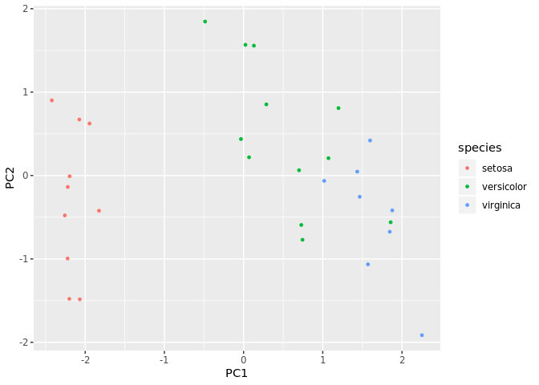<!-- -->

Hclust—-

``` r
protein <- read_delim("./data/protein.txt", "\t", 
                      escape_double = F,
                      trim_ws = T)
```

    ## Parsed with column specification:
    ## cols(
    ##   Country = col_character(),
    ##   RedMeat = col_double(),
    ##   WhiteMeat = col_double(),
    ##   Eggs = col_double(),
    ##   Milk = col_double(),
    ##   Fish = col_double(),
    ##   Cereals = col_double(),
    ##   Starch = col_double(),
    ##   Nuts = col_double(),
    ##   `Fr&Veg` = col_double()
    ## )

``` r
glimpse(protein)
```

    ## Observations: 25
    ## Variables: 10
    ## $ Country   <chr> "Albania", "Austria", "Belgium", "Bulgaria", "Czechosl…
    ## $ RedMeat   <dbl> 10.1, 8.9, 13.5, 7.8, 9.7, 10.6, 8.4, 9.5, 18.0, 10.2,…
    ## $ WhiteMeat <dbl> 1.4, 14.0, 9.3, 6.0, 11.4, 10.8, 11.6, 4.9, 9.9, 3.0, …
    ## $ Eggs      <dbl> 0.5, 4.3, 4.1, 1.6, 2.8, 3.7, 3.7, 2.7, 3.3, 2.8, 2.9,…
    ## $ Milk      <dbl> 8.9, 19.9, 17.5, 8.3, 12.5, 25.0, 11.1, 33.7, 19.5, 17…
    ## $ Fish      <dbl> 0.2, 2.1, 4.5, 1.2, 2.0, 9.9, 5.4, 5.8, 5.7, 5.9, 0.3,…
    ## $ Cereals   <dbl> 42.3, 28.0, 26.6, 56.7, 34.3, 21.9, 24.6, 26.3, 28.1, …
    ## $ Starch    <dbl> 0.6, 3.6, 5.7, 1.1, 5.0, 4.8, 6.5, 5.1, 4.8, 2.2, 4.0,…
    ## $ Nuts      <dbl> 5.5, 1.3, 2.1, 3.7, 1.1, 0.7, 0.8, 1.0, 2.4, 7.8, 5.4,…
    ## $ `Fr&Veg`  <dbl> 1.7, 4.3, 4.0, 4.2, 4.0, 2.4, 3.6, 1.4, 6.5, 6.5, 4.2,…

``` r
protein %>%
  select(-Country) %>%
  scale() %>%
  dist() -> d; d
```

    ##            1         2         3         4         5         6         7
    ## 2  6.1360510                                                            
    ## 3  5.9487614 2.4513223                                                  
    ## 4  2.7645367 4.9002772 5.2370880                                        
    ## 5  5.1411480 2.1308906 2.2202549 3.9503627                              
    ## 6  6.6341625 3.0192376 2.5391149 6.0365915 3.3692190                    
    ## 7  6.3922502 2.5819811 2.1140954 5.4091332 1.8802660 2.7645740          
    ## 8  5.8794649 4.0716662 3.5042937 5.8176296 3.9839792 2.6334871 4.0723681
    ## 9  6.3070106 3.5889373 2.1944157 5.5606801 3.3690903 3.6628201 3.7933343
    ## 10 4.2559301 5.1639348 4.6951531 3.7626971 4.8701393 5.5968794 5.6196014
    ## 11 4.6734470 3.2857392 3.9946781 3.3453809 2.7513287 5.0390826 3.6762821
    ## 12 6.7571210 2.7408193 1.6567570 6.2125897 3.1576644 2.8295563 3.0335760
    ## 13 4.0255665 3.7175506 3.7186963 2.8654638 3.3461638 4.7794027 4.3204290
    ## 14 6.0080723 1.1233122 2.2489670 5.1685911 2.1938164 2.5365988 2.5318280
    ## 15 5.4652307 3.8755033 2.9606943 5.2768296 3.5270340 1.9936668 3.2723624
    ## 16 5.8828058 2.7959971 2.9359042 4.4345191 2.1044427 3.8446943 2.7089165
    ## 17 6.6120099 6.5291699 5.6512736 6.0046278 5.5189793 5.8699772 5.2526342
    ## 18 2.6895968 4.6504990 4.7603534 1.8894354 3.5622341 5.5339127 4.7841740
    ## 19 5.5683482 4.8880906 3.9977053 4.8419395 4.1491845 5.1119708 4.0873016
    ## 20 5.6536745 2.9369074 2.5853728 5.3969214 3.2573130 1.3816672 3.0603112
    ## 21 5.1237136 2.2026742 2.3442632 4.4827981 2.6235926 3.1882479 3.5712007
    ## 22 5.9403845 3.7477881 1.9460278 5.7960604 3.8309331 3.4750112 3.9281144
    ## 23 4.3453152 4.1625991 3.1606186 3.8308791 2.7166105 4.1618777 3.4169052
    ## 24 6.3546987 1.6443946 1.4179580 5.6109214 2.1838999 2.3922302 1.8918353
    ## 25 2.9423491 5.4454697 5.6037933 1.9929633 4.3406075 6.3622057 5.5249305
    ##            8         9        10        11        12        13        14
    ## 2                                                                       
    ## 3                                                                       
    ## 4                                                                       
    ## 5                                                                       
    ## 6                                                                       
    ## 7                                                                       
    ## 8                                                                       
    ## 9  4.5951025                                                            
    ## 10 5.5036614 4.5450471                                                  
    ## 11 5.3948141 4.9747050 4.1100241                                        
    ## 12 3.2360376 3.1517086 5.7045668 4.8176916                              
    ## 13 4.9150443 3.8021484 2.1501238 3.1534119 4.8438555                    
    ## 14 3.3844709 3.4081356 5.1560504 3.4911095 2.3440329 3.9200450          
    ## 15 2.0626772 3.9205053 4.6276066 4.9080845 3.6097337 3.9999099 3.3633647
    ## 16 4.1287431 3.5988128 4.4141412 3.0425352 3.7374057 3.1182065 2.7728627
    ## 17 6.5077018 5.6560241 4.7836767 5.6978958 7.0636496 4.6620200 6.3696842
    ## 18 5.0667941 5.5261450 3.6198948 2.4712108 5.6047613 3.1094185 4.6422159
    ## 19 5.4810616 4.4501043 3.0986288 3.8802367 5.2828595 2.8739888 4.8662539
    ## 20 2.0654515 3.8171890 4.9853695 4.6652093 2.8554901 4.1362186 2.4025962
    ## 21 3.5373183 2.4247646 4.1069156 3.8538000 2.8159357 2.9369672 1.9010940
    ## 22 3.8829048 2.5712483 4.6219345 5.1192989 2.2537043 4.1855029 3.5171274
    ## 23 3.4694963 4.2371627 4.1142825 3.4299121 3.8981565 3.5595624 3.8817620
    ## 24 3.6535570 2.9355723 5.3638262 3.9024547 1.8075098 4.1372575 1.2729590
    ## 25 5.7951005 6.3060106 3.9306646 3.0306252 6.4616924 3.5810088 5.5029824
    ##           15        16        17        18        19        20        21
    ## 2                                                                       
    ## 3                                                                       
    ## 4                                                                       
    ## 5                                                                       
    ## 6                                                                       
    ## 7                                                                       
    ## 8                                                                       
    ## 9                                                                       
    ## 10                                                                      
    ## 11                                                                      
    ## 12                                                                      
    ## 13                                                                      
    ## 14                                                                      
    ## 15                                                                      
    ## 16 3.7069384                                                            
    ## 17 4.7962996 4.8153273                                                  
    ## 18 4.6832317 3.9543844 5.6299298                                        
    ## 19 4.1615640 3.3982806 2.9327729 4.2425253                              
    ## 20 1.5038553 3.8417285 5.8691378 4.8593580 4.8090500                    
    ## 21 3.3378230 3.0735117 6.1223699 4.3591550 4.5800551 2.6892031          
    ## 22 3.5498903 4.4995477 6.5379656 5.4235820 4.7140258 3.1327459 2.8413601
    ## 23 3.2599160 2.9171227 5.0751340 2.7565008 3.6276949 3.7704135 3.7949652
    ## 24 3.2990760 2.9969977 6.1423089 5.0906052 4.6031064 2.4691803 2.2850740
    ## 25 5.4083224 4.4910456 5.8259987 0.9862315 4.5671022 5.7021369 5.2095925
    ##           22        23        24
    ## 2                               
    ## 3                               
    ## 4                               
    ## 5                               
    ## 6                               
    ## 7                               
    ## 8                               
    ## 9                               
    ## 10                              
    ## 11                              
    ## 12                              
    ## 13                              
    ## 14                              
    ## 15                              
    ## 16                              
    ## 17                              
    ## 18                              
    ## 19                              
    ## 20                              
    ## 21                              
    ## 22                              
    ## 23 4.0055168                    
    ## 24 2.8948301 3.8951198          
    ## 25 6.2665008 3.3546971 5.9638408

``` r
h <- hclust(d, method = 'ward.D')
plot(h, labels= protein$Country)
```

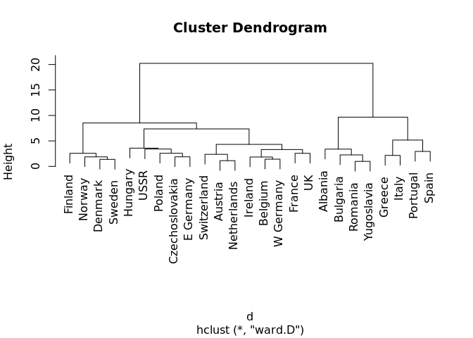<!-- -->

Flexclust—-

``` r
library(flexclust)
```

    ## Loading required package: grid

    ## Loading required package: modeltools

    ## Loading required package: stats4

    ## 
    ## Attaching package: 'modeltools'

    ## The following object is masked from 'package:plyr':
    ## 
    ##     empty

    ## 
    ## Attaching package: 'flexclust'

    ## The following object is masked from 'package:e1071':
    ## 
    ##     bclust

``` r
data("nutrient")

head(nutrient)
```

    ##                 energy protein fat calcium iron
    ## BEEF BRAISED       340      20  28       9  2.6
    ## HAMBURGER          245      21  17       9  2.7
    ## BEEF ROAST         420      15  39       7  2.0
    ## BEEF STEAK         375      19  32       9  2.6
    ## BEEF CANNED        180      22  10      17  3.7
    ## CHICKEN BROILED    115      20   3       8  1.4

``` r
nutrient %>%
  scale() %>%
  dist() -> d

h.fit_average <- hclust(d, method = "average")

plot(h.fit_average, hang = 1, cex = .8, 
     main = "Average Linkage Clustering")
```

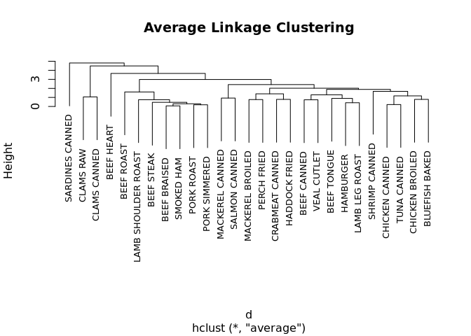<!-- -->

How many Clusters—-

``` r
library(NbClust)

nutrient %>%
  scale() -> nutrient.scaled

nc <-NbClust(nutrient.scaled, distance = 'euclidean', 
             min.nc = 2, max.nc = 15,
             method = 'average')
```

    ## Warning in pf(beale, pp, df2): NaNs produced
    
    ## Warning in pf(beale, pp, df2): NaNs produced

<!-- -->

    ## *** : The Hubert index is a graphical method of determining the number of clusters.
    ##                 In the plot of Hubert index, we seek a significant knee that corresponds to a 
    ##                 significant increase of the value of the measure i.e the significant peak in Hubert
    ##                 index second differences plot. 
    ## 

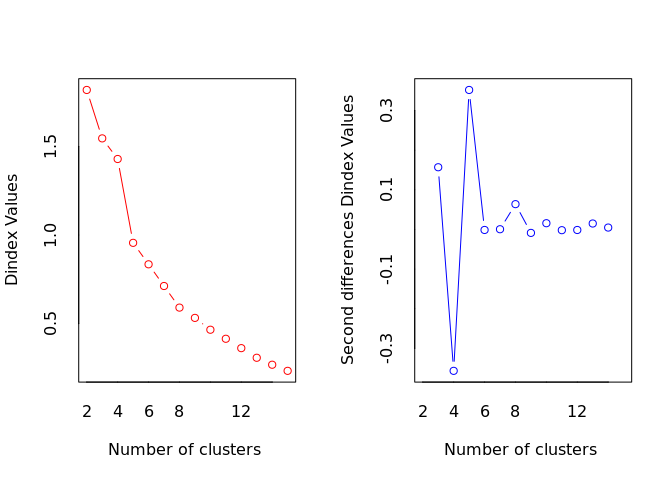<!-- -->

    ## *** : The D index is a graphical method of determining the number of clusters. 
    ##                 In the plot of D index, we seek a significant knee (the significant peak in Dindex
    ##                 second differences plot) that corresponds to a significant increase of the value of
    ##                 the measure. 
    ##  
    ## ******************************************************************* 
    ## * Among all indices:                                                
    ## * 4 proposed 2 as the best number of clusters 
    ## * 4 proposed 3 as the best number of clusters 
    ## * 2 proposed 4 as the best number of clusters 
    ## * 4 proposed 5 as the best number of clusters 
    ## * 1 proposed 9 as the best number of clusters 
    ## * 1 proposed 10 as the best number of clusters 
    ## * 2 proposed 13 as the best number of clusters 
    ## * 1 proposed 14 as the best number of clusters 
    ## * 4 proposed 15 as the best number of clusters 
    ## 
    ##                    ***** Conclusion *****                            
    ##  
    ## * According to the majority rule, the best number of clusters is  2 
    ##  
    ##  
    ## *******************************************************************

``` r
par(mfrow =c(1, 1))
barplot(table(nc$Best.nc[1, ]),
        xlab = 'Number of Clusters',
        ylab = 'Number of Criteria',
        main = 'Number of Clusters Chosen by 26 criteria')
```

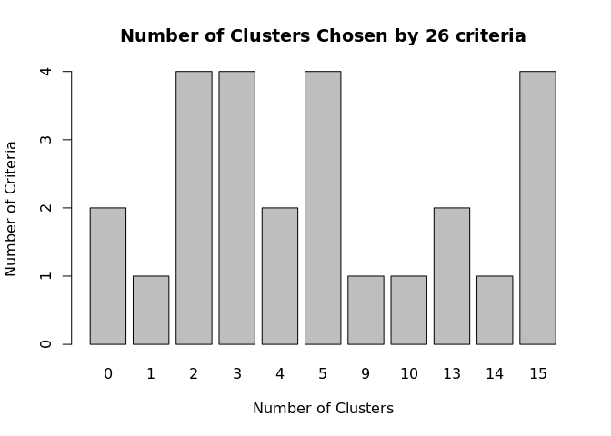<!-- -->

Results—-

``` r
clusters <- cutree(h.fit_average, k = 5)

table(clusters)
```

    ## clusters
    ##  1  2  3  4  5 
    ##  7 16  1  2  1

Visualization ———————————————————–

``` r
plot(h.fit_average,
     hang = -1, 
     cex = .8,
     main = 'Average Linkage Clustering with 5 Cluster Solution')

rect.hclust(h.fit_average, k=5)
```

<!-- -->

MDS ———————————————————————

``` r
data("eurodist")
eurodist
```

    ##                 Athens Barcelona Brussels Calais Cherbourg Cologne
    ## Barcelona         3313                                            
    ## Brussels          2963      1318                                  
    ## Calais            3175      1326      204                         
    ## Cherbourg         3339      1294      583    460                  
    ## Cologne           2762      1498      206    409       785        
    ## Copenhagen        3276      2218      966   1136      1545     760
    ## Geneva            2610       803      677    747       853    1662
    ## Gibraltar         4485      1172     2256   2224      2047    2436
    ## Hamburg           2977      2018      597    714      1115     460
    ## Hook of Holland   3030      1490      172    330       731     269
    ## Lisbon            4532      1305     2084   2052      1827    2290
    ## Lyons             2753       645      690    739       789     714
    ## Madrid            3949       636     1558   1550      1347    1764
    ## Marseilles        2865       521     1011   1059      1101    1035
    ## Milan             2282      1014      925   1077      1209     911
    ## Munich            2179      1365      747    977      1160     583
    ## Paris             3000      1033      285    280       340     465
    ## Rome               817      1460     1511   1662      1794    1497
    ## Stockholm         3927      2868     1616   1786      2196    1403
    ## Vienna            1991      1802     1175   1381      1588     937
    ##                 Copenhagen Geneva Gibraltar Hamburg Hook of Holland Lisbon
    ## Barcelona                                                                 
    ## Brussels                                                                  
    ## Calais                                                                    
    ## Cherbourg                                                                 
    ## Cologne                                                                   
    ## Copenhagen                                                                
    ## Geneva                1418                                                
    ## Gibraltar             3196   1975                                         
    ## Hamburg                460   1118      2897                               
    ## Hook of Holland        269    895      2428     550                       
    ## Lisbon                2971   1936       676    2671            2280       
    ## Lyons                 1458    158      1817    1159             863   1178
    ## Madrid                2498   1439       698    2198            1730    668
    ## Marseilles            1778    425      1693    1479            1183   1762
    ## Milan                 1537    328      2185    1238            1098   2250
    ## Munich                1104    591      2565     805             851   2507
    ## Paris                 1176    513      1971     877             457   1799
    ## Rome                  2050    995      2631    1751            1683   2700
    ## Stockholm              650   2068      3886     949            1500   3231
    ## Vienna                1455   1019      2974    1155            1205   2937
    ##                 Lyons Madrid Marseilles Milan Munich Paris Rome Stockholm
    ## Barcelona                                                                
    ## Brussels                                                                 
    ## Calais                                                                   
    ## Cherbourg                                                                
    ## Cologne                                                                  
    ## Copenhagen                                                               
    ## Geneva                                                                   
    ## Gibraltar                                                                
    ## Hamburg                                                                  
    ## Hook of Holland                                                          
    ## Lisbon                                                                   
    ## Lyons                                                                    
    ## Madrid           1281                                                    
    ## Marseilles        320   1157                                             
    ## Milan             328   1724        618                                  
    ## Munich            724   2010       1109   331                            
    ## Paris             471   1273        792   856    821                     
    ## Rome             1048   2097       1011   586    946  1476               
    ## Stockholm        2108   3188       2428  2187   1754  1827 2707          
    ## Vienna           1157   2409       1363   898    428  1249 1209      2105

``` r
loc <- cmdscale(eurodist)
x <- loc[, 1]
y <- loc[, 2]
plot(x, y, type = 'n', main = 'eurodist')
text(x, y, rownames(loc), cex = .8)
abline(v = 0, h = 0)
```

<!-- -->

-----

``` r
data("nutrient")
nutrient.scaled <- scale(nutrient)
nutrient.scaled %>% dist() -> d

d %>% cmdscale() -> loc
x <- loc[, 1]
y <- loc[, 2]
plot(x, y, type = 'n', main = 'Nutrient Distance')
text(x, y, rownames(loc), cex = .8)
abline(v = 0, h = 0)
```

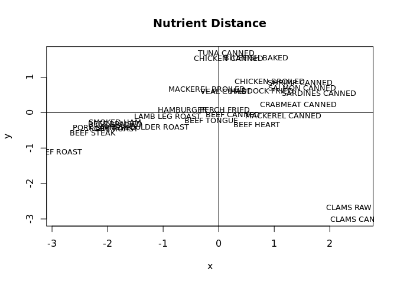<!-- -->

NN ———————————————————————-

``` r
library(nnet)
idx <- createDataPartition(iris$Species, p = c(.7, .3), list = F)
dim(idx)
```

    ## [1] 105   1

``` r
iris_train <- iris[idx, ]
iris_train
```

    ##     Sepal.Length Sepal.Width Petal.Length Petal.Width    Species
    ## 2            4.9         3.0          1.4         0.2     setosa
    ## 3            4.7         3.2          1.3         0.2     setosa
    ## 4            4.6         3.1          1.5         0.2     setosa
    ## 6            5.4         3.9          1.7         0.4     setosa
    ## 7            4.6         3.4          1.4         0.3     setosa
    ## 9            4.4         2.9          1.4         0.2     setosa
    ## 10           4.9         3.1          1.5         0.1     setosa
    ## 12           4.8         3.4          1.6         0.2     setosa
    ## 14           4.3         3.0          1.1         0.1     setosa
    ## 16           5.7         4.4          1.5         0.4     setosa
    ## 17           5.4         3.9          1.3         0.4     setosa
    ## 18           5.1         3.5          1.4         0.3     setosa
    ## 19           5.7         3.8          1.7         0.3     setosa
    ## 20           5.1         3.8          1.5         0.3     setosa
    ## 21           5.4         3.4          1.7         0.2     setosa
    ## 22           5.1         3.7          1.5         0.4     setosa
    ## 24           5.1         3.3          1.7         0.5     setosa
    ## 26           5.0         3.0          1.6         0.2     setosa
    ## 27           5.0         3.4          1.6         0.4     setosa
    ## 29           5.2         3.4          1.4         0.2     setosa
    ## 31           4.8         3.1          1.6         0.2     setosa
    ## 32           5.4         3.4          1.5         0.4     setosa
    ## 33           5.2         4.1          1.5         0.1     setosa
    ## 34           5.5         4.2          1.4         0.2     setosa
    ## 36           5.0         3.2          1.2         0.2     setosa
    ## 37           5.5         3.5          1.3         0.2     setosa
    ## 38           4.9         3.6          1.4         0.1     setosa
    ## 40           5.1         3.4          1.5         0.2     setosa
    ## 41           5.0         3.5          1.3         0.3     setosa
    ## 42           4.5         2.3          1.3         0.3     setosa
    ## 45           5.1         3.8          1.9         0.4     setosa
    ## 46           4.8         3.0          1.4         0.3     setosa
    ## 47           5.1         3.8          1.6         0.2     setosa
    ## 49           5.3         3.7          1.5         0.2     setosa
    ## 50           5.0         3.3          1.4         0.2     setosa
    ## 51           7.0         3.2          4.7         1.4 versicolor
    ## 52           6.4         3.2          4.5         1.5 versicolor
    ## 53           6.9         3.1          4.9         1.5 versicolor
    ## 54           5.5         2.3          4.0         1.3 versicolor
    ## 55           6.5         2.8          4.6         1.5 versicolor
    ## 56           5.7         2.8          4.5         1.3 versicolor
    ## 57           6.3         3.3          4.7         1.6 versicolor
    ## 59           6.6         2.9          4.6         1.3 versicolor
    ## 60           5.2         2.7          3.9         1.4 versicolor
    ## 61           5.0         2.0          3.5         1.0 versicolor
    ## 63           6.0         2.2          4.0         1.0 versicolor
    ## 64           6.1         2.9          4.7         1.4 versicolor
    ## 67           5.6         3.0          4.5         1.5 versicolor
    ## 69           6.2         2.2          4.5         1.5 versicolor
    ## 74           6.1         2.8          4.7         1.2 versicolor
    ## 77           6.8         2.8          4.8         1.4 versicolor
    ## 78           6.7         3.0          5.0         1.7 versicolor
    ## 79           6.0         2.9          4.5         1.5 versicolor
    ## 80           5.7         2.6          3.5         1.0 versicolor
    ## 81           5.5         2.4          3.8         1.1 versicolor
    ## 82           5.5         2.4          3.7         1.0 versicolor
    ## 83           5.8         2.7          3.9         1.2 versicolor
    ## 84           6.0         2.7          5.1         1.6 versicolor
    ## 85           5.4         3.0          4.5         1.5 versicolor
    ## 86           6.0         3.4          4.5         1.6 versicolor
    ## 88           6.3         2.3          4.4         1.3 versicolor
    ## 89           5.6         3.0          4.1         1.3 versicolor
    ## 90           5.5         2.5          4.0         1.3 versicolor
    ## 91           5.5         2.6          4.4         1.2 versicolor
    ## 93           5.8         2.6          4.0         1.2 versicolor
    ## 94           5.0         2.3          3.3         1.0 versicolor
    ## 96           5.7         3.0          4.2         1.2 versicolor
    ## 98           6.2         2.9          4.3         1.3 versicolor
    ## 99           5.1         2.5          3.0         1.1 versicolor
    ## 100          5.7         2.8          4.1         1.3 versicolor
    ## 102          5.8         2.7          5.1         1.9  virginica
    ## 105          6.5         3.0          5.8         2.2  virginica
    ## 106          7.6         3.0          6.6         2.1  virginica
    ## 107          4.9         2.5          4.5         1.7  virginica
    ## 108          7.3         2.9          6.3         1.8  virginica
    ## 110          7.2         3.6          6.1         2.5  virginica
    ## 111          6.5         3.2          5.1         2.0  virginica
    ## 113          6.8         3.0          5.5         2.1  virginica
    ## 114          5.7         2.5          5.0         2.0  virginica
    ## 115          5.8         2.8          5.1         2.4  virginica
    ## 116          6.4         3.2          5.3         2.3  virginica
    ## 117          6.5         3.0          5.5         1.8  virginica
    ## 118          7.7         3.8          6.7         2.2  virginica
    ## 119          7.7         2.6          6.9         2.3  virginica
    ## 122          5.6         2.8          4.9         2.0  virginica
    ## 123          7.7         2.8          6.7         2.0  virginica
    ## 124          6.3         2.7          4.9         1.8  virginica
    ## 125          6.7         3.3          5.7         2.1  virginica
    ## 126          7.2         3.2          6.0         1.8  virginica
    ## 127          6.2         2.8          4.8         1.8  virginica
    ## 128          6.1         3.0          4.9         1.8  virginica
    ## 129          6.4         2.8          5.6         2.1  virginica
    ## 130          7.2         3.0          5.8         1.6  virginica
    ## 132          7.9         3.8          6.4         2.0  virginica
    ## 137          6.3         3.4          5.6         2.4  virginica
    ## 138          6.4         3.1          5.5         1.8  virginica
    ## 139          6.0         3.0          4.8         1.8  virginica
    ## 140          6.9         3.1          5.4         2.1  virginica
    ## 142          6.9         3.1          5.1         2.3  virginica
    ## 143          5.8         2.7          5.1         1.9  virginica
    ## 144          6.8         3.2          5.9         2.3  virginica
    ## 146          6.7         3.0          5.2         2.3  virginica
    ## 148          6.5         3.0          5.2         2.0  virginica
    ## 149          6.2         3.4          5.4         2.3  virginica
    ## 150          5.9         3.0          5.1         1.8  virginica

``` r
iris_test <- iris[-idx, ]
iris_test
```

    ##     Sepal.Length Sepal.Width Petal.Length Petal.Width    Species
    ## 1            5.1         3.5          1.4         0.2     setosa
    ## 5            5.0         3.6          1.4         0.2     setosa
    ## 8            5.0         3.4          1.5         0.2     setosa
    ## 11           5.4         3.7          1.5         0.2     setosa
    ## 13           4.8         3.0          1.4         0.1     setosa
    ## 15           5.8         4.0          1.2         0.2     setosa
    ## 23           4.6         3.6          1.0         0.2     setosa
    ## 25           4.8         3.4          1.9         0.2     setosa
    ## 28           5.2         3.5          1.5         0.2     setosa
    ## 30           4.7         3.2          1.6         0.2     setosa
    ## 35           4.9         3.1          1.5         0.2     setosa
    ## 39           4.4         3.0          1.3         0.2     setosa
    ## 43           4.4         3.2          1.3         0.2     setosa
    ## 44           5.0         3.5          1.6         0.6     setosa
    ## 48           4.6         3.2          1.4         0.2     setosa
    ## 58           4.9         2.4          3.3         1.0 versicolor
    ## 62           5.9         3.0          4.2         1.5 versicolor
    ## 65           5.6         2.9          3.6         1.3 versicolor
    ## 66           6.7         3.1          4.4         1.4 versicolor
    ## 68           5.8         2.7          4.1         1.0 versicolor
    ## 70           5.6         2.5          3.9         1.1 versicolor
    ## 71           5.9         3.2          4.8         1.8 versicolor
    ## 72           6.1         2.8          4.0         1.3 versicolor
    ## 73           6.3         2.5          4.9         1.5 versicolor
    ## 75           6.4         2.9          4.3         1.3 versicolor
    ## 76           6.6         3.0          4.4         1.4 versicolor
    ## 87           6.7         3.1          4.7         1.5 versicolor
    ## 92           6.1         3.0          4.6         1.4 versicolor
    ## 95           5.6         2.7          4.2         1.3 versicolor
    ## 97           5.7         2.9          4.2         1.3 versicolor
    ## 101          6.3         3.3          6.0         2.5  virginica
    ## 103          7.1         3.0          5.9         2.1  virginica
    ## 104          6.3         2.9          5.6         1.8  virginica
    ## 109          6.7         2.5          5.8         1.8  virginica
    ## 112          6.4         2.7          5.3         1.9  virginica
    ## 120          6.0         2.2          5.0         1.5  virginica
    ## 121          6.9         3.2          5.7         2.3  virginica
    ## 131          7.4         2.8          6.1         1.9  virginica
    ## 133          6.4         2.8          5.6         2.2  virginica
    ## 134          6.3         2.8          5.1         1.5  virginica
    ## 135          6.1         2.6          5.6         1.4  virginica
    ## 136          7.7         3.0          6.1         2.3  virginica
    ## 141          6.7         3.1          5.6         2.4  virginica
    ## 145          6.7         3.3          5.7         2.5  virginica
    ## 147          6.3         2.5          5.0         1.9  virginica

``` r
nn.iris <- nnet(Species ~., data = iris_train, size= 2, rang = 0, 
                decay = 5e-4, maxit = 200)
```

    ## # weights:  19
    ## initial  value 115.354290 
    ## final  value 115.354290 
    ## converged

``` r
y_hat_nn <-predict(nn.iris, iris_test, type = 'class')
y_hat_nn %>% as.factor() -> y_hat_nn_fac

confusionMatrix(y_hat_nn_fac, iris_test$Species)
```

    ## Confusion Matrix and Statistics
    ## 
    ##             Reference
    ## Prediction   setosa versicolor virginica
    ##   setosa          4          5         6
    ##   versicolor      6          3         4
    ##   virginica       5          7         5
    ## 
    ## Overall Statistics
    ##                                          
    ##                Accuracy : 0.2667         
    ##                  95% CI : (0.146, 0.4194)
    ##     No Information Rate : 0.3333         
    ##     P-Value [Acc > NIR] : 0.8669         
    ##                                          
    ##                   Kappa : -0.1           
    ##                                          
    ##  Mcnemar's Test P-Value : 0.8013         
    ## 
    ## Statistics by Class:
    ## 
    ##                      Class: setosa Class: versicolor Class: virginica
    ## Sensitivity                0.26667           0.20000           0.3333
    ## Specificity                0.63333           0.66667           0.6000
    ## Pos Pred Value             0.26667           0.23077           0.2941
    ## Neg Pred Value             0.63333           0.62500           0.6429
    ## Prevalence                 0.33333           0.33333           0.3333
    ## Detection Rate             0.08889           0.06667           0.1111
    ## Detection Prevalence       0.33333           0.28889           0.3778
    ## Balanced Accuracy          0.45000           0.43333           0.4667

SVM ———————————————————————

``` r
library(e1071)
svm.iris <- svm(Species ~ ., data = iris_train, kernel = 'linear')

y_hat_svm <- predict(svm.iris, iris_test[, -5])

confusionMatrix(y_hat_svm, iris_test$Species)
```

    ## Confusion Matrix and Statistics
    ## 
    ##             Reference
    ## Prediction   setosa versicolor virginica
    ##   setosa         15          0         0
    ##   versicolor      0         14         1
    ##   virginica       0          1        14
    ## 
    ## Overall Statistics
    ##                                           
    ##                Accuracy : 0.9556          
    ##                  95% CI : (0.8485, 0.9946)
    ##     No Information Rate : 0.3333          
    ##     P-Value [Acc > NIR] : < 2.2e-16       
    ##                                           
    ##                   Kappa : 0.9333          
    ##                                           
    ##  Mcnemar's Test P-Value : NA              
    ## 
    ## Statistics by Class:
    ## 
    ##                      Class: setosa Class: versicolor Class: virginica
    ## Sensitivity                 1.0000            0.9333           0.9333
    ## Specificity                 1.0000            0.9667           0.9667
    ## Pos Pred Value              1.0000            0.9333           0.9333
    ## Neg Pred Value              1.0000            0.9667           0.9667
    ## Prevalence                  0.3333            0.3333           0.3333
    ## Detection Rate              0.3333            0.3111           0.3111
    ## Detection Prevalence        0.3333            0.3333           0.3333
    ## Balanced Accuracy           1.0000            0.9500           0.9500
