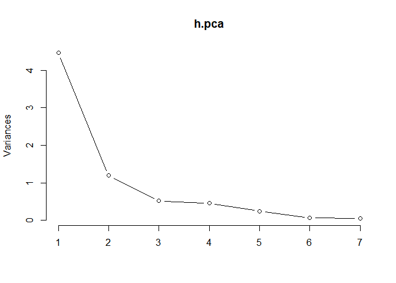
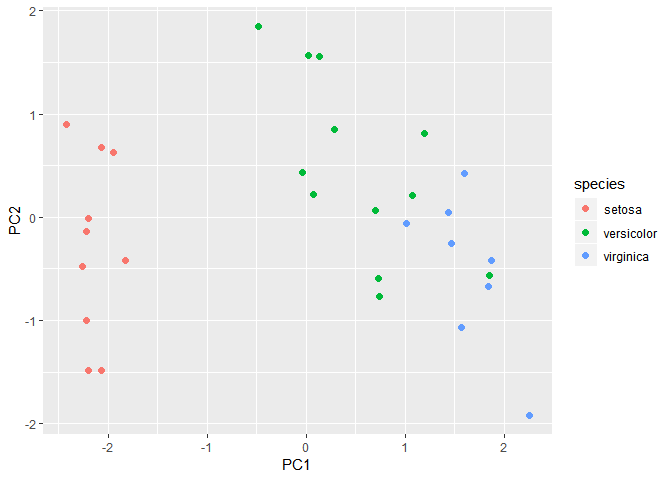
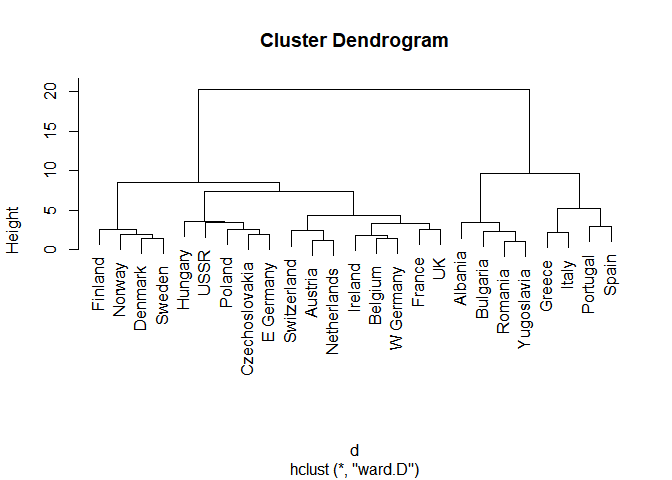
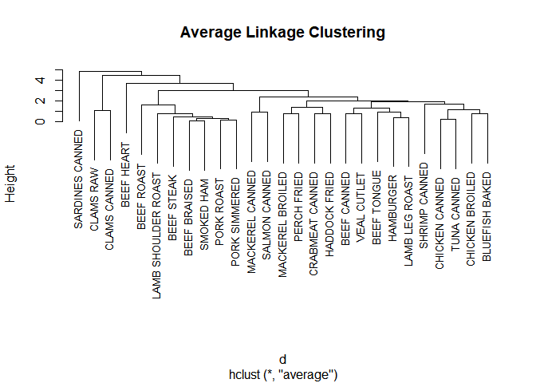
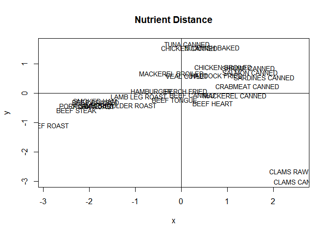

ADP ML\_3
================
jakinpilla
2019-05-10

``` r
# setwd("/home/insa/ADP_performance_test/")
setwd("C:/Users/Daniel/ADP_performance_test")
```

Data Loading ——————————

``` r
library(HSAUR)
```

    ## Loading required package: tools

``` r
data('heptathlon')

head(heptathlon)
```

    ##                     hurdles highjump  shot run200m longjump javelin
    ## Joyner-Kersee (USA)   12.69     1.86 15.80   22.56     7.27   45.66
    ## John (GDR)            12.85     1.80 16.23   23.65     6.71   42.56
    ## Behmer (GDR)          13.20     1.83 14.20   23.10     6.68   44.54
    ## Sablovskaite (URS)    13.61     1.80 15.23   23.92     6.25   42.78
    ## Choubenkova (URS)     13.51     1.74 14.76   23.93     6.32   47.46
    ## Schulz (GDR)          13.75     1.83 13.50   24.65     6.33   42.82
    ##                     run800m score
    ## Joyner-Kersee (USA)  128.51  7291
    ## John (GDR)           126.12  6897
    ## Behmer (GDR)         124.20  6858
    ## Sablovskaite (URS)   132.24  6540
    ## Choubenkova (URS)    127.90  6540
    ## Schulz (GDR)         125.79  6411

``` r
dim(heptathlon)
```

    ## [1] 25  8

``` r
rownames(heptathlon)
```

    ##  [1] "Joyner-Kersee (USA)" "John (GDR)"          "Behmer (GDR)"       
    ##  [4] "Sablovskaite (URS)"  "Choubenkova (URS)"   "Schulz (GDR)"       
    ##  [7] "Fleming (AUS)"       "Greiner (USA)"       "Lajbnerova (CZE)"   
    ## [10] "Bouraga (URS)"       "Wijnsma (HOL)"       "Dimitrova (BUL)"    
    ## [13] "Scheider (SWI)"      "Braun (FRG)"         "Ruotsalainen (FIN)" 
    ## [16] "Yuping (CHN)"        "Hagger (GB)"         "Brown (USA)"        
    ## [19] "Mulliner (GB)"       "Hautenauve (BEL)"    "Kytola (FIN)"       
    ## [22] "Geremias (BRA)"      "Hui-Ing (TAI)"       "Jeong-Mi (KOR)"     
    ## [25] "Launa (PNG)"

Score transform ——————————

``` r
heptathlon %>%
  as_tibble() %>%
  mutate(hurdles = max(hurdles) - hurdles) %>%
  mutate(run200m = max(run200m) - run200m) %>%
  mutate(run800m = max(run800m) - run800m) -> heptathlon

cor(heptathlon)
```

    ##              hurdles    highjump      shot   run200m   longjump
    ## hurdles  1.000000000 0.811402536 0.6513347 0.7737205 0.91213362
    ## highjump 0.811402536 1.000000000 0.4407861 0.4876637 0.78244227
    ## shot     0.651334688 0.440786140 1.0000000 0.6826704 0.74307300
    ## run200m  0.773720543 0.487663685 0.6826704 1.0000000 0.81720530
    ## longjump 0.912133617 0.782442273 0.7430730 0.8172053 1.00000000
    ## javelin  0.007762549 0.002153016 0.2689888 0.3330427 0.06710841
    ## run800m  0.779257110 0.591162823 0.4196196 0.6168101 0.69951116
    ## score    0.923198458 0.767358719 0.7996987 0.8648825 0.95043678
    ##               javelin     run800m     score
    ## hurdles   0.007762549  0.77925711 0.9231985
    ## highjump  0.002153016  0.59116282 0.7673587
    ## shot      0.268988837  0.41961957 0.7996987
    ## run200m   0.333042722  0.61681006 0.8648825
    ## longjump  0.067108409  0.69951116 0.9504368
    ## javelin   1.000000000 -0.02004909 0.2531466
    ## run800m  -0.020049088  1.00000000 0.7727757
    ## score     0.253146604  0.77277571 1.0000000

``` r
ggpairs(heptathlon)
```

<!-- -->

scale() ——————————

``` r
scale(heptathlon) %>% head()
```

    ##        hurdles   highjump      shot      run200m  longjump   javelin
    ## [1,] 1.5611259  1.0007405 1.7979946  2.154798275 2.3567502 1.1782304
    ## [2,] 1.3439258  0.2309401 2.0862207  1.030573634 1.1758446 0.3039212
    ## [3,] 0.8688005  0.6158403 0.7255254  1.597842949 1.1125818 0.8623510
    ## [4,] 0.3122252  0.2309401 1.4159274  0.752095971 0.2058150 0.3659689
    ## [5,] 0.4479753 -0.5388603 1.1008896  0.741781983 0.3534282 1.6858939
    ## [6,] 0.1221751  0.6158403 0.2563201 -0.000825119 0.3745158 0.3772503
    ##        run800m     score
    ## [1,] 0.9098926 2.1116340
    ## [2,] 1.1981540 1.4185452
    ## [3,] 1.4297279 1.3499400
    ## [4,] 0.4600120 0.7905434
    ## [5,] 0.9834656 0.7905434
    ## [6,] 1.2379557 0.5636184

``` r
iris %>%
  select_if(is.numeric) %>%
  scale() %>%
  as_tibble() %>%
  cbind(., iris$Species) -> iris_scaled

# ?scale()
# require(stats)
# x <- matrix(1:10, ncol = 2)
# centered.x <- scale(x, scale = F)
# scale(x) %>% cov()
```

If scale is TRUE then scaling is done by dividing the (centered) columns
of x by their standard deviations if center is TRUE, and the root mean
square otherwise. If scale is FALSE, no scaling is done. Select vars
——————————

``` r
library(mlbench); data("Soybean")
```

    ## Warning: package 'mlbench' was built under R version 3.5.3

``` r
summary(Soybean)
```

    ##                  Class          date     plant.stand  precip      temp    
    ##  brown-spot         : 92   5      :149   0   :354    0   : 74   0   : 80  
    ##  alternarialeaf-spot: 91   4      :131   1   :293    1   :112   1   :374  
    ##  frog-eye-leaf-spot : 91   3      :118   NA's: 36    2   :459   2   :199  
    ##  phytophthora-rot   : 88   2      : 93               NA's: 38   NA's: 30  
    ##  anthracnose        : 44   6      : 90                                    
    ##  brown-stem-rot     : 44   (Other):101                                    
    ##  (Other)            :233   NA's   :  1                                    
    ##    hail     crop.hist  area.dam    sever     seed.tmt     germ    
    ##  0   :435   0   : 65   0   :123   0   :195   0   :305   0   :165  
    ##  1   :127   1   :165   1   :227   1   :322   1   :222   1   :213  
    ##  NA's:121   2   :219   2   :145   2   : 45   2   : 35   2   :193  
    ##             3   :218   3   :187   NA's:121   NA's:121   NA's:112  
    ##             NA's: 16   NA's:  1                                   
    ##                                                                   
    ##                                                                   
    ##  plant.growth leaves  leaf.halo  leaf.marg  leaf.size  leaf.shread
    ##  0   :441     0: 77   0   :221   0   :357   0   : 51   0   :487   
    ##  1   :226     1:606   1   : 36   1   : 21   1   :327   1   : 96   
    ##  NA's: 16             2   :342   2   :221   2   :221   NA's:100   
    ##                       NA's: 84   NA's: 84   NA's: 84              
    ##                                                                   
    ##                                                                   
    ##                                                                   
    ##  leaf.malf  leaf.mild    stem     lodging    stem.cankers canker.lesion
    ##  0   :554   0   :535   0   :296   0   :520   0   :379     0   :320     
    ##  1   : 45   1   : 20   1   :371   1   : 42   1   : 39     1   : 83     
    ##  NA's: 84   2   : 20   NA's: 16   NA's:121   2   : 36     2   :177     
    ##             NA's:108                         3   :191     3   : 65     
    ##                                              NA's: 38     NA's: 38     
    ##                                                                        
    ##                                                                        
    ##  fruiting.bodies ext.decay  mycelium   int.discolor sclerotia  fruit.pods
    ##  0   :473        0   :497   0   :639   0   :581     0   :625   0   :407  
    ##  1   :104        1   :135   1   :  6   1   : 44     1   : 20   1   :130  
    ##  NA's:106        2   : 13   NA's: 38   2   : 20     NA's: 38   2   : 14  
    ##                  NA's: 38              NA's: 38                3   : 48  
    ##                                                                NA's: 84  
    ##                                                                          
    ##                                                                          
    ##  fruit.spots   seed     mold.growth seed.discolor seed.size  shriveling
    ##  0   :345    0   :476   0   :524    0   :513      0   :532   0   :539  
    ##  1   : 75    1   :115   1   : 67    1   : 64      1   : 59   1   : 38  
    ##  2   : 57    NA's: 92   NA's: 92    NA's:106      NA's: 92   NA's:106  
    ##  4   :100                                                              
    ##  NA's:106                                                              
    ##                                                                        
    ##                                                                        
    ##   roots    
    ##  0   :551  
    ##  1   : 86  
    ##  2   : 15  
    ##  NA's: 31  
    ##            
    ##            
    ## 

``` r
Soybean %>% as_tibble() -> Soybean
Soybean %>% select(Class) %>% unique() # 19 Species...
```

    ## # A tibble: 19 x 1
    ##    Class                      
    ##    <fct>                      
    ##  1 diaporthe-stem-canker      
    ##  2 charcoal-rot               
    ##  3 rhizoctonia-root-rot       
    ##  4 phytophthora-rot           
    ##  5 brown-stem-rot             
    ##  6 powdery-mildew             
    ##  7 downy-mildew               
    ##  8 brown-spot                 
    ##  9 bacterial-blight           
    ## 10 bacterial-pustule          
    ## 11 purple-seed-stain          
    ## 12 anthracnose                
    ## 13 phyllosticta-leaf-spot     
    ## 14 alternarialeaf-spot        
    ## 15 frog-eye-leaf-spot         
    ## 16 diaporthe-pod-&-stem-blight
    ## 17 cyst-nematode              
    ## 18 2-4-d-injury               
    ## 19 herbicide-injury

caret::nearZeroVar() ——————————

nearZeroVar diagnoses predictors that have one unique value (i.e. are
zero variance predictors) or predictors that are have both of the
following characteristics: they have very few unique values relative to
the number of samples and the ratio of the frequency of the most common
value to the frequency of the second most common value is large.

``` r
colnames(Soybean)[nearZeroVar(Soybean)]
```

    ## [1] "leaf.mild" "mycelium"  "sclerotia"

``` r
Soybean %>%
  as_tibble() %>%
  select(-nearZeroVar(.)) -> mySoybean; mySoybean
```

    ## # A tibble: 683 x 33
    ##    Class date  plant.stand precip temp  hail  crop.hist area.dam sever
    ##    <fct> <fct> <ord>       <ord>  <ord> <fct> <fct>     <fct>    <fct>
    ##  1 diap~ 6     0           2      1     0     1         1        1    
    ##  2 diap~ 4     0           2      1     0     2         0        2    
    ##  3 diap~ 3     0           2      1     0     1         0        2    
    ##  4 diap~ 3     0           2      1     0     1         0        2    
    ##  5 diap~ 6     0           2      1     0     2         0        1    
    ##  6 diap~ 5     0           2      1     0     3         0        1    
    ##  7 diap~ 5     0           2      1     0     2         0        1    
    ##  8 diap~ 4     0           2      1     1     1         0        1    
    ##  9 diap~ 6     0           2      1     0     3         0        1    
    ## 10 diap~ 4     0           2      1     0     2         0        2    
    ## # ... with 673 more rows, and 24 more variables: seed.tmt <fct>,
    ## #   germ <ord>, plant.growth <fct>, leaves <fct>, leaf.halo <fct>,
    ## #   leaf.marg <fct>, leaf.size <ord>, leaf.shread <fct>, leaf.malf <fct>,
    ## #   stem <fct>, lodging <fct>, stem.cankers <fct>, canker.lesion <fct>,
    ## #   fruiting.bodies <fct>, ext.decay <fct>, int.discolor <fct>,
    ## #   fruit.pods <fct>, fruit.spots <fct>, seed <fct>, mold.growth <fct>,
    ## #   seed.discolor <fct>, seed.size <fct>, shriveling <fct>, roots <fct>

caret::findCorrelation() ——————————

This function searches through a correlation matrix and returns a vector
of integers corresponding to columns to remove to reduce pair-wise
correlations.

``` r
data('Vehicle')
Vehicle %>% as_tibble() -> vehicle; vehicle
```

    ## # A tibble: 846 x 19
    ##     Comp  Circ D.Circ Rad.Ra Pr.Axis.Ra Max.L.Ra Scat.Ra Elong Pr.Axis.Rect
    ##    <dbl> <dbl>  <dbl>  <dbl>      <dbl>    <dbl>   <dbl> <dbl>        <dbl>
    ##  1    95    48     83    178         72       10     162    42           20
    ##  2    91    41     84    141         57        9     149    45           19
    ##  3   104    50    106    209         66       10     207    32           23
    ##  4    93    41     82    159         63        9     144    46           19
    ##  5    85    44     70    205        103       52     149    45           19
    ##  6   107    57    106    172         50        6     255    26           28
    ##  7    97    43     73    173         65        6     153    42           19
    ##  8    90    43     66    157         65        9     137    48           18
    ##  9    86    34     62    140         61        7     122    54           17
    ## 10    93    44     98    197         62       11     183    36           22
    ## # ... with 836 more rows, and 10 more variables: Max.L.Rect <dbl>,
    ## #   Sc.Var.Maxis <dbl>, Sc.Var.maxis <dbl>, Ra.Gyr <dbl>,
    ## #   Skew.Maxis <dbl>, Skew.maxis <dbl>, Kurt.maxis <dbl>,
    ## #   Kurt.Maxis <dbl>, Holl.Ra <dbl>, Class <fct>

``` r
# vehicle %>% View()

vehicle %>%
  select(-Class) %>%
  cor() %>%
  findCorrelation() -> high_cor; high_cor # default =.9
```

    ## [1]  3  8 11  7  9  2

``` r
vehicle %>%
  select(-Class) %>%
  cor() %>%
  findCorrelation(cutoff = .7) -> high_cor; high_cor
```

    ##  [1]  3  8 11  7  9 12  2 13 18 17

``` r
vehicle %>%
  select(-high_cor) -> vehicle_filered; vehicle_filered
```

    ## # A tibble: 846 x 9
    ##     Comp Rad.Ra Pr.Axis.Ra Max.L.Ra Max.L.Rect Skew.Maxis Skew.maxis
    ##    <dbl>  <dbl>      <dbl>    <dbl>      <dbl>      <dbl>      <dbl>
    ##  1    95    178         72       10        159         70          6
    ##  2    91    141         57        9        143         72          9
    ##  3   104    209         66       10        158         73         14
    ##  4    93    159         63        9        143         63          6
    ##  5    85    205        103       52        144        127          9
    ##  6   107    172         50        6        169         85          5
    ##  7    97    173         65        6        143         66         13
    ##  8    90    157         65        9        146         67          3
    ##  9    86    140         61        7        127         64          2
    ## 10    93    197         62       11        146         64          4
    ## # ... with 836 more rows, and 2 more variables: Kurt.maxis <dbl>,
    ## #   Class <fct>

PCA ==\> K-means Clustering ——————————

``` r
heptathlon %>%
  select(-score) %>%
  prcomp(scale = T) -> h.pca; h.pca
```

    ## Standard deviations (1, .., p=7):
    ## [1] 2.1119364 1.0928497 0.7218131 0.6761411 0.4952441 0.2701029 0.2213617
    ## 
    ## Rotation (n x k) = (7 x 7):
    ##                 PC1         PC2         PC3         PC4         PC5
    ## hurdles  -0.4528710  0.15792058 -0.04514996  0.02653873 -0.09494792
    ## highjump -0.3771992  0.24807386 -0.36777902  0.67999172  0.01879888
    ## shot     -0.3630725 -0.28940743  0.67618919  0.12431725  0.51165201
    ## run200m  -0.4078950 -0.26038545  0.08359211 -0.36106580 -0.64983404
    ## longjump -0.4562318  0.05587394  0.13931653  0.11129249 -0.18429810
    ## javelin  -0.0754090 -0.84169212 -0.47156016  0.12079924  0.13510669
    ## run800m  -0.3749594  0.22448984 -0.39585671 -0.60341130  0.50432116
    ##                  PC6         PC7
    ## hurdles  -0.78334101  0.38024707
    ## highjump  0.09939981 -0.43393114
    ## shot     -0.05085983 -0.21762491
    ## run200m   0.02495639 -0.45338483
    ## longjump  0.59020972  0.61206388
    ## javelin  -0.02724076  0.17294667
    ## run800m   0.15555520 -0.09830963

``` r
summary(h.pca)
```

    ## Importance of components:
    ##                           PC1    PC2     PC3     PC4     PC5     PC6
    ## Standard deviation     2.1119 1.0928 0.72181 0.67614 0.49524 0.27010
    ## Proportion of Variance 0.6372 0.1706 0.07443 0.06531 0.03504 0.01042
    ## Cumulative Proportion  0.6372 0.8078 0.88223 0.94754 0.98258 0.99300
    ##                           PC7
    ## Standard deviation     0.2214
    ## Proportion of Variance 0.0070
    ## Cumulative Proportion  1.0000

``` r
screeplot(h.pca, type ='lines')
```

<!-- -->

First and Second Components ——————————

``` r
h.pca$rotation[, 1:2] # What is principal components(data features to PC)...
```

    ##                 PC1         PC2
    ## hurdles  -0.4528710  0.15792058
    ## highjump -0.3771992  0.24807386
    ## shot     -0.3630725 -0.28940743
    ## run200m  -0.4078950 -0.26038545
    ## longjump -0.4562318  0.05587394
    ## javelin  -0.0754090 -0.84169212
    ## run800m  -0.3749594  0.22448984

``` r
h.pca$x %>% head() # principal components per persons(per data objects)...
```

    ##            PC1         PC2        PC3         PC4        PC5         PC6
    ## [1,] -4.121448 -1.24240435  0.3699131  0.02300174 -0.4260062  0.33932922
    ## [2,] -2.882186 -0.52372600  0.8974147 -0.47545176  0.7030659 -0.23808730
    ## [3,] -2.649634 -0.67876243 -0.4591767 -0.67962860 -0.1055252  0.23919071
    ## [4,] -1.343351 -0.69228324  0.5952704 -0.14067052  0.4539282 -0.09180564
    ## [5,] -1.359026 -1.75316563 -0.1507013 -0.83595001  0.6871948 -0.12630397
    ## [6,] -1.043847  0.07940725 -0.6745305 -0.20557253  0.7379335  0.35578939
    ##             PC7
    ## [1,]  0.3479213
    ## [2,]  0.1440158
    ## [3,] -0.1296478
    ## [4,] -0.4865780
    ## [5,]  0.2394820
    ## [6,] -0.1034143

``` r
biplot(h.pca, cex=.7)
```

<!-- -->

ykmeans() ——————————

``` r
library(ykmeans)

h <- data.frame(h.pca$x)

head(h)
```

    ##         PC1         PC2        PC3         PC4        PC5         PC6
    ## 1 -4.121448 -1.24240435  0.3699131  0.02300174 -0.4260062  0.33932922
    ## 2 -2.882186 -0.52372600  0.8974147 -0.47545176  0.7030659 -0.23808730
    ## 3 -2.649634 -0.67876243 -0.4591767 -0.67962860 -0.1055252  0.23919071
    ## 4 -1.343351 -0.69228324  0.5952704 -0.14067052  0.4539282 -0.09180564
    ## 5 -1.359026 -1.75316563 -0.1507013 -0.83595001  0.6871948 -0.12630397
    ## 6 -1.043847  0.07940725 -0.6745305 -0.20557253  0.7379335  0.35578939
    ##          PC7
    ## 1  0.3479213
    ## 2  0.1440158
    ## 3 -0.1296478
    ## 4 -0.4865780
    ## 5  0.2394820
    ## 6 -0.1034143

``` r
keys <- names(h); keys
```

    ## [1] "PC1" "PC2" "PC3" "PC4" "PC5" "PC6" "PC7"

``` r
km <- ykmeans(h, 
              keys, # variable names...
              'PC1', # target names...
              3:6 # number of cluster...
)

km %>% head()
```

    ##          PC1         PC2        PC3         PC4        PC5         PC6
    ## 76 -4.121448 -1.24240435  0.3699131  0.02300174 -0.4260062  0.33932922
    ## 77 -2.882186 -0.52372600  0.8974147 -0.47545176  0.7030659 -0.23808730
    ## 78 -2.649634 -0.67876243 -0.4591767 -0.67962860 -0.1055252  0.23919071
    ## 79 -1.343351 -0.69228324  0.5952704 -0.14067052  0.4539282 -0.09180564
    ## 80 -1.359026 -1.75316563 -0.1507013 -0.83595001  0.6871948 -0.12630397
    ## 81 -1.043847  0.07940725 -0.6745305 -0.20557253  0.7379335  0.35578939
    ##           PC7 cluster .average.sd
    ## 76  0.3479213       1   0.5721999
    ## 77  0.1440158       1   0.5721999
    ## 78 -0.1296478       1   0.5721999
    ## 79 -0.4865780       2   0.5721999
    ## 80  0.2394820       1   0.5721999
    ## 81 -0.1034143       2   0.5721999

``` r
table(km$cluster)
```

    ## 
    ## 1 2 3 4 5 6 
    ## 4 7 3 4 6 1

``` r
ggplot(km, 
       aes(x = PC1, y = PC2, col = as.factor(cluster))) +
  geom_point(size = 2)
```

<!-- -->

kmeans() ——————————

``` r
k <- kmeans(h[, 1:2], 5)
k$cluster %>% as.factor() -> k$cluster

ggplot(h, aes(PC1, PC2, col = k$cluster)) + geom_point(size = 2)
```

<!-- -->

PCA ==\> SVM Classification —————————— Data Loading ——————————

``` r
library(e1071)
```

    ## Warning: package 'e1071' was built under R version 3.5.3

``` r
iris %>% 
  select(-Species) %>%
  prcomp(scale = T) -> ir.pca; ir.pca
```

    ## Standard deviations (1, .., p=4):
    ## [1] 1.7083611 0.9560494 0.3830886 0.1439265
    ## 
    ## Rotation (n x k) = (4 x 4):
    ##                     PC1         PC2        PC3        PC4
    ## Sepal.Length  0.5210659 -0.37741762  0.7195664  0.2612863
    ## Sepal.Width  -0.2693474 -0.92329566 -0.2443818 -0.1235096
    ## Petal.Length  0.5804131 -0.02449161 -0.1421264 -0.8014492
    ## Petal.Width   0.5648565 -0.06694199 -0.6342727  0.5235971

``` r
ir.pca$x %>% as_tibble() -> ir; ir
```

    ## # A tibble: 150 x 4
    ##      PC1     PC2     PC3      PC4
    ##    <dbl>   <dbl>   <dbl>    <dbl>
    ##  1 -2.26 -0.478   0.127   0.0241 
    ##  2 -2.07  0.672   0.234   0.103  
    ##  3 -2.36  0.341  -0.0441  0.0283 
    ##  4 -2.29  0.595  -0.0910 -0.0657 
    ##  5 -2.38 -0.645  -0.0157 -0.0358 
    ##  6 -2.07 -1.48   -0.0269  0.00659
    ##  7 -2.44 -0.0475 -0.334  -0.0367 
    ##  8 -2.23 -0.222   0.0884 -0.0245 
    ##  9 -2.33  1.11   -0.145  -0.0268 
    ## 10 -2.18  0.467   0.253  -0.0398 
    ## # ... with 140 more rows

``` r
ir %>%
  cbind(., species = iris$Species) %>% 
  as_tibble() -> iris_pca

iris_pca
```

    ## # A tibble: 150 x 5
    ##      PC1     PC2     PC3      PC4 species
    ##    <dbl>   <dbl>   <dbl>    <dbl> <fct>  
    ##  1 -2.26 -0.478   0.127   0.0241  setosa 
    ##  2 -2.07  0.672   0.234   0.103   setosa 
    ##  3 -2.36  0.341  -0.0441  0.0283  setosa 
    ##  4 -2.29  0.595  -0.0910 -0.0657  setosa 
    ##  5 -2.38 -0.645  -0.0157 -0.0358  setosa 
    ##  6 -2.07 -1.48   -0.0269  0.00659 setosa 
    ##  7 -2.44 -0.0475 -0.334  -0.0367  setosa 
    ##  8 -2.23 -0.222   0.0884 -0.0245  setosa 
    ##  9 -2.33  1.11   -0.145  -0.0268  setosa 
    ## 10 -2.18  0.467   0.253  -0.0398  setosa 
    ## # ... with 140 more rows

Data Spliting ——————————

``` r
idx <- caret::createDataPartition(iris_pca$species, p = c(.8, .2), list = F)
iris_pca_train <- iris_pca[idx, ]
dim(iris_pca_train)
```

    ## [1] 120   5

``` r
iris_pca_test <-iris_pca[-idx, ]
dim(iris_pca_test)
```

    ## [1] 30  5

Modeling ——————————

``` r
m_svm <- svm(species ~ ., data = iris_pca_train)
m_svm
```

    ## 
    ## Call:
    ## svm(formula = species ~ ., data = iris_pca_train)
    ## 
    ## 
    ## Parameters:
    ##    SVM-Type:  C-classification 
    ##  SVM-Kernel:  radial 
    ##        cost:  1 
    ##       gamma:  0.25 
    ## 
    ## Number of Support Vectors:  68

Predicting ——————————

``` r
y_hat_svm <- predict(m_svm, newdata = iris_pca_test[, 1:4])

table(y_hat_svm)
```

    ## y_hat_svm
    ##     setosa versicolor  virginica 
    ##         10         12          8

Evaluating ——————————

``` r
confusionMatrix(y_hat_svm, iris_pca_test$species)
```

    ## Confusion Matrix and Statistics
    ## 
    ##             Reference
    ## Prediction   setosa versicolor virginica
    ##   setosa         10          0         0
    ##   versicolor      0         10         2
    ##   virginica       0          0         8
    ## 
    ## Overall Statistics
    ##                                           
    ##                Accuracy : 0.9333          
    ##                  95% CI : (0.7793, 0.9918)
    ##     No Information Rate : 0.3333          
    ##     P-Value [Acc > NIR] : 8.747e-12       
    ##                                           
    ##                   Kappa : 0.9             
    ##                                           
    ##  Mcnemar's Test P-Value : NA              
    ## 
    ## Statistics by Class:
    ## 
    ##                      Class: setosa Class: versicolor Class: virginica
    ## Sensitivity                 1.0000            1.0000           0.8000
    ## Specificity                 1.0000            0.9000           1.0000
    ## Pos Pred Value              1.0000            0.8333           1.0000
    ## Neg Pred Value              1.0000            1.0000           0.9091
    ## Prevalence                  0.3333            0.3333           0.3333
    ## Detection Rate              0.3333            0.3333           0.2667
    ## Detection Prevalence        0.3333            0.4000           0.2667
    ## Balanced Accuracy           1.0000            0.9500           0.9000

Visualization ——————————

``` r
y_hat_df <- data.frame(iris_pca_test[, 1:4], y_hat = y_hat_svm)

y_hat_df %>% as_tibble()
```

    ## # A tibble: 30 x 5
    ##      PC1      PC2      PC3      PC4 y_hat 
    ##    <dbl>    <dbl>    <dbl>    <dbl> <fct> 
    ##  1 -2.26 -0.478    0.127    0.0241  setosa
    ##  2 -2.07  0.672    0.234    0.103   setosa
    ##  3 -2.07 -1.48    -0.0269   0.00659 setosa
    ##  4 -2.20 -1.48     0.00533  0.188   setosa
    ##  5 -2.22 -0.137   -0.118   -0.269   setosa
    ##  6 -1.95  0.624    0.305    0.0434  setosa
    ##  7 -1.83 -0.422    0.270    0.239   setosa
    ##  8 -2.42  0.901   -0.193   -0.00971 setosa
    ##  9 -2.22 -0.995    0.181   -0.0149  setosa
    ## 10 -2.20 -0.00919  0.153    0.0492  setosa
    ## # ... with 20 more rows

``` r
ggplot(y_hat_df,
       aes(x = PC1, y = PC2, col = y_hat)) + geom_point(size = 2)
```

<!-- -->

With caret style ——————————

setting fitControl ——————————

``` r
fitControl = trainControl(method = 'repeatedcv', 
                          number = 10, 
                          repeats = 3,
                          verboseIter = T)
```

Model Training…

``` r
iris_svm <- train(species ~ ., 
                  data = iris_pca_train,
                  method = 'svmLinear',
                  trControl = fitControl)
```

    ## + Fold01.Rep1: C=1 
    ## - Fold01.Rep1: C=1 
    ## + Fold02.Rep1: C=1 
    ## - Fold02.Rep1: C=1 
    ## + Fold03.Rep1: C=1 
    ## - Fold03.Rep1: C=1 
    ## + Fold04.Rep1: C=1 
    ## - Fold04.Rep1: C=1 
    ## + Fold05.Rep1: C=1 
    ## - Fold05.Rep1: C=1 
    ## + Fold06.Rep1: C=1 
    ## - Fold06.Rep1: C=1 
    ## + Fold07.Rep1: C=1 
    ## - Fold07.Rep1: C=1 
    ## + Fold08.Rep1: C=1 
    ## - Fold08.Rep1: C=1 
    ## + Fold09.Rep1: C=1 
    ## - Fold09.Rep1: C=1 
    ## + Fold10.Rep1: C=1 
    ## - Fold10.Rep1: C=1 
    ## + Fold01.Rep2: C=1 
    ## - Fold01.Rep2: C=1 
    ## + Fold02.Rep2: C=1 
    ## - Fold02.Rep2: C=1 
    ## + Fold03.Rep2: C=1 
    ## - Fold03.Rep2: C=1 
    ## + Fold04.Rep2: C=1 
    ## - Fold04.Rep2: C=1 
    ## + Fold05.Rep2: C=1 
    ## - Fold05.Rep2: C=1 
    ## + Fold06.Rep2: C=1 
    ## - Fold06.Rep2: C=1 
    ## + Fold07.Rep2: C=1 
    ## - Fold07.Rep2: C=1 
    ## + Fold08.Rep2: C=1 
    ## - Fold08.Rep2: C=1 
    ## + Fold09.Rep2: C=1 
    ## - Fold09.Rep2: C=1 
    ## + Fold10.Rep2: C=1 
    ## - Fold10.Rep2: C=1 
    ## + Fold01.Rep3: C=1 
    ## - Fold01.Rep3: C=1 
    ## + Fold02.Rep3: C=1 
    ## - Fold02.Rep3: C=1 
    ## + Fold03.Rep3: C=1 
    ## - Fold03.Rep3: C=1 
    ## + Fold04.Rep3: C=1 
    ## - Fold04.Rep3: C=1 
    ## + Fold05.Rep3: C=1 
    ## - Fold05.Rep3: C=1 
    ## + Fold06.Rep3: C=1 
    ## - Fold06.Rep3: C=1 
    ## + Fold07.Rep3: C=1 
    ## - Fold07.Rep3: C=1 
    ## + Fold08.Rep3: C=1 
    ## - Fold08.Rep3: C=1 
    ## + Fold09.Rep3: C=1 
    ## - Fold09.Rep3: C=1 
    ## + Fold10.Rep3: C=1 
    ## - Fold10.Rep3: C=1 
    ## Aggregating results
    ## Fitting final model on full training set

Predict with test dataset…

``` r
y_hat_caret_svm <- predict(iris_svm, iris_pca_test[, 1:4])

y_hat_caret_svm
```

    ##  [1] setosa     setosa     setosa     setosa     setosa     setosa    
    ##  [7] setosa     setosa     setosa     setosa     versicolor versicolor
    ## [13] versicolor versicolor versicolor versicolor versicolor versicolor
    ## [19] versicolor versicolor virginica  virginica  virginica  virginica 
    ## [25] virginica  virginica  versicolor versicolor virginica  virginica 
    ## Levels: setosa versicolor virginica

Evaluating…

``` r
confusionMatrix(y_hat_caret_svm, iris_pca_test$species)
```

    ## Confusion Matrix and Statistics
    ## 
    ##             Reference
    ## Prediction   setosa versicolor virginica
    ##   setosa         10          0         0
    ##   versicolor      0         10         2
    ##   virginica       0          0         8
    ## 
    ## Overall Statistics
    ##                                           
    ##                Accuracy : 0.9333          
    ##                  95% CI : (0.7793, 0.9918)
    ##     No Information Rate : 0.3333          
    ##     P-Value [Acc > NIR] : 8.747e-12       
    ##                                           
    ##                   Kappa : 0.9             
    ##                                           
    ##  Mcnemar's Test P-Value : NA              
    ## 
    ## Statistics by Class:
    ## 
    ##                      Class: setosa Class: versicolor Class: virginica
    ## Sensitivity                 1.0000            1.0000           0.8000
    ## Specificity                 1.0000            0.9000           1.0000
    ## Pos Pred Value              1.0000            0.8333           1.0000
    ## Neg Pred Value              1.0000            1.0000           0.9091
    ## Prevalence                  0.3333            0.3333           0.3333
    ## Detection Rate              0.3333            0.3333           0.2667
    ## Detection Prevalence        0.3333            0.4000           0.2667
    ## Balanced Accuracy           1.0000            0.9500           0.9000

Visualization…

``` r
cbind(iris_pca_test[, 1:4], 
      species = y_hat_caret_svm) -> iris_hat_data

ggplot(iris_hat_data, aes(PC1, PC2, col = species)) + geom_point(size = 2)
```

<!-- -->

Hclust—-

``` r
protein <- read_delim("./data/protein.txt", "\t", 
                      escape_double = F,
                      trim_ws = T)
```

    ## Parsed with column specification:
    ## cols(
    ##   Country = col_character(),
    ##   RedMeat = col_double(),
    ##   WhiteMeat = col_double(),
    ##   Eggs = col_double(),
    ##   Milk = col_double(),
    ##   Fish = col_double(),
    ##   Cereals = col_double(),
    ##   Starch = col_double(),
    ##   Nuts = col_double(),
    ##   `Fr&Veg` = col_double()
    ## )

``` r
glimpse(protein)
```

    ## Observations: 25
    ## Variables: 10
    ## $ Country   <chr> "Albania", "Austria", "Belgium", "Bulgaria", "Czecho...
    ## $ RedMeat   <dbl> 10.1, 8.9, 13.5, 7.8, 9.7, 10.6, 8.4, 9.5, 18.0, 10....
    ## $ WhiteMeat <dbl> 1.4, 14.0, 9.3, 6.0, 11.4, 10.8, 11.6, 4.9, 9.9, 3.0...
    ## $ Eggs      <dbl> 0.5, 4.3, 4.1, 1.6, 2.8, 3.7, 3.7, 2.7, 3.3, 2.8, 2....
    ## $ Milk      <dbl> 8.9, 19.9, 17.5, 8.3, 12.5, 25.0, 11.1, 33.7, 19.5, ...
    ## $ Fish      <dbl> 0.2, 2.1, 4.5, 1.2, 2.0, 9.9, 5.4, 5.8, 5.7, 5.9, 0....
    ## $ Cereals   <dbl> 42.3, 28.0, 26.6, 56.7, 34.3, 21.9, 24.6, 26.3, 28.1...
    ## $ Starch    <dbl> 0.6, 3.6, 5.7, 1.1, 5.0, 4.8, 6.5, 5.1, 4.8, 2.2, 4....
    ## $ Nuts      <dbl> 5.5, 1.3, 2.1, 3.7, 1.1, 0.7, 0.8, 1.0, 2.4, 7.8, 5....
    ## $ `Fr&Veg`  <dbl> 1.7, 4.3, 4.0, 4.2, 4.0, 2.4, 3.6, 1.4, 6.5, 6.5, 4....

``` r
protein %>%
  select(-Country) %>%
  scale() %>%
  dist() -> d; d
```

    ##            1         2         3         4         5         6         7
    ## 2  6.1360510                                                            
    ## 3  5.9487614 2.4513223                                                  
    ## 4  2.7645367 4.9002772 5.2370880                                        
    ## 5  5.1411480 2.1308906 2.2202549 3.9503627                              
    ## 6  6.6341625 3.0192376 2.5391149 6.0365915 3.3692190                    
    ## 7  6.3922502 2.5819811 2.1140954 5.4091332 1.8802660 2.7645740          
    ## 8  5.8794649 4.0716662 3.5042937 5.8176296 3.9839792 2.6334871 4.0723681
    ## 9  6.3070106 3.5889373 2.1944157 5.5606801 3.3690903 3.6628201 3.7933343
    ## 10 4.2559301 5.1639348 4.6951531 3.7626971 4.8701393 5.5968794 5.6196014
    ## 11 4.6734470 3.2857392 3.9946781 3.3453809 2.7513287 5.0390826 3.6762821
    ## 12 6.7571210 2.7408193 1.6567570 6.2125897 3.1576644 2.8295563 3.0335760
    ## 13 4.0255665 3.7175506 3.7186963 2.8654638 3.3461638 4.7794027 4.3204290
    ## 14 6.0080723 1.1233122 2.2489670 5.1685911 2.1938164 2.5365988 2.5318280
    ## 15 5.4652307 3.8755033 2.9606943 5.2768296 3.5270340 1.9936668 3.2723624
    ## 16 5.8828058 2.7959971 2.9359042 4.4345191 2.1044427 3.8446943 2.7089165
    ## 17 6.6120099 6.5291699 5.6512736 6.0046278 5.5189793 5.8699772 5.2526342
    ## 18 2.6895968 4.6504990 4.7603534 1.8894354 3.5622341 5.5339127 4.7841740
    ## 19 5.5683482 4.8880906 3.9977053 4.8419395 4.1491845 5.1119708 4.0873016
    ## 20 5.6536745 2.9369074 2.5853728 5.3969214 3.2573130 1.3816672 3.0603112
    ## 21 5.1237136 2.2026742 2.3442632 4.4827981 2.6235926 3.1882479 3.5712007
    ## 22 5.9403845 3.7477881 1.9460278 5.7960604 3.8309331 3.4750112 3.9281144
    ## 23 4.3453152 4.1625991 3.1606186 3.8308791 2.7166105 4.1618777 3.4169052
    ## 24 6.3546987 1.6443946 1.4179580 5.6109214 2.1838999 2.3922302 1.8918353
    ## 25 2.9423491 5.4454697 5.6037933 1.9929633 4.3406075 6.3622057 5.5249305
    ##            8         9        10        11        12        13        14
    ## 2                                                                       
    ## 3                                                                       
    ## 4                                                                       
    ## 5                                                                       
    ## 6                                                                       
    ## 7                                                                       
    ## 8                                                                       
    ## 9  4.5951025                                                            
    ## 10 5.5036614 4.5450471                                                  
    ## 11 5.3948141 4.9747050 4.1100241                                        
    ## 12 3.2360376 3.1517086 5.7045668 4.8176916                              
    ## 13 4.9150443 3.8021484 2.1501238 3.1534119 4.8438555                    
    ## 14 3.3844709 3.4081356 5.1560504 3.4911095 2.3440329 3.9200450          
    ## 15 2.0626772 3.9205053 4.6276066 4.9080845 3.6097337 3.9999099 3.3633647
    ## 16 4.1287431 3.5988128 4.4141412 3.0425352 3.7374057 3.1182065 2.7728627
    ## 17 6.5077018 5.6560241 4.7836767 5.6978958 7.0636496 4.6620200 6.3696842
    ## 18 5.0667941 5.5261450 3.6198948 2.4712108 5.6047613 3.1094185 4.6422159
    ## 19 5.4810616 4.4501043 3.0986288 3.8802367 5.2828595 2.8739888 4.8662539
    ## 20 2.0654515 3.8171890 4.9853695 4.6652093 2.8554901 4.1362186 2.4025962
    ## 21 3.5373183 2.4247646 4.1069156 3.8538000 2.8159357 2.9369672 1.9010940
    ## 22 3.8829048 2.5712483 4.6219345 5.1192989 2.2537043 4.1855029 3.5171274
    ## 23 3.4694963 4.2371627 4.1142825 3.4299121 3.8981565 3.5595624 3.8817620
    ## 24 3.6535570 2.9355723 5.3638262 3.9024547 1.8075098 4.1372575 1.2729590
    ## 25 5.7951005 6.3060106 3.9306646 3.0306252 6.4616924 3.5810088 5.5029824
    ##           15        16        17        18        19        20        21
    ## 2                                                                       
    ## 3                                                                       
    ## 4                                                                       
    ## 5                                                                       
    ## 6                                                                       
    ## 7                                                                       
    ## 8                                                                       
    ## 9                                                                       
    ## 10                                                                      
    ## 11                                                                      
    ## 12                                                                      
    ## 13                                                                      
    ## 14                                                                      
    ## 15                                                                      
    ## 16 3.7069384                                                            
    ## 17 4.7962996 4.8153273                                                  
    ## 18 4.6832317 3.9543844 5.6299298                                        
    ## 19 4.1615640 3.3982806 2.9327729 4.2425253                              
    ## 20 1.5038553 3.8417285 5.8691378 4.8593580 4.8090500                    
    ## 21 3.3378230 3.0735117 6.1223699 4.3591550 4.5800551 2.6892031          
    ## 22 3.5498903 4.4995477 6.5379656 5.4235820 4.7140258 3.1327459 2.8413601
    ## 23 3.2599160 2.9171227 5.0751340 2.7565008 3.6276949 3.7704135 3.7949652
    ## 24 3.2990760 2.9969977 6.1423089 5.0906052 4.6031064 2.4691803 2.2850740
    ## 25 5.4083224 4.4910456 5.8259987 0.9862315 4.5671022 5.7021369 5.2095925
    ##           22        23        24
    ## 2                               
    ## 3                               
    ## 4                               
    ## 5                               
    ## 6                               
    ## 7                               
    ## 8                               
    ## 9                               
    ## 10                              
    ## 11                              
    ## 12                              
    ## 13                              
    ## 14                              
    ## 15                              
    ## 16                              
    ## 17                              
    ## 18                              
    ## 19                              
    ## 20                              
    ## 21                              
    ## 22                              
    ## 23 4.0055168                    
    ## 24 2.8948301 3.8951198          
    ## 25 6.2665008 3.3546971 5.9638408

``` r
h <- hclust(d, method = 'ward.D')
plot(h, labels= protein$Country)
```

<!-- -->

Flexclust—-

``` r
library(flexclust)
```

    ## Loading required package: grid

    ## Loading required package: modeltools

    ## Loading required package: stats4

    ## 
    ## Attaching package: 'modeltools'

    ## The following object is masked from 'package:plyr':
    ## 
    ##     empty

    ## 
    ## Attaching package: 'flexclust'

    ## The following object is masked from 'package:e1071':
    ## 
    ##     bclust

``` r
data("nutrient")

head(nutrient)
```

    ##                 energy protein fat calcium iron
    ## BEEF BRAISED       340      20  28       9  2.6
    ## HAMBURGER          245      21  17       9  2.7
    ## BEEF ROAST         420      15  39       7  2.0
    ## BEEF STEAK         375      19  32       9  2.6
    ## BEEF CANNED        180      22  10      17  3.7
    ## CHICKEN BROILED    115      20   3       8  1.4

``` r
nutrient %>%
  scale() %>%
  dist() -> d

h.fit_average <- hclust(d, method = "average")

plot(h.fit_average, hang = 1, cex = .8, 
     main = "Average Linkage Clustering")
```

<!-- -->

How many Clusters—-

``` r
library(NbClust)

nutrient %>%
  scale() -> nutrient.scaled

nc <-NbClust(nutrient.scaled, distance = 'euclidean', 
             min.nc = 2, max.nc = 15,
             method = 'average')
```

    ## Warning in pf(beale, pp, df2): NaN이 생성되었습니다
    
    ## Warning in pf(beale, pp, df2): NaN이 생성되었습니다

<!-- -->

    ## *** : The Hubert index is a graphical method of determining the number of clusters.
    ##                 In the plot of Hubert index, we seek a significant knee that corresponds to a 
    ##                 significant increase of the value of the measure i.e the significant peak in Hubert
    ##                 index second differences plot. 
    ## 

<!-- -->

    ## *** : The D index is a graphical method of determining the number of clusters. 
    ##                 In the plot of D index, we seek a significant knee (the significant peak in Dindex
    ##                 second differences plot) that corresponds to a significant increase of the value of
    ##                 the measure. 
    ##  
    ## ******************************************************************* 
    ## * Among all indices:                                                
    ## * 4 proposed 2 as the best number of clusters 
    ## * 4 proposed 3 as the best number of clusters 
    ## * 2 proposed 4 as the best number of clusters 
    ## * 4 proposed 5 as the best number of clusters 
    ## * 1 proposed 9 as the best number of clusters 
    ## * 1 proposed 10 as the best number of clusters 
    ## * 2 proposed 13 as the best number of clusters 
    ## * 1 proposed 14 as the best number of clusters 
    ## * 4 proposed 15 as the best number of clusters 
    ## 
    ##                    ***** Conclusion *****                            
    ##  
    ## * According to the majority rule, the best number of clusters is  2 
    ##  
    ##  
    ## *******************************************************************

``` r
par(mfrow =c(1, 1))
barplot(table(nc$Best.nc[1, ]),
        xlab = 'Number of Clusters',
        ylab = 'Number of Criteria',
        main = 'Number of Clusters Chosen by 26 criteria')
```

<!-- -->

Results—-

``` r
clusters <- cutree(h.fit_average, k = 5)

table(clusters)
```

    ## clusters
    ##  1  2  3  4  5 
    ##  7 16  1  2  1

Visualization ———————————————————–

``` r
plot(h.fit_average,
     hang = -1, 
     cex = .8,
     main = 'Average Linkage Clustering with 5 Cluster Solution')

rect.hclust(h.fit_average, k=5)
```

<!-- -->

MDS ———————————————————————

``` r
data("eurodist")

eurodist
```

    ##                 Athens Barcelona Brussels Calais Cherbourg Cologne
    ## Barcelona         3313                                            
    ## Brussels          2963      1318                                  
    ## Calais            3175      1326      204                         
    ## Cherbourg         3339      1294      583    460                  
    ## Cologne           2762      1498      206    409       785        
    ## Copenhagen        3276      2218      966   1136      1545     760
    ## Geneva            2610       803      677    747       853    1662
    ## Gibraltar         4485      1172     2256   2224      2047    2436
    ## Hamburg           2977      2018      597    714      1115     460
    ## Hook of Holland   3030      1490      172    330       731     269
    ## Lisbon            4532      1305     2084   2052      1827    2290
    ## Lyons             2753       645      690    739       789     714
    ## Madrid            3949       636     1558   1550      1347    1764
    ## Marseilles        2865       521     1011   1059      1101    1035
    ## Milan             2282      1014      925   1077      1209     911
    ## Munich            2179      1365      747    977      1160     583
    ## Paris             3000      1033      285    280       340     465
    ## Rome               817      1460     1511   1662      1794    1497
    ## Stockholm         3927      2868     1616   1786      2196    1403
    ## Vienna            1991      1802     1175   1381      1588     937
    ##                 Copenhagen Geneva Gibraltar Hamburg Hook of Holland Lisbon
    ## Barcelona                                                                 
    ## Brussels                                                                  
    ## Calais                                                                    
    ## Cherbourg                                                                 
    ## Cologne                                                                   
    ## Copenhagen                                                                
    ## Geneva                1418                                                
    ## Gibraltar             3196   1975                                         
    ## Hamburg                460   1118      2897                               
    ## Hook of Holland        269    895      2428     550                       
    ## Lisbon                2971   1936       676    2671            2280       
    ## Lyons                 1458    158      1817    1159             863   1178
    ## Madrid                2498   1439       698    2198            1730    668
    ## Marseilles            1778    425      1693    1479            1183   1762
    ## Milan                 1537    328      2185    1238            1098   2250
    ## Munich                1104    591      2565     805             851   2507
    ## Paris                 1176    513      1971     877             457   1799
    ## Rome                  2050    995      2631    1751            1683   2700
    ## Stockholm              650   2068      3886     949            1500   3231
    ## Vienna                1455   1019      2974    1155            1205   2937
    ##                 Lyons Madrid Marseilles Milan Munich Paris Rome Stockholm
    ## Barcelona                                                                
    ## Brussels                                                                 
    ## Calais                                                                   
    ## Cherbourg                                                                
    ## Cologne                                                                  
    ## Copenhagen                                                               
    ## Geneva                                                                   
    ## Gibraltar                                                                
    ## Hamburg                                                                  
    ## Hook of Holland                                                          
    ## Lisbon                                                                   
    ## Lyons                                                                    
    ## Madrid           1281                                                    
    ## Marseilles        320   1157                                             
    ## Milan             328   1724        618                                  
    ## Munich            724   2010       1109   331                            
    ## Paris             471   1273        792   856    821                     
    ## Rome             1048   2097       1011   586    946  1476               
    ## Stockholm        2108   3188       2428  2187   1754  1827 2707          
    ## Vienna           1157   2409       1363   898    428  1249 1209      2105

``` r
loc <- cmdscale(eurodist)
x <- loc[, 1]
y <- loc[, 2]
plot(x, y, type = 'n', main = 'eurodist')
text(x, y, rownames(loc), cex = .8)
abline(v = 0, h = 0)
```

<!-- -->

-----

``` r
data("nutrient")
nutrient.scaled <- scale(nutrient)
nutrient.scaled %>% dist() -> d

d %>% cmdscale() -> loc
x <- loc[, 1]
y <- loc[, 2]
plot(x, y, type = 'n', main = 'Nutrient Distance')
text(x, y, rownames(loc), cex = .8)
abline(v = 0, h = 0)
```

<!-- -->

NN ———————————————————————-

``` r
library(nnet)
idx <- createDataPartition(iris$Species, p = c(.7, .3), list = F)
dim(idx)
```

    ## [1] 105   1

``` r
iris_train <- iris[idx, ]
iris_train %>% as_tibble()
```

    ## # A tibble: 105 x 5
    ##    Sepal.Length Sepal.Width Petal.Length Petal.Width Species
    ##           <dbl>       <dbl>        <dbl>       <dbl> <fct>  
    ##  1          4.9         3            1.4         0.2 setosa 
    ##  2          4.7         3.2          1.3         0.2 setosa 
    ##  3          4.6         3.1          1.5         0.2 setosa 
    ##  4          5.4         3.9          1.7         0.4 setosa 
    ##  5          4.6         3.4          1.4         0.3 setosa 
    ##  6          4.4         2.9          1.4         0.2 setosa 
    ##  7          4.9         3.1          1.5         0.1 setosa 
    ##  8          4.8         3.4          1.6         0.2 setosa 
    ##  9          4.3         3            1.1         0.1 setosa 
    ## 10          5.7         4.4          1.5         0.4 setosa 
    ## # ... with 95 more rows

``` r
iris_test <- iris[-idx, ]
iris_test %>% as_tibble()
```

    ## # A tibble: 45 x 5
    ##    Sepal.Length Sepal.Width Petal.Length Petal.Width Species
    ##           <dbl>       <dbl>        <dbl>       <dbl> <fct>  
    ##  1          5.1         3.5          1.4         0.2 setosa 
    ##  2          5           3.6          1.4         0.2 setosa 
    ##  3          5           3.4          1.5         0.2 setosa 
    ##  4          5.4         3.7          1.5         0.2 setosa 
    ##  5          4.8         3            1.4         0.1 setosa 
    ##  6          5.8         4            1.2         0.2 setosa 
    ##  7          4.6         3.6          1           0.2 setosa 
    ##  8          4.8         3.4          1.9         0.2 setosa 
    ##  9          5.2         3.5          1.5         0.2 setosa 
    ## 10          4.7         3.2          1.6         0.2 setosa 
    ## # ... with 35 more rows

``` r
nn.iris <- nnet(Species ~., data = iris_train, size= 2, rang = 0, 
                decay = 5e-4, maxit = 200)
```

    ## # weights:  19
    ## initial  value 115.354290 
    ## final  value 115.354290 
    ## converged

``` r
y_hat_nn <-predict(nn.iris, iris_test, type = 'class')
y_hat_nn %>% as.factor() -> y_hat_nn_fac

confusionMatrix(y_hat_nn_fac, iris_test$Species)
```

    ## Confusion Matrix and Statistics
    ## 
    ##             Reference
    ## Prediction   setosa versicolor virginica
    ##   setosa          4          5         6
    ##   versicolor      6          3         4
    ##   virginica       5          7         5
    ## 
    ## Overall Statistics
    ##                                          
    ##                Accuracy : 0.2667         
    ##                  95% CI : (0.146, 0.4194)
    ##     No Information Rate : 0.3333         
    ##     P-Value [Acc > NIR] : 0.8669         
    ##                                          
    ##                   Kappa : -0.1           
    ##                                          
    ##  Mcnemar's Test P-Value : 0.8013         
    ## 
    ## Statistics by Class:
    ## 
    ##                      Class: setosa Class: versicolor Class: virginica
    ## Sensitivity                0.26667           0.20000           0.3333
    ## Specificity                0.63333           0.66667           0.6000
    ## Pos Pred Value             0.26667           0.23077           0.2941
    ## Neg Pred Value             0.63333           0.62500           0.6429
    ## Prevalence                 0.33333           0.33333           0.3333
    ## Detection Rate             0.08889           0.06667           0.1111
    ## Detection Prevalence       0.33333           0.28889           0.3778
    ## Balanced Accuracy          0.45000           0.43333           0.4667

SVM ———————————————————————

``` r
library(e1071)
svm.iris <- svm(Species ~ ., data = iris_train, kernel = 'linear')

y_hat_svm <- predict(svm.iris, iris_test[, -5])

confusionMatrix(y_hat_svm, iris_test$Species)
```

    ## Confusion Matrix and Statistics
    ## 
    ##             Reference
    ## Prediction   setosa versicolor virginica
    ##   setosa         15          0         0
    ##   versicolor      0         14         1
    ##   virginica       0          1        14
    ## 
    ## Overall Statistics
    ##                                           
    ##                Accuracy : 0.9556          
    ##                  95% CI : (0.8485, 0.9946)
    ##     No Information Rate : 0.3333          
    ##     P-Value [Acc > NIR] : < 2.2e-16       
    ##                                           
    ##                   Kappa : 0.9333          
    ##                                           
    ##  Mcnemar's Test P-Value : NA              
    ## 
    ## Statistics by Class:
    ## 
    ##                      Class: setosa Class: versicolor Class: virginica
    ## Sensitivity                 1.0000            0.9333           0.9333
    ## Specificity                 1.0000            0.9667           0.9667
    ## Pos Pred Value              1.0000            0.9333           0.9333
    ## Neg Pred Value              1.0000            0.9667           0.9667
    ## Prevalence                  0.3333            0.3333           0.3333
    ## Detection Rate              0.3333            0.3111           0.3111
    ## Detection Prevalence        0.3333            0.3333           0.3333
    ## Balanced Accuracy           1.0000            0.9500           0.9500
