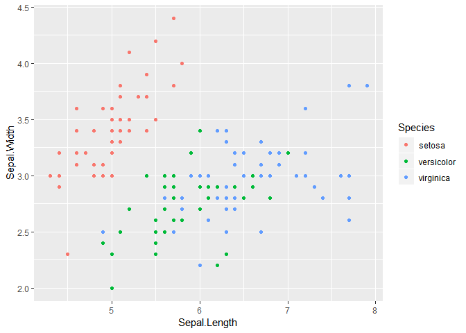
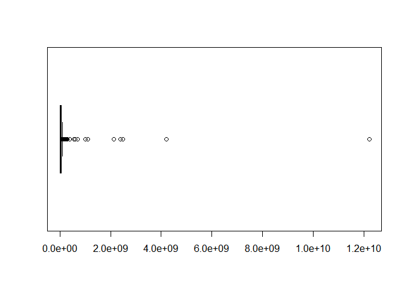
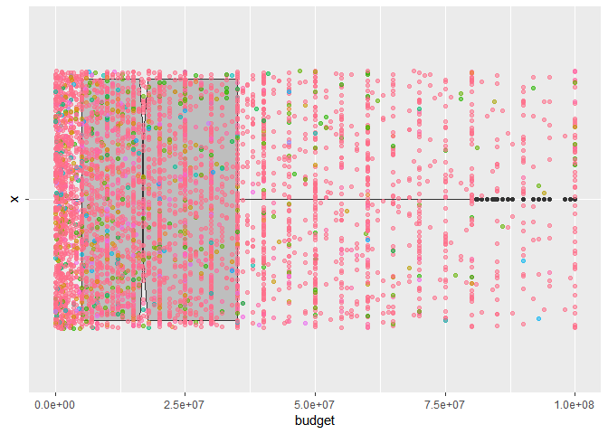

ADP R\_BASIC\_1
================
jakinpilla
2019-05-07

Loading housing data —————————————————————————–

``` r
read.table('./data/housing_data.csv') -> boston
names(boston) <- c('crim', 'zn', 'indus', 'chas', 'nox', 'rm', 'age', 'dis', 'rad',  
                   'tax', 'ptratio', 'black', 'lstat', 'medv')
head(boston)
```

    ##      crim zn indus chas   nox    rm  age    dis rad tax ptratio  black
    ## 1 0.00632 18  2.31    0 0.538 6.575 65.2 4.0900   1 296    15.3 396.90
    ## 2 0.02731  0  7.07    0 0.469 6.421 78.9 4.9671   2 242    17.8 396.90
    ## 3 0.02729  0  7.07    0 0.469 7.185 61.1 4.9671   2 242    17.8 392.83
    ## 4 0.03237  0  2.18    0 0.458 6.998 45.8 6.0622   3 222    18.7 394.63
    ## 5 0.06905  0  2.18    0 0.458 7.147 54.2 6.0622   3 222    18.7 396.90
    ## 6 0.02985  0  2.18    0 0.458 6.430 58.7 6.0622   3 222    18.7 394.12
    ##   lstat medv
    ## 1  4.98 24.0
    ## 2  9.14 21.6
    ## 3  4.03 34.7
    ## 4  2.94 33.4
    ## 5  5.33 36.2
    ## 6  5.21 28.7

``` r
# crim :: per capita crime rate by town
# zn :: proportion of residential land zoned for lots over 25,000 sq.ft.
# indus :: proportion of non-retail business acres per town
# chas :: charles river dummy variable (=1 if tract bounds river; 0 otherwise)
# nox :: nitric oxides concentration (parts per 10 million)
# rm :: average number of rooms per dwelling
# age :: proportion of owner-occupied units built prior to 1940
# dis :: weighted distance to five Boston employment centers
# rad :: index of accessibility to radial highways
# tax :: full-value property-tax rate per $10,000
# ptratio :: pupil-teacher ratio by town
# black :: 1000(Bk - 0.63)^2 where Bk is the proportion of blacks by town
# lstat :: % lower status of the population
# medv :: Median value of owner-occupied homes in $1000's
```

Reading various file types ————————————————————————–

``` r
read.table('./data/students.txt', sep='\t', header=F) -> student ; head(student) # If there is no header...
```

    ##          V1                     V2                            V3      V4
    ## 1 1141206/1 Obolo, Oluremi Olawale       oluremi.obolo@kcl.ac.uk Current
    ## 2 1220318/1           Azizi, Ozhan         ozhan.azizi@kcl.ac.uk Current
    ## 3 1229815/1             Zain, Sara           sara.zain@kcl.ac.uk Current
    ## 4 1319061/1       Naumov, Valentin     valentin.naumov@kcl.ac.uk Current
    ## 5 1322382/3      Vasile, Tudor Dan        tudor.vasile@kcl.ac.uk Current
    ## 6 1331498/1   Stampelos, Stamatios stamatios.stampelos@kcl.ac.uk Current
    ##                              V5 V6
    ## 1        Computing And Security NA
    ## 2 Advanced Software Engineering NA
    ## 3        Computing And Security NA
    ## 4        Computing And Security NA
    ## 5        Computing And Security NA
    ## 6        Computing And Security NA

``` r
d1 <- read.table("./data/student-mat.csv",sep=";",header=TRUE) ; head(d1) # deliminator is ";"
```

    ##   school sex age address famsize Pstatus Medu Fedu     Mjob     Fjob
    ## 1     GP   F  18       U     GT3       A    4    4  at_home  teacher
    ## 2     GP   F  17       U     GT3       T    1    1  at_home    other
    ## 3     GP   F  15       U     LE3       T    1    1  at_home    other
    ## 4     GP   F  15       U     GT3       T    4    2   health services
    ## 5     GP   F  16       U     GT3       T    3    3    other    other
    ## 6     GP   M  16       U     LE3       T    4    3 services    other
    ##       reason guardian traveltime studytime failures schoolsup famsup paid
    ## 1     course   mother          2         2        0       yes     no   no
    ## 2     course   father          1         2        0        no    yes   no
    ## 3      other   mother          1         2        3       yes     no  yes
    ## 4       home   mother          1         3        0        no    yes  yes
    ## 5       home   father          1         2        0        no    yes  yes
    ## 6 reputation   mother          1         2        0        no    yes  yes
    ##   activities nursery higher internet romantic famrel freetime goout Dalc
    ## 1         no     yes    yes       no       no      4        3     4    1
    ## 2         no      no    yes      yes       no      5        3     3    1
    ## 3         no     yes    yes      yes       no      4        3     2    2
    ## 4        yes     yes    yes      yes      yes      3        2     2    1
    ## 5         no     yes    yes       no       no      4        3     2    1
    ## 6        yes     yes    yes      yes       no      5        4     2    1
    ##   Walc health absences G1 G2 G3
    ## 1    1      3        6  5  6  6
    ## 2    1      3        4  5  5  6
    ## 3    3      3       10  7  8 10
    ## 4    1      5        2 15 14 15
    ## 5    2      5        4  6 10 10
    ## 6    2      5       10 15 15 15

``` r
student <- read_delim("data/student.txt",  "\t", col_names = FALSE); student # delim is "tap" and no header...
```

    ## Parsed with column specification:
    ## cols(
    ##   X1 = col_double(),
    ##   X2 = col_character(),
    ##   X3 = col_double(),
    ##   X4 = col_double()
    ## )

    ## # A tibble: 4 x 4
    ##      X1 X2       X3    X4
    ##   <dbl> <chr> <dbl> <dbl>
    ## 1   101 hong    175    65
    ## 2   201 lee     185    85
    ## 3   301 kim     173    60
    ## 4   401 park    180    70

``` r
student1 <- read_delim("data/student1.txt", "\t"); student1 # delim is "tap" and there is header...
```

    ## Parsed with column specification:
    ## cols(
    ##   번호 = col_double(),
    ##   이름 = col_character(),
    ##   키 = col_double(),
    ##   몸무게 = col_double()
    ## )

    ## # A tibble: 4 x 4
    ##    번호 이름     키 몸무게
    ##   <dbl> <chr> <dbl>  <dbl>
    ## 1   101 hong    175     65
    ## 2   201 lee     185     85
    ## 3   301 kim     173     60
    ## 4   401 park    180     70

``` r
student2 <- read_delim("data/student2.txt", ";"); student2  # delim is ";" and there is header...
```

    ## Parsed with column specification:
    ## cols(
    ##   번호 = col_double(),
    ##   이름 = col_character(),
    ##   키 = col_double(),
    ##   몸무게 = col_double()
    ## )

    ## # A tibble: 4 x 4
    ##    번호 이름     키 몸무게
    ##   <dbl> <chr> <dbl>  <dbl>
    ## 1   101 hong    175     65
    ## 2   201 lee     185     85
    ## 3   301 kim     173     60
    ## 4   401 park    180     70

In case when NA has certain character…

``` r
student3 <- read_delim("data/student3.txt", "\t", na= '-') # converet '-' to NA...
```

    ## Parsed with column specification:
    ## cols(
    ##   번호 = col_double(),
    ##   이름 = col_character(),
    ##   키 = col_double(),
    ##   몸무게 = col_double()
    ## )

strip.white —————————————————————————

``` r
student4 <- read_csv("data/student4.txt", col_names = FALSE); head(student4)
```

    ## Parsed with column specification:
    ## cols(
    ##   X1 = col_double(),
    ##   X2 = col_character(),
    ##   X3 = col_double(),
    ##   X4 = col_double()
    ## )

    ## # A tibble: 4 x 4
    ##      X1 X2       X3    X4
    ##   <dbl> <chr> <dbl> <dbl>
    ## 1   101 hong    175    65
    ## 2   201 lee     185    85
    ## 3   301 kim     173    60
    ## 4   401 park    180    70

``` r
white_wine <- read.table('./data/winequality-white.csv', strip.white = F, sep=';', 
                         header=T); head(white_wine)
```

    ##   fixed.acidity volatile.acidity citric.acid residual.sugar chlorides
    ## 1           7.0             0.27        0.36           20.7     0.045
    ## 2           6.3             0.30        0.34            1.6     0.049
    ## 3           8.1             0.28        0.40            6.9     0.050
    ## 4           7.2             0.23        0.32            8.5     0.058
    ## 5           7.2             0.23        0.32            8.5     0.058
    ## 6           8.1             0.28        0.40            6.9     0.050
    ##   free.sulfur.dioxide total.sulfur.dioxide density   pH sulphates alcohol
    ## 1                  45                  170  1.0010 3.00      0.45     8.8
    ## 2                  14                  132  0.9940 3.30      0.49     9.5
    ## 3                  30                   97  0.9951 3.26      0.44    10.1
    ## 4                  47                  186  0.9956 3.19      0.40     9.9
    ## 5                  47                  186  0.9956 3.19      0.40     9.9
    ## 6                  30                   97  0.9951 3.26      0.44    10.1
    ##   quality
    ## 1       6
    ## 2       6
    ## 3       6
    ## 4       6
    ## 5       6
    ## 6       6

``` r
white_wine <- read.table('./data/winequality-white.csv',sep=';', 
                         header=T); head(white_wine)
```

    ##   fixed.acidity volatile.acidity citric.acid residual.sugar chlorides
    ## 1           7.0             0.27        0.36           20.7     0.045
    ## 2           6.3             0.30        0.34            1.6     0.049
    ## 3           8.1             0.28        0.40            6.9     0.050
    ## 4           7.2             0.23        0.32            8.5     0.058
    ## 5           7.2             0.23        0.32            8.5     0.058
    ## 6           8.1             0.28        0.40            6.9     0.050
    ##   free.sulfur.dioxide total.sulfur.dioxide density   pH sulphates alcohol
    ## 1                  45                  170  1.0010 3.00      0.45     8.8
    ## 2                  14                  132  0.9940 3.30      0.49     9.5
    ## 3                  30                   97  0.9951 3.26      0.44    10.1
    ## 4                  47                  186  0.9956 3.19      0.40     9.9
    ## 5                  47                  186  0.9956 3.19      0.40     9.9
    ## 6                  30                   97  0.9951 3.26      0.44    10.1
    ##   quality
    ## 1       6
    ## 2       6
    ## 3       6
    ## 4       6
    ## 5       6
    ## 6       6

na.rm=T —————————————————————————

``` r
student3
```

    ## # A tibble: 4 x 4
    ##    번호 이름     키 몸무게
    ##   <dbl> <chr> <dbl>  <dbl>
    ## 1   101 hong    175     65
    ## 2   201 lee     185     85
    ## 3   301 kim     173     NA
    ## 4   401 park     NA     70

``` r
mean(student3$키)
```

    ## [1] NA

``` r
mean(student3$키, na.rm=T)
```

    ## [1] 177.6667

EDA basic (glimpse, plot(numeric\_var \~ factor\_var, data))

``` r
# summary(boston)
plot(boston[, c('crim', 'zn', 'indus', 'chas', 'black', 'lstat', 'medv')])
```

<!-- -->

``` r
ggpairs(boston[, c('crim', 'zn', 'indus', 'chas', 'black', 'lstat', 'medv')])
```

<!-- -->

``` r
plot(boston$crim) # if one numeric var, index on axis-x
```

<!-- -->

iris —————————————————————————

``` r
plot(iris$Sepal.Length)
```

<!-- -->

``` r
plot(iris$Species) # only one factor var, factor on x-axis , frequency on y-axis
```

<!-- -->

``` r
plot(Species ~ Sepal.Length, data=iris) # factor on LHS, numeric on RHS => mosaic plot
```

<!-- -->

``` r
plot(Sepal.Length ~ Species, data=iris) # numericl on LHS , factor on RHS ==> boxplot
```

<!-- -->

``` r
iris %>%
  ggplot(aes(Species,Sepal.Length, col = Species)) + 
  geom_boxplot() + 
  geom_point() + geom_jitter()
```

<!-- -->

``` r
iris %>%
  ggplot(aes(Sepal.Length, Sepal.Width, col = Species)) + geom_point()
```

<!-- -->

GGally::ggpairs() —————————————————————————

``` r
pairs(iris[, 1:4])
```

<!-- -->

``` r
iris %>% select_if(is.numeric) %>% ggpairs
```

<!-- -->

Correlations Matrix —————————————————————————

``` r
cor(iris[, 1:4])
```

    ##              Sepal.Length Sepal.Width Petal.Length Petal.Width
    ## Sepal.Length    1.0000000  -0.1175698    0.8717538   0.8179411
    ## Sepal.Width    -0.1175698   1.0000000   -0.4284401  -0.3661259
    ## Petal.Length    0.8717538  -0.4284401    1.0000000   0.9628654
    ## Petal.Width     0.8179411  -0.3661259    0.9628654   1.0000000

``` r
round(cor(iris[, 1:4]), 2)
```

    ##              Sepal.Length Sepal.Width Petal.Length Petal.Width
    ## Sepal.Length         1.00       -0.12         0.87        0.82
    ## Sepal.Width         -0.12        1.00        -0.43       -0.37
    ## Petal.Length         0.87       -0.43         1.00        0.96
    ## Petal.Width          0.82       -0.37         0.96        1.00

``` r
round(cor(iris[, 1:4]), 1)
```

    ##              Sepal.Length Sepal.Width Petal.Length Petal.Width
    ## Sepal.Length          1.0        -0.1          0.9         0.8
    ## Sepal.Width          -0.1         1.0         -0.4        -0.4
    ## Petal.Length          0.9        -0.4          1.0         1.0
    ## Petal.Width           0.8        -0.4          1.0         1.0

Titanic —-

Convert whitespace("") value into NA —————————————————————————

``` r
tbl_df(fread('./data/titanic3.csv', data.table = F)) -> titanic
# summary(titanic)
titanic$cabin <- ifelse(titanic$cabin == "", NA, titanic$cabin)
titanic$cabin[1:10] 
```

    ##  [1] "B5"      "C22 C26" "C22 C26" "C22 C26" "C22 C26" "E12"     "D7"     
    ##  [8] "A36"     "C101"    NA

Replace all "" into NA notation ———————————————

``` r
titanic %>%
  mutate_all(funs(ifelse(. == "", NA, .)))
```

    ## Warning: funs() is soft deprecated as of dplyr 0.8.0
    ## please use list() instead
    ## 
    ## # Before:
    ## funs(name = f(.)
    ## 
    ## # After: 
    ## list(name = ~f(.))
    ## This warning is displayed once per session.

    ## # A tibble: 1,309 x 14
    ##    pclass survived name  sex     age sibsp parch ticket  fare cabin
    ##     <int>    <int> <chr> <chr> <dbl> <int> <int> <chr>  <dbl> <chr>
    ##  1      1        1 Alle~ fema~ 29        0     0 24160  211.  B5   
    ##  2      1        1 Alli~ male   0.92     1     2 113781 152.  C22 ~
    ##  3      1        0 Alli~ fema~  2        1     2 113781 152.  C22 ~
    ##  4      1        0 Alli~ male  30        1     2 113781 152.  C22 ~
    ##  5      1        0 Alli~ fema~ 25        1     2 113781 152.  C22 ~
    ##  6      1        1 Ande~ male  48        0     0 19952   26.6 E12  
    ##  7      1        1 Andr~ fema~ 63        1     0 13502   78.0 D7   
    ##  8      1        0 Andr~ male  39        0     0 112050   0   A36  
    ##  9      1        1 Appl~ fema~ 53        2     0 11769   51.5 C101 
    ## 10      1        0 Arta~ male  71        0     0 PC 17~  49.5 <NA> 
    ## # ... with 1,299 more rows, and 4 more variables: embarked <chr>,
    ## #   boat <chr>, body <int>, home.dest <chr>

Replace all NA values into 0 —————————————–

``` r
titanic %>% replace(is.na(.), 0) -> titanic_na_zero_replaced; titanic_na_zero_replaced
```

    ## # A tibble: 1,309 x 14
    ##    pclass survived name  sex     age sibsp parch ticket  fare cabin
    ##     <int>    <int> <chr> <chr> <dbl> <int> <int> <chr>  <dbl> <chr>
    ##  1      1        1 Alle~ fema~ 29        0     0 24160  211.  B5   
    ##  2      1        1 Alli~ male   0.92     1     2 113781 152.  C22 ~
    ##  3      1        0 Alli~ fema~  2        1     2 113781 152.  C22 ~
    ##  4      1        0 Alli~ male  30        1     2 113781 152.  C22 ~
    ##  5      1        0 Alli~ fema~ 25        1     2 113781 152.  C22 ~
    ##  6      1        1 Ande~ male  48        0     0 19952   26.6 E12  
    ##  7      1        1 Andr~ fema~ 63        1     0 13502   78.0 D7   
    ##  8      1        0 Andr~ male  39        0     0 112050   0   A36  
    ##  9      1        1 Appl~ fema~ 53        2     0 11769   51.5 C101 
    ## 10      1        0 Arta~ male  71        0     0 PC 17~  49.5 0    
    ## # ... with 1,299 more rows, and 4 more variables: embarked <chr>,
    ## #   boat <chr>, body <dbl>, home.dest <chr>

Replace all "" values into "NA in character columns ————————————————–

``` r
titanic %>%
  mutate_if(is.character, funs(ifelse(. == "", "NA", .))) -> titanic_1

titanic_1
```

    ## # A tibble: 1,309 x 14
    ##    pclass survived name  sex     age sibsp parch ticket  fare cabin
    ##     <int>    <int> <chr> <chr> <dbl> <int> <int> <chr>  <dbl> <chr>
    ##  1      1        1 Alle~ fema~ 29        0     0 24160  211.  B5   
    ##  2      1        1 Alli~ male   0.92     1     2 113781 152.  C22 ~
    ##  3      1        0 Alli~ fema~  2        1     2 113781 152.  C22 ~
    ##  4      1        0 Alli~ male  30        1     2 113781 152.  C22 ~
    ##  5      1        0 Alli~ fema~ 25        1     2 113781 152.  C22 ~
    ##  6      1        1 Ande~ male  48        0     0 19952   26.6 E12  
    ##  7      1        1 Andr~ fema~ 63        1     0 13502   78.0 D7   
    ##  8      1        0 Andr~ male  39        0     0 112050   0   A36  
    ##  9      1        1 Appl~ fema~ 53        2     0 11769   51.5 C101 
    ## 10      1        0 Arta~ male  71        0     0 PC 17~  49.5 <NA> 
    ## # ... with 1,299 more rows, and 4 more variables: embarked <chr>,
    ## #   boat <chr>, body <int>, home.dest <chr>

Replace all NA values into “NA” in character columns ————————————————–

``` r
titanic_1 %>% 
  mutate_if(is.character, funs(ifelse(is.na(.), "NA", .))) -> titanic_2

titanic_2
```

    ## # A tibble: 1,309 x 14
    ##    pclass survived name  sex     age sibsp parch ticket  fare cabin
    ##     <int>    <int> <chr> <chr> <dbl> <int> <int> <chr>  <dbl> <chr>
    ##  1      1        1 Alle~ fema~ 29        0     0 24160  211.  B5   
    ##  2      1        1 Alli~ male   0.92     1     2 113781 152.  C22 ~
    ##  3      1        0 Alli~ fema~  2        1     2 113781 152.  C22 ~
    ##  4      1        0 Alli~ male  30        1     2 113781 152.  C22 ~
    ##  5      1        0 Alli~ fema~ 25        1     2 113781 152.  C22 ~
    ##  6      1        1 Ande~ male  48        0     0 19952   26.6 E12  
    ##  7      1        1 Andr~ fema~ 63        1     0 13502   78.0 D7   
    ##  8      1        0 Andr~ male  39        0     0 112050   0   A36  
    ##  9      1        1 Appl~ fema~ 53        2     0 11769   51.5 C101 
    ## 10      1        0 Arta~ male  71        0     0 PC 17~  49.5 NA   
    ## # ... with 1,299 more rows, and 4 more variables: embarked <chr>,
    ## #   boat <chr>, body <int>, home.dest <chr>

Replace all NA values into 0 in numeric columns ————————————————–

``` r
titanic_2 %>% 
  mutate_if(is.numeric, funs(ifelse(is.na(.), 0, .))) -> titanic_3

titanic_3
```

    ## # A tibble: 1,309 x 14
    ##    pclass survived name  sex     age sibsp parch ticket  fare cabin
    ##     <int>    <int> <chr> <chr> <dbl> <int> <int> <chr>  <dbl> <chr>
    ##  1      1        1 Alle~ fema~ 29        0     0 24160  211.  B5   
    ##  2      1        1 Alli~ male   0.92     1     2 113781 152.  C22 ~
    ##  3      1        0 Alli~ fema~  2        1     2 113781 152.  C22 ~
    ##  4      1        0 Alli~ male  30        1     2 113781 152.  C22 ~
    ##  5      1        0 Alli~ fema~ 25        1     2 113781 152.  C22 ~
    ##  6      1        1 Ande~ male  48        0     0 19952   26.6 E12  
    ##  7      1        1 Andr~ fema~ 63        1     0 13502   78.0 D7   
    ##  8      1        0 Andr~ male  39        0     0 112050   0   A36  
    ##  9      1        1 Appl~ fema~ 53        2     0 11769   51.5 C101 
    ## 10      1        0 Arta~ male  71        0     0 PC 17~  49.5 NA   
    ## # ... with 1,299 more rows, and 4 more variables: embarked <chr>,
    ## #   boat <chr>, body <dbl>, home.dest <chr>

At once ———————————————————————

``` r
titanic %>%
  mutate_if(is.character, funs(ifelse(. == "", "NA", .))) %>%
  mutate_if(is.character, funs(ifelse(is.na(.), "NA", .))) %>%
  mutate_if(is.numeric, funs(ifelse(is.na(.), 0, .))) -> titanic_replaced

titanic_replaced
```

    ## # A tibble: 1,309 x 14
    ##    pclass survived name  sex     age sibsp parch ticket  fare cabin
    ##     <int>    <int> <chr> <chr> <dbl> <int> <int> <chr>  <dbl> <chr>
    ##  1      1        1 Alle~ fema~ 29        0     0 24160  211.  B5   
    ##  2      1        1 Alli~ male   0.92     1     2 113781 152.  C22 ~
    ##  3      1        0 Alli~ fema~  2        1     2 113781 152.  C22 ~
    ##  4      1        0 Alli~ male  30        1     2 113781 152.  C22 ~
    ##  5      1        0 Alli~ fema~ 25        1     2 113781 152.  C22 ~
    ##  6      1        1 Ande~ male  48        0     0 19952   26.6 E12  
    ##  7      1        1 Andr~ fema~ 63        1     0 13502   78.0 D7   
    ##  8      1        0 Andr~ male  39        0     0 112050   0   A36  
    ##  9      1        1 Appl~ fema~ 53        2     0 11769   51.5 C101 
    ## 10      1        0 Arta~ male  71        0     0 PC 17~  49.5 NA   
    ## # ... with 1,299 more rows, and 4 more variables: embarked <chr>,
    ## #   boat <chr>, body <dbl>, home.dest <chr>

Imputating 0 with mean or median value in body columns —————————–

``` r
titanic_replaced %>%
  mutate_if(is.numeric, funs(ifelse(.==0, mean(.), .)))
```

    ## # A tibble: 1,309 x 14
    ##    pclass survived name  sex     age sibsp parch ticket  fare cabin
    ##     <int>    <dbl> <chr> <chr> <dbl> <dbl> <dbl> <chr>  <dbl> <chr>
    ##  1      1    1     Alle~ fema~ 29    0.499 0.385 24160  211.  B5   
    ##  2      1    1     Alli~ male   0.92 1     2     113781 152.  C22 ~
    ##  3      1    0.382 Alli~ fema~  2    1     2     113781 152.  C22 ~
    ##  4      1    0.382 Alli~ male  30    1     2     113781 152.  C22 ~
    ##  5      1    0.382 Alli~ fema~ 25    1     2     113781 152.  C22 ~
    ##  6      1    1     Ande~ male  48    0.499 0.385 19952   26.6 E12  
    ##  7      1    1     Andr~ fema~ 63    1     0.385 13502   78.0 D7   
    ##  8      1    0.382 Andr~ male  39    0.499 0.385 112050  33.3 A36  
    ##  9      1    1     Appl~ fema~ 53    2     0.385 11769   51.5 C101 
    ## 10      1    0.382 Arta~ male  71    0.499 0.385 PC 17~  49.5 NA   
    ## # ... with 1,299 more rows, and 4 more variables: embarked <chr>,
    ## #   boat <chr>, body <dbl>, home.dest <chr>

``` r
mean(titanic_replaced$body)
```

    ## [1] 14.86478

``` r
median(titanic_replaced$body)
```

    ## [1] 0

``` r
median_value <- median(titanic$body, na.rm = T) 

titanic_replaced %>%
  mutate(body = ifelse(body==0, median_value, body))
```

    ## # A tibble: 1,309 x 14
    ##    pclass survived name  sex     age sibsp parch ticket  fare cabin
    ##     <int>    <int> <chr> <chr> <dbl> <int> <int> <chr>  <dbl> <chr>
    ##  1      1        1 Alle~ fema~ 29        0     0 24160  211.  B5   
    ##  2      1        1 Alli~ male   0.92     1     2 113781 152.  C22 ~
    ##  3      1        0 Alli~ fema~  2        1     2 113781 152.  C22 ~
    ##  4      1        0 Alli~ male  30        1     2 113781 152.  C22 ~
    ##  5      1        0 Alli~ fema~ 25        1     2 113781 152.  C22 ~
    ##  6      1        1 Ande~ male  48        0     0 19952   26.6 E12  
    ##  7      1        1 Andr~ fema~ 63        1     0 13502   78.0 D7   
    ##  8      1        0 Andr~ male  39        0     0 112050   0   A36  
    ##  9      1        1 Appl~ fema~ 53        2     0 11769   51.5 C101 
    ## 10      1        0 Arta~ male  71        0     0 PC 17~  49.5 NA   
    ## # ... with 1,299 more rows, and 4 more variables: embarked <chr>,
    ## #   boat <chr>, body <dbl>, home.dest <chr>

``` r
titanic_replaced %>%
  mutate(body = ifelse(body==0, median_value, body)) -> titanic_imputed

titanic_imputed
```

    ## # A tibble: 1,309 x 14
    ##    pclass survived name  sex     age sibsp parch ticket  fare cabin
    ##     <int>    <int> <chr> <chr> <dbl> <int> <int> <chr>  <dbl> <chr>
    ##  1      1        1 Alle~ fema~ 29        0     0 24160  211.  B5   
    ##  2      1        1 Alli~ male   0.92     1     2 113781 152.  C22 ~
    ##  3      1        0 Alli~ fema~  2        1     2 113781 152.  C22 ~
    ##  4      1        0 Alli~ male  30        1     2 113781 152.  C22 ~
    ##  5      1        0 Alli~ fema~ 25        1     2 113781 152.  C22 ~
    ##  6      1        1 Ande~ male  48        0     0 19952   26.6 E12  
    ##  7      1        1 Andr~ fema~ 63        1     0 13502   78.0 D7   
    ##  8      1        0 Andr~ male  39        0     0 112050   0   A36  
    ##  9      1        1 Appl~ fema~ 53        2     0 11769   51.5 C101 
    ## 10      1        0 Arta~ male  71        0     0 PC 17~  49.5 NA   
    ## # ... with 1,299 more rows, and 4 more variables: embarked <chr>,
    ## #   boat <chr>, body <dbl>, home.dest <chr>

Convert NA values into median values ————————————————————————–

``` r
titanic %>%
  mutate_if(is.numeric, funs(ifelse(is.na(.), median(., na.rm=T), .))) -> t_tmp; # summary(t_tmp)

head(t_tmp)
```

    ## # A tibble: 6 x 14
    ##   pclass survived name  sex     age sibsp parch ticket  fare cabin embarked
    ##    <int>    <int> <chr> <chr> <dbl> <int> <int> <chr>  <dbl> <chr> <chr>   
    ## 1      1        1 Alle~ fema~ 29        0     0 24160  211.  B5    S       
    ## 2      1        1 Alli~ male   0.92     1     2 113781 152.  C22 ~ S       
    ## 3      1        0 Alli~ fema~  2        1     2 113781 152.  C22 ~ S       
    ## 4      1        0 Alli~ male  30        1     2 113781 152.  C22 ~ S       
    ## 5      1        0 Alli~ fema~ 25        1     2 113781 152.  C22 ~ S       
    ## 6      1        1 Ande~ male  48        0     0 19952   26.6 E12   S       
    ## # ... with 3 more variables: boat <chr>, body <int>, home.dest <chr>

``` r
# '_imp' suffix imputation --------------------------------------------------------------------------
titanic %>%
  mutate_if(is.numeric, funs(imp=ifelse(is.na(.), median(., na.rm=T), .))) -> t_tmp; # summary(t_tmp) # notice the "imp="

head(t_tmp)
```

    ## # A tibble: 6 x 21
    ##   pclass survived name  sex     age sibsp parch ticket  fare cabin embarked
    ##    <int>    <int> <chr> <chr> <dbl> <int> <int> <chr>  <dbl> <chr> <chr>   
    ## 1      1        1 Alle~ fema~ 29        0     0 24160  211.  B5    S       
    ## 2      1        1 Alli~ male   0.92     1     2 113781 152.  C22 ~ S       
    ## 3      1        0 Alli~ fema~  2        1     2 113781 152.  C22 ~ S       
    ## 4      1        0 Alli~ male  30        1     2 113781 152.  C22 ~ S       
    ## 5      1        0 Alli~ fema~ 25        1     2 113781 152.  C22 ~ S       
    ## 6      1        1 Ande~ male  48        0     0 19952   26.6 E12   S       
    ## # ... with 10 more variables: boat <chr>, body <int>, home.dest <chr>,
    ## #   pclass_imp <int>, survived_imp <int>, age_imp <dbl>, sibsp_imp <int>,
    ## #   parch_imp <int>, fare_imp <dbl>, body_imp <int>

``` r
# str(t_tmp)
```

Eliminate all data which has at least a NA ————————————————————————–

``` r
na.omit(titanic) 
```

    ## # A tibble: 32 x 14
    ##    pclass survived name  sex     age sibsp parch ticket  fare cabin
    ##     <int>    <int> <chr> <chr> <dbl> <int> <int> <chr>  <dbl> <chr>
    ##  1      1        0 Alli~ male     30     1     2 113781 152.  C22 ~
    ##  2      1        0 Asto~ male     47     1     0 PC 17~ 228.  C62 ~
    ##  3      1        0 Bran~ male     48     0     0 PC 17~  50.5 B10  
    ##  4      1        0 Cave~ male     36     1     0 19877   78.8 C46  
    ##  5      1        0 Cros~ male     70     1     1 WE/P ~  71   B22  
    ##  6      1        0 Doug~ male     50     1     0 PC 17~ 106.  C86  
    ##  7      1        0 Dull~ male     39     0     0 PC 17~  29.7 A18  
    ##  8      1        0 Gee,~ male     47     0     0 111320  38.5 E63  
    ##  9      1        0 Grah~ male     38     0     1 PC 17~ 153.  C91  
    ## 10      1        0 Harr~ male     40     0     0 112059   0   B94  
    ## # ... with 22 more rows, and 4 more variables: embarked <chr>, boat <chr>,
    ## #   body <int>, home.dest <chr>

Convert data classes ————————————————————————–

``` r
titanic_imputed$pclass <- as.factor(titanic_imputed$pclass)
# titanic$ticket <- as.character(titanic$ticket)
titanic_imputed$survived <- factor(titanic_imputed$survived, levels=c(0,1), labels=c('dead', 'survived'))
glimpse(titanic_imputed)
```

    ## Observations: 1,309
    ## Variables: 14
    ## $ pclass    <fct> 1, 1, 1, 1, 1, 1, 1, 1, 1, 1, 1, 1, 1, 1, 1, 1, 1, 1...
    ## $ survived  <fct> survived, survived, dead, dead, dead, survived, surv...
    ## $ name      <chr> "Allen, Miss. Elisabeth Walton", "Allison, Master. H...
    ## $ sex       <chr> "female", "male", "female", "male", "female", "male"...
    ## $ age       <dbl> 29.00, 0.92, 2.00, 30.00, 25.00, 48.00, 63.00, 39.00...
    ## $ sibsp     <int> 0, 1, 1, 1, 1, 0, 1, 0, 2, 0, 1, 1, 0, 0, 0, 0, 0, 0...
    ## $ parch     <int> 0, 2, 2, 2, 2, 0, 0, 0, 0, 0, 0, 0, 0, 0, 0, 0, 1, 1...
    ## $ ticket    <chr> "24160", "113781", "113781", "113781", "113781", "19...
    ## $ fare      <dbl> 211.3375, 151.5500, 151.5500, 151.5500, 151.5500, 26...
    ## $ cabin     <chr> "B5", "C22 C26", "C22 C26", "C22 C26", "C22 C26", "E...
    ## $ embarked  <chr> "S", "S", "S", "S", "S", "S", "S", "S", "S", "C", "C...
    ## $ boat      <chr> "2", "11", "NA", "NA", "NA", "3", "10", "NA", "D", "...
    ## $ body      <dbl> 155, 155, 155, 135, 155, 155, 155, 155, 155, 22, 124...
    ## $ home.dest <chr> "St Louis, MO", "Montreal, PQ / Chesterville, ON", "...

Check the data class ————————————————————————–

``` r
class(titanic$embarked) # characeter
```

    ## [1] "character"

``` r
levels(titanic$embarked) # NULL
```

    ## NULL

``` r
table(titanic$embarked)
```

    ## 
    ##       C   Q   S 
    ##   2 270 123 914

``` r
titanic$embarked <- as.factor(titanic$embarked)
table(titanic$embarked)
```

    ## 
    ##       C   Q   S 
    ##   2 270 123 914

``` r
table(titanic$embarked, useNA='always')
```

    ## 
    ##         C    Q    S <NA> 
    ##    2  270  123  914    0

``` r
titanic$cabin <- as.factor(titanic$cabin)
table(titanic$cabin)
```

    ## 
    ##             A10             A11             A14             A16 
    ##               1               1               1               1 
    ##             A18             A19             A20             A21 
    ##               1               1               1               1 
    ##             A23             A24             A26             A29 
    ##               1               1               1               1 
    ##             A31             A32             A34             A36 
    ##               1               1               3               1 
    ##              A5              A6              A7              A9 
    ##               1               1               1               1 
    ##             B10            B101            B102             B11 
    ##               1               1               1               1 
    ##             B18             B19             B20             B22 
    ##               2               1               2               2 
    ##             B24             B26             B28              B3 
    ##               1               1               2               1 
    ##             B30             B35             B36             B37 
    ##               1               2               1               1 
    ##             B38             B39              B4             B41 
    ##               1               1               1               2 
    ##             B42             B45             B49              B5 
    ##               1               2               2               2 
    ##             B50     B51 B53 B55     B52 B54 B56 B57 B59 B63 B66 
    ##               1               3               1               5 
    ##         B58 B60             B61             B69             B71 
    ##               3               1               2               2 
    ##             B73             B77             B78             B79 
    ##               1               2               2               1 
    ##             B80         B82 B84             B86             B94 
    ##               1               1               1               1 
    ##         B96 B98            C101            C103            C104 
    ##               4               3               1               1 
    ##            C105            C106            C110            C111 
    ##               1               2               1               1 
    ##            C116            C118            C123            C124 
    ##               2               1               2               2 
    ##            C125            C126            C128            C130 
    ##               2               2               1               1 
    ##            C132            C148              C2         C22 C26 
    ##               1               1               2               4 
    ##     C23 C25 C27             C28             C30             C31 
    ##               6               1               1               2 
    ##             C32             C39             C45             C46 
    ##               2               1               1               2 
    ##             C47             C49             C50             C51 
    ##               1               1               1               1 
    ##             C52             C53             C54         C55 C57 
    ##               2               1               2               2 
    ##              C6         C62 C64             C65             C68 
    ##               2               2               2               2 
    ##              C7             C70             C78             C80 
    ##               2               1               4               2 
    ##             C82             C83             C85             C86 
    ##               1               2               2               2 
    ##             C87             C89             C90             C91 
    ##               1               2               1               1 
    ##             C92             C93             C95             C97 
    ##               2               2               1               1 
    ##             C99               D         D10 D12             D11 
    ##               1               4               2               1 
    ##             D15             D17             D19             D20 
    ##               2               2               2               2 
    ##             D21             D22             D26             D28 
    ##               2               1               2               2 
    ##             D30             D33             D34             D35 
    ##               2               2               1               2 
    ##             D36             D37             D38             D40 
    ##               2               2               1               1 
    ##             D43             D45             D46             D47 
    ##               1               1               1               1 
    ##             D48             D49             D50             D56 
    ##               1               1               1               1 
    ##              D6              D7              D9             E10 
    ##               1               1               1               1 
    ##            E101             E12            E121             E17 
    ##               3               1               2               1 
    ##             E24             E25             E31             E33 
    ##               2               2               2               2 
    ##             E34             E36             E38         E39 E41 
    ##               3               1               1               1 
    ##             E40             E44             E45             E46 
    ##               1               2               1               2 
    ##             E49             E50             E52             E58 
    ##               1               2               1               1 
    ##             E60             E63             E67             E68 
    ##               1               1               2               1 
    ##             E77              E8               F           F E46 
    ##               1               2               1               1 
    ##           F E57           F E69           F G63           F G73 
    ##               1               1               2               2 
    ##              F2             F33             F38              F4 
    ##               4               4               1               4 
    ##              G6               T 
    ##               5               1

``` r
cabin <- as.data.frame(table(titanic$cabin)); names(cabin) <- c('room', 'count')

titanic %>%
  mutate(cabin = as.character(cabin)) %>%
  select(cabin) %>%
  group_by(cabin) %>%
  tally() %>%
  arrange(desc(n)) %>%
  filter(cabin != "") -> df.cabin

df.cabin %>% 
  ggplot(aes(cabin, n)) + 
  geom_bar(stat = "identity") +
  theme(legend.position = 'none', axis.text.x = element_text(angle = 90))
```

<!-- -->

Imdb Dataset ————————————————————————–

NA and outlier ————————————————————————–

``` r
df_imdb <- read_csv('./data/imdb-5000-movie-dataset.zip')
```

    ## Parsed with column specification:
    ## cols(
    ##   .default = col_double(),
    ##   color = col_character(),
    ##   director_name = col_character(),
    ##   actor_2_name = col_character(),
    ##   genres = col_character(),
    ##   actor_1_name = col_character(),
    ##   movie_title = col_character(),
    ##   actor_3_name = col_character(),
    ##   plot_keywords = col_character(),
    ##   movie_imdb_link = col_character(),
    ##   language = col_character(),
    ##   country = col_character(),
    ##   content_rating = col_character()
    ## )

    ## See spec(...) for full column specifications.

``` r
# summary(df_imdb)
```

dplyr::drop\_na() ————————————————————————–

``` r
sum(is.na(df_imdb$gross)) # how many NAs in a certain column...
```

    ## [1] 884

``` r
df_imdb$gross[df_imdb$gross < 0] <- NA # replace data which is below 0 to NA...

# summary(df_imdb$budget) 

df_imdb %>% nrow()
```

    ## [1] 5043

``` r
df_imdb %>%
  drop_na(budget) -> df_imdb_budget_na_drop ; # summary(df_imdb_budget_na_drop); nrow(df_imdb_budget_na_drop)

boxplot(df_imdb_budget_na_drop$budget, horizontal = T) # need to remove outliers of budget columns...
```

<!-- -->

``` r
boxplot(df_imdb_budget_na_drop$budget)$stat 
```

<!-- -->

    ##          [,1]
    ## [1,] 2.18e+02
    ## [2,] 6.00e+06
    ## [3,] 2.00e+07
    ## [4,] 4.50e+07
    ## [5,] 1.03e+08

``` r
# [1,] 2.18e+02
# [2,] 6.00e+06
# [3,] 2.00e+07
# [4,] 4.40e+07
# [5,] 1.00e+08
```

Budget \< 2.18e+02 or budget \> 1.00e+08 : outliers…

``` r
df_imdb_budget_na_drop %>%
  filter(budget >= 2.18e+02 & budget <= 1.00e+08) -> df_imdb_budget_na_oulier_drop

boxplot(df_imdb_budget_na_oulier_drop$budget, horizontal = T)
```

<!-- -->

``` r
df_imdb_budget_na_oulier_drop %>%
  ggplot(aes("", budget)) + 
  geom_boxplot(notch = T, fill = "gray") +
  coord_flip() +
  geom_jitter(aes(colour = factor(country), alpha =.05)) +
  theme(legend.position = "none")
```

<!-- -->

``` r
df_imdb_budget_na_oulier_drop %>% 
  ggplot(aes(language, budget, col = language)) + 
  geom_boxplot() + 
  theme(legend.position = 'none', axis.text.x = element_text(angle = 90))
```

<!-- -->

``` r
nrow(df_imdb)
```

    ## [1] 5043

``` r
nrow(df_imdb_budget_na_oulier_drop)
```

    ## [1] 4227

Boxplot Whisker And Oulier Fence Mean ——————————————————

``` r
boxplot(df_imdb_budget_na_drop$budget)
```

<!-- -->

``` r
IQR(df_imdb_budget_na_drop$budget)
```

    ## [1] 3.9e+07

``` r
1.5*IQR(df_imdb_budget_na_drop$budget)
```

    ## [1] 58500000

``` r
fivenum(df_imdb_budget_na_drop$budget)
```

    ## [1]         218     6000000    20000000    45000000 12215500000

Q3

``` r
fivenum(df_imdb_budget_na_drop$budget)[4]
```

    ## [1] 4.5e+07

Q3 + 1.5\*IQR :: Outlier Upper Fence…

``` r
fivenum(df_imdb_budget_na_drop$budget)[4] + 1.5*IQR(df_imdb_budget_na_drop$budget) # 103500000
```

    ## [1] 103500000

``` r
boxplot(df_imdb_budget_na_drop$budget)$stat[5] # stat[5] are outlier is upper fence
```

<!-- -->

    ## [1] 1.03e+08

Upper Whisker…

``` r
df_imdb_budget_na_drop %>%
  filter(budget > fivenum(df_imdb_budget_na_drop$budget)[4]) %>%
  filter(budget < fivenum(df_imdb_budget_na_drop$budget)[4] + 1.5*IQR(df_imdb_budget_na_drop$budget)) %>%
  select(budget) %>% pull() %>% max()
```

    ## [1] 1.03e+08

``` r
df_imdb_budget_na_drop %>%
  filter(budget == 1.03e+08) # %>% View() # three movies...
```

    ## # A tibble: 3 x 28
    ##   color director_name num_critic_for_~ duration director_facebo~
    ##   <chr> <chr>                    <dbl>    <dbl>            <dbl>
    ## 1 Color Carlos Salda~              159      101              107
    ## 2 Color Ridley Scott               265      171                0
    ## 3 Color Costa-Gavras                69      132              333
    ## # ... with 23 more variables: actor_3_facebook_likes <dbl>,
    ## #   actor_2_name <chr>, actor_1_facebook_likes <dbl>, gross <dbl>,
    ## #   genres <chr>, actor_1_name <chr>, movie_title <chr>,
    ## #   num_voted_users <dbl>, cast_total_facebook_likes <dbl>,
    ## #   actor_3_name <chr>, facenumber_in_poster <dbl>, plot_keywords <chr>,
    ## #   movie_imdb_link <chr>, num_user_for_reviews <dbl>, language <chr>,
    ## #   country <chr>, content_rating <chr>, budget <dbl>, title_year <dbl>,
    ## #   actor_2_facebook_likes <dbl>, imdb_score <dbl>, aspect_ratio <dbl>,
    ## #   movie_facebook_likes <dbl>

``` r
df_imdb_budget_na_drop %>%
  filter(budget > 1.03e+08) %>% select(budget) %>% pull() %>% range()
```

    ## [1]   105000000 12215500000

Data Sampling :: sample\_n(), sample\_n(data, replace=T),
sample\_frac()…

``` r
df_imdb %>% sample_n(10) # sampling without replacement...
```

    ## # A tibble: 10 x 28
    ##    color director_name num_critic_for_~ duration director_facebo~
    ##    <chr> <chr>                    <dbl>    <dbl>            <dbl>
    ##  1 Color Phillip Noyce              108       98              176
    ##  2 Color Bo Welch                   109       82               34
    ##  3 Color Matt Cimber                 15      108               32
    ##  4 Color Allison Ande~               51      110               99
    ##  5 Color Lana Wachows~              120      109                0
    ##  6 Color Simon Wincer                71       92               23
    ##  7 Blac~ George A. Ro~              284       96                0
    ##  8 Color Blair Ericks~               78       87                0
    ##  9 Blac~ Elia Kazan                  61      118              603
    ## 10 Color Todd Haynes                181      107              162
    ## # ... with 23 more variables: actor_3_facebook_likes <dbl>,
    ## #   actor_2_name <chr>, actor_1_facebook_likes <dbl>, gross <dbl>,
    ## #   genres <chr>, actor_1_name <chr>, movie_title <chr>,
    ## #   num_voted_users <dbl>, cast_total_facebook_likes <dbl>,
    ## #   actor_3_name <chr>, facenumber_in_poster <dbl>, plot_keywords <chr>,
    ## #   movie_imdb_link <chr>, num_user_for_reviews <dbl>, language <chr>,
    ## #   country <chr>, content_rating <chr>, budget <dbl>, title_year <dbl>,
    ## #   actor_2_facebook_likes <dbl>, imdb_score <dbl>, aspect_ratio <dbl>,
    ## #   movie_facebook_likes <dbl>

``` r
df_imdb %>% sample_n(100, replace=T) # sampling with replacement...
```

    ## # A tibble: 100 x 28
    ##    color director_name num_critic_for_~ duration director_facebo~
    ##    <chr> <chr>                    <dbl>    <dbl>            <dbl>
    ##  1 Color Ethan Coen                 488      122             1000
    ##  2 Color Carl Rinsch                218      128               47
    ##  3 Color Mike Judge                 121       84              406
    ##  4 Color Youssef Dela~               16       80                8
    ##  5 Color Wayne Beach                 40       93                7
    ##  6 Color David Twohy                302      127              123
    ##  7 Color Kenneth Bran~              313      105                0
    ##  8 Color Karey Kirkpa~               93      107               11
    ##  9 Color Bart Freundl~              100      103               38
    ## 10 Color Luc Besson                 173      126                0
    ## # ... with 90 more rows, and 23 more variables:
    ## #   actor_3_facebook_likes <dbl>, actor_2_name <chr>,
    ## #   actor_1_facebook_likes <dbl>, gross <dbl>, genres <chr>,
    ## #   actor_1_name <chr>, movie_title <chr>, num_voted_users <dbl>,
    ## #   cast_total_facebook_likes <dbl>, actor_3_name <chr>,
    ## #   facenumber_in_poster <dbl>, plot_keywords <chr>,
    ## #   movie_imdb_link <chr>, num_user_for_reviews <dbl>, language <chr>,
    ## #   country <chr>, content_rating <chr>, budget <dbl>, title_year <dbl>,
    ## #   actor_2_facebook_likes <dbl>, imdb_score <dbl>, aspect_ratio <dbl>,
    ## #   movie_facebook_likes <dbl>

``` r
df_imdb %>% sample_frac(0.01, replace=T) # sampling with replacement and fraction...
```

    ## # A tibble: 50 x 28
    ##    color director_name num_critic_for_~ duration director_facebo~
    ##    <chr> <chr>                    <dbl>    <dbl>            <dbl>
    ##  1 Color Paul Thomas ~              224      188                0
    ##  2 Color Daston Kalili               NA      127                2
    ##  3 Color Jeff Burr                   57       92              155
    ##  4 Color Gurinder Cha~              161      112               98
    ##  5 Color Ang Lee                    357      134                0
    ##  6 Color Stephan Elli~              135       97               11
    ##  7 Color <NA>                        29       60               NA
    ##  8 Color Oleg Stepche~               25      107                0
    ##  9 Color David S. Goy~              185      122              687
    ## 10 Color Bibo Bergeron               63       90               10
    ## # ... with 40 more rows, and 23 more variables:
    ## #   actor_3_facebook_likes <dbl>, actor_2_name <chr>,
    ## #   actor_1_facebook_likes <dbl>, gross <dbl>, genres <chr>,
    ## #   actor_1_name <chr>, movie_title <chr>, num_voted_users <dbl>,
    ## #   cast_total_facebook_likes <dbl>, actor_3_name <chr>,
    ## #   facenumber_in_poster <dbl>, plot_keywords <chr>,
    ## #   movie_imdb_link <chr>, num_user_for_reviews <dbl>, language <chr>,
    ## #   country <chr>, content_rating <chr>, budget <dbl>, title_year <dbl>,
    ## #   actor_2_facebook_likes <dbl>, imdb_score <dbl>, aspect_ratio <dbl>,
    ## #   movie_facebook_likes <dbl>

Selecting columns…

``` r
glimpse(df_imdb)
```

    ## Observations: 5,043
    ## Variables: 28
    ## $ color                     <chr> "Color", "Color", "Color", "Color", ...
    ## $ director_name             <chr> "James Cameron", "Gore Verbinski", "...
    ## $ num_critic_for_reviews    <dbl> 723, 302, 602, 813, NA, 462, 392, 32...
    ## $ duration                  <dbl> 178, 169, 148, 164, NA, 132, 156, 10...
    ## $ director_facebook_likes   <dbl> 0, 563, 0, 22000, 131, 475, 0, 15, 0...
    ## $ actor_3_facebook_likes    <dbl> 855, 1000, 161, 23000, NA, 530, 4000...
    ## $ actor_2_name              <chr> "Joel David Moore", "Orlando Bloom",...
    ## $ actor_1_facebook_likes    <dbl> 1000, 40000, 11000, 27000, 131, 640,...
    ## $ gross                     <dbl> 760505847, 309404152, 200074175, 448...
    ## $ genres                    <chr> "Action|Adventure|Fantasy|Sci-Fi", "...
    ## $ actor_1_name              <chr> "CCH Pounder", "Johnny Depp", "Chris...
    ## $ movie_title               <chr> "Avatar<U+00A0>", "Pirates of the Caribbean...
    ## $ num_voted_users           <dbl> 886204, 471220, 275868, 1144337, 8, ...
    ## $ cast_total_facebook_likes <dbl> 4834, 48350, 11700, 106759, 143, 187...
    ## $ actor_3_name              <chr> "Wes Studi", "Jack Davenport", "Step...
    ## $ facenumber_in_poster      <dbl> 0, 0, 1, 0, 0, 1, 0, 1, 4, 3, 0, 0, ...
    ## $ plot_keywords             <chr> "avatar|future|marine|native|paraple...
    ## $ movie_imdb_link           <chr> "http://www.imdb.com/title/tt0499549...
    ## $ num_user_for_reviews      <dbl> 3054, 1238, 994, 2701, NA, 738, 1902...
    ## $ language                  <chr> "English", "English", "English", "En...
    ## $ country                   <chr> "USA", "USA", "UK", "USA", NA, "USA"...
    ## $ content_rating            <chr> "PG-13", "PG-13", "PG-13", "PG-13", ...
    ## $ budget                    <dbl> 237000000, 300000000, 245000000, 250...
    ## $ title_year                <dbl> 2009, 2007, 2015, 2012, NA, 2012, 20...
    ## $ actor_2_facebook_likes    <dbl> 936, 5000, 393, 23000, 12, 632, 1100...
    ## $ imdb_score                <dbl> 7.9, 7.1, 6.8, 8.5, 7.1, 6.6, 6.2, 7...
    ## $ aspect_ratio              <dbl> 1.78, 2.35, 2.35, 2.35, NA, 2.35, 2....
    ## $ movie_facebook_likes      <dbl> 33000, 0, 85000, 164000, 0, 24000, 0...

``` r
colnames(df_imdb)
```

    ##  [1] "color"                     "director_name"            
    ##  [3] "num_critic_for_reviews"    "duration"                 
    ##  [5] "director_facebook_likes"   "actor_3_facebook_likes"   
    ##  [7] "actor_2_name"              "actor_1_facebook_likes"   
    ##  [9] "gross"                     "genres"                   
    ## [11] "actor_1_name"              "movie_title"              
    ## [13] "num_voted_users"           "cast_total_facebook_likes"
    ## [15] "actor_3_name"              "facenumber_in_poster"     
    ## [17] "plot_keywords"             "movie_imdb_link"          
    ## [19] "num_user_for_reviews"      "language"                 
    ## [21] "country"                   "content_rating"           
    ## [23] "budget"                    "title_year"               
    ## [25] "actor_2_facebook_likes"    "imdb_score"               
    ## [27] "aspect_ratio"              "movie_facebook_likes"

‘color’\~‘movie\_imdb\_link’ selecting…

``` r
df_imdb %>%
  select(color:movie_imdb_link)
```

    ## # A tibble: 5,043 x 18
    ##    color director_name num_critic_for_~ duration director_facebo~
    ##    <chr> <chr>                    <dbl>    <dbl>            <dbl>
    ##  1 Color James Cameron              723      178                0
    ##  2 Color Gore Verbins~              302      169              563
    ##  3 Color Sam Mendes                 602      148                0
    ##  4 Color Christopher ~              813      164            22000
    ##  5 <NA>  Doug Walker                 NA       NA              131
    ##  6 Color Andrew Stant~              462      132              475
    ##  7 Color Sam Raimi                  392      156                0
    ##  8 Color Nathan Greno               324      100               15
    ##  9 Color Joss Whedon                635      141                0
    ## 10 Color David Yates                375      153              282
    ## # ... with 5,033 more rows, and 13 more variables:
    ## #   actor_3_facebook_likes <dbl>, actor_2_name <chr>,
    ## #   actor_1_facebook_likes <dbl>, gross <dbl>, genres <chr>,
    ## #   actor_1_name <chr>, movie_title <chr>, num_voted_users <dbl>,
    ## #   cast_total_facebook_likes <dbl>, actor_3_name <chr>,
    ## #   facenumber_in_poster <dbl>, plot_keywords <chr>, movie_imdb_link <chr>

Selecting columns whose name starts with certain characters…

``` r
df_imdb %>% select(starts_with('direc'))
```

    ## # A tibble: 5,043 x 2
    ##    director_name     director_facebook_likes
    ##    <chr>                               <dbl>
    ##  1 James Cameron                           0
    ##  2 Gore Verbinski                        563
    ##  3 Sam Mendes                              0
    ##  4 Christopher Nolan                   22000
    ##  5 Doug Walker                           131
    ##  6 Andrew Stanton                        475
    ##  7 Sam Raimi                               0
    ##  8 Nathan Greno                           15
    ##  9 Joss Whedon                             0
    ## 10 David Yates                           282
    ## # ... with 5,033 more rows

Selecting columns whose name ends with certain characters….

``` r
df_imdb %>% select(ends_with('likes')) 
```

    ## # A tibble: 5,043 x 6
    ##    director_facebo~ actor_3_faceboo~ actor_1_faceboo~ cast_total_face~
    ##               <dbl>            <dbl>            <dbl>            <dbl>
    ##  1                0              855             1000             4834
    ##  2              563             1000            40000            48350
    ##  3                0              161            11000            11700
    ##  4            22000            23000            27000           106759
    ##  5              131               NA              131              143
    ##  6              475              530              640             1873
    ##  7                0             4000            24000            46055
    ##  8               15              284              799             2036
    ##  9                0            19000            26000            92000
    ## 10              282            10000            25000            58753
    ## # ... with 5,033 more rows, and 2 more variables:
    ## #   actor_2_facebook_likes <dbl>, movie_facebook_likes <dbl>

Start with ‘actor’ character and ends with ‘likes’ character…

``` r
df_imdb %>%
  select(starts_with('actor')) %>%
  select(ends_with('likes'))
```

    ## # A tibble: 5,043 x 3
    ##    actor_3_facebook_likes actor_1_facebook_likes actor_2_facebook_likes
    ##                     <dbl>                  <dbl>                  <dbl>
    ##  1                    855                   1000                    936
    ##  2                   1000                  40000                   5000
    ##  3                    161                  11000                    393
    ##  4                  23000                  27000                  23000
    ##  5                     NA                    131                     12
    ##  6                    530                    640                    632
    ##  7                   4000                  24000                  11000
    ##  8                    284                    799                    553
    ##  9                  19000                  26000                  21000
    ## 10                  10000                  25000                  11000
    ## # ... with 5,033 more rows

Selecting columns whose name contains ‘facebook’ character…

``` r
df_imdb %>%
  select(contains('facebook'))
```

    ## # A tibble: 5,043 x 6
    ##    director_facebo~ actor_3_faceboo~ actor_1_faceboo~ cast_total_face~
    ##               <dbl>            <dbl>            <dbl>            <dbl>
    ##  1                0              855             1000             4834
    ##  2              563             1000            40000            48350
    ##  3                0              161            11000            11700
    ##  4            22000            23000            27000           106759
    ##  5              131               NA              131              143
    ##  6              475              530              640             1873
    ##  7                0             4000            24000            46055
    ##  8               15              284              799             2036
    ##  9                0            19000            26000            92000
    ## 10              282            10000            25000            58753
    ## # ... with 5,033 more rows, and 2 more variables:
    ## #   actor_2_facebook_likes <dbl>, movie_facebook_likes <dbl>

Eleminating certain columns with “-” sign…

``` r
df_imdb %>% 
  select(-director_name, -director_facebook_likes)
```

    ## # A tibble: 5,043 x 26
    ##    color num_critic_for_~ duration actor_3_faceboo~ actor_2_name
    ##    <chr>            <dbl>    <dbl>            <dbl> <chr>       
    ##  1 Color              723      178              855 Joel David ~
    ##  2 Color              302      169             1000 Orlando Blo~
    ##  3 Color              602      148              161 Rory Kinnear
    ##  4 Color              813      164            23000 Christian B~
    ##  5 <NA>                NA       NA               NA Rob Walker  
    ##  6 Color              462      132              530 Samantha Mo~
    ##  7 Color              392      156             4000 James Franco
    ##  8 Color              324      100              284 Donna Murphy
    ##  9 Color              635      141            19000 Robert Down~
    ## 10 Color              375      153            10000 Daniel Radc~
    ## # ... with 5,033 more rows, and 21 more variables:
    ## #   actor_1_facebook_likes <dbl>, gross <dbl>, genres <chr>,
    ## #   actor_1_name <chr>, movie_title <chr>, num_voted_users <dbl>,
    ## #   cast_total_facebook_likes <dbl>, actor_3_name <chr>,
    ## #   facenumber_in_poster <dbl>, plot_keywords <chr>,
    ## #   movie_imdb_link <chr>, num_user_for_reviews <dbl>, language <chr>,
    ## #   country <chr>, content_rating <chr>, budget <dbl>, title_year <dbl>,
    ## #   actor_2_facebook_likes <dbl>, imdb_score <dbl>, aspect_ratio <dbl>,
    ## #   movie_facebook_likes <dbl>

Selecting columns whhose name don’t contain facebook’ characters…

``` r
df_imdb %>%
  select(-contains('facebook'))
```

    ## # A tibble: 5,043 x 22
    ##    color director_name num_critic_for_~ duration actor_2_name   gross
    ##    <chr> <chr>                    <dbl>    <dbl> <chr>          <dbl>
    ##  1 Color James Cameron              723      178 Joel David ~  7.61e8
    ##  2 Color Gore Verbins~              302      169 Orlando Blo~  3.09e8
    ##  3 Color Sam Mendes                 602      148 Rory Kinnear  2.00e8
    ##  4 Color Christopher ~              813      164 Christian B~  4.48e8
    ##  5 <NA>  Doug Walker                 NA       NA Rob Walker   NA     
    ##  6 Color Andrew Stant~              462      132 Samantha Mo~  7.31e7
    ##  7 Color Sam Raimi                  392      156 James Franco  3.37e8
    ##  8 Color Nathan Greno               324      100 Donna Murphy  2.01e8
    ##  9 Color Joss Whedon                635      141 Robert Down~  4.59e8
    ## 10 Color David Yates                375      153 Daniel Radc~  3.02e8
    ## # ... with 5,033 more rows, and 16 more variables: genres <chr>,
    ## #   actor_1_name <chr>, movie_title <chr>, num_voted_users <dbl>,
    ## #   actor_3_name <chr>, facenumber_in_poster <dbl>, plot_keywords <chr>,
    ## #   movie_imdb_link <chr>, num_user_for_reviews <dbl>, language <chr>,
    ## #   country <chr>, content_rating <chr>, budget <dbl>, title_year <dbl>,
    ## #   imdb_score <dbl>, aspect_ratio <dbl>

Extracting unique values in a certain variable…

``` r
nrow(df_imdb)
```

    ## [1] 5043

``` r
df_imdb %>%
  select(director_name) %>%
  distinct() 
```

    ## # A tibble: 2,399 x 1
    ##    director_name    
    ##    <chr>            
    ##  1 James Cameron    
    ##  2 Gore Verbinski   
    ##  3 Sam Mendes       
    ##  4 Christopher Nolan
    ##  5 Doug Walker      
    ##  6 Andrew Stanton   
    ##  7 Sam Raimi        
    ##  8 Nathan Greno     
    ##  9 Joss Whedon      
    ## 10 David Yates      
    ## # ... with 2,389 more rows

How many unique values in a certain varible…

``` r
df_imdb %>%
  select(director_name) %>%
  distinct()  %>%
  nrow()
```

    ## [1] 2399

n(), n\_distinct(), first(), last(), nth(x, n)

``` r
df_imdb %>% 
  select(director_name) %>%
  summarise(dict_count=n_distinct(director_name))
```

    ## # A tibble: 1 x 1
    ##   dict_count
    ##        <int>
    ## 1       2399

``` r
df_imdb %>%
  drop_na() %>%
  group_by(director_name) %>%
  tally() %>%
  arrange(desc(n))
```

    ## # A tibble: 1,659 x 2
    ##    director_name         n
    ##    <chr>             <int>
    ##  1 Steven Spielberg     25
    ##  2 Clint Eastwood       19
    ##  3 Woody Allen          19
    ##  4 Ridley Scott         17
    ##  5 Martin Scorsese      16
    ##  6 Steven Soderbergh    16
    ##  7 Tim Burton           16
    ##  8 Renny Harlin         15
    ##  9 Spike Lee            15
    ## 10 Barry Levinson       13
    ## # ... with 1,649 more rows

``` r
head(df_imdb)
```

    ## # A tibble: 6 x 28
    ##   color director_name num_critic_for_~ duration director_facebo~
    ##   <chr> <chr>                    <dbl>    <dbl>            <dbl>
    ## 1 Color James Cameron              723      178                0
    ## 2 Color Gore Verbins~              302      169              563
    ## 3 Color Sam Mendes                 602      148                0
    ## 4 Color Christopher ~              813      164            22000
    ## 5 <NA>  Doug Walker                 NA       NA              131
    ## 6 Color Andrew Stant~              462      132              475
    ## # ... with 23 more variables: actor_3_facebook_likes <dbl>,
    ## #   actor_2_name <chr>, actor_1_facebook_likes <dbl>, gross <dbl>,
    ## #   genres <chr>, actor_1_name <chr>, movie_title <chr>,
    ## #   num_voted_users <dbl>, cast_total_facebook_likes <dbl>,
    ## #   actor_3_name <chr>, facenumber_in_poster <dbl>, plot_keywords <chr>,
    ## #   movie_imdb_link <chr>, num_user_for_reviews <dbl>, language <chr>,
    ## #   country <chr>, content_rating <chr>, budget <dbl>, title_year <dbl>,
    ## #   actor_2_facebook_likes <dbl>, imdb_score <dbl>, aspect_ratio <dbl>,
    ## #   movie_facebook_likes <dbl>

``` r
df_imdb %>%
  drop_na() %>%
  group_by(director_name) %>%
  mutate(first_duration = first(duration)) %>% 
  as.data.frame() %>%
  select(director_name, first_duration) %>% 
  head(10)
```

    ##        director_name first_duration
    ## 1      James Cameron            178
    ## 2     Gore Verbinski            169
    ## 3         Sam Mendes            148
    ## 4  Christopher Nolan            164
    ## 5     Andrew Stanton            132
    ## 6          Sam Raimi            156
    ## 7       Nathan Greno            100
    ## 8        Joss Whedon            141
    ## 9        David Yates            153
    ## 10       Zack Snyder            183

``` r
df_imdb %>%
  drop_na() %>%
  group_by(director_name) %>%
  mutate(last_duration = last(duration)) %>% 
  as.data.frame() %>%
  select(director_name, last_duration) %>% 
  head(10)
```

    ##        director_name last_duration
    ## 1      James Cameron           107
    ## 2     Gore Verbinski           102
    ## 3         Sam Mendes           143
    ## 4  Christopher Nolan           113
    ## 5     Andrew Stanton           100
    ## 6          Sam Raimi           130
    ## 7       Nathan Greno           100
    ## 8        Joss Whedon           119
    ## 9        David Yates           110
    ## 10       Zack Snyder           110

rename() ——————————————————————–

``` r
df_imdb %>% rename(direc_nm = director_name) # to be named(direc_nm) = variable name(director_name)
```

    ## # A tibble: 5,043 x 28
    ##    color direc_nm num_critic_for_~ duration director_facebo~
    ##    <chr> <chr>               <dbl>    <dbl>            <dbl>
    ##  1 Color James C~              723      178                0
    ##  2 Color Gore Ve~              302      169              563
    ##  3 Color Sam Men~              602      148                0
    ##  4 Color Christo~              813      164            22000
    ##  5 <NA>  Doug Wa~               NA       NA              131
    ##  6 Color Andrew ~              462      132              475
    ##  7 Color Sam Rai~              392      156                0
    ##  8 Color Nathan ~              324      100               15
    ##  9 Color Joss Wh~              635      141                0
    ## 10 Color David Y~              375      153              282
    ## # ... with 5,033 more rows, and 23 more variables:
    ## #   actor_3_facebook_likes <dbl>, actor_2_name <chr>,
    ## #   actor_1_facebook_likes <dbl>, gross <dbl>, genres <chr>,
    ## #   actor_1_name <chr>, movie_title <chr>, num_voted_users <dbl>,
    ## #   cast_total_facebook_likes <dbl>, actor_3_name <chr>,
    ## #   facenumber_in_poster <dbl>, plot_keywords <chr>,
    ## #   movie_imdb_link <chr>, num_user_for_reviews <dbl>, language <chr>,
    ## #   country <chr>, content_rating <chr>, budget <dbl>, title_year <dbl>,
    ## #   actor_2_facebook_likes <dbl>, imdb_score <dbl>, aspect_ratio <dbl>,
    ## #   movie_facebook_likes <dbl>

Make names() —————————————————————-

Replace "\_" with “.”—-

``` r
colnames(df_imdb)
```

    ##  [1] "color"                     "director_name"            
    ##  [3] "num_critic_for_reviews"    "duration"                 
    ##  [5] "director_facebook_likes"   "actor_3_facebook_likes"   
    ##  [7] "actor_2_name"              "actor_1_facebook_likes"   
    ##  [9] "gross"                     "genres"                   
    ## [11] "actor_1_name"              "movie_title"              
    ## [13] "num_voted_users"           "cast_total_facebook_likes"
    ## [15] "actor_3_name"              "facenumber_in_poster"     
    ## [17] "plot_keywords"             "movie_imdb_link"          
    ## [19] "num_user_for_reviews"      "language"                 
    ## [21] "country"                   "content_rating"           
    ## [23] "budget"                    "title_year"               
    ## [25] "actor_2_facebook_likes"    "imdb_score"               
    ## [27] "aspect_ratio"              "movie_facebook_likes"

``` r
make.names(names(df_imdb), unique=T)
```

    ##  [1] "color"                     "director_name"            
    ##  [3] "num_critic_for_reviews"    "duration"                 
    ##  [5] "director_facebook_likes"   "actor_3_facebook_likes"   
    ##  [7] "actor_2_name"              "actor_1_facebook_likes"   
    ##  [9] "gross"                     "genres"                   
    ## [11] "actor_1_name"              "movie_title"              
    ## [13] "num_voted_users"           "cast_total_facebook_likes"
    ## [15] "actor_3_name"              "facenumber_in_poster"     
    ## [17] "plot_keywords"             "movie_imdb_link"          
    ## [19] "num_user_for_reviews"      "language"                 
    ## [21] "country"                   "content_rating"           
    ## [23] "budget"                    "title_year"               
    ## [25] "actor_2_facebook_likes"    "imdb_score"               
    ## [27] "aspect_ratio"              "movie_facebook_likes"

``` r
names(df_imdb) <- tolower(gsub('_', '\\.', make.names(names(df_imdb), unique = T)))
colnames(df_imdb)
```

    ##  [1] "color"                     "director.name"            
    ##  [3] "num.critic.for.reviews"    "duration"                 
    ##  [5] "director.facebook.likes"   "actor.3.facebook.likes"   
    ##  [7] "actor.2.name"              "actor.1.facebook.likes"   
    ##  [9] "gross"                     "genres"                   
    ## [11] "actor.1.name"              "movie.title"              
    ## [13] "num.voted.users"           "cast.total.facebook.likes"
    ## [15] "actor.3.name"              "facenumber.in.poster"     
    ## [17] "plot.keywords"             "movie.imdb.link"          
    ## [19] "num.user.for.reviews"      "language"                 
    ## [21] "country"                   "content.rating"           
    ## [23] "budget"                    "title.year"               
    ## [25] "actor.2.facebook.likes"    "imdb.score"               
    ## [27] "aspect.ratio"              "movie.facebook.likes"

``` r
# melt / cast
data("airquality"); head(airquality)
```

    ##   Ozone Solar.R Wind Temp Month Day
    ## 1    41     190  7.4   67     5   1
    ## 2    36     118  8.0   72     5   2
    ## 3    12     149 12.6   74     5   3
    ## 4    18     313 11.5   62     5   4
    ## 5    NA      NA 14.3   56     5   5
    ## 6    28      NA 14.9   66     5   6

``` r
names(airquality) <- tolower(names(airquality)); # head(airquality) 

aql <- melt(airquality, id.vars = c('month', 'day')) # head(aql)
aqw <- dcast(aql, month + day ~ variable) # head(aqw)

aql %>% as_tibble()
```

    ## # A tibble: 612 x 4
    ##    month   day variable value
    ##    <int> <int> <fct>    <dbl>
    ##  1     5     1 ozone       41
    ##  2     5     2 ozone       36
    ##  3     5     3 ozone       12
    ##  4     5     4 ozone       18
    ##  5     5     5 ozone       NA
    ##  6     5     6 ozone       28
    ##  7     5     7 ozone       23
    ##  8     5     8 ozone       19
    ##  9     5     9 ozone        8
    ## 10     5    10 ozone       NA
    ## # ... with 602 more rows

``` r
aqw %>% as_tibble()
```

    ## # A tibble: 153 x 6
    ##    month   day ozone solar.r  wind  temp
    ##    <int> <int> <dbl>   <dbl> <dbl> <dbl>
    ##  1     5     1    41     190   7.4    67
    ##  2     5     2    36     118   8      72
    ##  3     5     3    12     149  12.6    74
    ##  4     5     4    18     313  11.5    62
    ##  5     5     5    NA      NA  14.3    56
    ##  6     5     6    28      NA  14.9    66
    ##  7     5     7    23     299   8.6    65
    ##  8     5     8    19      99  13.8    59
    ##  9     5     9     8      19  20.1    61
    ## 10     5    10    NA     194   8.6    69
    ## # ... with 143 more rows

``` r
airquality %>% 
  tbl_df() %>%
  gather(variable, value, -c(month, day)) -> aql; aql
```

    ## # A tibble: 612 x 4
    ##    month   day variable value
    ##    <int> <int> <chr>    <dbl>
    ##  1     5     1 ozone       41
    ##  2     5     2 ozone       36
    ##  3     5     3 ozone       12
    ##  4     5     4 ozone       18
    ##  5     5     5 ozone       NA
    ##  6     5     6 ozone       28
    ##  7     5     7 ozone       23
    ##  8     5     8 ozone       19
    ##  9     5     9 ozone        8
    ## 10     5    10 ozone       NA
    ## # ... with 602 more rows

``` r
aql %>%
  spread(variable, value) -> aqw; aqw
```

    ## # A tibble: 153 x 6
    ##    month   day ozone solar.r  temp  wind
    ##    <int> <int> <dbl>   <dbl> <dbl> <dbl>
    ##  1     5     1    41     190    67   7.4
    ##  2     5     2    36     118    72   8  
    ##  3     5     3    12     149    74  12.6
    ##  4     5     4    18     313    62  11.5
    ##  5     5     5    NA      NA    56  14.3
    ##  6     5     6    28      NA    66  14.9
    ##  7     5     7    23     299    65   8.6
    ##  8     5     8    19      99    59  13.8
    ##  9     5     9     8      19    61  20.1
    ## 10     5    10    NA     194    69   8.6
    ## # ... with 143 more rows

g\_paid per cust…

``` r
tran <- read_csv('./data/transaction.csv')
```

    ## Parsed with column specification:
    ## cols(
    ##   ymd = col_date(format = ""),
    ##   time = col_time(format = ""),
    ##   custid = col_character(),
    ##   prod = col_character(),
    ##   amt = col_double()
    ## )

``` r
tran %>% 
  group_by(custid, prod) %>%
  summarise(sum.amt = sum(amt)) -> cust_prod_amt_sum; head(cust_prod_amt_sum)
```

    ## # A tibble: 6 x 3
    ## # Groups:   custid [2]
    ##   custid prod                    sum.amt
    ##   <chr>  <chr>                     <dbl>
    ## 1 C0001  cheese/butter              2300
    ## 2 C0001  softdrinks                 3540
    ## 3 C0002  apple/sweetmelon          19800
    ## 4 C0002  fermentedmilk               990
    ## 5 C0002  fruitvegetables            2000
    ## 6 C0002  kitchen/housedetergents    4900

``` r
# pivotting...
names(cust_prod_amt_sum)
```

    ## [1] "custid"  "prod"    "sum.amt"

``` r
melted <- melt(cust_prod_amt_sum, id.vars=c('custid', 'prod'), measure.vars = c('sum.amt')); head(melted)
```

    ##   custid                    prod variable value
    ## 1  C0001           cheese/butter  sum.amt  2300
    ## 2  C0001              softdrinks  sum.amt  3540
    ## 3  C0002        apple/sweetmelon  sum.amt 19800
    ## 4  C0002           fermentedmilk  sum.amt   990
    ## 5  C0002         fruitvegetables  sum.amt  2000
    ## 6  C0002 kitchen/housedetergents  sum.amt  4900

``` r
dcasted <- dcast(melted, custid ~ prod, value.var = 'value'); # head(dcasted)
sample_dcasted <- dcasted[1:2, ] 
sample_dcasted %>% as_tibble()
```

    ## # A tibble: 2 x 85
    ##   custid `apple/sweetmel~ artificialpowde~ babyproducts bakery
    ##   <chr>             <dbl>            <dbl>        <dbl>  <dbl>
    ## 1 C0001                NA               NA           NA     NA
    ## 2 C0002             19800               NA           NA     NA
    ## # ... with 80 more variables: `banana/importedfruits` <dbl>, beans <dbl>,
    ## #   bottledfoods <dbl>, bread <dbl>, `candy-gum` <dbl>, cereals <dbl>,
    ## #   `cheese/butter` <dbl>, chilledagriculturalproducts <dbl>,
    ## #   chilleddairymilks <dbl>, chilledlivestock <dbl>, chillednoodles <dbl>,
    ## #   chilledseafood <dbl>, chinesecabbages <dbl>, chocolete <dbl>,
    ## #   coffee <dbl>, cookingoil <dbl>, `cooky/cakes` <dbl>, cosmetics <dbl>,
    ## #   dentalproducts <dbl>, driedfish <dbl>, dryfruits <dbl>, eggs <dbl>,
    ## #   eidbleherbs <dbl>, fastfoods <dbl>, fermentedmilk <dbl>,
    ## #   frozendumpling <dbl>, frozenmeat <dbl>, fruitvegetables <dbl>,
    ## #   hairproducts <dbl>, harddrinks <dbl>, icecream <dbl>,
    ## #   importedbeef <dbl>, importedpork <dbl>, instantfoods <dbl>,
    ## #   ketchupandmayoneise <dbl>, `kitchen/housedetergents` <dbl>,
    ## #   koreanbeef <dbl>, koreanchicken <dbl>, koreanconfectionary <dbl>,
    ## #   koreanpork <dbl>, lattuce <dbl>, laundrydetergent <dbl>,
    ## #   livefish <dbl>, maincereals <dbl>,
    ## #   `mandarinorange/watermelonandotherfruits` <dbl>, milk <dbl>,
    ## #   minorcereals <dbl>, mushrooms <dbl>, noodles <dbl>,
    ## #   otherbeverages <dbl>, otherlivefish <dbl>, otherlivestockmeats <dbl>,
    ## #   otherreadymadefoods <dbl>, otherseafoods <dbl>, othervegetables <dbl>,
    ## #   `pear/kiwi/grape` <dbl>, powderedmilk <dbl>,
    ## #   `pre-processedmeals` <dbl>, `pre-processedsidedishes` <dbl>,
    ## #   `pre-processedsnacks` <dbl>, processeddriedfish <dbl>,
    ## #   processeddryfoods <dbl>, processedlivefish <dbl>, ramen <dbl>,
    ## #   `ready-mademeals` <dbl>, `ready-madesidedishes` <dbl>,
    ## #   `ready-madesnacks` <dbl>, rootvegetables <dbl>,
    ## #   sanitaryproducts <dbl>, seasonedmeat <dbl>, seasonings <dbl>,
    ## #   snacks <dbl>, softdrinks <dbl>, soysaucesandpastes <dbl>,
    ## #   `strawberry/peach/` <dbl>, sweeteners <dbl>, tea <dbl>,
    ## #   `tomato/plum/melon` <dbl>, wastepapers <dbl>, wildvegetables <dbl>

Define `id_spread_sum()` function —————————————————

``` r
id_spread_sum <- function(df.grouped) {
  df.grouped %>%
    rowid_to_column(var = "id") %>%
    spread(eval(colnames(df.grouped[, 2])), eval(colnames(df.grouped[, 3])), fill = 0) %>%
    select(-id) %>%
    group_by(custid) %>%
    summarise_if(is.numeric, sum) -> df.result
  
  return(df.result)
}
```

Define `rowsum_ratio_df()` function —————————————–

``` r
rowsum_ratio_df <- function(grouped_df, prefix) {
  grouped_df %>%
    id_spread_sum() %>%
    mutate(total = rowSums(select_if(., is.numeric))) %>%
    mutate_at(vars(-custid), funs(round(./total, 2))) %>%
    rename_at(vars(-custid), ~ paste0(prefix, .)) %>% select(-ncol(.)) -> df.result
  
  return(df.result)
}

cust_prod_amt_sum %>%
  id_spread_sum() 
```

    ## # A tibble: 2,089 x 85
    ##    custid `apple/sweetmel~ artificialpowde~ babyproducts bakery
    ##    <chr>             <dbl>            <dbl>        <dbl>  <dbl>
    ##  1 C0001                 0                0            0      0
    ##  2 C0002             19800                0            0      0
    ##  3 C0003                 0                0            0      0
    ##  4 C0004                 0                0            0      0
    ##  5 C0005                 0                0            0      0
    ##  6 C0006                 0                0            0      0
    ##  7 C0008                 0             3220            0      0
    ##  8 C0011                 0                0            0      0
    ##  9 C0012                 0                0            0      0
    ## 10 C0013                 0                0            0      0
    ## # ... with 2,079 more rows, and 80 more variables:
    ## #   `banana/importedfruits` <dbl>, beans <dbl>, bottledfoods <dbl>,
    ## #   bread <dbl>, `candy-gum` <dbl>, cereals <dbl>, `cheese/butter` <dbl>,
    ## #   chilledagriculturalproducts <dbl>, chilleddairymilks <dbl>,
    ## #   chilledlivestock <dbl>, chillednoodles <dbl>, chilledseafood <dbl>,
    ## #   chinesecabbages <dbl>, chocolete <dbl>, coffee <dbl>,
    ## #   cookingoil <dbl>, `cooky/cakes` <dbl>, cosmetics <dbl>,
    ## #   dentalproducts <dbl>, driedfish <dbl>, dryfruits <dbl>, eggs <dbl>,
    ## #   eidbleherbs <dbl>, fastfoods <dbl>, fermentedmilk <dbl>,
    ## #   frozendumpling <dbl>, frozenmeat <dbl>, fruitvegetables <dbl>,
    ## #   hairproducts <dbl>, harddrinks <dbl>, icecream <dbl>,
    ## #   importedbeef <dbl>, importedpork <dbl>, instantfoods <dbl>,
    ## #   ketchupandmayoneise <dbl>, `kitchen/housedetergents` <dbl>,
    ## #   koreanbeef <dbl>, koreanchicken <dbl>, koreanconfectionary <dbl>,
    ## #   koreanpork <dbl>, lattuce <dbl>, laundrydetergent <dbl>,
    ## #   livefish <dbl>, maincereals <dbl>,
    ## #   `mandarinorange/watermelonandotherfruits` <dbl>, milk <dbl>,
    ## #   minorcereals <dbl>, mushrooms <dbl>, noodles <dbl>,
    ## #   otherbeverages <dbl>, otherlivefish <dbl>, otherlivestockmeats <dbl>,
    ## #   otherreadymadefoods <dbl>, otherseafoods <dbl>, othervegetables <dbl>,
    ## #   `pear/kiwi/grape` <dbl>, powderedmilk <dbl>,
    ## #   `pre-processedmeals` <dbl>, `pre-processedsidedishes` <dbl>,
    ## #   `pre-processedsnacks` <dbl>, processeddriedfish <dbl>,
    ## #   processeddryfoods <dbl>, processedlivefish <dbl>, ramen <dbl>,
    ## #   `ready-mademeals` <dbl>, `ready-madesidedishes` <dbl>,
    ## #   `ready-madesnacks` <dbl>, rootvegetables <dbl>,
    ## #   sanitaryproducts <dbl>, seasonedmeat <dbl>, seasonings <dbl>,
    ## #   snacks <dbl>, softdrinks <dbl>, soysaucesandpastes <dbl>,
    ## #   `strawberry/peach/` <dbl>, sweeteners <dbl>, tea <dbl>,
    ## #   `tomato/plum/melon` <dbl>, wastepapers <dbl>, wildvegetables <dbl>

``` r
cust_prod_amt_sum %>%
  rowsum_ratio_df(., "p.ratio_") # %>% View()
```

    ## # A tibble: 2,089 x 85
    ##    custid `p.ratio_apple/~ p.ratio_artific~ p.ratio_babypro~ p.ratio_bakery
    ##    <chr>             <dbl>            <dbl>            <dbl>          <dbl>
    ##  1 C0001              0                0                   0              0
    ##  2 C0002              0.22             0                   0              0
    ##  3 C0003              0                0                   0              0
    ##  4 C0004              0                0                   0              0
    ##  5 C0005              0                0                   0              0
    ##  6 C0006              0                0                   0              0
    ##  7 C0008              0                0.08                0              0
    ##  8 C0011              0                0                   0              0
    ##  9 C0012              0                0                   0              0
    ## 10 C0013              0                0                   0              0
    ## # ... with 2,079 more rows, and 80 more variables:
    ## #   `p.ratio_banana/importedfruits` <dbl>, p.ratio_beans <dbl>,
    ## #   p.ratio_bottledfoods <dbl>, p.ratio_bread <dbl>,
    ## #   `p.ratio_candy-gum` <dbl>, p.ratio_cereals <dbl>,
    ## #   `p.ratio_cheese/butter` <dbl>,
    ## #   p.ratio_chilledagriculturalproducts <dbl>,
    ## #   p.ratio_chilleddairymilks <dbl>, p.ratio_chilledlivestock <dbl>,
    ## #   p.ratio_chillednoodles <dbl>, p.ratio_chilledseafood <dbl>,
    ## #   p.ratio_chinesecabbages <dbl>, p.ratio_chocolete <dbl>,
    ## #   p.ratio_coffee <dbl>, p.ratio_cookingoil <dbl>,
    ## #   `p.ratio_cooky/cakes` <dbl>, p.ratio_cosmetics <dbl>,
    ## #   p.ratio_dentalproducts <dbl>, p.ratio_driedfish <dbl>,
    ## #   p.ratio_dryfruits <dbl>, p.ratio_eggs <dbl>,
    ## #   p.ratio_eidbleherbs <dbl>, p.ratio_fastfoods <dbl>,
    ## #   p.ratio_fermentedmilk <dbl>, p.ratio_frozendumpling <dbl>,
    ## #   p.ratio_frozenmeat <dbl>, p.ratio_fruitvegetables <dbl>,
    ## #   p.ratio_hairproducts <dbl>, p.ratio_harddrinks <dbl>,
    ## #   p.ratio_icecream <dbl>, p.ratio_importedbeef <dbl>,
    ## #   p.ratio_importedpork <dbl>, p.ratio_instantfoods <dbl>,
    ## #   p.ratio_ketchupandmayoneise <dbl>,
    ## #   `p.ratio_kitchen/housedetergents` <dbl>, p.ratio_koreanbeef <dbl>,
    ## #   p.ratio_koreanchicken <dbl>, p.ratio_koreanconfectionary <dbl>,
    ## #   p.ratio_koreanpork <dbl>, p.ratio_lattuce <dbl>,
    ## #   p.ratio_laundrydetergent <dbl>, p.ratio_livefish <dbl>,
    ## #   p.ratio_maincereals <dbl>,
    ## #   `p.ratio_mandarinorange/watermelonandotherfruits` <dbl>,
    ## #   p.ratio_milk <dbl>, p.ratio_minorcereals <dbl>,
    ## #   p.ratio_mushrooms <dbl>, p.ratio_noodles <dbl>,
    ## #   p.ratio_otherbeverages <dbl>, p.ratio_otherlivefish <dbl>,
    ## #   p.ratio_otherlivestockmeats <dbl>, p.ratio_otherreadymadefoods <dbl>,
    ## #   p.ratio_otherseafoods <dbl>, p.ratio_othervegetables <dbl>,
    ## #   `p.ratio_pear/kiwi/grape` <dbl>, p.ratio_powderedmilk <dbl>,
    ## #   `p.ratio_pre-processedmeals` <dbl>,
    ## #   `p.ratio_pre-processedsidedishes` <dbl>,
    ## #   `p.ratio_pre-processedsnacks` <dbl>, p.ratio_processeddriedfish <dbl>,
    ## #   p.ratio_processeddryfoods <dbl>, p.ratio_processedlivefish <dbl>,
    ## #   p.ratio_ramen <dbl>, `p.ratio_ready-mademeals` <dbl>,
    ## #   `p.ratio_ready-madesidedishes` <dbl>,
    ## #   `p.ratio_ready-madesnacks` <dbl>, p.ratio_rootvegetables <dbl>,
    ## #   p.ratio_sanitaryproducts <dbl>, p.ratio_seasonedmeat <dbl>,
    ## #   p.ratio_seasonings <dbl>, p.ratio_snacks <dbl>,
    ## #   p.ratio_softdrinks <dbl>, p.ratio_soysaucesandpastes <dbl>,
    ## #   `p.ratio_strawberry/peach/` <dbl>, p.ratio_sweeteners <dbl>,
    ## #   p.ratio_tea <dbl>, `p.ratio_tomato/plum/melon` <dbl>,
    ## #   p.ratio_wastepapers <dbl>, p.ratio_wildvegetables <dbl>

Replace all NA with 0 ——————————————————-

``` r
dcasted %>% mutate_all(funs(ifelse(is.na(.), 0, .))) -> cust_prod_amt_sum
```

Make total sum column ——————————————————-

``` r
cust_prod_amt_sum %>% mutate(total.amt = rowSums(.[-1])) -> cust_prod_amt_total_sum; 
cust_prod_amt_total_sum %>% as_tibble()
```

    ## # A tibble: 2,089 x 86
    ##    custid `apple/sweetmel~ artificialpowde~ babyproducts bakery
    ##    <chr>             <dbl>            <dbl>        <dbl>  <dbl>
    ##  1 C0001                 0                0            0      0
    ##  2 C0002             19800                0            0      0
    ##  3 C0003                 0                0            0      0
    ##  4 C0004                 0                0            0      0
    ##  5 C0005                 0                0            0      0
    ##  6 C0006                 0                0            0      0
    ##  7 C0008                 0             3220            0      0
    ##  8 C0011                 0                0            0      0
    ##  9 C0012                 0                0            0      0
    ## 10 C0013                 0                0            0      0
    ## # ... with 2,079 more rows, and 81 more variables:
    ## #   `banana/importedfruits` <dbl>, beans <dbl>, bottledfoods <dbl>,
    ## #   bread <dbl>, `candy-gum` <dbl>, cereals <dbl>, `cheese/butter` <dbl>,
    ## #   chilledagriculturalproducts <dbl>, chilleddairymilks <dbl>,
    ## #   chilledlivestock <dbl>, chillednoodles <dbl>, chilledseafood <dbl>,
    ## #   chinesecabbages <dbl>, chocolete <dbl>, coffee <dbl>,
    ## #   cookingoil <dbl>, `cooky/cakes` <dbl>, cosmetics <dbl>,
    ## #   dentalproducts <dbl>, driedfish <dbl>, dryfruits <dbl>, eggs <dbl>,
    ## #   eidbleherbs <dbl>, fastfoods <dbl>, fermentedmilk <dbl>,
    ## #   frozendumpling <dbl>, frozenmeat <dbl>, fruitvegetables <dbl>,
    ## #   hairproducts <dbl>, harddrinks <dbl>, icecream <dbl>,
    ## #   importedbeef <dbl>, importedpork <dbl>, instantfoods <dbl>,
    ## #   ketchupandmayoneise <dbl>, `kitchen/housedetergents` <dbl>,
    ## #   koreanbeef <dbl>, koreanchicken <dbl>, koreanconfectionary <dbl>,
    ## #   koreanpork <dbl>, lattuce <dbl>, laundrydetergent <dbl>,
    ## #   livefish <dbl>, maincereals <dbl>,
    ## #   `mandarinorange/watermelonandotherfruits` <dbl>, milk <dbl>,
    ## #   minorcereals <dbl>, mushrooms <dbl>, noodles <dbl>,
    ## #   otherbeverages <dbl>, otherlivefish <dbl>, otherlivestockmeats <dbl>,
    ## #   otherreadymadefoods <dbl>, otherseafoods <dbl>, othervegetables <dbl>,
    ## #   `pear/kiwi/grape` <dbl>, powderedmilk <dbl>,
    ## #   `pre-processedmeals` <dbl>, `pre-processedsidedishes` <dbl>,
    ## #   `pre-processedsnacks` <dbl>, processeddriedfish <dbl>,
    ## #   processeddryfoods <dbl>, processedlivefish <dbl>, ramen <dbl>,
    ## #   `ready-mademeals` <dbl>, `ready-madesidedishes` <dbl>,
    ## #   `ready-madesnacks` <dbl>, rootvegetables <dbl>,
    ## #   sanitaryproducts <dbl>, seasonedmeat <dbl>, seasonings <dbl>,
    ## #   snacks <dbl>, softdrinks <dbl>, soysaucesandpastes <dbl>,
    ## #   `strawberry/peach/` <dbl>, sweeteners <dbl>, tea <dbl>,
    ## #   `tomato/plum/melon` <dbl>, wastepapers <dbl>, wildvegetables <dbl>,
    ## #   total.amt <dbl>

``` r
# head(cust_prod_amt_total_sum)
```
