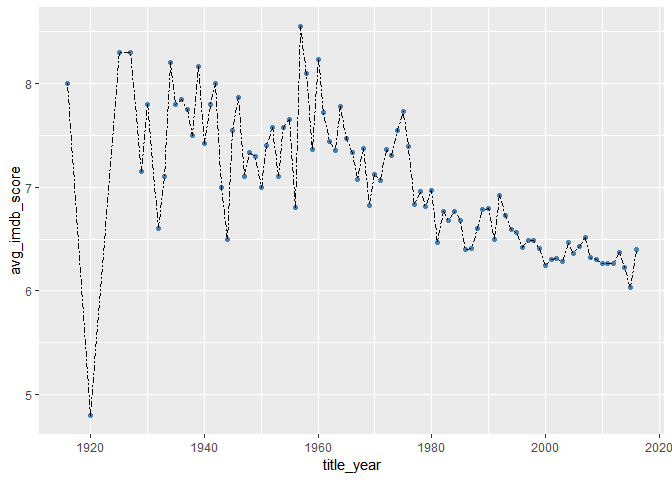
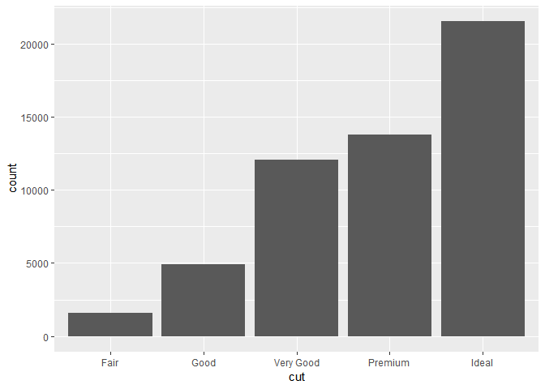
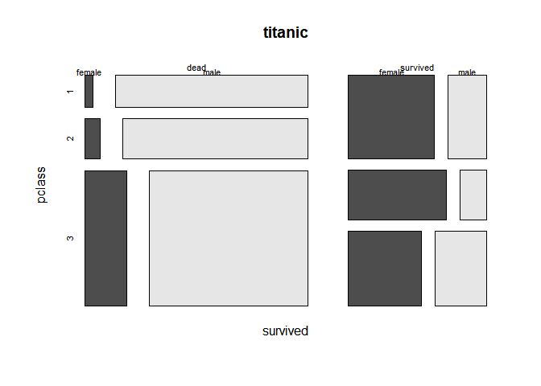

ADP R\_BASIC\_2
================
jakinpilla
2019-05-10

``` r
rm(list = ls())
```

h\_bin freq ratio ————————————————————

``` r
tran %>%
  select(custid, h_bin, amt) %>%
  group_by(custid, h_bin) %>%
  summarise(freq = n())
```

    ## # A tibble: 3,816 x 3
    ## # Groups:   custid [2,089]
    ##    custid h_bin  freq
    ##    <chr>  <fct> <int>
    ##  1 C0001  18-23     2
    ##  2 C0002  6-11      3
    ##  3 C0002  12-17     6
    ##  4 C0003  18-23     4
    ##  5 C0004  6-11     12
    ##  6 C0004  12-17    23
    ##  7 C0005  6-11      4
    ##  8 C0005  12-17    14
    ##  9 C0005  18-23     4
    ## 10 C0006  6-11      1
    ## # ... with 3,806 more rows

``` r
tran %>%
  select(custid, h_bin, amt) %>%
  group_by(custid, h_bin) %>%
  summarise(freq = n()) %>%
  ungroup() %>%
  spread(h_bin, freq, fill = 0) %>%
  mutate(total_freq = rowSums(select_if(., is.numeric))) %>%
  mutate_at(vars(-custid), funs(./total_freq)) 
```

    ## # A tibble: 2,089 x 5
    ##    custid `6-11` `12-17` `18-23` total_freq
    ##    <chr>   <dbl>   <dbl>   <dbl>      <dbl>
    ##  1 C0001   0       0       1              1
    ##  2 C0002   0.333   0.667   0              1
    ##  3 C0003   0       0       1              1
    ##  4 C0004   0.343   0.657   0              1
    ##  5 C0005   0.182   0.636   0.182          1
    ##  6 C0006   1       0       0              1
    ##  7 C0008   0.273   0.727   0              1
    ##  8 C0011   0       0       1              1
    ##  9 C0012   0       0.235   0.765          1
    ## 10 C0013   0.833   0       0.167          1
    ## # ... with 2,079 more rows

h\_bin amt ratio ————————————————————-

``` r
tran %>%
  select(custid, h_bin, amt) %>%
  group_by(custid, h_bin) %>%
  summarise(sum.amt = sum(amt))
```

    ## # A tibble: 3,816 x 3
    ## # Groups:   custid [2,089]
    ##    custid h_bin sum.amt
    ##    <chr>  <fct>   <dbl>
    ##  1 C0001  18-23    5840
    ##  2 C0002  6-11    25670
    ##  3 C0002  12-17   64498
    ##  4 C0003  18-23    9980
    ##  5 C0004  6-11    47051
    ##  6 C0004  12-17  154495
    ##  7 C0005  6-11     8960
    ##  8 C0005  12-17   45323
    ##  9 C0005  18-23   39410
    ## 10 C0006  6-11     3980
    ## # ... with 3,806 more rows

``` r
tran %>%
  select(custid, h_bin, amt) %>%
  group_by(custid, h_bin) %>%
  summarise(sum.amt = sum(amt)) %>%
  ungroup() %>%
  spread(h_bin, sum.amt, fill = 0) %>%
  mutate(total_sum = rowSums(select_if(., is.numeric))) %>%
  mutate_at(vars(-custid), funs(./total_sum)) 
```

    ## # A tibble: 2,089 x 5
    ##    custid `6-11` `12-17` `18-23` total_sum
    ##    <chr>   <dbl>   <dbl>   <dbl>     <dbl>
    ##  1 C0001  0        0       1             1
    ##  2 C0002  0.285    0.715   0             1
    ##  3 C0003  0        0       1             1
    ##  4 C0004  0.233    0.767   0             1
    ##  5 C0005  0.0956   0.484   0.421         1
    ##  6 C0006  1        0       0             1
    ##  7 C0008  0.301    0.699   0             1
    ##  8 C0011  0        0       1             1
    ##  9 C0012  0        0.129   0.871         1
    ## 10 C0013  0.823    0       0.177         1
    ## # ... with 2,079 more rows

CV variable : coefficient of variation, Std / Mean ———————————–

It means that the customer purchases are viased at a certain time for CV
to be large…

Otherwise, it means that the customer purchases are not viased at a
certain time for CV to be small…. That is similar with female purchase
type.

``` r
tran %>%
  select(custid, h_bin, amt) %>%
  group_by(custid, h_bin) %>%
  summarise(freq = n()) %>%
  ungroup() %>%
  spread(h_bin, freq, fill = 0) %>%
  mutate(time_b_mean = apply(select(., -custid), 1, mean)) %>%
  mutate(time_b_std = apply(select(., -custid), 1, sd))
```

    ## # A tibble: 2,089 x 6
    ##    custid `6-11` `12-17` `18-23` time_b_mean time_b_std
    ##    <chr>   <dbl>   <dbl>   <dbl>       <dbl>      <dbl>
    ##  1 C0001       0       0       2       0.667      0.943
    ##  2 C0002       3       6       0       3          2.45 
    ##  3 C0003       0       0       4       1.33       1.89 
    ##  4 C0004      12      23       0      11.7        9.39 
    ##  5 C0005       4      14       4       7.33       4.71 
    ##  6 C0006       1       0       0       0.333      0.471
    ##  7 C0008       3       8       0       3.67       3.30 
    ##  8 C0011       0       0       8       2.67       3.77 
    ##  9 C0012       0       4      13       5.67       5.44 
    ## 10 C0013       5       0       1       2          2.16 
    ## # ... with 2,079 more rows

``` r
tran %>%
  select(custid, h_bin, amt) %>%
  group_by(custid, h_bin) %>%
  summarise(freq = n()) %>%
  ungroup() %>%
  spread(h_bin, freq, fill = 0) %>%
  mutate(time_b_mean = apply(select(., -custid), 1, mean)) %>%
  mutate(time_b_std = apply(select(., -custid), 1, sd)) %>% 
  mutate(time_b_cov = time_b_std/time_b_mean) %>%
  select(custid, time_b_cov) -> cov_df; cov_df
```

    ## # A tibble: 2,089 x 2
    ##    custid time_b_cov
    ##    <chr>       <dbl>
    ##  1 C0001       1.41 
    ##  2 C0002       0.816
    ##  3 C0003       1.41 
    ##  4 C0004       0.805
    ##  5 C0005       0.643
    ##  6 C0006       1.41 
    ##  7 C0008       0.900
    ##  8 C0011       1.41 
    ##  9 C0012       0.959
    ## 10 C0013       1.08 
    ## # ... with 2,079 more rows

With gapminder dataset ——————————————————

``` r
# install.packages('gapminder')
library(gapminder)
data("gapminder"); glimpse(gapminder)
```

    ## Observations: 1,704
    ## Variables: 6
    ## $ country   <fct> Afghanistan, Afghanistan, Afghanistan, Afghanistan, ...
    ## $ continent <fct> Asia, Asia, Asia, Asia, Asia, Asia, Asia, Asia, Asia...
    ## $ year      <int> 1952, 1957, 1962, 1967, 1972, 1977, 1982, 1987, 1992...
    ## $ lifeExp   <dbl> 28.801, 30.332, 31.997, 34.020, 36.088, 38.438, 39.8...
    ## $ pop       <int> 8425333, 9240934, 10267083, 11537966, 13079460, 1488...
    ## $ gdpPercap <dbl> 779.4453, 820.8530, 853.1007, 836.1971, 739.9811, 78...

``` r
unique(gapminder$country)
```

    ##   [1] Afghanistan              Albania                 
    ##   [3] Algeria                  Angola                  
    ##   [5] Argentina                Australia               
    ##   [7] Austria                  Bahrain                 
    ##   [9] Bangladesh               Belgium                 
    ##  [11] Benin                    Bolivia                 
    ##  [13] Bosnia and Herzegovina   Botswana                
    ##  [15] Brazil                   Bulgaria                
    ##  [17] Burkina Faso             Burundi                 
    ##  [19] Cambodia                 Cameroon                
    ##  [21] Canada                   Central African Republic
    ##  [23] Chad                     Chile                   
    ##  [25] China                    Colombia                
    ##  [27] Comoros                  Congo, Dem. Rep.        
    ##  [29] Congo, Rep.              Costa Rica              
    ##  [31] Cote d'Ivoire            Croatia                 
    ##  [33] Cuba                     Czech Republic          
    ##  [35] Denmark                  Djibouti                
    ##  [37] Dominican Republic       Ecuador                 
    ##  [39] Egypt                    El Salvador             
    ##  [41] Equatorial Guinea        Eritrea                 
    ##  [43] Ethiopia                 Finland                 
    ##  [45] France                   Gabon                   
    ##  [47] Gambia                   Germany                 
    ##  [49] Ghana                    Greece                  
    ##  [51] Guatemala                Guinea                  
    ##  [53] Guinea-Bissau            Haiti                   
    ##  [55] Honduras                 Hong Kong, China        
    ##  [57] Hungary                  Iceland                 
    ##  [59] India                    Indonesia               
    ##  [61] Iran                     Iraq                    
    ##  [63] Ireland                  Israel                  
    ##  [65] Italy                    Jamaica                 
    ##  [67] Japan                    Jordan                  
    ##  [69] Kenya                    Korea, Dem. Rep.        
    ##  [71] Korea, Rep.              Kuwait                  
    ##  [73] Lebanon                  Lesotho                 
    ##  [75] Liberia                  Libya                   
    ##  [77] Madagascar               Malawi                  
    ##  [79] Malaysia                 Mali                    
    ##  [81] Mauritania               Mauritius               
    ##  [83] Mexico                   Mongolia                
    ##  [85] Montenegro               Morocco                 
    ##  [87] Mozambique               Myanmar                 
    ##  [89] Namibia                  Nepal                   
    ##  [91] Netherlands              New Zealand             
    ##  [93] Nicaragua                Niger                   
    ##  [95] Nigeria                  Norway                  
    ##  [97] Oman                     Pakistan                
    ##  [99] Panama                   Paraguay                
    ## [101] Peru                     Philippines             
    ## [103] Poland                   Portugal                
    ## [105] Puerto Rico              Reunion                 
    ## [107] Romania                  Rwanda                  
    ## [109] Sao Tome and Principe    Saudi Arabia            
    ## [111] Senegal                  Serbia                  
    ## [113] Sierra Leone             Singapore               
    ## [115] Slovak Republic          Slovenia                
    ## [117] Somalia                  South Africa            
    ## [119] Spain                    Sri Lanka               
    ## [121] Sudan                    Swaziland               
    ## [123] Sweden                   Switzerland             
    ## [125] Syria                    Taiwan                  
    ## [127] Tanzania                 Thailand                
    ## [129] Togo                     Trinidad and Tobago     
    ## [131] Tunisia                  Turkey                  
    ## [133] Uganda                   United Kingdom          
    ## [135] United States            Uruguay                 
    ## [137] Venezuela                Vietnam                 
    ## [139] West Bank and Gaza       Yemen, Rep.             
    ## [141] Zambia                   Zimbabwe                
    ## 142 Levels: Afghanistan Albania Algeria Angola Argentina ... Zimbabwe

``` r
gapminder %>% filter(country == 'Korea, Rep.' & year==2007)
```

    ## # A tibble: 1 x 6
    ##   country     continent  year lifeExp      pop gdpPercap
    ##   <fct>       <fct>     <int>   <dbl>    <int>     <dbl>
    ## 1 Korea, Rep. Asia       2007    78.6 49044790    23348.

``` r
gapminder %>% arrange(year, country)
```

    ## # A tibble: 1,704 x 6
    ##    country     continent  year lifeExp      pop gdpPercap
    ##    <fct>       <fct>     <int>   <dbl>    <int>     <dbl>
    ##  1 Afghanistan Asia       1952    28.8  8425333      779.
    ##  2 Albania     Europe     1952    55.2  1282697     1601.
    ##  3 Algeria     Africa     1952    43.1  9279525     2449.
    ##  4 Angola      Africa     1952    30.0  4232095     3521.
    ##  5 Argentina   Americas   1952    62.5 17876956     5911.
    ##  6 Australia   Oceania    1952    69.1  8691212    10040.
    ##  7 Austria     Europe     1952    66.8  6927772     6137.
    ##  8 Bahrain     Asia       1952    50.9   120447     9867.
    ##  9 Bangladesh  Asia       1952    37.5 46886859      684.
    ## 10 Belgium     Europe     1952    68    8730405     8343.
    ## # ... with 1,694 more rows

Basic Statistics ————————————————————

``` r
gapminder %>%
  summarise(n_obs = n(),
            n_countries = n_distinct(country),
            n_years = n_distinct(year),
            med_gdpc = median(gdpPercap),
            max_gdppc = max(gdpPercap))
```

    ## # A tibble: 1 x 5
    ##   n_obs n_countries n_years med_gdpc max_gdppc
    ##   <int>       <int>   <int>    <dbl>     <dbl>
    ## 1  1704         142      12    3532.   113523.

Mutate new variables ———————————————————

``` r
gapminder %>%
  mutate(total_gdp = pop*gdpPercap,
         le_gdp_ratio = lifeExp / gdpPercap,
         lgrk = le_gdp_ratio*100)
```

    ## # A tibble: 1,704 x 9
    ##    country continent  year lifeExp    pop gdpPercap total_gdp le_gdp_ratio
    ##    <fct>   <fct>     <int>   <dbl>  <int>     <dbl>     <dbl>        <dbl>
    ##  1 Afghan~ Asia       1952    28.8 8.43e6      779.   6.57e 9       0.0370
    ##  2 Afghan~ Asia       1957    30.3 9.24e6      821.   7.59e 9       0.0370
    ##  3 Afghan~ Asia       1962    32.0 1.03e7      853.   8.76e 9       0.0375
    ##  4 Afghan~ Asia       1967    34.0 1.15e7      836.   9.65e 9       0.0407
    ##  5 Afghan~ Asia       1972    36.1 1.31e7      740.   9.68e 9       0.0488
    ##  6 Afghan~ Asia       1977    38.4 1.49e7      786.   1.17e10       0.0489
    ##  7 Afghan~ Asia       1982    39.9 1.29e7      978.   1.26e10       0.0408
    ##  8 Afghan~ Asia       1987    40.8 1.39e7      852.   1.18e10       0.0479
    ##  9 Afghan~ Asia       1992    41.7 1.63e7      649.   1.06e10       0.0642
    ## 10 Afghan~ Asia       1997    41.8 2.22e7      635.   1.41e10       0.0657
    ## # ... with 1,694 more rows, and 1 more variable: lgrk <dbl>

Group\_by ——————————————————————–

``` r
gapminder %>%
  filter(year==2007) %>%
  group_by(continent) %>%
  summarise(n(), mean(lifeExp), median(lifeExp)) %>%
  arrange(-`median(lifeExp)`)
```

    ## # A tibble: 5 x 4
    ##   continent `n()` `mean(lifeExp)` `median(lifeExp)`
    ##   <fct>     <int>           <dbl>             <dbl>
    ## 1 Oceania       2            80.7              80.7
    ## 2 Europe       30            77.6              78.6
    ## 3 Americas     25            73.6              72.9
    ## 4 Asia         33            70.7              72.4
    ## 5 Africa       52            54.8              52.9

Correlations —————————————————————-

``` r
gapminder %>% head()
```

    ## # A tibble: 6 x 6
    ##   country     continent  year lifeExp      pop gdpPercap
    ##   <fct>       <fct>     <int>   <dbl>    <int>     <dbl>
    ## 1 Afghanistan Asia       1952    28.8  8425333      779.
    ## 2 Afghanistan Asia       1957    30.3  9240934      821.
    ## 3 Afghanistan Asia       1962    32.0 10267083      853.
    ## 4 Afghanistan Asia       1967    34.0 11537966      836.
    ## 5 Afghanistan Asia       1972    36.1 13079460      740.
    ## 6 Afghanistan Asia       1977    38.4 14880372      786.

``` r
summary(gapminder)
```

    ##         country        continent        year         lifeExp     
    ##  Afghanistan:  12   Africa  :624   Min.   :1952   Min.   :23.60  
    ##  Albania    :  12   Americas:300   1st Qu.:1966   1st Qu.:48.20  
    ##  Algeria    :  12   Asia    :396   Median :1980   Median :60.71  
    ##  Angola     :  12   Europe  :360   Mean   :1980   Mean   :59.47  
    ##  Argentina  :  12   Oceania : 24   3rd Qu.:1993   3rd Qu.:70.85  
    ##  Australia  :  12                  Max.   :2007   Max.   :82.60  
    ##  (Other)    :1632                                                
    ##       pop              gdpPercap       
    ##  Min.   :6.001e+04   Min.   :   241.2  
    ##  1st Qu.:2.794e+06   1st Qu.:  1202.1  
    ##  Median :7.024e+06   Median :  3531.8  
    ##  Mean   :2.960e+07   Mean   :  7215.3  
    ##  3rd Qu.:1.959e+07   3rd Qu.:  9325.5  
    ##  Max.   :1.319e+09   Max.   :113523.1  
    ## 

``` r
summary(gapminder$gdpPercap)
```

    ##     Min.  1st Qu.   Median     Mean  3rd Qu.     Max. 
    ##    241.2   1202.1   3531.8   7215.3   9325.5 113523.1

``` r
cor(gapminder$gdpPercap, gapminder$lifeExp) # 0.5837062
```

    ## [1] 0.5837062

``` r
cor(log10(gapminder$gdpPercap), gapminder$lifeExp) # notice that the cor value increase to 0.8076179...
```

    ## [1] 0.8076179

``` r
plot(gapminder$gdpPercap, gapminder$lifeExp, cex=.5)
```

<!-- -->

``` r
plot(log10(gapminder$gdpPercap), gapminder$lifeExp, cex=.5)
```

<!-- -->

``` r
gapminder %>%
  ggplot(aes(gdpPercap, lifeExp, col = country)) + geom_point() + theme(legend.position= "none")
```

<!-- -->

``` r
gapminder %>%
  ggplot(aes(log10(gdpPercap), lifeExp, col = country)) + geom_point() + theme(legend.position= "none")
```

<!-- -->

With df\_imdb dataset ——————————————————–

``` r
df_imdb <- read_csv('./data/imdb-5000-movie-dataset.zip'); glimpse(df_imdb)
```

    ## Parsed with column specification:
    ## cols(
    ##   .default = col_double(),
    ##   color = col_character(),
    ##   director_name = col_character(),
    ##   actor_2_name = col_character(),
    ##   genres = col_character(),
    ##   actor_1_name = col_character(),
    ##   movie_title = col_character(),
    ##   actor_3_name = col_character(),
    ##   plot_keywords = col_character(),
    ##   movie_imdb_link = col_character(),
    ##   language = col_character(),
    ##   country = col_character(),
    ##   content_rating = col_character()
    ## )

    ## See spec(...) for full column specifications.

    ## Observations: 5,043
    ## Variables: 28
    ## $ color                     <chr> "Color", "Color", "Color", "Color", ...
    ## $ director_name             <chr> "James Cameron", "Gore Verbinski", "...
    ## $ num_critic_for_reviews    <dbl> 723, 302, 602, 813, NA, 462, 392, 32...
    ## $ duration                  <dbl> 178, 169, 148, 164, NA, 132, 156, 10...
    ## $ director_facebook_likes   <dbl> 0, 563, 0, 22000, 131, 475, 0, 15, 0...
    ## $ actor_3_facebook_likes    <dbl> 855, 1000, 161, 23000, NA, 530, 4000...
    ## $ actor_2_name              <chr> "Joel David Moore", "Orlando Bloom",...
    ## $ actor_1_facebook_likes    <dbl> 1000, 40000, 11000, 27000, 131, 640,...
    ## $ gross                     <dbl> 760505847, 309404152, 200074175, 448...
    ## $ genres                    <chr> "Action|Adventure|Fantasy|Sci-Fi", "...
    ## $ actor_1_name              <chr> "CCH Pounder", "Johnny Depp", "Chris...
    ## $ movie_title               <chr> "Avatar<U+00A0>", "Pirates of the Caribbean...
    ## $ num_voted_users           <dbl> 886204, 471220, 275868, 1144337, 8, ...
    ## $ cast_total_facebook_likes <dbl> 4834, 48350, 11700, 106759, 143, 187...
    ## $ actor_3_name              <chr> "Wes Studi", "Jack Davenport", "Step...
    ## $ facenumber_in_poster      <dbl> 0, 0, 1, 0, 0, 1, 0, 1, 4, 3, 0, 0, ...
    ## $ plot_keywords             <chr> "avatar|future|marine|native|paraple...
    ## $ movie_imdb_link           <chr> "http://www.imdb.com/title/tt0499549...
    ## $ num_user_for_reviews      <dbl> 3054, 1238, 994, 2701, NA, 738, 1902...
    ## $ language                  <chr> "English", "English", "English", "En...
    ## $ country                   <chr> "USA", "USA", "UK", "USA", NA, "USA"...
    ## $ content_rating            <chr> "PG-13", "PG-13", "PG-13", "PG-13", ...
    ## $ budget                    <dbl> 237000000, 300000000, 245000000, 250...
    ## $ title_year                <dbl> 2009, 2007, 2015, 2012, NA, 2012, 20...
    ## $ actor_2_facebook_likes    <dbl> 936, 5000, 393, 23000, 12, 632, 1100...
    ## $ imdb_score                <dbl> 7.9, 7.1, 6.8, 8.5, 7.1, 6.6, 6.2, 7...
    ## $ aspect_ratio              <dbl> 1.78, 2.35, 2.35, 2.35, NA, 2.35, 2....
    ## $ movie_facebook_likes      <dbl> 33000, 0, 85000, 164000, 0, 24000, 0...

``` r
head(df_imdb)
```

    ## # A tibble: 6 x 28
    ##   color director_name num_critic_for_~ duration director_facebo~
    ##   <chr> <chr>                    <dbl>    <dbl>            <dbl>
    ## 1 Color James Cameron              723      178                0
    ## 2 Color Gore Verbins~              302      169              563
    ## 3 Color Sam Mendes                 602      148                0
    ## 4 Color Christopher ~              813      164            22000
    ## 5 <NA>  Doug Walker                 NA       NA              131
    ## 6 Color Andrew Stant~              462      132              475
    ## # ... with 23 more variables: actor_3_facebook_likes <dbl>,
    ## #   actor_2_name <chr>, actor_1_facebook_likes <dbl>, gross <dbl>,
    ## #   genres <chr>, actor_1_name <chr>, movie_title <chr>,
    ## #   num_voted_users <dbl>, cast_total_facebook_likes <dbl>,
    ## #   actor_3_name <chr>, facenumber_in_poster <dbl>, plot_keywords <chr>,
    ## #   movie_imdb_link <chr>, num_user_for_reviews <dbl>, language <chr>,
    ## #   country <chr>, content_rating <chr>, budget <dbl>, title_year <dbl>,
    ## #   actor_2_facebook_likes <dbl>, imdb_score <dbl>, aspect_ratio <dbl>,
    ## #   movie_facebook_likes <dbl>

``` r
df_imdb$country <- as.factor(df_imdb$country); glimpse(df_imdb)
```

    ## Observations: 5,043
    ## Variables: 28
    ## $ color                     <chr> "Color", "Color", "Color", "Color", ...
    ## $ director_name             <chr> "James Cameron", "Gore Verbinski", "...
    ## $ num_critic_for_reviews    <dbl> 723, 302, 602, 813, NA, 462, 392, 32...
    ## $ duration                  <dbl> 178, 169, 148, 164, NA, 132, 156, 10...
    ## $ director_facebook_likes   <dbl> 0, 563, 0, 22000, 131, 475, 0, 15, 0...
    ## $ actor_3_facebook_likes    <dbl> 855, 1000, 161, 23000, NA, 530, 4000...
    ## $ actor_2_name              <chr> "Joel David Moore", "Orlando Bloom",...
    ## $ actor_1_facebook_likes    <dbl> 1000, 40000, 11000, 27000, 131, 640,...
    ## $ gross                     <dbl> 760505847, 309404152, 200074175, 448...
    ## $ genres                    <chr> "Action|Adventure|Fantasy|Sci-Fi", "...
    ## $ actor_1_name              <chr> "CCH Pounder", "Johnny Depp", "Chris...
    ## $ movie_title               <chr> "Avatar<U+00A0>", "Pirates of the Caribbean...
    ## $ num_voted_users           <dbl> 886204, 471220, 275868, 1144337, 8, ...
    ## $ cast_total_facebook_likes <dbl> 4834, 48350, 11700, 106759, 143, 187...
    ## $ actor_3_name              <chr> "Wes Studi", "Jack Davenport", "Step...
    ## $ facenumber_in_poster      <dbl> 0, 0, 1, 0, 0, 1, 0, 1, 4, 3, 0, 0, ...
    ## $ plot_keywords             <chr> "avatar|future|marine|native|paraple...
    ## $ movie_imdb_link           <chr> "http://www.imdb.com/title/tt0499549...
    ## $ num_user_for_reviews      <dbl> 3054, 1238, 994, 2701, NA, 738, 1902...
    ## $ language                  <chr> "English", "English", "English", "En...
    ## $ country                   <fct> USA, USA, UK, USA, NA, USA, USA, USA...
    ## $ content_rating            <chr> "PG-13", "PG-13", "PG-13", "PG-13", ...
    ## $ budget                    <dbl> 237000000, 300000000, 245000000, 250...
    ## $ title_year                <dbl> 2009, 2007, 2015, 2012, NA, 2012, 20...
    ## $ actor_2_facebook_likes    <dbl> 936, 5000, 393, 23000, 12, 632, 1100...
    ## $ imdb_score                <dbl> 7.9, 7.1, 6.8, 8.5, 7.1, 6.6, 6.2, 7...
    ## $ aspect_ratio              <dbl> 1.78, 2.35, 2.35, 2.35, NA, 2.35, 2....
    ## $ movie_facebook_likes      <dbl> 33000, 0, 85000, 164000, 0, 24000, 0...

Like pandas .value\_count() method ——————————————-

``` r
df_imdb %>% group_by(country) %>% tally() %>% arrange(-n)
```

    ## Warning: Factor `country` contains implicit NA, consider using
    ## `forcats::fct_explicit_na`

    ## # A tibble: 66 x 2
    ##    country       n
    ##    <fct>     <int>
    ##  1 USA        3807
    ##  2 UK          448
    ##  3 France      154
    ##  4 Canada      126
    ##  5 Germany      97
    ##  6 Australia    55
    ##  7 India        34
    ##  8 Spain        33
    ##  9 China        30
    ## 10 Italy        23
    ## # ... with 56 more rows

America Movie Budget Distribution ——————————————-

``` r
df_imdb %>%
  filter(country == 'USA') %>%
  ggplot(aes(budget)) + geom_histogram(bins = 50, fill = 'steelblue')
```

    ## Warning: Removed 298 rows containing non-finite values (stat_bin).

<!-- -->

Movie Score Mean Variation ————————————————–

``` r
df_imdb %>%
  group_by(title_year) %>%
  summarise(avg_imdb_score = mean(imdb_score)) %>%
  ggplot(aes(title_year, avg_imdb_score)) + geom_point(col = "steelblue") + geom_line(linetype = 6)
```

    ## Warning: Removed 1 rows containing missing values (geom_point).

    ## Warning: Removed 1 rows containing missing values (geom_path).

<!-- -->

Each Facter Cnt and Percentage ———————————————–

``` r
data(diamonds)
diamonds %>%
  group_by(cut) %>%
  tally() %>%
  mutate(pct = round((n/sum(n))*100, 1))
```

    ## # A tibble: 5 x 3
    ##   cut           n   pct
    ##   <ord>     <int> <dbl>
    ## 1 Fair       1610   3  
    ## 2 Good       4906   9.1
    ## 3 Very Good 12082  22.4
    ## 4 Premium   13791  25.6
    ## 5 Ideal     21551  40

Data Visualizatoin according to data classes ———————————

``` r
# 1. One continuous Variable...
hist(gapminder$lifeExp)
```

<!-- -->

``` r
hist(gapminder$gdpPercap, nclass=50)
```

<!-- -->

``` r
hist(log10(gapminder$gdpPercap), nclass=50)
```

<!-- -->

``` r
gapminder %>%
  ggplot(aes(gdpPercap)) + geom_histogram(bins = 50, fill = "steelblue") + scale_x_log10()
```

<!-- -->

``` r
gapminder %>%
  ggplot(aes(x=gdpPercap, y=lifeExp)) + geom_point() +scale_x_log10() + geom_smooth()
```

    ## `geom_smooth()` using method = 'gam' and formula 'y ~ s(x, bs = "cs")'

<!-- -->

``` r
gapminder %>%
  ggplot(aes(log10(gdpPercap), lifeExp)) + 
  geom_point(aes(colour = factor(country))) + geom_smooth() + theme(legend.position= "none")
```

    ## `geom_smooth()` using method = 'gam' and formula 'y ~ s(x, bs = "cs")'

<!-- -->

2.  One factor Variable…

<!-- end list -->

``` r
diamonds %>% ggplot(aes(cut)) + geom_bar() 
```

<!-- -->

``` r
table(diamonds$cut)
```

    ## 
    ##      Fair      Good Very Good   Premium     Ideal 
    ##      1610      4906     12082     13791     21551

``` r
prop.table(table(diamonds$cut))
```

    ## 
    ##       Fair       Good  Very Good    Premium      Ideal 
    ## 0.02984798 0.09095291 0.22398962 0.25567297 0.39953652

``` r
round(prop.table(table(diamonds$cut)) * 100, 1)
```

    ## 
    ##      Fair      Good Very Good   Premium     Ideal 
    ##       3.0       9.1      22.4      25.6      40.0

``` r
diamonds %>%
  select(cut) %>% pull() %>% table() %>% prop.table() %>% round(2) %>% as.data.frame() %>%
  rename(cut_type = ".") %>%
  ggplot(aes(x= cut_type, y = Freq, fill = cut_type)) +
  geom_bar(stat = "identity")
```

<!-- -->

``` r
library(MASS)
```

    ## Warning: package 'MASS' was built under R version 3.5.3

    ## 
    ## Attaching package: 'MASS'

    ## The following object is masked from 'package:dplyr':
    ## 
    ##     select

``` r
data(survey); glimpse(survey)
```

    ## Observations: 237
    ## Variables: 12
    ## $ Sex    <fct> Female, Male, Male, Male, Male, Female, Male, Female, M...
    ## $ Wr.Hnd <dbl> 18.5, 19.5, 18.0, 18.8, 20.0, 18.0, 17.7, 17.0, 20.0, 1...
    ## $ NW.Hnd <dbl> 18.0, 20.5, 13.3, 18.9, 20.0, 17.7, 17.7, 17.3, 19.5, 1...
    ## $ W.Hnd  <fct> Right, Left, Right, Right, Right, Right, Right, Right, ...
    ## $ Fold   <fct> R on L, R on L, L on R, R on L, Neither, L on R, L on R...
    ## $ Pulse  <int> 92, 104, 87, NA, 35, 64, 83, 74, 72, 90, 80, 68, NA, 66...
    ## $ Clap   <fct> Left, Left, Neither, Neither, Right, Right, Right, Righ...
    ## $ Exer   <fct> Some, None, None, None, Some, Some, Freq, Freq, Some, S...
    ## $ Smoke  <fct> Never, Regul, Occas, Never, Never, Never, Never, Never,...
    ## $ Height <dbl> 173.00, 177.80, NA, 160.00, 165.00, 172.72, 182.88, 157...
    ## $ M.I    <fct> Metric, Imperial, NA, Metric, Metric, Imperial, Imperia...
    ## $ Age    <dbl> 18.250, 17.583, 16.917, 20.333, 23.667, 21.000, 18.833,...

``` r
head(table(survey$W.Hnd))
```

    ## 
    ##  Left Right 
    ##    18   218

``` r
chisq.test(table(survey$W.Hnd), p=c(.3, .7)) # chisq.test to figure out it follows certains distribution...
```

    ## 
    ##  Chi-squared test for given probabilities
    ## 
    ## data:  table(survey$W.Hnd)
    ## X-squared = 56.252, df = 1, p-value = 6.376e-14

``` r
# p< .05, so it doesn't follow certain distribution
```

3.  Scatter Plot : Two more numeric variables ——————————–

<!-- end list -->

``` r
diamonds %>% sample_n(30) %>% pairs()
```

<!-- -->

``` r
diamonds %>% sample_n(30) %>% ggpairs()
```

    ## `stat_bin()` using `bins = 30`. Pick better value with `binwidth`.
    ## `stat_bin()` using `bins = 30`. Pick better value with `binwidth`.
    ## `stat_bin()` using `bins = 30`. Pick better value with `binwidth`.
    ## `stat_bin()` using `bins = 30`. Pick better value with `binwidth`.
    ## `stat_bin()` using `bins = 30`. Pick better value with `binwidth`.
    ## `stat_bin()` using `bins = 30`. Pick better value with `binwidth`.
    ## `stat_bin()` using `bins = 30`. Pick better value with `binwidth`.
    ## `stat_bin()` using `bins = 30`. Pick better value with `binwidth`.
    ## `stat_bin()` using `bins = 30`. Pick better value with `binwidth`.
    ## `stat_bin()` using `bins = 30`. Pick better value with `binwidth`.
    ## `stat_bin()` using `bins = 30`. Pick better value with `binwidth`.
    ## `stat_bin()` using `bins = 30`. Pick better value with `binwidth`.
    ## `stat_bin()` using `bins = 30`. Pick better value with `binwidth`.
    ## `stat_bin()` using `bins = 30`. Pick better value with `binwidth`.
    ## `stat_bin()` using `bins = 30`. Pick better value with `binwidth`.
    ## `stat_bin()` using `bins = 30`. Pick better value with `binwidth`.
    ## `stat_bin()` using `bins = 30`. Pick better value with `binwidth`.
    ## `stat_bin()` using `bins = 30`. Pick better value with `binwidth`.
    ## `stat_bin()` using `bins = 30`. Pick better value with `binwidth`.
    ## `stat_bin()` using `bins = 30`. Pick better value with `binwidth`.
    ## `stat_bin()` using `bins = 30`. Pick better value with `binwidth`.

<!-- -->

4.  Numeric Variable \~ Factor Variable :: boxplot —————————-

<!-- end list -->

``` r
mpg %>%
  ggplot(aes(class, hwy)) + geom_boxplot()
```

<!-- -->

``` r
mpg %>%
  ggplot(aes(class, hwy, color = class)) + 
  geom_boxplot(outlier.colour = "red", outlier.shape = 8) + 
  geom_jitter(col = 'gray', alpha = .5)
```

<!-- -->

``` r
mpg %>% mutate(class=reorder(class, hwy, median)); mpg$class[1:5] 
```

    ## # A tibble: 234 x 11
    ##    manufacturer model displ  year   cyl trans drv     cty   hwy fl    class
    ##    <chr>        <chr> <dbl> <int> <int> <chr> <chr> <int> <int> <chr> <fct>
    ##  1 audi         a4      1.8  1999     4 auto~ f        18    29 p     comp~
    ##  2 audi         a4      1.8  1999     4 manu~ f        21    29 p     comp~
    ##  3 audi         a4      2    2008     4 manu~ f        20    31 p     comp~
    ##  4 audi         a4      2    2008     4 auto~ f        21    30 p     comp~
    ##  5 audi         a4      2.8  1999     6 auto~ f        16    26 p     comp~
    ##  6 audi         a4      2.8  1999     6 manu~ f        18    26 p     comp~
    ##  7 audi         a4      3.1  2008     6 auto~ f        18    27 p     comp~
    ##  8 audi         a4 q~   1.8  1999     4 manu~ 4        18    26 p     comp~
    ##  9 audi         a4 q~   1.8  1999     4 auto~ 4        16    25 p     comp~
    ## 10 audi         a4 q~   2    2008     4 manu~ 4        20    28 p     comp~
    ## # ... with 224 more rows

    ## [1] "compact" "compact" "compact" "compact" "compact"

reorder `class` column according to median value of `hwy`…

``` r
mpg %>%
  mutate(class=reorder(class, hwy, median)) %>%
  ggplot(aes(class, hwy, color = class)) + 
  geom_boxplot(outlier.colour = "red", outlier.shape = 8, alpha = .5) + 
  geom_jitter(col = 'gray')
```

<!-- -->

``` r
mpg %>% 
  mutate(class=factor(class,
                      levels=c('2seater', 'subcompact', 'compact', 'midsize', 
                               'minivan', 'suv', 'pickup'))) %>% # designate x-axis order by name...
  ggplot(aes(class, hwy, color = class)) + 
  geom_boxplot(outlier.colour = "red", outlier.shape = 8, alpha = .5) + 
  geom_jitter(col = 'gray')
```

<!-- -->

4.  Factor Variable \~ Factor Variable (xtabs() / mosaicplot()) \>
    chisq.test() ——–

<!-- end list -->

``` r
data("Titanic"); glimpse(Titanic)
```

    ##  'table' num [1:4, 1:2, 1:2, 1:2] 0 0 35 0 0 0 17 0 118 154 ...
    ##  - attr(*, "dimnames")=List of 4
    ##   ..$ Class   : chr [1:4] "1st" "2nd" "3rd" "Crew"
    ##   ..$ Sex     : chr [1:2] "Male" "Female"
    ##   ..$ Age     : chr [1:2] "Child" "Adult"
    ##   ..$ Survived: chr [1:2] "No" "Yes"

``` r
xtabs(~ Class + Sex + Age + Survived, data.frame(Titanic))
```

    ## , , Age = Child, Survived = No
    ## 
    ##       Sex
    ## Class  Male Female
    ##   1st     1      1
    ##   2nd     1      1
    ##   3rd     1      1
    ##   Crew    1      1
    ## 
    ## , , Age = Adult, Survived = No
    ## 
    ##       Sex
    ## Class  Male Female
    ##   1st     1      1
    ##   2nd     1      1
    ##   3rd     1      1
    ##   Crew    1      1
    ## 
    ## , , Age = Child, Survived = Yes
    ## 
    ##       Sex
    ## Class  Male Female
    ##   1st     1      1
    ##   2nd     1      1
    ##   3rd     1      1
    ##   Crew    1      1
    ## 
    ## , , Age = Adult, Survived = Yes
    ## 
    ##       Sex
    ## Class  Male Female
    ##   1st     1      1
    ##   2nd     1      1
    ##   3rd     1      1
    ##   Crew    1      1

``` r
xtabs(Freq ~ Class + Sex + Age + Survived, data.frame(Titanic)) # Freq
```

    ## , , Age = Child, Survived = No
    ## 
    ##       Sex
    ## Class  Male Female
    ##   1st     0      0
    ##   2nd     0      0
    ##   3rd    35     17
    ##   Crew    0      0
    ## 
    ## , , Age = Adult, Survived = No
    ## 
    ##       Sex
    ## Class  Male Female
    ##   1st   118      4
    ##   2nd   154     13
    ##   3rd   387     89
    ##   Crew  670      3
    ## 
    ## , , Age = Child, Survived = Yes
    ## 
    ##       Sex
    ## Class  Male Female
    ##   1st     5      1
    ##   2nd    11     13
    ##   3rd    13     14
    ##   Crew    0      0
    ## 
    ## , , Age = Adult, Survived = Yes
    ## 
    ##       Sex
    ## Class  Male Female
    ##   1st    57    140
    ##   2nd    14     80
    ##   3rd    75     76
    ##   Crew  192     20

``` r
as.tibble(fread('./data/titanic3.csv', data.table = F)) -> titanic; glimpse(titanic)
```

    ## Warning: `as.tibble()` is deprecated, use `as_tibble()` (but mind the new semantics).
    ## This warning is displayed once per session.

    ## Observations: 1,309
    ## Variables: 14
    ## $ pclass    <int> 1, 1, 1, 1, 1, 1, 1, 1, 1, 1, 1, 1, 1, 1, 1, 1, 1, 1...
    ## $ survived  <int> 1, 1, 0, 0, 0, 1, 1, 0, 1, 0, 0, 1, 1, 1, 1, 0, 0, 1...
    ## $ name      <chr> "Allen, Miss. Elisabeth Walton", "Allison, Master. H...
    ## $ sex       <chr> "female", "male", "female", "male", "female", "male"...
    ## $ age       <dbl> 29.00, 0.92, 2.00, 30.00, 25.00, 48.00, 63.00, 39.00...
    ## $ sibsp     <int> 0, 1, 1, 1, 1, 0, 1, 0, 2, 0, 1, 1, 0, 0, 0, 0, 0, 0...
    ## $ parch     <int> 0, 2, 2, 2, 2, 0, 0, 0, 0, 0, 0, 0, 0, 0, 0, 0, 1, 1...
    ## $ ticket    <chr> "24160", "113781", "113781", "113781", "113781", "19...
    ## $ fare      <dbl> 211.3375, 151.5500, 151.5500, 151.5500, 151.5500, 26...
    ## $ cabin     <chr> "B5", "C22 C26", "C22 C26", "C22 C26", "C22 C26", "E...
    ## $ embarked  <chr> "S", "S", "S", "S", "S", "S", "S", "S", "S", "C", "C...
    ## $ boat      <chr> "2", "11", "", "", "", "3", "10", "", "D", "", "", "...
    ## $ body      <int> NA, NA, NA, 135, NA, NA, NA, NA, NA, 22, 124, NA, NA...
    ## $ home.dest <chr> "St Louis, MO", "Montreal, PQ / Chesterville, ON", "...

``` r
titanic %>% replace(is.na(.), 0) -> titanic
titanic$pclass <- as.factor(titanic$pclass)
titanic$sex <- as.factor(titanic$sex)
titanic$ticket <- as.character(titanic$ticket)
titanic$survived <- factor(titanic$survived, levels=c(0,1), labels=c('dead', 'survived'))

glimpse(titanic)
```

    ## Observations: 1,309
    ## Variables: 14
    ## $ pclass    <fct> 1, 1, 1, 1, 1, 1, 1, 1, 1, 1, 1, 1, 1, 1, 1, 1, 1, 1...
    ## $ survived  <fct> survived, survived, dead, dead, dead, survived, surv...
    ## $ name      <chr> "Allen, Miss. Elisabeth Walton", "Allison, Master. H...
    ## $ sex       <fct> female, male, female, male, female, male, female, ma...
    ## $ age       <dbl> 29.00, 0.92, 2.00, 30.00, 25.00, 48.00, 63.00, 39.00...
    ## $ sibsp     <int> 0, 1, 1, 1, 1, 0, 1, 0, 2, 0, 1, 1, 0, 0, 0, 0, 0, 0...
    ## $ parch     <int> 0, 2, 2, 2, 2, 0, 0, 0, 0, 0, 0, 0, 0, 0, 0, 0, 1, 1...
    ## $ ticket    <chr> "24160", "113781", "113781", "113781", "113781", "19...
    ## $ fare      <dbl> 211.3375, 151.5500, 151.5500, 151.5500, 151.5500, 26...
    ## $ cabin     <chr> "B5", "C22 C26", "C22 C26", "C22 C26", "C22 C26", "E...
    ## $ embarked  <chr> "S", "S", "S", "S", "S", "S", "S", "S", "S", "C", "C...
    ## $ boat      <chr> "2", "11", "", "", "", "3", "10", "", "D", "", "", "...
    ## $ body      <dbl> 0, 0, 0, 135, 0, 0, 0, 0, 0, 22, 124, 0, 0, 0, 0, 0,...
    ## $ home.dest <chr> "St Louis, MO", "Montreal, PQ / Chesterville, ON", "...

xtabs() ———————————————————————

``` r
xtabs(survived == 'survived' ~ sex + pclass, data=titanic)
```

    ##         pclass
    ## sex        1   2   3
    ##   female 139  94 106
    ##   male    61  25  75

``` r
xtabs(survived == 'survived' ~ sex + pclass, data=titanic) / xtabs(~ sex + pclass, data=titanic)
```

    ##         pclass
    ## sex              1         2         3
    ##   female 0.9652778 0.8867925 0.4907407
    ##   male   0.3407821 0.1461988 0.1521298

chisq.test to know whether the relationship between sex and survive is
independent or not…

``` r
xtabs(~sex + survived, data = titanic)
```

    ##         survived
    ## sex      dead survived
    ##   female  127      339
    ##   male    682      161

``` r
chisq.test(xtabs(~ sex + survived, data=titanic)) # p < .05 |-> Not independent... so there is relationship.
```

    ## 
    ##  Pearson's Chi-squared test with Yates' continuity correction
    ## 
    ## data:  xtabs(~sex + survived, data = titanic)
    ## X-squared = 363.62, df = 1, p-value < 2.2e-16

Mosaic plot—-

``` r
mosaicplot(survived ~ pclass + sex, data = titanic, color=T) # how to interprete the mosaic plot...
```

<!-- -->
