ADP Statistics\_1
================
jakinpilla
2019-04-24

``` r
setwd("/home/insa/ADP_performance_test/")
getwd()
```

    ## [1] "/home/insa/ADP_performance_test"

Statistic Basic

``` r
cor(iris$Sepal.Width, iris$Sepal.Length)
```

    ## [1] -0.1175698

``` r
cor(iris[, 1:4]) # 비선형 :: mehthod = 'spearman'
```

    ##              Sepal.Length Sepal.Width Petal.Length Petal.Width
    ## Sepal.Length    1.0000000  -0.1175698    0.8717538   0.8179411
    ## Sepal.Width    -0.1175698   1.0000000   -0.4284401  -0.3661259
    ## Petal.Length    0.8717538  -0.4284401    1.0000000   0.9628654
    ## Petal.Width     0.8179411  -0.3661259    0.9628654   1.0000000

``` r
cor.test(c(1,2,3,4,5), c(1,0,3,4,5), method='pearson')
```

    ## 
    ##  Pearson's product-moment correlation
    ## 
    ## data:  c(1, 2, 3, 4, 5) and c(1, 0, 3, 4, 5)
    ## t = 3.9279, df = 3, p-value = 0.02937
    ## alternative hypothesis: true correlation is not equal to 0
    ## 95 percent confidence interval:
    ##  0.1697938 0.9944622
    ## sample estimates:
    ##       cor 
    ## 0.9149914

One var…

``` r
par(mfrow = c(1,1))
summary(mpg$hwy) # hwy : highway miles per gallon
```

    ##    Min. 1st Qu.  Median    Mean 3rd Qu.    Max. 
    ##   12.00   18.00   24.00   23.44   27.00   44.00

``` r
mean(mpg$hwy)
```

    ## [1] 23.44017

``` r
median(mpg$hwy)
```

    ## [1] 24

``` r
hist(mpg$hwy)
```

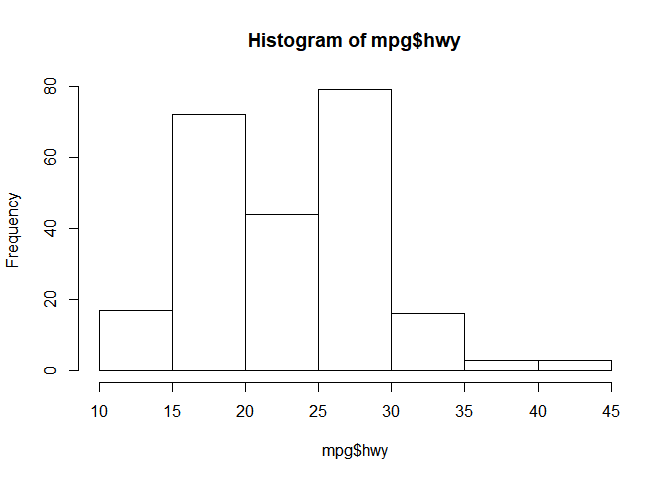<!-- -->

``` r
qqnorm(mpg$hwy)
qqline(mpg$hwy)
```

<!-- -->

``` r
t.test(mpg$hwy, mu=22.9, alternative = 'greater')
```

    ## 
    ##  One Sample t-test
    ## 
    ## data:  mpg$hwy
    ## t = 1.3877, df = 233, p-value = 0.08328
    ## alternative hypothesis: true mean is greater than 22.9
    ## 95 percent confidence interval:
    ##  22.79733      Inf
    ## sample estimates:
    ## mean of x 
    ##  23.44017

boxplot

``` r
as_tibble(iris)
```

    ## # A tibble: 150 x 5
    ##    Sepal.Length Sepal.Width Petal.Length Petal.Width Species
    ##           <dbl>       <dbl>        <dbl>       <dbl> <fct>  
    ##  1          5.1         3.5          1.4         0.2 setosa 
    ##  2          4.9         3            1.4         0.2 setosa 
    ##  3          4.7         3.2          1.3         0.2 setosa 
    ##  4          4.6         3.1          1.5         0.2 setosa 
    ##  5          5           3.6          1.4         0.2 setosa 
    ##  6          5.4         3.9          1.7         0.4 setosa 
    ##  7          4.6         3.4          1.4         0.3 setosa 
    ##  8          5           3.4          1.5         0.2 setosa 
    ##  9          4.4         2.9          1.4         0.2 setosa 
    ## 10          4.9         3.1          1.5         0.1 setosa 
    ## # … with 140 more rows

boxplot
basic…

``` r
boxplot(iris$Sepal.Length)
```

<!-- -->

``` r
boxplot(iris$Sepal.Length, border = "brown",col = "orange", horizontal = T, notch = T)
```

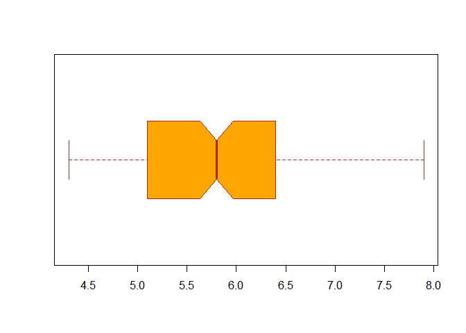<!-- -->

``` r
iris.sepal_length.box <- boxplot(iris$Sepal.Length); iris.sepal_length.box
```

<!-- -->

    ## $stats
    ##      [,1]
    ## [1,]  4.3
    ## [2,]  5.1
    ## [3,]  5.8
    ## [4,]  6.4
    ## [5,]  7.9
    ## 
    ## $n
    ## [1] 150
    ## 
    ## $conf
    ##          [,1]
    ## [1,] 5.632292
    ## [2,] 5.967708
    ## 
    ## $out
    ## numeric(0)
    ## 
    ## $group
    ## numeric(0)
    ## 
    ## $names
    ## [1] "1"

``` r
iris.sepal_length.box$stats
```

    ##      [,1]
    ## [1,]  4.3
    ## [2,]  5.1
    ## [3,]  5.8
    ## [4,]  6.4
    ## [5,]  7.9

``` r
with(iris, boxplot(Sepal.Length, Sepal.Width, Petal.Length, Petal.Width, 
                   col= c("grey", "blue", "red", "orange"),
                   notch = T,
                   names = c("sepal.length", "sepal.width",
                             "petal.length", "petal.width")))
```

<!-- -->

``` r
boxplot(Sepal.Length ~ Species, data = iris,
        col = c("grey", "blue", "orange"),
        horizontal = T,
        border = "brown")
```

<!-- -->

box plot with
ggplot…

``` r
ggplot(iris, aes(x= Species, y = Sepal.Length)) +geom_boxplot()
```

<!-- -->

``` r
ggplot(iris, aes(x= Species, y = Sepal.Length)) + geom_boxplot(notch = T) + coord_flip()
```

<!-- -->

``` r
ggplot(iris, aes(x= Species, y = Sepal.Length)) +
  geom_boxplot(outlier.colour = "red", outlier.shape = 8, outlier.size = 4)
```

<!-- -->

``` r
ggplot(iris, aes(x= Species, y = Sepal.Length)) +
  geom_boxplot(outlier.colour = "red", outlier.shape = 8, outlier.size = 4) +
  scale_x_discrete(limits = c("setosa", "virginica"))
```

    ## Warning: Removed 50 rows containing missing values (stat_boxplot).

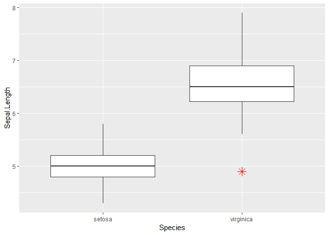<!-- -->

``` r
ggplot(iris, aes(x= Species, y = Sepal.Length)) +
  geom_boxplot(outlier.colour = "red", outlier.shape = 8, outlier.size = 4) +
  scale_x_discrete(limits = c("setosa", "virginica")) + # we can select x elements...
  geom_jitter()  
```

    ## Warning: Removed 50 rows containing missing values (stat_boxplot).

    ## Warning: Removed 50 rows containing missing values (geom_point).

<!-- -->

``` r
ggplot(iris, aes(x= Species, y = Sepal.Length, color = Species)) +
  geom_boxplot(outlier.colour = "red", outlier.shape = 8, outlier.size = 4, fill = "grey") +
  scale_x_discrete(limits = c("setosa", "virginica")) +
  geom_jitter() 
```

    ## Warning: Removed 50 rows containing missing values (stat_boxplot).
    
    ## Warning: Removed 50 rows containing missing values (geom_point).

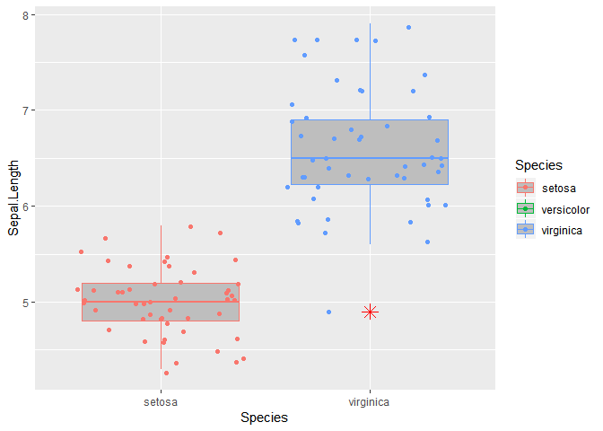<!-- -->

scatter plot…

``` r
plot(iris$Sepal.Length, iris$Sepal.Width,
     main = "Sepal Length vs Width of iris",
     xlab = "Sepal Length", ylab = "Petal Length", pch = 19)
lines(lowess(iris$Sepal.Length, iris$Sepal.Width))
```

<!-- -->

``` r
ggplot(iris, aes(Sepal.Length, Sepal.Width)) + 
  geom_point(aes(color = factor(Species))) +
  stat_smooth(method = "lm") +
  labs(title = "Sepal Length vs Width of iris",
       x = "Sepal Length of iris",
       y = "Sepal Length of iris")
```

<!-- -->

Lm with iris data…

``` r
m <- lm(Sepal.Length ~ ., data=iris)
summary(m) # Speciesversicolor, Speciesvirginica
```

    ## 
    ## Call:
    ## lm(formula = Sepal.Length ~ ., data = iris)
    ## 
    ## Residuals:
    ##      Min       1Q   Median       3Q      Max 
    ## -0.79424 -0.21874  0.00899  0.20255  0.73103 
    ## 
    ## Coefficients:
    ##                   Estimate Std. Error t value Pr(>|t|)    
    ## (Intercept)        2.17127    0.27979   7.760 1.43e-12 ***
    ## Sepal.Width        0.49589    0.08607   5.761 4.87e-08 ***
    ## Petal.Length       0.82924    0.06853  12.101  < 2e-16 ***
    ## Petal.Width       -0.31516    0.15120  -2.084  0.03889 *  
    ## Speciesversicolor -0.72356    0.24017  -3.013  0.00306 ** 
    ## Speciesvirginica  -1.02350    0.33373  -3.067  0.00258 ** 
    ## ---
    ## Signif. codes:  0 '***' 0.001 '**' 0.01 '*' 0.05 '.' 0.1 ' ' 1
    ## 
    ## Residual standard error: 0.3068 on 144 degrees of freedom
    ## Multiple R-squared:  0.8673, Adjusted R-squared:  0.8627 
    ## F-statistic: 188.3 on 5 and 144 DF,  p-value: < 2.2e-16

``` r
anova(m) # Species p-value check...What is the mean?
```

    ## Analysis of Variance Table
    ## 
    ## Response: Sepal.Length
    ##               Df Sum Sq Mean Sq  F value    Pr(>F)    
    ## Sepal.Width    1  1.412   1.412  15.0011 0.0001625 ***
    ## Petal.Length   1 84.427  84.427 896.8059 < 2.2e-16 ***
    ## Petal.Width    1  1.883   1.883  20.0055 1.556e-05 ***
    ## Species        2  0.889   0.444   4.7212 0.0103288 *  
    ## Residuals    144 13.556   0.094                       
    ## ---
    ## Signif. codes:  0 '***' 0.001 '**' 0.01 '*' 0.05 '.' 0.1 ' ' 1

``` r
plot(m, which = 1)
```

<!-- -->

``` r
plot(m, which = 2)
```

<!-- -->

``` r
plot(m, which = 3)
```

<!-- -->

``` r
plot(m, which = 4)
```

<!-- -->

``` r
plot(m, which = 5)
```

<!-- -->

``` r
plot(m, which = 6)
```

<!-- -->

Using dummy variables…

``` r
levels(iris$Species)
```

    ## [1] "setosa"     "versicolor" "virginica"

``` r
library(dummies)
```

    ## dummies-1.5.6 provided by Decision Patterns

``` r
str(iris)
```

    ## 'data.frame':    150 obs. of  5 variables:
    ##  $ Sepal.Length: num  5.1 4.9 4.7 4.6 5 5.4 4.6 5 4.4 4.9 ...
    ##  $ Sepal.Width : num  3.5 3 3.2 3.1 3.6 3.9 3.4 3.4 2.9 3.1 ...
    ##  $ Petal.Length: num  1.4 1.4 1.3 1.5 1.4 1.7 1.4 1.5 1.4 1.5 ...
    ##  $ Petal.Width : num  0.2 0.2 0.2 0.2 0.2 0.4 0.3 0.2 0.2 0.1 ...
    ##  $ Species     : Factor w/ 3 levels "setosa","versicolor",..: 1 1 1 1 1 1 1 1 1 1 ...

``` r
iris_dummy <- dummy.data.frame(iris, names=c('Species'), sep='_')
head(iris_dummy)
```

    ##   Sepal.Length Sepal.Width Petal.Length Petal.Width Species_setosa
    ## 1          5.1         3.5          1.4         0.2              1
    ## 2          4.9         3.0          1.4         0.2              1
    ## 3          4.7         3.2          1.3         0.2              1
    ## 4          4.6         3.1          1.5         0.2              1
    ## 5          5.0         3.6          1.4         0.2              1
    ## 6          5.4         3.9          1.7         0.4              1
    ##   Species_versicolor Species_virginica
    ## 1                  0                 0
    ## 2                  0                 0
    ## 3                  0                 0
    ## 4                  0                 0
    ## 5                  0                 0
    ## 6                  0                 0

``` r
iris %>%
  as_tibble() %>%
  tibble :: rowid_to_column("ID") %>%
  mutate(yesno = 1) %>%
  spread(Species, yesno, fill = 0) -> iris_dummy 

iris_dummy
```

    ## # A tibble: 150 x 8
    ##       ID Sepal.Length Sepal.Width Petal.Length Petal.Width setosa
    ##    <int>        <dbl>       <dbl>        <dbl>       <dbl>  <dbl>
    ##  1     1          5.1         3.5          1.4         0.2      1
    ##  2     2          4.9         3            1.4         0.2      1
    ##  3     3          4.7         3.2          1.3         0.2      1
    ##  4     4          4.6         3.1          1.5         0.2      1
    ##  5     5          5           3.6          1.4         0.2      1
    ##  6     6          5.4         3.9          1.7         0.4      1
    ##  7     7          4.6         3.4          1.4         0.3      1
    ##  8     8          5           3.4          1.5         0.2      1
    ##  9     9          4.4         2.9          1.4         0.2      1
    ## 10    10          4.9         3.1          1.5         0.1      1
    ## # … with 140 more rows, and 2 more variables: versicolor <dbl>,
    ## #   virginica <dbl>

``` r
m <- lm(Sepal.Length ~ ., data=iris_dummy)

summary(m)
```

    ## 
    ## Call:
    ## lm(formula = Sepal.Length ~ ., data = iris_dummy)
    ## 
    ## Residuals:
    ##      Min       1Q   Median       3Q      Max 
    ## -0.79388 -0.21809  0.00901  0.20300  0.73150 
    ## 
    ## Coefficients: (1 not defined because of singularities)
    ##                Estimate Std. Error t value Pr(>|t|)    
    ## (Intercept)   1.153e+00  4.411e-01   2.614  0.00991 ** 
    ## ID           -3.606e-05  1.767e-03  -0.020  0.98374    
    ## Sepal.Width   4.960e-01  8.645e-02   5.737 5.54e-08 ***
    ## Petal.Length  8.290e-01  6.973e-02  11.888  < 2e-16 ***
    ## Petal.Width  -3.150e-01  1.519e-01  -2.075  0.03982 *  
    ## setosa        1.019e+00  3.977e-01   2.562  0.01143 *  
    ## versicolor    2.979e-01  1.546e-01   1.928  0.05589 .  
    ## virginica            NA         NA      NA       NA    
    ## ---
    ## Signif. codes:  0 '***' 0.001 '**' 0.01 '*' 0.05 '.' 0.1 ' ' 1
    ## 
    ## Residual standard error: 0.3079 on 143 degrees of freedom
    ## Multiple R-squared:  0.8673, Adjusted R-squared:  0.8617 
    ## F-statistic: 155.8 on 6 and 143 DF,  p-value: < 2.2e-16

``` r
anova(m)
```

    ## Analysis of Variance Table
    ## 
    ## Response: Sepal.Length
    ##               Df Sum Sq Mean Sq  F value    Pr(>F)    
    ## ID             1 52.476  52.476 553.5445 < 2.2e-16 ***
    ## Sepal.Width    1  3.554   3.554  37.4889 8.401e-09 ***
    ## Petal.Length   1 30.757  30.757 324.4404 < 2.2e-16 ***
    ## Petal.Width    1  1.134   1.134  11.9576 0.0007172 ***
    ## setosa         1  0.339   0.339   3.5744 0.0606983 .  
    ## versicolor     1  0.352   0.352   3.7155 0.0558903 .  
    ## Residuals    143 13.556   0.095                       
    ## ---
    ## Signif. codes:  0 '***' 0.001 '**' 0.01 '*' 0.05 '.' 0.1 ' ' 1

One factor variable…(Success-Fail, binom.test)

barplot() \>\> table(), prop.table() \>\> binom.test

``` r
data("GermanCredit")
glimpse(GermanCredit)
```

    ## Observations: 1,000
    ## Variables: 62
    ## $ Duration                               <int> 6, 48, 12, 42, 24, 36, 24…
    ## $ Amount                                 <int> 1169, 5951, 2096, 7882, 4…
    ## $ InstallmentRatePercentage              <int> 4, 2, 2, 2, 3, 2, 3, 2, 2…
    ## $ ResidenceDuration                      <int> 4, 2, 3, 4, 4, 4, 4, 2, 4…
    ## $ Age                                    <int> 67, 22, 49, 45, 53, 35, 5…
    ## $ NumberExistingCredits                  <int> 2, 1, 1, 1, 2, 1, 1, 1, 1…
    ## $ NumberPeopleMaintenance                <int> 1, 1, 2, 2, 2, 2, 1, 1, 1…
    ## $ Telephone                              <dbl> 0, 1, 1, 1, 1, 0, 1, 0, 1…
    ## $ ForeignWorker                          <dbl> 1, 1, 1, 1, 1, 1, 1, 1, 1…
    ## $ Class                                  <fct> Good, Bad, Good, Good, Ba…
    ## $ CheckingAccountStatus.lt.0             <dbl> 1, 0, 0, 1, 1, 0, 0, 0, 0…
    ## $ CheckingAccountStatus.0.to.200         <dbl> 0, 1, 0, 0, 0, 0, 0, 1, 0…
    ## $ CheckingAccountStatus.gt.200           <dbl> 0, 0, 0, 0, 0, 0, 0, 0, 0…
    ## $ CheckingAccountStatus.none             <dbl> 0, 0, 1, 0, 0, 1, 1, 0, 1…
    ## $ CreditHistory.NoCredit.AllPaid         <dbl> 0, 0, 0, 0, 0, 0, 0, 0, 0…
    ## $ CreditHistory.ThisBank.AllPaid         <dbl> 0, 0, 0, 0, 0, 0, 0, 0, 0…
    ## $ CreditHistory.PaidDuly                 <dbl> 0, 1, 0, 1, 0, 1, 1, 1, 1…
    ## $ CreditHistory.Delay                    <dbl> 0, 0, 0, 0, 1, 0, 0, 0, 0…
    ## $ CreditHistory.Critical                 <dbl> 1, 0, 1, 0, 0, 0, 0, 0, 0…
    ## $ Purpose.NewCar                         <dbl> 0, 0, 0, 0, 1, 0, 0, 0, 0…
    ## $ Purpose.UsedCar                        <dbl> 0, 0, 0, 0, 0, 0, 0, 1, 0…
    ## $ Purpose.Furniture.Equipment            <dbl> 0, 0, 0, 1, 0, 0, 1, 0, 0…
    ## $ Purpose.Radio.Television               <dbl> 1, 1, 0, 0, 0, 0, 0, 0, 1…
    ## $ Purpose.DomesticAppliance              <dbl> 0, 0, 0, 0, 0, 0, 0, 0, 0…
    ## $ Purpose.Repairs                        <dbl> 0, 0, 0, 0, 0, 0, 0, 0, 0…
    ## $ Purpose.Education                      <dbl> 0, 0, 1, 0, 0, 1, 0, 0, 0…
    ## $ Purpose.Vacation                       <dbl> 0, 0, 0, 0, 0, 0, 0, 0, 0…
    ## $ Purpose.Retraining                     <dbl> 0, 0, 0, 0, 0, 0, 0, 0, 0…
    ## $ Purpose.Business                       <dbl> 0, 0, 0, 0, 0, 0, 0, 0, 0…
    ## $ Purpose.Other                          <dbl> 0, 0, 0, 0, 0, 0, 0, 0, 0…
    ## $ SavingsAccountBonds.lt.100             <dbl> 0, 1, 1, 1, 1, 0, 0, 1, 0…
    ## $ SavingsAccountBonds.100.to.500         <dbl> 0, 0, 0, 0, 0, 0, 0, 0, 0…
    ## $ SavingsAccountBonds.500.to.1000        <dbl> 0, 0, 0, 0, 0, 0, 1, 0, 0…
    ## $ SavingsAccountBonds.gt.1000            <dbl> 0, 0, 0, 0, 0, 0, 0, 0, 1…
    ## $ SavingsAccountBonds.Unknown            <dbl> 1, 0, 0, 0, 0, 1, 0, 0, 0…
    ## $ EmploymentDuration.lt.1                <dbl> 0, 0, 0, 0, 0, 0, 0, 0, 0…
    ## $ EmploymentDuration.1.to.4              <dbl> 0, 1, 0, 0, 1, 1, 0, 1, 0…
    ## $ EmploymentDuration.4.to.7              <dbl> 0, 0, 1, 1, 0, 0, 0, 0, 1…
    ## $ EmploymentDuration.gt.7                <dbl> 1, 0, 0, 0, 0, 0, 1, 0, 0…
    ## $ EmploymentDuration.Unemployed          <dbl> 0, 0, 0, 0, 0, 0, 0, 0, 0…
    ## $ Personal.Male.Divorced.Seperated       <dbl> 0, 0, 0, 0, 0, 0, 0, 0, 1…
    ## $ Personal.Female.NotSingle              <dbl> 0, 1, 0, 0, 0, 0, 0, 0, 0…
    ## $ Personal.Male.Single                   <dbl> 1, 0, 1, 1, 1, 1, 1, 1, 0…
    ## $ Personal.Male.Married.Widowed          <dbl> 0, 0, 0, 0, 0, 0, 0, 0, 0…
    ## $ Personal.Female.Single                 <dbl> 0, 0, 0, 0, 0, 0, 0, 0, 0…
    ## $ OtherDebtorsGuarantors.None            <dbl> 1, 1, 1, 0, 1, 1, 1, 1, 1…
    ## $ OtherDebtorsGuarantors.CoApplicant     <dbl> 0, 0, 0, 0, 0, 0, 0, 0, 0…
    ## $ OtherDebtorsGuarantors.Guarantor       <dbl> 0, 0, 0, 1, 0, 0, 0, 0, 0…
    ## $ Property.RealEstate                    <dbl> 1, 1, 1, 0, 0, 0, 0, 0, 1…
    ## $ Property.Insurance                     <dbl> 0, 0, 0, 1, 0, 0, 1, 0, 0…
    ## $ Property.CarOther                      <dbl> 0, 0, 0, 0, 0, 0, 0, 1, 0…
    ## $ Property.Unknown                       <dbl> 0, 0, 0, 0, 1, 1, 0, 0, 0…
    ## $ OtherInstallmentPlans.Bank             <dbl> 0, 0, 0, 0, 0, 0, 0, 0, 0…
    ## $ OtherInstallmentPlans.Stores           <dbl> 0, 0, 0, 0, 0, 0, 0, 0, 0…
    ## $ OtherInstallmentPlans.None             <dbl> 1, 1, 1, 1, 1, 1, 1, 1, 1…
    ## $ Housing.Rent                           <dbl> 0, 0, 0, 0, 0, 0, 0, 1, 0…
    ## $ Housing.Own                            <dbl> 1, 1, 1, 0, 0, 0, 1, 0, 1…
    ## $ Housing.ForFree                        <dbl> 0, 0, 0, 1, 1, 1, 0, 0, 0…
    ## $ Job.UnemployedUnskilled                <dbl> 0, 0, 0, 0, 0, 0, 0, 0, 0…
    ## $ Job.UnskilledResident                  <dbl> 0, 0, 1, 0, 0, 1, 0, 0, 1…
    ## $ Job.SkilledEmployee                    <dbl> 1, 1, 0, 1, 1, 0, 1, 0, 0…
    ## $ Job.Management.SelfEmp.HighlyQualified <dbl> 0, 0, 0, 0, 0, 0, 0, 1, 0…

``` r
class(GermanCredit$Class)
```

    ## [1] "factor"

``` r
x <- GermanCredit$Class
str(x); glimpse(x)
```

    ##  Factor w/ 2 levels "Bad","Good": 2 1 2 2 1 2 2 2 2 1 ...

    ##  Factor w/ 2 levels "Bad","Good": 2 1 2 2 1 2 2 2 2 1 ...

Convert ‘Bad’, ‘Good’ factor var into 0, 1 numeric data…

factor() ==\>
as.numeric()…

``` r
x <- as.numeric(factor(x, levels = c('Bad', 'Good'), labels = c(0, 1))) - 1
class(x)
```

    ## [1] "numeric"

``` r
x[1:10]
```

    ##  [1] 1 0 1 1 0 1 1 1 1 0

Instead ifelse()…

``` r
x <- GermanCredit$Class
x <- ifelse(GermanCredit$Class == "Bad", 0, 1)
class(x)
```

    ## [1] "numeric"

``` r
x[1:10]
```

    ##  [1] 1 0 1 1 0 1 1 1 1 0

Response var(y) ~ Explainary var(x)

continuous var x, continuous var y: lm model

Scatter Plot -\> Cor() -\> LM -\> LOESS…

``` r
head(mpg)
```

    ## # A tibble: 6 x 11
    ##   manufacturer model displ  year   cyl trans  drv     cty   hwy fl    class
    ##   <chr>        <chr> <dbl> <int> <int> <chr>  <chr> <int> <int> <chr> <chr>
    ## 1 audi         a4      1.8  1999     4 auto(… f        18    29 p     comp…
    ## 2 audi         a4      1.8  1999     4 manua… f        21    29 p     comp…
    ## 3 audi         a4      2    2008     4 manua… f        20    31 p     comp…
    ## 4 audi         a4      2    2008     4 auto(… f        21    30 p     comp…
    ## 5 audi         a4      2.8  1999     6 auto(… f        16    26 p     comp…
    ## 6 audi         a4      2.8  1999     6 manua… f        18    26 p     comp…

``` r
plot(hwy ~ cty, data=mpg)
```

<!-- -->

``` r
with(mpg, cor(cty, hwy))
```

    ## [1] 0.9559159

``` r
with(mpg, cor(cty, hwy, method='spearman')) # spearman : many outliers...
```

    ## [1] 0.9542104

``` r
model <- lm(hwy ~ cty, data=mpg)
summary(model) # t-value, p-value, adjusted R's means...
```

    ## 
    ## Call:
    ## lm(formula = hwy ~ cty, data = mpg)
    ## 
    ## Residuals:
    ##     Min      1Q  Median      3Q     Max 
    ## -5.3408 -1.2790  0.0214  1.0338  4.0461 
    ## 
    ## Coefficients:
    ##             Estimate Std. Error t value Pr(>|t|)    
    ## (Intercept)  0.89204    0.46895   1.902   0.0584 .  
    ## cty          1.33746    0.02697  49.585   <2e-16 ***
    ## ---
    ## Signif. codes:  0 '***' 0.001 '**' 0.01 '*' 0.05 '.' 0.1 ' ' 1
    ## 
    ## Residual standard error: 1.752 on 232 degrees of freedom
    ## Multiple R-squared:  0.9138, Adjusted R-squared:  0.9134 
    ## F-statistic:  2459 on 1 and 232 DF,  p-value: < 2.2e-16

``` r
par(mfrow=c(2, 2))
plot(model) # 4가지 그래프 해석
```

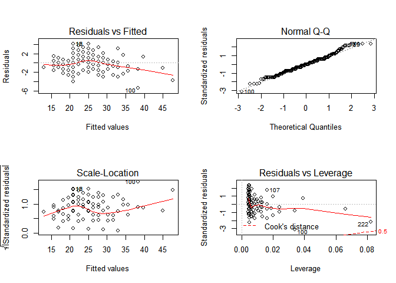<!-- -->

``` r
par(mfrow=c(1,1))
```

가정 진단 :: 선형, 잔차의 분포 독립, 잔차의 분포 동일, 잔차의 정규분포 등
확인

``` r
plot(model, which = 1)
```

<!-- -->

Residuals vs Fitted는 X 축에 선형 회귀로 예측된 Y 값, Y 축에는 잔차를 보여준다. 선형 회귀에서 오차는
평균이 0이고 분산이 일정한 정규 분포를 가정하였으므로, 예측된 Y 값과 무관하게 잔차의 평균은 0이고 분산은 일정해야
한다. 따라서 이 그래프에서는 기울기 0인 직선이 관측되는 것이
이상적이다.

``` r
plot(model, which = 2)
```

<!-- -->

``` r
plot(model, which = 3)
```

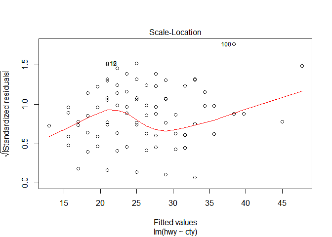<!-- -->

Scale-Location은 X 축에 선형 회귀로 예측된 Y 값, Y 축에 표준화 잔차Standardized Residual3 를
보여준다. 이 경우도 기울기가 0인 직선이 이상적이다. 만약 특정 위치에서 0에서 멀리 떨어진 값이 관찰된다면 해당 점에 대해서
표준화 잔차가 크다, 즉, 회귀 직선이 해당 Y를 잘 적합하지 못한다는 의미다. 이런 점들은 이상치outlier일 가능성이
있다.

``` r
plot(model, which = 4)
```

<!-- -->

``` r
plot(model, which = 5)
```

<!-- -->

Residuals vs Leverage는 X 축에 레버리지Leverage, Y 축에 표준화 잔차를 보여준다. 레버리지는 설명
변수가 얼마나 극단에 치우쳐 있는지를 뜻한다. 예를 들어, 다른 데이터의 X 값은 모두 1 ~ 10 사이의 값인데 특정
데이터만 99999 값이라면 해당 데이터의 레버리지는 큰 값이 된다. 이런 데이터는 입력이 잘못되었거나, 해당 범위의 설명
변숫값을 가지는 데이터를 보충해야 하는 작업 등이 필요하므로 유심히 살펴봐야 한다.

네 번째 차트의 우측 상단과 우측 하단에는 선으로 쿡의 거리Cook’s Distance가 표시되어 있다. 쿡의 거리는 회귀 직선의
모양(기울기나 절편 등)에 크게 영향을 끼치는 점들을 찾는 방법이다. 쿡의 거리는 레버리지와 잔차에 비례하므로 두 값이 큰 우측
상단과 우측 하단에 쿡의 거리가 큰 값들이 위치하게
된다.

``` r
plot(model, which = 6)
```

<!-- -->

``` r
yhat_model <-predict(model, newdata = data.frame(cty=c(10,20,20))); yhat_model # newdata as data.frame() in predict()
```

    ##        1        2        3 
    ## 14.26660 27.64115 27.64115

``` r
plot(mpg$hwy, mpg$cty)
abline(coef(model)) 
```

<!-- -->

With cars data…

``` r
head(cars)
```

    ##   speed dist
    ## 1     4    2
    ## 2     4   10
    ## 3     7    4
    ## 4     7   22
    ## 5     8   16
    ## 6     9   10

``` r
plot(cars$speed, cars$dist)
abline(coef(model))
```

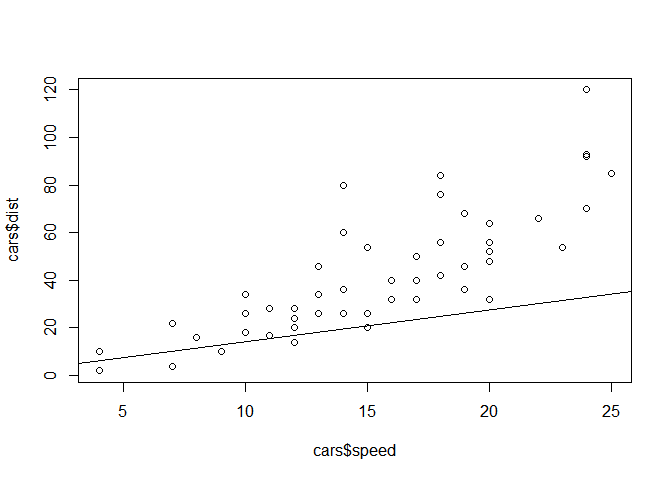<!-- -->

LOESS…

``` r
str(mpg); unique(mpg$hwy)
```

    ## Classes 'tbl_df', 'tbl' and 'data.frame':    234 obs. of  11 variables:
    ##  $ manufacturer: chr  "audi" "audi" "audi" "audi" ...
    ##  $ model       : chr  "a4" "a4" "a4" "a4" ...
    ##  $ displ       : num  1.8 1.8 2 2 2.8 2.8 3.1 1.8 1.8 2 ...
    ##  $ year        : int  1999 1999 2008 2008 1999 1999 2008 1999 1999 2008 ...
    ##  $ cyl         : int  4 4 4 4 6 6 6 4 4 4 ...
    ##  $ trans       : chr  "auto(l5)" "manual(m5)" "manual(m6)" "auto(av)" ...
    ##  $ drv         : chr  "f" "f" "f" "f" ...
    ##  $ cty         : int  18 21 20 21 16 18 18 18 16 20 ...
    ##  $ hwy         : int  29 29 31 30 26 26 27 26 25 28 ...
    ##  $ fl          : chr  "p" "p" "p" "p" ...
    ##  $ class       : chr  "compact" "compact" "compact" "compact" ...

    ##  [1] 29 31 30 26 27 25 28 24 23 20 15 17 19 14 22 21 18 12 16 33 32 34 36
    ## [24] 35 37 44 41

``` r
with(mpg, plot(displ, hwy))
```

<!-- -->

``` r
model <- loess(hwy ~ displ, data=mpg)
plot(model)
```

<!-- -->

``` r
mpg %>% ggplot(aes(displ, hwy)) + geom_point() + geom_smooth()
```

    ## `geom_smooth()` using method = 'loess' and formula 'y ~ x'

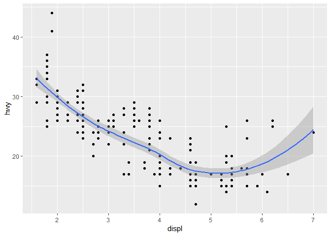<!-- -->

Factor var : x, Continuous var y: ANOVA…

수면제 종류에 따른 수면량 증가, 차종에 따라 연비 차이, 혈압약과 혈압 감소량

boxplot() -\> lm(y(연속형 변수) ~ x(범주형 변수)) -\> plot.lm()
잔차분포

``` r
mpg %>% ggplot(aes(class, hwy)) + geom_boxplot()
```

<!-- -->

``` r
m <- lm(hwy ~ class, data=mpg)
summary(m) # 다른 집단과 유의하게 다른 평균 연비
```

    ## 
    ## Call:
    ## lm(formula = hwy ~ class, data = mpg)
    ## 
    ## Residuals:
    ##     Min      1Q  Median      3Q     Max 
    ## -8.1429 -1.8788 -0.2927  1.1803 15.8571 
    ## 
    ## Coefficients:
    ##                 Estimate Std. Error t value Pr(>|t|)    
    ## (Intercept)       24.800      1.507  16.454  < 2e-16 ***
    ## classcompact       3.498      1.585   2.206   0.0284 *  
    ## classmidsize       2.493      1.596   1.561   0.1198    
    ## classminivan      -2.436      1.818  -1.340   0.1815    
    ## classpickup       -7.921      1.617  -4.898 1.84e-06 ***
    ## classsubcompact    3.343      1.611   2.075   0.0391 *  
    ## classsuv          -6.671      1.567  -4.258 3.03e-05 ***
    ## ---
    ## Signif. codes:  0 '***' 0.001 '**' 0.01 '*' 0.05 '.' 0.1 ' ' 1
    ## 
    ## Residual standard error: 3.37 on 227 degrees of freedom
    ## Multiple R-squared:  0.6879, Adjusted R-squared:  0.6797 
    ## F-statistic: 83.39 on 6 and 227 DF,  p-value: < 2.2e-16

연비의 총 변동량 중 차종으로 설명되는 비율, 모형의
    적합도

``` r
yhat_m <- predict(m, newdata=data.frame(class='pickup')); yhat_m[1:10]
```

    ##        1     <NA>     <NA>     <NA>     <NA>     <NA>     <NA>     <NA> 
    ## 16.87879       NA       NA       NA       NA       NA       NA       NA 
    ##     <NA>     <NA> 
    ##       NA       NA

가정진단 : 잔차의 분포 독립, 잔차의 분포 동일 (잔차는 정규분포) 분포 독립성과 이상치 유무 연속형 변수 x, 범주형 변수
y(예 : 성공, 실패) :: 온도와 O링의 실패 여부 등—- 산점도, 병렬상자 -\> glm() 로지스틱 & binomial
-\> plot() 잔차분포, 모형 가정
확인

``` r
chall <- read_table("data/o-ring-erosion-only.data.txt", col_names = FALSE)
```

    ## Parsed with column specification:
    ## cols(
    ##   X1 = col_double(),
    ##   X2 = col_double(),
    ##   X3 = col_double(),
    ##   X4 = col_double(),
    ##   X5 = col_double()
    ## )

``` r
head(chall)
```

    ## # A tibble: 6 x 5
    ##      X1    X2    X3    X4    X5
    ##   <dbl> <dbl> <dbl> <dbl> <dbl>
    ## 1     6     0    66    50     1
    ## 2     6     1    70    50     2
    ## 3     6     0    69    50     3
    ## 4     6     0    68    50     4
    ## 5     6     0    67    50     5
    ## 6     6     0    72    50     6

``` r
colnames(chall) <- c('o_ring_ct', 'distress_ct', 'temperature', 'pressure', 'flight_order')
glimpse(chall); head(chall)
```

    ## Observations: 23
    ## Variables: 5
    ## $ o_ring_ct    <dbl> 6, 6, 6, 6, 6, 6, 6, 6, 6, 6, 6, 6, 6, 6, 6, 6, 6, …
    ## $ distress_ct  <dbl> 0, 1, 0, 0, 0, 0, 0, 0, 1, 1, 1, 0, 0, 2, 0, 0, 0, …
    ## $ temperature  <dbl> 66, 70, 69, 68, 67, 72, 73, 70, 57, 63, 70, 78, 67,…
    ## $ pressure     <dbl> 50, 50, 50, 50, 50, 50, 100, 100, 200, 200, 200, 20…
    ## $ flight_order <dbl> 1, 2, 3, 4, 5, 6, 7, 8, 9, 10, 11, 12, 13, 14, 15, …

    ## # A tibble: 6 x 5
    ##   o_ring_ct distress_ct temperature pressure flight_order
    ##       <dbl>       <dbl>       <dbl>    <dbl>        <dbl>
    ## 1         6           0          66       50            1
    ## 2         6           1          70       50            2
    ## 3         6           0          69       50            3
    ## 4         6           0          68       50            4
    ## 5         6           0          67       50            5
    ## 6         6           0          72       50            6

``` r
chall %>% ggplot(aes(temperature, distress_ct)) + geom_point()
```

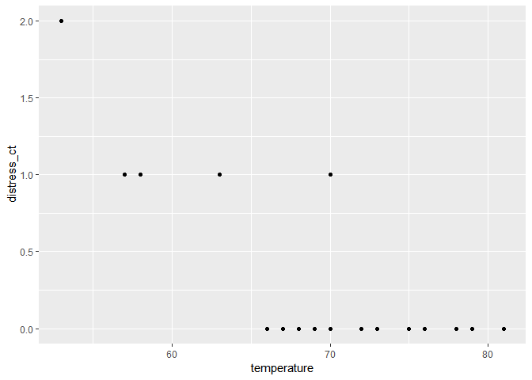<!-- -->

``` r
chall %>% ggplot(aes(factor(distress_ct), temperature)) + geom_boxplot()
```

<!-- -->

반응변수가 2차원 매트릭스(성공회수, 실패횟수)

``` r
model <- glm(cbind(distress_ct, o_ring_ct - distress_ct) ~ temperature, 
             data = chall, family='binomial') # 로지스틱 회귀
summary(model) # temperature의 효과 :: 온도 1도 상승할 때 로그 오즈비가 0.179 감소??
```

    ## 
    ## Call:
    ## glm(formula = cbind(distress_ct, o_ring_ct - distress_ct) ~ temperature, 
    ##     family = "binomial", data = chall)
    ## 
    ## Deviance Residuals: 
    ##     Min       1Q   Median       3Q      Max  
    ## -0.7526  -0.5533  -0.3388  -0.1901   1.5388  
    ## 
    ## Coefficients:
    ##             Estimate Std. Error z value Pr(>|z|)   
    ## (Intercept)  8.81692    3.60697   2.444  0.01451 * 
    ## temperature -0.17949    0.05822  -3.083  0.00205 **
    ## ---
    ## Signif. codes:  0 '***' 0.001 '**' 0.01 '*' 0.05 '.' 0.1 ' ' 1
    ## 
    ## (Dispersion parameter for binomial family taken to be 1)
    ## 
    ##     Null deviance: 20.706  on 22  degrees of freedom
    ## Residual deviance:  9.527  on 21  degrees of freedom
    ## AIC: 24.865
    ## 
    ## Number of Fisher Scoring iterations: 6

모형의 적합도 :: degree F가 1 줄었을때 deviance 충분히 감소 :: 적합

예측 ::
확률값

``` r
pred <- predict(model, data.frame(temperature=30), type='response'); pred[1:10]
```

    ##         1      <NA>      <NA>      <NA>      <NA>      <NA>      <NA> 
    ## 0.9686946        NA        NA        NA        NA        NA        NA 
    ##      <NA>      <NA>      <NA> 
    ##        NA        NA        NA

변수의 수가 많을 경우

1)  지도학습 :: 반응변수 예측(반응변수가 연속형변수 :: 회귀, 반응변수가 범주형변수 :: 분류)
2)  비지도학습 :: 변수들 간 / 관측치 간의 관계 군집 :: 관측치들 변수들간의 유사도로 그룹화 차원감소 :: 관측치들 간의
    유사도를 이용하여 변수의 수를 감소 분류 : 주어진 입력변수로 범주형 반응변수 예측(성공/실패)

신용카드 사용자 -\> 채무불이행 확률

투자할 회사 -\> 투자 성공 확률

웹 방문자, 사이트, 방문시간 -\> 광고 클릭 확률 선형회귀 (연속형, 수치형 반응변수 예측)—-

부동산 가격 예측 : 반응변수 medv

medv :: Median value of owner-occupied homes in $1000’s

``` r
read.table('./data/housing_data.csv') -> boston
names(boston) <- c('crim', 'zn', 'indus', 'chas', 'nox', 'rm', 'age', 'dis', 'rad',  
                   'tax', 'ptratio', 'black', 'lstat', 'medv')
glimpse(boston)
```

    ## Observations: 506
    ## Variables: 14
    ## $ crim    <dbl> 0.00632, 0.02731, 0.02729, 0.03237, 0.06905, 0.02985, 0.…
    ## $ zn      <dbl> 18.0, 0.0, 0.0, 0.0, 0.0, 0.0, 12.5, 12.5, 12.5, 12.5, 1…
    ## $ indus   <dbl> 2.31, 7.07, 7.07, 2.18, 2.18, 2.18, 7.87, 7.87, 7.87, 7.…
    ## $ chas    <int> 0, 0, 0, 0, 0, 0, 0, 0, 0, 0, 0, 0, 0, 0, 0, 0, 0, 0, 0,…
    ## $ nox     <dbl> 0.538, 0.469, 0.469, 0.458, 0.458, 0.458, 0.524, 0.524, …
    ## $ rm      <dbl> 6.575, 6.421, 7.185, 6.998, 7.147, 6.430, 6.012, 6.172, …
    ## $ age     <dbl> 65.2, 78.9, 61.1, 45.8, 54.2, 58.7, 66.6, 96.1, 100.0, 8…
    ## $ dis     <dbl> 4.0900, 4.9671, 4.9671, 6.0622, 6.0622, 6.0622, 5.5605, …
    ## $ rad     <int> 1, 2, 2, 3, 3, 3, 5, 5, 5, 5, 5, 5, 5, 4, 4, 4, 4, 4, 4,…
    ## $ tax     <dbl> 296, 242, 242, 222, 222, 222, 311, 311, 311, 311, 311, 3…
    ## $ ptratio <dbl> 15.3, 17.8, 17.8, 18.7, 18.7, 18.7, 15.2, 15.2, 15.2, 15…
    ## $ black   <dbl> 396.90, 396.90, 392.83, 394.63, 396.90, 394.12, 395.60, …
    ## $ lstat   <dbl> 4.98, 9.14, 4.03, 2.94, 5.33, 5.21, 12.43, 19.15, 29.93,…
    ## $ medv    <dbl> 24.0, 21.6, 34.7, 33.4, 36.2, 28.7, 22.9, 27.1, 16.5, 18…

``` r
set.seed(2018)
boston %>% sample_n(100) -> training
model <- lm(medv~., data=training)
summary(model) # 연관성이 높은 변수 :: lstat, rm
```

    ## 
    ## Call:
    ## lm(formula = medv ~ ., data = training)
    ## 
    ## Residuals:
    ##    Min     1Q Median     3Q    Max 
    ## -6.819 -2.243 -0.178  1.811 11.593 
    ## 
    ## Coefficients:
    ##               Estimate Std. Error t value Pr(>|t|)    
    ## (Intercept)  3.014e+01  9.038e+00   3.335  0.00126 ** 
    ## crim        -1.326e-01  8.043e-02  -1.648  0.10293    
    ## zn           5.400e-02  2.778e-02   1.944  0.05521 .  
    ## indus        9.344e-04  1.222e-01   0.008  0.99392    
    ## chas         1.599e+00  1.454e+00   1.100  0.27456    
    ## nox         -1.531e+01  6.871e+00  -2.228  0.02847 *  
    ## rm           4.107e+00  8.298e-01   4.949 3.67e-06 ***
    ## age          4.216e-02  2.292e-02   1.840  0.06929 .  
    ## dis         -1.021e+00  3.426e-01  -2.979  0.00375 ** 
    ## rad          4.206e-01  1.459e-01   2.883  0.00498 ** 
    ## tax         -1.813e-02  8.393e-03  -2.160  0.03357 *  
    ## ptratio     -8.383e-01  2.474e-01  -3.388  0.00106 ** 
    ## black        3.572e-03  4.739e-03   0.754  0.45308    
    ## lstat       -5.467e-01  9.720e-02  -5.624 2.28e-07 ***
    ## ---
    ## Signif. codes:  0 '***' 0.001 '**' 0.01 '*' 0.05 '.' 0.1 ' ' 1
    ## 
    ## Residual standard error: 3.732 on 86 degrees of freedom
    ## Multiple R-squared:  0.8195, Adjusted R-squared:  0.7922 
    ## F-statistic: 30.04 on 13 and 86 DF,  p-value: < 2.2e-16

lstat :: % lower status of the population

rm :: average number of rooms per
    dwelling

``` r
coef(model)
```

    ##   (Intercept)          crim            zn         indus          chas 
    ##  3.013755e+01 -1.325704e-01  5.399601e-02  9.344001e-04  1.599353e+00 
    ##           nox            rm           age           dis           rad 
    ## -1.531175e+01  4.106510e+00  4.215876e-02 -1.020776e+00  4.205842e-01 
    ##           tax       ptratio         black         lstat 
    ## -1.812666e-02 -8.383457e-01  3.572057e-03 -5.466580e-01

``` r
fitted(model)[1:4] # fitted value (171, 235, 31, 100 번째 데이터의 fitted value)
```

    ##        1        2        3        4 
    ## 21.99984 30.71507 12.30849 31.62034

``` r
boston$medv[c(171, 235, 31, 100)] # observed value
```

    ## [1] 17.4 29.0 12.7 33.2

``` r
residuals(model)[1:4] # observed value - fitted value
```

    ##          1          2          3          4 
    ## -4.5998368 -1.7150698  0.3915147  1.5796574

``` r
confint(model) # 신뢰구간 (정확한 의미 파악 필요)
```

    ##                     2.5 %      97.5 %
    ## (Intercept)  12.171283424 48.10382156
    ## crim         -0.292453076  0.02731231
    ## zn           -0.001230231  0.10922226
    ## indus        -0.242065760  0.24393456
    ## chas         -1.291991602  4.49069676
    ## nox         -28.971521821 -1.65197114
    ## rm            2.456995952  5.75602486
    ## age          -0.003400917  0.08771844
    ## dis          -1.701864282 -0.33968746
    ## rad           0.130526834  0.71064163
    ## tax          -0.034810644 -0.00144268
    ## ptratio      -1.330230982 -0.34646047
    ## black        -0.005849404  0.01299352
    ## lstat        -0.739883631 -0.35343230

``` r
par(mfrow=c(2, 2))
plot(model)
```

<!-- -->

``` r
par(mfrow=c(1, 1))
```

with ad\_result.csv data—-

``` r
ad_result <- read_csv("data/ad_result.csv")
```

    ## Parsed with column specification:
    ## cols(
    ##   month = col_character(),
    ##   tvcm = col_double(),
    ##   magazine = col_double(),
    ##   install = col_double()
    ## )

``` r
m <- lm(install ~., data = ad_result[,c('install', 'tvcm', 'magazine')])
summary(m) # 유의미한 변수는?
```

    ## 
    ## Call:
    ## lm(formula = install ~ ., data = ad_result[, c("install", "tvcm", 
    ##     "magazine")])
    ## 
    ## Residuals:
    ##      Min       1Q   Median       3Q      Max 
    ## -1406.87  -984.49   -12.11   432.82  1985.84 
    ## 
    ## Coefficients:
    ##              Estimate Std. Error t value Pr(>|t|)   
    ## (Intercept) 1.882e+02  7.719e+03   0.024  0.98123   
    ## tvcm        1.361e-01  5.174e-02   2.630  0.03390 * 
    ## magazine    7.250e-01  1.693e-01   4.283  0.00364 **
    ## ---
    ## Signif. codes:  0 '***' 0.001 '**' 0.01 '*' 0.05 '.' 0.1 ' ' 1
    ## 
    ## Residual standard error: 1387 on 7 degrees of freedom
    ## Multiple R-squared:  0.9379, Adjusted R-squared:  0.9202 
    ## F-statistic: 52.86 on 2 and 7 DF,  p-value: 5.967e-05

``` r
data <- read.csv('./data/ad_result.csv'); head(data)
```

    ##    month  tvcm magazine install
    ## 1 Jan-13 63580    59550   53948
    ## 2 Feb-13 81760    60690   57300
    ## 3 Mar-13 68530    58620   52057
    ## 4 Apr-13 52710    52470   44044
    ## 5 May-13 64730    63650   54063
    ## 6 Jun-13 76820    65550   58097

``` r
data %>%
  select_if(is.numeric) %>%
  lm(install ~ ., .) -> m; summary(m)
```

    ## 
    ## Call:
    ## lm(formula = install ~ ., data = .)
    ## 
    ## Residuals:
    ##      Min       1Q   Median       3Q      Max 
    ## -1406.87  -984.49   -12.11   432.82  1985.84 
    ## 
    ## Coefficients:
    ##              Estimate Std. Error t value Pr(>|t|)   
    ## (Intercept) 1.882e+02  7.719e+03   0.024  0.98123   
    ## tvcm        1.361e-01  5.174e-02   2.630  0.03390 * 
    ## magazine    7.250e-01  1.693e-01   4.283  0.00364 **
    ## ---
    ## Signif. codes:  0 '***' 0.001 '**' 0.01 '*' 0.05 '.' 0.1 ' ' 1
    ## 
    ## Residual standard error: 1387 on 7 degrees of freedom
    ## Multiple R-squared:  0.9379, Adjusted R-squared:  0.9202 
    ## F-statistic: 52.86 on 2 and 7 DF,  p-value: 5.967e-05

``` r
coef(m)[1:10]
```

    ## (Intercept)        tvcm    magazine        <NA>        <NA>        <NA> 
    ## 188.1742748   0.1360921   0.7249809          NA          NA          NA 
    ##        <NA>        <NA>        <NA>        <NA> 
    ##          NA          NA          NA          NA

``` r
fitted(m)[1:10]
```

    ##        1        2        3        4        5        6        7        8 
    ## 52013.53 55314.16 52012.95 45401.34 55142.45 58165.27 48106.60 53227.89 
    ##        9       10 
    ## 49375.95 61369.87

``` r
residuals(m)[1:10]
```

    ##          1          2          3          4          5          6 
    ##  1934.4746  1985.8414    44.0508 -1357.3391 -1079.4531   -68.2707 
    ##          7          8          9         10 
    ##  -699.5959   105.1085   542.0546 -1406.8711

``` r
confint(m)[1:10]
```

    ##  [1] -1.806467e+04  1.373939e-02  3.247341e-01  1.844102e+04  2.584449e-01
    ##  [6]  1.125228e+00            NA            NA            NA            NA

with cars data—-

``` r
head(cars)
```

    ##   speed dist
    ## 1     4    2
    ## 2     4   10
    ## 3     7    4
    ## 4     7   22
    ## 5     8   16
    ## 6     9   10

``` r
m <- lm(dist ~ speed, data=cars)
predict(m, newdata = data.frame(speed=3)) # 예측
```

    ##         1 
    ## -5.781869

``` r
predict(m, newdata = data.frame(speed=3), interval = 'confidence') # 평균적인 차량의 신뢰구간
```

    ##         fit       lwr      upr
    ## 1 -5.781869 -17.02659 5.462853

``` r
predict(m, newdata = data.frame(speed=3), interval = 'prediction') # 특정속도 차량 한 대(오차)
```

    ##         fit       lwr      upr
    ## 1 -5.781869 -38.68565 27.12192

다중선형회귀—- Godd feature subsets contain features highly correlated with
the classification, yet uncorrelaetd to each other. 변수선택하기—-
전진선택법(forward selection), 후진소거법(backward selection),
단계선택법(step selection)…

``` r
m <- lm(medv ~., data = boston)
m2 <- step(m, direction = 'both')
```

    ## Start:  AIC=1589.64
    ## medv ~ crim + zn + indus + chas + nox + rm + age + dis + rad + 
    ##     tax + ptratio + black + lstat
    ## 
    ##           Df Sum of Sq   RSS    AIC
    ## - age      1      0.06 11079 1587.7
    ## - indus    1      2.52 11081 1587.8
    ## <none>                 11079 1589.6
    ## - chas     1    218.97 11298 1597.5
    ## - tax      1    242.26 11321 1598.6
    ## - crim     1    243.22 11322 1598.6
    ## - zn       1    257.49 11336 1599.3
    ## - black    1    270.63 11349 1599.8
    ## - rad      1    479.15 11558 1609.1
    ## - nox      1    487.16 11566 1609.4
    ## - ptratio  1   1194.23 12273 1639.4
    ## - dis      1   1232.41 12311 1641.0
    ## - rm       1   1871.32 12950 1666.6
    ## - lstat    1   2410.84 13490 1687.3
    ## 
    ## Step:  AIC=1587.65
    ## medv ~ crim + zn + indus + chas + nox + rm + dis + rad + tax + 
    ##     ptratio + black + lstat
    ## 
    ##           Df Sum of Sq   RSS    AIC
    ## - indus    1      2.52 11081 1585.8
    ## <none>                 11079 1587.7
    ## + age      1      0.06 11079 1589.6
    ## - chas     1    219.91 11299 1595.6
    ## - tax      1    242.24 11321 1596.6
    ## - crim     1    243.20 11322 1596.6
    ## - zn       1    260.32 11339 1597.4
    ## - black    1    272.26 11351 1597.9
    ## - rad      1    481.09 11560 1607.2
    ## - nox      1    520.87 11600 1608.9
    ## - ptratio  1   1200.23 12279 1637.7
    ## - dis      1   1352.26 12431 1643.9
    ## - rm       1   1959.55 13038 1668.0
    ## - lstat    1   2718.88 13798 1696.7
    ## 
    ## Step:  AIC=1585.76
    ## medv ~ crim + zn + chas + nox + rm + dis + rad + tax + ptratio + 
    ##     black + lstat
    ## 
    ##           Df Sum of Sq   RSS    AIC
    ## <none>                 11081 1585.8
    ## + indus    1      2.52 11079 1587.7
    ## + age      1      0.06 11081 1587.8
    ## - chas     1    227.21 11309 1594.0
    ## - crim     1    245.37 11327 1594.8
    ## - zn       1    257.82 11339 1595.4
    ## - black    1    270.82 11352 1596.0
    ## - tax      1    273.62 11355 1596.1
    ## - rad      1    500.92 11582 1606.1
    ## - nox      1    541.91 11623 1607.9
    ## - ptratio  1   1206.45 12288 1636.0
    ## - dis      1   1448.94 12530 1645.9
    ## - rm       1   1963.66 13045 1666.3
    ## - lstat    1   2723.48 13805 1695.0

``` r
formula(m2)
```

    ## medv ~ crim + zn + chas + nox + rm + dis + rad + tax + ptratio + 
    ##     black + lstat

predict(m2, newdata=…)

``` r
bio <- read.csv('./data/bio.csv')
glimpse(bio)
```

    ## Observations: 25
    ## Variables: 8
    ## $ age    <int> 7, 7, 8, 8, 8, 9, 11, 12, 12, 13, 13, 14, 14, 15, 16, 17,…
    ## $ weight <dbl> 13.1, 12.9, 14.1, 16.2, 21.5, 17.5, 30.7, 28.4, 25.1, 31.…
    ## $ bmp    <int> 68, 65, 64, 67, 93, 68, 89, 69, 67, 68, 89, 90, 93, 93, 6…
    ## $ fev    <int> 32, 19, 22, 41, 52, 44, 28, 18, 24, 23, 39, 26, 45, 45, 3…
    ## $ rv     <int> 258, 449, 441, 234, 202, 308, 305, 369, 312, 413, 206, 25…
    ## $ frc    <int> 183, 245, 268, 146, 131, 155, 179, 198, 194, 225, 142, 19…
    ## $ tlc    <int> 137, 134, 147, 124, 104, 118, 119, 103, 128, 136, 95, 121…
    ## $ pemax  <int> 95, 85, 100, 85, 95, 80, 65, 110, 70, 95, 110, 90, 100, 8…

``` r
str(bio)
```

    ## 'data.frame':    25 obs. of  8 variables:
    ##  $ age   : int  7 7 8 8 8 9 11 12 12 13 ...
    ##  $ weight: num  13.1 12.9 14.1 16.2 21.5 17.5 30.7 28.4 25.1 31.5 ...
    ##  $ bmp   : int  68 65 64 67 93 68 89 69 67 68 ...
    ##  $ fev   : int  32 19 22 41 52 44 28 18 24 23 ...
    ##  $ rv    : int  258 449 441 234 202 308 305 369 312 413 ...
    ##  $ frc   : int  183 245 268 146 131 155 179 198 194 225 ...
    ##  $ tlc   : int  137 134 147 124 104 118 119 103 128 136 ...
    ##  $ pemax : int  95 85 100 85 95 80 65 110 70 95 ...

전진소거법

``` r
step(lm(pemax~1, bio), 
     scope=list(lower=~1, upper=~age+weight+bmp+rv+frc+tlc), 
     direction = 'forward') # 변수를 weight와 bmp로 선택
```

    ## Start:  AIC=176.46
    ## pemax ~ 1
    ## 
    ##          Df Sum of Sq   RSS    AIC
    ## + weight  1   10827.2 16006 165.54
    ## + age     1   10098.5 16734 166.66
    ## + frc     1    4670.6 22162 173.68
    ## + rv      1    2671.8 24161 175.84
    ## <none>                26833 176.46
    ## + bmp     1    1413.5 25419 177.11
    ## + tlc     1     885.1 25948 177.62
    ## 
    ## Step:  AIC=165.55
    ## pemax ~ weight
    ## 
    ##        Df Sum of Sq   RSS    AIC
    ## + bmp   1   1914.94 14090 164.36
    ## <none>              16006 165.54
    ## + rv    1    274.55 15731 167.11
    ## + tlc   1    230.64 15775 167.18
    ## + age   1    216.51 15789 167.21
    ## + frc   1     27.34 15978 167.50
    ## 
    ## Step:  AIC=164.36
    ## pemax ~ weight + bmp
    ## 
    ##        Df Sum of Sq   RSS    AIC
    ## <none>              14090 164.36
    ## + age   1    681.28 13409 165.12
    ## + tlc   1     96.61 13994 166.19
    ## + frc   1     44.62 14046 166.28
    ## + rv    1     18.84 14072 166.33

    ## 
    ## Call:
    ## lm(formula = pemax ~ weight + bmp, data = bio)
    ## 
    ## Coefficients:
    ## (Intercept)       weight          bmp  
    ##     124.830        1.640       -1.005

후진소거법

``` r
step(lm(pemax~age+weight+bmp+rv+frc+tlc, bio), 
     direction = 'backward')
```

    ## Start:  AIC=168.53
    ## pemax ~ age + weight + bmp + rv + frc + tlc
    ## 
    ##          Df Sum of Sq   RSS    AIC
    ## - tlc     1    221.53 12310 166.98
    ## - age     1    858.27 12947 168.24
    ## - rv      1    918.75 13008 168.36
    ## <none>                12089 168.53
    ## - bmp     1   1241.20 13330 168.97
    ## - frc     1   1306.39 13395 169.09
    ## - weight  1   2960.06 15049 172.00
    ## 
    ## Step:  AIC=166.98
    ## pemax ~ age + weight + bmp + rv + frc
    ## 
    ##          Df Sum of Sq   RSS    AIC
    ## - rv      1     759.2 13070 166.48
    ## <none>                12310 166.98
    ## - frc     1    1090.7 13401 167.10
    ## - age     1    1263.1 13573 167.43
    ## - bmp     1    1984.6 14295 168.72
    ## - weight  1    3967.1 16277 171.97
    ## 
    ## Step:  AIC=166.48
    ## pemax ~ age + weight + bmp + frc
    ## 
    ##          Df Sum of Sq   RSS    AIC
    ## - frc     1     339.8 13409 165.12
    ## - age     1     976.4 14046 166.28
    ## <none>                13070 166.48
    ## - bmp     1    2716.5 15786 169.20
    ## - weight  1    3632.7 16702 170.61
    ## 
    ## Step:  AIC=165.12
    ## pemax ~ age + weight + bmp
    ## 
    ##          Df Sum of Sq   RSS    AIC
    ## - age     1     681.3 14090 164.36
    ## <none>                13409 165.12
    ## - bmp     1    2379.7 15789 167.21
    ## - weight  1    3324.7 16734 168.66
    ## 
    ## Step:  AIC=164.36
    ## pemax ~ weight + bmp
    ## 
    ##          Df Sum of Sq   RSS    AIC
    ## <none>                14090 164.36
    ## - bmp     1    1914.9 16006 165.54
    ## - weight  1   11328.6 25419 177.11

    ## 
    ## Call:
    ## lm(formula = pemax ~ weight + bmp, data = bio)
    ## 
    ## Coefficients:
    ## (Intercept)       weight          bmp  
    ##     124.830        1.640       -1.005

단계별
소거법

``` r
step(lm(pemax~1, bio), scope=list(lower=~1, upper=~age+weight+bmp+rv+frc+tlc), direction = 'both')
```

    ## Start:  AIC=176.46
    ## pemax ~ 1
    ## 
    ##          Df Sum of Sq   RSS    AIC
    ## + weight  1   10827.2 16006 165.54
    ## + age     1   10098.5 16734 166.66
    ## + frc     1    4670.6 22162 173.68
    ## + rv      1    2671.8 24161 175.84
    ## <none>                26833 176.46
    ## + bmp     1    1413.5 25419 177.11
    ## + tlc     1     885.1 25948 177.62
    ## 
    ## Step:  AIC=165.55
    ## pemax ~ weight
    ## 
    ##          Df Sum of Sq   RSS    AIC
    ## + bmp     1    1914.9 14090 164.36
    ## <none>                16006 165.54
    ## + rv      1     274.5 15731 167.11
    ## + tlc     1     230.6 15775 167.18
    ## + age     1     216.5 15789 167.21
    ## + frc     1      27.3 15978 167.50
    ## - weight  1   10827.2 26833 176.46
    ## 
    ## Step:  AIC=164.36
    ## pemax ~ weight + bmp
    ## 
    ##          Df Sum of Sq   RSS    AIC
    ## <none>                14090 164.36
    ## + age     1     681.3 13409 165.12
    ## - bmp     1    1914.9 16006 165.54
    ## + tlc     1      96.6 13994 166.19
    ## + frc     1      44.6 14046 166.28
    ## + rv      1      18.8 14072 166.33
    ## - weight  1   11328.6 25419 177.11

    ## 
    ## Call:
    ## lm(formula = pemax ~ weight + bmp, data = bio)
    ## 
    ## Coefficients:
    ## (Intercept)       weight          bmp  
    ##     124.830        1.640       -1.005

ANOVA 분산분석, 모델간 비교(다변량)—-

``` r
(full <- lm(dist ~ speed, data=cars))
```

    ## 
    ## Call:
    ## lm(formula = dist ~ speed, data = cars)
    ## 
    ## Coefficients:
    ## (Intercept)        speed  
    ##     -17.579        3.932

``` r
(reduced <- lm(dist ~ 1, data = cars))
```

    ## 
    ## Call:
    ## lm(formula = dist ~ 1, data = cars)
    ## 
    ## Coefficients:
    ## (Intercept)  
    ##       42.98

``` r
anova(reduced, full) # 1.49e-12 *** :: 이 두 모델간에는 유의한 차이가 있다.
```

    ## Analysis of Variance Table
    ## 
    ## Model 1: dist ~ 1
    ## Model 2: dist ~ speed
    ##   Res.Df   RSS Df Sum of Sq      F   Pr(>F)    
    ## 1     49 32539                                 
    ## 2     48 11354  1     21186 89.567 1.49e-12 ***
    ## ---
    ## Signif. codes:  0 '***' 0.001 '**' 0.01 '*' 0.05 '.' 0.1 ' ' 1

상호작용 확인—-

``` r
par(mfrow = c(1, 1))
head(Orange)
```

    ## Grouped Data: circumference ~ age | Tree
    ##   Tree  age circumference
    ## 1    1  118            30
    ## 2    1  484            58
    ## 3    1  664            87
    ## 4    1 1004           115
    ## 5    1 1231           120
    ## 6    1 1372           142

``` r
range(Orange$age)
```

    ## [1]  118 1582

``` r
with(Orange, interaction.plot(age, Tree, circumference)) # age, Tree와의 상호작용이 circumference에 어떤 영향??
```

<!-- -->

순서있는 범주형 -\> 순서없는 범주형 :: 이유는??

``` r
Orange[, 'ftree'] <- factor(Orange[, 'Tree'], ordered=F)

m <- lm(circumference ~ ftree*age, data=Orange)
m1 <- lm(circumference ~ ftree + age, data=Orange)
anova(m, m1) # p-value = 9.402e-05 *** 이므로 두 모형 간에는 유의한 차이가 있음, 교호작용이 있음.
```

    ## Analysis of Variance Table
    ## 
    ## Model 1: circumference ~ ftree * age
    ## Model 2: circumference ~ ftree + age
    ##   Res.Df    RSS Df Sum of Sq      F    Pr(>F)    
    ## 1     25 2711.0                                  
    ## 2     29 6753.9 -4   -4042.9 9.3206 9.402e-05 ***
    ## ---
    ## Signif. codes:  0 '***' 0.001 '**' 0.01 '*' 0.05 '.' 0.1 ' ' 1

``` r
model_2 <- lm(medv ~ .^2, data=training) # 2차 상호작용 모형
summary(model_2) # 대부분의 변수가 유의하지 않음
```

    ## 
    ## Call:
    ## lm(formula = medv ~ .^2, data = training)
    ## 
    ## Residuals:
    ##     Min      1Q  Median      3Q     Max 
    ## -3.7055 -0.3723  0.0000  0.3594  4.0787 
    ## 
    ## Coefficients: (5 not defined because of singularities)
    ##                 Estimate Std. Error t value Pr(>|t|)  
    ## (Intercept)   -7.283e+02  5.796e+02  -1.257   0.2310  
    ## crim          -9.672e+01  6.669e+01  -1.450   0.1707  
    ## zn             1.616e+00  5.050e+00   0.320   0.7541  
    ## indus         -1.208e+01  1.233e+01  -0.980   0.3449  
    ## chas           3.148e+02  1.981e+02   1.589   0.1360  
    ## nox            2.364e+02  4.632e+02   0.510   0.6183  
    ## rm             1.016e+02  4.447e+01   2.286   0.0397 *
    ## age            3.981e-01  1.543e+00   0.258   0.8004  
    ## dis           -2.077e+01  3.157e+01  -0.658   0.5220  
    ## rad           -1.455e+00  3.437e+01  -0.042   0.9669  
    ## tax            9.144e-01  1.829e+00   0.500   0.6254  
    ## ptratio        1.015e+01  2.175e+01   0.467   0.6483  
    ## black          8.413e-01  7.939e-01   1.060   0.3085  
    ## lstat          5.499e+00  5.799e+00   0.948   0.3603  
    ## crim:zn        1.230e+00  1.620e+00   0.759   0.4613  
    ## crim:indus    -2.883e-01  4.617e+00  -0.062   0.9512  
    ## crim:chas      4.204e+00  7.991e+00   0.526   0.6077  
    ## crim:nox       5.175e+00  5.372e+00   0.963   0.3529  
    ## crim:rm        9.991e-02  6.062e-01   0.165   0.8716  
    ## crim:age       1.196e-02  3.810e-02   0.314   0.7587  
    ## crim:dis       1.008e+00  8.722e-01   1.156   0.2685  
    ## crim:rad      -2.795e+00  6.028e+00  -0.464   0.6505  
    ## crim:tax       1.794e-01  4.487e-01   0.400   0.6958  
    ## crim:ptratio   2.084e+00  3.072e+00   0.678   0.5095  
    ## crim:black    -2.865e-03  1.914e-03  -1.497   0.1582  
    ## crim:lstat     3.386e-02  4.161e-02   0.814   0.4304  
    ## zn:indus      -9.560e-02  6.157e-02  -1.553   0.1445  
    ## zn:chas       -2.241e-01  5.033e-01  -0.445   0.6634  
    ## zn:nox        -2.828e-01  6.660e+00  -0.042   0.9668  
    ## zn:rm         -1.798e-01  2.658e-01  -0.676   0.5106  
    ## zn:age         2.373e-03  4.509e-03   0.526   0.6075  
    ## zn:dis        -4.294e-03  4.646e-02  -0.092   0.9278  
    ## zn:rad         4.478e-02  6.750e-02   0.663   0.5187  
    ## zn:tax        -1.249e-03  2.399e-03  -0.520   0.6115  
    ## zn:ptratio    -3.841e-02  4.807e-02  -0.799   0.4386  
    ## zn:black       2.213e-03  9.208e-03   0.240   0.8138  
    ## zn:lstat      -1.142e-02  3.333e-02  -0.343   0.7374  
    ## indus:chas    -5.382e+00  3.842e+00  -1.401   0.1847  
    ## indus:nox      9.060e+00  8.515e+00   1.064   0.3067  
    ## indus:rm       1.765e+00  1.180e+00   1.496   0.1586  
    ## indus:age     -4.014e-03  3.972e-02  -0.101   0.9211  
    ## indus:dis     -3.277e-01  4.923e-01  -0.666   0.5172  
    ## indus:rad      1.997e-01  5.848e-01   0.341   0.7382  
    ## indus:tax     -1.940e-03  1.086e-02  -0.179   0.8609  
    ## indus:ptratio -4.145e-01  3.393e-01  -1.221   0.2436  
    ## indus:black    1.177e-02  1.700e-02   0.692   0.5009  
    ## indus:lstat    8.974e-02  1.193e-01   0.752   0.4654  
    ## chas:nox       7.874e+01  2.119e+02   0.372   0.7161  
    ## chas:rm       -3.843e+01  2.624e+01  -1.464   0.1669  
    ## chas:age      -6.234e-01  5.904e-01  -1.056   0.3102  
    ## chas:dis      -4.234e+00  1.387e+01  -0.305   0.7650  
    ## chas:rad              NA         NA      NA       NA  
    ## chas:tax              NA         NA      NA       NA  
    ## chas:ptratio          NA         NA      NA       NA  
    ## chas:black            NA         NA      NA       NA  
    ## chas:lstat            NA         NA      NA       NA  
    ## nox:rm        -6.110e+01  4.289e+01  -1.425   0.1778  
    ## nox:age        1.411e+00  2.200e+00   0.641   0.5324  
    ## nox:dis        1.714e+01  3.493e+01   0.491   0.6317  
    ## nox:rad        6.181e+00  1.393e+01   0.444   0.6647  
    ## nox:tax       -7.280e-01  1.025e+00  -0.710   0.4900  
    ## nox:ptratio    9.463e-01  1.886e+01   0.050   0.9607  
    ## nox:black      2.700e-01  2.247e-01   1.202   0.2508  
    ## nox:lstat     -2.485e+00  4.272e+00  -0.582   0.5707  
    ## rm:age         4.645e-02  1.062e-01   0.437   0.6691  
    ## rm:dis         1.958e+00  3.147e+00   0.622   0.5445  
    ## rm:rad        -6.207e-01  2.333e+00  -0.266   0.7944  
    ## rm:tax        -2.902e-03  1.406e-01  -0.021   0.9838  
    ## rm:ptratio    -3.488e+00  1.949e+00  -1.789   0.0969 .
    ## rm:black      -3.749e-02  2.497e-02  -1.501   0.1571  
    ## rm:lstat      -4.625e-01  2.630e-01  -1.758   0.1022  
    ## age:dis        2.172e-02  5.682e-02   0.382   0.7084  
    ## age:rad        1.891e-02  4.376e-02   0.432   0.6727  
    ## age:tax       -1.641e-03  2.665e-03  -0.616   0.5486  
    ## age:ptratio    4.431e-03  4.688e-02   0.095   0.9261  
    ## age:black     -3.068e-03  1.211e-03  -2.533   0.0250 *
    ## age:lstat     -9.770e-03  1.681e-02  -0.581   0.5711  
    ## dis:rad       -5.087e-01  4.515e-01  -1.127   0.2803  
    ## dis:tax       -1.203e-03  2.175e-02  -0.055   0.9567  
    ## dis:ptratio    1.146e-01  1.011e+00   0.113   0.9115  
    ## dis:black     -1.094e-02  2.171e-02  -0.504   0.6228  
    ## dis:lstat      2.431e-01  3.332e-01   0.730   0.4785  
    ## rad:tax       -6.300e-03  1.318e-02  -0.478   0.6406  
    ## rad:ptratio   -6.217e-01  8.562e-01  -0.726   0.4806  
    ## rad:black      4.572e-02  3.209e-02   1.425   0.1778  
    ## rad:lstat     -6.989e-02  3.042e-01  -0.230   0.8219  
    ## tax:ptratio    4.143e-02  2.580e-02   1.606   0.1323  
    ## tax:black     -3.184e-03  2.268e-03  -1.404   0.1839  
    ## tax:lstat      6.717e-04  1.884e-02   0.036   0.9721  
    ## ptratio:black  1.519e-02  3.111e-02   0.488   0.6334  
    ## ptratio:lstat -1.321e-01  2.253e-01  -0.586   0.5677  
    ## black:lstat    4.708e-04  2.424e-03   0.194   0.8490  
    ## ---
    ## Signif. codes:  0 '***' 0.001 '**' 0.01 '*' 0.05 '.' 0.1 ' ' 1
    ## 
    ## Residual standard error: 2.524 on 13 degrees of freedom
    ## Multiple R-squared:  0.9875, Adjusted R-squared:  0.905 
    ## F-statistic: 11.96 on 86 and 13 DF,  p-value: 8.814e-06

``` r
length(coef(model_2)) # 많은 변수 : 과적합 / 해석 어려움
```

    ## [1] 92

선형회귀 실전—-

``` r
df_imdb <- read_csv('./data/imdb-5000-movie-dataset.zip')
```

    ## Parsed with column specification:
    ## cols(
    ##   .default = col_double(),
    ##   color = col_character(),
    ##   director_name = col_character(),
    ##   actor_2_name = col_character(),
    ##   genres = col_character(),
    ##   actor_1_name = col_character(),
    ##   movie_title = col_character(),
    ##   actor_3_name = col_character(),
    ##   plot_keywords = col_character(),
    ##   movie_imdb_link = col_character(),
    ##   language = col_character(),
    ##   country = col_character(),
    ##   content_rating = col_character()
    ## )

    ## See spec(...) for full column specifications.

``` r
summary(df_imdb)
```

    ##     color           director_name      num_critic_for_reviews
    ##  Length:5043        Length:5043        Min.   :  1.0         
    ##  Class :character   Class :character   1st Qu.: 50.0         
    ##  Mode  :character   Mode  :character   Median :110.0         
    ##                                        Mean   :140.2         
    ##                                        3rd Qu.:195.0         
    ##                                        Max.   :813.0         
    ##                                        NA's   :50            
    ##     duration     director_facebook_likes actor_3_facebook_likes
    ##  Min.   :  7.0   Min.   :    0.0         Min.   :    0.0       
    ##  1st Qu.: 93.0   1st Qu.:    7.0         1st Qu.:  133.0       
    ##  Median :103.0   Median :   49.0         Median :  371.5       
    ##  Mean   :107.2   Mean   :  686.5         Mean   :  645.0       
    ##  3rd Qu.:118.0   3rd Qu.:  194.5         3rd Qu.:  636.0       
    ##  Max.   :511.0   Max.   :23000.0         Max.   :23000.0       
    ##  NA's   :15      NA's   :104             NA's   :23            
    ##  actor_2_name       actor_1_facebook_likes     gross          
    ##  Length:5043        Min.   :     0         Min.   :      162  
    ##  Class :character   1st Qu.:   614         1st Qu.:  5340988  
    ##  Mode  :character   Median :   988         Median : 25517500  
    ##                     Mean   :  6560         Mean   : 48468408  
    ##                     3rd Qu.: 11000         3rd Qu.: 62309438  
    ##                     Max.   :640000         Max.   :760505847  
    ##                     NA's   :7              NA's   :884        
    ##     genres          actor_1_name       movie_title       
    ##  Length:5043        Length:5043        Length:5043       
    ##  Class :character   Class :character   Class :character  
    ##  Mode  :character   Mode  :character   Mode  :character  
    ##                                                          
    ##                                                          
    ##                                                          
    ##                                                          
    ##  num_voted_users   cast_total_facebook_likes actor_3_name      
    ##  Min.   :      5   Min.   :     0            Length:5043       
    ##  1st Qu.:   8594   1st Qu.:  1411            Class :character  
    ##  Median :  34359   Median :  3090            Mode  :character  
    ##  Mean   :  83668   Mean   :  9699                              
    ##  3rd Qu.:  96309   3rd Qu.: 13756                              
    ##  Max.   :1689764   Max.   :656730                              
    ##                                                                
    ##  facenumber_in_poster plot_keywords      movie_imdb_link   
    ##  Min.   : 0.000       Length:5043        Length:5043       
    ##  1st Qu.: 0.000       Class :character   Class :character  
    ##  Median : 1.000       Mode  :character   Mode  :character  
    ##  Mean   : 1.371                                            
    ##  3rd Qu.: 2.000                                            
    ##  Max.   :43.000                                            
    ##  NA's   :13                                                
    ##  num_user_for_reviews   language           country         
    ##  Min.   :   1.0       Length:5043        Length:5043       
    ##  1st Qu.:  65.0       Class :character   Class :character  
    ##  Median : 156.0       Mode  :character   Mode  :character  
    ##  Mean   : 272.8                                            
    ##  3rd Qu.: 326.0                                            
    ##  Max.   :5060.0                                            
    ##  NA's   :21                                                
    ##  content_rating         budget            title_year  
    ##  Length:5043        Min.   :2.180e+02   Min.   :1916  
    ##  Class :character   1st Qu.:6.000e+06   1st Qu.:1999  
    ##  Mode  :character   Median :2.000e+07   Median :2005  
    ##                     Mean   :3.975e+07   Mean   :2002  
    ##                     3rd Qu.:4.500e+07   3rd Qu.:2011  
    ##                     Max.   :1.222e+10   Max.   :2016  
    ##                     NA's   :492         NA's   :108   
    ##  actor_2_facebook_likes   imdb_score     aspect_ratio  
    ##  Min.   :     0         Min.   :1.600   Min.   : 1.18  
    ##  1st Qu.:   281         1st Qu.:5.800   1st Qu.: 1.85  
    ##  Median :   595         Median :6.600   Median : 2.35  
    ##  Mean   :  1652         Mean   :6.442   Mean   : 2.22  
    ##  3rd Qu.:   918         3rd Qu.:7.200   3rd Qu.: 2.35  
    ##  Max.   :137000         Max.   :9.500   Max.   :16.00  
    ##  NA's   :13                             NA's   :329    
    ##  movie_facebook_likes
    ##  Min.   :     0      
    ##  1st Qu.:     0      
    ##  Median :   166      
    ##  Mean   :  7526      
    ##  3rd Qu.:  3000      
    ##  Max.   :349000      
    ## 

``` r
df_imdb %>%
  ggplot(aes(content_rating)) + geom_bar()
```

<!-- -->

``` r
df_imdb %>% 
  filter(content_rating %in% c('G', 'PG', 'PG-13', 'R')) %>%
  ggplot(aes(content_rating, imdb_score)) + 
  geom_point(alpha=.3, color = 'grey') + 
  geom_jitter() + 
  geom_boxplot(alpha=.7)
```

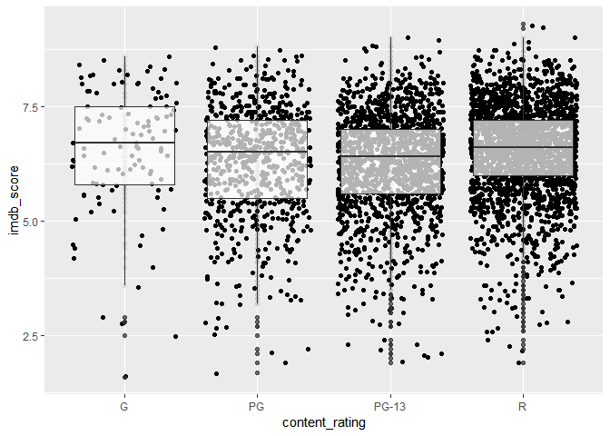<!-- -->

``` r
df_imdb %>%
  filter(content_rating %in% c("G", "PG", "PG-13", "R")) %>%
  ggplot(aes(imdb_score, fill=content_rating, linetype=content_rating)) + 
  geom_density(alpha=.3) # density plot..
```

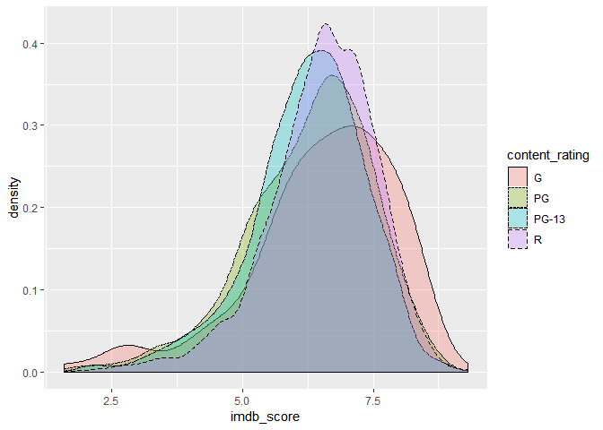<!-- -->

``` r
summary(lm(imdb_score ~ content_rating, 
           data = df_imdb %>% filter(content_rating %in% c('G', 'PG', 'PG-13', 'R'))))
```

    ## 
    ## Call:
    ## lm(formula = imdb_score ~ content_rating, data = df_imdb %>% 
    ##     filter(content_rating %in% c("G", "PG", "PG-13", "R")))
    ## 
    ## Residuals:
    ##     Min      1Q  Median      3Q     Max 
    ## -4.9295 -0.6271  0.0729  0.7425  2.7729 
    ## 
    ## Coefficients:
    ##                      Estimate Std. Error t value Pr(>|t|)    
    ## (Intercept)          6.529464   0.103061  63.356   <2e-16 ***
    ## content_ratingPG    -0.235028   0.110989  -2.118   0.0343 *  
    ## content_ratingPG-13 -0.271969   0.106938  -2.543   0.0110 *  
    ## content_ratingR     -0.002363   0.105750  -0.022   0.9822    
    ## ---
    ## Signif. codes:  0 '***' 0.001 '**' 0.01 '*' 0.05 '.' 0.1 ' ' 1
    ## 
    ## Residual standard error: 1.091 on 4388 degrees of freedom
    ## Multiple R-squared:  0.0139, Adjusted R-squared:  0.01322 
    ## F-statistic: 20.62 on 3 and 4388 DF,  p-value: 2.92e-13

등급 집단간에 평점 평균이 통계적으로 유의한 차이가 있음 ‘좋아요’ 개수와 리뷰 평점 사이의 관계

``` r
df_imdb %>%
  ggplot(aes(movie_facebook_likes)) + geom_histogram()
```

    ## `stat_bin()` using `bins = 30`. Pick better value with `binwidth`.

<!-- -->

``` r
df_imdb %>%
  ggplot(aes(movie_facebook_likes)) + geom_histogram(bins = 20) + scale_x_log10()
```

    ## Warning: Transformation introduced infinite values in continuous x-axis

    ## Warning: Removed 2181 rows containing non-finite values (stat_bin).

<!-- -->

좋아요 개수와 스코어 간의 산점도

``` r
df_imdb %>%
  ggplot(aes(movie_facebook_likes, imdb_score)) + 
  geom_point() + 
  scale_x_log10() +
  geom_smooth()
```

    ## Warning: Transformation introduced infinite values in continuous x-axis
    
    ## Warning: Transformation introduced infinite values in continuous x-axis

    ## `geom_smooth()` using method = 'gam' and formula 'y ~ s(x, bs = "cs")'

    ## Warning: Removed 2181 rows containing non-finite values (stat_smooth).

<!-- -->

2010년 이전과 이후의 좋아요 개수의 분포가 상이함을 확인

``` r
df_imdb %>%
  ggplot(aes(as.factor(title_year), movie_facebook_likes)) +
  geom_boxplot() +
  scale_y_log10()
```

    ## Warning: Transformation introduced infinite values in continuous y-axis

    ## Warning: Removed 2181 rows containing non-finite values (stat_boxplot).

<!-- -->

``` r
df_imdb %>%
  filter(title_year > 2010 & country == 'USA') %>%
  ggplot(aes(movie_facebook_likes, imdb_score)) +
  geom_point() +
  scale_x_log10() +
  geom_smooth()
```

    ## Warning: Transformation introduced infinite values in continuous x-axis

    ## Warning: Transformation introduced infinite values in continuous x-axis

    ## `geom_smooth()` using method = 'loess' and formula 'y ~ x'

    ## Warning: Removed 230 rows containing non-finite values (stat_smooth).

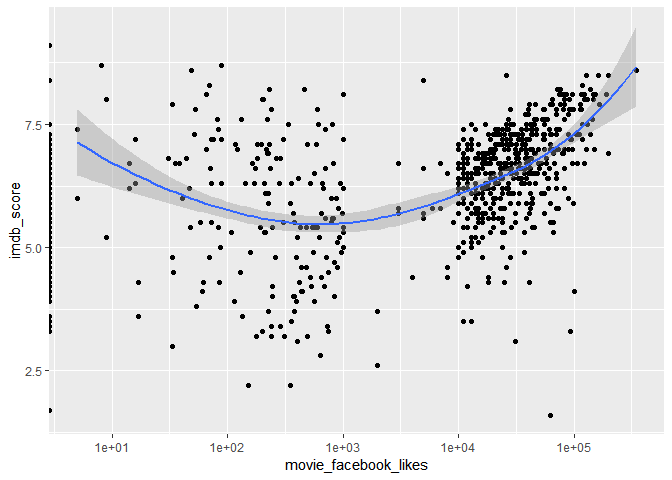<!-- -->

‘좋아요’ 100개 넘으면 두 변수 상관관계 높음

``` r
df_imdb_l00_more <- df_imdb %>%
  filter(title_year > 2010 & country == 'USA') %>%
  filter(movie_facebook_likes > 100)
head(df_imdb_l00_more); dim(df_imdb_l00_more)
```

    ## # A tibble: 6 x 28
    ##   color director_name num_critic_for_… duration director_facebo…
    ##   <chr> <chr>                    <dbl>    <dbl>            <dbl>
    ## 1 Color Christopher …              813      164            22000
    ## 2 Color Andrew Stant…              462      132              475
    ## 3 Color Joss Whedon                635      141                0
    ## 4 Color Zack Snyder                673      183                0
    ## 5 Color Gore Verbins…              450      150              563
    ## 6 Color Zack Snyder                733      143                0
    ## # … with 23 more variables: actor_3_facebook_likes <dbl>,
    ## #   actor_2_name <chr>, actor_1_facebook_likes <dbl>, gross <dbl>,
    ## #   genres <chr>, actor_1_name <chr>, movie_title <chr>,
    ## #   num_voted_users <dbl>, cast_total_facebook_likes <dbl>,
    ## #   actor_3_name <chr>, facenumber_in_poster <dbl>, plot_keywords <chr>,
    ## #   movie_imdb_link <chr>, num_user_for_reviews <dbl>, language <chr>,
    ## #   country <chr>, content_rating <chr>, budget <dbl>, title_year <dbl>,
    ## #   actor_2_facebook_likes <dbl>, imdb_score <dbl>, aspect_ratio <dbl>,
    ## #   movie_facebook_likes <dbl>

    ## [1] 667  28

``` r
cor(log10(df_imdb_l00_more$movie_facebook_likes), df_imdb_l00_more$imdb_score)
```

    ## [1] 0.4682827

‘좋아요’ 100개 넘으면 두 변수 상관관계 높음 로그변환 \>\> 선형모델의 해

``` r
m <- lm(imdb_score ~ log10(movie_facebook_likes), data=df_imdb_l00_more)
summary(m)
```

    ## 
    ## Call:
    ## lm(formula = imdb_score ~ log10(movie_facebook_likes), data = df_imdb_l00_more)
    ## 
    ## Residuals:
    ##     Min      1Q  Median      3Q     Max 
    ## -5.2173 -0.5197  0.0826  0.6478  2.9942 
    ## 
    ## Coefficients:
    ##                             Estimate Std. Error t value Pr(>|t|)    
    ## (Intercept)                  3.63497    0.20335   17.88   <2e-16 ***
    ## log10(movie_facebook_likes)  0.66405    0.04859   13.67   <2e-16 ***
    ## ---
    ## Signif. codes:  0 '***' 0.001 '**' 0.01 '*' 0.05 '.' 0.1 ' ' 1
    ## 
    ## Residual standard error: 1 on 665 degrees of freedom
    ## Multiple R-squared:  0.2193, Adjusted R-squared:  0.2181 
    ## F-statistic: 186.8 on 1 and 665 DF,  p-value: < 2.2e-16

다중공선성 :
(다변량)

``` r
ggpairs(mtcars[, c('mpg', 'disp', 'hp', 'wt', 'drat')]) # 독립변수간 높은 상관계수(.7 이상) 확인!
```

<!-- -->

``` r
m <- lm(mpg ~ disp + hp + wt + drat, data=mtcars)
summary(m)
```

    ## 
    ## Call:
    ## lm(formula = mpg ~ disp + hp + wt + drat, data = mtcars)
    ## 
    ## Residuals:
    ##     Min      1Q  Median      3Q     Max 
    ## -3.5077 -1.9052 -0.5057  0.9821  5.6883 
    ## 
    ## Coefficients:
    ##              Estimate Std. Error t value Pr(>|t|)    
    ## (Intercept) 29.148738   6.293588   4.631  8.2e-05 ***
    ## disp         0.003815   0.010805   0.353  0.72675    
    ## hp          -0.034784   0.011597  -2.999  0.00576 ** 
    ## wt          -3.479668   1.078371  -3.227  0.00327 ** 
    ## drat         1.768049   1.319779   1.340  0.19153    
    ## ---
    ## Signif. codes:  0 '***' 0.001 '**' 0.01 '*' 0.05 '.' 0.1 ' ' 1
    ## 
    ## Residual standard error: 2.602 on 27 degrees of freedom
    ## Multiple R-squared:  0.8376, Adjusted R-squared:  0.8136 
    ## F-statistic: 34.82 on 4 and 27 DF,  p-value: 2.704e-10

``` r
anova(m)
```

    ## Analysis of Variance Table
    ## 
    ## Response: mpg
    ##           Df Sum Sq Mean Sq  F value    Pr(>F)    
    ## disp       1 808.89  808.89 119.4502 2.041e-11 ***
    ## hp         1  33.67   33.67   4.9714  0.034281 *  
    ## wt         1  88.50   88.50  13.0694  0.001213 ** 
    ## drat       1  12.15   12.15   1.7947  0.191525    
    ## Residuals 27 182.84    6.77                       
    ## ---
    ## Signif. codes:  0 '***' 0.001 '**' 0.01 '*' 0.05 '.' 0.1 ' ' 1

분류모델평가—- with randomForest model applied with titanic dataset

``` r
read.csv('./data/titanic_preprocessed.csv') -> titanic; glimpse(titanic)
```

    ## Observations: 1,307
    ## Variables: 8
    ## $ pclass   <int> 1, 1, 1, 1, 1, 1, 1, 1, 1, 1, 1, 1, 1, 1, 1, 1, 1, 1, 1…
    ## $ sex      <int> 0, 1, 0, 1, 0, 1, 0, 1, 0, 1, 1, 0, 0, 0, 1, 1, 1, 0, 0…
    ## $ age      <dbl> 29.00, 0.92, 2.00, 30.00, 25.00, 48.00, 63.00, 39.00, 5…
    ## $ sibsp    <int> 0, 1, 1, 1, 1, 0, 1, 0, 2, 0, 1, 1, 0, 0, 0, 0, 0, 0, 0…
    ## $ parch    <int> 0, 2, 2, 2, 2, 0, 0, 0, 0, 0, 0, 0, 0, 0, 0, 0, 1, 1, 0…
    ## $ fare     <dbl> 211.3375, 151.5500, 151.5500, 151.5500, 151.5500, 26.55…
    ## $ embarked <int> 3, 3, 3, 3, 3, 3, 3, 3, 3, 1, 1, 1, 1, 3, 3, 3, 1, 1, 1…
    ## $ survived <fct> survived, survived, dead, dead, dead, survived, survive…

``` r
titanic$pclass <- as.factor(titanic$pclass)
titanic$sex <- as.factor(titanic$sex)
titanic$embarked <- as.factor(titanic$embarked)
glimpse(titanic)
```

    ## Observations: 1,307
    ## Variables: 8
    ## $ pclass   <fct> 1, 1, 1, 1, 1, 1, 1, 1, 1, 1, 1, 1, 1, 1, 1, 1, 1, 1, 1…
    ## $ sex      <fct> 0, 1, 0, 1, 0, 1, 0, 1, 0, 1, 1, 0, 0, 0, 1, 1, 1, 0, 0…
    ## $ age      <dbl> 29.00, 0.92, 2.00, 30.00, 25.00, 48.00, 63.00, 39.00, 5…
    ## $ sibsp    <int> 0, 1, 1, 1, 1, 0, 1, 0, 2, 0, 1, 1, 0, 0, 0, 0, 0, 0, 0…
    ## $ parch    <int> 0, 2, 2, 2, 2, 0, 0, 0, 0, 0, 0, 0, 0, 0, 0, 0, 1, 1, 0…
    ## $ fare     <dbl> 211.3375, 151.5500, 151.5500, 151.5500, 151.5500, 26.55…
    ## $ embarked <fct> 3, 3, 3, 3, 3, 3, 3, 3, 3, 1, 1, 1, 1, 3, 3, 3, 1, 1, 1…
    ## $ survived <fct> survived, survived, dead, dead, dead, survived, survive…

1)  학습/평가 데이터셋 분리

<!-- end list -->

``` r
nrow(titanic)
```

    ## [1] 1307

``` r
idx <- createDataPartition(titanic$survived, p=.8, list=F)
titanic.train <- titanic[idx, ]
titanic.test <- titanic[-idx, ]
head(titanic.train)
```

    ##   pclass sex   age sibsp parch     fare embarked survived
    ## 1      1   0 29.00     0     0 211.3375        3 survived
    ## 2      1   1  0.92     1     2 151.5500        3 survived
    ## 3      1   0  2.00     1     2 151.5500        3     dead
    ## 4      1   1 30.00     1     2 151.5500        3     dead
    ## 6      1   1 48.00     0     0  26.5500        3 survived
    ## 7      1   0 63.00     1     0  77.9583        3 survived

``` r
head(titanic.test)
```

    ##    pclass sex age sibsp parch     fare embarked survived
    ## 5       1   0  25     1     2 151.5500        3     dead
    ## 8       1   1  39     0     0   0.0000        3     dead
    ## 10      1   1  71     0     0  49.5042        1     dead
    ## 21      1   1  37     1     1  52.5542        3 survived
    ## 30      1   1  28     0     0  26.5500        3 survived
    ## 34      1   0  58     0     0  26.5500        3 survived

survived and dead ratio check between train dataset and test dataset

``` r
prop.table(table(titanic.train$survived))
```

    ## 
    ##      dead  survived 
    ## 0.6189112 0.3810888

``` r
prop.table(table(titanic.test$survived))
```

    ## 
    ##      dead  survived 
    ## 0.6192308 0.3807692

2)  각 모델에 동일한 평가방법 적용

<!-- end list -->

``` r
fitControl <- trainControl(method='repeatedcv', number=10, repeats=3)
```

머신러닝 알고리즘별 최적 모수를 찾기 위한 학습방법 사전 설정 예측 모델 작성\_1 ::: RandomForest

``` r
library(e1071)

titanic.train <- as.data.table(titanic.train)

rf_fit <- train(survived ~ ., data=titanic.train,
                preProcess = c("pca"),
                method='rf', ntree=100, verbose=F, trControl=fitControl)
```

    ## Warning in randomForest.default(x, y, mtry = param$mtry, ...): invalid
    ## mtry: reset to within valid range
    
    ## Warning in randomForest.default(x, y, mtry = param$mtry, ...): invalid
    ## mtry: reset to within valid range
    
    ## Warning in randomForest.default(x, y, mtry = param$mtry, ...): invalid
    ## mtry: reset to within valid range
    
    ## Warning in randomForest.default(x, y, mtry = param$mtry, ...): invalid
    ## mtry: reset to within valid range
    
    ## Warning in randomForest.default(x, y, mtry = param$mtry, ...): invalid
    ## mtry: reset to within valid range
    
    ## Warning in randomForest.default(x, y, mtry = param$mtry, ...): invalid
    ## mtry: reset to within valid range
    
    ## Warning in randomForest.default(x, y, mtry = param$mtry, ...): invalid
    ## mtry: reset to within valid range
    
    ## Warning in randomForest.default(x, y, mtry = param$mtry, ...): invalid
    ## mtry: reset to within valid range
    
    ## Warning in randomForest.default(x, y, mtry = param$mtry, ...): invalid
    ## mtry: reset to within valid range
    
    ## Warning in randomForest.default(x, y, mtry = param$mtry, ...): invalid
    ## mtry: reset to within valid range
    
    ## Warning in randomForest.default(x, y, mtry = param$mtry, ...): invalid
    ## mtry: reset to within valid range
    
    ## Warning in randomForest.default(x, y, mtry = param$mtry, ...): invalid
    ## mtry: reset to within valid range
    
    ## Warning in randomForest.default(x, y, mtry = param$mtry, ...): invalid
    ## mtry: reset to within valid range
    
    ## Warning in randomForest.default(x, y, mtry = param$mtry, ...): invalid
    ## mtry: reset to within valid range
    
    ## Warning in randomForest.default(x, y, mtry = param$mtry, ...): invalid
    ## mtry: reset to within valid range
    
    ## Warning in randomForest.default(x, y, mtry = param$mtry, ...): invalid
    ## mtry: reset to within valid range
    
    ## Warning in randomForest.default(x, y, mtry = param$mtry, ...): invalid
    ## mtry: reset to within valid range
    
    ## Warning in randomForest.default(x, y, mtry = param$mtry, ...): invalid
    ## mtry: reset to within valid range
    
    ## Warning in randomForest.default(x, y, mtry = param$mtry, ...): invalid
    ## mtry: reset to within valid range
    
    ## Warning in randomForest.default(x, y, mtry = param$mtry, ...): invalid
    ## mtry: reset to within valid range
    
    ## Warning in randomForest.default(x, y, mtry = param$mtry, ...): invalid
    ## mtry: reset to within valid range
    
    ## Warning in randomForest.default(x, y, mtry = param$mtry, ...): invalid
    ## mtry: reset to within valid range
    
    ## Warning in randomForest.default(x, y, mtry = param$mtry, ...): invalid
    ## mtry: reset to within valid range
    
    ## Warning in randomForest.default(x, y, mtry = param$mtry, ...): invalid
    ## mtry: reset to within valid range
    
    ## Warning in randomForest.default(x, y, mtry = param$mtry, ...): invalid
    ## mtry: reset to within valid range
    
    ## Warning in randomForest.default(x, y, mtry = param$mtry, ...): invalid
    ## mtry: reset to within valid range
    
    ## Warning in randomForest.default(x, y, mtry = param$mtry, ...): invalid
    ## mtry: reset to within valid range
    
    ## Warning in randomForest.default(x, y, mtry = param$mtry, ...): invalid
    ## mtry: reset to within valid range
    
    ## Warning in randomForest.default(x, y, mtry = param$mtry, ...): invalid
    ## mtry: reset to within valid range
    
    ## Warning in randomForest.default(x, y, mtry = param$mtry, ...): invalid
    ## mtry: reset to within valid range

``` r
predicted <- predict(rf_fit, newdata = titanic.test) # predicted values
actual <- titanic.test$survived # actual values
length(predicted)
```

    ## [1] 260

``` r
length(actual)
```

    ## [1] 260

``` r
xtabs(~ predicted + actual) # 분할표
```

    ##           actual
    ## predicted  dead survived
    ##   dead      134       32
    ##   survived   27       67

``` r
predicted == actual
```

    ##   [1] FALSE  TRUE  TRUE FALSE FALSE  TRUE  TRUE FALSE FALSE  TRUE  TRUE
    ##  [12]  TRUE FALSE  TRUE  TRUE  TRUE  TRUE FALSE  TRUE FALSE  TRUE FALSE
    ##  [23]  TRUE FALSE  TRUE  TRUE FALSE  TRUE FALSE  TRUE  TRUE  TRUE  TRUE
    ##  [34]  TRUE  TRUE  TRUE  TRUE  TRUE  TRUE  TRUE  TRUE  TRUE FALSE FALSE
    ##  [45]  TRUE  TRUE  TRUE FALSE  TRUE FALSE  TRUE  TRUE  TRUE  TRUE FALSE
    ##  [56]  TRUE  TRUE  TRUE FALSE  TRUE  TRUE  TRUE  TRUE  TRUE  TRUE  TRUE
    ##  [67] FALSE  TRUE  TRUE  TRUE  TRUE  TRUE  TRUE  TRUE  TRUE  TRUE  TRUE
    ##  [78]  TRUE  TRUE  TRUE FALSE  TRUE  TRUE  TRUE  TRUE FALSE  TRUE  TRUE
    ##  [89]  TRUE  TRUE  TRUE  TRUE  TRUE FALSE  TRUE  TRUE  TRUE  TRUE  TRUE
    ## [100]  TRUE  TRUE  TRUE  TRUE  TRUE  TRUE  TRUE  TRUE  TRUE  TRUE FALSE
    ## [111]  TRUE  TRUE  TRUE  TRUE  TRUE  TRUE  TRUE FALSE  TRUE  TRUE  TRUE
    ## [122] FALSE  TRUE FALSE  TRUE  TRUE  TRUE FALSE  TRUE  TRUE  TRUE FALSE
    ## [133]  TRUE  TRUE  TRUE  TRUE FALSE  TRUE  TRUE FALSE  TRUE  TRUE  TRUE
    ## [144]  TRUE  TRUE  TRUE  TRUE  TRUE  TRUE FALSE  TRUE  TRUE  TRUE  TRUE
    ## [155]  TRUE  TRUE FALSE  TRUE  TRUE FALSE FALSE  TRUE FALSE  TRUE  TRUE
    ## [166] FALSE  TRUE  TRUE  TRUE  TRUE FALSE  TRUE  TRUE  TRUE  TRUE  TRUE
    ## [177]  TRUE FALSE  TRUE  TRUE FALSE FALSE  TRUE  TRUE  TRUE  TRUE  TRUE
    ## [188] FALSE FALSE FALSE  TRUE  TRUE  TRUE  TRUE  TRUE FALSE  TRUE  TRUE
    ## [199] FALSE  TRUE  TRUE FALSE  TRUE  TRUE  TRUE  TRUE  TRUE  TRUE  TRUE
    ## [210]  TRUE  TRUE FALSE  TRUE  TRUE  TRUE  TRUE  TRUE  TRUE  TRUE FALSE
    ## [221]  TRUE  TRUE  TRUE FALSE FALSE  TRUE FALSE  TRUE  TRUE  TRUE FALSE
    ## [232] FALSE FALSE  TRUE  TRUE  TRUE FALSE  TRUE FALSE  TRUE  TRUE  TRUE
    ## [243]  TRUE FALSE  TRUE  TRUE  TRUE  TRUE  TRUE FALSE FALSE  TRUE  TRUE
    ## [254]  TRUE  TRUE  TRUE  TRUE  TRUE  TRUE  TRUE

``` r
sum(predicted == actual)
```

    ## [1] 201

``` r
length(actual)
```

    ## [1] 260

``` r
sum(predicted == actual) / length(actual) # or nrow(actual in case / accuracy
```

    ## [1] 0.7730769

ROC 커브 및 AUC

``` r
library(ROCR)
```

probs :: 분류 알고리즘이 예측한 점수(predicted probability)

labels는 실제 분류true class가 저장된 벡터(actual
vectors)

``` r
yhat_rf <- predict(rf_fit, newdata = titanic.test, type='prob')$survived ## the predicted prob of survived
head(yhat_rf) # probability...
```

    ## [1] 0.82 0.04 0.15 0.28 0.26 0.88

``` r
y_obs <- titanic.test$survived # label :: actual vectors
head(y_obs) # label...
```

    ## [1] dead     dead     dead     survived survived survived
    ## Levels: dead survived

ROCR package를 적용하기 위해 prediction 를 생성해야 함

``` r
pred_rf <- prediction(yhat_rf, y_obs)
plot(performance(pred_rf, 'tpr', 'fpr')) # ROC curve
abline(0,1)
```

<!-- -->

``` r
plot(performance(pred_rf, 'acc')) ## cutoff에 따른 accuracy 변화
```

<!-- -->

``` r
performance(pred_rf, 'auc')@y.values[[1]] # auc
```

    ## [1] 0.8218834

회귀모델 평가 RMSE :: 작을수록 정확—- with lm model applied with boston housing data

``` r
read.table('./data/housing_data.csv') -> boston
names(boston) <- c('crim', 'zn', 'indus', 'chas', 'nox', 'rm', 'age', 'dis', 'rad',  
                   'tax', 'ptratio', 'black', 'lstat', 'medv')
glimpse(boston)
```

    ## Observations: 506
    ## Variables: 14
    ## $ crim    <dbl> 0.00632, 0.02731, 0.02729, 0.03237, 0.06905, 0.02985, 0.…
    ## $ zn      <dbl> 18.0, 0.0, 0.0, 0.0, 0.0, 0.0, 12.5, 12.5, 12.5, 12.5, 1…
    ## $ indus   <dbl> 2.31, 7.07, 7.07, 2.18, 2.18, 2.18, 7.87, 7.87, 7.87, 7.…
    ## $ chas    <int> 0, 0, 0, 0, 0, 0, 0, 0, 0, 0, 0, 0, 0, 0, 0, 0, 0, 0, 0,…
    ## $ nox     <dbl> 0.538, 0.469, 0.469, 0.458, 0.458, 0.458, 0.524, 0.524, …
    ## $ rm      <dbl> 6.575, 6.421, 7.185, 6.998, 7.147, 6.430, 6.012, 6.172, …
    ## $ age     <dbl> 65.2, 78.9, 61.1, 45.8, 54.2, 58.7, 66.6, 96.1, 100.0, 8…
    ## $ dis     <dbl> 4.0900, 4.9671, 4.9671, 6.0622, 6.0622, 6.0622, 5.5605, …
    ## $ rad     <int> 1, 2, 2, 3, 3, 3, 5, 5, 5, 5, 5, 5, 5, 4, 4, 4, 4, 4, 4,…
    ## $ tax     <dbl> 296, 242, 242, 222, 222, 222, 311, 311, 311, 311, 311, 3…
    ## $ ptratio <dbl> 15.3, 17.8, 17.8, 18.7, 18.7, 18.7, 15.2, 15.2, 15.2, 15…
    ## $ black   <dbl> 396.90, 396.90, 392.83, 394.63, 396.90, 394.12, 395.60, …
    ## $ lstat   <dbl> 4.98, 9.14, 4.03, 2.94, 5.33, 5.21, 12.43, 19.15, 29.93,…
    ## $ medv    <dbl> 24.0, 21.6, 34.7, 33.4, 36.2, 28.7, 22.9, 27.1, 16.5, 18…

splitting total dataset into training and validation dataset

``` r
idx <- createDataPartition(boston$medv, p=c(.6, .4), list=F)
boston.train <- boston[idx, ]; dim(boston.train)
```

    ## [1] 306  14

``` r
boston.validation_test <- boston[-idx, ]; dim(boston.validation_test)
```

    ## [1] 200  14

splitting validation\_test dataset into validation and test
dataset

``` r
idx <- createDataPartition(boston.validation_test$medv, p=c(.5, .5), list=F)
boston.validation <- boston.validation_test[idx, ]; dim(boston.validation)
```

    ## [1] 101  14

``` r
boston.test <- boston.validation_test[-idx, ]; dim(boston.test)
```

    ## [1] 99 14

``` r
m <- lm(medv~., data=boston.train)
summary(m)
```

    ## 
    ## Call:
    ## lm(formula = medv ~ ., data = boston.train)
    ## 
    ## Residuals:
    ##      Min       1Q   Median       3Q      Max 
    ## -14.9770  -2.7194  -0.5434   1.4865  25.2762 
    ## 
    ## Coefficients:
    ##               Estimate Std. Error t value Pr(>|t|)    
    ## (Intercept)  40.762296   6.985324   5.835 1.42e-08 ***
    ## crim         -0.129439   0.049110  -2.636 0.008846 ** 
    ## zn            0.033519   0.017652   1.899 0.058569 .  
    ## indus         0.013875   0.077435   0.179 0.857917    
    ## chas          2.271297   1.091208   2.081 0.038264 *  
    ## nox         -19.045470   5.207134  -3.658 0.000302 ***
    ## rm            3.868263   0.546500   7.078 1.09e-11 ***
    ## age          -0.009225   0.017537  -0.526 0.599282    
    ## dis          -1.610960   0.270592  -5.953 7.52e-09 ***
    ## rad           0.378457   0.093703   4.039 6.87e-05 ***
    ## tax          -0.014999   0.005281  -2.840 0.004821 ** 
    ## ptratio      -1.106690   0.175208  -6.316 9.96e-10 ***
    ## black         0.009474   0.003571   2.653 0.008406 ** 
    ## lstat        -0.474642   0.067099  -7.074 1.12e-11 ***
    ## ---
    ## Signif. codes:  0 '***' 0.001 '**' 0.01 '*' 0.05 '.' 0.1 ' ' 1
    ## 
    ## Residual standard error: 4.844 on 292 degrees of freedom
    ## Multiple R-squared:  0.7417, Adjusted R-squared:  0.7302 
    ## F-statistic: 64.48 on 13 and 292 DF,  p-value: < 2.2e-16

defining rmse function—-

``` r
rmse <- function(y_obs, yhat) {
  sqrt(mean(y_obs - yhat)^2)
}

y_obs <- boston.validation$medv
yhat_m <- predict(m, newdata=boston.validation)

rmse(y_obs, yhat_m) # 작을 수록 정확한 모델
```

    ## [1] 0.04504305

로지스틱 회귀 :: income이 \<=50K“,”\>50K인지 여부 예측 with adult
data

``` r
# adult <- read.table("http://archive.ics.uci.edu/ml/machine-learning-databases/adult/adult.data",
#                   sep=",",
#                   header=F,
#                   col.names=c("age", "type_employer", "fnlwgt", "education", 
#                               "education_num","marital", "occupation", "relationship", "race","sex",
#                               "capital_gain", "capital_loss", "hr_per_week","country", "income"),
#                   fill=FALSE, 
#                   strip.white=T)
# 
# adult %>% write.csv("./data/adult.csv", row.names = F)
adult <- read_csv("./data/adult.csv")
```

    ## Parsed with column specification:
    ## cols(
    ##   age = col_double(),
    ##   type_employer = col_character(),
    ##   fnlwgt = col_double(),
    ##   education = col_character(),
    ##   education_num = col_double(),
    ##   marital = col_character(),
    ##   occupation = col_character(),
    ##   relationship = col_character(),
    ##   race = col_character(),
    ##   sex = col_character(),
    ##   capital_gain = col_double(),
    ##   capital_loss = col_double(),
    ##   hr_per_week = col_double(),
    ##   country = col_character(),
    ##   income = col_character()
    ## )

``` r
glimpse(adult)
```

    ## Observations: 32,561
    ## Variables: 15
    ## $ age           <dbl> 39, 50, 38, 53, 28, 37, 49, 52, 31, 42, 37, 30, 23…
    ## $ type_employer <chr> "State-gov", "Self-emp-not-inc", "Private", "Priva…
    ## $ fnlwgt        <dbl> 77516, 83311, 215646, 234721, 338409, 284582, 1601…
    ## $ education     <chr> "Bachelors", "Bachelors", "HS-grad", "11th", "Bach…
    ## $ education_num <dbl> 13, 13, 9, 7, 13, 14, 5, 9, 14, 13, 10, 13, 13, 12…
    ## $ marital       <chr> "Never-married", "Married-civ-spouse", "Divorced",…
    ## $ occupation    <chr> "Adm-clerical", "Exec-managerial", "Handlers-clean…
    ## $ relationship  <chr> "Not-in-family", "Husband", "Not-in-family", "Husb…
    ## $ race          <chr> "White", "White", "White", "Black", "Black", "Whit…
    ## $ sex           <chr> "Male", "Male", "Male", "Male", "Female", "Female"…
    ## $ capital_gain  <dbl> 2174, 0, 0, 0, 0, 0, 0, 0, 14084, 5178, 0, 0, 0, 0…
    ## $ capital_loss  <dbl> 0, 0, 0, 0, 0, 0, 0, 0, 0, 0, 0, 0, 0, 0, 0, 0, 0,…
    ## $ hr_per_week   <dbl> 40, 13, 40, 40, 40, 40, 16, 45, 50, 40, 80, 40, 30…
    ## $ country       <chr> "United-States", "United-States", "United-States",…
    ## $ income        <chr> "<=50K", "<=50K", "<=50K", "<=50K", "<=50K", "<=50…

``` r
levels(adult$income)
```

    ## NULL

``` r
adult$income <- factor(adult$income, levels=c("<=50K", ">50K" ), labels=c(0,1))
```

splitting dataset into train and test dataset

``` r
idx <- createDataPartition(adult$income, p=c(.8, .2), list=F)
```

trainig and test dataset defining

``` r
adult.train <- adult[idx, ]
adult.test <- adult[-idx, ]
```

modeling with training
    dateset

``` r
m <- glm(income ~., data=adult.train, family=binomial)
```

    ## Warning: glm.fit: fitted probabilities numerically 0 or 1 occurred

``` r
summary(m)
```

    ## 
    ## Call:
    ## glm(formula = income ~ ., family = binomial, data = adult.train)
    ## 
    ## Deviance Residuals: 
    ##     Min       1Q   Median       3Q      Max  
    ## -3.3167  -0.5033  -0.1787  -0.0234   3.7299  
    ## 
    ## Coefficients: (2 not defined because of singularities)
    ##                                     Estimate Std. Error z value Pr(>|z|)
    ## (Intercept)                       -9.420e+00  4.916e-01 -19.165  < 2e-16
    ## age                                2.614e-02  1.858e-03  14.067  < 2e-16
    ## type_employerFederal-gov           1.202e+00  1.727e-01   6.956 3.50e-12
    ## type_employerLocal-gov             4.891e-01  1.562e-01   3.131 0.001740
    ## type_employerNever-worked         -1.065e+01  3.199e+02  -0.033 0.973451
    ## type_employerPrivate               7.190e-01  1.391e-01   5.167 2.37e-07
    ## type_employerSelf-emp-inc          8.554e-01  1.672e-01   5.117 3.10e-07
    ## type_employerSelf-emp-not-inc      2.114e-01  1.525e-01   1.386 0.165630
    ## type_employerState-gov             3.685e-01  1.688e-01   2.183 0.029017
    ## type_employerWithout-pay          -1.226e+01  2.232e+02  -0.055 0.956207
    ## fnlwgt                             7.105e-07  1.922e-07   3.697 0.000218
    ## education11th                      7.996e-02  2.423e-01   0.330 0.741358
    ## education12th                      4.202e-01  3.086e-01   1.362 0.173306
    ## education1st-4th                  -3.047e-01  5.170e-01  -0.589 0.555610
    ## education5th-6th                  -1.032e-01  3.614e-01  -0.286 0.775232
    ## education7th-8th                  -3.312e-01  2.573e-01  -1.287 0.197953
    ## education9th                      -9.679e-02  2.984e-01  -0.324 0.745674
    ## educationAssoc-acdm                1.448e+00  2.015e-01   7.184 6.76e-13
    ## educationAssoc-voc                 1.404e+00  1.941e-01   7.234 4.69e-13
    ## educationBachelors                 2.015e+00  1.810e-01  11.135  < 2e-16
    ## educationDoctorate                 2.996e+00  2.427e-01  12.343  < 2e-16
    ## educationHS-grad                   8.808e-01  1.765e-01   4.989 6.06e-07
    ## educationMasters                   2.337e+00  1.925e-01  12.137  < 2e-16
    ## educationPreschool                -1.946e+01  1.665e+02  -0.117 0.906992
    ## educationProf-school               2.844e+00  2.267e-01  12.546  < 2e-16
    ## educationSome-college              1.225e+00  1.789e-01   6.851 7.34e-12
    ## education_num                             NA         NA      NA       NA
    ## maritalMarried-AF-spouse           2.748e+00  6.441e-01   4.266 1.99e-05
    ## maritalMarried-civ-spouse          2.445e+00  2.937e-01   8.326  < 2e-16
    ## maritalMarried-spouse-absent      -4.343e-02  2.775e-01  -0.156 0.875644
    ## maritalNever-married              -4.874e-01  9.937e-02  -4.905 9.33e-07
    ## maritalSeparated                   2.763e-02  1.735e-01   0.159 0.873473
    ## maritalWidowed                     1.299e-01  1.713e-01   0.758 0.448236
    ## occupationAdm-clerical             2.908e-02  1.104e-01   0.263 0.792248
    ## occupationArmed-Forces            -1.076e+00  1.560e+00  -0.689 0.490519
    ## occupationCraft-repair             1.299e-01  9.409e-02   1.381 0.167367
    ## occupationExec-managerial          8.599e-01  9.674e-02   8.889  < 2e-16
    ## occupationFarming-fishing         -9.884e-01  1.594e-01  -6.200 5.65e-10
    ## occupationHandlers-cleaners       -6.799e-01  1.667e-01  -4.080 4.51e-05
    ## occupationMachine-op-inspct       -1.151e-01  1.156e-01  -0.996 0.319396
    ## occupationOther-service           -7.330e-01  1.385e-01  -5.294 1.20e-07
    ## occupationPriv-house-serv         -4.060e+00  1.748e+00  -2.323 0.020157
    ## occupationProf-specialty           5.844e-01  1.039e-01   5.622 1.88e-08
    ## occupationProtective-serv          6.858e-01  1.452e-01   4.725 2.30e-06
    ## occupationSales                    3.258e-01  9.990e-02   3.261 0.001109
    ## occupationTech-support             6.721e-01  1.338e-01   5.022 5.10e-07
    ## occupationTransport-moving                NA         NA      NA       NA
    ## relationshipNot-in-family          7.664e-01  2.902e-01   2.641 0.008258
    ## relationshipOther-relative        -3.344e-01  2.649e-01  -1.262 0.206792
    ## relationshipOwn-child             -4.394e-01  2.813e-01  -1.562 0.118302
    ## relationshipUnmarried              7.192e-01  3.078e-01   2.337 0.019435
    ## relationshipWife                   1.366e+00  1.158e-01  11.789  < 2e-16
    ## raceAsian-Pac-Islander             3.772e-01  3.001e-01   1.257 0.208714
    ## raceBlack                          2.698e-01  2.558e-01   1.055 0.291396
    ## raceOther                          1.667e-02  3.955e-01   0.042 0.966376
    ## raceWhite                          4.746e-01  2.428e-01   1.955 0.050639
    ## sexMale                            8.817e-01  8.985e-02   9.813  < 2e-16
    ## capital_gain                       3.222e-04  1.132e-05  28.463  < 2e-16
    ## capital_loss                       6.611e-04  4.135e-05  15.988  < 2e-16
    ## hr_per_week                        2.881e-02  1.805e-03  15.966  < 2e-16
    ## countryCambodia                    1.714e+00  6.432e-01   2.665 0.007702
    ## countryCanada                      4.754e-01  3.200e-01   1.486 0.137353
    ## countryChina                      -2.174e-01  4.371e-01  -0.497 0.618980
    ## countryColumbia                   -2.231e+00  1.100e+00  -2.028 0.042523
    ## countryCuba                        5.722e-01  3.717e-01   1.540 0.123658
    ## countryDominican-Republic         -1.312e+00  1.060e+00  -1.237 0.216076
    ## countryEcuador                    -1.259e-01  9.090e-01  -0.139 0.889835
    ## countryEl-Salvador                -4.541e-01  5.648e-01  -0.804 0.421415
    ## countryEngland                     6.922e-01  3.768e-01   1.837 0.066210
    ## countryFrance                      1.114e+00  6.159e-01   1.809 0.070522
    ## countryGermany                     6.649e-01  3.144e-01   2.115 0.034440
    ## countryGreece                     -6.604e-01  6.379e-01  -1.035 0.300497
    ## countryGuatemala                   3.801e-01  7.839e-01   0.485 0.627738
    ## countryHaiti                       2.346e-01  6.941e-01   0.338 0.735343
    ## countryHoland-Netherlands         -1.009e+01  8.827e+02  -0.011 0.990876
    ## countryHonduras                   -1.061e+01  2.442e+02  -0.043 0.965348
    ## countryHong                        5.151e-01  7.215e-01   0.714 0.475256
    ## countryHungary                     2.093e-01  7.981e-01   0.262 0.793095
    ## countryIndia                       5.945e-02  3.539e-01   0.168 0.866588
    ## countryIran                       -2.191e-01  5.231e-01  -0.419 0.675262
    ## countryIreland                     1.110e+00  6.839e-01   1.624 0.104434
    ## countryItaly                       7.165e-01  4.081e-01   1.756 0.079128
    ## countryJamaica                    -1.189e-01  6.105e-01  -0.195 0.845576
    ## countryJapan                       9.454e-01  4.922e-01   1.921 0.054786
    ## countryLaos                        1.314e-01  9.006e-01   0.146 0.883995
    ## countryMexico                     -4.105e-01  2.883e-01  -1.424 0.154523
    ## countryNicaragua                  -1.007e+00  1.099e+00  -0.917 0.359168
    ## countryOutlying-US(Guam-USVI-etc) -1.162e+01  2.363e+02  -0.049 0.960771
    ## countryPeru                       -5.988e-01  8.643e-01  -0.693 0.488424
    ## countryPhilippines                 8.046e-01  3.154e-01   2.551 0.010740
    ## countryPoland                      1.043e-01  4.816e-01   0.216 0.828634
    ## countryPortugal                    6.461e-01  6.711e-01   0.963 0.335685
    ## countryPuerto-Rico                -6.078e-01  5.184e-01  -1.172 0.241015
    ## countryScotland                    4.634e-01  8.277e-01   0.560 0.575617
    ## countrySouth                      -4.777e-01  5.017e-01  -0.952 0.341014
    ## countryTaiwan                      3.696e-01  5.080e-01   0.728 0.466857
    ## countryThailand                    2.888e-01  8.854e-01   0.326 0.744296
    ## countryTrinadad&Tobago             6.374e-01  1.015e+00   0.628 0.530115
    ## countryUnited-States               4.434e-01  1.549e-01   2.864 0.004190
    ## countryVietnam                    -6.549e-01  6.280e-01  -1.043 0.297043
    ## countryYugoslavia                  4.807e-01  8.198e-01   0.586 0.557672
    ##                                      
    ## (Intercept)                       ***
    ## age                               ***
    ## type_employerFederal-gov          ***
    ## type_employerLocal-gov            ** 
    ## type_employerNever-worked            
    ## type_employerPrivate              ***
    ## type_employerSelf-emp-inc         ***
    ## type_employerSelf-emp-not-inc        
    ## type_employerState-gov            *  
    ## type_employerWithout-pay             
    ## fnlwgt                            ***
    ## education11th                        
    ## education12th                        
    ## education1st-4th                     
    ## education5th-6th                     
    ## education7th-8th                     
    ## education9th                         
    ## educationAssoc-acdm               ***
    ## educationAssoc-voc                ***
    ## educationBachelors                ***
    ## educationDoctorate                ***
    ## educationHS-grad                  ***
    ## educationMasters                  ***
    ## educationPreschool                   
    ## educationProf-school              ***
    ## educationSome-college             ***
    ## education_num                        
    ## maritalMarried-AF-spouse          ***
    ## maritalMarried-civ-spouse         ***
    ## maritalMarried-spouse-absent         
    ## maritalNever-married              ***
    ## maritalSeparated                     
    ## maritalWidowed                       
    ## occupationAdm-clerical               
    ## occupationArmed-Forces               
    ## occupationCraft-repair               
    ## occupationExec-managerial         ***
    ## occupationFarming-fishing         ***
    ## occupationHandlers-cleaners       ***
    ## occupationMachine-op-inspct          
    ## occupationOther-service           ***
    ## occupationPriv-house-serv         *  
    ## occupationProf-specialty          ***
    ## occupationProtective-serv         ***
    ## occupationSales                   ** 
    ## occupationTech-support            ***
    ## occupationTransport-moving           
    ## relationshipNot-in-family         ** 
    ## relationshipOther-relative           
    ## relationshipOwn-child                
    ## relationshipUnmarried             *  
    ## relationshipWife                  ***
    ## raceAsian-Pac-Islander               
    ## raceBlack                            
    ## raceOther                            
    ## raceWhite                         .  
    ## sexMale                           ***
    ## capital_gain                      ***
    ## capital_loss                      ***
    ## hr_per_week                       ***
    ## countryCambodia                   ** 
    ## countryCanada                        
    ## countryChina                         
    ## countryColumbia                   *  
    ## countryCuba                          
    ## countryDominican-Republic            
    ## countryEcuador                       
    ## countryEl-Salvador                   
    ## countryEngland                    .  
    ## countryFrance                     .  
    ## countryGermany                    *  
    ## countryGreece                        
    ## countryGuatemala                     
    ## countryHaiti                         
    ## countryHoland-Netherlands            
    ## countryHonduras                      
    ## countryHong                          
    ## countryHungary                       
    ## countryIndia                         
    ## countryIran                          
    ## countryIreland                       
    ## countryItaly                      .  
    ## countryJamaica                       
    ## countryJapan                      .  
    ## countryLaos                          
    ## countryMexico                        
    ## countryNicaragua                     
    ## countryOutlying-US(Guam-USVI-etc)    
    ## countryPeru                          
    ## countryPhilippines                *  
    ## countryPoland                        
    ## countryPortugal                      
    ## countryPuerto-Rico                   
    ## countryScotland                      
    ## countrySouth                         
    ## countryTaiwan                        
    ## countryThailand                      
    ## countryTrinadad&Tobago               
    ## countryUnited-States              ** 
    ## countryVietnam                       
    ## countryYugoslavia                    
    ## ---
    ## Signif. codes:  0 '***' 0.001 '**' 0.01 '*' 0.05 '.' 0.1 ' ' 1
    ## 
    ## (Dispersion parameter for binomial family taken to be 1)
    ## 
    ##     Null deviance: 28759  on 26048  degrees of freedom
    ## Residual deviance: 16398  on 25950  degrees of freedom
    ## AIC: 16596
    ## 
    ## Number of Fisher Scoring iterations: 13

``` r
fitted(m)[c(1:5, 51:55)] # 모델에 적합된 값 with probability
```

    ##           1           2           3           4           5          51 
    ## 0.119021455 0.413705325 0.071985870 0.662737131 0.824352501 0.150128774 
    ##          52          53          54          55 
    ## 0.224105493 0.023023242 0.650854629 0.004615909

``` r
ifelse(fitted(m) >= .5, 1,0)[c(1:5, 51:55)] # 모델에 적합된 값 with 1(">50K"), 0("<=50K")
```

    ##  1  2  3  4  5 51 52 53 54 55 
    ##  0  0  0  1  1  0  0  0  1  0

predicting with test dataset

``` r
predict(m, newdata = adult.test, type='response')
```

    ## Warning in predict.lm(object, newdata, se.fit, scale = 1, type =
    ## ifelse(type == : prediction from a rank-deficient fit may be misleading

    ##            1            2            3            4            5 
    ## 2.569667e-02 2.283020e-02 7.458043e-03 6.837041e-01 3.080691e-01 
    ##            6            7            8            9           10 
    ## 1.095882e-02 2.350973e-01 4.166816e-01 2.482334e-01 1.864296e-01 
    ##           11           12           13           14           15 
    ## 6.452531e-04 4.716463e-01 6.126114e-02 2.568699e-01 4.003099e-01 
    ##           16           17           18           19           20 
    ## 2.030763e-02 5.662827e-01 3.225352e-04 5.538329e-01 5.289269e-03 
    ##           21           22           23           24           25 
    ## 1.282227e-01 7.620408e-01 3.887822e-01 1.614370e-02 6.367736e-03 
    ##           26           27           28           29           30 
    ## 1.163491e-01 4.459134e-01 1.188462e-03 3.215308e-02 1.571902e-01 
    ##           31           32           33           34           35 
    ## 5.977036e-01 8.323487e-01 2.153481e-03 1.747126e-01 5.973810e-01 
    ##           36           37           38           39           40 
    ## 5.850223e-03 6.573500e-03 5.435566e-04 7.689972e-01 1.047184e-01 
    ##           41           42           43           44           45 
    ## 3.123879e-01 5.201864e-01 3.854678e-02 3.970990e-02 3.078947e-03 
    ##           46           47           48           49           50 
    ## 6.723327e-02 1.809459e-01 9.292880e-01 2.437469e-01 5.891760e-03 
    ##           51           52           53           54           55 
    ## 1.320924e-02 1.117800e-01 1.570345e-01 1.192873e-01 4.497482e-01 
    ##           56           57           58           59           60 
    ## 1.481468e-02 4.715005e-01 5.594123e-02 8.068840e-01 3.409754e-02 
    ##           61           62           63           64           65 
    ## 1.024489e-02 3.582899e-02 3.333114e-01 7.132147e-02 8.097514e-01 
    ##           66           67           68           69           70 
    ## 6.365557e-03 6.359644e-01 1.702136e-01 1.412035e-01 5.411192e-01 
    ##           71           72           73           74           75 
    ## 1.258139e-02 1.862706e-01 4.814083e-02 1.273034e-01 4.840810e-01 
    ##           76           77           78           79           80 
    ## 2.659690e-01 3.202919e-01 2.301401e-01 2.242326e-01 4.684213e-02 
    ##           81           82           83           84           85 
    ## 2.047343e-02 1.248222e-03 3.922255e-01 4.670702e-02 2.331484e-02 
    ##           86           87           88           89           90 
    ## 9.959785e-01 6.334556e-03 1.067817e-01 1.650976e-01 2.785872e-01 
    ##           91           92           93           94           95 
    ## 4.537092e-02 9.202338e-03 9.339190e-01 4.029663e-01 2.936005e-02 
    ##           96           97           98           99          100 
    ## 5.996269e-01 1.275526e-04 9.598983e-02 3.507742e-01 5.995979e-03 
    ##          101          102          103          104          105 
    ## 3.676898e-01 3.560995e-02 2.546376e-02 3.279660e-03 8.274335e-03 
    ##          106          107          108          109          110 
    ## 2.517889e-01 8.746929e-01 2.231053e-01 3.640353e-01 1.172715e-03 
    ##          111          112          113          114          115 
    ## 1.248980e-01 9.390264e-01 9.702381e-02 7.823161e-02 1.181337e-01 
    ##          116          117          118          119          120 
    ## 2.309604e-03 9.983157e-01 3.581622e-01 4.204850e-03 7.822340e-01 
    ##          121          122          123          124          125 
    ## 2.269937e-01 7.734054e-01 5.403782e-02 2.531870e-01 4.476717e-01 
    ##          126          127          128          129          130 
    ## 2.496861e-04 4.157174e-02 3.248801e-03 2.252796e-03 3.961035e-01 
    ##          131          132          133          134          135 
    ## 4.030391e-01 4.051176e-01 8.849407e-01 4.122372e-02 4.771594e-01 
    ##          136          137          138          139          140 
    ## 1.158807e-03 5.492810e-01 2.547672e-02 1.454754e-02 1.130158e-02 
    ##          141          142          143          144          145 
    ## 4.734393e-01 3.983164e-03 6.959544e-03 5.728135e-02 1.023342e-01 
    ##          146          147          148          149          150 
    ## 3.535231e-01 3.064642e-02 5.209953e-03 1.904783e-03 2.129687e-01 
    ##          151          152          153          154          155 
    ## 1.217628e-01 6.777293e-01 4.722404e-02 1.804878e-01 1.915947e-02 
    ##          156          157          158          159          160 
    ## 6.103695e-04 9.247320e-03 2.705424e-03 4.222207e-02 1.300367e-03 
    ##          161          162          163          164          165 
    ## 2.650570e-01 6.366792e-01 1.215991e-03 8.941925e-02 9.967277e-01 
    ##          166          167          168          169          170 
    ## 5.699601e-01 4.638085e-01 3.300168e-01 7.895666e-02 1.948657e-01 
    ##          171          172          173          174          175 
    ## 1.625802e-02 6.219036e-04 1.827929e-01 7.214034e-04 5.341150e-01 
    ##          176          177          178          179          180 
    ## 1.969912e-01 5.750173e-01 1.904431e-02 5.846496e-02 9.977406e-01 
    ##          181          182          183          184          185 
    ## 3.850883e-01 3.522588e-02 1.079165e-01 6.423326e-01 7.961438e-02 
    ##          186          187          188          189          190 
    ## 5.038392e-02 2.056056e-04 2.288613e-02 2.591455e-03 3.924053e-01 
    ##          191          192          193          194          195 
    ## 1.790150e-01 3.135176e-01 6.483853e-03 2.019614e-02 1.456815e-01 
    ##          196          197          198          199          200 
    ## 3.983521e-01 2.546098e-01 2.799860e-01 5.930615e-01 1.078229e-01 
    ##          201          202          203          204          205 
    ## 8.080213e-03 3.319425e-01 1.391331e-01 2.337812e-03 4.532741e-01 
    ##          206          207          208          209          210 
    ## 5.601615e-02 8.662289e-01 2.745827e-01 7.841086e-01 3.662060e-01 
    ##          211          212          213          214          215 
    ## 3.312423e-01 2.366890e-02 6.178028e-03 3.654551e-01 3.900077e-01 
    ##          216          217          218          219          220 
    ## 2.470214e-01 9.049251e-04 4.359879e-02 1.017504e-01 4.153893e-01 
    ##          221          222          223          224          225 
    ## 9.715021e-01 3.345479e-02 8.102746e-01 1.503855e-01 6.300048e-01 
    ##          226          227          228          229          230 
    ## 3.104459e-01 3.625804e-01 6.059593e-01 7.632047e-01 9.988230e-01 
    ##          231          232          233          234          235 
    ## 3.120304e-01 6.272811e-01 7.434504e-01 8.293754e-01 4.159515e-02 
    ##          236          237          238          239          240 
    ## 2.994885e-02 3.169227e-03 1.875983e-01 1.000000e+00 6.295503e-02 
    ##          241          242          243          244          245 
    ## 2.073394e-01 1.950401e-01 6.614216e-01 2.622344e-01 5.189070e-01 
    ##          246          247          248          249          250 
    ## 1.574901e-01 3.918669e-01 9.741018e-01 2.116171e-01 4.077021e-02 
    ##          251          252          253          254          255 
    ## 9.306161e-02 1.133861e-02 9.382508e-01 1.162014e-01 7.106097e-02 
    ##          256          257          258          259          260 
    ## 1.640243e-02 2.263549e-02 1.569634e-01 1.622904e-02 5.162200e-03 
    ##          261          262          263          264          265 
    ## 1.544431e-02 4.157161e-02 1.155505e-01 1.398539e-02 6.530245e-01 
    ##          266          267          268          269          270 
    ## 6.366027e-03 1.740628e-01 3.456747e-01 1.548149e-01 4.346483e-01 
    ##          271          272          273          274          275 
    ## 5.962921e-01 8.781980e-01 1.046665e-01 5.974924e-04 4.819326e-01 
    ##          276          277          278          279          280 
    ## 5.566400e-02 4.588143e-01 9.692118e-01 6.568074e-02 1.080337e-01 
    ##          281          282          283          284          285 
    ## 2.324696e-04 3.283115e-03 4.655566e-02 1.813823e-02 1.776062e-02 
    ##          286          287          288          289          290 
    ## 2.523872e-03 6.781972e-01 3.324163e-03 9.824767e-01 4.275286e-08 
    ##          291          292          293          294          295 
    ## 9.712227e-02 1.519408e-03 3.349886e-01 7.656822e-03 4.446291e-01 
    ##          296          297          298          299          300 
    ## 7.599992e-03 7.870082e-02 6.900991e-02 4.018327e-03 3.634085e-01 
    ##          301          302          303          304          305 
    ## 4.965232e-02 4.813211e-01 2.812066e-03 3.199709e-02 7.352532e-01 
    ##          306          307          308          309          310 
    ## 4.015405e-01 4.613234e-02 5.588305e-03 6.007249e-02 2.678230e-01 
    ##          311          312          313          314          315 
    ## 2.752985e-01 8.780207e-01 2.437551e-01 6.365566e-03 3.046472e-02 
    ##          316          317          318          319          320 
    ## 3.435414e-01 1.123644e-02 1.191164e-02 8.496094e-01 1.633246e-02 
    ##          321          322          323          324          325 
    ## 6.997111e-02 9.434725e-02 3.286539e-01 1.531616e-01 9.960466e-01 
    ##          326          327          328          329          330 
    ## 6.331409e-02 7.340897e-03 1.202941e-01 5.277843e-02 8.980868e-02 
    ##          331          332          333          334          335 
    ## 3.528142e-01 6.351940e-01 3.063100e-03 8.597144e-02 1.146564e-01 
    ##          336          337          338          339          340 
    ## 2.094741e-01 9.616153e-02 8.108488e-02 7.749968e-01 1.443793e-01 
    ##          341          342          343          344          345 
    ## 6.420318e-01 2.918982e-02 4.869712e-01 1.000000e+00 5.645350e-02 
    ##          346          347          348          349          350 
    ## 7.571375e-04 3.505418e-01 7.323542e-03 1.057226e-01 5.189648e-02 
    ##          351          352          353          354          355 
    ## 5.857147e-01 7.341949e-03 3.235139e-02 1.593816e-01 1.864399e-02 
    ##          356          357          358          359          360 
    ## 3.149773e-02 5.657029e-02 6.276997e-02 3.339277e-02 8.832170e-01 
    ##          361          362          363          364          365 
    ## 7.763648e-01 9.489175e-02 1.047598e-01 6.891020e-01 3.868514e-02 
    ##          366          367          368          369          370 
    ## 5.901124e-02 9.858640e-01 2.553503e-02 2.606203e-03 6.761391e-02 
    ##          371          372          373          374          375 
    ## 3.000632e-01 7.939247e-02 6.694073e-01 6.085436e-03 5.027363e-01 
    ##          376          377          378          379          380 
    ## 3.033350e-01 8.021691e-01 4.988708e-03 8.109018e-01 4.079078e-02 
    ##          381          382          383          384          385 
    ## 1.419563e-01 4.456686e-01 5.354426e-04 4.834469e-01 2.323558e-02 
    ##          386          387          388          389          390 
    ## 5.427850e-01 1.908516e-01 1.288098e-02 1.004463e-04 2.899914e-01 
    ##          391          392          393          394          395 
    ## 1.890024e-01 3.562115e-01 5.914372e-01 8.132267e-01 5.072776e-01 
    ##          396          397          398          399          400 
    ## 1.242931e-01 1.695875e-01 2.586331e-02 1.078955e-02 4.254924e-01 
    ##          401          402          403          404          405 
    ## 4.644492e-02 9.752494e-03 6.516593e-02 1.738970e-02 1.249130e-01 
    ##          406          407          408          409          410 
    ## 7.882309e-03 1.058171e-01 6.461008e-04 1.600564e-04 1.072392e-02 
    ##          411          412          413          414          415 
    ## 3.028031e-02 4.784879e-01 8.794379e-01 3.196424e-02 6.310588e-02 
    ##          416          417          418          419          420 
    ## 1.570800e-02 4.961774e-01 1.053879e-01 2.931367e-01 3.086612e-01 
    ##          421          422          423          424          425 
    ## 1.267646e-02 1.239459e-01 5.995491e-02 2.434785e-02 2.529526e-02 
    ##          426          427          428          429          430 
    ## 6.386836e-02 1.169062e-01 2.494244e-01 3.717697e-01 1.383915e-01 
    ##          431          432          433          434          435 
    ## 4.505557e-02 6.121899e-03 4.477887e-01 4.433843e-01 4.312067e-01 
    ##          436          437          438          439          440 
    ## 5.808251e-03 1.784516e-03 6.624796e-04 4.042786e-01 1.274579e-01 
    ##          441          442          443          444          445 
    ## 1.743997e-01 3.500361e-01 3.177282e-02 1.470126e-02 1.000000e+00 
    ##          446          447          448          449          450 
    ## 4.311579e-01 9.152794e-01 8.984878e-01 1.201691e-01 1.739922e-03 
    ##          451          452          453          454          455 
    ## 9.975886e-01 1.757896e-01 7.740264e-02 5.469496e-02 3.425714e-01 
    ##          456          457          458          459          460 
    ## 5.473047e-03 1.344195e-01 1.823047e-01 3.346503e-01 3.960825e-03 
    ##          461          462          463          464          465 
    ## 1.588783e-01 2.937485e-01 3.374696e-02 1.086079e-02 1.662500e-02 
    ##          466          467          468          469          470 
    ## 8.105024e-01 1.645860e-01 1.188947e-03 6.621765e-01 5.378034e-01 
    ##          471          472          473          474          475 
    ## 4.279040e-03 2.762941e-01 1.472039e-03 3.000704e-02 3.572924e-01 
    ##          476          477          478          479          480 
    ## 9.128179e-01 2.943170e-03 4.192292e-01 1.834487e-01 1.182176e-01 
    ##          481          482          483          484          485 
    ## 2.180798e-03 4.870747e-01 5.881531e-01 3.777963e-02 4.926640e-03 
    ##          486          487          488          489          490 
    ## 4.205906e-01 9.290054e-03 1.339161e-01 3.136925e-02 2.044820e-03 
    ##          491          492          493          494          495 
    ## 1.184016e-01 5.801793e-03 3.805006e-03 2.438654e-03 4.136586e-01 
    ##          496          497          498          499          500 
    ## 1.942666e-02 8.109022e-02 6.278132e-02 8.690633e-02 3.540528e-01 
    ##          501          502          503          504          505 
    ## 3.638815e-01 1.145668e-01 1.770780e-01 8.611985e-01 1.526548e-02 
    ##          506          507          508          509          510 
    ## 8.206061e-03 5.118667e-02 2.637146e-02 2.404398e-03 5.274366e-01 
    ##          511          512          513          514          515 
    ## 1.123946e-02 1.440536e-01 3.074307e-01 4.089489e-01 1.049008e-01 
    ##          516          517          518          519          520 
    ## 3.632202e-01 2.078369e-02 1.172357e-01 7.907003e-04 3.199047e-03 
    ##          521          522          523          524          525 
    ## 5.163678e-01 1.618427e-01 7.416158e-03 5.717494e-01 5.595141e-02 
    ##          526          527          528          529          530 
    ## 3.477407e-03 5.811387e-01 6.977381e-03 6.996318e-03 5.099274e-03 
    ##          531          532          533          534          535 
    ## 6.175386e-01 9.739285e-01 1.541139e-01 2.525916e-03 7.862581e-02 
    ##          536          537          538          539          540 
    ## 4.051900e-01 4.230776e-01 7.782362e-02 2.436140e-01 7.873851e-01 
    ##          541          542          543          544          545 
    ## 2.712057e-02 4.295481e-01 8.753554e-01 6.665579e-02 5.364798e-01 
    ##          546          547          548          549          550 
    ## 2.880766e-02 5.328030e-03 8.771875e-02 7.035527e-02 2.070356e-01 
    ##          551          552          553          554          555 
    ## 1.918679e-04 7.142904e-03 6.651202e-03 2.346061e-02 8.135690e-01 
    ##          556          557          558          559          560 
    ## 2.643207e-01 9.789475e-03 1.568484e-01 9.686998e-02 3.065707e-02 
    ##          561          562          563          564          565 
    ## 6.854962e-01 2.162369e-01 4.927712e-03 5.577137e-01 8.034282e-01 
    ##          566          567          568          569          570 
    ## 5.475947e-01 1.254708e-02 2.073784e-01 1.091377e-01 2.043420e-01 
    ##          571          572          573          574          575 
    ## 2.208426e-01 6.596252e-03 1.743041e-01 8.391344e-01 1.585129e-02 
    ##          576          577          578          579          580 
    ## 8.055151e-03 3.214691e-03 1.839906e-03 6.806830e-01 2.943299e-01 
    ##          581          582          583          584          585 
    ## 8.957078e-01 7.623399e-01 8.725920e-01 3.409821e-03 9.541171e-01 
    ##          586          587          588          589          590 
    ## 2.066746e-01 2.484116e-03 8.850902e-01 7.365748e-01 2.994763e-01 
    ##          591          592          593          594          595 
    ## 3.358395e-01 1.145044e-01 6.353917e-02 5.909366e-03 3.616253e-01 
    ##          596          597          598          599          600 
    ## 6.600929e-01 3.971873e-01 4.472450e-01 2.649176e-02 8.259621e-03 
    ##          601          602          603          604          605 
    ## 5.772633e-03 1.696903e-02 3.924063e-01 1.663246e-02 9.979530e-01 
    ##          606          607          608          609          610 
    ## 2.583083e-01 1.550407e-02 2.560378e-02 6.843934e-03 9.975551e-01 
    ##          611          612          613          614          615 
    ## 2.276397e-03 4.788429e-02 4.524603e-03 1.522937e-01 4.388217e-01 
    ##          616          617          618          619          620 
    ## 1.739121e-01 1.712615e-02 3.672946e-02 9.745874e-03 3.043276e-02 
    ##          621          622          623          624          625 
    ## 5.338259e-03 1.249941e-01 5.512447e-01 9.583154e-02 2.305838e-01 
    ##          626          627          628          629          630 
    ## 1.354301e-02 9.577747e-06 3.598264e-03 4.450355e-02 1.691521e-02 
    ##          631          632          633          634          635 
    ## 2.106313e-03 2.622170e-01 3.794515e-01 9.805105e-01 6.985560e-01 
    ##          636          637          638          639          640 
    ## 1.071259e-01 4.689306e-01 5.557871e-01 6.509409e-03 9.542129e-01 
    ##          641          642          643          644          645 
    ## 1.218306e-01 2.038997e-02 3.276532e-03 7.707542e-01 2.877481e-01 
    ##          646          647          648          649          650 
    ## 2.233344e-01 6.737196e-01 7.767067e-02 9.654082e-01 3.399513e-04 
    ##          651          652          653          654          655 
    ## 8.042328e-01 3.391895e-01 1.080954e-01 3.243675e-03 7.347090e-01 
    ##          656          657          658          659          660 
    ## 6.300037e-03 4.652871e-03 3.827976e-01 5.761741e-02 2.122162e-03 
    ##          661          662          663          664          665 
    ## 5.074645e-04 8.740021e-01 7.035677e-02 7.164543e-01 1.252498e-01 
    ##          666          667          668          669          670 
    ## 2.355173e-03 1.829814e-01 2.996360e-03 6.694309e-01 3.167642e-02 
    ##          671          672          673          674          675 
    ## 1.085901e-01 9.258056e-01 6.488756e-04 7.492359e-02 3.829309e-03 
    ##          676          677          678          679          680 
    ## 9.209664e-03 2.119653e-01 6.243155e-03 1.441633e-01 3.660933e-01 
    ##          681          682          683          684          685 
    ## 4.032482e-03 5.535984e-02 3.485827e-02 2.589084e-02 8.073545e-01 
    ##          686          687          688          689          690 
    ## 1.598154e-01 4.381163e-03 9.652624e-01 1.022322e-01 5.202680e-02 
    ##          691          692          693          694          695 
    ## 2.181894e-01 2.557074e-01 3.223784e-01 9.151555e-04 2.894900e-01 
    ##          696          697          698          699          700 
    ## 2.685041e-01 1.138079e-01 4.865422e-04 2.234905e-02 1.277917e-01 
    ##          701          702          703          704          705 
    ## 1.050194e-01 5.189207e-02 3.895892e-01 2.356834e-04 3.556144e-01 
    ##          706          707          708          709          710 
    ## 2.439655e-02 5.476355e-03 4.654684e-03 9.962624e-01 5.828437e-01 
    ##          711          712          713          714          715 
    ## 9.030766e-03 8.710087e-01 6.990979e-01 1.067958e-01 8.209032e-01 
    ##          716          717          718          719          720 
    ## 1.891221e-01 5.675595e-03 6.044243e-02 4.420547e-01 2.548783e-01 
    ##          721          722          723          724          725 
    ## 2.164633e-02 1.022641e-01 1.861502e-01 3.322280e-02 8.343000e-01 
    ##          726          727          728          729          730 
    ## 9.915623e-01 1.919496e-02 5.732092e-01 1.028054e-01 4.968648e-01 
    ##          731          732          733          734          735 
    ## 1.883037e-02 4.064518e-03 6.527186e-01 5.799689e-01 7.334380e-02 
    ##          736          737          738          739          740 
    ## 3.486836e-01 1.848608e-01 2.880455e-02 1.983785e-01 4.333093e-02 
    ##          741          742          743          744          745 
    ## 2.187360e-02 6.232862e-02 1.984027e-02 3.251114e-01 4.089171e-02 
    ##          746          747          748          749          750 
    ## 3.521317e-02 3.810333e-02 4.866495e-02 1.200191e-01 1.126419e-01 
    ##          751          752          753          754          755 
    ## 1.663473e-03 1.683093e-03 1.129760e-02 1.749533e-01 1.464706e-01 
    ##          756          757          758          759          760 
    ## 4.765287e-02 3.241975e-01 5.475581e-03 6.974338e-01 6.851994e-01 
    ##          761          762          763          764          765 
    ## 1.162955e-01 4.793115e-03 1.466201e-01 4.674987e-01 2.586715e-02 
    ##          766          767          768          769          770 
    ## 2.234939e-02 5.336833e-01 2.760049e-02 6.584949e-02 2.793008e-02 
    ##          771          772          773          774          775 
    ## 7.787962e-01 2.020831e-01 9.978574e-01 7.006410e-03 1.809847e-03 
    ##          776          777          778          779          780 
    ## 2.804454e-01 7.007141e-01 2.517327e-04 3.277853e-01 1.404197e-01 
    ##          781          782          783          784          785 
    ## 2.323840e-03 2.472719e-04 4.564355e-02 2.345890e-02 8.412313e-03 
    ##          786          787          788          789          790 
    ## 5.870768e-01 9.845666e-01 1.096469e-02 1.017783e-01 1.851940e-03 
    ##          791          792          793          794          795 
    ## 6.900032e-03 6.989925e-03 1.169916e-02 4.069069e-03 9.878707e-04 
    ##          796          797          798          799          800 
    ## 2.604567e-02 6.125741e-01 2.797198e-02 7.185484e-01 2.860712e-03 
    ##          801          802          803          804          805 
    ## 6.695822e-01 6.686494e-02 4.268282e-01 5.053940e-02 2.489812e-02 
    ##          806          807          808          809          810 
    ## 1.025635e-03 3.451613e-01 6.894553e-03 6.129930e-02 9.347230e-03 
    ##          811          812          813          814          815 
    ## 2.339398e-01 8.472573e-03 1.023912e-02 1.110908e-02 1.783413e-02 
    ##          816          817          818          819          820 
    ## 2.660728e-03 2.845290e-01 1.165463e-01 4.861568e-01 1.788213e-02 
    ##          821          822          823          824          825 
    ## 3.029948e-02 9.996386e-01 1.397606e-01 2.443202e-01 6.761995e-03 
    ##          826          827          828          829          830 
    ## 3.460942e-02 7.167826e-02 5.539167e-02 5.003186e-01 7.500349e-02 
    ##          831          832          833          834          835 
    ## 3.761435e-02 1.507520e-03 1.114185e-01 1.733867e-03 8.787631e-01 
    ##          836          837          838          839          840 
    ## 1.014826e-01 2.096977e-02 3.910508e-01 5.277793e-02 2.646454e-02 
    ##          841          842          843          844          845 
    ## 8.142961e-01 5.749333e-02 9.288633e-03 8.836656e-02 9.290608e-02 
    ##          846          847          848          849          850 
    ## 8.039119e-03 6.073557e-01 1.819833e-01 4.809737e-02 2.795211e-01 
    ##          851          852          853          854          855 
    ## 1.944074e-01 8.612072e-03 2.238473e-01 1.169420e-01 1.281062e-02 
    ##          856          857          858          859          860 
    ## 7.226406e-01 6.413680e-02 8.066927e-02 9.930364e-02 1.432106e-02 
    ##          861          862          863          864          865 
    ## 4.127993e-03 5.103985e-02 1.293248e-01 5.372406e-01 5.086503e-02 
    ##          866          867          868          869          870 
    ## 9.989449e-01 2.449820e-01 1.662887e-03 5.990908e-02 3.378713e-01 
    ##          871          872          873          874          875 
    ## 6.528579e-01 2.718901e-02 4.471460e-03 9.415229e-03 1.976100e-01 
    ##          876          877          878          879          880 
    ## 1.450205e-02 3.065392e-03 4.515711e-01 1.413726e-02 8.806955e-01 
    ##          881          882          883          884          885 
    ## 2.990899e-01 2.201428e-02 3.565942e-03 2.954434e-02 2.865466e-02 
    ##          886          887          888          889          890 
    ## 3.321490e-01 6.620098e-01 3.350503e-01 4.585183e-03 5.606152e-04 
    ##          891          892          893          894          895 
    ## 6.674902e-03 1.197537e-01 3.544896e-01 4.134722e-02 3.736099e-03 
    ##          896          897          898          899          900 
    ## 9.728311e-04 6.015302e-01 4.062833e-01 5.539362e-02 1.740879e-03 
    ##          901          902          903          904          905 
    ## 1.335728e-02 8.206422e-02 1.868845e-01 3.750225e-03 9.129774e-04 
    ##          906          907          908          909          910 
    ## 1.239789e-02 9.933572e-03 1.071126e-02 6.348299e-01 6.068579e-01 
    ##          911          912          913          914          915 
    ## 3.531369e-01 3.094930e-01 1.198793e-02 2.057610e-01 2.770970e-03 
    ##          916          917          918          919          920 
    ## 1.005167e-02 1.887048e-02 4.306462e-01 2.376171e-02 9.982551e-01 
    ##          921          922          923          924          925 
    ## 1.827830e-01 8.802966e-03 2.195415e-01 7.582895e-01 4.724060e-01 
    ##          926          927          928          929          930 
    ## 1.206366e-01 4.897700e-02 2.226182e-02 1.586070e-01 4.231618e-03 
    ##          931          932          933          934          935 
    ## 3.558669e-02 3.786771e-01 6.049776e-01 2.846766e-01 7.843599e-01 
    ##          936          937          938          939          940 
    ## 2.772773e-03 2.652461e-03 1.245319e-03 4.848401e-01 3.223399e-03 
    ##          941          942          943          944          945 
    ## 8.133419e-01 6.132758e-03 3.044215e-02 1.963410e-03 8.568609e-01 
    ##          946          947          948          949          950 
    ## 2.156178e-01 7.370290e-04 8.616158e-01 4.519412e-03 2.972132e-02 
    ##          951          952          953          954          955 
    ## 3.747849e-01 2.042968e-02 2.618693e-01 2.314415e-01 2.130322e-04 
    ##          956          957          958          959          960 
    ## 9.584717e-01 1.920236e-01 5.625176e-01 3.633455e-01 8.559294e-01 
    ##          961          962          963          964          965 
    ## 1.349199e-02 6.118460e-02 7.890095e-01 2.048033e-03 3.148137e-01 
    ##          966          967          968          969          970 
    ## 5.816362e-02 1.805205e-01 2.650933e-01 2.410976e-01 1.609793e-02 
    ##          971          972          973          974          975 
    ## 4.981351e-01 4.294131e-01 3.546763e-02 1.669235e-01 1.734687e-02 
    ##          976          977          978          979          980 
    ## 3.089267e-01 3.426036e-02 2.498000e-03 6.878071e-01 1.183118e-03 
    ##          981          982          983          984          985 
    ## 3.708198e-03 2.082151e-01 2.802042e-02 9.327681e-02 3.208292e-01 
    ##          986          987          988          989          990 
    ## 2.825099e-02 2.635812e-01 4.926359e-01 1.000000e+00 5.575973e-02 
    ##          991          992          993          994          995 
    ## 1.035192e-01 1.842963e-01 1.208852e-03 3.064771e-01 7.793661e-02 
    ##          996          997          998          999         1000 
    ## 3.746538e-03 7.669580e-01 7.348918e-01 2.185951e-02 2.877545e-01 
    ##         1001         1002         1003         1004         1005 
    ## 7.119337e-01 1.365726e-02 1.000000e+00 4.365486e-01 2.201757e-01 
    ##         1006         1007         1008         1009         1010 
    ## 2.919390e-01 5.700809e-03 4.912663e-02 3.533036e-01 5.605681e-03 
    ##         1011         1012         1013         1014         1015 
    ## 6.912168e-03 7.981673e-02 2.481567e-01 1.967669e-02 7.215241e-01 
    ##         1016         1017         1018         1019         1020 
    ## 1.657631e-02 4.352408e-01 6.539835e-03 1.859316e-02 2.924429e-02 
    ##         1021         1022         1023         1024         1025 
    ## 1.874265e-03 7.657495e-02 8.492661e-03 3.882840e-01 2.938651e-04 
    ##         1026         1027         1028         1029         1030 
    ## 1.065120e-02 6.015958e-01 3.159782e-03 5.930278e-02 6.351406e-03 
    ##         1031         1032         1033         1034         1035 
    ## 1.324837e-01 5.419134e-03 2.489372e-01 2.707200e-08 4.836182e-03 
    ##         1036         1037         1038         1039         1040 
    ## 2.065169e-01 1.931211e-01 7.531412e-01 3.136049e-01 3.404264e-03 
    ##         1041         1042         1043         1044         1045 
    ## 2.866946e-01 3.987791e-01 1.642650e-01 9.516785e-01 2.625284e-01 
    ##         1046         1047         1048         1049         1050 
    ## 2.666171e-01 6.469442e-01 3.310538e-01 1.886148e-03 1.126989e-01 
    ##         1051         1052         1053         1054         1055 
    ## 3.419073e-02 3.145653e-02 3.739277e-03 2.677660e-01 2.289907e-02 
    ##         1056         1057         1058         1059         1060 
    ## 1.038071e-02 7.552220e-01 1.342562e-02 2.559058e-03 1.288703e-02 
    ##         1061         1062         1063         1064         1065 
    ## 1.099650e-03 2.384546e-01 1.034793e-02 2.830424e-02 7.021370e-01 
    ##         1066         1067         1068         1069         1070 
    ## 1.958417e-01 7.507673e-02 6.296021e-02 6.878288e-01 1.298611e-02 
    ##         1071         1072         1073         1074         1075 
    ## 7.086176e-01 1.913916e-01 2.491827e-01 1.675156e-03 7.332678e-03 
    ##         1076         1077         1078         1079         1080 
    ## 6.728718e-01 8.622203e-01 1.074491e-01 4.302873e-01 4.471988e-04 
    ##         1081         1082         1083         1084         1085 
    ## 6.526829e-01 8.785138e-03 7.217174e-01 1.213408e-02 9.189995e-01 
    ##         1086         1087         1088         1089         1090 
    ## 1.956456e-03 1.628025e-02 7.468057e-01 6.339669e-01 2.660258e-01 
    ##         1091         1092         1093         1094         1095 
    ## 8.284466e-03 7.922133e-01 1.547040e-02 1.140278e-01 5.090895e-01 
    ##         1096         1097         1098         1099         1100 
    ## 1.197185e-01 2.777774e-02 5.391727e-01 4.266573e-01 2.249083e-02 
    ##         1101         1102         1103         1104         1105 
    ## 9.915125e-01 2.774903e-02 9.971097e-01 7.041903e-01 6.356523e-02 
    ##         1106         1107         1108         1109         1110 
    ## 3.115246e-01 1.110494e-03 4.178927e-03 9.770967e-02 1.784003e-01 
    ##         1111         1112         1113         1114         1115 
    ## 6.687738e-02 1.790714e-05 1.484225e-01 2.484773e-01 3.061413e-01 
    ##         1116         1117         1118         1119         1120 
    ## 1.809775e-01 6.620085e-01 1.483411e-01 3.601037e-02 4.239187e-01 
    ##         1121         1122         1123         1124         1125 
    ## 3.362059e-02 5.170174e-01 2.712184e-02 3.629833e-01 1.794430e-03 
    ##         1126         1127         1128         1129         1130 
    ## 3.544773e-02 6.305568e-01 1.114705e-02 5.127608e-04 3.660335e-02 
    ##         1131         1132         1133         1134         1135 
    ## 6.877206e-02 5.040149e-01 4.544951e-04 3.503557e-01 2.525935e-03 
    ##         1136         1137         1138         1139         1140 
    ## 3.994918e-02 8.214408e-01 1.519169e-01 4.781595e-03 4.937007e-02 
    ##         1141         1142         1143         1144         1145 
    ## 2.520015e-01 1.366493e-01 2.812144e-01 5.709989e-03 5.808078e-01 
    ##         1146         1147         1148         1149         1150 
    ## 1.612666e-02 8.004073e-01 5.695181e-01 2.855304e-01 2.164644e-01 
    ##         1151         1152         1153         1154         1155 
    ## 6.100865e-02 2.420081e-01 5.757694e-01 2.116733e-03 1.863791e-01 
    ##         1156         1157         1158         1159         1160 
    ## 1.978939e-01 8.769085e-03 5.840027e-02 6.317550e-03 1.752757e-01 
    ##         1161         1162         1163         1164         1165 
    ## 8.469028e-03 9.453370e-03 6.702213e-02 1.689396e-03 8.002040e-03 
    ##         1166         1167         1168         1169         1170 
    ## 1.416569e-01 8.764020e-03 3.468306e-01 8.941353e-01 1.227001e-01 
    ##         1171         1172         1173         1174         1175 
    ## 3.908645e-03 9.406653e-01 2.571535e-02 1.629952e-02 2.101532e-01 
    ##         1176         1177         1178         1179         1180 
    ## 5.462960e-03 5.191463e-01 1.549236e-02 6.127377e-02 1.241694e-02 
    ##         1181         1182         1183         1184         1185 
    ## 2.969863e-01 1.214568e-01 2.369092e-03 8.136528e-03 2.361124e-02 
    ##         1186         1187         1188         1189         1190 
    ## 2.684195e-01 8.593931e-02 3.021551e-01 4.316514e-02 2.520132e-01 
    ##         1191         1192         1193         1194         1195 
    ## 4.261093e-02 8.992181e-04 6.379080e-01 1.736746e-01 5.705221e-02 
    ##         1196         1197         1198         1199         1200 
    ## 6.485149e-03 2.435839e-01 1.693092e-03 2.804942e-01 5.600599e-01 
    ##         1201         1202         1203         1204         1205 
    ## 3.427033e-01 5.173848e-03 6.592855e-04 3.239981e-01 1.954963e-02 
    ##         1206         1207         1208         1209         1210 
    ## 3.626135e-01 8.912780e-01 6.767151e-02 5.665547e-02 8.463571e-01 
    ##         1211         1212         1213         1214         1215 
    ## 3.659786e-02 1.174842e-01 2.911233e-04 5.244117e-01 1.348119e-02 
    ##         1216         1217         1218         1219         1220 
    ## 1.230787e-01 4.579733e-01 4.847909e-03 1.206706e-01 6.007616e-01 
    ##         1221         1222         1223         1224         1225 
    ## 8.140192e-01 9.961702e-01 5.741006e-01 1.074563e-01 6.440115e-03 
    ##         1226         1227         1228         1229         1230 
    ## 8.686815e-03 3.178979e-01 2.323182e-02 9.646764e-01 4.114130e-01 
    ##         1231         1232         1233         1234         1235 
    ## 2.975306e-02 4.503768e-02 8.145705e-02 4.705919e-02 2.809251e-05 
    ##         1236         1237         1238         1239         1240 
    ## 1.709856e-02 3.973458e-03 6.657562e-01 4.979616e-02 4.181038e-03 
    ##         1241         1242         1243         1244         1245 
    ## 4.417972e-04 9.175305e-04 6.510095e-01 6.826673e-01 9.091524e-01 
    ##         1246         1247         1248         1249         1250 
    ## 1.689001e-02 9.322366e-03 2.468944e-01 7.938054e-02 6.753451e-03 
    ##         1251         1252         1253         1254         1255 
    ## 5.763142e-01 9.749399e-01 2.747967e-01 7.492310e-02 1.266630e-02 
    ##         1256         1257         1258         1259         1260 
    ## 4.498982e-01 5.779260e-01 2.969995e-01 2.107152e-01 9.429308e-01 
    ##         1261         1262         1263         1264         1265 
    ## 5.321992e-01 8.481020e-04 3.239991e-01 5.013987e-02 1.000000e+00 
    ##         1266         1267         1268         1269         1270 
    ## 6.279373e-01 3.539994e-03 3.050516e-01 4.446646e-01 4.606592e-01 
    ##         1271         1272         1273         1274         1275 
    ## 7.303166e-02 1.417489e-01 1.152269e-01 9.982564e-01 1.964504e-03 
    ##         1276         1277         1278         1279         1280 
    ## 5.153901e-03 9.851801e-02 9.659082e-02 2.051396e-01 4.674226e-01 
    ##         1281         1282         1283         1284         1285 
    ## 3.080574e-02 1.020278e-02 5.679667e-02 6.630134e-03 5.813645e-01 
    ##         1286         1287         1288         1289         1290 
    ## 5.359749e-03 7.885314e-01 3.896356e-02 1.611911e-01 3.000557e-01 
    ##         1291         1292         1293         1294         1295 
    ## 3.307447e-03 3.279585e-03 5.760951e-01 7.951187e-02 4.543823e-01 
    ##         1296         1297         1298         1299         1300 
    ## 2.501444e-01 2.415875e-01 3.204162e-01 2.101179e-01 1.908763e-03 
    ##         1301         1302         1303         1304         1305 
    ## 1.999847e-01 9.091644e-02 3.856935e-03 6.720704e-02 4.412688e-01 
    ##         1306         1307         1308         1309         1310 
    ## 2.482430e-01 9.272655e-02 6.159511e-01 1.096018e-03 1.484016e-02 
    ##         1311         1312         1313         1314         1315 
    ## 1.645462e-01 6.103418e-01 6.940214e-01 4.338185e-01 9.124378e-01 
    ##         1316         1317         1318         1319         1320 
    ## 3.342704e-02 5.266409e-01 5.355804e-04 7.124698e-02 5.194633e-01 
    ##         1321         1322         1323         1324         1325 
    ## 4.550373e-01 1.973984e-03 2.387054e-01 4.609801e-01 5.012474e-03 
    ##         1326         1327         1328         1329         1330 
    ## 8.590257e-02 5.049795e-01 1.630051e-01 5.378945e-01 2.082049e-03 
    ##         1331         1332         1333         1334         1335 
    ## 1.898678e-01 9.705587e-02 7.154435e-01 3.340974e-02 3.356079e-01 
    ##         1336         1337         1338         1339         1340 
    ## 1.817570e-01 1.964649e-01 1.204030e-01 8.763869e-04 2.954766e-01 
    ##         1341         1342         1343         1344         1345 
    ## 4.702800e-02 1.892650e-01 4.252436e-01 3.113993e-01 1.781794e-01 
    ##         1346         1347         1348         1349         1350 
    ## 8.112917e-03 5.091049e-03 5.953096e-02 4.727454e-02 5.324798e-04 
    ##         1351         1352         1353         1354         1355 
    ## 6.864704e-02 3.212766e-04 8.638792e-01 2.197614e-02 3.827306e-02 
    ##         1356         1357         1358         1359         1360 
    ## 5.609694e-03 8.113811e-01 4.180778e-01 5.912660e-02 4.279787e-01 
    ##         1361         1362         1363         1364         1365 
    ## 2.192504e-01 1.978062e-02 4.699945e-01 2.851577e-01 7.698422e-01 
    ##         1366         1367         1368         1369         1370 
    ## 1.364560e-02 9.146008e-01 1.395778e-03 7.243931e-01 9.028461e-01 
    ##         1371         1372         1373         1374         1375 
    ## 3.059339e-01 2.072359e-02 5.190344e-01 5.802118e-02 4.252045e-02 
    ##         1376         1377         1378         1379         1380 
    ## 5.138225e-01 8.604579e-02 3.497687e-02 7.402676e-02 1.354848e-02 
    ##         1381         1382         1383         1384         1385 
    ## 2.525714e-01 6.889021e-01 1.972001e-01 9.998399e-03 3.737887e-01 
    ##         1386         1387         1388         1389         1390 
    ## 2.337962e-01 5.202026e-01 9.193533e-02 6.323851e-01 5.913345e-03 
    ##         1391         1392         1393         1394         1395 
    ## 1.153403e-03 9.589725e-01 6.721934e-01 1.534692e-03 1.688664e-02 
    ##         1396         1397         1398         1399         1400 
    ## 6.861650e-01 6.501417e-03 8.616692e-01 7.206378e-02 4.125570e-02 
    ##         1401         1402         1403         1404         1405 
    ## 2.638904e-03 2.371700e-03 6.606017e-03 4.344099e-03 9.285435e-03 
    ##         1406         1407         1408         1409         1410 
    ## 1.165376e-03 1.619539e-01 5.756046e-01 9.370517e-02 6.851827e-01 
    ##         1411         1412         1413         1414         1415 
    ## 5.673018e-02 3.826251e-01 4.064687e-03 1.443415e-02 5.903602e-03 
    ##         1416         1417         1418         1419         1420 
    ## 6.681925e-02 1.473170e-02 5.652214e-01 1.542226e-02 5.196183e-01 
    ##         1421         1422         1423         1424         1425 
    ## 8.050890e-01 4.573163e-02 1.855735e-01 4.580663e-02 1.103331e-01 
    ##         1426         1427         1428         1429         1430 
    ## 4.657271e-03 9.791465e-01 1.823152e-02 1.435075e-02 1.635659e-03 
    ##         1431         1432         1433         1434         1435 
    ## 2.894898e-01 1.481912e-02 6.871210e-02 7.817259e-01 3.582779e-01 
    ##         1436         1437         1438         1439         1440 
    ## 1.227040e-01 5.152766e-04 9.906656e-03 2.373655e-01 3.802387e-02 
    ##         1441         1442         1443         1444         1445 
    ## 9.870294e-01 2.588481e-01 3.380952e-01 6.035904e-02 1.581477e-03 
    ##         1446         1447         1448         1449         1450 
    ## 9.545748e-01 3.304599e-03 9.986728e-01 1.717708e-01 3.358007e-02 
    ##         1451         1452         1453         1454         1455 
    ## 1.066218e-02 2.889697e-03 2.367782e-01 1.767979e-02 1.478992e-02 
    ##         1456         1457         1458         1459         1460 
    ## 5.450037e-01 4.600356e-02 8.412783e-02 1.346958e-02 1.762496e-01 
    ##         1461         1462         1463         1464         1465 
    ## 8.201443e-01 3.392958e-01 8.625997e-01 2.639745e-01 6.273710e-01 
    ##         1466         1467         1468         1469         1470 
    ## 9.159855e-01 5.749282e-02 1.391570e-01 2.976327e-01 6.802330e-01 
    ##         1471         1472         1473         1474         1475 
    ## 2.527577e-01 1.660005e-02 5.524840e-01 1.173712e-01 3.147904e-01 
    ##         1476         1477         1478         1479         1480 
    ## 1.900814e-01 4.460816e-02 1.974115e-01 2.732904e-04 9.850985e-01 
    ##         1481         1482         1483         1484         1485 
    ## 3.673453e-01 1.430397e-03 1.321850e-01 3.682027e-01 2.776877e-02 
    ##         1486         1487         1488         1489         1490 
    ## 1.461718e-02 2.433910e-02 6.696486e-01 7.230902e-03 1.105614e-02 
    ##         1491         1492         1493         1494         1495 
    ## 5.505841e-01 3.242712e-01 6.785701e-04 1.888568e-02 5.069358e-02 
    ##         1496         1497         1498         1499         1500 
    ## 3.291200e-03 4.353807e-01 8.511039e-01 9.248349e-03 6.381774e-01 
    ##         1501         1502         1503         1504         1505 
    ## 4.897284e-02 4.856830e-01 1.222463e-02 5.316524e-03 3.113162e-03 
    ##         1506         1507         1508         1509         1510 
    ## 2.911367e-04 7.415799e-03 2.836497e-01 5.097462e-01 8.133949e-03 
    ##         1511         1512         1513         1514         1515 
    ## 7.154872e-03 1.034510e-01 7.114027e-01 9.234131e-01 5.545899e-02 
    ##         1516         1517         1518         1519         1520 
    ## 5.756015e-01 2.697323e-01 3.038166e-01 5.327839e-01 1.579051e-02 
    ##         1521         1522         1523         1524         1525 
    ## 5.789637e-02 6.826183e-01 2.422231e-03 4.243644e-02 9.580269e-02 
    ##         1526         1527         1528         1529         1530 
    ## 1.966567e-01 7.209608e-01 9.268394e-03 5.082181e-01 3.773302e-03 
    ##         1531         1532         1533         1534         1535 
    ## 1.442158e-02 1.232625e-02 5.443593e-02 3.845073e-01 4.646300e-03 
    ##         1536         1537         1538         1539         1540 
    ## 4.163918e-01 9.637191e-01 5.679684e-04 2.719855e-02 2.652086e-01 
    ##         1541         1542         1543         1544         1545 
    ## 1.782406e-02 2.543157e-01 1.430969e-03 1.767477e-02 1.183107e-02 
    ##         1546         1547         1548         1549         1550 
    ## 2.843751e-01 2.217884e-02 3.848917e-01 2.601890e-02 4.693744e-01 
    ##         1551         1552         1553         1554         1555 
    ## 3.192793e-01 7.121093e-01 6.781902e-04 6.480473e-03 1.034557e-01 
    ##         1556         1557         1558         1559         1560 
    ## 2.721073e-01 5.441028e-03 2.122554e-01 9.128782e-02 5.329334e-02 
    ##         1561         1562         1563         1564         1565 
    ## 3.700314e-01 4.828838e-01 3.900142e-01 4.304326e-02 3.239464e-02 
    ##         1566         1567         1568         1569         1570 
    ## 1.693955e-01 1.919044e-01 7.192884e-03 2.000550e-10 5.649912e-03 
    ##         1571         1572         1573         1574         1575 
    ## 8.397302e-01 7.463741e-12 1.167931e-02 1.241185e-02 2.127093e-02 
    ##         1576         1577         1578         1579         1580 
    ## 1.164608e-01 2.665651e-03 1.638229e-02 2.094908e-02 3.352926e-01 
    ##         1581         1582         1583         1584         1585 
    ## 2.718295e-02 1.613455e-03 2.333528e-03 5.683574e-02 1.670160e-03 
    ##         1586         1587         1588         1589         1590 
    ## 1.889464e-02 8.762907e-01 2.846703e-01 1.585469e-02 1.672928e-03 
    ##         1591         1592         1593         1594         1595 
    ## 2.045350e-02 1.712534e-01 7.947247e-03 6.725209e-01 2.928720e-01 
    ##         1596         1597         1598         1599         1600 
    ## 3.348399e-02 1.125520e-02 6.776449e-01 4.134049e-04 6.588886e-01 
    ##         1601         1602         1603         1604         1605 
    ## 1.102648e-01 2.768314e-01 7.161941e-02 2.850473e-01 1.205317e-03 
    ##         1606         1607         1608         1609         1610 
    ## 3.471470e-03 4.325969e-01 8.849430e-01 9.113252e-03 8.809394e-01 
    ##         1611         1612         1613         1614         1615 
    ## 5.650386e-01 7.829196e-03 6.332517e-01 1.347094e-03 3.461675e-02 
    ##         1616         1617         1618         1619         1620 
    ## 9.971214e-01 6.654553e-01 2.939948e-02 3.657330e-01 5.816199e-01 
    ##         1621         1622         1623         1624         1625 
    ## 7.730342e-04 2.251582e-01 1.151770e-01 5.475885e-03 7.808400e-05 
    ##         1626         1627         1628         1629         1630 
    ## 4.078203e-01 1.770017e-03 3.022204e-02 7.473627e-01 3.589831e-01 
    ##         1631         1632         1633         1634         1635 
    ## 1.676529e-03 7.597745e-02 4.837347e-03 1.547740e-02 1.597032e-01 
    ##         1636         1637         1638         1639         1640 
    ## 1.670140e-02 3.635480e-01 1.669004e-02 2.720567e-02 7.770563e-03 
    ##         1641         1642         1643         1644         1645 
    ## 5.941514e-02 9.921559e-01 1.990218e-01 3.353569e-02 4.596461e-01 
    ##         1646         1647         1648         1649         1650 
    ## 5.843859e-04 1.117576e-02 5.346214e-02 3.376692e-02 2.154854e-02 
    ##         1651         1652         1653         1654         1655 
    ## 8.817621e-01 2.809074e-01 9.408247e-03 6.446909e-01 7.723016e-01 
    ##         1656         1657         1658         1659         1660 
    ## 3.238487e-02 7.185876e-03 1.932754e-03 5.585124e-02 8.552626e-01 
    ##         1661         1662         1663         1664         1665 
    ## 5.226968e-03 2.028726e-02 3.640691e-02 1.396520e-03 4.548237e-01 
    ##         1666         1667         1668         1669         1670 
    ## 6.087535e-01 1.570631e-03 2.571447e-02 9.105125e-02 4.113366e-03 
    ##         1671         1672         1673         1674         1675 
    ## 1.820673e-02 8.227885e-04 3.031493e-01 7.116495e-02 5.807967e-04 
    ##         1676         1677         1678         1679         1680 
    ## 4.158878e-02 5.349043e-03 9.632200e-02 4.011205e-02 3.626411e-03 
    ##         1681         1682         1683         1684         1685 
    ## 3.319694e-01 2.468391e-01 1.995774e-01 1.238749e-01 1.356097e-01 
    ##         1686         1687         1688         1689         1690 
    ## 1.235751e-02 2.100078e-02 2.072893e-03 1.043779e-01 3.371500e-03 
    ##         1691         1692         1693         1694         1695 
    ## 1.432049e-01 2.087044e-01 3.361856e-03 3.765151e-03 6.394105e-01 
    ##         1696         1697         1698         1699         1700 
    ## 8.378980e-03 1.887908e-01 1.494479e-02 1.894290e-02 1.275948e-02 
    ##         1701         1702         1703         1704         1705 
    ## 2.762868e-01 1.377298e-02 4.143326e-01 1.780307e-01 5.952710e-01 
    ##         1706         1707         1708         1709         1710 
    ## 1.795018e-01 1.806553e-02 1.554262e-02 3.741424e-03 4.265666e-02 
    ##         1711         1712         1713         1714         1715 
    ## 3.635178e-02 7.330422e-02 2.446262e-02 3.158188e-03 5.978830e-02 
    ##         1716         1717         1718         1719         1720 
    ## 1.180572e-02 3.507568e-12 6.536009e-01 9.962785e-02 6.360899e-01 
    ##         1721         1722         1723         1724         1725 
    ## 9.849364e-01 3.461281e-01 3.212963e-01 8.723875e-03 1.739150e-02 
    ##         1726         1727         1728         1729         1730 
    ## 1.261196e-03 3.501913e-01 9.549822e-03 9.075022e-05 3.216049e-01 
    ##         1731         1732         1733         1734         1735 
    ## 5.144585e-01 9.881089e-01 8.335719e-01 2.444250e-01 4.972222e-03 
    ##         1736         1737         1738         1739         1740 
    ## 1.004317e-02 5.629892e-01 8.022508e-01 2.622858e-03 1.030607e-01 
    ##         1741         1742         1743         1744         1745 
    ## 2.393105e-01 1.749339e-01 4.775874e-01 2.026173e-02 3.116963e-01 
    ##         1746         1747         1748         1749         1750 
    ## 5.179538e-01 8.679204e-02 3.327892e-01 7.582034e-01 1.712849e-03 
    ##         1751         1752         1753         1754         1755 
    ## 3.803589e-01 3.385327e-01 5.249719e-02 1.964240e-01 1.515074e-01 
    ##         1756         1757         1758         1759         1760 
    ## 1.054896e-01 1.911668e-01 1.355895e-02 2.350498e-02 3.333071e-01 
    ##         1761         1762         1763         1764         1765 
    ## 1.966402e-01 1.389781e-01 1.394062e-02 1.403583e-02 3.223294e-01 
    ##         1766         1767         1768         1769         1770 
    ## 6.555569e-01 1.365991e-01 2.571235e-01 3.740358e-03 4.409965e-03 
    ##         1771         1772         1773         1774         1775 
    ## 1.967586e-02 1.528265e-02 2.764158e-03 1.800271e-01 7.975464e-01 
    ##         1776         1777         1778         1779         1780 
    ## 2.617796e-01 8.118924e-03 4.375826e-02 1.329687e-03 4.326084e-01 
    ##         1781         1782         1783         1784         1785 
    ## 4.533113e-01 4.161278e-03 3.132500e-01 7.899845e-01 3.699804e-02 
    ##         1786         1787         1788         1789         1790 
    ## 2.654025e-02 9.998866e-01 8.038825e-01 5.868283e-04 2.488538e-01 
    ##         1791         1792         1793         1794         1795 
    ## 1.309330e-03 3.778466e-01 1.464333e-02 6.731606e-02 5.382237e-01 
    ##         1796         1797         1798         1799         1800 
    ## 5.031706e-02 7.891794e-02 2.770970e-03 7.502620e-01 3.698949e-01 
    ##         1801         1802         1803         1804         1805 
    ## 4.811185e-03 9.794636e-02 2.387996e-01 1.087680e-01 9.099982e-01 
    ##         1806         1807         1808         1809         1810 
    ## 3.329956e-02 3.418221e-02 1.400688e-02 6.709649e-01 6.954352e-02 
    ##         1811         1812         1813         1814         1815 
    ## 4.642830e-02 2.530749e-02 5.184950e-01 2.017176e-01 2.250863e-01 
    ##         1816         1817         1818         1819         1820 
    ## 7.758689e-04 1.973059e-02 2.657233e-03 5.801330e-03 1.703932e-02 
    ##         1821         1822         1823         1824         1825 
    ## 1.032967e-01 8.373932e-03 4.946011e-01 2.664433e-02 2.292862e-01 
    ##         1826         1827         1828         1829         1830 
    ## 2.929762e-01 3.381224e-02 2.002457e-02 2.547714e-03 5.780545e-03 
    ##         1831         1832         1833         1834         1835 
    ## 3.964586e-03 8.195409e-01 5.641908e-01 7.718775e-02 2.587668e-01 
    ##         1836         1837         1838         1839         1840 
    ## 2.431297e-01 3.735919e-01 4.560431e-01 4.917238e-02 4.692601e-01 
    ##         1841         1842         1843         1844         1845 
    ## 1.279424e-02 1.168068e-01 7.228337e-03 1.397229e-02 1.645355e-03 
    ##         1846         1847         1848         1849         1850 
    ## 3.792007e-01 8.166527e-01 2.702037e-04 7.725422e-01 7.877993e-01 
    ##         1851         1852         1853         1854         1855 
    ## 4.445255e-03 1.839173e-02 9.103753e-03 2.959460e-01 3.321425e-02 
    ##         1856         1857         1858         1859         1860 
    ## 8.307161e-01 7.815951e-02 5.072673e-02 4.055052e-01 1.686468e-03 
    ##         1861         1862         1863         1864         1865 
    ## 2.213530e-03 2.353652e-02 1.954718e-02 5.070873e-02 2.365313e-02 
    ##         1866         1867         1868         1869         1870 
    ## 1.699046e-01 5.692747e-01 2.966198e-01 1.671009e-03 7.270749e-01 
    ##         1871         1872         1873         1874         1875 
    ## 6.747979e-03 1.573937e-01 2.445198e-03 5.064520e-01 7.326851e-01 
    ##         1876         1877         1878         1879         1880 
    ## 2.694646e-03 9.457025e-03 9.658277e-02 1.183868e-02 5.209420e-01 
    ##         1881         1882         1883         1884         1885 
    ## 6.085128e-02 2.627726e-03 5.611979e-01 5.444713e-02 6.343283e-03 
    ##         1886         1887         1888         1889         1890 
    ## 6.416081e-02 1.445686e-02 1.537120e-02 6.026488e-03 8.597592e-03 
    ##         1891         1892         1893         1894         1895 
    ## 1.063134e-01 4.568107e-02 1.386972e-01 6.161422e-01 8.821153e-02 
    ##         1896         1897         1898         1899         1900 
    ## 3.282202e-02 3.241493e-01 8.084216e-01 6.971583e-02 3.021688e-03 
    ##         1901         1902         1903         1904         1905 
    ## 4.721421e-01 1.216641e-02 7.884950e-01 5.230431e-03 7.384310e-01 
    ##         1906         1907         1908         1909         1910 
    ## 4.208580e-02 3.506127e-02 4.755499e-01 1.567470e-01 8.911049e-01 
    ##         1911         1912         1913         1914         1915 
    ## 2.262225e-01 9.763194e-01 1.690562e-01 3.290294e-02 4.873929e-03 
    ##         1916         1917         1918         1919         1920 
    ## 9.777363e-01 7.896255e-01 5.023664e-02 7.532789e-04 1.057907e-01 
    ##         1921         1922         1923         1924         1925 
    ## 7.935760e-02 5.155933e-02 4.676049e-01 5.136860e-02 3.923994e-01 
    ##         1926         1927         1928         1929         1930 
    ## 2.405947e-02 1.715498e-01 9.350201e-01 8.416579e-02 1.427924e-01 
    ##         1931         1932         1933         1934         1935 
    ## 1.969777e-02 7.096950e-01 4.124289e-01 3.465039e-01 1.375756e-02 
    ##         1936         1937         1938         1939         1940 
    ## 2.762389e-01 8.079162e-01 7.797512e-03 1.983833e-02 7.720680e-03 
    ##         1941         1942         1943         1944         1945 
    ## 3.708665e-01 2.247815e-01 4.786663e-01 1.193496e-01 7.046204e-01 
    ##         1946         1947         1948         1949         1950 
    ## 5.946295e-02 7.436878e-03 1.812901e-01 5.744847e-03 3.046767e-01 
    ##         1951         1952         1953         1954         1955 
    ## 5.004426e-02 1.050865e-02 9.309216e-03 3.237727e-01 7.918925e-01 
    ##         1956         1957         1958         1959         1960 
    ## 7.500002e-01 7.331547e-03 8.257224e-02 6.580815e-01 2.320990e-01 
    ##         1961         1962         1963         1964         1965 
    ## 1.328165e-02 3.064368e-02 3.415018e-03 1.369179e-03 2.276421e-02 
    ##         1966         1967         1968         1969         1970 
    ## 3.301832e-03 3.361197e-01 4.401866e-02 2.921931e-03 5.707790e-01 
    ##         1971         1972         1973         1974         1975 
    ## 4.713150e-01 9.521826e-04 3.226914e-02 2.271305e-01 1.443131e-01 
    ##         1976         1977         1978         1979         1980 
    ## 6.286364e-01 5.137426e-02 8.340464e-03 3.283962e-03 5.097967e-03 
    ##         1981         1982         1983         1984         1985 
    ## 2.415594e-01 3.717207e-03 9.997490e-01 4.915489e-01 2.780506e-03 
    ##         1986         1987         1988         1989         1990 
    ## 9.979827e-01 1.340010e-01 1.756446e-01 9.975292e-01 4.311431e-01 
    ##         1991         1992         1993         1994         1995 
    ## 5.250151e-01 1.687250e-02 3.710934e-01 2.196009e-03 1.606014e-01 
    ##         1996         1997         1998         1999         2000 
    ## 2.338215e-03 3.618163e-01 3.651436e-01 3.665694e-03 9.978331e-01 
    ##         2001         2002         2003         2004         2005 
    ## 4.791416e-01 3.212466e-01 9.483538e-01 7.687658e-06 5.857889e-02 
    ##         2006         2007         2008         2009         2010 
    ## 6.837501e-02 4.129568e-03 5.642563e-01 9.958389e-01 1.144761e-03 
    ##         2011         2012         2013         2014         2015 
    ## 1.510626e-01 1.630457e-02 1.201402e-02 2.354929e-03 5.631723e-02 
    ##         2016         2017         2018         2019         2020 
    ## 8.999898e-01 6.603349e-02 6.932725e-02 1.111273e-03 8.864260e-02 
    ##         2021         2022         2023         2024         2025 
    ## 1.399928e-01 1.730482e-02 9.066346e-01 5.294551e-02 3.734217e-01 
    ##         2026         2027         2028         2029         2030 
    ## 4.765421e-01 5.391384e-01 1.427837e-01 2.472892e-01 4.594702e-03 
    ##         2031         2032         2033         2034         2035 
    ## 3.742736e-01 9.629245e-04 5.901543e-01 5.010507e-01 4.284957e-02 
    ##         2036         2037         2038         2039         2040 
    ## 2.251905e-01 5.270413e-01 2.504619e-02 1.592227e-01 2.484693e-02 
    ##         2041         2042         2043         2044         2045 
    ## 1.439342e-03 5.450060e-01 2.139262e-02 2.849876e-01 4.468823e-01 
    ##         2046         2047         2048         2049         2050 
    ## 1.593052e-01 3.353889e-01 2.344773e-01 5.956774e-02 9.818086e-02 
    ##         2051         2052         2053         2054         2055 
    ## 1.316495e-01 3.807440e-01 6.615222e-01 5.000597e-03 4.441965e-03 
    ##         2056         2057         2058         2059         2060 
    ## 2.688975e-03 1.099703e-02 8.223452e-03 2.349450e-02 6.447300e-03 
    ##         2061         2062         2063         2064         2065 
    ## 1.175128e-01 1.199732e-03 2.284644e-02 2.372218e-04 5.374360e-03 
    ##         2066         2067         2068         2069         2070 
    ## 1.273346e-02 7.419303e-01 2.958428e-01 9.396063e-01 6.340379e-01 
    ##         2071         2072         2073         2074         2075 
    ## 2.002271e-02 3.157112e-01 5.508499e-02 6.583946e-02 7.302719e-01 
    ##         2076         2077         2078         2079         2080 
    ## 5.880213e-01 3.330383e-03 2.999937e-01 6.927134e-02 1.909931e-01 
    ##         2081         2082         2083         2084         2085 
    ## 9.468485e-02 9.113253e-04 1.223497e-03 3.952154e-03 1.282990e-01 
    ##         2086         2087         2088         2089         2090 
    ## 6.258370e-01 3.079849e-01 5.421595e-02 8.144943e-01 3.053944e-01 
    ##         2091         2092         2093         2094         2095 
    ## 2.817028e-02 3.555385e-01 6.575160e-01 2.866252e-02 8.167676e-03 
    ##         2096         2097         2098         2099         2100 
    ## 9.846452e-03 6.735059e-01 3.076952e-01 4.650080e-01 8.123573e-01 
    ##         2101         2102         2103         2104         2105 
    ## 4.042341e-01 1.551299e-01 1.806726e-03 2.233159e-01 8.333186e-01 
    ##         2106         2107         2108         2109         2110 
    ## 1.762955e-01 2.196838e-03 1.814505e-01 5.346810e-01 3.428337e-01 
    ##         2111         2112         2113         2114         2115 
    ## 2.007348e-02 2.650442e-03 9.314505e-01 3.819116e-02 1.941090e-03 
    ##         2116         2117         2118         2119         2120 
    ## 3.654305e-01 3.452203e-02 5.544085e-01 1.942146e-02 1.189512e-01 
    ##         2121         2122         2123         2124         2125 
    ## 2.030048e-02 5.667939e-03 2.761744e-01 7.711906e-01 6.882625e-01 
    ##         2126         2127         2128         2129         2130 
    ## 2.555350e-01 6.986767e-03 4.533294e-01 2.190140e-01 1.515990e-03 
    ##         2131         2132         2133         2134         2135 
    ## 7.480643e-01 9.319485e-04 4.140384e-01 1.866430e-01 1.000000e+00 
    ##         2136         2137         2138         2139         2140 
    ## 4.399060e-01 4.100696e-02 1.380538e-02 5.974840e-03 1.670349e-02 
    ##         2141         2142         2143         2144         2145 
    ## 2.543006e-02 1.117241e-01 3.767961e-01 9.690576e-01 1.971681e-01 
    ##         2146         2147         2148         2149         2150 
    ## 6.702936e-01 5.016340e-01 9.209026e-02 1.880162e-01 1.508691e-02 
    ##         2151         2152         2153         2154         2155 
    ## 9.930333e-03 7.669855e-01 5.125053e-04 4.472991e-01 1.000000e+00 
    ##         2156         2157         2158         2159         2160 
    ## 6.886129e-01 1.012268e-02 1.472060e-02 2.813960e-02 1.571961e-02 
    ##         2161         2162         2163         2164         2165 
    ## 1.778503e-01 3.514461e-02 4.530414e-02 2.373666e-02 1.517653e-02 
    ##         2166         2167         2168         2169         2170 
    ## 5.455973e-02 5.315379e-02 1.099212e-01 1.757546e-01 6.058474e-02 
    ##         2171         2172         2173         2174         2175 
    ## 3.123865e-02 6.572431e-01 1.256668e-02 2.729694e-01 2.236366e-02 
    ##         2176         2177         2178         2179         2180 
    ## 2.199298e-01 1.628889e-01 4.470895e-01 3.721301e-02 2.508595e-02 
    ##         2181         2182         2183         2184         2185 
    ## 3.447381e-02 5.249826e-02 2.542129e-02 8.724548e-02 4.039124e-03 
    ##         2186         2187         2188         2189         2190 
    ## 7.919256e-02 1.291718e-02 1.882830e-01 8.623387e-01 2.797620e-01 
    ##         2191         2192         2193         2194         2195 
    ## 3.613393e-02 1.228873e-03 5.917498e-01 6.412068e-01 2.388396e-01 
    ##         2196         2197         2198         2199         2200 
    ## 1.390913e-02 3.156093e-03 4.975454e-01 2.133122e-01 9.385043e-02 
    ##         2201         2202         2203         2204         2205 
    ## 1.074825e-01 4.843836e-03 4.011793e-01 3.193322e-01 1.491663e-01 
    ##         2206         2207         2208         2209         2210 
    ## 1.453544e-03 1.435185e-01 1.755392e-01 3.302012e-01 5.738729e-02 
    ##         2211         2212         2213         2214         2215 
    ## 4.292136e-02 4.287783e-02 2.041290e-01 5.957397e-03 4.452792e-04 
    ##         2216         2217         2218         2219         2220 
    ## 6.995810e-01 1.380701e-01 8.897287e-01 7.209461e-04 5.005097e-01 
    ##         2221         2222         2223         2224         2225 
    ## 9.199189e-01 4.272557e-02 9.650662e-01 3.892185e-01 7.423492e-02 
    ##         2226         2227         2228         2229         2230 
    ## 1.157178e-01 2.999361e-02 1.331682e-01 5.711539e-01 1.394614e-02 
    ##         2231         2232         2233         2234         2235 
    ## 2.892173e-02 2.235759e-03 9.339295e-01 4.945810e-01 2.818372e-01 
    ##         2236         2237         2238         2239         2240 
    ## 5.624338e-01 3.438448e-01 1.137191e-01 2.524203e-02 9.811684e-03 
    ##         2241         2242         2243         2244         2245 
    ## 8.351466e-01 6.862350e-02 2.965208e-03 5.651286e-01 1.200944e-02 
    ##         2246         2247         2248         2249         2250 
    ## 3.476589e-01 8.065378e-01 6.439956e-01 8.821810e-01 4.870364e-03 
    ##         2251         2252         2253         2254         2255 
    ## 5.024019e-03 4.013547e-01 6.315483e-01 1.801941e-02 7.816799e-02 
    ##         2256         2257         2258         2259         2260 
    ## 8.709964e-03 1.814347e-02 3.245427e-01 1.305907e-02 7.537592e-03 
    ##         2261         2262         2263         2264         2265 
    ## 6.091661e-03 2.628821e-02 1.500346e-03 4.146416e-01 9.679016e-01 
    ##         2266         2267         2268         2269         2270 
    ## 2.535340e-01 1.136205e-02 1.600113e-02 8.133029e-01 8.822722e-01 
    ##         2271         2272         2273         2274         2275 
    ## 5.764232e-02 2.109430e-03 4.080948e-01 8.733706e-03 1.051346e-01 
    ##         2276         2277         2278         2279         2280 
    ## 7.143719e-03 2.458402e-01 1.871440e-01 3.865744e-01 4.410428e-01 
    ##         2281         2282         2283         2284         2285 
    ## 3.068637e-01 6.051682e-02 2.616685e-02 3.991575e-01 1.221306e-01 
    ##         2286         2287         2288         2289         2290 
    ## 3.008402e-02 3.476738e-02 6.776137e-01 1.767599e-01 6.563386e-02 
    ##         2291         2292         2293         2294         2295 
    ## 3.240489e-02 3.811204e-02 9.628147e-01 2.044190e-04 8.687251e-01 
    ##         2296         2297         2298         2299         2300 
    ## 7.329304e-02 1.120698e-01 5.760452e-04 1.531710e-01 7.328333e-01 
    ##         2301         2302         2303         2304         2305 
    ## 5.166009e-04 5.170252e-01 7.053507e-02 4.281148e-01 7.780507e-02 
    ##         2306         2307         2308         2309         2310 
    ## 7.224828e-01 2.903146e-01 4.649430e-01 8.319413e-01 3.976476e-02 
    ##         2311         2312         2313         2314         2315 
    ## 5.054899e-01 6.007784e-01 8.295721e-03 7.688689e-02 8.840384e-03 
    ##         2316         2317         2318         2319         2320 
    ## 5.556333e-04 9.975672e-01 3.418044e-01 3.681323e-02 1.155583e-01 
    ##         2321         2322         2323         2324         2325 
    ## 5.351139e-02 2.735801e-02 7.138611e-01 5.247000e-01 5.281965e-01 
    ##         2326         2327         2328         2329         2330 
    ## 4.332887e-02 1.199157e-02 3.340855e-03 7.528343e-02 8.875762e-01 
    ##         2331         2332         2333         2334         2335 
    ## 1.784389e-01 3.995046e-01 1.635502e-02 1.218572e-02 9.437893e-01 
    ##         2336         2337         2338         2339         2340 
    ## 1.464430e-01 7.468289e-01 2.280995e-03 8.670779e-01 1.563124e-02 
    ##         2341         2342         2343         2344         2345 
    ## 8.215014e-01 5.039155e-01 6.914021e-03 5.378977e-01 3.418430e-01 
    ##         2346         2347         2348         2349         2350 
    ## 6.306972e-02 3.241128e-02 4.647356e-03 4.253110e-01 9.997519e-01 
    ##         2351         2352         2353         2354         2355 
    ## 6.135633e-01 3.612621e-01 9.837386e-01 1.957498e-03 7.791303e-01 
    ##         2356         2357         2358         2359         2360 
    ## 8.291583e-03 2.218160e-01 7.355616e-01 4.941695e-01 1.583401e-01 
    ##         2361         2362         2363         2364         2365 
    ## 2.741125e-03 1.037520e-01 2.538060e-01 4.491191e-01 1.474467e-01 
    ##         2366         2367         2368         2369         2370 
    ## 2.846390e-01 1.387800e-01 7.905999e-02 5.001908e-02 5.340081e-04 
    ##         2371         2372         2373         2374         2375 
    ## 1.947664e-01 9.463105e-01 2.323039e-01 8.443592e-02 3.751684e-02 
    ##         2376         2377         2378         2379         2380 
    ## 2.384457e-04 7.788872e-01 2.149525e-01 2.673089e-04 5.716810e-01 
    ##         2381         2382         2383         2384         2385 
    ## 6.246722e-01 3.989530e-03 3.199173e-01 5.413017e-02 1.485040e-01 
    ##         2386         2387         2388         2389         2390 
    ## 4.613352e-01 3.286462e-03 1.222862e-01 8.322387e-01 1.095361e-02 
    ##         2391         2392         2393         2394         2395 
    ## 2.367226e-02 1.000000e+00 4.499365e-02 2.796630e-02 6.076648e-01 
    ##         2396         2397         2398         2399         2400 
    ## 7.882863e-01 4.196426e-01 7.145130e-03 7.606518e-02 9.139477e-01 
    ##         2401         2402         2403         2404         2405 
    ## 2.192051e-02 3.485861e-01 7.297876e-02 2.303687e-01 1.537579e-01 
    ##         2406         2407         2408         2409         2410 
    ## 1.648149e-02 1.251435e-01 4.842232e-01 9.331968e-02 5.766458e-02 
    ##         2411         2412         2413         2414         2415 
    ## 5.835990e-01 4.420221e-02 9.295833e-02 1.663433e-01 1.000000e+00 
    ##         2416         2417         2418         2419         2420 
    ## 6.040080e-03 1.879969e-02 8.753420e-01 2.020633e-02 6.838705e-01 
    ##         2421         2422         2423         2424         2425 
    ## 2.162442e-02 6.444751e-01 6.063227e-03 4.776182e-02 2.308806e-01 
    ##         2426         2427         2428         2429         2430 
    ## 9.388430e-02 4.121154e-01 8.480334e-02 1.902947e-02 1.110198e-01 
    ##         2431         2432         2433         2434         2435 
    ## 1.831561e-01 8.116444e-02 3.898672e-02 3.848279e-02 1.658630e-01 
    ##         2436         2437         2438         2439         2440 
    ## 3.088826e-01 3.991857e-03 2.460824e-02 1.494479e-03 7.529261e-02 
    ##         2441         2442         2443         2444         2445 
    ## 9.507519e-04 1.816661e-03 2.289804e-02 3.255847e-01 1.701083e-01 
    ##         2446         2447         2448         2449         2450 
    ## 1.643735e-02 8.339845e-01 6.109014e-01 8.910173e-02 1.428021e-01 
    ##         2451         2452         2453         2454         2455 
    ## 3.030585e-03 1.212488e-01 2.687756e-01 4.719118e-03 1.338028e-02 
    ##         2456         2457         2458         2459         2460 
    ## 1.958699e-01 7.716580e-03 5.774232e-01 8.642681e-03 3.909192e-03 
    ##         2461         2462         2463         2464         2465 
    ## 5.568000e-01 2.345505e-01 6.392019e-02 1.328476e-01 5.162601e-03 
    ##         2466         2467         2468         2469         2470 
    ## 4.307087e-02 1.968060e-01 6.768460e-01 6.824557e-02 7.420130e-01 
    ##         2471         2472         2473         2474         2475 
    ## 1.148098e-01 4.256027e-01 3.754133e-02 2.539515e-01 3.450962e-01 
    ##         2476         2477         2478         2479         2480 
    ## 2.990930e-03 6.779349e-02 3.570635e-03 7.336653e-01 2.228946e-01 
    ##         2481         2482         2483         2484         2485 
    ## 2.316875e-01 7.472888e-03 3.005801e-02 1.645831e-02 2.465546e-02 
    ##         2486         2487         2488         2489         2490 
    ## 2.453641e-01 9.920763e-03 7.431260e-01 2.937220e-01 5.528029e-02 
    ##         2491         2492         2493         2494         2495 
    ## 1.472622e-01 1.611912e-02 8.253572e-03 2.362526e-03 4.753304e-02 
    ##         2496         2497         2498         2499         2500 
    ## 8.388618e-01 2.323180e-01 1.303765e-02 1.672276e-01 6.495363e-02 
    ##         2501         2502         2503         2504         2505 
    ## 2.689524e-01 4.487813e-03 3.696702e-01 4.103341e-03 5.128100e-01 
    ##         2506         2507         2508         2509         2510 
    ## 1.974999e-01 6.931255e-01 2.159658e-02 1.760199e-02 7.413691e-01 
    ##         2511         2512         2513         2514         2515 
    ## 9.786176e-04 1.274942e-01 2.038129e-02 3.823037e-02 7.069581e-01 
    ##         2516         2517         2518         2519         2520 
    ## 9.966527e-01 1.138547e-02 2.713061e-01 1.405684e-01 1.597153e-01 
    ##         2521         2522         2523         2524         2525 
    ## 1.028224e-01 6.216177e-01 2.785621e-02 2.130484e-01 7.783419e-04 
    ##         2526         2527         2528         2529         2530 
    ## 1.499962e-02 1.237382e-02 3.954604e-01 2.553334e-03 5.006563e-01 
    ##         2531         2532         2533         2534         2535 
    ## 2.371981e-03 6.412007e-02 6.544742e-03 1.111540e-02 1.302076e-02 
    ##         2536         2537         2538         2539         2540 
    ## 3.642061e-01 7.647006e-02 6.333000e-03 4.064394e-01 9.667237e-01 
    ##         2541         2542         2543         2544         2545 
    ## 1.809837e-01 4.894331e-01 1.422598e-02 1.351078e-01 1.841892e-02 
    ##         2546         2547         2548         2549         2550 
    ## 9.499372e-02 2.424397e-02 7.163992e-01 6.706762e-03 4.979560e-02 
    ##         2551         2552         2553         2554         2555 
    ## 4.944458e-01 8.134432e-03 4.308457e-03 7.838077e-03 4.753514e-01 
    ##         2556         2557         2558         2559         2560 
    ## 6.599280e-02 9.301496e-03 7.358772e-03 9.779251e-03 7.639792e-01 
    ##         2561         2562         2563         2564         2565 
    ## 2.160337e-01 2.676165e-02 1.360096e-02 4.198572e-01 1.475596e-02 
    ##         2566         2567         2568         2569         2570 
    ## 3.039239e-01 6.022043e-01 3.198937e-01 6.168089e-01 2.111035e-04 
    ##         2571         2572         2573         2574         2575 
    ## 1.396675e-02 3.507993e-01 9.982331e-01 1.315278e-02 7.641822e-02 
    ##         2576         2577         2578         2579         2580 
    ## 6.474232e-03 6.825985e-02 4.604279e-02 2.446583e-02 9.958799e-01 
    ##         2581         2582         2583         2584         2585 
    ## 3.544589e-02 4.153360e-01 3.664327e-02 2.934773e-01 8.751669e-01 
    ##         2586         2587         2588         2589         2590 
    ## 7.011797e-02 1.906073e-02 5.600148e-03 6.208816e-04 3.776683e-02 
    ##         2591         2592         2593         2594         2595 
    ## 1.431302e-03 1.254160e-02 2.444314e-01 2.522077e-02 3.586314e-02 
    ##         2596         2597         2598         2599         2600 
    ## 2.786232e-01 1.677033e-01 1.131434e-01 1.612609e-03 1.044755e-01 
    ##         2601         2602         2603         2604         2605 
    ## 1.431505e-03 3.025657e-02 7.093773e-01 9.024399e-02 2.279015e-01 
    ##         2606         2607         2608         2609         2610 
    ## 1.912458e-02 2.260723e-01 1.272092e-02 3.040837e-02 8.872743e-04 
    ##         2611         2612         2613         2614         2615 
    ## 3.231570e-03 7.581175e-02 5.711149e-02 5.556583e-03 8.301004e-02 
    ##         2616         2617         2618         2619         2620 
    ## 1.018186e-03 1.797061e-01 4.596725e-05 2.534702e-02 6.277278e-01 
    ##         2621         2622         2623         2624         2625 
    ## 1.937008e-04 3.081234e-01 8.059518e-01 9.228784e-01 3.209329e-01 
    ##         2626         2627         2628         2629         2630 
    ## 2.428789e-04 1.103351e-03 2.330313e-02 8.155137e-02 5.578203e-01 
    ##         2631         2632         2633         2634         2635 
    ## 1.088430e-01 1.727703e-02 1.196440e-01 3.502877e-03 1.225167e-03 
    ##         2636         2637         2638         2639         2640 
    ## 8.322444e-01 9.893779e-01 9.407874e-02 1.786866e-03 2.007757e-01 
    ##         2641         2642         2643         2644         2645 
    ## 2.393491e-01 5.267749e-01 6.311722e-02 9.695578e-01 3.260410e-01 
    ##         2646         2647         2648         2649         2650 
    ## 9.017324e-01 6.670139e-03 3.585186e-01 1.153675e-01 2.257207e-02 
    ##         2651         2652         2653         2654         2655 
    ## 1.395822e-01 3.324809e-03 8.197490e-03 9.538120e-02 1.111639e-02 
    ##         2656         2657         2658         2659         2660 
    ## 1.244442e-02 2.323049e-03 1.464553e-03 2.161233e-01 9.972424e-01 
    ##         2661         2662         2663         2664         2665 
    ## 1.039816e-01 4.168177e-01 7.840261e-04 7.648077e-01 9.428732e-01 
    ##         2666         2667         2668         2669         2670 
    ## 1.004657e-01 2.834992e-01 2.168235e-02 1.760076e-03 4.742123e-01 
    ##         2671         2672         2673         2674         2675 
    ## 2.814488e-02 1.075762e-02 5.133474e-02 3.417078e-02 7.124041e-01 
    ##         2676         2677         2678         2679         2680 
    ## 6.924271e-02 5.625908e-01 2.661882e-03 8.044222e-04 1.190890e-01 
    ##         2681         2682         2683         2684         2685 
    ## 2.980607e-03 1.164447e-01 1.969588e-02 2.226787e-01 1.731132e-01 
    ##         2686         2687         2688         2689         2690 
    ## 2.876117e-01 9.840869e-02 2.332654e-01 4.237321e-02 7.702283e-03 
    ##         2691         2692         2693         2694         2695 
    ## 3.304917e-02 1.000000e+00 1.484170e-02 7.077613e-01 2.929925e-03 
    ##         2696         2697         2698         2699         2700 
    ## 1.409223e-03 1.020294e-02 8.030094e-01 5.866450e-01 1.000000e+00 
    ##         2701         2702         2703         2704         2705 
    ## 5.270032e-01 6.960055e-02 7.230183e-01 2.519834e-01 1.800593e-01 
    ##         2706         2707         2708         2709         2710 
    ## 5.090488e-02 7.845742e-02 1.647331e-01 1.309658e-02 1.052335e-02 
    ##         2711         2712         2713         2714         2715 
    ## 5.125744e-01 1.000000e+00 3.851470e-01 9.867740e-03 4.314217e-01 
    ##         2716         2717         2718         2719         2720 
    ## 9.105297e-03 6.993748e-03 2.073255e-01 5.645584e-01 1.250147e-04 
    ##         2721         2722         2723         2724         2725 
    ## 2.622668e-03 1.980660e-03 2.068168e-01 9.504166e-01 7.861372e-02 
    ##         2726         2727         2728         2729         2730 
    ## 2.380152e-02 3.610335e-01 3.527743e-01 1.939672e-03 1.406949e-01 
    ##         2731         2732         2733         2734         2735 
    ## 4.046572e-01 1.490930e-03 2.784573e-03 1.531501e-02 6.516504e-02 
    ##         2736         2737         2738         2739         2740 
    ## 1.028115e-01 1.272582e-03 1.054987e-01 5.118665e-02 4.337691e-01 
    ##         2741         2742         2743         2744         2745 
    ## 2.886100e-01 1.843686e-01 2.643089e-01 2.281649e-01 2.662281e-03 
    ##         2746         2747         2748         2749         2750 
    ## 7.820003e-03 1.826327e-02 5.276394e-03 6.721371e-03 8.514476e-03 
    ##         2751         2752         2753         2754         2755 
    ## 6.035561e-01 2.531679e-01 6.302592e-03 1.292031e-01 1.091015e-01 
    ##         2756         2757         2758         2759         2760 
    ## 1.516799e-01 7.602979e-03 9.061665e-02 2.379808e-03 6.829794e-02 
    ##         2761         2762         2763         2764         2765 
    ## 1.845508e-03 5.480209e-02 2.396430e-01 5.283735e-02 2.121003e-01 
    ##         2766         2767         2768         2769         2770 
    ## 2.124593e-03 2.108704e-01 1.814190e-03 7.622732e-01 1.674625e-02 
    ##         2771         2772         2773         2774         2775 
    ## 1.557445e-01 6.142470e-01 4.389092e-01 1.560813e-01 7.115011e-01 
    ##         2776         2777         2778         2779         2780 
    ## 7.248529e-01 1.892592e-03 8.761800e-02 1.730854e-01 4.872537e-01 
    ##         2781         2782         2783         2784         2785 
    ## 1.140094e-03 2.519773e-02 2.904897e-01 1.069951e-02 2.289635e-01 
    ##         2786         2787         2788         2789         2790 
    ## 8.402612e-03 1.389332e-02 7.816039e-01 2.410077e-02 1.648633e-01 
    ##         2791         2792         2793         2794         2795 
    ## 6.075605e-05 3.410770e-01 6.977990e-02 3.037153e-01 3.018706e-01 
    ##         2796         2797         2798         2799         2800 
    ## 1.539977e-01 3.679263e-03 4.611425e-01 2.241611e-02 6.395900e-01 
    ##         2801         2802         2803         2804         2805 
    ## 1.321815e-01 1.414939e-02 3.591861e-03 6.543604e-01 5.396659e-01 
    ##         2806         2807         2808         2809         2810 
    ## 9.332236e-03 3.782393e-02 6.924634e-01 9.797779e-02 8.845736e-01 
    ##         2811         2812         2813         2814         2815 
    ## 9.389225e-01 1.981743e-02 2.283398e-03 7.456940e-01 7.191307e-02 
    ##         2816         2817         2818         2819         2820 
    ## 2.261632e-02 2.562780e-01 3.190546e-02 2.111385e-02 7.614754e-01 
    ##         2821         2822         2823         2824         2825 
    ## 7.033377e-03 2.772482e-02 2.196554e-02 2.397067e-02 3.798157e-01 
    ##         2826         2827         2828         2829         2830 
    ## 3.563988e-01 3.586804e-02 2.066316e-02 1.404286e-02 1.170968e-02 
    ##         2831         2832         2833         2834         2835 
    ## 2.138319e-02 4.666606e-02 2.235608e-01 3.860820e-01 1.000000e+00 
    ##         2836         2837         2838         2839         2840 
    ## 2.491257e-02 1.023390e-01 7.302606e-01 1.300121e-01 3.197090e-01 
    ##         2841         2842         2843         2844         2845 
    ## 4.867292e-01 4.234156e-01 2.027088e-01 1.854112e-01 2.872174e-01 
    ##         2846         2847         2848         2849         2850 
    ## 2.260386e-02 1.165521e-02 5.466487e-02 5.798937e-04 4.771986e-01 
    ##         2851         2852         2853         2854         2855 
    ## 7.326558e-02 4.278529e-03 6.444140e-01 2.437754e-01 7.467832e-01 
    ##         2856         2857         2858         2859         2860 
    ## 1.301187e-02 9.523912e-01 5.036185e-01 6.639251e-01 1.245240e-02 
    ##         2861         2862         2863         2864         2865 
    ## 8.508163e-01 5.275241e-01 1.306818e-01 4.001561e-03 5.041377e-01 
    ##         2866         2867         2868         2869         2870 
    ## 2.830048e-01 5.358974e-03 6.647148e-02 7.001999e-01 9.756179e-02 
    ##         2871         2872         2873         2874         2875 
    ## 6.959683e-03 2.448847e-02 2.934212e-01 3.037342e-02 2.500865e-03 
    ##         2876         2877         2878         2879         2880 
    ## 5.438369e-02 2.881279e-03 1.528806e-02 3.852509e-03 3.479761e-03 
    ##         2881         2882         2883         2884         2885 
    ## 3.051896e-03 3.263498e-02 2.113368e-03 1.119271e-01 1.378208e-01 
    ##         2886         2887         2888         2889         2890 
    ## 6.654177e-01 4.295955e-02 1.556681e-01 5.273157e-01 5.814994e-01 
    ##         2891         2892         2893         2894         2895 
    ## 3.041006e-04 6.326025e-02 1.484675e-01 8.054777e-02 2.318778e-01 
    ##         2896         2897         2898         2899         2900 
    ## 4.059119e-01 2.070064e-03 6.825839e-01 7.582136e-03 5.195729e-02 
    ##         2901         2902         2903         2904         2905 
    ## 1.164978e-02 6.057179e-03 5.331578e-02 5.352387e-01 7.949972e-01 
    ##         2906         2907         2908         2909         2910 
    ## 1.866302e-01 6.905514e-02 3.649812e-02 1.366288e-02 5.349771e-02 
    ##         2911         2912         2913         2914         2915 
    ## 2.316031e-01 7.349751e-04 9.842130e-01 7.002203e-03 4.564899e-02 
    ##         2916         2917         2918         2919         2920 
    ## 5.908566e-03 6.576796e-03 2.889299e-01 5.584789e-01 7.867974e-02 
    ##         2921         2922         2923         2924         2925 
    ## 8.294909e-03 6.578548e-01 5.510384e-02 4.667870e-01 2.846345e-01 
    ##         2926         2927         2928         2929         2930 
    ## 2.824412e-02 1.820812e-01 3.019031e-03 2.934396e-01 3.529354e-03 
    ##         2931         2932         2933         2934         2935 
    ## 6.727106e-01 2.936378e-02 2.732910e-01 2.907185e-03 4.512774e-01 
    ##         2936         2937         2938         2939         2940 
    ## 7.072144e-01 2.002237e-01 6.455812e-04 4.403138e-02 4.879001e-01 
    ##         2941         2942         2943         2944         2945 
    ## 2.126243e-01 2.699578e-02 3.919413e-01 9.639152e-01 1.398054e-02 
    ##         2946         2947         2948         2949         2950 
    ## 6.144375e-01 1.316275e-01 4.566271e-01 7.551044e-02 8.618341e-01 
    ##         2951         2952         2953         2954         2955 
    ## 5.889078e-01 1.264793e-01 2.145556e-01 1.278762e-01 3.848776e-02 
    ##         2956         2957         2958         2959         2960 
    ## 8.941539e-03 7.084746e-01 2.089122e-01 4.024249e-02 8.768937e-02 
    ##         2961         2962         2963         2964         2965 
    ## 9.746718e-01 2.516417e-02 4.765196e-01 3.097232e-02 5.218766e-01 
    ##         2966         2967         2968         2969         2970 
    ## 3.464352e-01 3.880167e-01 1.571480e-03 2.599287e-01 8.597494e-03 
    ##         2971         2972         2973         2974         2975 
    ## 1.118450e-02 3.601940e-02 3.422754e-01 8.294091e-03 3.430038e-01 
    ##         2976         2977         2978         2979         2980 
    ## 5.080563e-01 1.643258e-02 2.978189e-02 3.808134e-01 1.435020e-01 
    ##         2981         2982         2983         2984         2985 
    ## 3.685116e-03 9.941407e-03 5.126698e-02 2.047950e-01 3.366225e-01 
    ##         2986         2987         2988         2989         2990 
    ## 1.864122e-01 5.856869e-01 9.987273e-01 6.202568e-04 7.524305e-01 
    ##         2991         2992         2993         2994         2995 
    ## 5.536504e-02 1.891387e-01 2.272219e-01 6.781905e-04 2.706719e-01 
    ##         2996         2997         2998         2999         3000 
    ## 2.893132e-02 6.299394e-02 2.162527e-01 6.193232e-01 5.425158e-02 
    ##         3001         3002         3003         3004         3005 
    ## 2.499634e-02 4.686459e-02 1.739934e-03 8.824078e-01 1.061423e-02 
    ##         3006         3007         3008         3009         3010 
    ## 4.821823e-03 3.179942e-02 5.172057e-02 1.939173e-02 3.961806e-02 
    ##         3011         3012         3013         3014         3015 
    ## 1.300640e-02 5.647756e-01 9.797690e-01 5.470641e-01 7.278190e-03 
    ##         3016         3017         3018         3019         3020 
    ## 1.839462e-01 1.201345e-02 1.855766e-01 1.909809e-01 6.204588e-01 
    ##         3021         3022         3023         3024         3025 
    ## 3.078611e-03 3.135764e-01 5.954110e-03 4.973639e-01 1.421002e-01 
    ##         3026         3027         3028         3029         3030 
    ## 2.224747e-01 7.973716e-03 7.199853e-01 1.021944e-02 5.887782e-04 
    ##         3031         3032         3033         3034         3035 
    ## 7.701707e-01 1.996824e-03 1.170080e-01 3.182406e-01 1.001453e-01 
    ##         3036         3037         3038         3039         3040 
    ## 8.178628e-03 1.801641e-02 7.115600e-03 8.295587e-01 3.603642e-03 
    ##         3041         3042         3043         3044         3045 
    ## 3.075983e-01 2.114646e-02 8.733197e-03 6.878795e-01 3.516056e-01 
    ##         3046         3047         3048         3049         3050 
    ## 1.887127e-01 3.139580e-01 5.750879e-01 1.830866e-02 1.060112e-01 
    ##         3051         3052         3053         3054         3055 
    ## 1.591441e-02 2.499271e-02 3.189261e-02 7.114512e-03 9.850651e-01 
    ##         3056         3057         3058         3059         3060 
    ## 4.667999e-01 8.604734e-01 4.396221e-02 2.450478e-03 5.067864e-01 
    ##         3061         3062         3063         3064         3065 
    ## 3.584364e-03 4.850139e-01 2.914635e-01 2.023101e-01 2.373283e-02 
    ##         3066         3067         3068         3069         3070 
    ## 2.696924e-01 6.486222e-01 2.423205e-02 6.973046e-01 9.675189e-01 
    ##         3071         3072         3073         3074         3075 
    ## 3.987699e-03 1.035405e-01 5.345597e-03 9.192852e-04 7.264317e-01 
    ##         3076         3077         3078         3079         3080 
    ## 9.330024e-02 4.707678e-02 2.336748e-03 3.013815e-01 6.990699e-01 
    ##         3081         3082         3083         3084         3085 
    ## 1.081800e-02 2.009675e-01 2.462438e-01 9.999134e-01 1.012609e-02 
    ##         3086         3087         3088         3089         3090 
    ## 2.900908e-01 9.988958e-01 4.166218e-01 1.552989e-02 2.381179e-03 
    ##         3091         3092         3093         3094         3095 
    ## 2.364155e-01 1.487236e-02 7.812872e-02 5.162887e-02 6.045511e-04 
    ##         3096         3097         3098         3099         3100 
    ## 7.397401e-01 3.591667e-01 1.629538e-02 9.795707e-01 6.896250e-02 
    ##         3101         3102         3103         3104         3105 
    ## 2.323820e-01 1.974085e-01 2.767606e-01 9.088682e-03 9.371681e-02 
    ##         3106         3107         3108         3109         3110 
    ## 1.867450e-01 2.232316e-02 3.692519e-02 4.023507e-02 3.131463e-01 
    ##         3111         3112         3113         3114         3115 
    ## 6.238311e-02 1.375087e-02 2.438831e-01 3.729932e-01 3.654634e-02 
    ##         3116         3117         3118         3119         3120 
    ## 4.480228e-02 3.374263e-01 8.794779e-02 2.469309e-01 1.916410e-01 
    ##         3121         3122         3123         3124         3125 
    ## 1.337128e-08 4.108097e-01 2.733213e-02 3.747443e-02 6.702687e-01 
    ##         3126         3127         3128         3129         3130 
    ## 8.360428e-01 1.432801e-02 6.614588e-01 8.405414e-01 7.934834e-03 
    ##         3131         3132         3133         3134         3135 
    ## 6.419224e-01 5.982299e-02 8.390930e-02 7.155031e-01 1.142314e-02 
    ##         3136         3137         3138         3139         3140 
    ## 6.833069e-01 4.718779e-02 5.139841e-01 3.922229e-02 6.237350e-01 
    ##         3141         3142         3143         3144         3145 
    ## 1.274567e-01 1.095859e-02 4.241551e-04 8.356246e-01 4.149414e-01 
    ##         3146         3147         3148         3149         3150 
    ## 7.875231e-01 5.121007e-01 3.193407e-01 3.257387e-02 9.396383e-03 
    ##         3151         3152         3153         3154         3155 
    ## 2.531218e-01 2.179049e-02 3.683304e-03 9.750983e-01 3.934162e-01 
    ##         3156         3157         3158         3159         3160 
    ## 9.112034e-02 1.671528e-02 9.990992e-01 8.527000e-01 4.042667e-02 
    ##         3161         3162         3163         3164         3165 
    ## 1.722651e-01 6.738831e-03 2.497343e-02 6.075249e-04 7.953984e-02 
    ##         3166         3167         3168         3169         3170 
    ## 5.088579e-04 2.846613e-02 8.125979e-02 5.606174e-01 3.124216e-02 
    ##         3171         3172         3173         3174         3175 
    ## 5.571769e-02 6.714219e-02 1.873918e-01 5.431359e-01 2.961799e-01 
    ##         3176         3177         3178         3179         3180 
    ## 1.782933e-02 5.538007e-03 7.209620e-01 2.870351e-03 1.070123e-01 
    ##         3181         3182         3183         3184         3185 
    ## 9.250965e-03 7.595506e-01 3.607434e-01 9.941680e-01 2.166102e-01 
    ##         3186         3187         3188         3189         3190 
    ## 3.669358e-03 1.395731e-02 4.394337e-01 1.233490e-01 1.666306e-01 
    ##         3191         3192         3193         3194         3195 
    ## 3.558405e-01 4.119981e-01 3.030127e-01 9.487454e-01 5.438008e-03 
    ##         3196         3197         3198         3199         3200 
    ## 1.681494e-02 7.125882e-02 1.254743e-03 1.743466e-03 2.716806e-02 
    ##         3201         3202         3203         3204         3205 
    ## 7.294833e-02 2.687486e-01 1.966620e-02 4.843649e-01 9.824654e-04 
    ##         3206         3207         3208         3209         3210 
    ## 6.987691e-01 8.874796e-02 2.133315e-01 7.612058e-01 3.831467e-01 
    ##         3211         3212         3213         3214         3215 
    ## 2.630368e-01 3.918388e-01 2.792087e-01 6.627500e-01 2.644551e-03 
    ##         3216         3217         3218         3219         3220 
    ## 3.017487e-02 3.848429e-02 3.942940e-02 8.566325e-01 1.760041e-03 
    ##         3221         3222         3223         3224         3225 
    ## 4.665283e-01 4.159062e-03 3.052308e-03 1.584627e-01 1.282379e-02 
    ##         3226         3227         3228         3229         3230 
    ## 4.071453e-03 6.585287e-01 1.576344e-02 2.182363e-02 7.068536e-02 
    ##         3231         3232         3233         3234         3235 
    ## 3.071875e-01 3.551741e-02 1.686879e-01 2.548388e-02 1.408553e-02 
    ##         3236         3237         3238         3239         3240 
    ## 4.428256e-02 9.780827e-01 1.101748e-01 1.564748e-01 4.358239e-02 
    ##         3241         3242         3243         3244         3245 
    ## 8.209235e-03 4.145616e-02 1.146883e-01 1.526020e-01 1.032695e-03 
    ##         3246         3247         3248         3249         3250 
    ## 2.321662e-04 7.947450e-03 1.988951e-01 7.306970e-02 3.499567e-01 
    ##         3251         3252         3253         3254         3255 
    ## 1.575453e-01 5.825393e-02 1.000000e+00 8.365910e-04 7.769273e-04 
    ##         3256         3257         3258         3259         3260 
    ## 7.870518e-01 5.465801e-02 5.258298e-03 2.761400e-03 1.677161e-01 
    ##         3261         3262         3263         3264         3265 
    ## 9.636087e-01 1.174037e-02 1.702617e-03 1.776245e-02 3.865324e-01 
    ##         3266         3267         3268         3269         3270 
    ## 3.798324e-01 8.263319e-01 9.113308e-03 1.002898e-01 6.631331e-01 
    ##         3271         3272         3273         3274         3275 
    ## 1.077812e-02 3.340407e-03 2.711907e-02 9.205809e-03 4.780319e-02 
    ##         3276         3277         3278         3279         3280 
    ## 8.017316e-03 2.760467e-02 1.175922e-02 3.596707e-01 3.223332e-01 
    ##         3281         3282         3283         3284         3285 
    ## 4.478301e-01 7.103234e-01 7.721878e-01 9.674131e-01 5.270294e-02 
    ##         3286         3287         3288         3289         3290 
    ## 2.551250e-05 1.491973e-01 3.047144e-01 9.578016e-04 8.667753e-01 
    ##         3291         3292         3293         3294         3295 
    ## 3.377652e-01 2.089048e-03 2.351872e-01 3.802077e-01 1.114760e-01 
    ##         3296         3297         3298         3299         3300 
    ## 2.034959e-02 1.562427e-01 4.331453e-01 9.837320e-02 1.500616e-02 
    ##         3301         3302         3303         3304         3305 
    ## 2.739751e-02 2.437723e-02 1.564986e-02 1.057882e-01 1.925499e-01 
    ##         3306         3307         3308         3309         3310 
    ## 5.520316e-03 9.617761e-01 9.959866e-01 1.575074e-03 7.383238e-02 
    ##         3311         3312         3313         3314         3315 
    ## 5.216569e-01 6.898193e-01 8.775697e-01 2.341620e-02 2.713117e-01 
    ##         3316         3317         3318         3319         3320 
    ## 5.291045e-02 2.008627e-02 2.112983e-01 2.337019e-01 8.700463e-02 
    ##         3321         3322         3323         3324         3325 
    ## 2.249229e-03 9.991611e-01 3.134140e-03 5.221077e-01 1.043214e-02 
    ##         3326         3327         3328         3329         3330 
    ## 4.115778e-03 6.530247e-01 2.292647e-02 2.542771e-03 6.757207e-03 
    ##         3331         3332         3333         3334         3335 
    ## 2.544270e-01 2.416557e-02 1.141413e-03 8.585984e-01 6.341248e-02 
    ##         3336         3337         3338         3339         3340 
    ## 1.148653e-02 2.815366e-02 8.861818e-01 1.488233e-01 1.032406e-01 
    ##         3341         3342         3343         3344         3345 
    ## 6.069487e-03 8.619845e-02 4.727803e-03 5.030181e-03 1.885757e-01 
    ##         3346         3347         3348         3349         3350 
    ## 8.063730e-01 1.957890e-03 3.173761e-01 6.467580e-01 3.082406e-02 
    ##         3351         3352         3353         3354         3355 
    ## 8.022699e-01 9.539207e-02 1.146847e-01 2.077414e-01 1.875658e-01 
    ##         3356         3357         3358         3359         3360 
    ## 1.691522e-01 1.527761e-01 2.238604e-01 6.226343e-01 2.004283e-03 
    ##         3361         3362         3363         3364         3365 
    ## 9.231357e-02 3.588843e-01 1.860235e-03 1.603920e-04 2.154262e-01 
    ##         3366         3367         3368         3369         3370 
    ## 4.688753e-04 4.905559e-01 1.086306e-03 4.875364e-01 8.236688e-03 
    ##         3371         3372         3373         3374         3375 
    ## 2.521410e-02 3.910789e-03 5.542643e-03 2.685417e-03 5.519139e-01 
    ##         3376         3377         3378         3379         3380 
    ## 1.682774e-01 2.045283e-03 9.480002e-01 3.781400e-01 7.067311e-01 
    ##         3381         3382         3383         3384         3385 
    ## 7.103688e-07 1.963785e-01 1.930926e-02 2.276368e-02 6.213058e-01 
    ##         3386         3387         3388         3389         3390 
    ## 3.540030e-01 1.649350e-03 8.334129e-02 7.990888e-03 3.736618e-02 
    ##         3391         3392         3393         3394         3395 
    ## 9.521683e-01 7.674619e-03 3.136598e-02 2.909763e-02 2.542024e-01 
    ##         3396         3397         3398         3399         3400 
    ## 4.049550e-01 1.137579e-01 5.261126e-03 6.212932e-03 1.414809e-02 
    ##         3401         3402         3403         3404         3405 
    ## 8.478169e-01 4.962438e-01 6.867966e-01 7.897542e-01 6.658461e-01 
    ##         3406         3407         3408         3409         3410 
    ## 2.249355e-03 4.602205e-02 4.534810e-01 4.339602e-02 3.803092e-01 
    ##         3411         3412         3413         3414         3415 
    ## 5.863286e-02 1.364689e-02 9.555044e-01 5.182428e-04 6.048885e-01 
    ##         3416         3417         3418         3419         3420 
    ## 8.397778e-01 1.935560e-03 1.586077e-03 1.409492e-01 4.220245e-01 
    ##         3421         3422         3423         3424         3425 
    ## 1.738949e-02 5.198812e-01 1.323645e-01 1.534930e-01 7.668217e-01 
    ##         3426         3427         3428         3429         3430 
    ## 8.477720e-02 3.059797e-03 5.219226e-01 1.618980e-01 2.303006e-01 
    ##         3431         3432         3433         3434         3435 
    ## 2.716407e-01 4.549023e-03 6.573534e-04 1.194076e-02 9.565663e-04 
    ##         3436         3437         3438         3439         3440 
    ## 7.293903e-01 7.057577e-01 1.881568e-02 1.037643e-01 2.461036e-03 
    ##         3441         3442         3443         3444         3445 
    ## 8.193852e-04 2.370810e-03 1.318543e-01 2.189364e-03 3.583873e-01 
    ##         3446         3447         3448         3449         3450 
    ## 1.103574e-03 8.846079e-03 1.188641e-01 4.076038e-02 5.893739e-02 
    ##         3451         3452         3453         3454         3455 
    ## 8.063020e-02 1.675594e-03 2.370399e-01 4.273948e-02 1.645482e-02 
    ##         3456         3457         3458         3459         3460 
    ## 4.891268e-01 1.679352e-02 2.502049e-01 2.295660e-02 1.986682e-01 
    ##         3461         3462         3463         3464         3465 
    ## 2.693987e-03 1.451840e-01 2.552404e-01 3.679055e-02 7.948010e-03 
    ##         3466         3467         3468         3469         3470 
    ## 3.432668e-01 5.581912e-01 2.563086e-01 8.891424e-02 3.918496e-01 
    ##         3471         3472         3473         3474         3475 
    ## 4.538425e-02 2.777782e-03 9.984779e-01 1.338808e-03 5.875463e-01 
    ##         3476         3477         3478         3479         3480 
    ## 2.638995e-01 9.994936e-01 1.952678e-03 2.768154e-03 3.529966e-02 
    ##         3481         3482         3483         3484         3485 
    ## 7.596228e-02 1.302736e-02 7.897849e-01 9.123743e-03 2.069280e-02 
    ##         3486         3487         3488         3489         3490 
    ## 9.969491e-01 6.096584e-01 4.165122e-02 6.336351e-01 7.056414e-01 
    ##         3491         3492         3493         3494         3495 
    ## 7.484944e-03 3.411151e-01 3.694114e-02 6.271210e-01 7.769625e-01 
    ##         3496         3497         3498         3499         3500 
    ## 9.190426e-01 2.693491e-01 6.148660e-01 2.173789e-01 1.858188e-01 
    ##         3501         3502         3503         3504         3505 
    ## 3.108503e-02 1.730204e-01 5.181038e-01 6.196581e-01 4.739423e-01 
    ##         3506         3507         3508         3509         3510 
    ## 2.390255e-01 7.131049e-03 2.185997e-01 2.122823e-01 3.057344e-02 
    ##         3511         3512         3513         3514         3515 
    ## 7.492265e-02 7.832223e-01 6.823602e-01 1.600109e-01 3.059555e-01 
    ##         3516         3517         3518         3519         3520 
    ## 1.066727e-03 1.461618e-02 2.781352e-02 1.857009e-02 1.182524e-01 
    ##         3521         3522         3523         3524         3525 
    ## 1.094333e-03 2.970382e-01 6.385491e-01 1.937380e-01 4.672438e-01 
    ##         3526         3527         3528         3529         3530 
    ## 5.144478e-01 4.517646e-01 2.747777e-01 2.990499e-01 4.213316e-03 
    ##         3531         3532         3533         3534         3535 
    ## 2.758285e-02 4.077586e-01 3.952650e-02 2.514143e-01 3.335306e-02 
    ##         3536         3537         3538         3539         3540 
    ## 8.319673e-04 3.386449e-02 9.156598e-03 2.359443e-01 6.649186e-01 
    ##         3541         3542         3543         3544         3545 
    ## 2.518886e-02 4.401491e-02 1.326928e-02 1.293478e-02 4.927304e-02 
    ##         3546         3547         3548         3549         3550 
    ## 9.441990e-02 3.293127e-01 9.861146e-01 3.182696e-01 1.557048e-02 
    ##         3551         3552         3553         3554         3555 
    ## 9.777352e-01 6.065279e-01 2.545334e-03 8.564274e-02 4.359946e-02 
    ##         3556         3557         3558         3559         3560 
    ## 3.020883e-03 6.241221e-01 6.484599e-04 3.170763e-02 5.127130e-01 
    ##         3561         3562         3563         3564         3565 
    ## 6.661961e-01 4.204262e-03 3.036971e-04 5.156836e-04 1.697521e-02 
    ##         3566         3567         3568         3569         3570 
    ## 2.750679e-04 7.324273e-01 6.294118e-02 2.765881e-02 2.213882e-02 
    ##         3571         3572         3573         3574         3575 
    ## 7.017956e-01 3.391344e-02 4.144657e-03 4.094590e-02 1.346201e-03 
    ##         3576         3577         3578         3579         3580 
    ## 1.264266e-02 3.136455e-01 2.739824e-01 2.479123e-01 1.994860e-02 
    ##         3581         3582         3583         3584         3585 
    ## 4.213499e-03 3.414669e-02 1.655577e-01 7.821797e-01 9.172433e-03 
    ##         3586         3587         3588         3589         3590 
    ## 7.051769e-01 9.215523e-02 1.960328e-02 1.280184e-02 1.055000e-02 
    ##         3591         3592         3593         3594         3595 
    ## 6.627393e-01 7.444266e-01 8.808097e-01 3.543612e-03 4.291505e-03 
    ##         3596         3597         3598         3599         3600 
    ## 6.905456e-01 2.420455e-03 1.137934e-01 4.838389e-03 1.065738e-01 
    ##         3601         3602         3603         3604         3605 
    ## 2.240112e-01 6.280690e-01 6.854966e-01 5.868587e-03 5.225740e-01 
    ##         3606         3607         3608         3609         3610 
    ## 2.199119e-01 7.424716e-01 9.717833e-03 1.175271e-02 1.096494e-02 
    ##         3611         3612         3613         3614         3615 
    ## 7.531785e-02 5.260261e-01 2.973622e-02 3.101849e-01 7.206223e-01 
    ##         3616         3617         3618         3619         3620 
    ## 2.282264e-02 5.278923e-01 3.189139e-02 7.985945e-01 2.047779e-02 
    ##         3621         3622         3623         3624         3625 
    ## 1.155394e-01 3.827975e-03 3.562623e-02 6.764653e-01 1.175652e-02 
    ##         3626         3627         3628         3629         3630 
    ## 4.531292e-01 7.764905e-01 6.134165e-02 1.761677e-02 2.041991e-02 
    ##         3631         3632         3633         3634         3635 
    ## 2.777450e-02 6.030414e-01 4.886526e-03 1.015302e-01 6.103304e-01 
    ##         3636         3637         3638         3639         3640 
    ## 5.135100e-01 6.729591e-02 1.762367e-01 8.165987e-02 1.488266e-01 
    ##         3641         3642         3643         3644         3645 
    ## 1.228969e-01 3.472050e-01 6.455944e-01 6.180381e-01 1.726692e-01 
    ##         3646         3647         3648         3649         3650 
    ## 1.826477e-01 6.127435e-01 7.100595e-02 9.931583e-01 2.551812e-02 
    ##         3651         3652         3653         3654         3655 
    ## 3.875415e-03 7.634014e-02 3.399933e-02 4.904086e-02 3.835756e-02 
    ##         3656         3657         3658         3659         3660 
    ## 4.696954e-01 4.459388e-02 6.538059e-01 3.497768e-03 5.404495e-01 
    ##         3661         3662         3663         3664         3665 
    ## 3.253523e-02 1.235015e-01 8.787003e-01 7.185238e-03 8.863959e-03 
    ##         3666         3667         3668         3669         3670 
    ## 2.213667e-01 5.831329e-01 8.130626e-01 2.311428e-01 6.175281e-01 
    ##         3671         3672         3673         3674         3675 
    ## 3.293922e-02 3.798077e-02 2.849170e-03 2.616979e-01 1.351665e-02 
    ##         3676         3677         3678         3679         3680 
    ## 7.629710e-02 2.656424e-01 2.840233e-01 8.204246e-01 7.018920e-03 
    ##         3681         3682         3683         3684         3685 
    ## 6.923219e-01 3.507630e-01 1.718378e-02 4.963416e-03 3.259111e-03 
    ##         3686         3687         3688         3689         3690 
    ## 2.475412e-02 9.298892e-01 5.872720e-01 7.421852e-01 3.779485e-01 
    ##         3691         3692         3693         3694         3695 
    ## 1.959376e-01 5.930717e-03 8.580720e-03 3.742407e-02 1.497959e-01 
    ##         3696         3697         3698         3699         3700 
    ## 6.448119e-03 2.253130e-01 3.691751e-03 7.596790e-01 1.283313e-02 
    ##         3701         3702         3703         3704         3705 
    ## 1.278799e-01 3.178064e-02 1.998699e-01 7.387260e-01 5.382037e-01 
    ##         3706         3707         3708         3709         3710 
    ## 5.659283e-02 3.502731e-03 4.217195e-04 1.898171e-03 1.760494e-01 
    ##         3711         3712         3713         3714         3715 
    ## 5.328923e-02 6.960395e-01 4.053942e-03 5.162500e-02 6.585728e-02 
    ##         3716         3717         3718         3719         3720 
    ## 2.662947e-02 5.669743e-02 7.066542e-03 3.449051e-03 9.996222e-01 
    ##         3721         3722         3723         3724         3725 
    ## 3.916615e-02 1.689078e-01 1.037640e-01 5.318368e-03 1.585978e-03 
    ##         3726         3727         3728         3729         3730 
    ## 4.935361e-02 6.975884e-02 1.567055e-01 3.846820e-01 6.718644e-01 
    ##         3731         3732         3733         3734         3735 
    ## 5.830891e-03 1.974592e-01 2.255802e-02 9.043947e-01 3.679036e-02 
    ##         3736         3737         3738         3739         3740 
    ## 2.759346e-01 6.345063e-03 2.799950e-02 1.720643e-02 3.466736e-02 
    ##         3741         3742         3743         3744         3745 
    ## 2.884618e-01 5.941097e-01 4.822560e-03 9.231370e-01 5.339533e-01 
    ##         3746         3747         3748         3749         3750 
    ## 2.890854e-03 9.675610e-04 1.642291e-01 4.815365e-01 5.789360e-04 
    ##         3751         3752         3753         3754         3755 
    ## 1.199633e-02 2.024062e-01 4.532126e-02 6.232463e-03 4.969575e-01 
    ##         3756         3757         3758         3759         3760 
    ## 1.695576e-01 7.748022e-01 1.647424e-02 7.251361e-01 2.237703e-02 
    ##         3761         3762         3763         3764         3765 
    ## 4.186222e-01 2.194215e-01 9.589854e-02 5.578450e-03 8.601840e-02 
    ##         3766         3767         3768         3769         3770 
    ## 4.826109e-02 1.481911e-02 1.405929e-01 5.700247e-02 1.695019e-02 
    ##         3771         3772         3773         3774         3775 
    ## 3.503453e-03 1.355361e-01 1.352825e-02 8.407737e-01 1.394184e-01 
    ##         3776         3777         3778         3779         3780 
    ## 6.364066e-03 3.289206e-01 7.950636e-03 1.450199e-01 3.943827e-01 
    ##         3781         3782         3783         3784         3785 
    ## 6.717157e-01 2.732750e-03 3.465815e-02 6.151125e-01 9.704965e-01 
    ##         3786         3787         3788         3789         3790 
    ## 7.637379e-02 4.793023e-02 9.818534e-03 1.311643e-01 1.469691e-01 
    ##         3791         3792         3793         3794         3795 
    ## 3.031864e-01 1.822938e-02 5.093235e-04 5.717380e-01 1.000000e+00 
    ##         3796         3797         3798         3799         3800 
    ## 2.850998e-01 3.053231e-02 2.335595e-02 2.969661e-02 1.172263e-02 
    ##         3801         3802         3803         3804         3805 
    ## 9.912410e-01 3.530209e-01 3.897863e-01 6.964749e-02 7.672573e-04 
    ##         3806         3807         3808         3809         3810 
    ## 8.790351e-04 5.235753e-02 4.522103e-02 3.944108e-01 2.315609e-01 
    ##         3811         3812         3813         3814         3815 
    ## 9.204437e-01 6.066490e-03 8.493877e-02 1.164033e-01 3.157640e-01 
    ##         3816         3817         3818         3819         3820 
    ## 5.949054e-02 2.995218e-01 1.216006e-01 9.424739e-03 1.185985e-03 
    ##         3821         3822         3823         3824         3825 
    ## 2.889339e-02 5.413989e-02 3.756814e-01 2.286975e-01 4.234147e-01 
    ##         3826         3827         3828         3829         3830 
    ## 7.541567e-01 1.240400e-01 4.602276e-01 4.487449e-01 8.011920e-03 
    ##         3831         3832         3833         3834         3835 
    ## 4.120021e-02 3.243930e-01 8.739094e-03 1.301378e-01 3.480580e-02 
    ##         3836         3837         3838         3839         3840 
    ## 4.120205e-03 8.659223e-03 7.392868e-03 3.343883e-01 6.763439e-03 
    ##         3841         3842         3843         3844         3845 
    ## 5.767684e-03 5.107585e-01 4.300785e-01 1.920601e-01 1.087902e-02 
    ##         3846         3847         3848         3849         3850 
    ## 2.184850e-02 8.384435e-01 2.929326e-03 1.058041e-03 3.087009e-02 
    ##         3851         3852         3853         3854         3855 
    ## 1.008646e-01 4.743095e-02 6.545866e-01 5.424789e-01 5.155799e-01 
    ##         3856         3857         3858         3859         3860 
    ## 5.587159e-01 1.968876e-02 3.319266e-01 2.550190e-02 1.791486e-02 
    ##         3861         3862         3863         3864         3865 
    ## 7.237175e-02 2.466793e-02 2.598829e-01 6.895938e-02 5.484580e-03 
    ##         3866         3867         3868         3869         3870 
    ## 6.982054e-02 1.192822e-01 3.015587e-02 6.474826e-04 2.511383e-02 
    ##         3871         3872         3873         3874         3875 
    ## 2.582987e-01 2.694595e-02 6.005901e-03 1.382647e-01 2.207646e-03 
    ##         3876         3877         3878         3879         3880 
    ## 3.877819e-01 3.121036e-01 3.642498e-02 1.332530e-03 1.697969e-02 
    ##         3881         3882         3883         3884         3885 
    ## 8.398249e-01 7.683260e-02 1.665802e-01 2.166519e-02 1.643455e-03 
    ##         3886         3887         3888         3889         3890 
    ## 9.756211e-01 2.190464e-02 6.568609e-04 1.359180e-02 3.160835e-02 
    ##         3891         3892         3893         3894         3895 
    ## 1.732314e-01 1.652265e-01 8.107078e-01 6.804861e-01 3.578801e-03 
    ##         3896         3897         3898         3899         3900 
    ## 2.362522e-03 3.538962e-02 1.632547e-01 4.001404e-01 8.484252e-01 
    ##         3901         3902         3903         3904         3905 
    ## 8.897320e-01 6.105057e-03 2.394880e-01 4.952361e-01 7.030214e-01 
    ##         3906         3907         3908         3909         3910 
    ## 6.298573e-02 1.813253e-01 1.513688e-02 5.710204e-01 5.381385e-03 
    ##         3911         3912         3913         3914         3915 
    ## 8.884264e-03 1.751704e-01 5.510579e-01 1.306090e-01 3.666755e-01 
    ##         3916         3917         3918         3919         3920 
    ## 9.449566e-01 1.120445e-02 8.139659e-03 1.195142e-01 4.761735e-02 
    ##         3921         3922         3923         3924         3925 
    ## 2.875457e-01 6.237391e-01 1.991052e-01 2.973469e-01 2.139291e-01 
    ##         3926         3927         3928         3929         3930 
    ## 1.582031e-01 2.494347e-01 2.021952e-03 6.727138e-01 2.241076e-02 
    ##         3931         3932         3933         3934         3935 
    ## 2.676088e-01 1.195628e-02 4.566093e-01 5.205943e-01 9.263258e-02 
    ##         3936         3937         3938         3939         3940 
    ## 4.450528e-01 6.018185e-01 4.241890e-01 8.175242e-03 1.139193e-02 
    ##         3941         3942         3943         3944         3945 
    ## 1.907305e-02 5.198610e-01 7.302202e-01 7.363143e-02 9.987831e-02 
    ##         3946         3947         3948         3949         3950 
    ## 2.851962e-03 3.519393e-01 1.922798e-01 4.753687e-02 8.437278e-03 
    ##         3951         3952         3953         3954         3955 
    ## 6.923811e-01 8.532972e-01 8.885585e-02 3.914126e-01 3.910531e-02 
    ##         3956         3957         3958         3959         3960 
    ## 3.870324e-02 5.046909e-02 2.721259e-03 2.279572e-02 9.291724e-01 
    ##         3961         3962         3963         3964         3965 
    ## 6.942050e-02 3.061404e-03 3.344305e-03 9.989999e-01 4.365078e-03 
    ##         3966         3967         3968         3969         3970 
    ## 7.345945e-01 8.865366e-03 1.049556e-02 2.677188e-02 5.767908e-02 
    ##         3971         3972         3973         3974         3975 
    ## 7.871669e-03 9.917448e-02 6.686580e-04 9.138164e-01 2.478459e-02 
    ##         3976         3977         3978         3979         3980 
    ## 8.887401e-02 6.329715e-01 7.956507e-01 8.506230e-04 2.189544e-03 
    ##         3981         3982         3983         3984         3985 
    ## 2.324827e-02 9.622207e-02 4.490427e-01 2.152415e-01 6.782265e-01 
    ##         3986         3987         3988         3989         3990 
    ## 7.365412e-01 5.503807e-03 3.746724e-02 5.501124e-03 9.569334e-01 
    ##         3991         3992         3993         3994         3995 
    ## 3.157544e-01 9.126069e-01 2.155286e-02 2.653724e-02 5.656069e-01 
    ##         3996         3997         3998         3999         4000 
    ## 7.734695e-03 7.434226e-02 1.536831e-01 7.423802e-02 5.926083e-03 
    ##         4001         4002         4003         4004         4005 
    ## 7.766787e-03 7.903007e-01 3.872910e-02 2.065565e-01 7.262308e-02 
    ##         4006         4007         4008         4009         4010 
    ## 4.086573e-01 3.176799e-04 5.921489e-01 2.922254e-01 9.328103e-01 
    ##         4011         4012         4013         4014         4015 
    ## 7.743100e-04 3.090007e-02 1.081525e-01 2.102144e-03 2.753522e-04 
    ##         4016         4017         4018         4019         4020 
    ## 7.489270e-02 7.904751e-02 6.368156e-02 2.992168e-03 1.644928e-02 
    ##         4021         4022         4023         4024         4025 
    ## 1.501977e-01 3.499655e-02 3.944345e-03 2.762344e-02 3.117573e-02 
    ##         4026         4027         4028         4029         4030 
    ## 5.253093e-02 1.124387e-03 1.661253e-01 3.176450e-02 3.444015e-01 
    ##         4031         4032         4033         4034         4035 
    ## 1.287701e-02 1.804563e-01 5.574234e-01 7.493591e-01 5.430626e-03 
    ##         4036         4037         4038         4039         4040 
    ## 3.151607e-03 1.379464e-01 1.413162e-01 4.281804e-01 1.219524e-01 
    ##         4041         4042         4043         4044         4045 
    ## 8.372192e-03 1.009395e-01 4.834545e-03 2.589354e-01 2.811993e-01 
    ##         4046         4047         4048         4049         4050 
    ## 8.404081e-01 6.782542e-03 3.264486e-01 7.009578e-02 3.240034e-01 
    ##         4051         4052         4053         4054         4055 
    ## 4.113650e-02 3.356940e-03 1.516004e-02 2.056620e-01 8.453869e-02 
    ##         4056         4057         4058         4059         4060 
    ## 1.639971e-01 2.750993e-03 2.348550e-02 7.787934e-02 1.086734e-01 
    ##         4061         4062         4063         4064         4065 
    ## 1.360696e-02 9.382211e-02 7.539094e-01 4.561051e-02 9.999977e-01 
    ##         4066         4067         4068         4069         4070 
    ## 1.607661e-01 1.101821e-02 2.511257e-01 8.149405e-01 6.184814e-02 
    ##         4071         4072         4073         4074         4075 
    ## 7.136639e-02 9.497003e-01 9.937227e-01 7.024198e-01 2.387829e-01 
    ##         4076         4077         4078         4079         4080 
    ## 3.854194e-01 2.003542e-01 2.710064e-02 5.406837e-01 1.247512e-01 
    ##         4081         4082         4083         4084         4085 
    ## 9.235466e-01 3.708677e-01 5.678175e-01 3.940331e-03 1.060964e-03 
    ##         4086         4087         4088         4089         4090 
    ## 4.345849e-03 6.476555e-02 4.091925e-03 1.991655e-03 3.547356e-03 
    ##         4091         4092         4093         4094         4095 
    ## 1.840608e-01 1.107108e-02 3.026533e-01 7.314607e-03 7.522280e-02 
    ##         4096         4097         4098         4099         4100 
    ## 1.806431e-01 3.566529e-02 2.394294e-01 2.198544e-03 1.065004e-01 
    ##         4101         4102         4103         4104         4105 
    ## 9.029630e-01 3.108298e-01 6.211986e-01 3.329222e-01 7.821299e-02 
    ##         4106         4107         4108         4109         4110 
    ## 1.596742e-01 4.636080e-04 2.230500e-01 9.020496e-02 4.644067e-01 
    ##         4111         4112         4113         4114         4115 
    ## 1.163010e-01 1.209600e-01 7.189573e-03 9.179434e-01 5.868671e-02 
    ##         4116         4117         4118         4119         4120 
    ## 6.664786e-03 9.378211e-02 1.688931e-02 3.319675e-01 4.516228e-02 
    ##         4121         4122         4123         4124         4125 
    ## 5.116661e-03 6.022269e-02 7.942098e-04 3.826507e-02 4.945674e-01 
    ##         4126         4127         4128         4129         4130 
    ## 9.230404e-02 5.280327e-02 1.540409e-02 5.063310e-02 4.347851e-01 
    ##         4131         4132         4133         4134         4135 
    ## 7.770778e-01 7.278117e-01 2.784595e-03 5.534202e-02 5.075426e-01 
    ##         4136         4137         4138         4139         4140 
    ## 3.812561e-02 4.759611e-03 4.239340e-03 1.339400e-02 8.827431e-02 
    ##         4141         4142         4143         4144         4145 
    ## 7.559353e-02 3.767857e-03 1.321258e-02 5.641843e-01 1.056754e-02 
    ##         4146         4147         4148         4149         4150 
    ## 1.934949e-02 3.975327e-01 6.102629e-03 3.040578e-02 5.298709e-01 
    ##         4151         4152         4153         4154         4155 
    ## 6.021853e-02 5.160199e-01 1.780199e-03 9.459869e-03 1.357085e-01 
    ##         4156         4157         4158         4159         4160 
    ## 2.532866e-02 9.920568e-02 2.023915e-01 1.140161e-01 1.649005e-01 
    ##         4161         4162         4163         4164         4165 
    ## 2.418415e-01 1.218993e-01 1.665877e-01 2.481786e-01 3.080142e-01 
    ##         4166         4167         4168         4169         4170 
    ## 5.655570e-01 2.148526e-01 2.704406e-03 1.897384e-03 7.564972e-01 
    ##         4171         4172         4173         4174         4175 
    ## 1.387925e-01 3.494285e-03 1.696767e-02 9.983867e-01 2.756448e-01 
    ##         4176         4177         4178         4179         4180 
    ## 1.770540e-02 1.952637e-01 7.479155e-02 1.245041e-01 7.773925e-01 
    ##         4181         4182         4183         4184         4185 
    ## 8.234152e-01 2.247581e-01 8.235674e-01 6.148405e-01 6.590967e-03 
    ##         4186         4187         4188         4189         4190 
    ## 1.191125e-01 1.601482e-01 3.727129e-02 5.824460e-01 6.434661e-01 
    ##         4191         4192         4193         4194         4195 
    ## 2.399898e-02 1.477853e-03 4.742424e-01 5.461730e-01 2.471239e-03 
    ##         4196         4197         4198         4199         4200 
    ## 6.807184e-01 3.196671e-01 1.053012e-02 1.975990e-02 7.435711e-01 
    ##         4201         4202         4203         4204         4205 
    ## 5.665975e-03 4.395758e-01 4.470970e-02 6.832969e-01 6.453199e-04 
    ##         4206         4207         4208         4209         4210 
    ## 3.807093e-02 1.738722e-01 1.406971e-03 4.435641e-01 2.964853e-01 
    ##         4211         4212         4213         4214         4215 
    ## 2.692817e-02 2.830275e-01 2.546803e-03 4.850233e-02 2.436118e-01 
    ##         4216         4217         4218         4219         4220 
    ## 9.516619e-03 3.608235e-03 3.189219e-03 3.047367e-01 1.123140e-01 
    ##         4221         4222         4223         4224         4225 
    ## 5.367491e-01 6.224805e-01 4.599225e-01 1.074340e-01 2.884063e-03 
    ##         4226         4227         4228         4229         4230 
    ## 4.705488e-01 4.992547e-02 3.980845e-01 2.303764e-01 1.330085e-02 
    ##         4231         4232         4233         4234         4235 
    ## 6.157227e-01 2.761149e-01 1.864510e-01 6.416236e-03 1.475458e-01 
    ##         4236         4237         4238         4239         4240 
    ## 3.239805e-02 7.439823e-04 5.109455e-02 3.936456e-03 1.803092e-02 
    ##         4241         4242         4243         4244         4245 
    ## 8.159469e-04 5.723153e-01 5.583180e-03 7.611124e-03 2.245236e-02 
    ##         4246         4247         4248         4249         4250 
    ## 1.408125e-01 1.163618e-01 5.733604e-01 2.873837e-01 1.888231e-03 
    ##         4251         4252         4253         4254         4255 
    ## 7.379670e-01 1.680316e-02 1.000000e+00 3.535821e-01 6.665141e-01 
    ##         4256         4257         4258         4259         4260 
    ## 2.094306e-04 9.995032e-01 4.813376e-04 2.521660e-01 5.417584e-01 
    ##         4261         4262         4263         4264         4265 
    ## 6.302687e-01 6.887514e-01 4.535625e-02 8.465635e-01 4.573940e-03 
    ##         4266         4267         4268         4269         4270 
    ## 2.578865e-01 3.140151e-01 7.729326e-02 1.425395e-03 6.837721e-01 
    ##         4271         4272         4273         4274         4275 
    ## 2.093183e-02 6.844265e-02 5.250666e-02 9.202366e-01 7.059409e-02 
    ##         4276         4277         4278         4279         4280 
    ## 1.295205e-01 9.872914e-01 1.353570e-01 4.333658e-03 2.044403e-03 
    ##         4281         4282         4283         4284         4285 
    ## 2.677032e-02 7.189151e-04 6.202833e-01 1.286548e-02 3.785456e-04 
    ##         4286         4287         4288         4289         4290 
    ## 9.474841e-03 7.110931e-01 1.488216e-01 3.781658e-01 1.163742e-02 
    ##         4291         4292         4293         4294         4295 
    ## 6.828161e-01 7.842645e-01 1.005625e-02 1.324191e-01 2.535274e-02 
    ##         4296         4297         4298         4299         4300 
    ## 2.754100e-03 8.032796e-01 5.826827e-02 8.188504e-01 2.235351e-01 
    ##         4301         4302         4303         4304         4305 
    ## 9.545223e-02 8.172719e-02 4.325328e-01 1.209040e-01 2.539723e-03 
    ##         4306         4307         4308         4309         4310 
    ## 3.347738e-02 2.223838e-01 1.345300e-02 4.844923e-02 1.747436e-01 
    ##         4311         4312         4313         4314         4315 
    ## 1.033218e-01 8.145532e-02 4.279671e-01 9.095197e-04 2.430644e-02 
    ##         4316         4317         4318         4319         4320 
    ## 1.071707e-02 5.211223e-02 1.819535e-01 2.433603e-02 2.120983e-02 
    ##         4321         4322         4323         4324         4325 
    ## 6.942905e-01 7.578904e-03 6.692539e-01 8.072911e-03 3.348269e-02 
    ##         4326         4327         4328         4329         4330 
    ## 8.165959e-04 2.911371e-01 9.852503e-01 1.771195e-01 4.531204e-04 
    ##         4331         4332         4333         4334         4335 
    ## 2.487274e-03 4.582762e-01 1.532548e-02 3.733054e-02 2.065833e-02 
    ##         4336         4337         4338         4339         4340 
    ## 5.466873e-01 6.874524e-04 8.825099e-01 2.303634e-02 2.162174e-01 
    ##         4341         4342         4343         4344         4345 
    ## 7.430130e-03 7.259164e-01 4.147382e-01 1.726289e-01 1.519236e-01 
    ##         4346         4347         4348         4349         4350 
    ## 7.809114e-01 2.857589e-02 3.551151e-01 4.592462e-03 9.022572e-01 
    ##         4351         4352         4353         4354         4355 
    ## 7.078045e-02 8.248330e-02 3.413795e-02 9.779906e-02 1.499938e-01 
    ##         4356         4357         4358         4359         4360 
    ## 2.737509e-01 7.562555e-01 2.021403e-02 2.339593e-02 2.574463e-03 
    ##         4361         4362         4363         4364         4365 
    ## 2.533052e-02 2.319792e-02 6.107416e-01 2.285958e-02 3.091568e-01 
    ##         4366         4367         4368         4369         4370 
    ## 4.689380e-01 1.439626e-03 2.373797e-02 5.526923e-02 1.546628e-01 
    ##         4371         4372         4373         4374         4375 
    ## 2.887199e-02 5.266014e-04 1.074128e-01 2.258512e-02 6.638723e-01 
    ##         4376         4377         4378         4379         4380 
    ## 6.967986e-03 5.296354e-02 1.543957e-02 3.264147e-02 4.239245e-02 
    ##         4381         4382         4383         4384         4385 
    ## 2.333140e-02 6.076016e-01 1.706014e-01 9.109640e-01 5.792257e-02 
    ##         4386         4387         4388         4389         4390 
    ## 7.456075e-03 4.451166e-02 4.007388e-01 3.818399e-03 4.677817e-03 
    ##         4391         4392         4393         4394         4395 
    ## 1.619163e-02 3.083204e-01 3.057450e-01 4.279984e-02 3.394851e-02 
    ##         4396         4397         4398         4399         4400 
    ## 9.560164e-02 3.941220e-03 2.995977e-02 8.997280e-01 9.552868e-01 
    ##         4401         4402         4403         4404         4405 
    ## 1.205341e-01 1.636546e-03 3.794064e-02 8.910977e-02 1.873340e-01 
    ##         4406         4407         4408         4409         4410 
    ## 1.208304e-02 6.282335e-01 5.746406e-04 4.007084e-03 5.683187e-01 
    ##         4411         4412         4413         4414         4415 
    ## 5.543887e-02 8.268127e-02 9.359791e-02 1.162273e-01 2.776536e-01 
    ##         4416         4417         4418         4419         4420 
    ## 2.401365e-01 2.112388e-01 3.006805e-01 4.578780e-02 9.338858e-03 
    ##         4421         4422         4423         4424         4425 
    ## 1.627457e-02 7.906544e-01 4.595996e-02 1.002033e-01 3.545149e-01 
    ##         4426         4427         4428         4429         4430 
    ## 6.007428e-03 1.802063e-01 2.311987e-02 2.001308e-01 2.828790e-01 
    ##         4431         4432         4433         4434         4435 
    ## 6.140310e-04 2.598889e-02 1.051960e-02 9.309951e-02 4.729576e-01 
    ##         4436         4437         4438         4439         4440 
    ## 3.426692e-03 8.553649e-03 3.582916e-02 8.450487e-02 1.264502e-01 
    ##         4441         4442         4443         4444         4445 
    ## 7.252766e-03 2.883558e-02 6.137765e-02 2.159822e-01 4.607308e-02 
    ##         4446         4447         4448         4449         4450 
    ## 2.745780e-01 9.435920e-02 2.070674e-01 6.210023e-01 1.914100e-02 
    ##         4451         4452         4453         4454         4455 
    ## 5.598794e-02 5.444070e-01 2.341218e-01 1.575323e-01 1.281624e-02 
    ##         4456         4457         4458         4459         4460 
    ## 2.911420e-03 2.662048e-01 5.537034e-01 1.165632e-03 4.954203e-01 
    ##         4461         4462         4463         4464         4465 
    ## 3.814653e-01 7.364198e-02 3.554617e-01 1.920080e-01 6.338628e-03 
    ##         4466         4467         4468         4469         4470 
    ## 1.769132e-02 2.814462e-01 1.584482e-01 4.330219e-01 7.093148e-01 
    ##         4471         4472         4473         4474         4475 
    ## 3.263737e-02 6.183951e-02 2.891568e-03 2.716704e-01 1.497400e-01 
    ##         4476         4477         4478         4479         4480 
    ## 5.947457e-03 4.417972e-03 6.752334e-03 1.795052e-01 8.326469e-01 
    ##         4481         4482         4483         4484         4485 
    ## 2.626732e-03 1.110043e-01 6.815469e-03 1.687692e-01 4.997874e-03 
    ##         4486         4487         4488         4489         4490 
    ## 1.594500e-01 2.790908e-02 1.085892e-05 1.263802e-02 2.376341e-02 
    ##         4491         4492         4493         4494         4495 
    ## 3.864138e-01 9.647866e-02 1.857863e-01 5.753696e-01 3.816703e-01 
    ##         4496         4497         4498         4499         4500 
    ## 3.595655e-04 4.030993e-01 2.916257e-02 9.948648e-03 2.715071e-02 
    ##         4501         4502         4503         4504         4505 
    ## 3.084154e-02 2.468306e-03 4.314685e-01 3.420346e-01 2.281412e-01 
    ##         4506         4507         4508         4509         4510 
    ## 5.464330e-01 3.807008e-02 3.039985e-01 2.900374e-01 6.163437e-04 
    ##         4511         4512         4513         4514         4515 
    ## 8.932093e-01 2.436446e-01 7.472395e-01 2.350869e-01 9.443695e-01 
    ##         4516         4517         4518         4519         4520 
    ## 1.483419e-01 3.087145e-01 2.972085e-01 1.654274e-01 7.424568e-04 
    ##         4521         4522         4523         4524         4525 
    ## 1.476996e-02 1.497950e-03 1.146365e-01 4.428129e-03 2.542599e-02 
    ##         4526         4527         4528         4529         4530 
    ## 3.263168e-01 4.659851e-02 8.371789e-01 1.826160e-01 1.106452e-02 
    ##         4531         4532         4533         4534         4535 
    ## 6.792696e-02 6.530989e-01 1.942228e-02 2.881123e-03 1.589622e-01 
    ##         4536         4537         4538         4539         4540 
    ## 6.949793e-01 3.772758e-02 7.534805e-03 9.369293e-01 8.150805e-01 
    ##         4541         4542         4543         4544         4545 
    ## 1.571461e-01 4.151838e-02 1.617305e-02 5.741621e-02 3.576697e-01 
    ##         4546         4547         4548         4549         4550 
    ## 2.800411e-01 3.970362e-01 1.584314e-03 5.966505e-02 8.554712e-02 
    ##         4551         4552         4553         4554         4555 
    ## 3.008750e-01 6.334422e-01 3.822499e-01 1.091153e-01 9.643093e-03 
    ##         4556         4557         4558         4559         4560 
    ## 3.198598e-02 7.321568e-02 5.379797e-03 1.690205e-01 9.961668e-01 
    ##         4561         4562         4563         4564         4565 
    ## 1.839965e-02 1.164494e-02 1.359852e-03 9.601112e-02 2.013959e-02 
    ##         4566         4567         4568         4569         4570 
    ## 8.392943e-01 7.287460e-02 1.123941e-01 1.544466e-01 2.533399e-03 
    ##         4571         4572         4573         4574         4575 
    ## 3.340778e-01 2.684244e-02 6.159808e-02 1.145666e-02 4.733622e-01 
    ##         4576         4577         4578         4579         4580 
    ## 3.809522e-01 3.369754e-01 7.201406e-02 2.817669e-02 3.669764e-02 
    ##         4581         4582         4583         4584         4585 
    ## 1.056709e-02 1.726859e-01 9.306683e-01 6.832053e-02 5.028548e-01 
    ##         4586         4587         4588         4589         4590 
    ## 6.407822e-03 4.261533e-01 6.628600e-01 7.318417e-01 8.838357e-04 
    ##         4591         4592         4593         4594         4595 
    ## 1.167153e-02 3.006388e-01 2.194649e-01 2.033561e-01 3.483698e-01 
    ##         4596         4597         4598         4599         4600 
    ## 3.615421e-03 1.590909e-02 5.363069e-03 5.205458e-02 5.802626e-01 
    ##         4601         4602         4603         4604         4605 
    ## 2.019502e-01 1.402300e-02 7.471472e-01 3.437462e-01 3.865422e-02 
    ##         4606         4607         4608         4609         4610 
    ## 3.806210e-01 3.638660e-02 8.993343e-03 4.491195e-01 8.404922e-01 
    ##         4611         4612         4613         4614         4615 
    ## 6.781679e-02 5.300069e-04 1.323329e-04 3.290359e-01 4.212300e-03 
    ##         4616         4617         4618         4619         4620 
    ## 3.225816e-01 7.275026e-01 3.334006e-01 3.014471e-01 4.771368e-03 
    ##         4621         4622         4623         4624         4625 
    ## 3.155289e-01 8.129417e-01 6.446420e-01 1.720677e-02 5.858588e-01 
    ##         4626         4627         4628         4629         4630 
    ## 1.008471e-01 7.179459e-02 2.456519e-01 1.565030e-01 2.122786e-03 
    ##         4631         4632         4633         4634         4635 
    ## 9.889386e-02 8.546025e-01 2.541374e-01 6.742190e-03 5.154936e-02 
    ##         4636         4637         4638         4639         4640 
    ## 2.245375e-03 6.755487e-02 1.328153e-01 2.764514e-01 7.085042e-03 
    ##         4641         4642         4643         4644         4645 
    ## 1.489215e-01 2.246421e-01 2.917796e-01 2.686587e-01 9.812495e-02 
    ##         4646         4647         4648         4649         4650 
    ## 5.366599e-01 3.451851e-03 6.292313e-01 2.350830e-03 2.851009e-02 
    ##         4651         4652         4653         4654         4655 
    ## 2.792795e-02 7.683130e-02 1.915034e-01 1.603631e-01 2.645923e-01 
    ##         4656         4657         4658         4659         4660 
    ## 1.525316e-01 3.906792e-01 4.990979e-01 1.217761e-02 7.170156e-01 
    ##         4661         4662         4663         4664         4665 
    ## 2.817438e-01 2.116673e-03 9.085951e-01 2.646274e-02 3.533043e-02 
    ##         4666         4667         4668         4669         4670 
    ## 2.068010e-01 3.536971e-01 1.129795e-01 4.962524e-01 2.204964e-03 
    ##         4671         4672         4673         4674         4675 
    ## 5.575657e-01 2.492671e-01 1.970664e-01 1.478267e-01 3.947691e-01 
    ##         4676         4677         4678         4679         4680 
    ## 6.809005e-02 1.749665e-02 4.862196e-01 6.655593e-01 7.602144e-02 
    ##         4681         4682         4683         4684         4685 
    ## 1.112392e-02 5.777667e-01 8.539725e-03 2.228796e-01 3.715110e-02 
    ##         4686         4687         4688         4689         4690 
    ## 5.902104e-01 8.629926e-03 1.405842e-01 4.423157e-02 6.745303e-01 
    ##         4691         4692         4693         4694         4695 
    ## 4.342131e-03 2.640543e-04 3.851243e-01 9.928504e-01 1.054023e-02 
    ##         4696         4697         4698         4699         4700 
    ## 1.818092e-01 1.173765e-02 1.220542e-01 1.540318e-01 1.746126e-01 
    ##         4701         4702         4703         4704         4705 
    ## 8.383855e-03 9.967429e-01 1.434297e-01 1.491929e-01 6.790638e-02 
    ##         4706         4707         4708         4709         4710 
    ## 4.269927e-04 5.506823e-01 8.133327e-04 8.668567e-01 2.851585e-01 
    ##         4711         4712         4713         4714         4715 
    ## 3.841384e-01 8.284525e-01 5.425565e-01 9.967021e-02 5.629133e-01 
    ##         4716         4717         4718         4719         4720 
    ## 2.062094e-03 1.936483e-01 3.842878e-02 4.246966e-01 7.325526e-01 
    ##         4721         4722         4723         4724         4725 
    ## 2.361010e-02 1.445633e-01 3.966717e-01 8.436977e-03 5.725302e-03 
    ##         4726         4727         4728         4729         4730 
    ## 7.245071e-01 6.038229e-01 8.656915e-02 2.252662e-01 6.078478e-03 
    ##         4731         4732         4733         4734         4735 
    ## 1.057278e-02 1.167176e-02 9.968692e-01 5.222810e-01 1.174670e-01 
    ##         4736         4737         4738         4739         4740 
    ## 1.072712e-01 3.089175e-01 1.994925e-01 2.884084e-03 3.591695e-03 
    ##         4741         4742         4743         4744         4745 
    ## 2.468334e-03 2.871914e-01 3.292223e-03 1.245828e-01 2.562708e-01 
    ##         4746         4747         4748         4749         4750 
    ## 2.615095e-01 1.892734e-01 3.186869e-01 5.290588e-01 1.304162e-01 
    ##         4751         4752         4753         4754         4755 
    ## 7.014128e-03 3.288460e-02 1.925987e-02 6.579405e-01 4.847958e-01 
    ##         4756         4757         4758         4759         4760 
    ## 8.349051e-03 8.261676e-01 8.638896e-03 3.263611e-01 6.002038e-01 
    ##         4761         4762         4763         4764         4765 
    ## 1.024859e-01 6.993379e-01 1.607739e-02 9.540560e-01 6.910300e-03 
    ##         4766         4767         4768         4769         4770 
    ## 1.234109e-01 2.895109e-01 1.490459e-02 7.523356e-04 1.566856e-01 
    ##         4771         4772         4773         4774         4775 
    ## 5.171528e-02 1.685855e-01 2.259012e-01 4.953305e-02 4.076188e-01 
    ##         4776         4777         4778         4779         4780 
    ## 1.187029e-01 9.738468e-01 4.140126e-01 1.112195e-02 8.208963e-02 
    ##         4781         4782         4783         4784         4785 
    ## 1.524653e-01 4.631873e-02 1.000000e+00 1.400566e-02 2.495665e-02 
    ##         4786         4787         4788         4789         4790 
    ## 1.000000e+00 2.787315e-02 1.744788e-01 1.177253e-01 4.794844e-01 
    ##         4791         4792         4793         4794         4795 
    ## 2.717741e-03 3.001941e-02 1.116132e-03 1.000000e+00 3.349248e-02 
    ##         4796         4797         4798         4799         4800 
    ## 1.452401e-02 1.247056e-02 4.122965e-01 4.585813e-01 1.000000e+00 
    ##         4801         4802         4803         4804         4805 
    ## 3.767635e-01 4.538994e-03 4.017842e-03 4.391346e-02 9.824844e-01 
    ##         4806         4807         4808         4809         4810 
    ## 2.010734e-01 1.793123e-03 2.388834e-01 7.136663e-01 4.461415e-01 
    ##         4811         4812         4813         4814         4815 
    ## 1.078872e-01 7.449538e-02 1.103524e-01 1.979080e-02 2.646187e-01 
    ##         4816         4817         4818         4819         4820 
    ## 6.859655e-01 3.211946e-01 4.823515e-10 1.769551e-02 5.678948e-01 
    ##         4821         4822         4823         4824         4825 
    ## 4.962846e-01 5.944974e-03 9.391995e-01 1.129275e-01 4.840688e-03 
    ##         4826         4827         4828         4829         4830 
    ## 7.676658e-04 6.608159e-01 8.518712e-01 1.624098e-01 7.450624e-02 
    ##         4831         4832         4833         4834         4835 
    ## 8.249295e-04 7.396013e-03 1.778685e-01 5.357772e-03 1.730902e-01 
    ##         4836         4837         4838         4839         4840 
    ## 5.984343e-02 3.616540e-01 1.000000e+00 2.660289e-03 9.969843e-01 
    ##         4841         4842         4843         4844         4845 
    ## 2.480046e-02 5.372053e-02 2.339377e-01 9.901298e-01 2.777793e-04 
    ##         4846         4847         4848         4849         4850 
    ## 9.403705e-01 2.148760e-02 4.970196e-01 3.218921e-02 1.023831e-03 
    ##         4851         4852         4853         4854         4855 
    ## 6.370715e-01 8.071532e-01 1.011660e-02 4.336591e-02 7.792052e-01 
    ##         4856         4857         4858         4859         4860 
    ## 1.105687e-02 6.027226e-03 1.021400e-02 1.113091e-02 3.928352e-01 
    ##         4861         4862         4863         4864         4865 
    ## 3.889128e-02 9.607711e-03 5.018295e-01 3.231028e-01 6.761825e-01 
    ##         4866         4867         4868         4869         4870 
    ## 4.044383e-03 1.181840e-03 6.167608e-03 1.189089e-02 2.784497e-01 
    ##         4871         4872         4873         4874         4875 
    ## 6.225926e-03 1.593849e-01 1.199991e-03 5.883201e-01 3.625615e-03 
    ##         4876         4877         4878         4879         4880 
    ## 4.293342e-03 1.952333e-02 2.771231e-01 9.604672e-02 2.180929e-01 
    ##         4881         4882         4883         4884         4885 
    ## 4.907463e-01 3.674455e-03 6.202491e-04 2.377825e-02 1.302750e-03 
    ##         4886         4887         4888         4889         4890 
    ## 2.528622e-02 9.950157e-01 1.873613e-01 5.110302e-01 7.822041e-03 
    ##         4891         4892         4893         4894         4895 
    ## 5.300173e-01 3.012506e-02 1.555654e-01 5.771632e-01 3.717369e-02 
    ##         4896         4897         4898         4899         4900 
    ## 3.031576e-02 4.925828e-03 8.016805e-03 6.268524e-03 6.048019e-03 
    ##         4901         4902         4903         4904         4905 
    ## 6.877586e-01 3.181933e-02 3.157447e-01 2.591186e-04 4.026548e-02 
    ##         4906         4907         4908         4909         4910 
    ## 3.433459e-04 1.019876e-01 2.550279e-03 3.084353e-03 5.842139e-01 
    ##         4911         4912         4913         4914         4915 
    ## 2.683319e-01 4.749870e-03 1.470714e-03 5.536228e-01 6.888331e-01 
    ##         4916         4917         4918         4919         4920 
    ## 8.347480e-01 4.180847e-01 1.484589e-01 4.041038e-03 7.730753e-02 
    ##         4921         4922         4923         4924         4925 
    ## 2.590678e-02 7.589016e-01 2.932850e-01 2.812328e-03 6.399709e-02 
    ##         4926         4927         4928         4929         4930 
    ## 1.343497e-01 3.873116e-02 5.648825e-02 3.548595e-02 7.533767e-01 
    ##         4931         4932         4933         4934         4935 
    ## 1.706192e-01 6.584651e-01 3.895427e-01 8.134421e-03 1.279149e-02 
    ##         4936         4937         4938         4939         4940 
    ## 9.448323e-01 6.604041e-02 8.763304e-03 4.277588e-01 5.936740e-04 
    ##         4941         4942         4943         4944         4945 
    ## 8.298638e-02 1.643211e-02 1.553315e-03 2.684275e-01 3.688876e-01 
    ##         4946         4947         4948         4949         4950 
    ## 9.658186e-02 2.675278e-03 2.386278e-01 4.186081e-02 1.872423e-02 
    ##         4951         4952         4953         4954         4955 
    ## 5.327917e-01 5.108974e-01 8.972815e-03 1.192473e-01 8.577659e-02 
    ##         4956         4957         4958         4959         4960 
    ## 5.787894e-02 2.969503e-03 1.229588e-03 8.546103e-03 1.000826e-02 
    ##         4961         4962         4963         4964         4965 
    ## 8.102957e-01 4.420758e-01 1.958206e-01 4.038148e-02 1.357467e-01 
    ##         4966         4967         4968         4969         4970 
    ## 5.952328e-01 1.473297e-02 4.813669e-03 2.573362e-03 1.294942e-01 
    ##         4971         4972         4973         4974         4975 
    ## 8.160822e-02 1.689424e-02 2.107725e-02 3.644859e-01 1.769266e-01 
    ##         4976         4977         4978         4979         4980 
    ## 1.484166e-03 7.259268e-01 9.189083e-03 5.771245e-01 2.612289e-02 
    ##         4981         4982         4983         4984         4985 
    ## 2.496828e-01 2.418878e-01 4.471577e-01 4.117429e-02 1.822800e-02 
    ##         4986         4987         4988         4989         4990 
    ## 9.144070e-03 9.271719e-02 3.919219e-02 2.978112e-02 2.773409e-02 
    ##         4991         4992         4993         4994         4995 
    ## 7.871377e-12 5.738268e-01 2.134838e-01 2.852824e-01 7.997106e-02 
    ##         4996         4997         4998         4999         5000 
    ## 2.833644e-02 7.893804e-01 3.633120e-01 3.533651e-03 7.667362e-02 
    ##         5001         5002         5003         5004         5005 
    ## 2.873051e-02 4.054949e-03 1.088642e-01 3.748212e-01 2.421743e-01 
    ##         5006         5007         5008         5009         5010 
    ## 1.473780e-01 1.383281e-01 9.942230e-01 1.492474e-02 2.965153e-02 
    ##         5011         5012         5013         5014         5015 
    ## 2.811856e-02 4.031807e-01 8.577917e-01 1.138623e-02 4.035809e-02 
    ##         5016         5017         5018         5019         5020 
    ## 2.320134e-01 3.527553e-02 2.645394e-03 5.488191e-03 6.482897e-02 
    ##         5021         5022         5023         5024         5025 
    ## 9.612631e-01 7.995656e-04 1.361848e-01 5.858487e-01 8.896669e-01 
    ##         5026         5027         5028         5029         5030 
    ## 3.974014e-01 1.069344e-02 2.500203e-01 1.018090e-02 5.706488e-01 
    ##         5031         5032         5033         5034         5035 
    ## 3.678161e-03 5.280457e-01 9.171305e-02 3.935158e-04 2.125817e-01 
    ##         5036         5037         5038         5039         5040 
    ## 6.317600e-03 2.972477e-04 3.619774e-02 3.643671e-01 1.180308e-02 
    ##         5041         5042         5043         5044         5045 
    ## 2.167716e-03 2.315523e-01 5.914938e-02 7.596052e-03 5.303240e-03 
    ##         5046         5047         5048         5049         5050 
    ## 3.512629e-01 5.511220e-03 3.240915e-02 1.004615e-01 2.387442e-02 
    ##         5051         5052         5053         5054         5055 
    ## 3.524052e-01 5.119815e-02 7.134597e-03 8.046876e-02 1.966954e-01 
    ##         5056         5057         5058         5059         5060 
    ## 4.958223e-03 2.919210e-02 6.048013e-01 9.987181e-01 2.463553e-02 
    ##         5061         5062         5063         5064         5065 
    ## 5.043414e-01 1.433135e-02 9.842868e-01 1.241300e-01 7.870795e-02 
    ##         5066         5067         5068         5069         5070 
    ## 4.625868e-03 2.596740e-02 1.261727e-02 2.218711e-01 7.590836e-01 
    ##         5071         5072         5073         5074         5075 
    ## 5.839202e-01 2.425969e-02 5.368065e-02 3.763563e-02 4.892361e-01 
    ##         5076         5077         5078         5079         5080 
    ## 3.644908e-02 7.420003e-01 1.076291e-01 4.152222e-01 2.403568e-01 
    ##         5081         5082         5083         5084         5085 
    ## 3.161706e-01 4.443443e-02 9.254513e-02 2.767823e-01 6.354755e-02 
    ##         5086         5087         5088         5089         5090 
    ## 4.188241e-01 1.306992e-02 3.366726e-03 1.751768e-01 1.929793e-03 
    ##         5091         5092         5093         5094         5095 
    ## 4.916790e-01 2.223520e-01 5.605356e-02 1.306999e-01 1.153545e-01 
    ##         5096         5097         5098         5099         5100 
    ## 4.678286e-01 1.672474e-02 9.969748e-01 1.385940e-01 1.234262e-01 
    ##         5101         5102         5103         5104         5105 
    ## 3.774732e-01 1.876282e-02 3.977526e-03 1.774040e-02 1.086080e-02 
    ##         5106         5107         5108         5109         5110 
    ## 9.975942e-01 1.132480e-01 6.584216e-02 3.206168e-02 5.552465e-02 
    ##         5111         5112         5113         5114         5115 
    ## 1.999456e-01 2.546788e-01 4.032018e-01 2.378452e-03 5.606540e-01 
    ##         5116         5117         5118         5119         5120 
    ## 3.302884e-03 4.419595e-02 5.796626e-03 4.655257e-01 1.356494e-01 
    ##         5121         5122         5123         5124         5125 
    ## 4.221735e-02 6.178066e-04 1.438723e-01 3.665377e-01 4.153417e-01 
    ##         5126         5127         5128         5129         5130 
    ## 5.234971e-02 1.114164e-01 6.148068e-01 9.665130e-01 3.391641e-01 
    ##         5131         5132         5133         5134         5135 
    ## 6.470312e-01 1.795464e-01 4.835074e-02 1.558810e-01 7.636147e-03 
    ##         5136         5137         5138         5139         5140 
    ## 3.169046e-02 2.723257e-03 5.270435e-03 8.307635e-02 1.225907e-01 
    ##         5141         5142         5143         5144         5145 
    ## 1.689029e-01 1.837986e-01 6.966494e-01 9.966406e-01 7.609947e-01 
    ##         5146         5147         5148         5149         5150 
    ## 1.553580e-01 3.604566e-03 1.307729e-01 1.256329e-02 1.209162e-01 
    ##         5151         5152         5153         5154         5155 
    ## 6.592967e-01 1.954063e-01 3.685008e-03 7.949909e-02 1.940646e-01 
    ##         5156         5157         5158         5159         5160 
    ## 1.294185e-01 1.595156e-01 7.638171e-01 3.314646e-01 2.222686e-01 
    ##         5161         5162         5163         5164         5165 
    ## 8.152296e-03 2.567831e-01 4.541960e-03 3.392020e-02 4.822546e-01 
    ##         5166         5167         5168         5169         5170 
    ## 4.357059e-03 9.744047e-01 2.316511e-01 1.775617e-01 2.263141e-03 
    ##         5171         5172         5173         5174         5175 
    ## 4.963345e-02 5.207501e-02 8.328554e-01 5.633110e-03 3.448457e-01 
    ##         5176         5177         5178         5179         5180 
    ## 1.297528e-03 3.561124e-03 6.934921e-01 2.051003e-02 3.152633e-02 
    ##         5181         5182         5183         5184         5185 
    ## 1.116128e-02 5.092257e-02 8.579408e-01 1.665409e-01 8.297671e-01 
    ##         5186         5187         5188         5189         5190 
    ## 1.712532e-03 1.980643e-01 1.936088e-01 2.968556e-02 2.207673e-02 
    ##         5191         5192         5193         5194         5195 
    ## 7.007138e-01 9.120858e-01 2.936422e-02 1.410901e-03 9.492089e-01 
    ##         5196         5197         5198         5199         5200 
    ## 4.555697e-02 2.146388e-03 2.051742e-01 7.175225e-01 1.483993e-01 
    ##         5201         5202         5203         5204         5205 
    ## 6.216615e-02 7.721106e-02 5.089916e-01 7.065068e-02 1.881144e-01 
    ##         5206         5207         5208         5209         5210 
    ## 1.422871e-01 1.424796e-01 8.010613e-01 5.145508e-02 8.654589e-01 
    ##         5211         5212         5213         5214         5215 
    ## 5.918056e-04 9.884560e-02 6.118350e-01 7.905672e-01 2.601518e-03 
    ##         5216         5217         5218         5219         5220 
    ## 1.271982e-02 2.277677e-02 9.805215e-02 4.887752e-02 1.852279e-02 
    ##         5221         5222         5223         5224         5225 
    ## 2.085631e-01 2.053890e-01 8.882604e-04 1.430977e-02 8.298365e-02 
    ##         5226         5227         5228         5229         5230 
    ## 6.195715e-01 2.156465e-02 1.421385e-02 5.040933e-03 9.991279e-01 
    ##         5231         5232         5233         5234         5235 
    ## 1.259416e-01 7.044776e-03 5.273925e-02 4.236150e-01 4.524804e-01 
    ##         5236         5237         5238         5239         5240 
    ## 1.960138e-03 5.803581e-01 7.530576e-02 2.443877e-02 4.638206e-02 
    ##         5241         5242         5243         5244         5245 
    ## 3.624907e-01 8.711900e-02 2.518828e-01 5.060190e-01 1.175054e-02 
    ##         5246         5247         5248         5249         5250 
    ## 6.481914e-02 3.579605e-03 2.516219e-05 6.343529e-02 7.736299e-02 
    ##         5251         5252         5253         5254         5255 
    ## 9.014775e-01 1.000000e+00 1.088522e-02 8.536571e-02 6.217092e-01 
    ##         5256         5257         5258         5259         5260 
    ## 3.509898e-01 4.407107e-01 7.864314e-01 3.304331e-01 6.434010e-02 
    ##         5261         5262         5263         5264         5265 
    ## 3.791072e-01 3.738905e-01 7.084179e-02 8.757303e-03 3.475295e-01 
    ##         5266         5267         5268         5269         5270 
    ## 5.828715e-02 1.081709e-02 3.667217e-01 1.927174e-01 6.810439e-02 
    ##         5271         5272         5273         5274         5275 
    ## 6.687115e-01 1.408384e-01 7.269358e-01 1.286643e-01 3.421278e-03 
    ##         5276         5277         5278         5279         5280 
    ## 1.887204e-02 1.797740e-02 1.297060e-02 9.312591e-03 3.231739e-10 
    ##         5281         5282         5283         5284         5285 
    ## 1.503514e-01 6.696904e-01 5.170450e-02 2.422949e-03 3.087554e-01 
    ##         5286         5287         5288         5289         5290 
    ## 3.213389e-04 3.652818e-01 1.915821e-01 4.441508e-01 1.517546e-02 
    ##         5291         5292         5293         5294         5295 
    ## 8.385764e-01 1.093502e-01 1.289605e-03 8.651691e-03 4.302126e-02 
    ##         5296         5297         5298         5299         5300 
    ## 4.293201e-01 2.708257e-01 7.163440e-01 5.294085e-01 2.533403e-03 
    ##         5301         5302         5303         5304         5305 
    ## 3.051112e-01 2.770809e-01 6.629738e-02 2.053606e-02 1.019264e-01 
    ##         5306         5307         5308         5309         5310 
    ## 4.100450e-02 9.284527e-01 7.941754e-01 8.506001e-01 7.535820e-01 
    ##         5311         5312         5313         5314         5315 
    ## 2.638923e-01 1.015951e-03 6.658824e-02 1.355311e-01 7.213300e-02 
    ##         5316         5317         5318         5319         5320 
    ## 3.263861e-02 6.028554e-03 2.861932e-01 4.188401e-03 8.950062e-02 
    ##         5321         5322         5323         5324         5325 
    ## 5.217213e-03 4.297566e-02 2.927104e-03 5.737031e-01 9.108231e-01 
    ##         5326         5327         5328         5329         5330 
    ## 1.382115e-01 1.861339e-02 1.146166e-01 4.834147e-01 5.680211e-02 
    ##         5331         5332         5333         5334         5335 
    ## 2.508785e-02 5.549598e-02 9.481784e-01 7.059697e-04 9.875768e-01 
    ##         5336         5337         5338         5339         5340 
    ## 1.355554e-02 7.432556e-03 1.665425e-02 1.028236e-01 5.044472e-01 
    ##         5341         5342         5343         5344         5345 
    ## 1.266477e-01 7.154165e-02 1.272865e-03 3.865434e-03 6.304835e-01 
    ##         5346         5347         5348         5349         5350 
    ## 1.438255e-01 8.793511e-01 7.950404e-02 1.901920e-01 8.932582e-02 
    ##         5351         5352         5353         5354         5355 
    ## 5.897282e-01 9.915575e-01 2.371650e-03 6.053725e-04 1.087900e-01 
    ##         5356         5357         5358         5359         5360 
    ## 8.283767e-01 2.069240e-03 5.539798e-01 5.266093e-01 8.313549e-01 
    ##         5361         5362         5363         5364         5365 
    ## 3.820208e-03 6.215463e-01 1.636068e-02 2.651472e-01 1.796242e-02 
    ##         5366         5367         5368         5369         5370 
    ## 1.144773e-02 9.037487e-02 1.030914e-02 5.193492e-03 9.636145e-02 
    ##         5371         5372         5373         5374         5375 
    ## 3.475955e-01 3.858768e-03 4.457812e-01 1.484670e-01 6.999893e-03 
    ##         5376         5377         5378         5379         5380 
    ## 4.096325e-02 1.378342e-02 3.713611e-01 1.125704e-01 9.423848e-01 
    ##         5381         5382         5383         5384         5385 
    ## 1.361817e-01 1.000000e+00 3.765467e-01 5.895913e-01 2.647465e-03 
    ##         5386         5387         5388         5389         5390 
    ## 2.512139e-01 9.769122e-02 1.314903e-01 2.527471e-01 1.226478e-02 
    ##         5391         5392         5393         5394         5395 
    ## 1.932206e-01 2.959082e-01 6.081960e-03 3.762446e-07 2.358403e-01 
    ##         5396         5397         5398         5399         5400 
    ## 7.084603e-01 9.523377e-01 5.541828e-02 5.932428e-02 5.958713e-02 
    ##         5401         5402         5403         5404         5405 
    ## 8.218842e-01 6.643242e-01 2.035181e-02 1.370331e-02 9.783548e-01 
    ##         5406         5407         5408         5409         5410 
    ## 7.455672e-01 2.366177e-01 5.335336e-01 2.342023e-01 1.308279e-01 
    ##         5411         5412         5413         5414         5415 
    ## 9.653513e-02 2.505960e-03 1.522171e-01 1.753856e-01 8.994864e-02 
    ##         5416         5417         5418         5419         5420 
    ## 6.570938e-01 9.794901e-01 9.801619e-01 8.476176e-03 1.556720e-02 
    ##         5421         5422         5423         5424         5425 
    ## 7.193989e-02 3.461145e-01 8.467026e-04 4.662651e-02 3.595384e-03 
    ##         5426         5427         5428         5429         5430 
    ## 1.895290e-02 6.216545e-01 1.162270e-02 2.159701e-02 1.339247e-01 
    ##         5431         5432         5433         5434         5435 
    ## 1.048594e-03 3.526817e-01 6.737948e-01 8.801966e-02 2.068568e-02 
    ##         5436         5437         5438         5439         5440 
    ## 5.481639e-02 5.659351e-01 2.044393e-03 8.866817e-04 5.932188e-02 
    ##         5441         5442         5443         5444         5445 
    ## 2.930914e-02 1.054591e-01 1.768000e-02 7.825488e-01 8.000003e-01 
    ##         5446         5447         5448         5449         5450 
    ## 3.054081e-01 1.000000e+00 8.357267e-01 1.182943e-02 1.301840e-03 
    ##         5451         5452         5453         5454         5455 
    ## 2.140379e-01 4.461022e-01 3.443507e-02 2.175417e-01 2.633482e-02 
    ##         5456         5457         5458         5459         5460 
    ## 2.043076e-02 3.292555e-01 2.960314e-01 5.902815e-04 2.669226e-01 
    ##         5461         5462         5463         5464         5465 
    ## 7.021799e-04 6.511585e-02 3.609559e-02 6.985312e-01 7.914253e-02 
    ##         5466         5467         5468         5469         5470 
    ## 9.700997e-04 4.810324e-01 1.290497e-02 5.298383e-02 1.079575e-02 
    ##         5471         5472         5473         5474         5475 
    ## 2.672254e-01 3.900659e-01 2.018896e-01 2.239012e-02 1.579084e-01 
    ##         5476         5477         5478         5479         5480 
    ## 1.077631e-01 1.325194e-01 1.719746e-01 1.085937e-02 5.775686e-03 
    ##         5481         5482         5483         5484         5485 
    ## 4.007657e-03 2.259464e-01 7.028064e-01 1.224274e-02 9.233543e-03 
    ##         5486         5487         5488         5489         5490 
    ## 2.109855e-01 4.797119e-01 5.965929e-02 1.886657e-02 1.121363e-01 
    ##         5491         5492         5493         5494         5495 
    ## 2.278966e-02 1.187352e-02 7.165679e-01 4.903836e-01 9.050091e-02 
    ##         5496         5497         5498         5499         5500 
    ## 2.278362e-03 5.298273e-02 1.165929e-02 6.188139e-01 2.880863e-03 
    ##         5501         5502         5503         5504         5505 
    ## 5.813825e-03 3.029758e-01 1.294585e-02 8.420850e-02 1.419282e-02 
    ##         5506         5507         5508         5509         5510 
    ## 4.269988e-02 2.785155e-02 6.427424e-01 7.410359e-01 3.211724e-01 
    ##         5511         5512         5513         5514         5515 
    ## 7.020455e-02 1.942132e-01 1.446273e-01 9.997054e-01 1.651087e-03 
    ##         5516         5517         5518         5519         5520 
    ## 9.445907e-01 7.174949e-01 1.986138e-01 5.691859e-03 1.547797e-02 
    ##         5521         5522         5523         5524         5525 
    ## 3.231226e-01 6.311839e-04 2.986885e-03 4.340738e-01 4.808919e-02 
    ##         5526         5527         5528         5529         5530 
    ## 7.909838e-03 6.652707e-03 5.213057e-04 1.001010e-01 5.469720e-01 
    ##         5531         5532         5533         5534         5535 
    ## 8.363665e-02 2.131801e-01 2.136013e-02 3.231309e-01 7.570309e-01 
    ##         5536         5537         5538         5539         5540 
    ## 5.270624e-02 1.467479e-01 9.705717e-02 3.053921e-02 7.756928e-02 
    ##         5541         5542         5543         5544         5545 
    ## 2.122950e-01 1.816497e-02 5.024216e-02 8.279127e-03 5.748146e-03 
    ##         5546         5547         5548         5549         5550 
    ## 7.481194e-01 4.756905e-01 2.749273e-03 5.803548e-02 2.380485e-02 
    ##         5551         5552         5553         5554         5555 
    ## 7.030570e-02 7.000978e-01 1.117726e-02 6.349005e-03 4.537511e-02 
    ##         5556         5557         5558         5559         5560 
    ## 5.349754e-01 8.812282e-03 1.075589e-02 6.477671e-02 2.766790e-02 
    ##         5561         5562         5563         5564         5565 
    ## 8.980208e-02 1.215256e-01 5.188794e-01 1.207675e-02 4.392749e-01 
    ##         5566         5567         5568         5569         5570 
    ## 2.051030e-03 1.868843e-01 2.984969e-01 9.186454e-03 4.320624e-02 
    ##         5571         5572         5573         5574         5575 
    ## 1.525790e-01 3.632841e-01 6.446530e-02 3.412086e-02 2.103552e-02 
    ##         5576         5577         5578         5579         5580 
    ## 3.151372e-01 8.300227e-01 2.521649e-01 3.386261e-01 4.425160e-02 
    ##         5581         5582         5583         5584         5585 
    ## 5.094126e-01 5.292956e-03 1.045398e-01 5.028711e-02 6.231988e-01 
    ##         5586         5587         5588         5589         5590 
    ## 3.714441e-01 7.696831e-01 1.422018e-02 7.177921e-01 7.373965e-03 
    ##         5591         5592         5593         5594         5595 
    ## 4.348655e-02 3.357236e-01 1.965324e-01 4.474456e-01 7.690485e-03 
    ##         5596         5597         5598         5599         5600 
    ## 2.845174e-03 9.936985e-02 6.132734e-03 4.214407e-02 8.262887e-03 
    ##         5601         5602         5603         5604         5605 
    ## 3.767154e-02 3.955984e-01 9.845806e-01 4.952537e-03 2.934483e-03 
    ##         5606         5607         5608         5609         5610 
    ## 8.318211e-01 2.506074e-01 7.796829e-01 4.157846e-02 9.745123e-03 
    ##         5611         5612         5613         5614         5615 
    ## 6.241729e-01 8.131378e-02 4.634608e-01 2.803274e-02 1.464806e-03 
    ##         5616         5617         5618         5619         5620 
    ## 8.284014e-01 9.081235e-01 5.410688e-02 6.002639e-01 1.494251e-01 
    ##         5621         5622         5623         5624         5625 
    ## 4.662008e-01 4.372363e-02 3.925636e-01 2.513581e-01 3.057614e-01 
    ##         5626         5627         5628         5629         5630 
    ## 9.226952e-02 8.268179e-01 1.000000e+00 5.172107e-02 7.735769e-02 
    ##         5631         5632         5633         5634         5635 
    ## 3.318746e-03 8.492894e-01 8.228589e-04 6.453469e-03 6.204293e-02 
    ##         5636         5637         5638         5639         5640 
    ## 6.569978e-04 8.079315e-03 7.966241e-01 1.075506e-03 1.115578e-03 
    ##         5641         5642         5643         5644         5645 
    ## 7.897880e-04 2.261831e-02 8.976698e-01 4.568105e-02 3.894725e-01 
    ##         5646         5647         5648         5649         5650 
    ## 2.135652e-01 1.367424e-01 1.991938e-01 9.992966e-01 6.496099e-01 
    ##         5651         5652         5653         5654         5655 
    ## 7.184179e-01 2.542838e-01 2.094053e-01 1.000000e+00 6.428755e-03 
    ##         5656         5657         5658         5659         5660 
    ## 1.284117e-01 2.313366e-01 2.442457e-01 8.989442e-03 1.727824e-01 
    ##         5661         5662         5663         5664         5665 
    ## 9.308838e-01 5.885353e-02 2.668792e-01 4.954165e-02 1.024957e-01 
    ##         5666         5667         5668         5669         5670 
    ## 9.068141e-03 1.836569e-01 1.584467e-01 1.261454e-01 6.695073e-02 
    ##         5671         5672         5673         5674         5675 
    ## 1.822710e-04 3.328134e-01 8.373433e-03 7.615508e-03 1.882404e-03 
    ##         5676         5677         5678         5679         5680 
    ## 1.644776e-02 7.229326e-01 2.717591e-02 2.017531e-02 7.292145e-02 
    ##         5681         5682         5683         5684         5685 
    ## 1.621047e-03 3.093740e-01 5.920867e-01 1.035663e-01 2.963571e-01 
    ##         5686         5687         5688         5689         5690 
    ## 1.619399e-01 1.303097e-01 4.702848e-03 2.603474e-01 1.536475e-01 
    ##         5691         5692         5693         5694         5695 
    ## 1.461902e-01 1.448241e-01 6.797895e-02 6.906639e-02 8.519798e-02 
    ##         5696         5697         5698         5699         5700 
    ## 8.527987e-02 4.501784e-01 1.290854e-01 6.083539e-01 7.679681e-01 
    ##         5701         5702         5703         5704         5705 
    ## 4.933211e-04 5.582048e-06 7.165941e-01 9.932729e-03 2.265394e-01 
    ##         5706         5707         5708         5709         5710 
    ## 4.951338e-03 8.354251e-02 1.503087e-03 3.344588e-01 2.266733e-01 
    ##         5711         5712         5713         5714         5715 
    ## 2.782887e-01 3.023252e-02 5.062129e-01 1.897865e-02 9.752351e-01 
    ##         5716         5717         5718         5719         5720 
    ## 5.828750e-01 1.421374e-02 6.578558e-01 4.610406e-03 8.262378e-02 
    ##         5721         5722         5723         5724         5725 
    ## 2.508513e-03 3.403928e-01 8.302718e-02 1.330489e-01 1.796560e-02 
    ##         5726         5727         5728         5729         5730 
    ## 6.967768e-04 2.311801e-01 8.098361e-01 1.079815e-03 9.367519e-02 
    ##         5731         5732         5733         5734         5735 
    ## 7.412888e-01 7.074352e-04 1.750858e-03 3.626581e-01 8.868494e-01 
    ##         5736         5737         5738         5739         5740 
    ## 8.880326e-01 5.369643e-01 9.970292e-01 8.293499e-01 2.762711e-03 
    ##         5741         5742         5743         5744         5745 
    ## 1.828335e-02 4.711972e-01 1.748974e-01 1.409216e-01 8.031350e-04 
    ##         5746         5747         5748         5749         5750 
    ## 1.074822e-02 4.787182e-01 8.510003e-03 1.538210e-02 1.132240e-02 
    ##         5751         5752         5753         5754         5755 
    ## 4.074895e-01 1.723605e-02 3.700133e-01 7.338320e-04 3.312661e-08 
    ##         5756         5757         5758         5759         5760 
    ## 1.448991e-01 7.937103e-01 2.175753e-03 3.297126e-02 1.254450e-03 
    ##         5761         5762         5763         5764         5765 
    ## 8.842635e-02 1.082488e-01 2.723303e-02 9.977982e-01 6.655723e-01 
    ##         5766         5767         5768         5769         5770 
    ## 3.631873e-02 1.244461e-01 1.813063e-01 2.629424e-03 1.760354e-01 
    ##         5771         5772         5773         5774         5775 
    ## 2.906570e-02 1.256821e-01 6.036208e-01 4.344898e-01 8.681471e-01 
    ##         5776         5777         5778         5779         5780 
    ## 4.006663e-01 1.834474e-02 2.185360e-01 9.849815e-01 1.718817e-02 
    ##         5781         5782         5783         5784         5785 
    ## 1.244757e-01 2.298460e-02 7.089596e-01 9.191928e-02 1.861622e-03 
    ##         5786         5787         5788         5789         5790 
    ## 9.196233e-02 4.191874e-03 7.913821e-03 3.342210e-02 1.729008e-01 
    ##         5791         5792         5793         5794         5795 
    ## 5.374318e-03 4.670330e-01 9.330504e-03 8.350654e-01 2.697045e-01 
    ##         5796         5797         5798         5799         5800 
    ## 1.791816e-02 3.349492e-02 2.462325e-02 2.019140e-01 3.267780e-03 
    ##         5801         5802         5803         5804         5805 
    ## 2.129103e-01 9.077826e-02 5.012246e-02 3.856376e-03 5.601398e-02 
    ##         5806         5807         5808         5809         5810 
    ## 5.790475e-01 7.025807e-01 8.919053e-03 1.010559e-01 4.083983e-02 
    ##         5811         5812         5813         5814         5815 
    ## 1.775694e-01 1.551929e-01 7.849881e-01 3.251374e-02 7.612733e-02 
    ##         5816         5817         5818         5819         5820 
    ## 3.787596e-02 1.817477e-02 2.535505e-01 8.542443e-02 5.864791e-02 
    ##         5821         5822         5823         5824         5825 
    ## 9.859345e-01 1.026218e-02 2.793363e-01 2.090278e-02 3.841853e-01 
    ##         5826         5827         5828         5829         5830 
    ## 2.780407e-01 8.333469e-03 4.085115e-01 5.287051e-03 7.782451e-03 
    ##         5831         5832         5833         5834         5835 
    ## 1.849021e-02 3.223271e-01 8.176589e-01 9.506491e-01 2.925080e-01 
    ##         5836         5837         5838         5839         5840 
    ## 4.748346e-01 9.776222e-01 6.704431e-01 1.786365e-01 6.923939e-02 
    ##         5841         5842         5843         5844         5845 
    ## 4.715619e-02 7.103203e-01 2.884024e-01 8.444282e-02 2.134796e-02 
    ##         5846         5847         5848         5849         5850 
    ## 9.161970e-01 1.824953e-02 4.742687e-01 4.949372e-01 2.853761e-02 
    ##         5851         5852         5853         5854         5855 
    ## 3.463408e-01 1.213536e-02 5.174096e-02 2.124234e-02 1.300994e-01 
    ##         5856         5857         5858         5859         5860 
    ## 6.791674e-02 6.363165e-01 4.538515e-01 3.389355e-03 3.315094e-02 
    ##         5861         5862         5863         5864         5865 
    ## 5.791694e-03 8.832552e-03 1.839302e-02 5.835570e-02 1.362082e-02 
    ##         5866         5867         5868         5869         5870 
    ## 1.561655e-02 7.714695e-02 2.153497e-02 2.717431e-02 1.548317e-01 
    ##         5871         5872         5873         5874         5875 
    ## 5.232124e-04 8.444505e-02 7.208756e-01 5.187629e-01 5.434006e-02 
    ##         5876         5877         5878         5879         5880 
    ## 2.029757e-03 2.224177e-02 2.154789e-03 2.986345e-01 5.233298e-02 
    ##         5881         5882         5883         5884         5885 
    ## 9.431946e-04 2.791121e-03 2.479048e-01 1.530067e-02 5.047014e-01 
    ##         5886         5887         5888         5889         5890 
    ## 7.616442e-01 1.099615e-03 1.027850e-01 9.246688e-03 1.577078e-03 
    ##         5891         5892         5893         5894         5895 
    ## 5.672601e-01 1.560920e-03 2.242303e-01 5.111317e-03 1.560321e-02 
    ##         5896         5897         5898         5899         5900 
    ## 5.511590e-01 6.680725e-03 3.571802e-01 9.562364e-01 6.466922e-03 
    ##         5901         5902         5903         5904         5905 
    ## 9.998905e-01 8.158646e-02 6.189948e-02 3.750877e-02 3.664407e-01 
    ##         5906         5907         5908         5909         5910 
    ## 2.895689e-02 1.140351e-02 8.344169e-02 2.104886e-02 3.036397e-01 
    ##         5911         5912         5913         5914         5915 
    ## 5.763157e-02 4.587388e-03 1.398542e-02 1.140676e-01 7.929339e-03 
    ##         5916         5917         5918         5919         5920 
    ## 9.405794e-03 8.005649e-02 2.004492e-02 3.772809e-01 8.005988e-02 
    ##         5921         5922         5923         5924         5925 
    ## 8.355719e-01 2.545134e-02 9.152262e-02 9.998524e-01 9.673365e-02 
    ##         5926         5927         5928         5929         5930 
    ## 3.952495e-03 3.738882e-01 3.297381e-01 5.973345e-01 5.845258e-04 
    ##         5931         5932         5933         5934         5935 
    ## 2.125372e-02 2.099769e-01 7.224609e-01 9.716400e-03 6.687688e-01 
    ##         5936         5937         5938         5939         5940 
    ## 8.893720e-04 6.316642e-01 6.444797e-01 1.668917e-03 1.915644e-01 
    ##         5941         5942         5943         5944         5945 
    ## 1.189460e-03 4.948152e-03 6.936469e-03 9.112151e-02 1.142626e-02 
    ##         5946         5947         5948         5949         5950 
    ## 5.511414e-02 1.608923e-01 8.418624e-02 5.607133e-01 9.950885e-01 
    ##         5951         5952         5953         5954         5955 
    ## 2.228078e-01 7.365266e-01 1.439859e-02 8.875303e-03 6.349906e-01 
    ##         5956         5957         5958         5959         5960 
    ## 7.021440e-02 6.570454e-01 1.695297e-01 6.141957e-01 1.085962e-02 
    ##         5961         5962         5963         5964         5965 
    ## 1.765899e-02 9.277563e-01 2.522365e-02 2.898778e-01 1.092533e-02 
    ##         5966         5967         5968         5969         5970 
    ## 2.523632e-04 1.831451e-01 3.348079e-03 1.268834e-02 4.120014e-02 
    ##         5971         5972         5973         5974         5975 
    ## 7.134681e-03 8.616446e-02 4.719704e-01 1.966650e-01 2.984224e-01 
    ##         5976         5977         5978         5979         5980 
    ## 7.186739e-01 9.992538e-01 1.067842e-01 7.546967e-03 3.647853e-02 
    ##         5981         5982         5983         5984         5985 
    ## 4.380204e-02 2.061666e-04 6.552043e-01 6.350408e-02 2.045863e-02 
    ##         5986         5987         5988         5989         5990 
    ## 4.494651e-04 1.189877e-03 1.122168e-02 9.648227e-01 9.219641e-02 
    ##         5991         5992         5993         5994         5995 
    ## 8.969570e-02 2.423497e-02 4.781709e-02 3.615363e-01 6.055605e-02 
    ##         5996         5997         5998         5999         6000 
    ## 2.456996e-02 9.997447e-01 7.020280e-04 2.139674e-01 4.454925e-01 
    ##         6001         6002         6003         6004         6005 
    ## 1.239112e-01 5.251087e-01 1.803455e-01 1.876035e-01 4.286266e-01 
    ##         6006         6007         6008         6009         6010 
    ## 6.158697e-04 2.547509e-03 1.330076e-01 3.266866e-03 1.962479e-01 
    ##         6011         6012         6013         6014         6015 
    ## 7.935981e-02 1.265009e-02 7.250501e-01 2.937824e-02 9.955904e-02 
    ##         6016         6017         6018         6019         6020 
    ## 7.129159e-04 4.466761e-02 1.612448e-02 1.175873e-01 3.938703e-02 
    ##         6021         6022         6023         6024         6025 
    ## 9.039191e-01 3.067563e-02 1.117061e-02 1.698201e-01 8.582571e-02 
    ##         6026         6027         6028         6029         6030 
    ## 9.294062e-03 8.327658e-01 2.492054e-02 1.249437e-01 7.034917e-01 
    ##         6031         6032         6033         6034         6035 
    ## 4.453804e-01 1.085272e-02 1.474181e-01 6.925904e-01 9.836685e-01 
    ##         6036         6037         6038         6039         6040 
    ## 1.146930e-02 7.335887e-01 3.384300e-01 1.043870e-02 3.282098e-04 
    ##         6041         6042         6043         6044         6045 
    ## 3.204490e-01 5.117217e-03 9.066825e-03 7.291749e-04 6.642791e-03 
    ##         6046         6047         6048         6049         6050 
    ## 8.425023e-01 3.536058e-01 1.958245e-01 1.672742e-03 1.411510e-02 
    ##         6051         6052         6053         6054         6055 
    ## 6.645582e-03 2.126127e-01 7.087932e-01 2.455067e-02 6.205546e-03 
    ##         6056         6057         6058         6059         6060 
    ## 2.641208e-03 3.605232e-02 5.499817e-01 1.062510e-01 4.398842e-02 
    ##         6061         6062         6063         6064         6065 
    ## 8.073793e-02 4.134209e-02 3.500594e-01 1.671876e-01 2.038205e-01 
    ##         6066         6067         6068         6069         6070 
    ## 2.973567e-03 1.211739e-02 1.681897e-01 1.393868e-01 3.859039e-01 
    ##         6071         6072         6073         6074         6075 
    ## 3.499469e-02 1.685317e-03 3.972658e-02 1.916148e-01 4.221437e-01 
    ##         6076         6077         6078         6079         6080 
    ## 1.033000e-03 1.140197e-01 5.361859e-02 9.009502e-02 9.504741e-02 
    ##         6081         6082         6083         6084         6085 
    ## 5.418420e-01 1.346867e-03 4.242258e-03 6.775036e-01 9.802623e-03 
    ##         6086         6087         6088         6089         6090 
    ## 6.898488e-01 5.852790e-01 1.039477e-01 5.838409e-03 4.498454e-03 
    ##         6091         6092         6093         6094         6095 
    ## 1.134703e-03 1.144459e-01 6.466876e-01 3.309904e-03 1.062976e-01 
    ##         6096         6097         6098         6099         6100 
    ## 1.570333e-01 1.428547e-02 2.510608e-03 7.642018e-02 5.328380e-02 
    ##         6101         6102         6103         6104         6105 
    ## 1.033214e-02 7.899112e-01 1.952333e-03 2.170578e-01 7.460899e-03 
    ##         6106         6107         6108         6109         6110 
    ## 9.643306e-01 8.573911e-01 4.565297e-03 3.133049e-02 6.364416e-01 
    ##         6111         6112         6113         6114         6115 
    ## 1.047131e-03 7.733291e-04 7.698714e-01 7.795907e-02 3.309031e-02 
    ##         6116         6117         6118         6119         6120 
    ## 1.731636e-01 1.131530e-02 1.471419e-01 2.164052e-02 8.058895e-03 
    ##         6121         6122         6123         6124         6125 
    ## 6.610192e-02 2.277641e-02 5.572443e-04 8.325035e-01 9.388362e-01 
    ##         6126         6127         6128         6129         6130 
    ## 4.731470e-02 6.451314e-02 5.296687e-01 4.037803e-01 2.648096e-02 
    ##         6131         6132         6133         6134         6135 
    ## 3.219258e-01 2.509889e-01 8.629263e-02 6.137747e-01 5.849818e-02 
    ##         6136         6137         6138         6139         6140 
    ## 2.256145e-01 6.256850e-03 5.766400e-01 6.675970e-02 5.602861e-02 
    ##         6141         6142         6143         6144         6145 
    ## 3.429023e-02 5.512591e-02 9.989515e-01 2.986945e-05 7.253521e-01 
    ##         6146         6147         6148         6149         6150 
    ## 6.176556e-01 7.973689e-01 2.488535e-03 4.297677e-01 6.865012e-01 
    ##         6151         6152         6153         6154         6155 
    ## 1.620271e-03 3.343799e-04 9.439069e-03 1.651683e-02 8.674291e-01 
    ##         6156         6157         6158         6159         6160 
    ## 1.000000e+00 1.612681e-02 1.581752e-01 2.131389e-01 4.273739e-01 
    ##         6161         6162         6163         6164         6165 
    ## 7.441446e-02 1.646590e-02 8.146125e-04 4.355481e-02 1.029130e-02 
    ##         6166         6167         6168         6169         6170 
    ## 9.251525e-03 3.915737e-01 4.531567e-01 3.358642e-01 4.127580e-02 
    ##         6171         6172         6173         6174         6175 
    ## 2.151180e-01 1.001516e-01 5.562873e-01 3.465529e-03 2.450133e-02 
    ##         6176         6177         6178         6179         6180 
    ## 3.919035e-02 4.185103e-01 8.392689e-03 6.379179e-02 4.949332e-01 
    ##         6181         6182         6183         6184         6185 
    ## 3.490280e-01 1.979050e-01 9.176690e-01 1.644438e-01 1.631992e-02 
    ##         6186         6187         6188         6189         6190 
    ## 6.852456e-01 4.623376e-01 1.828536e-01 3.720341e-02 1.134008e-01 
    ##         6191         6192         6193         6194         6195 
    ## 2.640591e-01 5.960742e-01 6.998984e-03 1.789447e-03 3.627163e-04 
    ##         6196         6197         6198         6199         6200 
    ## 2.236258e-02 1.620738e-02 6.331197e-01 7.047587e-01 5.954000e-01 
    ##         6201         6202         6203         6204         6205 
    ## 1.000000e+00 3.249695e-02 1.308902e-03 8.248107e-01 1.024668e-01 
    ##         6206         6207         6208         6209         6210 
    ## 6.013998e-02 6.752594e-02 7.938860e-01 9.986865e-03 1.752965e-02 
    ##         6211         6212         6213         6214         6215 
    ## 3.989012e-03 8.677399e-01 1.674267e-03 3.659619e-04 6.901125e-01 
    ##         6216         6217         6218         6219         6220 
    ## 4.588607e-02 7.381745e-01 3.150456e-01 2.693566e-01 3.479945e-01 
    ##         6221         6222         6223         6224         6225 
    ## 3.629724e-01 8.722196e-04 2.697488e-02 2.683706e-03 2.154328e-02 
    ##         6226         6227         6228         6229         6230 
    ## 5.380615e-02 3.292944e-01 6.695996e-02 4.359278e-02 1.500546e-01 
    ##         6231         6232         6233         6234         6235 
    ## 1.819196e-03 4.587410e-02 1.283025e-01 7.917052e-02 4.036104e-02 
    ##         6236         6237         6238         6239         6240 
    ## 4.965727e-01 2.254235e-02 9.835727e-01 1.905356e-03 2.253165e-03 
    ##         6241         6242         6243         6244         6245 
    ## 6.268796e-01 7.957611e-02 7.072594e-01 2.403892e-02 5.670331e-01 
    ##         6246         6247         6248         6249         6250 
    ## 5.996188e-02 1.712700e-01 4.525956e-01 5.331144e-01 9.305985e-01 
    ##         6251         6252         6253         6254         6255 
    ## 1.621423e-03 5.010185e-02 1.096303e-01 1.568915e-01 7.812685e-01 
    ##         6256         6257         6258         6259         6260 
    ## 6.080825e-01 6.068197e-01 9.217790e-03 4.575565e-01 3.084157e-02 
    ##         6261         6262         6263         6264         6265 
    ## 4.608270e-02 8.596827e-03 1.055269e-03 4.013796e-01 8.133694e-01 
    ##         6266         6267         6268         6269         6270 
    ## 8.221950e-01 4.361782e-01 7.744575e-01 1.296536e-02 1.917272e-03 
    ##         6271         6272         6273         6274         6275 
    ## 3.249005e-01 3.516062e-01 1.922912e-04 7.059969e-03 5.304121e-01 
    ##         6276         6277         6278         6279         6280 
    ## 9.610923e-03 7.867342e-01 6.026535e-03 1.418572e-01 3.239585e-01 
    ##         6281         6282         6283         6284         6285 
    ## 1.186542e-01 2.645622e-03 2.068006e-03 6.380643e-01 4.742472e-03 
    ##         6286         6287         6288         6289         6290 
    ## 1.839437e-02 8.022707e-01 2.921812e-02 9.962842e-03 2.234639e-01 
    ##         6291         6292         6293         6294         6295 
    ## 2.458971e-03 1.863321e-01 3.059968e-01 6.465016e-03 2.544795e-01 
    ##         6296         6297         6298         6299         6300 
    ## 3.744221e-02 4.703059e-01 1.305924e-03 8.737151e-02 3.673591e-01 
    ##         6301         6302         6303         6304         6305 
    ## 6.738622e-01 7.627648e-01 2.357686e-02 2.800652e-02 4.905432e-01 
    ##         6306         6307         6308         6309         6310 
    ## 3.591811e-01 6.343865e-01 3.752304e-03 3.596256e-02 2.593784e-01 
    ##         6311         6312         6313         6314         6315 
    ## 9.451010e-02 2.611810e-02 1.672243e-02 8.133969e-01 8.436553e-01 
    ##         6316         6317         6318         6319         6320 
    ## 3.974954e-01 8.783836e-01 5.220646e-01 6.560171e-03 3.382058e-02 
    ##         6321         6322         6323         6324         6325 
    ## 2.258060e-02 1.493486e-01 3.162407e-01 1.203182e-02 6.155295e-01 
    ##         6326         6327         6328         6329         6330 
    ## 2.141189e-01 1.448224e-01 5.192169e-01 1.431220e-01 1.555234e-02 
    ##         6331         6332         6333         6334         6335 
    ## 4.229866e-01 6.894611e-01 1.020323e-01 9.914451e-03 5.899448e-03 
    ##         6336         6337         6338         6339         6340 
    ## 5.456657e-01 2.375420e-02 5.516381e-01 4.559183e-02 5.242800e-02 
    ##         6341         6342         6343         6344         6345 
    ## 1.680018e-02 9.982332e-01 2.243392e-01 2.540158e-01 6.060277e-02 
    ##         6346         6347         6348         6349         6350 
    ## 6.081774e-01 5.801893e-01 1.000000e+00 5.361728e-01 5.657877e-01 
    ##         6351         6352         6353         6354         6355 
    ## 3.835911e-02 2.105776e-01 2.216727e-02 2.200066e-02 5.243033e-01 
    ##         6356         6357         6358         6359         6360 
    ## 8.031404e-01 3.251030e-02 3.529032e-03 6.576681e-01 1.223218e-01 
    ##         6361         6362         6363         6364         6365 
    ## 1.531320e-01 5.377374e-01 6.733465e-01 8.365654e-01 1.259261e-03 
    ##         6366         6367         6368         6369         6370 
    ## 1.895634e-01 7.249682e-04 2.853104e-02 5.386711e-03 1.461515e-03 
    ##         6371         6372         6373         6374         6375 
    ## 1.024101e-02 1.601657e-01 5.037622e-02 8.075878e-01 6.775712e-01 
    ##         6376         6377         6378         6379         6380 
    ## 2.463089e-01 3.578386e-01 2.985876e-03 2.903706e-01 4.398417e-01 
    ##         6381         6382         6383         6384         6385 
    ## 1.300529e-01 6.840170e-01 1.453907e-01 2.037143e-01 6.787457e-03 
    ##         6386         6387         6388         6389         6390 
    ## 7.853860e-01 1.563921e-01 3.501234e-04 7.920116e-01 4.640481e-01 
    ##         6391         6392         6393         6394         6395 
    ## 2.025872e-01 7.712719e-01 7.558651e-01 5.633124e-03 6.735500e-01 
    ##         6396         6397         6398         6399         6400 
    ## 5.418749e-01 9.128510e-02 6.409199e-02 9.152551e-01 8.158451e-01 
    ##         6401         6402         6403         6404         6405 
    ## 1.741877e-01 9.230043e-02 5.851614e-01 2.024892e-02 6.957364e-01 
    ##         6406         6407         6408         6409         6410 
    ## 1.004869e-02 4.671480e-01 3.821057e-02 8.734962e-01 1.870384e-01 
    ##         6411         6412         6413         6414         6415 
    ## 2.434677e-03 1.454896e-01 7.682085e-02 7.380529e-01 7.214799e-02 
    ##         6416         6417         6418         6419         6420 
    ## 1.766225e-02 1.385204e-03 6.104074e-02 2.072020e-01 5.661910e-01 
    ##         6421         6422         6423         6424         6425 
    ## 6.542358e-01 6.307894e-02 1.205975e-02 7.445198e-01 2.739046e-01 
    ##         6426         6427         6428         6429         6430 
    ## 1.093080e-01 6.989369e-01 1.060788e-01 5.974844e-02 2.531184e-01 
    ##         6431         6432         6433         6434         6435 
    ## 9.987504e-01 2.874586e-01 9.047363e-02 5.122156e-01 1.124071e-03 
    ##         6436         6437         6438         6439         6440 
    ## 1.077691e-02 5.884629e-01 1.467729e-02 5.660858e-03 6.624729e-02 
    ##         6441         6442         6443         6444         6445 
    ## 1.151965e-01 3.004521e-03 8.569841e-02 9.296303e-01 6.717506e-04 
    ##         6446         6447         6448         6449         6450 
    ## 9.363811e-02 6.318732e-01 1.174482e-03 6.131190e-02 1.643952e-02 
    ##         6451         6452         6453         6454         6455 
    ## 9.116823e-01 1.186513e-02 9.012711e-03 2.635710e-02 8.409519e-01 
    ##         6456         6457         6458         6459         6460 
    ## 4.255487e-01 9.955888e-02 3.147446e-08 2.320564e-01 8.535075e-01 
    ##         6461         6462         6463         6464         6465 
    ## 1.267588e-01 4.082120e-03 2.936019e-01 1.669317e-01 2.325105e-01 
    ##         6466         6467         6468         6469         6470 
    ## 3.745425e-02 1.234376e-01 5.450440e-01 6.724916e-01 4.843627e-01 
    ##         6471         6472         6473         6474         6475 
    ## 2.179446e-03 3.146573e-03 6.825732e-01 3.633868e-03 9.978315e-02 
    ##         6476         6477         6478         6479         6480 
    ## 2.967188e-01 2.520713e-02 7.292779e-01 1.193700e-01 9.464241e-03 
    ##         6481         6482         6483         6484         6485 
    ## 2.881440e-03 5.663279e-01 1.617243e-01 1.404260e-02 2.914789e-01 
    ##         6486         6487         6488         6489         6490 
    ## 6.319961e-01 8.095492e-02 2.730713e-01 2.076876e-02 8.663451e-01 
    ##         6491         6492         6493         6494         6495 
    ## 1.883310e-01 4.148466e-01 4.170445e-03 1.339912e-02 1.900287e-02 
    ##         6496         6497         6498         6499         6500 
    ## 6.992940e-02 4.352876e-03 3.049182e-01 1.015801e-01 9.436914e-03 
    ##         6501         6502         6503         6504         6505 
    ## 2.606489e-01 5.463100e-01 7.791750e-02 1.845189e-02 5.125451e-01 
    ##         6506         6507         6508         6509         6510 
    ## 6.628528e-02 5.982633e-03 1.148273e-01 5.420236e-01 5.365636e-01 
    ##         6511         6512 
    ## 7.250053e-02 5.325478e-01

``` r
pred <- ifelse(predict(m, newdata = adult.test, type='response') >= .5, 1, 0)
```

    ## Warning in predict.lm(object, newdata, se.fit, scale = 1, type =
    ## ifelse(type == : prediction from a rank-deficient fit may be misleading

``` r
range(predict(m, newdata = adult.test, type='response'))
```

    ## Warning in predict.lm(object, newdata, se.fit, scale = 1, type =
    ## ifelse(type == : prediction from a rank-deficient fit may be misleading

    ## [1] 3.507568e-12 1.000000e+00

``` r
range(predict(m, newdata = adult.test))
```

    ## Warning in predict.lm(object, newdata, se.fit, scale = 1, type =
    ## ifelse(type == : prediction from a rank-deficient fit may be misleading

    ## [1] -26.37610  34.74214

evaluation

``` r
yhat_m_class <- ifelse(predict(m, newdata = adult.test, type='response') >= .5, 1, 0)
```

    ## Warning in predict.lm(object, newdata, se.fit, scale = 1, type =
    ## ifelse(type == : prediction from a rank-deficient fit may be misleading

``` r
y_obs <- adult.test$income

xtabs(~ yhat_m_class + y_obs)
```

    ##             y_obs
    ## yhat_m_class    0    1
    ##            0 4626  624
    ##            1  318  944

``` r
sum(yhat_m_class == y_obs) / length(y_obs)
```

    ## [1] 0.855344

``` r
yhat_m_class %>% class()
```

    ## [1] "numeric"

``` r
y_obs %>% class()
```

    ## [1] "factor"

``` r
confusionMatrix(as.factor(yhat_m_class), y_obs)
```

    ## Confusion Matrix and Statistics
    ## 
    ##           Reference
    ## Prediction    0    1
    ##          0 4626  624
    ##          1  318  944
    ##                                           
    ##                Accuracy : 0.8553          
    ##                  95% CI : (0.8466, 0.8638)
    ##     No Information Rate : 0.7592          
    ##     P-Value [Acc > NIR] : < 2.2e-16       
    ##                                           
    ##                   Kappa : 0.5761          
    ##                                           
    ##  Mcnemar's Test P-Value : < 2.2e-16       
    ##                                           
    ##             Sensitivity : 0.9357          
    ##             Specificity : 0.6020          
    ##          Pos Pred Value : 0.8811          
    ##          Neg Pred Value : 0.7480          
    ##              Prevalence : 0.7592          
    ##          Detection Rate : 0.7104          
    ##    Detection Prevalence : 0.8062          
    ##       Balanced Accuracy : 0.7689          
    ##                                           
    ##        'Positive' Class : 0               
    ## 

ROC curve and AUC—-

``` r
library(ROCR)
yhat_glm <- predict(m, newdata = adult.test, type='response'); yhat_glm
```

    ## Warning in predict.lm(object, newdata, se.fit, scale = 1, type =
    ## ifelse(type == : prediction from a rank-deficient fit may be misleading

    ##            1            2            3            4            5 
    ## 2.569667e-02 2.283020e-02 7.458043e-03 6.837041e-01 3.080691e-01 
    ##            6            7            8            9           10 
    ## 1.095882e-02 2.350973e-01 4.166816e-01 2.482334e-01 1.864296e-01 
    ##           11           12           13           14           15 
    ## 6.452531e-04 4.716463e-01 6.126114e-02 2.568699e-01 4.003099e-01 
    ##           16           17           18           19           20 
    ## 2.030763e-02 5.662827e-01 3.225352e-04 5.538329e-01 5.289269e-03 
    ##           21           22           23           24           25 
    ## 1.282227e-01 7.620408e-01 3.887822e-01 1.614370e-02 6.367736e-03 
    ##           26           27           28           29           30 
    ## 1.163491e-01 4.459134e-01 1.188462e-03 3.215308e-02 1.571902e-01 
    ##           31           32           33           34           35 
    ## 5.977036e-01 8.323487e-01 2.153481e-03 1.747126e-01 5.973810e-01 
    ##           36           37           38           39           40 
    ## 5.850223e-03 6.573500e-03 5.435566e-04 7.689972e-01 1.047184e-01 
    ##           41           42           43           44           45 
    ## 3.123879e-01 5.201864e-01 3.854678e-02 3.970990e-02 3.078947e-03 
    ##           46           47           48           49           50 
    ## 6.723327e-02 1.809459e-01 9.292880e-01 2.437469e-01 5.891760e-03 
    ##           51           52           53           54           55 
    ## 1.320924e-02 1.117800e-01 1.570345e-01 1.192873e-01 4.497482e-01 
    ##           56           57           58           59           60 
    ## 1.481468e-02 4.715005e-01 5.594123e-02 8.068840e-01 3.409754e-02 
    ##           61           62           63           64           65 
    ## 1.024489e-02 3.582899e-02 3.333114e-01 7.132147e-02 8.097514e-01 
    ##           66           67           68           69           70 
    ## 6.365557e-03 6.359644e-01 1.702136e-01 1.412035e-01 5.411192e-01 
    ##           71           72           73           74           75 
    ## 1.258139e-02 1.862706e-01 4.814083e-02 1.273034e-01 4.840810e-01 
    ##           76           77           78           79           80 
    ## 2.659690e-01 3.202919e-01 2.301401e-01 2.242326e-01 4.684213e-02 
    ##           81           82           83           84           85 
    ## 2.047343e-02 1.248222e-03 3.922255e-01 4.670702e-02 2.331484e-02 
    ##           86           87           88           89           90 
    ## 9.959785e-01 6.334556e-03 1.067817e-01 1.650976e-01 2.785872e-01 
    ##           91           92           93           94           95 
    ## 4.537092e-02 9.202338e-03 9.339190e-01 4.029663e-01 2.936005e-02 
    ##           96           97           98           99          100 
    ## 5.996269e-01 1.275526e-04 9.598983e-02 3.507742e-01 5.995979e-03 
    ##          101          102          103          104          105 
    ## 3.676898e-01 3.560995e-02 2.546376e-02 3.279660e-03 8.274335e-03 
    ##          106          107          108          109          110 
    ## 2.517889e-01 8.746929e-01 2.231053e-01 3.640353e-01 1.172715e-03 
    ##          111          112          113          114          115 
    ## 1.248980e-01 9.390264e-01 9.702381e-02 7.823161e-02 1.181337e-01 
    ##          116          117          118          119          120 
    ## 2.309604e-03 9.983157e-01 3.581622e-01 4.204850e-03 7.822340e-01 
    ##          121          122          123          124          125 
    ## 2.269937e-01 7.734054e-01 5.403782e-02 2.531870e-01 4.476717e-01 
    ##          126          127          128          129          130 
    ## 2.496861e-04 4.157174e-02 3.248801e-03 2.252796e-03 3.961035e-01 
    ##          131          132          133          134          135 
    ## 4.030391e-01 4.051176e-01 8.849407e-01 4.122372e-02 4.771594e-01 
    ##          136          137          138          139          140 
    ## 1.158807e-03 5.492810e-01 2.547672e-02 1.454754e-02 1.130158e-02 
    ##          141          142          143          144          145 
    ## 4.734393e-01 3.983164e-03 6.959544e-03 5.728135e-02 1.023342e-01 
    ##          146          147          148          149          150 
    ## 3.535231e-01 3.064642e-02 5.209953e-03 1.904783e-03 2.129687e-01 
    ##          151          152          153          154          155 
    ## 1.217628e-01 6.777293e-01 4.722404e-02 1.804878e-01 1.915947e-02 
    ##          156          157          158          159          160 
    ## 6.103695e-04 9.247320e-03 2.705424e-03 4.222207e-02 1.300367e-03 
    ##          161          162          163          164          165 
    ## 2.650570e-01 6.366792e-01 1.215991e-03 8.941925e-02 9.967277e-01 
    ##          166          167          168          169          170 
    ## 5.699601e-01 4.638085e-01 3.300168e-01 7.895666e-02 1.948657e-01 
    ##          171          172          173          174          175 
    ## 1.625802e-02 6.219036e-04 1.827929e-01 7.214034e-04 5.341150e-01 
    ##          176          177          178          179          180 
    ## 1.969912e-01 5.750173e-01 1.904431e-02 5.846496e-02 9.977406e-01 
    ##          181          182          183          184          185 
    ## 3.850883e-01 3.522588e-02 1.079165e-01 6.423326e-01 7.961438e-02 
    ##          186          187          188          189          190 
    ## 5.038392e-02 2.056056e-04 2.288613e-02 2.591455e-03 3.924053e-01 
    ##          191          192          193          194          195 
    ## 1.790150e-01 3.135176e-01 6.483853e-03 2.019614e-02 1.456815e-01 
    ##          196          197          198          199          200 
    ## 3.983521e-01 2.546098e-01 2.799860e-01 5.930615e-01 1.078229e-01 
    ##          201          202          203          204          205 
    ## 8.080213e-03 3.319425e-01 1.391331e-01 2.337812e-03 4.532741e-01 
    ##          206          207          208          209          210 
    ## 5.601615e-02 8.662289e-01 2.745827e-01 7.841086e-01 3.662060e-01 
    ##          211          212          213          214          215 
    ## 3.312423e-01 2.366890e-02 6.178028e-03 3.654551e-01 3.900077e-01 
    ##          216          217          218          219          220 
    ## 2.470214e-01 9.049251e-04 4.359879e-02 1.017504e-01 4.153893e-01 
    ##          221          222          223          224          225 
    ## 9.715021e-01 3.345479e-02 8.102746e-01 1.503855e-01 6.300048e-01 
    ##          226          227          228          229          230 
    ## 3.104459e-01 3.625804e-01 6.059593e-01 7.632047e-01 9.988230e-01 
    ##          231          232          233          234          235 
    ## 3.120304e-01 6.272811e-01 7.434504e-01 8.293754e-01 4.159515e-02 
    ##          236          237          238          239          240 
    ## 2.994885e-02 3.169227e-03 1.875983e-01 1.000000e+00 6.295503e-02 
    ##          241          242          243          244          245 
    ## 2.073394e-01 1.950401e-01 6.614216e-01 2.622344e-01 5.189070e-01 
    ##          246          247          248          249          250 
    ## 1.574901e-01 3.918669e-01 9.741018e-01 2.116171e-01 4.077021e-02 
    ##          251          252          253          254          255 
    ## 9.306161e-02 1.133861e-02 9.382508e-01 1.162014e-01 7.106097e-02 
    ##          256          257          258          259          260 
    ## 1.640243e-02 2.263549e-02 1.569634e-01 1.622904e-02 5.162200e-03 
    ##          261          262          263          264          265 
    ## 1.544431e-02 4.157161e-02 1.155505e-01 1.398539e-02 6.530245e-01 
    ##          266          267          268          269          270 
    ## 6.366027e-03 1.740628e-01 3.456747e-01 1.548149e-01 4.346483e-01 
    ##          271          272          273          274          275 
    ## 5.962921e-01 8.781980e-01 1.046665e-01 5.974924e-04 4.819326e-01 
    ##          276          277          278          279          280 
    ## 5.566400e-02 4.588143e-01 9.692118e-01 6.568074e-02 1.080337e-01 
    ##          281          282          283          284          285 
    ## 2.324696e-04 3.283115e-03 4.655566e-02 1.813823e-02 1.776062e-02 
    ##          286          287          288          289          290 
    ## 2.523872e-03 6.781972e-01 3.324163e-03 9.824767e-01 4.275286e-08 
    ##          291          292          293          294          295 
    ## 9.712227e-02 1.519408e-03 3.349886e-01 7.656822e-03 4.446291e-01 
    ##          296          297          298          299          300 
    ## 7.599992e-03 7.870082e-02 6.900991e-02 4.018327e-03 3.634085e-01 
    ##          301          302          303          304          305 
    ## 4.965232e-02 4.813211e-01 2.812066e-03 3.199709e-02 7.352532e-01 
    ##          306          307          308          309          310 
    ## 4.015405e-01 4.613234e-02 5.588305e-03 6.007249e-02 2.678230e-01 
    ##          311          312          313          314          315 
    ## 2.752985e-01 8.780207e-01 2.437551e-01 6.365566e-03 3.046472e-02 
    ##          316          317          318          319          320 
    ## 3.435414e-01 1.123644e-02 1.191164e-02 8.496094e-01 1.633246e-02 
    ##          321          322          323          324          325 
    ## 6.997111e-02 9.434725e-02 3.286539e-01 1.531616e-01 9.960466e-01 
    ##          326          327          328          329          330 
    ## 6.331409e-02 7.340897e-03 1.202941e-01 5.277843e-02 8.980868e-02 
    ##          331          332          333          334          335 
    ## 3.528142e-01 6.351940e-01 3.063100e-03 8.597144e-02 1.146564e-01 
    ##          336          337          338          339          340 
    ## 2.094741e-01 9.616153e-02 8.108488e-02 7.749968e-01 1.443793e-01 
    ##          341          342          343          344          345 
    ## 6.420318e-01 2.918982e-02 4.869712e-01 1.000000e+00 5.645350e-02 
    ##          346          347          348          349          350 
    ## 7.571375e-04 3.505418e-01 7.323542e-03 1.057226e-01 5.189648e-02 
    ##          351          352          353          354          355 
    ## 5.857147e-01 7.341949e-03 3.235139e-02 1.593816e-01 1.864399e-02 
    ##          356          357          358          359          360 
    ## 3.149773e-02 5.657029e-02 6.276997e-02 3.339277e-02 8.832170e-01 
    ##          361          362          363          364          365 
    ## 7.763648e-01 9.489175e-02 1.047598e-01 6.891020e-01 3.868514e-02 
    ##          366          367          368          369          370 
    ## 5.901124e-02 9.858640e-01 2.553503e-02 2.606203e-03 6.761391e-02 
    ##          371          372          373          374          375 
    ## 3.000632e-01 7.939247e-02 6.694073e-01 6.085436e-03 5.027363e-01 
    ##          376          377          378          379          380 
    ## 3.033350e-01 8.021691e-01 4.988708e-03 8.109018e-01 4.079078e-02 
    ##          381          382          383          384          385 
    ## 1.419563e-01 4.456686e-01 5.354426e-04 4.834469e-01 2.323558e-02 
    ##          386          387          388          389          390 
    ## 5.427850e-01 1.908516e-01 1.288098e-02 1.004463e-04 2.899914e-01 
    ##          391          392          393          394          395 
    ## 1.890024e-01 3.562115e-01 5.914372e-01 8.132267e-01 5.072776e-01 
    ##          396          397          398          399          400 
    ## 1.242931e-01 1.695875e-01 2.586331e-02 1.078955e-02 4.254924e-01 
    ##          401          402          403          404          405 
    ## 4.644492e-02 9.752494e-03 6.516593e-02 1.738970e-02 1.249130e-01 
    ##          406          407          408          409          410 
    ## 7.882309e-03 1.058171e-01 6.461008e-04 1.600564e-04 1.072392e-02 
    ##          411          412          413          414          415 
    ## 3.028031e-02 4.784879e-01 8.794379e-01 3.196424e-02 6.310588e-02 
    ##          416          417          418          419          420 
    ## 1.570800e-02 4.961774e-01 1.053879e-01 2.931367e-01 3.086612e-01 
    ##          421          422          423          424          425 
    ## 1.267646e-02 1.239459e-01 5.995491e-02 2.434785e-02 2.529526e-02 
    ##          426          427          428          429          430 
    ## 6.386836e-02 1.169062e-01 2.494244e-01 3.717697e-01 1.383915e-01 
    ##          431          432          433          434          435 
    ## 4.505557e-02 6.121899e-03 4.477887e-01 4.433843e-01 4.312067e-01 
    ##          436          437          438          439          440 
    ## 5.808251e-03 1.784516e-03 6.624796e-04 4.042786e-01 1.274579e-01 
    ##          441          442          443          444          445 
    ## 1.743997e-01 3.500361e-01 3.177282e-02 1.470126e-02 1.000000e+00 
    ##          446          447          448          449          450 
    ## 4.311579e-01 9.152794e-01 8.984878e-01 1.201691e-01 1.739922e-03 
    ##          451          452          453          454          455 
    ## 9.975886e-01 1.757896e-01 7.740264e-02 5.469496e-02 3.425714e-01 
    ##          456          457          458          459          460 
    ## 5.473047e-03 1.344195e-01 1.823047e-01 3.346503e-01 3.960825e-03 
    ##          461          462          463          464          465 
    ## 1.588783e-01 2.937485e-01 3.374696e-02 1.086079e-02 1.662500e-02 
    ##          466          467          468          469          470 
    ## 8.105024e-01 1.645860e-01 1.188947e-03 6.621765e-01 5.378034e-01 
    ##          471          472          473          474          475 
    ## 4.279040e-03 2.762941e-01 1.472039e-03 3.000704e-02 3.572924e-01 
    ##          476          477          478          479          480 
    ## 9.128179e-01 2.943170e-03 4.192292e-01 1.834487e-01 1.182176e-01 
    ##          481          482          483          484          485 
    ## 2.180798e-03 4.870747e-01 5.881531e-01 3.777963e-02 4.926640e-03 
    ##          486          487          488          489          490 
    ## 4.205906e-01 9.290054e-03 1.339161e-01 3.136925e-02 2.044820e-03 
    ##          491          492          493          494          495 
    ## 1.184016e-01 5.801793e-03 3.805006e-03 2.438654e-03 4.136586e-01 
    ##          496          497          498          499          500 
    ## 1.942666e-02 8.109022e-02 6.278132e-02 8.690633e-02 3.540528e-01 
    ##          501          502          503          504          505 
    ## 3.638815e-01 1.145668e-01 1.770780e-01 8.611985e-01 1.526548e-02 
    ##          506          507          508          509          510 
    ## 8.206061e-03 5.118667e-02 2.637146e-02 2.404398e-03 5.274366e-01 
    ##          511          512          513          514          515 
    ## 1.123946e-02 1.440536e-01 3.074307e-01 4.089489e-01 1.049008e-01 
    ##          516          517          518          519          520 
    ## 3.632202e-01 2.078369e-02 1.172357e-01 7.907003e-04 3.199047e-03 
    ##          521          522          523          524          525 
    ## 5.163678e-01 1.618427e-01 7.416158e-03 5.717494e-01 5.595141e-02 
    ##          526          527          528          529          530 
    ## 3.477407e-03 5.811387e-01 6.977381e-03 6.996318e-03 5.099274e-03 
    ##          531          532          533          534          535 
    ## 6.175386e-01 9.739285e-01 1.541139e-01 2.525916e-03 7.862581e-02 
    ##          536          537          538          539          540 
    ## 4.051900e-01 4.230776e-01 7.782362e-02 2.436140e-01 7.873851e-01 
    ##          541          542          543          544          545 
    ## 2.712057e-02 4.295481e-01 8.753554e-01 6.665579e-02 5.364798e-01 
    ##          546          547          548          549          550 
    ## 2.880766e-02 5.328030e-03 8.771875e-02 7.035527e-02 2.070356e-01 
    ##          551          552          553          554          555 
    ## 1.918679e-04 7.142904e-03 6.651202e-03 2.346061e-02 8.135690e-01 
    ##          556          557          558          559          560 
    ## 2.643207e-01 9.789475e-03 1.568484e-01 9.686998e-02 3.065707e-02 
    ##          561          562          563          564          565 
    ## 6.854962e-01 2.162369e-01 4.927712e-03 5.577137e-01 8.034282e-01 
    ##          566          567          568          569          570 
    ## 5.475947e-01 1.254708e-02 2.073784e-01 1.091377e-01 2.043420e-01 
    ##          571          572          573          574          575 
    ## 2.208426e-01 6.596252e-03 1.743041e-01 8.391344e-01 1.585129e-02 
    ##          576          577          578          579          580 
    ## 8.055151e-03 3.214691e-03 1.839906e-03 6.806830e-01 2.943299e-01 
    ##          581          582          583          584          585 
    ## 8.957078e-01 7.623399e-01 8.725920e-01 3.409821e-03 9.541171e-01 
    ##          586          587          588          589          590 
    ## 2.066746e-01 2.484116e-03 8.850902e-01 7.365748e-01 2.994763e-01 
    ##          591          592          593          594          595 
    ## 3.358395e-01 1.145044e-01 6.353917e-02 5.909366e-03 3.616253e-01 
    ##          596          597          598          599          600 
    ## 6.600929e-01 3.971873e-01 4.472450e-01 2.649176e-02 8.259621e-03 
    ##          601          602          603          604          605 
    ## 5.772633e-03 1.696903e-02 3.924063e-01 1.663246e-02 9.979530e-01 
    ##          606          607          608          609          610 
    ## 2.583083e-01 1.550407e-02 2.560378e-02 6.843934e-03 9.975551e-01 
    ##          611          612          613          614          615 
    ## 2.276397e-03 4.788429e-02 4.524603e-03 1.522937e-01 4.388217e-01 
    ##          616          617          618          619          620 
    ## 1.739121e-01 1.712615e-02 3.672946e-02 9.745874e-03 3.043276e-02 
    ##          621          622          623          624          625 
    ## 5.338259e-03 1.249941e-01 5.512447e-01 9.583154e-02 2.305838e-01 
    ##          626          627          628          629          630 
    ## 1.354301e-02 9.577747e-06 3.598264e-03 4.450355e-02 1.691521e-02 
    ##          631          632          633          634          635 
    ## 2.106313e-03 2.622170e-01 3.794515e-01 9.805105e-01 6.985560e-01 
    ##          636          637          638          639          640 
    ## 1.071259e-01 4.689306e-01 5.557871e-01 6.509409e-03 9.542129e-01 
    ##          641          642          643          644          645 
    ## 1.218306e-01 2.038997e-02 3.276532e-03 7.707542e-01 2.877481e-01 
    ##          646          647          648          649          650 
    ## 2.233344e-01 6.737196e-01 7.767067e-02 9.654082e-01 3.399513e-04 
    ##          651          652          653          654          655 
    ## 8.042328e-01 3.391895e-01 1.080954e-01 3.243675e-03 7.347090e-01 
    ##          656          657          658          659          660 
    ## 6.300037e-03 4.652871e-03 3.827976e-01 5.761741e-02 2.122162e-03 
    ##          661          662          663          664          665 
    ## 5.074645e-04 8.740021e-01 7.035677e-02 7.164543e-01 1.252498e-01 
    ##          666          667          668          669          670 
    ## 2.355173e-03 1.829814e-01 2.996360e-03 6.694309e-01 3.167642e-02 
    ##          671          672          673          674          675 
    ## 1.085901e-01 9.258056e-01 6.488756e-04 7.492359e-02 3.829309e-03 
    ##          676          677          678          679          680 
    ## 9.209664e-03 2.119653e-01 6.243155e-03 1.441633e-01 3.660933e-01 
    ##          681          682          683          684          685 
    ## 4.032482e-03 5.535984e-02 3.485827e-02 2.589084e-02 8.073545e-01 
    ##          686          687          688          689          690 
    ## 1.598154e-01 4.381163e-03 9.652624e-01 1.022322e-01 5.202680e-02 
    ##          691          692          693          694          695 
    ## 2.181894e-01 2.557074e-01 3.223784e-01 9.151555e-04 2.894900e-01 
    ##          696          697          698          699          700 
    ## 2.685041e-01 1.138079e-01 4.865422e-04 2.234905e-02 1.277917e-01 
    ##          701          702          703          704          705 
    ## 1.050194e-01 5.189207e-02 3.895892e-01 2.356834e-04 3.556144e-01 
    ##          706          707          708          709          710 
    ## 2.439655e-02 5.476355e-03 4.654684e-03 9.962624e-01 5.828437e-01 
    ##          711          712          713          714          715 
    ## 9.030766e-03 8.710087e-01 6.990979e-01 1.067958e-01 8.209032e-01 
    ##          716          717          718          719          720 
    ## 1.891221e-01 5.675595e-03 6.044243e-02 4.420547e-01 2.548783e-01 
    ##          721          722          723          724          725 
    ## 2.164633e-02 1.022641e-01 1.861502e-01 3.322280e-02 8.343000e-01 
    ##          726          727          728          729          730 
    ## 9.915623e-01 1.919496e-02 5.732092e-01 1.028054e-01 4.968648e-01 
    ##          731          732          733          734          735 
    ## 1.883037e-02 4.064518e-03 6.527186e-01 5.799689e-01 7.334380e-02 
    ##          736          737          738          739          740 
    ## 3.486836e-01 1.848608e-01 2.880455e-02 1.983785e-01 4.333093e-02 
    ##          741          742          743          744          745 
    ## 2.187360e-02 6.232862e-02 1.984027e-02 3.251114e-01 4.089171e-02 
    ##          746          747          748          749          750 
    ## 3.521317e-02 3.810333e-02 4.866495e-02 1.200191e-01 1.126419e-01 
    ##          751          752          753          754          755 
    ## 1.663473e-03 1.683093e-03 1.129760e-02 1.749533e-01 1.464706e-01 
    ##          756          757          758          759          760 
    ## 4.765287e-02 3.241975e-01 5.475581e-03 6.974338e-01 6.851994e-01 
    ##          761          762          763          764          765 
    ## 1.162955e-01 4.793115e-03 1.466201e-01 4.674987e-01 2.586715e-02 
    ##          766          767          768          769          770 
    ## 2.234939e-02 5.336833e-01 2.760049e-02 6.584949e-02 2.793008e-02 
    ##          771          772          773          774          775 
    ## 7.787962e-01 2.020831e-01 9.978574e-01 7.006410e-03 1.809847e-03 
    ##          776          777          778          779          780 
    ## 2.804454e-01 7.007141e-01 2.517327e-04 3.277853e-01 1.404197e-01 
    ##          781          782          783          784          785 
    ## 2.323840e-03 2.472719e-04 4.564355e-02 2.345890e-02 8.412313e-03 
    ##          786          787          788          789          790 
    ## 5.870768e-01 9.845666e-01 1.096469e-02 1.017783e-01 1.851940e-03 
    ##          791          792          793          794          795 
    ## 6.900032e-03 6.989925e-03 1.169916e-02 4.069069e-03 9.878707e-04 
    ##          796          797          798          799          800 
    ## 2.604567e-02 6.125741e-01 2.797198e-02 7.185484e-01 2.860712e-03 
    ##          801          802          803          804          805 
    ## 6.695822e-01 6.686494e-02 4.268282e-01 5.053940e-02 2.489812e-02 
    ##          806          807          808          809          810 
    ## 1.025635e-03 3.451613e-01 6.894553e-03 6.129930e-02 9.347230e-03 
    ##          811          812          813          814          815 
    ## 2.339398e-01 8.472573e-03 1.023912e-02 1.110908e-02 1.783413e-02 
    ##          816          817          818          819          820 
    ## 2.660728e-03 2.845290e-01 1.165463e-01 4.861568e-01 1.788213e-02 
    ##          821          822          823          824          825 
    ## 3.029948e-02 9.996386e-01 1.397606e-01 2.443202e-01 6.761995e-03 
    ##          826          827          828          829          830 
    ## 3.460942e-02 7.167826e-02 5.539167e-02 5.003186e-01 7.500349e-02 
    ##          831          832          833          834          835 
    ## 3.761435e-02 1.507520e-03 1.114185e-01 1.733867e-03 8.787631e-01 
    ##          836          837          838          839          840 
    ## 1.014826e-01 2.096977e-02 3.910508e-01 5.277793e-02 2.646454e-02 
    ##          841          842          843          844          845 
    ## 8.142961e-01 5.749333e-02 9.288633e-03 8.836656e-02 9.290608e-02 
    ##          846          847          848          849          850 
    ## 8.039119e-03 6.073557e-01 1.819833e-01 4.809737e-02 2.795211e-01 
    ##          851          852          853          854          855 
    ## 1.944074e-01 8.612072e-03 2.238473e-01 1.169420e-01 1.281062e-02 
    ##          856          857          858          859          860 
    ## 7.226406e-01 6.413680e-02 8.066927e-02 9.930364e-02 1.432106e-02 
    ##          861          862          863          864          865 
    ## 4.127993e-03 5.103985e-02 1.293248e-01 5.372406e-01 5.086503e-02 
    ##          866          867          868          869          870 
    ## 9.989449e-01 2.449820e-01 1.662887e-03 5.990908e-02 3.378713e-01 
    ##          871          872          873          874          875 
    ## 6.528579e-01 2.718901e-02 4.471460e-03 9.415229e-03 1.976100e-01 
    ##          876          877          878          879          880 
    ## 1.450205e-02 3.065392e-03 4.515711e-01 1.413726e-02 8.806955e-01 
    ##          881          882          883          884          885 
    ## 2.990899e-01 2.201428e-02 3.565942e-03 2.954434e-02 2.865466e-02 
    ##          886          887          888          889          890 
    ## 3.321490e-01 6.620098e-01 3.350503e-01 4.585183e-03 5.606152e-04 
    ##          891          892          893          894          895 
    ## 6.674902e-03 1.197537e-01 3.544896e-01 4.134722e-02 3.736099e-03 
    ##          896          897          898          899          900 
    ## 9.728311e-04 6.015302e-01 4.062833e-01 5.539362e-02 1.740879e-03 
    ##          901          902          903          904          905 
    ## 1.335728e-02 8.206422e-02 1.868845e-01 3.750225e-03 9.129774e-04 
    ##          906          907          908          909          910 
    ## 1.239789e-02 9.933572e-03 1.071126e-02 6.348299e-01 6.068579e-01 
    ##          911          912          913          914          915 
    ## 3.531369e-01 3.094930e-01 1.198793e-02 2.057610e-01 2.770970e-03 
    ##          916          917          918          919          920 
    ## 1.005167e-02 1.887048e-02 4.306462e-01 2.376171e-02 9.982551e-01 
    ##          921          922          923          924          925 
    ## 1.827830e-01 8.802966e-03 2.195415e-01 7.582895e-01 4.724060e-01 
    ##          926          927          928          929          930 
    ## 1.206366e-01 4.897700e-02 2.226182e-02 1.586070e-01 4.231618e-03 
    ##          931          932          933          934          935 
    ## 3.558669e-02 3.786771e-01 6.049776e-01 2.846766e-01 7.843599e-01 
    ##          936          937          938          939          940 
    ## 2.772773e-03 2.652461e-03 1.245319e-03 4.848401e-01 3.223399e-03 
    ##          941          942          943          944          945 
    ## 8.133419e-01 6.132758e-03 3.044215e-02 1.963410e-03 8.568609e-01 
    ##          946          947          948          949          950 
    ## 2.156178e-01 7.370290e-04 8.616158e-01 4.519412e-03 2.972132e-02 
    ##          951          952          953          954          955 
    ## 3.747849e-01 2.042968e-02 2.618693e-01 2.314415e-01 2.130322e-04 
    ##          956          957          958          959          960 
    ## 9.584717e-01 1.920236e-01 5.625176e-01 3.633455e-01 8.559294e-01 
    ##          961          962          963          964          965 
    ## 1.349199e-02 6.118460e-02 7.890095e-01 2.048033e-03 3.148137e-01 
    ##          966          967          968          969          970 
    ## 5.816362e-02 1.805205e-01 2.650933e-01 2.410976e-01 1.609793e-02 
    ##          971          972          973          974          975 
    ## 4.981351e-01 4.294131e-01 3.546763e-02 1.669235e-01 1.734687e-02 
    ##          976          977          978          979          980 
    ## 3.089267e-01 3.426036e-02 2.498000e-03 6.878071e-01 1.183118e-03 
    ##          981          982          983          984          985 
    ## 3.708198e-03 2.082151e-01 2.802042e-02 9.327681e-02 3.208292e-01 
    ##          986          987          988          989          990 
    ## 2.825099e-02 2.635812e-01 4.926359e-01 1.000000e+00 5.575973e-02 
    ##          991          992          993          994          995 
    ## 1.035192e-01 1.842963e-01 1.208852e-03 3.064771e-01 7.793661e-02 
    ##          996          997          998          999         1000 
    ## 3.746538e-03 7.669580e-01 7.348918e-01 2.185951e-02 2.877545e-01 
    ##         1001         1002         1003         1004         1005 
    ## 7.119337e-01 1.365726e-02 1.000000e+00 4.365486e-01 2.201757e-01 
    ##         1006         1007         1008         1009         1010 
    ## 2.919390e-01 5.700809e-03 4.912663e-02 3.533036e-01 5.605681e-03 
    ##         1011         1012         1013         1014         1015 
    ## 6.912168e-03 7.981673e-02 2.481567e-01 1.967669e-02 7.215241e-01 
    ##         1016         1017         1018         1019         1020 
    ## 1.657631e-02 4.352408e-01 6.539835e-03 1.859316e-02 2.924429e-02 
    ##         1021         1022         1023         1024         1025 
    ## 1.874265e-03 7.657495e-02 8.492661e-03 3.882840e-01 2.938651e-04 
    ##         1026         1027         1028         1029         1030 
    ## 1.065120e-02 6.015958e-01 3.159782e-03 5.930278e-02 6.351406e-03 
    ##         1031         1032         1033         1034         1035 
    ## 1.324837e-01 5.419134e-03 2.489372e-01 2.707200e-08 4.836182e-03 
    ##         1036         1037         1038         1039         1040 
    ## 2.065169e-01 1.931211e-01 7.531412e-01 3.136049e-01 3.404264e-03 
    ##         1041         1042         1043         1044         1045 
    ## 2.866946e-01 3.987791e-01 1.642650e-01 9.516785e-01 2.625284e-01 
    ##         1046         1047         1048         1049         1050 
    ## 2.666171e-01 6.469442e-01 3.310538e-01 1.886148e-03 1.126989e-01 
    ##         1051         1052         1053         1054         1055 
    ## 3.419073e-02 3.145653e-02 3.739277e-03 2.677660e-01 2.289907e-02 
    ##         1056         1057         1058         1059         1060 
    ## 1.038071e-02 7.552220e-01 1.342562e-02 2.559058e-03 1.288703e-02 
    ##         1061         1062         1063         1064         1065 
    ## 1.099650e-03 2.384546e-01 1.034793e-02 2.830424e-02 7.021370e-01 
    ##         1066         1067         1068         1069         1070 
    ## 1.958417e-01 7.507673e-02 6.296021e-02 6.878288e-01 1.298611e-02 
    ##         1071         1072         1073         1074         1075 
    ## 7.086176e-01 1.913916e-01 2.491827e-01 1.675156e-03 7.332678e-03 
    ##         1076         1077         1078         1079         1080 
    ## 6.728718e-01 8.622203e-01 1.074491e-01 4.302873e-01 4.471988e-04 
    ##         1081         1082         1083         1084         1085 
    ## 6.526829e-01 8.785138e-03 7.217174e-01 1.213408e-02 9.189995e-01 
    ##         1086         1087         1088         1089         1090 
    ## 1.956456e-03 1.628025e-02 7.468057e-01 6.339669e-01 2.660258e-01 
    ##         1091         1092         1093         1094         1095 
    ## 8.284466e-03 7.922133e-01 1.547040e-02 1.140278e-01 5.090895e-01 
    ##         1096         1097         1098         1099         1100 
    ## 1.197185e-01 2.777774e-02 5.391727e-01 4.266573e-01 2.249083e-02 
    ##         1101         1102         1103         1104         1105 
    ## 9.915125e-01 2.774903e-02 9.971097e-01 7.041903e-01 6.356523e-02 
    ##         1106         1107         1108         1109         1110 
    ## 3.115246e-01 1.110494e-03 4.178927e-03 9.770967e-02 1.784003e-01 
    ##         1111         1112         1113         1114         1115 
    ## 6.687738e-02 1.790714e-05 1.484225e-01 2.484773e-01 3.061413e-01 
    ##         1116         1117         1118         1119         1120 
    ## 1.809775e-01 6.620085e-01 1.483411e-01 3.601037e-02 4.239187e-01 
    ##         1121         1122         1123         1124         1125 
    ## 3.362059e-02 5.170174e-01 2.712184e-02 3.629833e-01 1.794430e-03 
    ##         1126         1127         1128         1129         1130 
    ## 3.544773e-02 6.305568e-01 1.114705e-02 5.127608e-04 3.660335e-02 
    ##         1131         1132         1133         1134         1135 
    ## 6.877206e-02 5.040149e-01 4.544951e-04 3.503557e-01 2.525935e-03 
    ##         1136         1137         1138         1139         1140 
    ## 3.994918e-02 8.214408e-01 1.519169e-01 4.781595e-03 4.937007e-02 
    ##         1141         1142         1143         1144         1145 
    ## 2.520015e-01 1.366493e-01 2.812144e-01 5.709989e-03 5.808078e-01 
    ##         1146         1147         1148         1149         1150 
    ## 1.612666e-02 8.004073e-01 5.695181e-01 2.855304e-01 2.164644e-01 
    ##         1151         1152         1153         1154         1155 
    ## 6.100865e-02 2.420081e-01 5.757694e-01 2.116733e-03 1.863791e-01 
    ##         1156         1157         1158         1159         1160 
    ## 1.978939e-01 8.769085e-03 5.840027e-02 6.317550e-03 1.752757e-01 
    ##         1161         1162         1163         1164         1165 
    ## 8.469028e-03 9.453370e-03 6.702213e-02 1.689396e-03 8.002040e-03 
    ##         1166         1167         1168         1169         1170 
    ## 1.416569e-01 8.764020e-03 3.468306e-01 8.941353e-01 1.227001e-01 
    ##         1171         1172         1173         1174         1175 
    ## 3.908645e-03 9.406653e-01 2.571535e-02 1.629952e-02 2.101532e-01 
    ##         1176         1177         1178         1179         1180 
    ## 5.462960e-03 5.191463e-01 1.549236e-02 6.127377e-02 1.241694e-02 
    ##         1181         1182         1183         1184         1185 
    ## 2.969863e-01 1.214568e-01 2.369092e-03 8.136528e-03 2.361124e-02 
    ##         1186         1187         1188         1189         1190 
    ## 2.684195e-01 8.593931e-02 3.021551e-01 4.316514e-02 2.520132e-01 
    ##         1191         1192         1193         1194         1195 
    ## 4.261093e-02 8.992181e-04 6.379080e-01 1.736746e-01 5.705221e-02 
    ##         1196         1197         1198         1199         1200 
    ## 6.485149e-03 2.435839e-01 1.693092e-03 2.804942e-01 5.600599e-01 
    ##         1201         1202         1203         1204         1205 
    ## 3.427033e-01 5.173848e-03 6.592855e-04 3.239981e-01 1.954963e-02 
    ##         1206         1207         1208         1209         1210 
    ## 3.626135e-01 8.912780e-01 6.767151e-02 5.665547e-02 8.463571e-01 
    ##         1211         1212         1213         1214         1215 
    ## 3.659786e-02 1.174842e-01 2.911233e-04 5.244117e-01 1.348119e-02 
    ##         1216         1217         1218         1219         1220 
    ## 1.230787e-01 4.579733e-01 4.847909e-03 1.206706e-01 6.007616e-01 
    ##         1221         1222         1223         1224         1225 
    ## 8.140192e-01 9.961702e-01 5.741006e-01 1.074563e-01 6.440115e-03 
    ##         1226         1227         1228         1229         1230 
    ## 8.686815e-03 3.178979e-01 2.323182e-02 9.646764e-01 4.114130e-01 
    ##         1231         1232         1233         1234         1235 
    ## 2.975306e-02 4.503768e-02 8.145705e-02 4.705919e-02 2.809251e-05 
    ##         1236         1237         1238         1239         1240 
    ## 1.709856e-02 3.973458e-03 6.657562e-01 4.979616e-02 4.181038e-03 
    ##         1241         1242         1243         1244         1245 
    ## 4.417972e-04 9.175305e-04 6.510095e-01 6.826673e-01 9.091524e-01 
    ##         1246         1247         1248         1249         1250 
    ## 1.689001e-02 9.322366e-03 2.468944e-01 7.938054e-02 6.753451e-03 
    ##         1251         1252         1253         1254         1255 
    ## 5.763142e-01 9.749399e-01 2.747967e-01 7.492310e-02 1.266630e-02 
    ##         1256         1257         1258         1259         1260 
    ## 4.498982e-01 5.779260e-01 2.969995e-01 2.107152e-01 9.429308e-01 
    ##         1261         1262         1263         1264         1265 
    ## 5.321992e-01 8.481020e-04 3.239991e-01 5.013987e-02 1.000000e+00 
    ##         1266         1267         1268         1269         1270 
    ## 6.279373e-01 3.539994e-03 3.050516e-01 4.446646e-01 4.606592e-01 
    ##         1271         1272         1273         1274         1275 
    ## 7.303166e-02 1.417489e-01 1.152269e-01 9.982564e-01 1.964504e-03 
    ##         1276         1277         1278         1279         1280 
    ## 5.153901e-03 9.851801e-02 9.659082e-02 2.051396e-01 4.674226e-01 
    ##         1281         1282         1283         1284         1285 
    ## 3.080574e-02 1.020278e-02 5.679667e-02 6.630134e-03 5.813645e-01 
    ##         1286         1287         1288         1289         1290 
    ## 5.359749e-03 7.885314e-01 3.896356e-02 1.611911e-01 3.000557e-01 
    ##         1291         1292         1293         1294         1295 
    ## 3.307447e-03 3.279585e-03 5.760951e-01 7.951187e-02 4.543823e-01 
    ##         1296         1297         1298         1299         1300 
    ## 2.501444e-01 2.415875e-01 3.204162e-01 2.101179e-01 1.908763e-03 
    ##         1301         1302         1303         1304         1305 
    ## 1.999847e-01 9.091644e-02 3.856935e-03 6.720704e-02 4.412688e-01 
    ##         1306         1307         1308         1309         1310 
    ## 2.482430e-01 9.272655e-02 6.159511e-01 1.096018e-03 1.484016e-02 
    ##         1311         1312         1313         1314         1315 
    ## 1.645462e-01 6.103418e-01 6.940214e-01 4.338185e-01 9.124378e-01 
    ##         1316         1317         1318         1319         1320 
    ## 3.342704e-02 5.266409e-01 5.355804e-04 7.124698e-02 5.194633e-01 
    ##         1321         1322         1323         1324         1325 
    ## 4.550373e-01 1.973984e-03 2.387054e-01 4.609801e-01 5.012474e-03 
    ##         1326         1327         1328         1329         1330 
    ## 8.590257e-02 5.049795e-01 1.630051e-01 5.378945e-01 2.082049e-03 
    ##         1331         1332         1333         1334         1335 
    ## 1.898678e-01 9.705587e-02 7.154435e-01 3.340974e-02 3.356079e-01 
    ##         1336         1337         1338         1339         1340 
    ## 1.817570e-01 1.964649e-01 1.204030e-01 8.763869e-04 2.954766e-01 
    ##         1341         1342         1343         1344         1345 
    ## 4.702800e-02 1.892650e-01 4.252436e-01 3.113993e-01 1.781794e-01 
    ##         1346         1347         1348         1349         1350 
    ## 8.112917e-03 5.091049e-03 5.953096e-02 4.727454e-02 5.324798e-04 
    ##         1351         1352         1353         1354         1355 
    ## 6.864704e-02 3.212766e-04 8.638792e-01 2.197614e-02 3.827306e-02 
    ##         1356         1357         1358         1359         1360 
    ## 5.609694e-03 8.113811e-01 4.180778e-01 5.912660e-02 4.279787e-01 
    ##         1361         1362         1363         1364         1365 
    ## 2.192504e-01 1.978062e-02 4.699945e-01 2.851577e-01 7.698422e-01 
    ##         1366         1367         1368         1369         1370 
    ## 1.364560e-02 9.146008e-01 1.395778e-03 7.243931e-01 9.028461e-01 
    ##         1371         1372         1373         1374         1375 
    ## 3.059339e-01 2.072359e-02 5.190344e-01 5.802118e-02 4.252045e-02 
    ##         1376         1377         1378         1379         1380 
    ## 5.138225e-01 8.604579e-02 3.497687e-02 7.402676e-02 1.354848e-02 
    ##         1381         1382         1383         1384         1385 
    ## 2.525714e-01 6.889021e-01 1.972001e-01 9.998399e-03 3.737887e-01 
    ##         1386         1387         1388         1389         1390 
    ## 2.337962e-01 5.202026e-01 9.193533e-02 6.323851e-01 5.913345e-03 
    ##         1391         1392         1393         1394         1395 
    ## 1.153403e-03 9.589725e-01 6.721934e-01 1.534692e-03 1.688664e-02 
    ##         1396         1397         1398         1399         1400 
    ## 6.861650e-01 6.501417e-03 8.616692e-01 7.206378e-02 4.125570e-02 
    ##         1401         1402         1403         1404         1405 
    ## 2.638904e-03 2.371700e-03 6.606017e-03 4.344099e-03 9.285435e-03 
    ##         1406         1407         1408         1409         1410 
    ## 1.165376e-03 1.619539e-01 5.756046e-01 9.370517e-02 6.851827e-01 
    ##         1411         1412         1413         1414         1415 
    ## 5.673018e-02 3.826251e-01 4.064687e-03 1.443415e-02 5.903602e-03 
    ##         1416         1417         1418         1419         1420 
    ## 6.681925e-02 1.473170e-02 5.652214e-01 1.542226e-02 5.196183e-01 
    ##         1421         1422         1423         1424         1425 
    ## 8.050890e-01 4.573163e-02 1.855735e-01 4.580663e-02 1.103331e-01 
    ##         1426         1427         1428         1429         1430 
    ## 4.657271e-03 9.791465e-01 1.823152e-02 1.435075e-02 1.635659e-03 
    ##         1431         1432         1433         1434         1435 
    ## 2.894898e-01 1.481912e-02 6.871210e-02 7.817259e-01 3.582779e-01 
    ##         1436         1437         1438         1439         1440 
    ## 1.227040e-01 5.152766e-04 9.906656e-03 2.373655e-01 3.802387e-02 
    ##         1441         1442         1443         1444         1445 
    ## 9.870294e-01 2.588481e-01 3.380952e-01 6.035904e-02 1.581477e-03 
    ##         1446         1447         1448         1449         1450 
    ## 9.545748e-01 3.304599e-03 9.986728e-01 1.717708e-01 3.358007e-02 
    ##         1451         1452         1453         1454         1455 
    ## 1.066218e-02 2.889697e-03 2.367782e-01 1.767979e-02 1.478992e-02 
    ##         1456         1457         1458         1459         1460 
    ## 5.450037e-01 4.600356e-02 8.412783e-02 1.346958e-02 1.762496e-01 
    ##         1461         1462         1463         1464         1465 
    ## 8.201443e-01 3.392958e-01 8.625997e-01 2.639745e-01 6.273710e-01 
    ##         1466         1467         1468         1469         1470 
    ## 9.159855e-01 5.749282e-02 1.391570e-01 2.976327e-01 6.802330e-01 
    ##         1471         1472         1473         1474         1475 
    ## 2.527577e-01 1.660005e-02 5.524840e-01 1.173712e-01 3.147904e-01 
    ##         1476         1477         1478         1479         1480 
    ## 1.900814e-01 4.460816e-02 1.974115e-01 2.732904e-04 9.850985e-01 
    ##         1481         1482         1483         1484         1485 
    ## 3.673453e-01 1.430397e-03 1.321850e-01 3.682027e-01 2.776877e-02 
    ##         1486         1487         1488         1489         1490 
    ## 1.461718e-02 2.433910e-02 6.696486e-01 7.230902e-03 1.105614e-02 
    ##         1491         1492         1493         1494         1495 
    ## 5.505841e-01 3.242712e-01 6.785701e-04 1.888568e-02 5.069358e-02 
    ##         1496         1497         1498         1499         1500 
    ## 3.291200e-03 4.353807e-01 8.511039e-01 9.248349e-03 6.381774e-01 
    ##         1501         1502         1503         1504         1505 
    ## 4.897284e-02 4.856830e-01 1.222463e-02 5.316524e-03 3.113162e-03 
    ##         1506         1507         1508         1509         1510 
    ## 2.911367e-04 7.415799e-03 2.836497e-01 5.097462e-01 8.133949e-03 
    ##         1511         1512         1513         1514         1515 
    ## 7.154872e-03 1.034510e-01 7.114027e-01 9.234131e-01 5.545899e-02 
    ##         1516         1517         1518         1519         1520 
    ## 5.756015e-01 2.697323e-01 3.038166e-01 5.327839e-01 1.579051e-02 
    ##         1521         1522         1523         1524         1525 
    ## 5.789637e-02 6.826183e-01 2.422231e-03 4.243644e-02 9.580269e-02 
    ##         1526         1527         1528         1529         1530 
    ## 1.966567e-01 7.209608e-01 9.268394e-03 5.082181e-01 3.773302e-03 
    ##         1531         1532         1533         1534         1535 
    ## 1.442158e-02 1.232625e-02 5.443593e-02 3.845073e-01 4.646300e-03 
    ##         1536         1537         1538         1539         1540 
    ## 4.163918e-01 9.637191e-01 5.679684e-04 2.719855e-02 2.652086e-01 
    ##         1541         1542         1543         1544         1545 
    ## 1.782406e-02 2.543157e-01 1.430969e-03 1.767477e-02 1.183107e-02 
    ##         1546         1547         1548         1549         1550 
    ## 2.843751e-01 2.217884e-02 3.848917e-01 2.601890e-02 4.693744e-01 
    ##         1551         1552         1553         1554         1555 
    ## 3.192793e-01 7.121093e-01 6.781902e-04 6.480473e-03 1.034557e-01 
    ##         1556         1557         1558         1559         1560 
    ## 2.721073e-01 5.441028e-03 2.122554e-01 9.128782e-02 5.329334e-02 
    ##         1561         1562         1563         1564         1565 
    ## 3.700314e-01 4.828838e-01 3.900142e-01 4.304326e-02 3.239464e-02 
    ##         1566         1567         1568         1569         1570 
    ## 1.693955e-01 1.919044e-01 7.192884e-03 2.000550e-10 5.649912e-03 
    ##         1571         1572         1573         1574         1575 
    ## 8.397302e-01 7.463741e-12 1.167931e-02 1.241185e-02 2.127093e-02 
    ##         1576         1577         1578         1579         1580 
    ## 1.164608e-01 2.665651e-03 1.638229e-02 2.094908e-02 3.352926e-01 
    ##         1581         1582         1583         1584         1585 
    ## 2.718295e-02 1.613455e-03 2.333528e-03 5.683574e-02 1.670160e-03 
    ##         1586         1587         1588         1589         1590 
    ## 1.889464e-02 8.762907e-01 2.846703e-01 1.585469e-02 1.672928e-03 
    ##         1591         1592         1593         1594         1595 
    ## 2.045350e-02 1.712534e-01 7.947247e-03 6.725209e-01 2.928720e-01 
    ##         1596         1597         1598         1599         1600 
    ## 3.348399e-02 1.125520e-02 6.776449e-01 4.134049e-04 6.588886e-01 
    ##         1601         1602         1603         1604         1605 
    ## 1.102648e-01 2.768314e-01 7.161941e-02 2.850473e-01 1.205317e-03 
    ##         1606         1607         1608         1609         1610 
    ## 3.471470e-03 4.325969e-01 8.849430e-01 9.113252e-03 8.809394e-01 
    ##         1611         1612         1613         1614         1615 
    ## 5.650386e-01 7.829196e-03 6.332517e-01 1.347094e-03 3.461675e-02 
    ##         1616         1617         1618         1619         1620 
    ## 9.971214e-01 6.654553e-01 2.939948e-02 3.657330e-01 5.816199e-01 
    ##         1621         1622         1623         1624         1625 
    ## 7.730342e-04 2.251582e-01 1.151770e-01 5.475885e-03 7.808400e-05 
    ##         1626         1627         1628         1629         1630 
    ## 4.078203e-01 1.770017e-03 3.022204e-02 7.473627e-01 3.589831e-01 
    ##         1631         1632         1633         1634         1635 
    ## 1.676529e-03 7.597745e-02 4.837347e-03 1.547740e-02 1.597032e-01 
    ##         1636         1637         1638         1639         1640 
    ## 1.670140e-02 3.635480e-01 1.669004e-02 2.720567e-02 7.770563e-03 
    ##         1641         1642         1643         1644         1645 
    ## 5.941514e-02 9.921559e-01 1.990218e-01 3.353569e-02 4.596461e-01 
    ##         1646         1647         1648         1649         1650 
    ## 5.843859e-04 1.117576e-02 5.346214e-02 3.376692e-02 2.154854e-02 
    ##         1651         1652         1653         1654         1655 
    ## 8.817621e-01 2.809074e-01 9.408247e-03 6.446909e-01 7.723016e-01 
    ##         1656         1657         1658         1659         1660 
    ## 3.238487e-02 7.185876e-03 1.932754e-03 5.585124e-02 8.552626e-01 
    ##         1661         1662         1663         1664         1665 
    ## 5.226968e-03 2.028726e-02 3.640691e-02 1.396520e-03 4.548237e-01 
    ##         1666         1667         1668         1669         1670 
    ## 6.087535e-01 1.570631e-03 2.571447e-02 9.105125e-02 4.113366e-03 
    ##         1671         1672         1673         1674         1675 
    ## 1.820673e-02 8.227885e-04 3.031493e-01 7.116495e-02 5.807967e-04 
    ##         1676         1677         1678         1679         1680 
    ## 4.158878e-02 5.349043e-03 9.632200e-02 4.011205e-02 3.626411e-03 
    ##         1681         1682         1683         1684         1685 
    ## 3.319694e-01 2.468391e-01 1.995774e-01 1.238749e-01 1.356097e-01 
    ##         1686         1687         1688         1689         1690 
    ## 1.235751e-02 2.100078e-02 2.072893e-03 1.043779e-01 3.371500e-03 
    ##         1691         1692         1693         1694         1695 
    ## 1.432049e-01 2.087044e-01 3.361856e-03 3.765151e-03 6.394105e-01 
    ##         1696         1697         1698         1699         1700 
    ## 8.378980e-03 1.887908e-01 1.494479e-02 1.894290e-02 1.275948e-02 
    ##         1701         1702         1703         1704         1705 
    ## 2.762868e-01 1.377298e-02 4.143326e-01 1.780307e-01 5.952710e-01 
    ##         1706         1707         1708         1709         1710 
    ## 1.795018e-01 1.806553e-02 1.554262e-02 3.741424e-03 4.265666e-02 
    ##         1711         1712         1713         1714         1715 
    ## 3.635178e-02 7.330422e-02 2.446262e-02 3.158188e-03 5.978830e-02 
    ##         1716         1717         1718         1719         1720 
    ## 1.180572e-02 3.507568e-12 6.536009e-01 9.962785e-02 6.360899e-01 
    ##         1721         1722         1723         1724         1725 
    ## 9.849364e-01 3.461281e-01 3.212963e-01 8.723875e-03 1.739150e-02 
    ##         1726         1727         1728         1729         1730 
    ## 1.261196e-03 3.501913e-01 9.549822e-03 9.075022e-05 3.216049e-01 
    ##         1731         1732         1733         1734         1735 
    ## 5.144585e-01 9.881089e-01 8.335719e-01 2.444250e-01 4.972222e-03 
    ##         1736         1737         1738         1739         1740 
    ## 1.004317e-02 5.629892e-01 8.022508e-01 2.622858e-03 1.030607e-01 
    ##         1741         1742         1743         1744         1745 
    ## 2.393105e-01 1.749339e-01 4.775874e-01 2.026173e-02 3.116963e-01 
    ##         1746         1747         1748         1749         1750 
    ## 5.179538e-01 8.679204e-02 3.327892e-01 7.582034e-01 1.712849e-03 
    ##         1751         1752         1753         1754         1755 
    ## 3.803589e-01 3.385327e-01 5.249719e-02 1.964240e-01 1.515074e-01 
    ##         1756         1757         1758         1759         1760 
    ## 1.054896e-01 1.911668e-01 1.355895e-02 2.350498e-02 3.333071e-01 
    ##         1761         1762         1763         1764         1765 
    ## 1.966402e-01 1.389781e-01 1.394062e-02 1.403583e-02 3.223294e-01 
    ##         1766         1767         1768         1769         1770 
    ## 6.555569e-01 1.365991e-01 2.571235e-01 3.740358e-03 4.409965e-03 
    ##         1771         1772         1773         1774         1775 
    ## 1.967586e-02 1.528265e-02 2.764158e-03 1.800271e-01 7.975464e-01 
    ##         1776         1777         1778         1779         1780 
    ## 2.617796e-01 8.118924e-03 4.375826e-02 1.329687e-03 4.326084e-01 
    ##         1781         1782         1783         1784         1785 
    ## 4.533113e-01 4.161278e-03 3.132500e-01 7.899845e-01 3.699804e-02 
    ##         1786         1787         1788         1789         1790 
    ## 2.654025e-02 9.998866e-01 8.038825e-01 5.868283e-04 2.488538e-01 
    ##         1791         1792         1793         1794         1795 
    ## 1.309330e-03 3.778466e-01 1.464333e-02 6.731606e-02 5.382237e-01 
    ##         1796         1797         1798         1799         1800 
    ## 5.031706e-02 7.891794e-02 2.770970e-03 7.502620e-01 3.698949e-01 
    ##         1801         1802         1803         1804         1805 
    ## 4.811185e-03 9.794636e-02 2.387996e-01 1.087680e-01 9.099982e-01 
    ##         1806         1807         1808         1809         1810 
    ## 3.329956e-02 3.418221e-02 1.400688e-02 6.709649e-01 6.954352e-02 
    ##         1811         1812         1813         1814         1815 
    ## 4.642830e-02 2.530749e-02 5.184950e-01 2.017176e-01 2.250863e-01 
    ##         1816         1817         1818         1819         1820 
    ## 7.758689e-04 1.973059e-02 2.657233e-03 5.801330e-03 1.703932e-02 
    ##         1821         1822         1823         1824         1825 
    ## 1.032967e-01 8.373932e-03 4.946011e-01 2.664433e-02 2.292862e-01 
    ##         1826         1827         1828         1829         1830 
    ## 2.929762e-01 3.381224e-02 2.002457e-02 2.547714e-03 5.780545e-03 
    ##         1831         1832         1833         1834         1835 
    ## 3.964586e-03 8.195409e-01 5.641908e-01 7.718775e-02 2.587668e-01 
    ##         1836         1837         1838         1839         1840 
    ## 2.431297e-01 3.735919e-01 4.560431e-01 4.917238e-02 4.692601e-01 
    ##         1841         1842         1843         1844         1845 
    ## 1.279424e-02 1.168068e-01 7.228337e-03 1.397229e-02 1.645355e-03 
    ##         1846         1847         1848         1849         1850 
    ## 3.792007e-01 8.166527e-01 2.702037e-04 7.725422e-01 7.877993e-01 
    ##         1851         1852         1853         1854         1855 
    ## 4.445255e-03 1.839173e-02 9.103753e-03 2.959460e-01 3.321425e-02 
    ##         1856         1857         1858         1859         1860 
    ## 8.307161e-01 7.815951e-02 5.072673e-02 4.055052e-01 1.686468e-03 
    ##         1861         1862         1863         1864         1865 
    ## 2.213530e-03 2.353652e-02 1.954718e-02 5.070873e-02 2.365313e-02 
    ##         1866         1867         1868         1869         1870 
    ## 1.699046e-01 5.692747e-01 2.966198e-01 1.671009e-03 7.270749e-01 
    ##         1871         1872         1873         1874         1875 
    ## 6.747979e-03 1.573937e-01 2.445198e-03 5.064520e-01 7.326851e-01 
    ##         1876         1877         1878         1879         1880 
    ## 2.694646e-03 9.457025e-03 9.658277e-02 1.183868e-02 5.209420e-01 
    ##         1881         1882         1883         1884         1885 
    ## 6.085128e-02 2.627726e-03 5.611979e-01 5.444713e-02 6.343283e-03 
    ##         1886         1887         1888         1889         1890 
    ## 6.416081e-02 1.445686e-02 1.537120e-02 6.026488e-03 8.597592e-03 
    ##         1891         1892         1893         1894         1895 
    ## 1.063134e-01 4.568107e-02 1.386972e-01 6.161422e-01 8.821153e-02 
    ##         1896         1897         1898         1899         1900 
    ## 3.282202e-02 3.241493e-01 8.084216e-01 6.971583e-02 3.021688e-03 
    ##         1901         1902         1903         1904         1905 
    ## 4.721421e-01 1.216641e-02 7.884950e-01 5.230431e-03 7.384310e-01 
    ##         1906         1907         1908         1909         1910 
    ## 4.208580e-02 3.506127e-02 4.755499e-01 1.567470e-01 8.911049e-01 
    ##         1911         1912         1913         1914         1915 
    ## 2.262225e-01 9.763194e-01 1.690562e-01 3.290294e-02 4.873929e-03 
    ##         1916         1917         1918         1919         1920 
    ## 9.777363e-01 7.896255e-01 5.023664e-02 7.532789e-04 1.057907e-01 
    ##         1921         1922         1923         1924         1925 
    ## 7.935760e-02 5.155933e-02 4.676049e-01 5.136860e-02 3.923994e-01 
    ##         1926         1927         1928         1929         1930 
    ## 2.405947e-02 1.715498e-01 9.350201e-01 8.416579e-02 1.427924e-01 
    ##         1931         1932         1933         1934         1935 
    ## 1.969777e-02 7.096950e-01 4.124289e-01 3.465039e-01 1.375756e-02 
    ##         1936         1937         1938         1939         1940 
    ## 2.762389e-01 8.079162e-01 7.797512e-03 1.983833e-02 7.720680e-03 
    ##         1941         1942         1943         1944         1945 
    ## 3.708665e-01 2.247815e-01 4.786663e-01 1.193496e-01 7.046204e-01 
    ##         1946         1947         1948         1949         1950 
    ## 5.946295e-02 7.436878e-03 1.812901e-01 5.744847e-03 3.046767e-01 
    ##         1951         1952         1953         1954         1955 
    ## 5.004426e-02 1.050865e-02 9.309216e-03 3.237727e-01 7.918925e-01 
    ##         1956         1957         1958         1959         1960 
    ## 7.500002e-01 7.331547e-03 8.257224e-02 6.580815e-01 2.320990e-01 
    ##         1961         1962         1963         1964         1965 
    ## 1.328165e-02 3.064368e-02 3.415018e-03 1.369179e-03 2.276421e-02 
    ##         1966         1967         1968         1969         1970 
    ## 3.301832e-03 3.361197e-01 4.401866e-02 2.921931e-03 5.707790e-01 
    ##         1971         1972         1973         1974         1975 
    ## 4.713150e-01 9.521826e-04 3.226914e-02 2.271305e-01 1.443131e-01 
    ##         1976         1977         1978         1979         1980 
    ## 6.286364e-01 5.137426e-02 8.340464e-03 3.283962e-03 5.097967e-03 
    ##         1981         1982         1983         1984         1985 
    ## 2.415594e-01 3.717207e-03 9.997490e-01 4.915489e-01 2.780506e-03 
    ##         1986         1987         1988         1989         1990 
    ## 9.979827e-01 1.340010e-01 1.756446e-01 9.975292e-01 4.311431e-01 
    ##         1991         1992         1993         1994         1995 
    ## 5.250151e-01 1.687250e-02 3.710934e-01 2.196009e-03 1.606014e-01 
    ##         1996         1997         1998         1999         2000 
    ## 2.338215e-03 3.618163e-01 3.651436e-01 3.665694e-03 9.978331e-01 
    ##         2001         2002         2003         2004         2005 
    ## 4.791416e-01 3.212466e-01 9.483538e-01 7.687658e-06 5.857889e-02 
    ##         2006         2007         2008         2009         2010 
    ## 6.837501e-02 4.129568e-03 5.642563e-01 9.958389e-01 1.144761e-03 
    ##         2011         2012         2013         2014         2015 
    ## 1.510626e-01 1.630457e-02 1.201402e-02 2.354929e-03 5.631723e-02 
    ##         2016         2017         2018         2019         2020 
    ## 8.999898e-01 6.603349e-02 6.932725e-02 1.111273e-03 8.864260e-02 
    ##         2021         2022         2023         2024         2025 
    ## 1.399928e-01 1.730482e-02 9.066346e-01 5.294551e-02 3.734217e-01 
    ##         2026         2027         2028         2029         2030 
    ## 4.765421e-01 5.391384e-01 1.427837e-01 2.472892e-01 4.594702e-03 
    ##         2031         2032         2033         2034         2035 
    ## 3.742736e-01 9.629245e-04 5.901543e-01 5.010507e-01 4.284957e-02 
    ##         2036         2037         2038         2039         2040 
    ## 2.251905e-01 5.270413e-01 2.504619e-02 1.592227e-01 2.484693e-02 
    ##         2041         2042         2043         2044         2045 
    ## 1.439342e-03 5.450060e-01 2.139262e-02 2.849876e-01 4.468823e-01 
    ##         2046         2047         2048         2049         2050 
    ## 1.593052e-01 3.353889e-01 2.344773e-01 5.956774e-02 9.818086e-02 
    ##         2051         2052         2053         2054         2055 
    ## 1.316495e-01 3.807440e-01 6.615222e-01 5.000597e-03 4.441965e-03 
    ##         2056         2057         2058         2059         2060 
    ## 2.688975e-03 1.099703e-02 8.223452e-03 2.349450e-02 6.447300e-03 
    ##         2061         2062         2063         2064         2065 
    ## 1.175128e-01 1.199732e-03 2.284644e-02 2.372218e-04 5.374360e-03 
    ##         2066         2067         2068         2069         2070 
    ## 1.273346e-02 7.419303e-01 2.958428e-01 9.396063e-01 6.340379e-01 
    ##         2071         2072         2073         2074         2075 
    ## 2.002271e-02 3.157112e-01 5.508499e-02 6.583946e-02 7.302719e-01 
    ##         2076         2077         2078         2079         2080 
    ## 5.880213e-01 3.330383e-03 2.999937e-01 6.927134e-02 1.909931e-01 
    ##         2081         2082         2083         2084         2085 
    ## 9.468485e-02 9.113253e-04 1.223497e-03 3.952154e-03 1.282990e-01 
    ##         2086         2087         2088         2089         2090 
    ## 6.258370e-01 3.079849e-01 5.421595e-02 8.144943e-01 3.053944e-01 
    ##         2091         2092         2093         2094         2095 
    ## 2.817028e-02 3.555385e-01 6.575160e-01 2.866252e-02 8.167676e-03 
    ##         2096         2097         2098         2099         2100 
    ## 9.846452e-03 6.735059e-01 3.076952e-01 4.650080e-01 8.123573e-01 
    ##         2101         2102         2103         2104         2105 
    ## 4.042341e-01 1.551299e-01 1.806726e-03 2.233159e-01 8.333186e-01 
    ##         2106         2107         2108         2109         2110 
    ## 1.762955e-01 2.196838e-03 1.814505e-01 5.346810e-01 3.428337e-01 
    ##         2111         2112         2113         2114         2115 
    ## 2.007348e-02 2.650442e-03 9.314505e-01 3.819116e-02 1.941090e-03 
    ##         2116         2117         2118         2119         2120 
    ## 3.654305e-01 3.452203e-02 5.544085e-01 1.942146e-02 1.189512e-01 
    ##         2121         2122         2123         2124         2125 
    ## 2.030048e-02 5.667939e-03 2.761744e-01 7.711906e-01 6.882625e-01 
    ##         2126         2127         2128         2129         2130 
    ## 2.555350e-01 6.986767e-03 4.533294e-01 2.190140e-01 1.515990e-03 
    ##         2131         2132         2133         2134         2135 
    ## 7.480643e-01 9.319485e-04 4.140384e-01 1.866430e-01 1.000000e+00 
    ##         2136         2137         2138         2139         2140 
    ## 4.399060e-01 4.100696e-02 1.380538e-02 5.974840e-03 1.670349e-02 
    ##         2141         2142         2143         2144         2145 
    ## 2.543006e-02 1.117241e-01 3.767961e-01 9.690576e-01 1.971681e-01 
    ##         2146         2147         2148         2149         2150 
    ## 6.702936e-01 5.016340e-01 9.209026e-02 1.880162e-01 1.508691e-02 
    ##         2151         2152         2153         2154         2155 
    ## 9.930333e-03 7.669855e-01 5.125053e-04 4.472991e-01 1.000000e+00 
    ##         2156         2157         2158         2159         2160 
    ## 6.886129e-01 1.012268e-02 1.472060e-02 2.813960e-02 1.571961e-02 
    ##         2161         2162         2163         2164         2165 
    ## 1.778503e-01 3.514461e-02 4.530414e-02 2.373666e-02 1.517653e-02 
    ##         2166         2167         2168         2169         2170 
    ## 5.455973e-02 5.315379e-02 1.099212e-01 1.757546e-01 6.058474e-02 
    ##         2171         2172         2173         2174         2175 
    ## 3.123865e-02 6.572431e-01 1.256668e-02 2.729694e-01 2.236366e-02 
    ##         2176         2177         2178         2179         2180 
    ## 2.199298e-01 1.628889e-01 4.470895e-01 3.721301e-02 2.508595e-02 
    ##         2181         2182         2183         2184         2185 
    ## 3.447381e-02 5.249826e-02 2.542129e-02 8.724548e-02 4.039124e-03 
    ##         2186         2187         2188         2189         2190 
    ## 7.919256e-02 1.291718e-02 1.882830e-01 8.623387e-01 2.797620e-01 
    ##         2191         2192         2193         2194         2195 
    ## 3.613393e-02 1.228873e-03 5.917498e-01 6.412068e-01 2.388396e-01 
    ##         2196         2197         2198         2199         2200 
    ## 1.390913e-02 3.156093e-03 4.975454e-01 2.133122e-01 9.385043e-02 
    ##         2201         2202         2203         2204         2205 
    ## 1.074825e-01 4.843836e-03 4.011793e-01 3.193322e-01 1.491663e-01 
    ##         2206         2207         2208         2209         2210 
    ## 1.453544e-03 1.435185e-01 1.755392e-01 3.302012e-01 5.738729e-02 
    ##         2211         2212         2213         2214         2215 
    ## 4.292136e-02 4.287783e-02 2.041290e-01 5.957397e-03 4.452792e-04 
    ##         2216         2217         2218         2219         2220 
    ## 6.995810e-01 1.380701e-01 8.897287e-01 7.209461e-04 5.005097e-01 
    ##         2221         2222         2223         2224         2225 
    ## 9.199189e-01 4.272557e-02 9.650662e-01 3.892185e-01 7.423492e-02 
    ##         2226         2227         2228         2229         2230 
    ## 1.157178e-01 2.999361e-02 1.331682e-01 5.711539e-01 1.394614e-02 
    ##         2231         2232         2233         2234         2235 
    ## 2.892173e-02 2.235759e-03 9.339295e-01 4.945810e-01 2.818372e-01 
    ##         2236         2237         2238         2239         2240 
    ## 5.624338e-01 3.438448e-01 1.137191e-01 2.524203e-02 9.811684e-03 
    ##         2241         2242         2243         2244         2245 
    ## 8.351466e-01 6.862350e-02 2.965208e-03 5.651286e-01 1.200944e-02 
    ##         2246         2247         2248         2249         2250 
    ## 3.476589e-01 8.065378e-01 6.439956e-01 8.821810e-01 4.870364e-03 
    ##         2251         2252         2253         2254         2255 
    ## 5.024019e-03 4.013547e-01 6.315483e-01 1.801941e-02 7.816799e-02 
    ##         2256         2257         2258         2259         2260 
    ## 8.709964e-03 1.814347e-02 3.245427e-01 1.305907e-02 7.537592e-03 
    ##         2261         2262         2263         2264         2265 
    ## 6.091661e-03 2.628821e-02 1.500346e-03 4.146416e-01 9.679016e-01 
    ##         2266         2267         2268         2269         2270 
    ## 2.535340e-01 1.136205e-02 1.600113e-02 8.133029e-01 8.822722e-01 
    ##         2271         2272         2273         2274         2275 
    ## 5.764232e-02 2.109430e-03 4.080948e-01 8.733706e-03 1.051346e-01 
    ##         2276         2277         2278         2279         2280 
    ## 7.143719e-03 2.458402e-01 1.871440e-01 3.865744e-01 4.410428e-01 
    ##         2281         2282         2283         2284         2285 
    ## 3.068637e-01 6.051682e-02 2.616685e-02 3.991575e-01 1.221306e-01 
    ##         2286         2287         2288         2289         2290 
    ## 3.008402e-02 3.476738e-02 6.776137e-01 1.767599e-01 6.563386e-02 
    ##         2291         2292         2293         2294         2295 
    ## 3.240489e-02 3.811204e-02 9.628147e-01 2.044190e-04 8.687251e-01 
    ##         2296         2297         2298         2299         2300 
    ## 7.329304e-02 1.120698e-01 5.760452e-04 1.531710e-01 7.328333e-01 
    ##         2301         2302         2303         2304         2305 
    ## 5.166009e-04 5.170252e-01 7.053507e-02 4.281148e-01 7.780507e-02 
    ##         2306         2307         2308         2309         2310 
    ## 7.224828e-01 2.903146e-01 4.649430e-01 8.319413e-01 3.976476e-02 
    ##         2311         2312         2313         2314         2315 
    ## 5.054899e-01 6.007784e-01 8.295721e-03 7.688689e-02 8.840384e-03 
    ##         2316         2317         2318         2319         2320 
    ## 5.556333e-04 9.975672e-01 3.418044e-01 3.681323e-02 1.155583e-01 
    ##         2321         2322         2323         2324         2325 
    ## 5.351139e-02 2.735801e-02 7.138611e-01 5.247000e-01 5.281965e-01 
    ##         2326         2327         2328         2329         2330 
    ## 4.332887e-02 1.199157e-02 3.340855e-03 7.528343e-02 8.875762e-01 
    ##         2331         2332         2333         2334         2335 
    ## 1.784389e-01 3.995046e-01 1.635502e-02 1.218572e-02 9.437893e-01 
    ##         2336         2337         2338         2339         2340 
    ## 1.464430e-01 7.468289e-01 2.280995e-03 8.670779e-01 1.563124e-02 
    ##         2341         2342         2343         2344         2345 
    ## 8.215014e-01 5.039155e-01 6.914021e-03 5.378977e-01 3.418430e-01 
    ##         2346         2347         2348         2349         2350 
    ## 6.306972e-02 3.241128e-02 4.647356e-03 4.253110e-01 9.997519e-01 
    ##         2351         2352         2353         2354         2355 
    ## 6.135633e-01 3.612621e-01 9.837386e-01 1.957498e-03 7.791303e-01 
    ##         2356         2357         2358         2359         2360 
    ## 8.291583e-03 2.218160e-01 7.355616e-01 4.941695e-01 1.583401e-01 
    ##         2361         2362         2363         2364         2365 
    ## 2.741125e-03 1.037520e-01 2.538060e-01 4.491191e-01 1.474467e-01 
    ##         2366         2367         2368         2369         2370 
    ## 2.846390e-01 1.387800e-01 7.905999e-02 5.001908e-02 5.340081e-04 
    ##         2371         2372         2373         2374         2375 
    ## 1.947664e-01 9.463105e-01 2.323039e-01 8.443592e-02 3.751684e-02 
    ##         2376         2377         2378         2379         2380 
    ## 2.384457e-04 7.788872e-01 2.149525e-01 2.673089e-04 5.716810e-01 
    ##         2381         2382         2383         2384         2385 
    ## 6.246722e-01 3.989530e-03 3.199173e-01 5.413017e-02 1.485040e-01 
    ##         2386         2387         2388         2389         2390 
    ## 4.613352e-01 3.286462e-03 1.222862e-01 8.322387e-01 1.095361e-02 
    ##         2391         2392         2393         2394         2395 
    ## 2.367226e-02 1.000000e+00 4.499365e-02 2.796630e-02 6.076648e-01 
    ##         2396         2397         2398         2399         2400 
    ## 7.882863e-01 4.196426e-01 7.145130e-03 7.606518e-02 9.139477e-01 
    ##         2401         2402         2403         2404         2405 
    ## 2.192051e-02 3.485861e-01 7.297876e-02 2.303687e-01 1.537579e-01 
    ##         2406         2407         2408         2409         2410 
    ## 1.648149e-02 1.251435e-01 4.842232e-01 9.331968e-02 5.766458e-02 
    ##         2411         2412         2413         2414         2415 
    ## 5.835990e-01 4.420221e-02 9.295833e-02 1.663433e-01 1.000000e+00 
    ##         2416         2417         2418         2419         2420 
    ## 6.040080e-03 1.879969e-02 8.753420e-01 2.020633e-02 6.838705e-01 
    ##         2421         2422         2423         2424         2425 
    ## 2.162442e-02 6.444751e-01 6.063227e-03 4.776182e-02 2.308806e-01 
    ##         2426         2427         2428         2429         2430 
    ## 9.388430e-02 4.121154e-01 8.480334e-02 1.902947e-02 1.110198e-01 
    ##         2431         2432         2433         2434         2435 
    ## 1.831561e-01 8.116444e-02 3.898672e-02 3.848279e-02 1.658630e-01 
    ##         2436         2437         2438         2439         2440 
    ## 3.088826e-01 3.991857e-03 2.460824e-02 1.494479e-03 7.529261e-02 
    ##         2441         2442         2443         2444         2445 
    ## 9.507519e-04 1.816661e-03 2.289804e-02 3.255847e-01 1.701083e-01 
    ##         2446         2447         2448         2449         2450 
    ## 1.643735e-02 8.339845e-01 6.109014e-01 8.910173e-02 1.428021e-01 
    ##         2451         2452         2453         2454         2455 
    ## 3.030585e-03 1.212488e-01 2.687756e-01 4.719118e-03 1.338028e-02 
    ##         2456         2457         2458         2459         2460 
    ## 1.958699e-01 7.716580e-03 5.774232e-01 8.642681e-03 3.909192e-03 
    ##         2461         2462         2463         2464         2465 
    ## 5.568000e-01 2.345505e-01 6.392019e-02 1.328476e-01 5.162601e-03 
    ##         2466         2467         2468         2469         2470 
    ## 4.307087e-02 1.968060e-01 6.768460e-01 6.824557e-02 7.420130e-01 
    ##         2471         2472         2473         2474         2475 
    ## 1.148098e-01 4.256027e-01 3.754133e-02 2.539515e-01 3.450962e-01 
    ##         2476         2477         2478         2479         2480 
    ## 2.990930e-03 6.779349e-02 3.570635e-03 7.336653e-01 2.228946e-01 
    ##         2481         2482         2483         2484         2485 
    ## 2.316875e-01 7.472888e-03 3.005801e-02 1.645831e-02 2.465546e-02 
    ##         2486         2487         2488         2489         2490 
    ## 2.453641e-01 9.920763e-03 7.431260e-01 2.937220e-01 5.528029e-02 
    ##         2491         2492         2493         2494         2495 
    ## 1.472622e-01 1.611912e-02 8.253572e-03 2.362526e-03 4.753304e-02 
    ##         2496         2497         2498         2499         2500 
    ## 8.388618e-01 2.323180e-01 1.303765e-02 1.672276e-01 6.495363e-02 
    ##         2501         2502         2503         2504         2505 
    ## 2.689524e-01 4.487813e-03 3.696702e-01 4.103341e-03 5.128100e-01 
    ##         2506         2507         2508         2509         2510 
    ## 1.974999e-01 6.931255e-01 2.159658e-02 1.760199e-02 7.413691e-01 
    ##         2511         2512         2513         2514         2515 
    ## 9.786176e-04 1.274942e-01 2.038129e-02 3.823037e-02 7.069581e-01 
    ##         2516         2517         2518         2519         2520 
    ## 9.966527e-01 1.138547e-02 2.713061e-01 1.405684e-01 1.597153e-01 
    ##         2521         2522         2523         2524         2525 
    ## 1.028224e-01 6.216177e-01 2.785621e-02 2.130484e-01 7.783419e-04 
    ##         2526         2527         2528         2529         2530 
    ## 1.499962e-02 1.237382e-02 3.954604e-01 2.553334e-03 5.006563e-01 
    ##         2531         2532         2533         2534         2535 
    ## 2.371981e-03 6.412007e-02 6.544742e-03 1.111540e-02 1.302076e-02 
    ##         2536         2537         2538         2539         2540 
    ## 3.642061e-01 7.647006e-02 6.333000e-03 4.064394e-01 9.667237e-01 
    ##         2541         2542         2543         2544         2545 
    ## 1.809837e-01 4.894331e-01 1.422598e-02 1.351078e-01 1.841892e-02 
    ##         2546         2547         2548         2549         2550 
    ## 9.499372e-02 2.424397e-02 7.163992e-01 6.706762e-03 4.979560e-02 
    ##         2551         2552         2553         2554         2555 
    ## 4.944458e-01 8.134432e-03 4.308457e-03 7.838077e-03 4.753514e-01 
    ##         2556         2557         2558         2559         2560 
    ## 6.599280e-02 9.301496e-03 7.358772e-03 9.779251e-03 7.639792e-01 
    ##         2561         2562         2563         2564         2565 
    ## 2.160337e-01 2.676165e-02 1.360096e-02 4.198572e-01 1.475596e-02 
    ##         2566         2567         2568         2569         2570 
    ## 3.039239e-01 6.022043e-01 3.198937e-01 6.168089e-01 2.111035e-04 
    ##         2571         2572         2573         2574         2575 
    ## 1.396675e-02 3.507993e-01 9.982331e-01 1.315278e-02 7.641822e-02 
    ##         2576         2577         2578         2579         2580 
    ## 6.474232e-03 6.825985e-02 4.604279e-02 2.446583e-02 9.958799e-01 
    ##         2581         2582         2583         2584         2585 
    ## 3.544589e-02 4.153360e-01 3.664327e-02 2.934773e-01 8.751669e-01 
    ##         2586         2587         2588         2589         2590 
    ## 7.011797e-02 1.906073e-02 5.600148e-03 6.208816e-04 3.776683e-02 
    ##         2591         2592         2593         2594         2595 
    ## 1.431302e-03 1.254160e-02 2.444314e-01 2.522077e-02 3.586314e-02 
    ##         2596         2597         2598         2599         2600 
    ## 2.786232e-01 1.677033e-01 1.131434e-01 1.612609e-03 1.044755e-01 
    ##         2601         2602         2603         2604         2605 
    ## 1.431505e-03 3.025657e-02 7.093773e-01 9.024399e-02 2.279015e-01 
    ##         2606         2607         2608         2609         2610 
    ## 1.912458e-02 2.260723e-01 1.272092e-02 3.040837e-02 8.872743e-04 
    ##         2611         2612         2613         2614         2615 
    ## 3.231570e-03 7.581175e-02 5.711149e-02 5.556583e-03 8.301004e-02 
    ##         2616         2617         2618         2619         2620 
    ## 1.018186e-03 1.797061e-01 4.596725e-05 2.534702e-02 6.277278e-01 
    ##         2621         2622         2623         2624         2625 
    ## 1.937008e-04 3.081234e-01 8.059518e-01 9.228784e-01 3.209329e-01 
    ##         2626         2627         2628         2629         2630 
    ## 2.428789e-04 1.103351e-03 2.330313e-02 8.155137e-02 5.578203e-01 
    ##         2631         2632         2633         2634         2635 
    ## 1.088430e-01 1.727703e-02 1.196440e-01 3.502877e-03 1.225167e-03 
    ##         2636         2637         2638         2639         2640 
    ## 8.322444e-01 9.893779e-01 9.407874e-02 1.786866e-03 2.007757e-01 
    ##         2641         2642         2643         2644         2645 
    ## 2.393491e-01 5.267749e-01 6.311722e-02 9.695578e-01 3.260410e-01 
    ##         2646         2647         2648         2649         2650 
    ## 9.017324e-01 6.670139e-03 3.585186e-01 1.153675e-01 2.257207e-02 
    ##         2651         2652         2653         2654         2655 
    ## 1.395822e-01 3.324809e-03 8.197490e-03 9.538120e-02 1.111639e-02 
    ##         2656         2657         2658         2659         2660 
    ## 1.244442e-02 2.323049e-03 1.464553e-03 2.161233e-01 9.972424e-01 
    ##         2661         2662         2663         2664         2665 
    ## 1.039816e-01 4.168177e-01 7.840261e-04 7.648077e-01 9.428732e-01 
    ##         2666         2667         2668         2669         2670 
    ## 1.004657e-01 2.834992e-01 2.168235e-02 1.760076e-03 4.742123e-01 
    ##         2671         2672         2673         2674         2675 
    ## 2.814488e-02 1.075762e-02 5.133474e-02 3.417078e-02 7.124041e-01 
    ##         2676         2677         2678         2679         2680 
    ## 6.924271e-02 5.625908e-01 2.661882e-03 8.044222e-04 1.190890e-01 
    ##         2681         2682         2683         2684         2685 
    ## 2.980607e-03 1.164447e-01 1.969588e-02 2.226787e-01 1.731132e-01 
    ##         2686         2687         2688         2689         2690 
    ## 2.876117e-01 9.840869e-02 2.332654e-01 4.237321e-02 7.702283e-03 
    ##         2691         2692         2693         2694         2695 
    ## 3.304917e-02 1.000000e+00 1.484170e-02 7.077613e-01 2.929925e-03 
    ##         2696         2697         2698         2699         2700 
    ## 1.409223e-03 1.020294e-02 8.030094e-01 5.866450e-01 1.000000e+00 
    ##         2701         2702         2703         2704         2705 
    ## 5.270032e-01 6.960055e-02 7.230183e-01 2.519834e-01 1.800593e-01 
    ##         2706         2707         2708         2709         2710 
    ## 5.090488e-02 7.845742e-02 1.647331e-01 1.309658e-02 1.052335e-02 
    ##         2711         2712         2713         2714         2715 
    ## 5.125744e-01 1.000000e+00 3.851470e-01 9.867740e-03 4.314217e-01 
    ##         2716         2717         2718         2719         2720 
    ## 9.105297e-03 6.993748e-03 2.073255e-01 5.645584e-01 1.250147e-04 
    ##         2721         2722         2723         2724         2725 
    ## 2.622668e-03 1.980660e-03 2.068168e-01 9.504166e-01 7.861372e-02 
    ##         2726         2727         2728         2729         2730 
    ## 2.380152e-02 3.610335e-01 3.527743e-01 1.939672e-03 1.406949e-01 
    ##         2731         2732         2733         2734         2735 
    ## 4.046572e-01 1.490930e-03 2.784573e-03 1.531501e-02 6.516504e-02 
    ##         2736         2737         2738         2739         2740 
    ## 1.028115e-01 1.272582e-03 1.054987e-01 5.118665e-02 4.337691e-01 
    ##         2741         2742         2743         2744         2745 
    ## 2.886100e-01 1.843686e-01 2.643089e-01 2.281649e-01 2.662281e-03 
    ##         2746         2747         2748         2749         2750 
    ## 7.820003e-03 1.826327e-02 5.276394e-03 6.721371e-03 8.514476e-03 
    ##         2751         2752         2753         2754         2755 
    ## 6.035561e-01 2.531679e-01 6.302592e-03 1.292031e-01 1.091015e-01 
    ##         2756         2757         2758         2759         2760 
    ## 1.516799e-01 7.602979e-03 9.061665e-02 2.379808e-03 6.829794e-02 
    ##         2761         2762         2763         2764         2765 
    ## 1.845508e-03 5.480209e-02 2.396430e-01 5.283735e-02 2.121003e-01 
    ##         2766         2767         2768         2769         2770 
    ## 2.124593e-03 2.108704e-01 1.814190e-03 7.622732e-01 1.674625e-02 
    ##         2771         2772         2773         2774         2775 
    ## 1.557445e-01 6.142470e-01 4.389092e-01 1.560813e-01 7.115011e-01 
    ##         2776         2777         2778         2779         2780 
    ## 7.248529e-01 1.892592e-03 8.761800e-02 1.730854e-01 4.872537e-01 
    ##         2781         2782         2783         2784         2785 
    ## 1.140094e-03 2.519773e-02 2.904897e-01 1.069951e-02 2.289635e-01 
    ##         2786         2787         2788         2789         2790 
    ## 8.402612e-03 1.389332e-02 7.816039e-01 2.410077e-02 1.648633e-01 
    ##         2791         2792         2793         2794         2795 
    ## 6.075605e-05 3.410770e-01 6.977990e-02 3.037153e-01 3.018706e-01 
    ##         2796         2797         2798         2799         2800 
    ## 1.539977e-01 3.679263e-03 4.611425e-01 2.241611e-02 6.395900e-01 
    ##         2801         2802         2803         2804         2805 
    ## 1.321815e-01 1.414939e-02 3.591861e-03 6.543604e-01 5.396659e-01 
    ##         2806         2807         2808         2809         2810 
    ## 9.332236e-03 3.782393e-02 6.924634e-01 9.797779e-02 8.845736e-01 
    ##         2811         2812         2813         2814         2815 
    ## 9.389225e-01 1.981743e-02 2.283398e-03 7.456940e-01 7.191307e-02 
    ##         2816         2817         2818         2819         2820 
    ## 2.261632e-02 2.562780e-01 3.190546e-02 2.111385e-02 7.614754e-01 
    ##         2821         2822         2823         2824         2825 
    ## 7.033377e-03 2.772482e-02 2.196554e-02 2.397067e-02 3.798157e-01 
    ##         2826         2827         2828         2829         2830 
    ## 3.563988e-01 3.586804e-02 2.066316e-02 1.404286e-02 1.170968e-02 
    ##         2831         2832         2833         2834         2835 
    ## 2.138319e-02 4.666606e-02 2.235608e-01 3.860820e-01 1.000000e+00 
    ##         2836         2837         2838         2839         2840 
    ## 2.491257e-02 1.023390e-01 7.302606e-01 1.300121e-01 3.197090e-01 
    ##         2841         2842         2843         2844         2845 
    ## 4.867292e-01 4.234156e-01 2.027088e-01 1.854112e-01 2.872174e-01 
    ##         2846         2847         2848         2849         2850 
    ## 2.260386e-02 1.165521e-02 5.466487e-02 5.798937e-04 4.771986e-01 
    ##         2851         2852         2853         2854         2855 
    ## 7.326558e-02 4.278529e-03 6.444140e-01 2.437754e-01 7.467832e-01 
    ##         2856         2857         2858         2859         2860 
    ## 1.301187e-02 9.523912e-01 5.036185e-01 6.639251e-01 1.245240e-02 
    ##         2861         2862         2863         2864         2865 
    ## 8.508163e-01 5.275241e-01 1.306818e-01 4.001561e-03 5.041377e-01 
    ##         2866         2867         2868         2869         2870 
    ## 2.830048e-01 5.358974e-03 6.647148e-02 7.001999e-01 9.756179e-02 
    ##         2871         2872         2873         2874         2875 
    ## 6.959683e-03 2.448847e-02 2.934212e-01 3.037342e-02 2.500865e-03 
    ##         2876         2877         2878         2879         2880 
    ## 5.438369e-02 2.881279e-03 1.528806e-02 3.852509e-03 3.479761e-03 
    ##         2881         2882         2883         2884         2885 
    ## 3.051896e-03 3.263498e-02 2.113368e-03 1.119271e-01 1.378208e-01 
    ##         2886         2887         2888         2889         2890 
    ## 6.654177e-01 4.295955e-02 1.556681e-01 5.273157e-01 5.814994e-01 
    ##         2891         2892         2893         2894         2895 
    ## 3.041006e-04 6.326025e-02 1.484675e-01 8.054777e-02 2.318778e-01 
    ##         2896         2897         2898         2899         2900 
    ## 4.059119e-01 2.070064e-03 6.825839e-01 7.582136e-03 5.195729e-02 
    ##         2901         2902         2903         2904         2905 
    ## 1.164978e-02 6.057179e-03 5.331578e-02 5.352387e-01 7.949972e-01 
    ##         2906         2907         2908         2909         2910 
    ## 1.866302e-01 6.905514e-02 3.649812e-02 1.366288e-02 5.349771e-02 
    ##         2911         2912         2913         2914         2915 
    ## 2.316031e-01 7.349751e-04 9.842130e-01 7.002203e-03 4.564899e-02 
    ##         2916         2917         2918         2919         2920 
    ## 5.908566e-03 6.576796e-03 2.889299e-01 5.584789e-01 7.867974e-02 
    ##         2921         2922         2923         2924         2925 
    ## 8.294909e-03 6.578548e-01 5.510384e-02 4.667870e-01 2.846345e-01 
    ##         2926         2927         2928         2929         2930 
    ## 2.824412e-02 1.820812e-01 3.019031e-03 2.934396e-01 3.529354e-03 
    ##         2931         2932         2933         2934         2935 
    ## 6.727106e-01 2.936378e-02 2.732910e-01 2.907185e-03 4.512774e-01 
    ##         2936         2937         2938         2939         2940 
    ## 7.072144e-01 2.002237e-01 6.455812e-04 4.403138e-02 4.879001e-01 
    ##         2941         2942         2943         2944         2945 
    ## 2.126243e-01 2.699578e-02 3.919413e-01 9.639152e-01 1.398054e-02 
    ##         2946         2947         2948         2949         2950 
    ## 6.144375e-01 1.316275e-01 4.566271e-01 7.551044e-02 8.618341e-01 
    ##         2951         2952         2953         2954         2955 
    ## 5.889078e-01 1.264793e-01 2.145556e-01 1.278762e-01 3.848776e-02 
    ##         2956         2957         2958         2959         2960 
    ## 8.941539e-03 7.084746e-01 2.089122e-01 4.024249e-02 8.768937e-02 
    ##         2961         2962         2963         2964         2965 
    ## 9.746718e-01 2.516417e-02 4.765196e-01 3.097232e-02 5.218766e-01 
    ##         2966         2967         2968         2969         2970 
    ## 3.464352e-01 3.880167e-01 1.571480e-03 2.599287e-01 8.597494e-03 
    ##         2971         2972         2973         2974         2975 
    ## 1.118450e-02 3.601940e-02 3.422754e-01 8.294091e-03 3.430038e-01 
    ##         2976         2977         2978         2979         2980 
    ## 5.080563e-01 1.643258e-02 2.978189e-02 3.808134e-01 1.435020e-01 
    ##         2981         2982         2983         2984         2985 
    ## 3.685116e-03 9.941407e-03 5.126698e-02 2.047950e-01 3.366225e-01 
    ##         2986         2987         2988         2989         2990 
    ## 1.864122e-01 5.856869e-01 9.987273e-01 6.202568e-04 7.524305e-01 
    ##         2991         2992         2993         2994         2995 
    ## 5.536504e-02 1.891387e-01 2.272219e-01 6.781905e-04 2.706719e-01 
    ##         2996         2997         2998         2999         3000 
    ## 2.893132e-02 6.299394e-02 2.162527e-01 6.193232e-01 5.425158e-02 
    ##         3001         3002         3003         3004         3005 
    ## 2.499634e-02 4.686459e-02 1.739934e-03 8.824078e-01 1.061423e-02 
    ##         3006         3007         3008         3009         3010 
    ## 4.821823e-03 3.179942e-02 5.172057e-02 1.939173e-02 3.961806e-02 
    ##         3011         3012         3013         3014         3015 
    ## 1.300640e-02 5.647756e-01 9.797690e-01 5.470641e-01 7.278190e-03 
    ##         3016         3017         3018         3019         3020 
    ## 1.839462e-01 1.201345e-02 1.855766e-01 1.909809e-01 6.204588e-01 
    ##         3021         3022         3023         3024         3025 
    ## 3.078611e-03 3.135764e-01 5.954110e-03 4.973639e-01 1.421002e-01 
    ##         3026         3027         3028         3029         3030 
    ## 2.224747e-01 7.973716e-03 7.199853e-01 1.021944e-02 5.887782e-04 
    ##         3031         3032         3033         3034         3035 
    ## 7.701707e-01 1.996824e-03 1.170080e-01 3.182406e-01 1.001453e-01 
    ##         3036         3037         3038         3039         3040 
    ## 8.178628e-03 1.801641e-02 7.115600e-03 8.295587e-01 3.603642e-03 
    ##         3041         3042         3043         3044         3045 
    ## 3.075983e-01 2.114646e-02 8.733197e-03 6.878795e-01 3.516056e-01 
    ##         3046         3047         3048         3049         3050 
    ## 1.887127e-01 3.139580e-01 5.750879e-01 1.830866e-02 1.060112e-01 
    ##         3051         3052         3053         3054         3055 
    ## 1.591441e-02 2.499271e-02 3.189261e-02 7.114512e-03 9.850651e-01 
    ##         3056         3057         3058         3059         3060 
    ## 4.667999e-01 8.604734e-01 4.396221e-02 2.450478e-03 5.067864e-01 
    ##         3061         3062         3063         3064         3065 
    ## 3.584364e-03 4.850139e-01 2.914635e-01 2.023101e-01 2.373283e-02 
    ##         3066         3067         3068         3069         3070 
    ## 2.696924e-01 6.486222e-01 2.423205e-02 6.973046e-01 9.675189e-01 
    ##         3071         3072         3073         3074         3075 
    ## 3.987699e-03 1.035405e-01 5.345597e-03 9.192852e-04 7.264317e-01 
    ##         3076         3077         3078         3079         3080 
    ## 9.330024e-02 4.707678e-02 2.336748e-03 3.013815e-01 6.990699e-01 
    ##         3081         3082         3083         3084         3085 
    ## 1.081800e-02 2.009675e-01 2.462438e-01 9.999134e-01 1.012609e-02 
    ##         3086         3087         3088         3089         3090 
    ## 2.900908e-01 9.988958e-01 4.166218e-01 1.552989e-02 2.381179e-03 
    ##         3091         3092         3093         3094         3095 
    ## 2.364155e-01 1.487236e-02 7.812872e-02 5.162887e-02 6.045511e-04 
    ##         3096         3097         3098         3099         3100 
    ## 7.397401e-01 3.591667e-01 1.629538e-02 9.795707e-01 6.896250e-02 
    ##         3101         3102         3103         3104         3105 
    ## 2.323820e-01 1.974085e-01 2.767606e-01 9.088682e-03 9.371681e-02 
    ##         3106         3107         3108         3109         3110 
    ## 1.867450e-01 2.232316e-02 3.692519e-02 4.023507e-02 3.131463e-01 
    ##         3111         3112         3113         3114         3115 
    ## 6.238311e-02 1.375087e-02 2.438831e-01 3.729932e-01 3.654634e-02 
    ##         3116         3117         3118         3119         3120 
    ## 4.480228e-02 3.374263e-01 8.794779e-02 2.469309e-01 1.916410e-01 
    ##         3121         3122         3123         3124         3125 
    ## 1.337128e-08 4.108097e-01 2.733213e-02 3.747443e-02 6.702687e-01 
    ##         3126         3127         3128         3129         3130 
    ## 8.360428e-01 1.432801e-02 6.614588e-01 8.405414e-01 7.934834e-03 
    ##         3131         3132         3133         3134         3135 
    ## 6.419224e-01 5.982299e-02 8.390930e-02 7.155031e-01 1.142314e-02 
    ##         3136         3137         3138         3139         3140 
    ## 6.833069e-01 4.718779e-02 5.139841e-01 3.922229e-02 6.237350e-01 
    ##         3141         3142         3143         3144         3145 
    ## 1.274567e-01 1.095859e-02 4.241551e-04 8.356246e-01 4.149414e-01 
    ##         3146         3147         3148         3149         3150 
    ## 7.875231e-01 5.121007e-01 3.193407e-01 3.257387e-02 9.396383e-03 
    ##         3151         3152         3153         3154         3155 
    ## 2.531218e-01 2.179049e-02 3.683304e-03 9.750983e-01 3.934162e-01 
    ##         3156         3157         3158         3159         3160 
    ## 9.112034e-02 1.671528e-02 9.990992e-01 8.527000e-01 4.042667e-02 
    ##         3161         3162         3163         3164         3165 
    ## 1.722651e-01 6.738831e-03 2.497343e-02 6.075249e-04 7.953984e-02 
    ##         3166         3167         3168         3169         3170 
    ## 5.088579e-04 2.846613e-02 8.125979e-02 5.606174e-01 3.124216e-02 
    ##         3171         3172         3173         3174         3175 
    ## 5.571769e-02 6.714219e-02 1.873918e-01 5.431359e-01 2.961799e-01 
    ##         3176         3177         3178         3179         3180 
    ## 1.782933e-02 5.538007e-03 7.209620e-01 2.870351e-03 1.070123e-01 
    ##         3181         3182         3183         3184         3185 
    ## 9.250965e-03 7.595506e-01 3.607434e-01 9.941680e-01 2.166102e-01 
    ##         3186         3187         3188         3189         3190 
    ## 3.669358e-03 1.395731e-02 4.394337e-01 1.233490e-01 1.666306e-01 
    ##         3191         3192         3193         3194         3195 
    ## 3.558405e-01 4.119981e-01 3.030127e-01 9.487454e-01 5.438008e-03 
    ##         3196         3197         3198         3199         3200 
    ## 1.681494e-02 7.125882e-02 1.254743e-03 1.743466e-03 2.716806e-02 
    ##         3201         3202         3203         3204         3205 
    ## 7.294833e-02 2.687486e-01 1.966620e-02 4.843649e-01 9.824654e-04 
    ##         3206         3207         3208         3209         3210 
    ## 6.987691e-01 8.874796e-02 2.133315e-01 7.612058e-01 3.831467e-01 
    ##         3211         3212         3213         3214         3215 
    ## 2.630368e-01 3.918388e-01 2.792087e-01 6.627500e-01 2.644551e-03 
    ##         3216         3217         3218         3219         3220 
    ## 3.017487e-02 3.848429e-02 3.942940e-02 8.566325e-01 1.760041e-03 
    ##         3221         3222         3223         3224         3225 
    ## 4.665283e-01 4.159062e-03 3.052308e-03 1.584627e-01 1.282379e-02 
    ##         3226         3227         3228         3229         3230 
    ## 4.071453e-03 6.585287e-01 1.576344e-02 2.182363e-02 7.068536e-02 
    ##         3231         3232         3233         3234         3235 
    ## 3.071875e-01 3.551741e-02 1.686879e-01 2.548388e-02 1.408553e-02 
    ##         3236         3237         3238         3239         3240 
    ## 4.428256e-02 9.780827e-01 1.101748e-01 1.564748e-01 4.358239e-02 
    ##         3241         3242         3243         3244         3245 
    ## 8.209235e-03 4.145616e-02 1.146883e-01 1.526020e-01 1.032695e-03 
    ##         3246         3247         3248         3249         3250 
    ## 2.321662e-04 7.947450e-03 1.988951e-01 7.306970e-02 3.499567e-01 
    ##         3251         3252         3253         3254         3255 
    ## 1.575453e-01 5.825393e-02 1.000000e+00 8.365910e-04 7.769273e-04 
    ##         3256         3257         3258         3259         3260 
    ## 7.870518e-01 5.465801e-02 5.258298e-03 2.761400e-03 1.677161e-01 
    ##         3261         3262         3263         3264         3265 
    ## 9.636087e-01 1.174037e-02 1.702617e-03 1.776245e-02 3.865324e-01 
    ##         3266         3267         3268         3269         3270 
    ## 3.798324e-01 8.263319e-01 9.113308e-03 1.002898e-01 6.631331e-01 
    ##         3271         3272         3273         3274         3275 
    ## 1.077812e-02 3.340407e-03 2.711907e-02 9.205809e-03 4.780319e-02 
    ##         3276         3277         3278         3279         3280 
    ## 8.017316e-03 2.760467e-02 1.175922e-02 3.596707e-01 3.223332e-01 
    ##         3281         3282         3283         3284         3285 
    ## 4.478301e-01 7.103234e-01 7.721878e-01 9.674131e-01 5.270294e-02 
    ##         3286         3287         3288         3289         3290 
    ## 2.551250e-05 1.491973e-01 3.047144e-01 9.578016e-04 8.667753e-01 
    ##         3291         3292         3293         3294         3295 
    ## 3.377652e-01 2.089048e-03 2.351872e-01 3.802077e-01 1.114760e-01 
    ##         3296         3297         3298         3299         3300 
    ## 2.034959e-02 1.562427e-01 4.331453e-01 9.837320e-02 1.500616e-02 
    ##         3301         3302         3303         3304         3305 
    ## 2.739751e-02 2.437723e-02 1.564986e-02 1.057882e-01 1.925499e-01 
    ##         3306         3307         3308         3309         3310 
    ## 5.520316e-03 9.617761e-01 9.959866e-01 1.575074e-03 7.383238e-02 
    ##         3311         3312         3313         3314         3315 
    ## 5.216569e-01 6.898193e-01 8.775697e-01 2.341620e-02 2.713117e-01 
    ##         3316         3317         3318         3319         3320 
    ## 5.291045e-02 2.008627e-02 2.112983e-01 2.337019e-01 8.700463e-02 
    ##         3321         3322         3323         3324         3325 
    ## 2.249229e-03 9.991611e-01 3.134140e-03 5.221077e-01 1.043214e-02 
    ##         3326         3327         3328         3329         3330 
    ## 4.115778e-03 6.530247e-01 2.292647e-02 2.542771e-03 6.757207e-03 
    ##         3331         3332         3333         3334         3335 
    ## 2.544270e-01 2.416557e-02 1.141413e-03 8.585984e-01 6.341248e-02 
    ##         3336         3337         3338         3339         3340 
    ## 1.148653e-02 2.815366e-02 8.861818e-01 1.488233e-01 1.032406e-01 
    ##         3341         3342         3343         3344         3345 
    ## 6.069487e-03 8.619845e-02 4.727803e-03 5.030181e-03 1.885757e-01 
    ##         3346         3347         3348         3349         3350 
    ## 8.063730e-01 1.957890e-03 3.173761e-01 6.467580e-01 3.082406e-02 
    ##         3351         3352         3353         3354         3355 
    ## 8.022699e-01 9.539207e-02 1.146847e-01 2.077414e-01 1.875658e-01 
    ##         3356         3357         3358         3359         3360 
    ## 1.691522e-01 1.527761e-01 2.238604e-01 6.226343e-01 2.004283e-03 
    ##         3361         3362         3363         3364         3365 
    ## 9.231357e-02 3.588843e-01 1.860235e-03 1.603920e-04 2.154262e-01 
    ##         3366         3367         3368         3369         3370 
    ## 4.688753e-04 4.905559e-01 1.086306e-03 4.875364e-01 8.236688e-03 
    ##         3371         3372         3373         3374         3375 
    ## 2.521410e-02 3.910789e-03 5.542643e-03 2.685417e-03 5.519139e-01 
    ##         3376         3377         3378         3379         3380 
    ## 1.682774e-01 2.045283e-03 9.480002e-01 3.781400e-01 7.067311e-01 
    ##         3381         3382         3383         3384         3385 
    ## 7.103688e-07 1.963785e-01 1.930926e-02 2.276368e-02 6.213058e-01 
    ##         3386         3387         3388         3389         3390 
    ## 3.540030e-01 1.649350e-03 8.334129e-02 7.990888e-03 3.736618e-02 
    ##         3391         3392         3393         3394         3395 
    ## 9.521683e-01 7.674619e-03 3.136598e-02 2.909763e-02 2.542024e-01 
    ##         3396         3397         3398         3399         3400 
    ## 4.049550e-01 1.137579e-01 5.261126e-03 6.212932e-03 1.414809e-02 
    ##         3401         3402         3403         3404         3405 
    ## 8.478169e-01 4.962438e-01 6.867966e-01 7.897542e-01 6.658461e-01 
    ##         3406         3407         3408         3409         3410 
    ## 2.249355e-03 4.602205e-02 4.534810e-01 4.339602e-02 3.803092e-01 
    ##         3411         3412         3413         3414         3415 
    ## 5.863286e-02 1.364689e-02 9.555044e-01 5.182428e-04 6.048885e-01 
    ##         3416         3417         3418         3419         3420 
    ## 8.397778e-01 1.935560e-03 1.586077e-03 1.409492e-01 4.220245e-01 
    ##         3421         3422         3423         3424         3425 
    ## 1.738949e-02 5.198812e-01 1.323645e-01 1.534930e-01 7.668217e-01 
    ##         3426         3427         3428         3429         3430 
    ## 8.477720e-02 3.059797e-03 5.219226e-01 1.618980e-01 2.303006e-01 
    ##         3431         3432         3433         3434         3435 
    ## 2.716407e-01 4.549023e-03 6.573534e-04 1.194076e-02 9.565663e-04 
    ##         3436         3437         3438         3439         3440 
    ## 7.293903e-01 7.057577e-01 1.881568e-02 1.037643e-01 2.461036e-03 
    ##         3441         3442         3443         3444         3445 
    ## 8.193852e-04 2.370810e-03 1.318543e-01 2.189364e-03 3.583873e-01 
    ##         3446         3447         3448         3449         3450 
    ## 1.103574e-03 8.846079e-03 1.188641e-01 4.076038e-02 5.893739e-02 
    ##         3451         3452         3453         3454         3455 
    ## 8.063020e-02 1.675594e-03 2.370399e-01 4.273948e-02 1.645482e-02 
    ##         3456         3457         3458         3459         3460 
    ## 4.891268e-01 1.679352e-02 2.502049e-01 2.295660e-02 1.986682e-01 
    ##         3461         3462         3463         3464         3465 
    ## 2.693987e-03 1.451840e-01 2.552404e-01 3.679055e-02 7.948010e-03 
    ##         3466         3467         3468         3469         3470 
    ## 3.432668e-01 5.581912e-01 2.563086e-01 8.891424e-02 3.918496e-01 
    ##         3471         3472         3473         3474         3475 
    ## 4.538425e-02 2.777782e-03 9.984779e-01 1.338808e-03 5.875463e-01 
    ##         3476         3477         3478         3479         3480 
    ## 2.638995e-01 9.994936e-01 1.952678e-03 2.768154e-03 3.529966e-02 
    ##         3481         3482         3483         3484         3485 
    ## 7.596228e-02 1.302736e-02 7.897849e-01 9.123743e-03 2.069280e-02 
    ##         3486         3487         3488         3489         3490 
    ## 9.969491e-01 6.096584e-01 4.165122e-02 6.336351e-01 7.056414e-01 
    ##         3491         3492         3493         3494         3495 
    ## 7.484944e-03 3.411151e-01 3.694114e-02 6.271210e-01 7.769625e-01 
    ##         3496         3497         3498         3499         3500 
    ## 9.190426e-01 2.693491e-01 6.148660e-01 2.173789e-01 1.858188e-01 
    ##         3501         3502         3503         3504         3505 
    ## 3.108503e-02 1.730204e-01 5.181038e-01 6.196581e-01 4.739423e-01 
    ##         3506         3507         3508         3509         3510 
    ## 2.390255e-01 7.131049e-03 2.185997e-01 2.122823e-01 3.057344e-02 
    ##         3511         3512         3513         3514         3515 
    ## 7.492265e-02 7.832223e-01 6.823602e-01 1.600109e-01 3.059555e-01 
    ##         3516         3517         3518         3519         3520 
    ## 1.066727e-03 1.461618e-02 2.781352e-02 1.857009e-02 1.182524e-01 
    ##         3521         3522         3523         3524         3525 
    ## 1.094333e-03 2.970382e-01 6.385491e-01 1.937380e-01 4.672438e-01 
    ##         3526         3527         3528         3529         3530 
    ## 5.144478e-01 4.517646e-01 2.747777e-01 2.990499e-01 4.213316e-03 
    ##         3531         3532         3533         3534         3535 
    ## 2.758285e-02 4.077586e-01 3.952650e-02 2.514143e-01 3.335306e-02 
    ##         3536         3537         3538         3539         3540 
    ## 8.319673e-04 3.386449e-02 9.156598e-03 2.359443e-01 6.649186e-01 
    ##         3541         3542         3543         3544         3545 
    ## 2.518886e-02 4.401491e-02 1.326928e-02 1.293478e-02 4.927304e-02 
    ##         3546         3547         3548         3549         3550 
    ## 9.441990e-02 3.293127e-01 9.861146e-01 3.182696e-01 1.557048e-02 
    ##         3551         3552         3553         3554         3555 
    ## 9.777352e-01 6.065279e-01 2.545334e-03 8.564274e-02 4.359946e-02 
    ##         3556         3557         3558         3559         3560 
    ## 3.020883e-03 6.241221e-01 6.484599e-04 3.170763e-02 5.127130e-01 
    ##         3561         3562         3563         3564         3565 
    ## 6.661961e-01 4.204262e-03 3.036971e-04 5.156836e-04 1.697521e-02 
    ##         3566         3567         3568         3569         3570 
    ## 2.750679e-04 7.324273e-01 6.294118e-02 2.765881e-02 2.213882e-02 
    ##         3571         3572         3573         3574         3575 
    ## 7.017956e-01 3.391344e-02 4.144657e-03 4.094590e-02 1.346201e-03 
    ##         3576         3577         3578         3579         3580 
    ## 1.264266e-02 3.136455e-01 2.739824e-01 2.479123e-01 1.994860e-02 
    ##         3581         3582         3583         3584         3585 
    ## 4.213499e-03 3.414669e-02 1.655577e-01 7.821797e-01 9.172433e-03 
    ##         3586         3587         3588         3589         3590 
    ## 7.051769e-01 9.215523e-02 1.960328e-02 1.280184e-02 1.055000e-02 
    ##         3591         3592         3593         3594         3595 
    ## 6.627393e-01 7.444266e-01 8.808097e-01 3.543612e-03 4.291505e-03 
    ##         3596         3597         3598         3599         3600 
    ## 6.905456e-01 2.420455e-03 1.137934e-01 4.838389e-03 1.065738e-01 
    ##         3601         3602         3603         3604         3605 
    ## 2.240112e-01 6.280690e-01 6.854966e-01 5.868587e-03 5.225740e-01 
    ##         3606         3607         3608         3609         3610 
    ## 2.199119e-01 7.424716e-01 9.717833e-03 1.175271e-02 1.096494e-02 
    ##         3611         3612         3613         3614         3615 
    ## 7.531785e-02 5.260261e-01 2.973622e-02 3.101849e-01 7.206223e-01 
    ##         3616         3617         3618         3619         3620 
    ## 2.282264e-02 5.278923e-01 3.189139e-02 7.985945e-01 2.047779e-02 
    ##         3621         3622         3623         3624         3625 
    ## 1.155394e-01 3.827975e-03 3.562623e-02 6.764653e-01 1.175652e-02 
    ##         3626         3627         3628         3629         3630 
    ## 4.531292e-01 7.764905e-01 6.134165e-02 1.761677e-02 2.041991e-02 
    ##         3631         3632         3633         3634         3635 
    ## 2.777450e-02 6.030414e-01 4.886526e-03 1.015302e-01 6.103304e-01 
    ##         3636         3637         3638         3639         3640 
    ## 5.135100e-01 6.729591e-02 1.762367e-01 8.165987e-02 1.488266e-01 
    ##         3641         3642         3643         3644         3645 
    ## 1.228969e-01 3.472050e-01 6.455944e-01 6.180381e-01 1.726692e-01 
    ##         3646         3647         3648         3649         3650 
    ## 1.826477e-01 6.127435e-01 7.100595e-02 9.931583e-01 2.551812e-02 
    ##         3651         3652         3653         3654         3655 
    ## 3.875415e-03 7.634014e-02 3.399933e-02 4.904086e-02 3.835756e-02 
    ##         3656         3657         3658         3659         3660 
    ## 4.696954e-01 4.459388e-02 6.538059e-01 3.497768e-03 5.404495e-01 
    ##         3661         3662         3663         3664         3665 
    ## 3.253523e-02 1.235015e-01 8.787003e-01 7.185238e-03 8.863959e-03 
    ##         3666         3667         3668         3669         3670 
    ## 2.213667e-01 5.831329e-01 8.130626e-01 2.311428e-01 6.175281e-01 
    ##         3671         3672         3673         3674         3675 
    ## 3.293922e-02 3.798077e-02 2.849170e-03 2.616979e-01 1.351665e-02 
    ##         3676         3677         3678         3679         3680 
    ## 7.629710e-02 2.656424e-01 2.840233e-01 8.204246e-01 7.018920e-03 
    ##         3681         3682         3683         3684         3685 
    ## 6.923219e-01 3.507630e-01 1.718378e-02 4.963416e-03 3.259111e-03 
    ##         3686         3687         3688         3689         3690 
    ## 2.475412e-02 9.298892e-01 5.872720e-01 7.421852e-01 3.779485e-01 
    ##         3691         3692         3693         3694         3695 
    ## 1.959376e-01 5.930717e-03 8.580720e-03 3.742407e-02 1.497959e-01 
    ##         3696         3697         3698         3699         3700 
    ## 6.448119e-03 2.253130e-01 3.691751e-03 7.596790e-01 1.283313e-02 
    ##         3701         3702         3703         3704         3705 
    ## 1.278799e-01 3.178064e-02 1.998699e-01 7.387260e-01 5.382037e-01 
    ##         3706         3707         3708         3709         3710 
    ## 5.659283e-02 3.502731e-03 4.217195e-04 1.898171e-03 1.760494e-01 
    ##         3711         3712         3713         3714         3715 
    ## 5.328923e-02 6.960395e-01 4.053942e-03 5.162500e-02 6.585728e-02 
    ##         3716         3717         3718         3719         3720 
    ## 2.662947e-02 5.669743e-02 7.066542e-03 3.449051e-03 9.996222e-01 
    ##         3721         3722         3723         3724         3725 
    ## 3.916615e-02 1.689078e-01 1.037640e-01 5.318368e-03 1.585978e-03 
    ##         3726         3727         3728         3729         3730 
    ## 4.935361e-02 6.975884e-02 1.567055e-01 3.846820e-01 6.718644e-01 
    ##         3731         3732         3733         3734         3735 
    ## 5.830891e-03 1.974592e-01 2.255802e-02 9.043947e-01 3.679036e-02 
    ##         3736         3737         3738         3739         3740 
    ## 2.759346e-01 6.345063e-03 2.799950e-02 1.720643e-02 3.466736e-02 
    ##         3741         3742         3743         3744         3745 
    ## 2.884618e-01 5.941097e-01 4.822560e-03 9.231370e-01 5.339533e-01 
    ##         3746         3747         3748         3749         3750 
    ## 2.890854e-03 9.675610e-04 1.642291e-01 4.815365e-01 5.789360e-04 
    ##         3751         3752         3753         3754         3755 
    ## 1.199633e-02 2.024062e-01 4.532126e-02 6.232463e-03 4.969575e-01 
    ##         3756         3757         3758         3759         3760 
    ## 1.695576e-01 7.748022e-01 1.647424e-02 7.251361e-01 2.237703e-02 
    ##         3761         3762         3763         3764         3765 
    ## 4.186222e-01 2.194215e-01 9.589854e-02 5.578450e-03 8.601840e-02 
    ##         3766         3767         3768         3769         3770 
    ## 4.826109e-02 1.481911e-02 1.405929e-01 5.700247e-02 1.695019e-02 
    ##         3771         3772         3773         3774         3775 
    ## 3.503453e-03 1.355361e-01 1.352825e-02 8.407737e-01 1.394184e-01 
    ##         3776         3777         3778         3779         3780 
    ## 6.364066e-03 3.289206e-01 7.950636e-03 1.450199e-01 3.943827e-01 
    ##         3781         3782         3783         3784         3785 
    ## 6.717157e-01 2.732750e-03 3.465815e-02 6.151125e-01 9.704965e-01 
    ##         3786         3787         3788         3789         3790 
    ## 7.637379e-02 4.793023e-02 9.818534e-03 1.311643e-01 1.469691e-01 
    ##         3791         3792         3793         3794         3795 
    ## 3.031864e-01 1.822938e-02 5.093235e-04 5.717380e-01 1.000000e+00 
    ##         3796         3797         3798         3799         3800 
    ## 2.850998e-01 3.053231e-02 2.335595e-02 2.969661e-02 1.172263e-02 
    ##         3801         3802         3803         3804         3805 
    ## 9.912410e-01 3.530209e-01 3.897863e-01 6.964749e-02 7.672573e-04 
    ##         3806         3807         3808         3809         3810 
    ## 8.790351e-04 5.235753e-02 4.522103e-02 3.944108e-01 2.315609e-01 
    ##         3811         3812         3813         3814         3815 
    ## 9.204437e-01 6.066490e-03 8.493877e-02 1.164033e-01 3.157640e-01 
    ##         3816         3817         3818         3819         3820 
    ## 5.949054e-02 2.995218e-01 1.216006e-01 9.424739e-03 1.185985e-03 
    ##         3821         3822         3823         3824         3825 
    ## 2.889339e-02 5.413989e-02 3.756814e-01 2.286975e-01 4.234147e-01 
    ##         3826         3827         3828         3829         3830 
    ## 7.541567e-01 1.240400e-01 4.602276e-01 4.487449e-01 8.011920e-03 
    ##         3831         3832         3833         3834         3835 
    ## 4.120021e-02 3.243930e-01 8.739094e-03 1.301378e-01 3.480580e-02 
    ##         3836         3837         3838         3839         3840 
    ## 4.120205e-03 8.659223e-03 7.392868e-03 3.343883e-01 6.763439e-03 
    ##         3841         3842         3843         3844         3845 
    ## 5.767684e-03 5.107585e-01 4.300785e-01 1.920601e-01 1.087902e-02 
    ##         3846         3847         3848         3849         3850 
    ## 2.184850e-02 8.384435e-01 2.929326e-03 1.058041e-03 3.087009e-02 
    ##         3851         3852         3853         3854         3855 
    ## 1.008646e-01 4.743095e-02 6.545866e-01 5.424789e-01 5.155799e-01 
    ##         3856         3857         3858         3859         3860 
    ## 5.587159e-01 1.968876e-02 3.319266e-01 2.550190e-02 1.791486e-02 
    ##         3861         3862         3863         3864         3865 
    ## 7.237175e-02 2.466793e-02 2.598829e-01 6.895938e-02 5.484580e-03 
    ##         3866         3867         3868         3869         3870 
    ## 6.982054e-02 1.192822e-01 3.015587e-02 6.474826e-04 2.511383e-02 
    ##         3871         3872         3873         3874         3875 
    ## 2.582987e-01 2.694595e-02 6.005901e-03 1.382647e-01 2.207646e-03 
    ##         3876         3877         3878         3879         3880 
    ## 3.877819e-01 3.121036e-01 3.642498e-02 1.332530e-03 1.697969e-02 
    ##         3881         3882         3883         3884         3885 
    ## 8.398249e-01 7.683260e-02 1.665802e-01 2.166519e-02 1.643455e-03 
    ##         3886         3887         3888         3889         3890 
    ## 9.756211e-01 2.190464e-02 6.568609e-04 1.359180e-02 3.160835e-02 
    ##         3891         3892         3893         3894         3895 
    ## 1.732314e-01 1.652265e-01 8.107078e-01 6.804861e-01 3.578801e-03 
    ##         3896         3897         3898         3899         3900 
    ## 2.362522e-03 3.538962e-02 1.632547e-01 4.001404e-01 8.484252e-01 
    ##         3901         3902         3903         3904         3905 
    ## 8.897320e-01 6.105057e-03 2.394880e-01 4.952361e-01 7.030214e-01 
    ##         3906         3907         3908         3909         3910 
    ## 6.298573e-02 1.813253e-01 1.513688e-02 5.710204e-01 5.381385e-03 
    ##         3911         3912         3913         3914         3915 
    ## 8.884264e-03 1.751704e-01 5.510579e-01 1.306090e-01 3.666755e-01 
    ##         3916         3917         3918         3919         3920 
    ## 9.449566e-01 1.120445e-02 8.139659e-03 1.195142e-01 4.761735e-02 
    ##         3921         3922         3923         3924         3925 
    ## 2.875457e-01 6.237391e-01 1.991052e-01 2.973469e-01 2.139291e-01 
    ##         3926         3927         3928         3929         3930 
    ## 1.582031e-01 2.494347e-01 2.021952e-03 6.727138e-01 2.241076e-02 
    ##         3931         3932         3933         3934         3935 
    ## 2.676088e-01 1.195628e-02 4.566093e-01 5.205943e-01 9.263258e-02 
    ##         3936         3937         3938         3939         3940 
    ## 4.450528e-01 6.018185e-01 4.241890e-01 8.175242e-03 1.139193e-02 
    ##         3941         3942         3943         3944         3945 
    ## 1.907305e-02 5.198610e-01 7.302202e-01 7.363143e-02 9.987831e-02 
    ##         3946         3947         3948         3949         3950 
    ## 2.851962e-03 3.519393e-01 1.922798e-01 4.753687e-02 8.437278e-03 
    ##         3951         3952         3953         3954         3955 
    ## 6.923811e-01 8.532972e-01 8.885585e-02 3.914126e-01 3.910531e-02 
    ##         3956         3957         3958         3959         3960 
    ## 3.870324e-02 5.046909e-02 2.721259e-03 2.279572e-02 9.291724e-01 
    ##         3961         3962         3963         3964         3965 
    ## 6.942050e-02 3.061404e-03 3.344305e-03 9.989999e-01 4.365078e-03 
    ##         3966         3967         3968         3969         3970 
    ## 7.345945e-01 8.865366e-03 1.049556e-02 2.677188e-02 5.767908e-02 
    ##         3971         3972         3973         3974         3975 
    ## 7.871669e-03 9.917448e-02 6.686580e-04 9.138164e-01 2.478459e-02 
    ##         3976         3977         3978         3979         3980 
    ## 8.887401e-02 6.329715e-01 7.956507e-01 8.506230e-04 2.189544e-03 
    ##         3981         3982         3983         3984         3985 
    ## 2.324827e-02 9.622207e-02 4.490427e-01 2.152415e-01 6.782265e-01 
    ##         3986         3987         3988         3989         3990 
    ## 7.365412e-01 5.503807e-03 3.746724e-02 5.501124e-03 9.569334e-01 
    ##         3991         3992         3993         3994         3995 
    ## 3.157544e-01 9.126069e-01 2.155286e-02 2.653724e-02 5.656069e-01 
    ##         3996         3997         3998         3999         4000 
    ## 7.734695e-03 7.434226e-02 1.536831e-01 7.423802e-02 5.926083e-03 
    ##         4001         4002         4003         4004         4005 
    ## 7.766787e-03 7.903007e-01 3.872910e-02 2.065565e-01 7.262308e-02 
    ##         4006         4007         4008         4009         4010 
    ## 4.086573e-01 3.176799e-04 5.921489e-01 2.922254e-01 9.328103e-01 
    ##         4011         4012         4013         4014         4015 
    ## 7.743100e-04 3.090007e-02 1.081525e-01 2.102144e-03 2.753522e-04 
    ##         4016         4017         4018         4019         4020 
    ## 7.489270e-02 7.904751e-02 6.368156e-02 2.992168e-03 1.644928e-02 
    ##         4021         4022         4023         4024         4025 
    ## 1.501977e-01 3.499655e-02 3.944345e-03 2.762344e-02 3.117573e-02 
    ##         4026         4027         4028         4029         4030 
    ## 5.253093e-02 1.124387e-03 1.661253e-01 3.176450e-02 3.444015e-01 
    ##         4031         4032         4033         4034         4035 
    ## 1.287701e-02 1.804563e-01 5.574234e-01 7.493591e-01 5.430626e-03 
    ##         4036         4037         4038         4039         4040 
    ## 3.151607e-03 1.379464e-01 1.413162e-01 4.281804e-01 1.219524e-01 
    ##         4041         4042         4043         4044         4045 
    ## 8.372192e-03 1.009395e-01 4.834545e-03 2.589354e-01 2.811993e-01 
    ##         4046         4047         4048         4049         4050 
    ## 8.404081e-01 6.782542e-03 3.264486e-01 7.009578e-02 3.240034e-01 
    ##         4051         4052         4053         4054         4055 
    ## 4.113650e-02 3.356940e-03 1.516004e-02 2.056620e-01 8.453869e-02 
    ##         4056         4057         4058         4059         4060 
    ## 1.639971e-01 2.750993e-03 2.348550e-02 7.787934e-02 1.086734e-01 
    ##         4061         4062         4063         4064         4065 
    ## 1.360696e-02 9.382211e-02 7.539094e-01 4.561051e-02 9.999977e-01 
    ##         4066         4067         4068         4069         4070 
    ## 1.607661e-01 1.101821e-02 2.511257e-01 8.149405e-01 6.184814e-02 
    ##         4071         4072         4073         4074         4075 
    ## 7.136639e-02 9.497003e-01 9.937227e-01 7.024198e-01 2.387829e-01 
    ##         4076         4077         4078         4079         4080 
    ## 3.854194e-01 2.003542e-01 2.710064e-02 5.406837e-01 1.247512e-01 
    ##         4081         4082         4083         4084         4085 
    ## 9.235466e-01 3.708677e-01 5.678175e-01 3.940331e-03 1.060964e-03 
    ##         4086         4087         4088         4089         4090 
    ## 4.345849e-03 6.476555e-02 4.091925e-03 1.991655e-03 3.547356e-03 
    ##         4091         4092         4093         4094         4095 
    ## 1.840608e-01 1.107108e-02 3.026533e-01 7.314607e-03 7.522280e-02 
    ##         4096         4097         4098         4099         4100 
    ## 1.806431e-01 3.566529e-02 2.394294e-01 2.198544e-03 1.065004e-01 
    ##         4101         4102         4103         4104         4105 
    ## 9.029630e-01 3.108298e-01 6.211986e-01 3.329222e-01 7.821299e-02 
    ##         4106         4107         4108         4109         4110 
    ## 1.596742e-01 4.636080e-04 2.230500e-01 9.020496e-02 4.644067e-01 
    ##         4111         4112         4113         4114         4115 
    ## 1.163010e-01 1.209600e-01 7.189573e-03 9.179434e-01 5.868671e-02 
    ##         4116         4117         4118         4119         4120 
    ## 6.664786e-03 9.378211e-02 1.688931e-02 3.319675e-01 4.516228e-02 
    ##         4121         4122         4123         4124         4125 
    ## 5.116661e-03 6.022269e-02 7.942098e-04 3.826507e-02 4.945674e-01 
    ##         4126         4127         4128         4129         4130 
    ## 9.230404e-02 5.280327e-02 1.540409e-02 5.063310e-02 4.347851e-01 
    ##         4131         4132         4133         4134         4135 
    ## 7.770778e-01 7.278117e-01 2.784595e-03 5.534202e-02 5.075426e-01 
    ##         4136         4137         4138         4139         4140 
    ## 3.812561e-02 4.759611e-03 4.239340e-03 1.339400e-02 8.827431e-02 
    ##         4141         4142         4143         4144         4145 
    ## 7.559353e-02 3.767857e-03 1.321258e-02 5.641843e-01 1.056754e-02 
    ##         4146         4147         4148         4149         4150 
    ## 1.934949e-02 3.975327e-01 6.102629e-03 3.040578e-02 5.298709e-01 
    ##         4151         4152         4153         4154         4155 
    ## 6.021853e-02 5.160199e-01 1.780199e-03 9.459869e-03 1.357085e-01 
    ##         4156         4157         4158         4159         4160 
    ## 2.532866e-02 9.920568e-02 2.023915e-01 1.140161e-01 1.649005e-01 
    ##         4161         4162         4163         4164         4165 
    ## 2.418415e-01 1.218993e-01 1.665877e-01 2.481786e-01 3.080142e-01 
    ##         4166         4167         4168         4169         4170 
    ## 5.655570e-01 2.148526e-01 2.704406e-03 1.897384e-03 7.564972e-01 
    ##         4171         4172         4173         4174         4175 
    ## 1.387925e-01 3.494285e-03 1.696767e-02 9.983867e-01 2.756448e-01 
    ##         4176         4177         4178         4179         4180 
    ## 1.770540e-02 1.952637e-01 7.479155e-02 1.245041e-01 7.773925e-01 
    ##         4181         4182         4183         4184         4185 
    ## 8.234152e-01 2.247581e-01 8.235674e-01 6.148405e-01 6.590967e-03 
    ##         4186         4187         4188         4189         4190 
    ## 1.191125e-01 1.601482e-01 3.727129e-02 5.824460e-01 6.434661e-01 
    ##         4191         4192         4193         4194         4195 
    ## 2.399898e-02 1.477853e-03 4.742424e-01 5.461730e-01 2.471239e-03 
    ##         4196         4197         4198         4199         4200 
    ## 6.807184e-01 3.196671e-01 1.053012e-02 1.975990e-02 7.435711e-01 
    ##         4201         4202         4203         4204         4205 
    ## 5.665975e-03 4.395758e-01 4.470970e-02 6.832969e-01 6.453199e-04 
    ##         4206         4207         4208         4209         4210 
    ## 3.807093e-02 1.738722e-01 1.406971e-03 4.435641e-01 2.964853e-01 
    ##         4211         4212         4213         4214         4215 
    ## 2.692817e-02 2.830275e-01 2.546803e-03 4.850233e-02 2.436118e-01 
    ##         4216         4217         4218         4219         4220 
    ## 9.516619e-03 3.608235e-03 3.189219e-03 3.047367e-01 1.123140e-01 
    ##         4221         4222         4223         4224         4225 
    ## 5.367491e-01 6.224805e-01 4.599225e-01 1.074340e-01 2.884063e-03 
    ##         4226         4227         4228         4229         4230 
    ## 4.705488e-01 4.992547e-02 3.980845e-01 2.303764e-01 1.330085e-02 
    ##         4231         4232         4233         4234         4235 
    ## 6.157227e-01 2.761149e-01 1.864510e-01 6.416236e-03 1.475458e-01 
    ##         4236         4237         4238         4239         4240 
    ## 3.239805e-02 7.439823e-04 5.109455e-02 3.936456e-03 1.803092e-02 
    ##         4241         4242         4243         4244         4245 
    ## 8.159469e-04 5.723153e-01 5.583180e-03 7.611124e-03 2.245236e-02 
    ##         4246         4247         4248         4249         4250 
    ## 1.408125e-01 1.163618e-01 5.733604e-01 2.873837e-01 1.888231e-03 
    ##         4251         4252         4253         4254         4255 
    ## 7.379670e-01 1.680316e-02 1.000000e+00 3.535821e-01 6.665141e-01 
    ##         4256         4257         4258         4259         4260 
    ## 2.094306e-04 9.995032e-01 4.813376e-04 2.521660e-01 5.417584e-01 
    ##         4261         4262         4263         4264         4265 
    ## 6.302687e-01 6.887514e-01 4.535625e-02 8.465635e-01 4.573940e-03 
    ##         4266         4267         4268         4269         4270 
    ## 2.578865e-01 3.140151e-01 7.729326e-02 1.425395e-03 6.837721e-01 
    ##         4271         4272         4273         4274         4275 
    ## 2.093183e-02 6.844265e-02 5.250666e-02 9.202366e-01 7.059409e-02 
    ##         4276         4277         4278         4279         4280 
    ## 1.295205e-01 9.872914e-01 1.353570e-01 4.333658e-03 2.044403e-03 
    ##         4281         4282         4283         4284         4285 
    ## 2.677032e-02 7.189151e-04 6.202833e-01 1.286548e-02 3.785456e-04 
    ##         4286         4287         4288         4289         4290 
    ## 9.474841e-03 7.110931e-01 1.488216e-01 3.781658e-01 1.163742e-02 
    ##         4291         4292         4293         4294         4295 
    ## 6.828161e-01 7.842645e-01 1.005625e-02 1.324191e-01 2.535274e-02 
    ##         4296         4297         4298         4299         4300 
    ## 2.754100e-03 8.032796e-01 5.826827e-02 8.188504e-01 2.235351e-01 
    ##         4301         4302         4303         4304         4305 
    ## 9.545223e-02 8.172719e-02 4.325328e-01 1.209040e-01 2.539723e-03 
    ##         4306         4307         4308         4309         4310 
    ## 3.347738e-02 2.223838e-01 1.345300e-02 4.844923e-02 1.747436e-01 
    ##         4311         4312         4313         4314         4315 
    ## 1.033218e-01 8.145532e-02 4.279671e-01 9.095197e-04 2.430644e-02 
    ##         4316         4317         4318         4319         4320 
    ## 1.071707e-02 5.211223e-02 1.819535e-01 2.433603e-02 2.120983e-02 
    ##         4321         4322         4323         4324         4325 
    ## 6.942905e-01 7.578904e-03 6.692539e-01 8.072911e-03 3.348269e-02 
    ##         4326         4327         4328         4329         4330 
    ## 8.165959e-04 2.911371e-01 9.852503e-01 1.771195e-01 4.531204e-04 
    ##         4331         4332         4333         4334         4335 
    ## 2.487274e-03 4.582762e-01 1.532548e-02 3.733054e-02 2.065833e-02 
    ##         4336         4337         4338         4339         4340 
    ## 5.466873e-01 6.874524e-04 8.825099e-01 2.303634e-02 2.162174e-01 
    ##         4341         4342         4343         4344         4345 
    ## 7.430130e-03 7.259164e-01 4.147382e-01 1.726289e-01 1.519236e-01 
    ##         4346         4347         4348         4349         4350 
    ## 7.809114e-01 2.857589e-02 3.551151e-01 4.592462e-03 9.022572e-01 
    ##         4351         4352         4353         4354         4355 
    ## 7.078045e-02 8.248330e-02 3.413795e-02 9.779906e-02 1.499938e-01 
    ##         4356         4357         4358         4359         4360 
    ## 2.737509e-01 7.562555e-01 2.021403e-02 2.339593e-02 2.574463e-03 
    ##         4361         4362         4363         4364         4365 
    ## 2.533052e-02 2.319792e-02 6.107416e-01 2.285958e-02 3.091568e-01 
    ##         4366         4367         4368         4369         4370 
    ## 4.689380e-01 1.439626e-03 2.373797e-02 5.526923e-02 1.546628e-01 
    ##         4371         4372         4373         4374         4375 
    ## 2.887199e-02 5.266014e-04 1.074128e-01 2.258512e-02 6.638723e-01 
    ##         4376         4377         4378         4379         4380 
    ## 6.967986e-03 5.296354e-02 1.543957e-02 3.264147e-02 4.239245e-02 
    ##         4381         4382         4383         4384         4385 
    ## 2.333140e-02 6.076016e-01 1.706014e-01 9.109640e-01 5.792257e-02 
    ##         4386         4387         4388         4389         4390 
    ## 7.456075e-03 4.451166e-02 4.007388e-01 3.818399e-03 4.677817e-03 
    ##         4391         4392         4393         4394         4395 
    ## 1.619163e-02 3.083204e-01 3.057450e-01 4.279984e-02 3.394851e-02 
    ##         4396         4397         4398         4399         4400 
    ## 9.560164e-02 3.941220e-03 2.995977e-02 8.997280e-01 9.552868e-01 
    ##         4401         4402         4403         4404         4405 
    ## 1.205341e-01 1.636546e-03 3.794064e-02 8.910977e-02 1.873340e-01 
    ##         4406         4407         4408         4409         4410 
    ## 1.208304e-02 6.282335e-01 5.746406e-04 4.007084e-03 5.683187e-01 
    ##         4411         4412         4413         4414         4415 
    ## 5.543887e-02 8.268127e-02 9.359791e-02 1.162273e-01 2.776536e-01 
    ##         4416         4417         4418         4419         4420 
    ## 2.401365e-01 2.112388e-01 3.006805e-01 4.578780e-02 9.338858e-03 
    ##         4421         4422         4423         4424         4425 
    ## 1.627457e-02 7.906544e-01 4.595996e-02 1.002033e-01 3.545149e-01 
    ##         4426         4427         4428         4429         4430 
    ## 6.007428e-03 1.802063e-01 2.311987e-02 2.001308e-01 2.828790e-01 
    ##         4431         4432         4433         4434         4435 
    ## 6.140310e-04 2.598889e-02 1.051960e-02 9.309951e-02 4.729576e-01 
    ##         4436         4437         4438         4439         4440 
    ## 3.426692e-03 8.553649e-03 3.582916e-02 8.450487e-02 1.264502e-01 
    ##         4441         4442         4443         4444         4445 
    ## 7.252766e-03 2.883558e-02 6.137765e-02 2.159822e-01 4.607308e-02 
    ##         4446         4447         4448         4449         4450 
    ## 2.745780e-01 9.435920e-02 2.070674e-01 6.210023e-01 1.914100e-02 
    ##         4451         4452         4453         4454         4455 
    ## 5.598794e-02 5.444070e-01 2.341218e-01 1.575323e-01 1.281624e-02 
    ##         4456         4457         4458         4459         4460 
    ## 2.911420e-03 2.662048e-01 5.537034e-01 1.165632e-03 4.954203e-01 
    ##         4461         4462         4463         4464         4465 
    ## 3.814653e-01 7.364198e-02 3.554617e-01 1.920080e-01 6.338628e-03 
    ##         4466         4467         4468         4469         4470 
    ## 1.769132e-02 2.814462e-01 1.584482e-01 4.330219e-01 7.093148e-01 
    ##         4471         4472         4473         4474         4475 
    ## 3.263737e-02 6.183951e-02 2.891568e-03 2.716704e-01 1.497400e-01 
    ##         4476         4477         4478         4479         4480 
    ## 5.947457e-03 4.417972e-03 6.752334e-03 1.795052e-01 8.326469e-01 
    ##         4481         4482         4483         4484         4485 
    ## 2.626732e-03 1.110043e-01 6.815469e-03 1.687692e-01 4.997874e-03 
    ##         4486         4487         4488         4489         4490 
    ## 1.594500e-01 2.790908e-02 1.085892e-05 1.263802e-02 2.376341e-02 
    ##         4491         4492         4493         4494         4495 
    ## 3.864138e-01 9.647866e-02 1.857863e-01 5.753696e-01 3.816703e-01 
    ##         4496         4497         4498         4499         4500 
    ## 3.595655e-04 4.030993e-01 2.916257e-02 9.948648e-03 2.715071e-02 
    ##         4501         4502         4503         4504         4505 
    ## 3.084154e-02 2.468306e-03 4.314685e-01 3.420346e-01 2.281412e-01 
    ##         4506         4507         4508         4509         4510 
    ## 5.464330e-01 3.807008e-02 3.039985e-01 2.900374e-01 6.163437e-04 
    ##         4511         4512         4513         4514         4515 
    ## 8.932093e-01 2.436446e-01 7.472395e-01 2.350869e-01 9.443695e-01 
    ##         4516         4517         4518         4519         4520 
    ## 1.483419e-01 3.087145e-01 2.972085e-01 1.654274e-01 7.424568e-04 
    ##         4521         4522         4523         4524         4525 
    ## 1.476996e-02 1.497950e-03 1.146365e-01 4.428129e-03 2.542599e-02 
    ##         4526         4527         4528         4529         4530 
    ## 3.263168e-01 4.659851e-02 8.371789e-01 1.826160e-01 1.106452e-02 
    ##         4531         4532         4533         4534         4535 
    ## 6.792696e-02 6.530989e-01 1.942228e-02 2.881123e-03 1.589622e-01 
    ##         4536         4537         4538         4539         4540 
    ## 6.949793e-01 3.772758e-02 7.534805e-03 9.369293e-01 8.150805e-01 
    ##         4541         4542         4543         4544         4545 
    ## 1.571461e-01 4.151838e-02 1.617305e-02 5.741621e-02 3.576697e-01 
    ##         4546         4547         4548         4549         4550 
    ## 2.800411e-01 3.970362e-01 1.584314e-03 5.966505e-02 8.554712e-02 
    ##         4551         4552         4553         4554         4555 
    ## 3.008750e-01 6.334422e-01 3.822499e-01 1.091153e-01 9.643093e-03 
    ##         4556         4557         4558         4559         4560 
    ## 3.198598e-02 7.321568e-02 5.379797e-03 1.690205e-01 9.961668e-01 
    ##         4561         4562         4563         4564         4565 
    ## 1.839965e-02 1.164494e-02 1.359852e-03 9.601112e-02 2.013959e-02 
    ##         4566         4567         4568         4569         4570 
    ## 8.392943e-01 7.287460e-02 1.123941e-01 1.544466e-01 2.533399e-03 
    ##         4571         4572         4573         4574         4575 
    ## 3.340778e-01 2.684244e-02 6.159808e-02 1.145666e-02 4.733622e-01 
    ##         4576         4577         4578         4579         4580 
    ## 3.809522e-01 3.369754e-01 7.201406e-02 2.817669e-02 3.669764e-02 
    ##         4581         4582         4583         4584         4585 
    ## 1.056709e-02 1.726859e-01 9.306683e-01 6.832053e-02 5.028548e-01 
    ##         4586         4587         4588         4589         4590 
    ## 6.407822e-03 4.261533e-01 6.628600e-01 7.318417e-01 8.838357e-04 
    ##         4591         4592         4593         4594         4595 
    ## 1.167153e-02 3.006388e-01 2.194649e-01 2.033561e-01 3.483698e-01 
    ##         4596         4597         4598         4599         4600 
    ## 3.615421e-03 1.590909e-02 5.363069e-03 5.205458e-02 5.802626e-01 
    ##         4601         4602         4603         4604         4605 
    ## 2.019502e-01 1.402300e-02 7.471472e-01 3.437462e-01 3.865422e-02 
    ##         4606         4607         4608         4609         4610 
    ## 3.806210e-01 3.638660e-02 8.993343e-03 4.491195e-01 8.404922e-01 
    ##         4611         4612         4613         4614         4615 
    ## 6.781679e-02 5.300069e-04 1.323329e-04 3.290359e-01 4.212300e-03 
    ##         4616         4617         4618         4619         4620 
    ## 3.225816e-01 7.275026e-01 3.334006e-01 3.014471e-01 4.771368e-03 
    ##         4621         4622         4623         4624         4625 
    ## 3.155289e-01 8.129417e-01 6.446420e-01 1.720677e-02 5.858588e-01 
    ##         4626         4627         4628         4629         4630 
    ## 1.008471e-01 7.179459e-02 2.456519e-01 1.565030e-01 2.122786e-03 
    ##         4631         4632         4633         4634         4635 
    ## 9.889386e-02 8.546025e-01 2.541374e-01 6.742190e-03 5.154936e-02 
    ##         4636         4637         4638         4639         4640 
    ## 2.245375e-03 6.755487e-02 1.328153e-01 2.764514e-01 7.085042e-03 
    ##         4641         4642         4643         4644         4645 
    ## 1.489215e-01 2.246421e-01 2.917796e-01 2.686587e-01 9.812495e-02 
    ##         4646         4647         4648         4649         4650 
    ## 5.366599e-01 3.451851e-03 6.292313e-01 2.350830e-03 2.851009e-02 
    ##         4651         4652         4653         4654         4655 
    ## 2.792795e-02 7.683130e-02 1.915034e-01 1.603631e-01 2.645923e-01 
    ##         4656         4657         4658         4659         4660 
    ## 1.525316e-01 3.906792e-01 4.990979e-01 1.217761e-02 7.170156e-01 
    ##         4661         4662         4663         4664         4665 
    ## 2.817438e-01 2.116673e-03 9.085951e-01 2.646274e-02 3.533043e-02 
    ##         4666         4667         4668         4669         4670 
    ## 2.068010e-01 3.536971e-01 1.129795e-01 4.962524e-01 2.204964e-03 
    ##         4671         4672         4673         4674         4675 
    ## 5.575657e-01 2.492671e-01 1.970664e-01 1.478267e-01 3.947691e-01 
    ##         4676         4677         4678         4679         4680 
    ## 6.809005e-02 1.749665e-02 4.862196e-01 6.655593e-01 7.602144e-02 
    ##         4681         4682         4683         4684         4685 
    ## 1.112392e-02 5.777667e-01 8.539725e-03 2.228796e-01 3.715110e-02 
    ##         4686         4687         4688         4689         4690 
    ## 5.902104e-01 8.629926e-03 1.405842e-01 4.423157e-02 6.745303e-01 
    ##         4691         4692         4693         4694         4695 
    ## 4.342131e-03 2.640543e-04 3.851243e-01 9.928504e-01 1.054023e-02 
    ##         4696         4697         4698         4699         4700 
    ## 1.818092e-01 1.173765e-02 1.220542e-01 1.540318e-01 1.746126e-01 
    ##         4701         4702         4703         4704         4705 
    ## 8.383855e-03 9.967429e-01 1.434297e-01 1.491929e-01 6.790638e-02 
    ##         4706         4707         4708         4709         4710 
    ## 4.269927e-04 5.506823e-01 8.133327e-04 8.668567e-01 2.851585e-01 
    ##         4711         4712         4713         4714         4715 
    ## 3.841384e-01 8.284525e-01 5.425565e-01 9.967021e-02 5.629133e-01 
    ##         4716         4717         4718         4719         4720 
    ## 2.062094e-03 1.936483e-01 3.842878e-02 4.246966e-01 7.325526e-01 
    ##         4721         4722         4723         4724         4725 
    ## 2.361010e-02 1.445633e-01 3.966717e-01 8.436977e-03 5.725302e-03 
    ##         4726         4727         4728         4729         4730 
    ## 7.245071e-01 6.038229e-01 8.656915e-02 2.252662e-01 6.078478e-03 
    ##         4731         4732         4733         4734         4735 
    ## 1.057278e-02 1.167176e-02 9.968692e-01 5.222810e-01 1.174670e-01 
    ##         4736         4737         4738         4739         4740 
    ## 1.072712e-01 3.089175e-01 1.994925e-01 2.884084e-03 3.591695e-03 
    ##         4741         4742         4743         4744         4745 
    ## 2.468334e-03 2.871914e-01 3.292223e-03 1.245828e-01 2.562708e-01 
    ##         4746         4747         4748         4749         4750 
    ## 2.615095e-01 1.892734e-01 3.186869e-01 5.290588e-01 1.304162e-01 
    ##         4751         4752         4753         4754         4755 
    ## 7.014128e-03 3.288460e-02 1.925987e-02 6.579405e-01 4.847958e-01 
    ##         4756         4757         4758         4759         4760 
    ## 8.349051e-03 8.261676e-01 8.638896e-03 3.263611e-01 6.002038e-01 
    ##         4761         4762         4763         4764         4765 
    ## 1.024859e-01 6.993379e-01 1.607739e-02 9.540560e-01 6.910300e-03 
    ##         4766         4767         4768         4769         4770 
    ## 1.234109e-01 2.895109e-01 1.490459e-02 7.523356e-04 1.566856e-01 
    ##         4771         4772         4773         4774         4775 
    ## 5.171528e-02 1.685855e-01 2.259012e-01 4.953305e-02 4.076188e-01 
    ##         4776         4777         4778         4779         4780 
    ## 1.187029e-01 9.738468e-01 4.140126e-01 1.112195e-02 8.208963e-02 
    ##         4781         4782         4783         4784         4785 
    ## 1.524653e-01 4.631873e-02 1.000000e+00 1.400566e-02 2.495665e-02 
    ##         4786         4787         4788         4789         4790 
    ## 1.000000e+00 2.787315e-02 1.744788e-01 1.177253e-01 4.794844e-01 
    ##         4791         4792         4793         4794         4795 
    ## 2.717741e-03 3.001941e-02 1.116132e-03 1.000000e+00 3.349248e-02 
    ##         4796         4797         4798         4799         4800 
    ## 1.452401e-02 1.247056e-02 4.122965e-01 4.585813e-01 1.000000e+00 
    ##         4801         4802         4803         4804         4805 
    ## 3.767635e-01 4.538994e-03 4.017842e-03 4.391346e-02 9.824844e-01 
    ##         4806         4807         4808         4809         4810 
    ## 2.010734e-01 1.793123e-03 2.388834e-01 7.136663e-01 4.461415e-01 
    ##         4811         4812         4813         4814         4815 
    ## 1.078872e-01 7.449538e-02 1.103524e-01 1.979080e-02 2.646187e-01 
    ##         4816         4817         4818         4819         4820 
    ## 6.859655e-01 3.211946e-01 4.823515e-10 1.769551e-02 5.678948e-01 
    ##         4821         4822         4823         4824         4825 
    ## 4.962846e-01 5.944974e-03 9.391995e-01 1.129275e-01 4.840688e-03 
    ##         4826         4827         4828         4829         4830 
    ## 7.676658e-04 6.608159e-01 8.518712e-01 1.624098e-01 7.450624e-02 
    ##         4831         4832         4833         4834         4835 
    ## 8.249295e-04 7.396013e-03 1.778685e-01 5.357772e-03 1.730902e-01 
    ##         4836         4837         4838         4839         4840 
    ## 5.984343e-02 3.616540e-01 1.000000e+00 2.660289e-03 9.969843e-01 
    ##         4841         4842         4843         4844         4845 
    ## 2.480046e-02 5.372053e-02 2.339377e-01 9.901298e-01 2.777793e-04 
    ##         4846         4847         4848         4849         4850 
    ## 9.403705e-01 2.148760e-02 4.970196e-01 3.218921e-02 1.023831e-03 
    ##         4851         4852         4853         4854         4855 
    ## 6.370715e-01 8.071532e-01 1.011660e-02 4.336591e-02 7.792052e-01 
    ##         4856         4857         4858         4859         4860 
    ## 1.105687e-02 6.027226e-03 1.021400e-02 1.113091e-02 3.928352e-01 
    ##         4861         4862         4863         4864         4865 
    ## 3.889128e-02 9.607711e-03 5.018295e-01 3.231028e-01 6.761825e-01 
    ##         4866         4867         4868         4869         4870 
    ## 4.044383e-03 1.181840e-03 6.167608e-03 1.189089e-02 2.784497e-01 
    ##         4871         4872         4873         4874         4875 
    ## 6.225926e-03 1.593849e-01 1.199991e-03 5.883201e-01 3.625615e-03 
    ##         4876         4877         4878         4879         4880 
    ## 4.293342e-03 1.952333e-02 2.771231e-01 9.604672e-02 2.180929e-01 
    ##         4881         4882         4883         4884         4885 
    ## 4.907463e-01 3.674455e-03 6.202491e-04 2.377825e-02 1.302750e-03 
    ##         4886         4887         4888         4889         4890 
    ## 2.528622e-02 9.950157e-01 1.873613e-01 5.110302e-01 7.822041e-03 
    ##         4891         4892         4893         4894         4895 
    ## 5.300173e-01 3.012506e-02 1.555654e-01 5.771632e-01 3.717369e-02 
    ##         4896         4897         4898         4899         4900 
    ## 3.031576e-02 4.925828e-03 8.016805e-03 6.268524e-03 6.048019e-03 
    ##         4901         4902         4903         4904         4905 
    ## 6.877586e-01 3.181933e-02 3.157447e-01 2.591186e-04 4.026548e-02 
    ##         4906         4907         4908         4909         4910 
    ## 3.433459e-04 1.019876e-01 2.550279e-03 3.084353e-03 5.842139e-01 
    ##         4911         4912         4913         4914         4915 
    ## 2.683319e-01 4.749870e-03 1.470714e-03 5.536228e-01 6.888331e-01 
    ##         4916         4917         4918         4919         4920 
    ## 8.347480e-01 4.180847e-01 1.484589e-01 4.041038e-03 7.730753e-02 
    ##         4921         4922         4923         4924         4925 
    ## 2.590678e-02 7.589016e-01 2.932850e-01 2.812328e-03 6.399709e-02 
    ##         4926         4927         4928         4929         4930 
    ## 1.343497e-01 3.873116e-02 5.648825e-02 3.548595e-02 7.533767e-01 
    ##         4931         4932         4933         4934         4935 
    ## 1.706192e-01 6.584651e-01 3.895427e-01 8.134421e-03 1.279149e-02 
    ##         4936         4937         4938         4939         4940 
    ## 9.448323e-01 6.604041e-02 8.763304e-03 4.277588e-01 5.936740e-04 
    ##         4941         4942         4943         4944         4945 
    ## 8.298638e-02 1.643211e-02 1.553315e-03 2.684275e-01 3.688876e-01 
    ##         4946         4947         4948         4949         4950 
    ## 9.658186e-02 2.675278e-03 2.386278e-01 4.186081e-02 1.872423e-02 
    ##         4951         4952         4953         4954         4955 
    ## 5.327917e-01 5.108974e-01 8.972815e-03 1.192473e-01 8.577659e-02 
    ##         4956         4957         4958         4959         4960 
    ## 5.787894e-02 2.969503e-03 1.229588e-03 8.546103e-03 1.000826e-02 
    ##         4961         4962         4963         4964         4965 
    ## 8.102957e-01 4.420758e-01 1.958206e-01 4.038148e-02 1.357467e-01 
    ##         4966         4967         4968         4969         4970 
    ## 5.952328e-01 1.473297e-02 4.813669e-03 2.573362e-03 1.294942e-01 
    ##         4971         4972         4973         4974         4975 
    ## 8.160822e-02 1.689424e-02 2.107725e-02 3.644859e-01 1.769266e-01 
    ##         4976         4977         4978         4979         4980 
    ## 1.484166e-03 7.259268e-01 9.189083e-03 5.771245e-01 2.612289e-02 
    ##         4981         4982         4983         4984         4985 
    ## 2.496828e-01 2.418878e-01 4.471577e-01 4.117429e-02 1.822800e-02 
    ##         4986         4987         4988         4989         4990 
    ## 9.144070e-03 9.271719e-02 3.919219e-02 2.978112e-02 2.773409e-02 
    ##         4991         4992         4993         4994         4995 
    ## 7.871377e-12 5.738268e-01 2.134838e-01 2.852824e-01 7.997106e-02 
    ##         4996         4997         4998         4999         5000 
    ## 2.833644e-02 7.893804e-01 3.633120e-01 3.533651e-03 7.667362e-02 
    ##         5001         5002         5003         5004         5005 
    ## 2.873051e-02 4.054949e-03 1.088642e-01 3.748212e-01 2.421743e-01 
    ##         5006         5007         5008         5009         5010 
    ## 1.473780e-01 1.383281e-01 9.942230e-01 1.492474e-02 2.965153e-02 
    ##         5011         5012         5013         5014         5015 
    ## 2.811856e-02 4.031807e-01 8.577917e-01 1.138623e-02 4.035809e-02 
    ##         5016         5017         5018         5019         5020 
    ## 2.320134e-01 3.527553e-02 2.645394e-03 5.488191e-03 6.482897e-02 
    ##         5021         5022         5023         5024         5025 
    ## 9.612631e-01 7.995656e-04 1.361848e-01 5.858487e-01 8.896669e-01 
    ##         5026         5027         5028         5029         5030 
    ## 3.974014e-01 1.069344e-02 2.500203e-01 1.018090e-02 5.706488e-01 
    ##         5031         5032         5033         5034         5035 
    ## 3.678161e-03 5.280457e-01 9.171305e-02 3.935158e-04 2.125817e-01 
    ##         5036         5037         5038         5039         5040 
    ## 6.317600e-03 2.972477e-04 3.619774e-02 3.643671e-01 1.180308e-02 
    ##         5041         5042         5043         5044         5045 
    ## 2.167716e-03 2.315523e-01 5.914938e-02 7.596052e-03 5.303240e-03 
    ##         5046         5047         5048         5049         5050 
    ## 3.512629e-01 5.511220e-03 3.240915e-02 1.004615e-01 2.387442e-02 
    ##         5051         5052         5053         5054         5055 
    ## 3.524052e-01 5.119815e-02 7.134597e-03 8.046876e-02 1.966954e-01 
    ##         5056         5057         5058         5059         5060 
    ## 4.958223e-03 2.919210e-02 6.048013e-01 9.987181e-01 2.463553e-02 
    ##         5061         5062         5063         5064         5065 
    ## 5.043414e-01 1.433135e-02 9.842868e-01 1.241300e-01 7.870795e-02 
    ##         5066         5067         5068         5069         5070 
    ## 4.625868e-03 2.596740e-02 1.261727e-02 2.218711e-01 7.590836e-01 
    ##         5071         5072         5073         5074         5075 
    ## 5.839202e-01 2.425969e-02 5.368065e-02 3.763563e-02 4.892361e-01 
    ##         5076         5077         5078         5079         5080 
    ## 3.644908e-02 7.420003e-01 1.076291e-01 4.152222e-01 2.403568e-01 
    ##         5081         5082         5083         5084         5085 
    ## 3.161706e-01 4.443443e-02 9.254513e-02 2.767823e-01 6.354755e-02 
    ##         5086         5087         5088         5089         5090 
    ## 4.188241e-01 1.306992e-02 3.366726e-03 1.751768e-01 1.929793e-03 
    ##         5091         5092         5093         5094         5095 
    ## 4.916790e-01 2.223520e-01 5.605356e-02 1.306999e-01 1.153545e-01 
    ##         5096         5097         5098         5099         5100 
    ## 4.678286e-01 1.672474e-02 9.969748e-01 1.385940e-01 1.234262e-01 
    ##         5101         5102         5103         5104         5105 
    ## 3.774732e-01 1.876282e-02 3.977526e-03 1.774040e-02 1.086080e-02 
    ##         5106         5107         5108         5109         5110 
    ## 9.975942e-01 1.132480e-01 6.584216e-02 3.206168e-02 5.552465e-02 
    ##         5111         5112         5113         5114         5115 
    ## 1.999456e-01 2.546788e-01 4.032018e-01 2.378452e-03 5.606540e-01 
    ##         5116         5117         5118         5119         5120 
    ## 3.302884e-03 4.419595e-02 5.796626e-03 4.655257e-01 1.356494e-01 
    ##         5121         5122         5123         5124         5125 
    ## 4.221735e-02 6.178066e-04 1.438723e-01 3.665377e-01 4.153417e-01 
    ##         5126         5127         5128         5129         5130 
    ## 5.234971e-02 1.114164e-01 6.148068e-01 9.665130e-01 3.391641e-01 
    ##         5131         5132         5133         5134         5135 
    ## 6.470312e-01 1.795464e-01 4.835074e-02 1.558810e-01 7.636147e-03 
    ##         5136         5137         5138         5139         5140 
    ## 3.169046e-02 2.723257e-03 5.270435e-03 8.307635e-02 1.225907e-01 
    ##         5141         5142         5143         5144         5145 
    ## 1.689029e-01 1.837986e-01 6.966494e-01 9.966406e-01 7.609947e-01 
    ##         5146         5147         5148         5149         5150 
    ## 1.553580e-01 3.604566e-03 1.307729e-01 1.256329e-02 1.209162e-01 
    ##         5151         5152         5153         5154         5155 
    ## 6.592967e-01 1.954063e-01 3.685008e-03 7.949909e-02 1.940646e-01 
    ##         5156         5157         5158         5159         5160 
    ## 1.294185e-01 1.595156e-01 7.638171e-01 3.314646e-01 2.222686e-01 
    ##         5161         5162         5163         5164         5165 
    ## 8.152296e-03 2.567831e-01 4.541960e-03 3.392020e-02 4.822546e-01 
    ##         5166         5167         5168         5169         5170 
    ## 4.357059e-03 9.744047e-01 2.316511e-01 1.775617e-01 2.263141e-03 
    ##         5171         5172         5173         5174         5175 
    ## 4.963345e-02 5.207501e-02 8.328554e-01 5.633110e-03 3.448457e-01 
    ##         5176         5177         5178         5179         5180 
    ## 1.297528e-03 3.561124e-03 6.934921e-01 2.051003e-02 3.152633e-02 
    ##         5181         5182         5183         5184         5185 
    ## 1.116128e-02 5.092257e-02 8.579408e-01 1.665409e-01 8.297671e-01 
    ##         5186         5187         5188         5189         5190 
    ## 1.712532e-03 1.980643e-01 1.936088e-01 2.968556e-02 2.207673e-02 
    ##         5191         5192         5193         5194         5195 
    ## 7.007138e-01 9.120858e-01 2.936422e-02 1.410901e-03 9.492089e-01 
    ##         5196         5197         5198         5199         5200 
    ## 4.555697e-02 2.146388e-03 2.051742e-01 7.175225e-01 1.483993e-01 
    ##         5201         5202         5203         5204         5205 
    ## 6.216615e-02 7.721106e-02 5.089916e-01 7.065068e-02 1.881144e-01 
    ##         5206         5207         5208         5209         5210 
    ## 1.422871e-01 1.424796e-01 8.010613e-01 5.145508e-02 8.654589e-01 
    ##         5211         5212         5213         5214         5215 
    ## 5.918056e-04 9.884560e-02 6.118350e-01 7.905672e-01 2.601518e-03 
    ##         5216         5217         5218         5219         5220 
    ## 1.271982e-02 2.277677e-02 9.805215e-02 4.887752e-02 1.852279e-02 
    ##         5221         5222         5223         5224         5225 
    ## 2.085631e-01 2.053890e-01 8.882604e-04 1.430977e-02 8.298365e-02 
    ##         5226         5227         5228         5229         5230 
    ## 6.195715e-01 2.156465e-02 1.421385e-02 5.040933e-03 9.991279e-01 
    ##         5231         5232         5233         5234         5235 
    ## 1.259416e-01 7.044776e-03 5.273925e-02 4.236150e-01 4.524804e-01 
    ##         5236         5237         5238         5239         5240 
    ## 1.960138e-03 5.803581e-01 7.530576e-02 2.443877e-02 4.638206e-02 
    ##         5241         5242         5243         5244         5245 
    ## 3.624907e-01 8.711900e-02 2.518828e-01 5.060190e-01 1.175054e-02 
    ##         5246         5247         5248         5249         5250 
    ## 6.481914e-02 3.579605e-03 2.516219e-05 6.343529e-02 7.736299e-02 
    ##         5251         5252         5253         5254         5255 
    ## 9.014775e-01 1.000000e+00 1.088522e-02 8.536571e-02 6.217092e-01 
    ##         5256         5257         5258         5259         5260 
    ## 3.509898e-01 4.407107e-01 7.864314e-01 3.304331e-01 6.434010e-02 
    ##         5261         5262         5263         5264         5265 
    ## 3.791072e-01 3.738905e-01 7.084179e-02 8.757303e-03 3.475295e-01 
    ##         5266         5267         5268         5269         5270 
    ## 5.828715e-02 1.081709e-02 3.667217e-01 1.927174e-01 6.810439e-02 
    ##         5271         5272         5273         5274         5275 
    ## 6.687115e-01 1.408384e-01 7.269358e-01 1.286643e-01 3.421278e-03 
    ##         5276         5277         5278         5279         5280 
    ## 1.887204e-02 1.797740e-02 1.297060e-02 9.312591e-03 3.231739e-10 
    ##         5281         5282         5283         5284         5285 
    ## 1.503514e-01 6.696904e-01 5.170450e-02 2.422949e-03 3.087554e-01 
    ##         5286         5287         5288         5289         5290 
    ## 3.213389e-04 3.652818e-01 1.915821e-01 4.441508e-01 1.517546e-02 
    ##         5291         5292         5293         5294         5295 
    ## 8.385764e-01 1.093502e-01 1.289605e-03 8.651691e-03 4.302126e-02 
    ##         5296         5297         5298         5299         5300 
    ## 4.293201e-01 2.708257e-01 7.163440e-01 5.294085e-01 2.533403e-03 
    ##         5301         5302         5303         5304         5305 
    ## 3.051112e-01 2.770809e-01 6.629738e-02 2.053606e-02 1.019264e-01 
    ##         5306         5307         5308         5309         5310 
    ## 4.100450e-02 9.284527e-01 7.941754e-01 8.506001e-01 7.535820e-01 
    ##         5311         5312         5313         5314         5315 
    ## 2.638923e-01 1.015951e-03 6.658824e-02 1.355311e-01 7.213300e-02 
    ##         5316         5317         5318         5319         5320 
    ## 3.263861e-02 6.028554e-03 2.861932e-01 4.188401e-03 8.950062e-02 
    ##         5321         5322         5323         5324         5325 
    ## 5.217213e-03 4.297566e-02 2.927104e-03 5.737031e-01 9.108231e-01 
    ##         5326         5327         5328         5329         5330 
    ## 1.382115e-01 1.861339e-02 1.146166e-01 4.834147e-01 5.680211e-02 
    ##         5331         5332         5333         5334         5335 
    ## 2.508785e-02 5.549598e-02 9.481784e-01 7.059697e-04 9.875768e-01 
    ##         5336         5337         5338         5339         5340 
    ## 1.355554e-02 7.432556e-03 1.665425e-02 1.028236e-01 5.044472e-01 
    ##         5341         5342         5343         5344         5345 
    ## 1.266477e-01 7.154165e-02 1.272865e-03 3.865434e-03 6.304835e-01 
    ##         5346         5347         5348         5349         5350 
    ## 1.438255e-01 8.793511e-01 7.950404e-02 1.901920e-01 8.932582e-02 
    ##         5351         5352         5353         5354         5355 
    ## 5.897282e-01 9.915575e-01 2.371650e-03 6.053725e-04 1.087900e-01 
    ##         5356         5357         5358         5359         5360 
    ## 8.283767e-01 2.069240e-03 5.539798e-01 5.266093e-01 8.313549e-01 
    ##         5361         5362         5363         5364         5365 
    ## 3.820208e-03 6.215463e-01 1.636068e-02 2.651472e-01 1.796242e-02 
    ##         5366         5367         5368         5369         5370 
    ## 1.144773e-02 9.037487e-02 1.030914e-02 5.193492e-03 9.636145e-02 
    ##         5371         5372         5373         5374         5375 
    ## 3.475955e-01 3.858768e-03 4.457812e-01 1.484670e-01 6.999893e-03 
    ##         5376         5377         5378         5379         5380 
    ## 4.096325e-02 1.378342e-02 3.713611e-01 1.125704e-01 9.423848e-01 
    ##         5381         5382         5383         5384         5385 
    ## 1.361817e-01 1.000000e+00 3.765467e-01 5.895913e-01 2.647465e-03 
    ##         5386         5387         5388         5389         5390 
    ## 2.512139e-01 9.769122e-02 1.314903e-01 2.527471e-01 1.226478e-02 
    ##         5391         5392         5393         5394         5395 
    ## 1.932206e-01 2.959082e-01 6.081960e-03 3.762446e-07 2.358403e-01 
    ##         5396         5397         5398         5399         5400 
    ## 7.084603e-01 9.523377e-01 5.541828e-02 5.932428e-02 5.958713e-02 
    ##         5401         5402         5403         5404         5405 
    ## 8.218842e-01 6.643242e-01 2.035181e-02 1.370331e-02 9.783548e-01 
    ##         5406         5407         5408         5409         5410 
    ## 7.455672e-01 2.366177e-01 5.335336e-01 2.342023e-01 1.308279e-01 
    ##         5411         5412         5413         5414         5415 
    ## 9.653513e-02 2.505960e-03 1.522171e-01 1.753856e-01 8.994864e-02 
    ##         5416         5417         5418         5419         5420 
    ## 6.570938e-01 9.794901e-01 9.801619e-01 8.476176e-03 1.556720e-02 
    ##         5421         5422         5423         5424         5425 
    ## 7.193989e-02 3.461145e-01 8.467026e-04 4.662651e-02 3.595384e-03 
    ##         5426         5427         5428         5429         5430 
    ## 1.895290e-02 6.216545e-01 1.162270e-02 2.159701e-02 1.339247e-01 
    ##         5431         5432         5433         5434         5435 
    ## 1.048594e-03 3.526817e-01 6.737948e-01 8.801966e-02 2.068568e-02 
    ##         5436         5437         5438         5439         5440 
    ## 5.481639e-02 5.659351e-01 2.044393e-03 8.866817e-04 5.932188e-02 
    ##         5441         5442         5443         5444         5445 
    ## 2.930914e-02 1.054591e-01 1.768000e-02 7.825488e-01 8.000003e-01 
    ##         5446         5447         5448         5449         5450 
    ## 3.054081e-01 1.000000e+00 8.357267e-01 1.182943e-02 1.301840e-03 
    ##         5451         5452         5453         5454         5455 
    ## 2.140379e-01 4.461022e-01 3.443507e-02 2.175417e-01 2.633482e-02 
    ##         5456         5457         5458         5459         5460 
    ## 2.043076e-02 3.292555e-01 2.960314e-01 5.902815e-04 2.669226e-01 
    ##         5461         5462         5463         5464         5465 
    ## 7.021799e-04 6.511585e-02 3.609559e-02 6.985312e-01 7.914253e-02 
    ##         5466         5467         5468         5469         5470 
    ## 9.700997e-04 4.810324e-01 1.290497e-02 5.298383e-02 1.079575e-02 
    ##         5471         5472         5473         5474         5475 
    ## 2.672254e-01 3.900659e-01 2.018896e-01 2.239012e-02 1.579084e-01 
    ##         5476         5477         5478         5479         5480 
    ## 1.077631e-01 1.325194e-01 1.719746e-01 1.085937e-02 5.775686e-03 
    ##         5481         5482         5483         5484         5485 
    ## 4.007657e-03 2.259464e-01 7.028064e-01 1.224274e-02 9.233543e-03 
    ##         5486         5487         5488         5489         5490 
    ## 2.109855e-01 4.797119e-01 5.965929e-02 1.886657e-02 1.121363e-01 
    ##         5491         5492         5493         5494         5495 
    ## 2.278966e-02 1.187352e-02 7.165679e-01 4.903836e-01 9.050091e-02 
    ##         5496         5497         5498         5499         5500 
    ## 2.278362e-03 5.298273e-02 1.165929e-02 6.188139e-01 2.880863e-03 
    ##         5501         5502         5503         5504         5505 
    ## 5.813825e-03 3.029758e-01 1.294585e-02 8.420850e-02 1.419282e-02 
    ##         5506         5507         5508         5509         5510 
    ## 4.269988e-02 2.785155e-02 6.427424e-01 7.410359e-01 3.211724e-01 
    ##         5511         5512         5513         5514         5515 
    ## 7.020455e-02 1.942132e-01 1.446273e-01 9.997054e-01 1.651087e-03 
    ##         5516         5517         5518         5519         5520 
    ## 9.445907e-01 7.174949e-01 1.986138e-01 5.691859e-03 1.547797e-02 
    ##         5521         5522         5523         5524         5525 
    ## 3.231226e-01 6.311839e-04 2.986885e-03 4.340738e-01 4.808919e-02 
    ##         5526         5527         5528         5529         5530 
    ## 7.909838e-03 6.652707e-03 5.213057e-04 1.001010e-01 5.469720e-01 
    ##         5531         5532         5533         5534         5535 
    ## 8.363665e-02 2.131801e-01 2.136013e-02 3.231309e-01 7.570309e-01 
    ##         5536         5537         5538         5539         5540 
    ## 5.270624e-02 1.467479e-01 9.705717e-02 3.053921e-02 7.756928e-02 
    ##         5541         5542         5543         5544         5545 
    ## 2.122950e-01 1.816497e-02 5.024216e-02 8.279127e-03 5.748146e-03 
    ##         5546         5547         5548         5549         5550 
    ## 7.481194e-01 4.756905e-01 2.749273e-03 5.803548e-02 2.380485e-02 
    ##         5551         5552         5553         5554         5555 
    ## 7.030570e-02 7.000978e-01 1.117726e-02 6.349005e-03 4.537511e-02 
    ##         5556         5557         5558         5559         5560 
    ## 5.349754e-01 8.812282e-03 1.075589e-02 6.477671e-02 2.766790e-02 
    ##         5561         5562         5563         5564         5565 
    ## 8.980208e-02 1.215256e-01 5.188794e-01 1.207675e-02 4.392749e-01 
    ##         5566         5567         5568         5569         5570 
    ## 2.051030e-03 1.868843e-01 2.984969e-01 9.186454e-03 4.320624e-02 
    ##         5571         5572         5573         5574         5575 
    ## 1.525790e-01 3.632841e-01 6.446530e-02 3.412086e-02 2.103552e-02 
    ##         5576         5577         5578         5579         5580 
    ## 3.151372e-01 8.300227e-01 2.521649e-01 3.386261e-01 4.425160e-02 
    ##         5581         5582         5583         5584         5585 
    ## 5.094126e-01 5.292956e-03 1.045398e-01 5.028711e-02 6.231988e-01 
    ##         5586         5587         5588         5589         5590 
    ## 3.714441e-01 7.696831e-01 1.422018e-02 7.177921e-01 7.373965e-03 
    ##         5591         5592         5593         5594         5595 
    ## 4.348655e-02 3.357236e-01 1.965324e-01 4.474456e-01 7.690485e-03 
    ##         5596         5597         5598         5599         5600 
    ## 2.845174e-03 9.936985e-02 6.132734e-03 4.214407e-02 8.262887e-03 
    ##         5601         5602         5603         5604         5605 
    ## 3.767154e-02 3.955984e-01 9.845806e-01 4.952537e-03 2.934483e-03 
    ##         5606         5607         5608         5609         5610 
    ## 8.318211e-01 2.506074e-01 7.796829e-01 4.157846e-02 9.745123e-03 
    ##         5611         5612         5613         5614         5615 
    ## 6.241729e-01 8.131378e-02 4.634608e-01 2.803274e-02 1.464806e-03 
    ##         5616         5617         5618         5619         5620 
    ## 8.284014e-01 9.081235e-01 5.410688e-02 6.002639e-01 1.494251e-01 
    ##         5621         5622         5623         5624         5625 
    ## 4.662008e-01 4.372363e-02 3.925636e-01 2.513581e-01 3.057614e-01 
    ##         5626         5627         5628         5629         5630 
    ## 9.226952e-02 8.268179e-01 1.000000e+00 5.172107e-02 7.735769e-02 
    ##         5631         5632         5633         5634         5635 
    ## 3.318746e-03 8.492894e-01 8.228589e-04 6.453469e-03 6.204293e-02 
    ##         5636         5637         5638         5639         5640 
    ## 6.569978e-04 8.079315e-03 7.966241e-01 1.075506e-03 1.115578e-03 
    ##         5641         5642         5643         5644         5645 
    ## 7.897880e-04 2.261831e-02 8.976698e-01 4.568105e-02 3.894725e-01 
    ##         5646         5647         5648         5649         5650 
    ## 2.135652e-01 1.367424e-01 1.991938e-01 9.992966e-01 6.496099e-01 
    ##         5651         5652         5653         5654         5655 
    ## 7.184179e-01 2.542838e-01 2.094053e-01 1.000000e+00 6.428755e-03 
    ##         5656         5657         5658         5659         5660 
    ## 1.284117e-01 2.313366e-01 2.442457e-01 8.989442e-03 1.727824e-01 
    ##         5661         5662         5663         5664         5665 
    ## 9.308838e-01 5.885353e-02 2.668792e-01 4.954165e-02 1.024957e-01 
    ##         5666         5667         5668         5669         5670 
    ## 9.068141e-03 1.836569e-01 1.584467e-01 1.261454e-01 6.695073e-02 
    ##         5671         5672         5673         5674         5675 
    ## 1.822710e-04 3.328134e-01 8.373433e-03 7.615508e-03 1.882404e-03 
    ##         5676         5677         5678         5679         5680 
    ## 1.644776e-02 7.229326e-01 2.717591e-02 2.017531e-02 7.292145e-02 
    ##         5681         5682         5683         5684         5685 
    ## 1.621047e-03 3.093740e-01 5.920867e-01 1.035663e-01 2.963571e-01 
    ##         5686         5687         5688         5689         5690 
    ## 1.619399e-01 1.303097e-01 4.702848e-03 2.603474e-01 1.536475e-01 
    ##         5691         5692         5693         5694         5695 
    ## 1.461902e-01 1.448241e-01 6.797895e-02 6.906639e-02 8.519798e-02 
    ##         5696         5697         5698         5699         5700 
    ## 8.527987e-02 4.501784e-01 1.290854e-01 6.083539e-01 7.679681e-01 
    ##         5701         5702         5703         5704         5705 
    ## 4.933211e-04 5.582048e-06 7.165941e-01 9.932729e-03 2.265394e-01 
    ##         5706         5707         5708         5709         5710 
    ## 4.951338e-03 8.354251e-02 1.503087e-03 3.344588e-01 2.266733e-01 
    ##         5711         5712         5713         5714         5715 
    ## 2.782887e-01 3.023252e-02 5.062129e-01 1.897865e-02 9.752351e-01 
    ##         5716         5717         5718         5719         5720 
    ## 5.828750e-01 1.421374e-02 6.578558e-01 4.610406e-03 8.262378e-02 
    ##         5721         5722         5723         5724         5725 
    ## 2.508513e-03 3.403928e-01 8.302718e-02 1.330489e-01 1.796560e-02 
    ##         5726         5727         5728         5729         5730 
    ## 6.967768e-04 2.311801e-01 8.098361e-01 1.079815e-03 9.367519e-02 
    ##         5731         5732         5733         5734         5735 
    ## 7.412888e-01 7.074352e-04 1.750858e-03 3.626581e-01 8.868494e-01 
    ##         5736         5737         5738         5739         5740 
    ## 8.880326e-01 5.369643e-01 9.970292e-01 8.293499e-01 2.762711e-03 
    ##         5741         5742         5743         5744         5745 
    ## 1.828335e-02 4.711972e-01 1.748974e-01 1.409216e-01 8.031350e-04 
    ##         5746         5747         5748         5749         5750 
    ## 1.074822e-02 4.787182e-01 8.510003e-03 1.538210e-02 1.132240e-02 
    ##         5751         5752         5753         5754         5755 
    ## 4.074895e-01 1.723605e-02 3.700133e-01 7.338320e-04 3.312661e-08 
    ##         5756         5757         5758         5759         5760 
    ## 1.448991e-01 7.937103e-01 2.175753e-03 3.297126e-02 1.254450e-03 
    ##         5761         5762         5763         5764         5765 
    ## 8.842635e-02 1.082488e-01 2.723303e-02 9.977982e-01 6.655723e-01 
    ##         5766         5767         5768         5769         5770 
    ## 3.631873e-02 1.244461e-01 1.813063e-01 2.629424e-03 1.760354e-01 
    ##         5771         5772         5773         5774         5775 
    ## 2.906570e-02 1.256821e-01 6.036208e-01 4.344898e-01 8.681471e-01 
    ##         5776         5777         5778         5779         5780 
    ## 4.006663e-01 1.834474e-02 2.185360e-01 9.849815e-01 1.718817e-02 
    ##         5781         5782         5783         5784         5785 
    ## 1.244757e-01 2.298460e-02 7.089596e-01 9.191928e-02 1.861622e-03 
    ##         5786         5787         5788         5789         5790 
    ## 9.196233e-02 4.191874e-03 7.913821e-03 3.342210e-02 1.729008e-01 
    ##         5791         5792         5793         5794         5795 
    ## 5.374318e-03 4.670330e-01 9.330504e-03 8.350654e-01 2.697045e-01 
    ##         5796         5797         5798         5799         5800 
    ## 1.791816e-02 3.349492e-02 2.462325e-02 2.019140e-01 3.267780e-03 
    ##         5801         5802         5803         5804         5805 
    ## 2.129103e-01 9.077826e-02 5.012246e-02 3.856376e-03 5.601398e-02 
    ##         5806         5807         5808         5809         5810 
    ## 5.790475e-01 7.025807e-01 8.919053e-03 1.010559e-01 4.083983e-02 
    ##         5811         5812         5813         5814         5815 
    ## 1.775694e-01 1.551929e-01 7.849881e-01 3.251374e-02 7.612733e-02 
    ##         5816         5817         5818         5819         5820 
    ## 3.787596e-02 1.817477e-02 2.535505e-01 8.542443e-02 5.864791e-02 
    ##         5821         5822         5823         5824         5825 
    ## 9.859345e-01 1.026218e-02 2.793363e-01 2.090278e-02 3.841853e-01 
    ##         5826         5827         5828         5829         5830 
    ## 2.780407e-01 8.333469e-03 4.085115e-01 5.287051e-03 7.782451e-03 
    ##         5831         5832         5833         5834         5835 
    ## 1.849021e-02 3.223271e-01 8.176589e-01 9.506491e-01 2.925080e-01 
    ##         5836         5837         5838         5839         5840 
    ## 4.748346e-01 9.776222e-01 6.704431e-01 1.786365e-01 6.923939e-02 
    ##         5841         5842         5843         5844         5845 
    ## 4.715619e-02 7.103203e-01 2.884024e-01 8.444282e-02 2.134796e-02 
    ##         5846         5847         5848         5849         5850 
    ## 9.161970e-01 1.824953e-02 4.742687e-01 4.949372e-01 2.853761e-02 
    ##         5851         5852         5853         5854         5855 
    ## 3.463408e-01 1.213536e-02 5.174096e-02 2.124234e-02 1.300994e-01 
    ##         5856         5857         5858         5859         5860 
    ## 6.791674e-02 6.363165e-01 4.538515e-01 3.389355e-03 3.315094e-02 
    ##         5861         5862         5863         5864         5865 
    ## 5.791694e-03 8.832552e-03 1.839302e-02 5.835570e-02 1.362082e-02 
    ##         5866         5867         5868         5869         5870 
    ## 1.561655e-02 7.714695e-02 2.153497e-02 2.717431e-02 1.548317e-01 
    ##         5871         5872         5873         5874         5875 
    ## 5.232124e-04 8.444505e-02 7.208756e-01 5.187629e-01 5.434006e-02 
    ##         5876         5877         5878         5879         5880 
    ## 2.029757e-03 2.224177e-02 2.154789e-03 2.986345e-01 5.233298e-02 
    ##         5881         5882         5883         5884         5885 
    ## 9.431946e-04 2.791121e-03 2.479048e-01 1.530067e-02 5.047014e-01 
    ##         5886         5887         5888         5889         5890 
    ## 7.616442e-01 1.099615e-03 1.027850e-01 9.246688e-03 1.577078e-03 
    ##         5891         5892         5893         5894         5895 
    ## 5.672601e-01 1.560920e-03 2.242303e-01 5.111317e-03 1.560321e-02 
    ##         5896         5897         5898         5899         5900 
    ## 5.511590e-01 6.680725e-03 3.571802e-01 9.562364e-01 6.466922e-03 
    ##         5901         5902         5903         5904         5905 
    ## 9.998905e-01 8.158646e-02 6.189948e-02 3.750877e-02 3.664407e-01 
    ##         5906         5907         5908         5909         5910 
    ## 2.895689e-02 1.140351e-02 8.344169e-02 2.104886e-02 3.036397e-01 
    ##         5911         5912         5913         5914         5915 
    ## 5.763157e-02 4.587388e-03 1.398542e-02 1.140676e-01 7.929339e-03 
    ##         5916         5917         5918         5919         5920 
    ## 9.405794e-03 8.005649e-02 2.004492e-02 3.772809e-01 8.005988e-02 
    ##         5921         5922         5923         5924         5925 
    ## 8.355719e-01 2.545134e-02 9.152262e-02 9.998524e-01 9.673365e-02 
    ##         5926         5927         5928         5929         5930 
    ## 3.952495e-03 3.738882e-01 3.297381e-01 5.973345e-01 5.845258e-04 
    ##         5931         5932         5933         5934         5935 
    ## 2.125372e-02 2.099769e-01 7.224609e-01 9.716400e-03 6.687688e-01 
    ##         5936         5937         5938         5939         5940 
    ## 8.893720e-04 6.316642e-01 6.444797e-01 1.668917e-03 1.915644e-01 
    ##         5941         5942         5943         5944         5945 
    ## 1.189460e-03 4.948152e-03 6.936469e-03 9.112151e-02 1.142626e-02 
    ##         5946         5947         5948         5949         5950 
    ## 5.511414e-02 1.608923e-01 8.418624e-02 5.607133e-01 9.950885e-01 
    ##         5951         5952         5953         5954         5955 
    ## 2.228078e-01 7.365266e-01 1.439859e-02 8.875303e-03 6.349906e-01 
    ##         5956         5957         5958         5959         5960 
    ## 7.021440e-02 6.570454e-01 1.695297e-01 6.141957e-01 1.085962e-02 
    ##         5961         5962         5963         5964         5965 
    ## 1.765899e-02 9.277563e-01 2.522365e-02 2.898778e-01 1.092533e-02 
    ##         5966         5967         5968         5969         5970 
    ## 2.523632e-04 1.831451e-01 3.348079e-03 1.268834e-02 4.120014e-02 
    ##         5971         5972         5973         5974         5975 
    ## 7.134681e-03 8.616446e-02 4.719704e-01 1.966650e-01 2.984224e-01 
    ##         5976         5977         5978         5979         5980 
    ## 7.186739e-01 9.992538e-01 1.067842e-01 7.546967e-03 3.647853e-02 
    ##         5981         5982         5983         5984         5985 
    ## 4.380204e-02 2.061666e-04 6.552043e-01 6.350408e-02 2.045863e-02 
    ##         5986         5987         5988         5989         5990 
    ## 4.494651e-04 1.189877e-03 1.122168e-02 9.648227e-01 9.219641e-02 
    ##         5991         5992         5993         5994         5995 
    ## 8.969570e-02 2.423497e-02 4.781709e-02 3.615363e-01 6.055605e-02 
    ##         5996         5997         5998         5999         6000 
    ## 2.456996e-02 9.997447e-01 7.020280e-04 2.139674e-01 4.454925e-01 
    ##         6001         6002         6003         6004         6005 
    ## 1.239112e-01 5.251087e-01 1.803455e-01 1.876035e-01 4.286266e-01 
    ##         6006         6007         6008         6009         6010 
    ## 6.158697e-04 2.547509e-03 1.330076e-01 3.266866e-03 1.962479e-01 
    ##         6011         6012         6013         6014         6015 
    ## 7.935981e-02 1.265009e-02 7.250501e-01 2.937824e-02 9.955904e-02 
    ##         6016         6017         6018         6019         6020 
    ## 7.129159e-04 4.466761e-02 1.612448e-02 1.175873e-01 3.938703e-02 
    ##         6021         6022         6023         6024         6025 
    ## 9.039191e-01 3.067563e-02 1.117061e-02 1.698201e-01 8.582571e-02 
    ##         6026         6027         6028         6029         6030 
    ## 9.294062e-03 8.327658e-01 2.492054e-02 1.249437e-01 7.034917e-01 
    ##         6031         6032         6033         6034         6035 
    ## 4.453804e-01 1.085272e-02 1.474181e-01 6.925904e-01 9.836685e-01 
    ##         6036         6037         6038         6039         6040 
    ## 1.146930e-02 7.335887e-01 3.384300e-01 1.043870e-02 3.282098e-04 
    ##         6041         6042         6043         6044         6045 
    ## 3.204490e-01 5.117217e-03 9.066825e-03 7.291749e-04 6.642791e-03 
    ##         6046         6047         6048         6049         6050 
    ## 8.425023e-01 3.536058e-01 1.958245e-01 1.672742e-03 1.411510e-02 
    ##         6051         6052         6053         6054         6055 
    ## 6.645582e-03 2.126127e-01 7.087932e-01 2.455067e-02 6.205546e-03 
    ##         6056         6057         6058         6059         6060 
    ## 2.641208e-03 3.605232e-02 5.499817e-01 1.062510e-01 4.398842e-02 
    ##         6061         6062         6063         6064         6065 
    ## 8.073793e-02 4.134209e-02 3.500594e-01 1.671876e-01 2.038205e-01 
    ##         6066         6067         6068         6069         6070 
    ## 2.973567e-03 1.211739e-02 1.681897e-01 1.393868e-01 3.859039e-01 
    ##         6071         6072         6073         6074         6075 
    ## 3.499469e-02 1.685317e-03 3.972658e-02 1.916148e-01 4.221437e-01 
    ##         6076         6077         6078         6079         6080 
    ## 1.033000e-03 1.140197e-01 5.361859e-02 9.009502e-02 9.504741e-02 
    ##         6081         6082         6083         6084         6085 
    ## 5.418420e-01 1.346867e-03 4.242258e-03 6.775036e-01 9.802623e-03 
    ##         6086         6087         6088         6089         6090 
    ## 6.898488e-01 5.852790e-01 1.039477e-01 5.838409e-03 4.498454e-03 
    ##         6091         6092         6093         6094         6095 
    ## 1.134703e-03 1.144459e-01 6.466876e-01 3.309904e-03 1.062976e-01 
    ##         6096         6097         6098         6099         6100 
    ## 1.570333e-01 1.428547e-02 2.510608e-03 7.642018e-02 5.328380e-02 
    ##         6101         6102         6103         6104         6105 
    ## 1.033214e-02 7.899112e-01 1.952333e-03 2.170578e-01 7.460899e-03 
    ##         6106         6107         6108         6109         6110 
    ## 9.643306e-01 8.573911e-01 4.565297e-03 3.133049e-02 6.364416e-01 
    ##         6111         6112         6113         6114         6115 
    ## 1.047131e-03 7.733291e-04 7.698714e-01 7.795907e-02 3.309031e-02 
    ##         6116         6117         6118         6119         6120 
    ## 1.731636e-01 1.131530e-02 1.471419e-01 2.164052e-02 8.058895e-03 
    ##         6121         6122         6123         6124         6125 
    ## 6.610192e-02 2.277641e-02 5.572443e-04 8.325035e-01 9.388362e-01 
    ##         6126         6127         6128         6129         6130 
    ## 4.731470e-02 6.451314e-02 5.296687e-01 4.037803e-01 2.648096e-02 
    ##         6131         6132         6133         6134         6135 
    ## 3.219258e-01 2.509889e-01 8.629263e-02 6.137747e-01 5.849818e-02 
    ##         6136         6137         6138         6139         6140 
    ## 2.256145e-01 6.256850e-03 5.766400e-01 6.675970e-02 5.602861e-02 
    ##         6141         6142         6143         6144         6145 
    ## 3.429023e-02 5.512591e-02 9.989515e-01 2.986945e-05 7.253521e-01 
    ##         6146         6147         6148         6149         6150 
    ## 6.176556e-01 7.973689e-01 2.488535e-03 4.297677e-01 6.865012e-01 
    ##         6151         6152         6153         6154         6155 
    ## 1.620271e-03 3.343799e-04 9.439069e-03 1.651683e-02 8.674291e-01 
    ##         6156         6157         6158         6159         6160 
    ## 1.000000e+00 1.612681e-02 1.581752e-01 2.131389e-01 4.273739e-01 
    ##         6161         6162         6163         6164         6165 
    ## 7.441446e-02 1.646590e-02 8.146125e-04 4.355481e-02 1.029130e-02 
    ##         6166         6167         6168         6169         6170 
    ## 9.251525e-03 3.915737e-01 4.531567e-01 3.358642e-01 4.127580e-02 
    ##         6171         6172         6173         6174         6175 
    ## 2.151180e-01 1.001516e-01 5.562873e-01 3.465529e-03 2.450133e-02 
    ##         6176         6177         6178         6179         6180 
    ## 3.919035e-02 4.185103e-01 8.392689e-03 6.379179e-02 4.949332e-01 
    ##         6181         6182         6183         6184         6185 
    ## 3.490280e-01 1.979050e-01 9.176690e-01 1.644438e-01 1.631992e-02 
    ##         6186         6187         6188         6189         6190 
    ## 6.852456e-01 4.623376e-01 1.828536e-01 3.720341e-02 1.134008e-01 
    ##         6191         6192         6193         6194         6195 
    ## 2.640591e-01 5.960742e-01 6.998984e-03 1.789447e-03 3.627163e-04 
    ##         6196         6197         6198         6199         6200 
    ## 2.236258e-02 1.620738e-02 6.331197e-01 7.047587e-01 5.954000e-01 
    ##         6201         6202         6203         6204         6205 
    ## 1.000000e+00 3.249695e-02 1.308902e-03 8.248107e-01 1.024668e-01 
    ##         6206         6207         6208         6209         6210 
    ## 6.013998e-02 6.752594e-02 7.938860e-01 9.986865e-03 1.752965e-02 
    ##         6211         6212         6213         6214         6215 
    ## 3.989012e-03 8.677399e-01 1.674267e-03 3.659619e-04 6.901125e-01 
    ##         6216         6217         6218         6219         6220 
    ## 4.588607e-02 7.381745e-01 3.150456e-01 2.693566e-01 3.479945e-01 
    ##         6221         6222         6223         6224         6225 
    ## 3.629724e-01 8.722196e-04 2.697488e-02 2.683706e-03 2.154328e-02 
    ##         6226         6227         6228         6229         6230 
    ## 5.380615e-02 3.292944e-01 6.695996e-02 4.359278e-02 1.500546e-01 
    ##         6231         6232         6233         6234         6235 
    ## 1.819196e-03 4.587410e-02 1.283025e-01 7.917052e-02 4.036104e-02 
    ##         6236         6237         6238         6239         6240 
    ## 4.965727e-01 2.254235e-02 9.835727e-01 1.905356e-03 2.253165e-03 
    ##         6241         6242         6243         6244         6245 
    ## 6.268796e-01 7.957611e-02 7.072594e-01 2.403892e-02 5.670331e-01 
    ##         6246         6247         6248         6249         6250 
    ## 5.996188e-02 1.712700e-01 4.525956e-01 5.331144e-01 9.305985e-01 
    ##         6251         6252         6253         6254         6255 
    ## 1.621423e-03 5.010185e-02 1.096303e-01 1.568915e-01 7.812685e-01 
    ##         6256         6257         6258         6259         6260 
    ## 6.080825e-01 6.068197e-01 9.217790e-03 4.575565e-01 3.084157e-02 
    ##         6261         6262         6263         6264         6265 
    ## 4.608270e-02 8.596827e-03 1.055269e-03 4.013796e-01 8.133694e-01 
    ##         6266         6267         6268         6269         6270 
    ## 8.221950e-01 4.361782e-01 7.744575e-01 1.296536e-02 1.917272e-03 
    ##         6271         6272         6273         6274         6275 
    ## 3.249005e-01 3.516062e-01 1.922912e-04 7.059969e-03 5.304121e-01 
    ##         6276         6277         6278         6279         6280 
    ## 9.610923e-03 7.867342e-01 6.026535e-03 1.418572e-01 3.239585e-01 
    ##         6281         6282         6283         6284         6285 
    ## 1.186542e-01 2.645622e-03 2.068006e-03 6.380643e-01 4.742472e-03 
    ##         6286         6287         6288         6289         6290 
    ## 1.839437e-02 8.022707e-01 2.921812e-02 9.962842e-03 2.234639e-01 
    ##         6291         6292         6293         6294         6295 
    ## 2.458971e-03 1.863321e-01 3.059968e-01 6.465016e-03 2.544795e-01 
    ##         6296         6297         6298         6299         6300 
    ## 3.744221e-02 4.703059e-01 1.305924e-03 8.737151e-02 3.673591e-01 
    ##         6301         6302         6303         6304         6305 
    ## 6.738622e-01 7.627648e-01 2.357686e-02 2.800652e-02 4.905432e-01 
    ##         6306         6307         6308         6309         6310 
    ## 3.591811e-01 6.343865e-01 3.752304e-03 3.596256e-02 2.593784e-01 
    ##         6311         6312         6313         6314         6315 
    ## 9.451010e-02 2.611810e-02 1.672243e-02 8.133969e-01 8.436553e-01 
    ##         6316         6317         6318         6319         6320 
    ## 3.974954e-01 8.783836e-01 5.220646e-01 6.560171e-03 3.382058e-02 
    ##         6321         6322         6323         6324         6325 
    ## 2.258060e-02 1.493486e-01 3.162407e-01 1.203182e-02 6.155295e-01 
    ##         6326         6327         6328         6329         6330 
    ## 2.141189e-01 1.448224e-01 5.192169e-01 1.431220e-01 1.555234e-02 
    ##         6331         6332         6333         6334         6335 
    ## 4.229866e-01 6.894611e-01 1.020323e-01 9.914451e-03 5.899448e-03 
    ##         6336         6337         6338         6339         6340 
    ## 5.456657e-01 2.375420e-02 5.516381e-01 4.559183e-02 5.242800e-02 
    ##         6341         6342         6343         6344         6345 
    ## 1.680018e-02 9.982332e-01 2.243392e-01 2.540158e-01 6.060277e-02 
    ##         6346         6347         6348         6349         6350 
    ## 6.081774e-01 5.801893e-01 1.000000e+00 5.361728e-01 5.657877e-01 
    ##         6351         6352         6353         6354         6355 
    ## 3.835911e-02 2.105776e-01 2.216727e-02 2.200066e-02 5.243033e-01 
    ##         6356         6357         6358         6359         6360 
    ## 8.031404e-01 3.251030e-02 3.529032e-03 6.576681e-01 1.223218e-01 
    ##         6361         6362         6363         6364         6365 
    ## 1.531320e-01 5.377374e-01 6.733465e-01 8.365654e-01 1.259261e-03 
    ##         6366         6367         6368         6369         6370 
    ## 1.895634e-01 7.249682e-04 2.853104e-02 5.386711e-03 1.461515e-03 
    ##         6371         6372         6373         6374         6375 
    ## 1.024101e-02 1.601657e-01 5.037622e-02 8.075878e-01 6.775712e-01 
    ##         6376         6377         6378         6379         6380 
    ## 2.463089e-01 3.578386e-01 2.985876e-03 2.903706e-01 4.398417e-01 
    ##         6381         6382         6383         6384         6385 
    ## 1.300529e-01 6.840170e-01 1.453907e-01 2.037143e-01 6.787457e-03 
    ##         6386         6387         6388         6389         6390 
    ## 7.853860e-01 1.563921e-01 3.501234e-04 7.920116e-01 4.640481e-01 
    ##         6391         6392         6393         6394         6395 
    ## 2.025872e-01 7.712719e-01 7.558651e-01 5.633124e-03 6.735500e-01 
    ##         6396         6397         6398         6399         6400 
    ## 5.418749e-01 9.128510e-02 6.409199e-02 9.152551e-01 8.158451e-01 
    ##         6401         6402         6403         6404         6405 
    ## 1.741877e-01 9.230043e-02 5.851614e-01 2.024892e-02 6.957364e-01 
    ##         6406         6407         6408         6409         6410 
    ## 1.004869e-02 4.671480e-01 3.821057e-02 8.734962e-01 1.870384e-01 
    ##         6411         6412         6413         6414         6415 
    ## 2.434677e-03 1.454896e-01 7.682085e-02 7.380529e-01 7.214799e-02 
    ##         6416         6417         6418         6419         6420 
    ## 1.766225e-02 1.385204e-03 6.104074e-02 2.072020e-01 5.661910e-01 
    ##         6421         6422         6423         6424         6425 
    ## 6.542358e-01 6.307894e-02 1.205975e-02 7.445198e-01 2.739046e-01 
    ##         6426         6427         6428         6429         6430 
    ## 1.093080e-01 6.989369e-01 1.060788e-01 5.974844e-02 2.531184e-01 
    ##         6431         6432         6433         6434         6435 
    ## 9.987504e-01 2.874586e-01 9.047363e-02 5.122156e-01 1.124071e-03 
    ##         6436         6437         6438         6439         6440 
    ## 1.077691e-02 5.884629e-01 1.467729e-02 5.660858e-03 6.624729e-02 
    ##         6441         6442         6443         6444         6445 
    ## 1.151965e-01 3.004521e-03 8.569841e-02 9.296303e-01 6.717506e-04 
    ##         6446         6447         6448         6449         6450 
    ## 9.363811e-02 6.318732e-01 1.174482e-03 6.131190e-02 1.643952e-02 
    ##         6451         6452         6453         6454         6455 
    ## 9.116823e-01 1.186513e-02 9.012711e-03 2.635710e-02 8.409519e-01 
    ##         6456         6457         6458         6459         6460 
    ## 4.255487e-01 9.955888e-02 3.147446e-08 2.320564e-01 8.535075e-01 
    ##         6461         6462         6463         6464         6465 
    ## 1.267588e-01 4.082120e-03 2.936019e-01 1.669317e-01 2.325105e-01 
    ##         6466         6467         6468         6469         6470 
    ## 3.745425e-02 1.234376e-01 5.450440e-01 6.724916e-01 4.843627e-01 
    ##         6471         6472         6473         6474         6475 
    ## 2.179446e-03 3.146573e-03 6.825732e-01 3.633868e-03 9.978315e-02 
    ##         6476         6477         6478         6479         6480 
    ## 2.967188e-01 2.520713e-02 7.292779e-01 1.193700e-01 9.464241e-03 
    ##         6481         6482         6483         6484         6485 
    ## 2.881440e-03 5.663279e-01 1.617243e-01 1.404260e-02 2.914789e-01 
    ##         6486         6487         6488         6489         6490 
    ## 6.319961e-01 8.095492e-02 2.730713e-01 2.076876e-02 8.663451e-01 
    ##         6491         6492         6493         6494         6495 
    ## 1.883310e-01 4.148466e-01 4.170445e-03 1.339912e-02 1.900287e-02 
    ##         6496         6497         6498         6499         6500 
    ## 6.992940e-02 4.352876e-03 3.049182e-01 1.015801e-01 9.436914e-03 
    ##         6501         6502         6503         6504         6505 
    ## 2.606489e-01 5.463100e-01 7.791750e-02 1.845189e-02 5.125451e-01 
    ##         6506         6507         6508         6509         6510 
    ## 6.628528e-02 5.982633e-03 1.148273e-01 5.420236e-01 5.365636e-01 
    ##         6511         6512 
    ## 7.250053e-02 5.325478e-01

``` r
y_obs  <- adult.test$income; y_obs
```

    ##    [1] 0 0 0 1 0 0 0 0 0 0 1 1 0 0 1 0 1 0 1 0 0 1 0 0 0 0 1 0 0 0 1 1 0 0
    ##   [35] 0 0 0 0 0 0 1 1 0 0 0 0 0 1 0 0 0 0 0 0 1 0 1 0 1 0 0 0 0 0 1 0 1 0
    ##   [69] 0 0 0 0 0 0 1 1 0 0 0 0 0 0 0 0 0 1 0 0 0 0 0 0 1 1 0 0 0 0 0 0 0 0
    ##  [103] 0 0 0 0 1 1 1 0 0 1 0 0 0 0 1 0 0 1 0 1 0 0 1 0 0 0 0 0 1 0 1 0 0 0
    ##  [137] 0 0 0 0 1 0 0 0 0 0 0 0 0 0 0 1 0 1 0 0 0 0 0 0 0 1 0 0 1 1 0 0 0 0
    ##  [171] 0 0 0 0 1 1 1 0 0 1 1 0 0 1 0 0 0 0 0 1 0 1 0 0 0 1 0 0 1 1 0 1 0 0
    ##  [205] 0 0 1 0 0 0 0 0 0 1 1 0 0 0 0 0 1 0 1 1 0 0 1 0 1 1 0 1 1 0 0 0 0 1
    ##  [239] 1 0 0 1 0 0 0 0 1 1 1 0 0 0 1 0 0 0 0 0 0 0 0 0 1 1 0 0 0 0 0 1 1 1
    ##  [273] 0 0 1 0 1 1 0 0 0 0 0 0 0 0 1 0 1 0 0 0 1 0 0 0 1 0 0 0 0 1 0 0 1 1
    ##  [307] 0 0 0 0 0 1 0 0 0 0 0 0 0 0 0 0 1 0 1 1 0 0 0 0 1 1 0 0 0 0 0 0 1 0
    ##  [341] 0 0 1 1 0 0 1 0 0 0 0 0 0 0 0 0 0 0 0 0 0 0 0 1 0 0 1 0 0 0 0 1 1 0
    ##  [375] 1 0 1 0 1 0 0 1 0 1 0 1 0 0 0 1 0 1 0 1 1 1 0 0 0 0 0 0 0 0 0 0 0 0
    ##  [409] 0 0 0 1 1 0 0 0 0 0 1 0 0 0 1 0 0 0 0 1 1 0 0 0 0 1 0 0 0 0 1 0 0 1
    ##  [443] 0 0 1 1 1 1 0 0 1 1 0 0 0 0 0 0 1 0 0 0 0 0 0 1 0 0 1 0 0 0 0 0 0 0
    ##  [477] 0 1 0 0 0 0 1 1 0 0 0 0 0 0 0 0 0 0 0 0 1 0 1 1 0 0 0 1 0 0 0 0 0 1
    ##  [511] 0 0 0 1 0 0 0 0 0 0 1 0 0 1 0 0 0 0 0 0 0 1 0 0 0 0 0 0 0 0 0 1 1 0
    ##  [545] 0 0 0 1 0 0 0 0 0 0 1 1 0 1 0 0 0 0 0 1 1 1 0 1 0 0 0 0 0 1 0 0 0 0
    ##  [579] 0 0 1 1 1 0 1 0 0 1 1 0 1 0 0 0 1 1 0 0 0 0 0 0 0 0 1 0 0 0 0 1 0 0
    ##  [613] 0 1 1 1 1 0 0 0 0 0 1 0 0 0 0 0 0 0 0 1 0 1 0 0 0 1 0 1 0 0 0 1 0 0
    ##  [647] 1 0 1 0 1 0 0 0 0 0 0 0 1 0 0 1 0 0 0 0 0 0 1 0 0 1 0 0 0 0 1 0 0 0
    ##  [681] 0 0 0 0 1 0 0 1 1 1 0 0 0 0 1 0 0 0 0 0 0 0 1 0 0 0 0 0 1 0 0 1 1 0
    ##  [715] 1 1 0 0 0 0 0 1 0 0 1 1 0 1 0 1 0 0 1 0 0 0 0 0 0 0 0 0 0 1 1 0 0 0
    ##  [749] 1 0 0 0 0 1 0 0 1 0 0 0 1 0 0 0 0 0 0 0 0 0 1 0 1 0 0 0 0 0 0 1 0 0
    ##  [783] 0 0 0 0 1 0 1 0 0 0 0 0 0 0 1 0 1 0 0 0 1 0 0 0 0 0 0 0 0 0 0 0 0 0
    ##  [817] 1 0 0 0 0 1 0 0 0 0 0 0 1 0 0 0 1 0 1 0 0 0 1 0 1 0 0 0 0 0 1 1 0 0
    ##  [851] 0 0 1 0 0 1 0 0 0 0 0 0 1 1 0 1 0 0 0 1 0 0 0 0 0 0 0 1 0 1 1 0 0 0
    ##  [885] 0 1 0 0 0 0 0 0 1 0 0 0 1 0 0 0 0 0 0 0 0 0 0 0 0 1 0 0 0 0 0 0 0 1
    ##  [919] 0 1 0 0 0 1 1 1 0 1 0 0 0 0 1 0 0 0 0 0 0 0 1 0 0 0 1 1 0 1 0 0 1 0
    ##  [953] 1 1 0 1 0 1 0 1 0 0 0 0 1 0 0 0 0 0 1 0 0 0 0 1 0 0 1 0 0 1 0 0 1 0
    ##  [987] 0 0 1 0 0 0 0 0 0 0 1 1 0 0 1 0 1 0 1 1 0 0 1 0 0 0 0 0 1 0 1 0 0 0
    ## [1021] 0 0 0 0 0 0 1 0 0 0 0 0 1 0 0 0 0 0 0 0 1 0 1 1 0 1 1 0 0 0 0 0 0 1
    ## [1055] 0 0 1 0 0 0 0 0 0 0 1 0 0 0 1 0 0 0 0 0 0 0 1 0 0 0 1 0 1 0 1 0 0 1
    ## [1089] 1 0 0 1 0 0 1 0 1 1 0 0 1 0 1 0 0 0 0 0 0 0 0 0 0 0 0 1 1 0 0 0 0 0
    ## [1123] 0 0 0 0 1 0 0 0 0 1 0 1 0 0 0 0 0 0 0 0 0 0 1 0 0 1 0 0 0 1 0 0 1 1
    ## [1157] 0 0 0 1 0 0 0 0 0 1 0 1 1 0 0 1 1 0 0 0 1 0 0 0 0 0 0 0 0 0 0 0 0 0
    ## [1191] 0 0 1 0 0 0 0 0 0 1 1 0 0 1 0 0 1 0 0 1 0 0 0 1 0 0 0 0 0 0 1 1 0 0
    ## [1225] 0 0 1 0 1 0 0 0 0 0 0 0 0 0 0 0 0 0 1 1 1 0 0 0 0 0 1 1 0 0 0 0 1 0
    ## [1259] 0 1 0 0 0 0 1 1 0 1 0 1 0 0 1 1 0 0 0 0 0 0 0 0 0 0 0 0 1 0 0 0 0 0
    ## [1293] 1 0 0 0 0 1 1 0 0 0 0 0 1 0 0 1 0 0 0 0 0 0 1 0 1 0 0 0 0 0 0 1 0 0
    ## [1327] 1 0 0 0 0 0 1 0 0 0 0 0 0 0 0 0 0 1 0 0 0 1 0 0 0 0 1 0 0 0 0 1 0 0
    ## [1361] 0 0 1 1 1 0 1 0 1 1 0 0 0 0 0 0 0 0 0 0 0 1 1 0 0 1 0 0 1 0 0 1 1 0
    ## [1395] 0 1 0 1 0 0 0 0 0 0 0 0 0 0 0 1 0 1 0 0 0 0 0 0 0 1 0 0 0 0 1 0 1 0
    ## [1429] 0 0 0 0 0 1 0 0 0 0 0 0 1 0 0 0 0 1 0 1 1 0 0 0 1 0 0 1 0 1 0 0 1 0
    ## [1463] 0 1 1 0 0 0 0 1 1 0 1 0 0 1 0 0 0 1 1 0 1 0 0 0 0 0 0 0 1 0 0 0 0 0
    ## [1497] 0 1 0 0 0 0 0 1 0 0 0 0 0 0 0 1 1 1 0 0 0 0 1 0 0 1 0 0 0 0 1 0 1 0
    ## [1531] 0 0 0 1 0 0 1 0 0 0 0 0 0 0 0 0 1 1 0 0 1 1 0 0 0 1 0 0 1 0 0 1 0 0
    ## [1565] 0 0 0 0 0 0 1 0 0 0 0 0 0 0 0 0 0 0 0 0 0 0 1 0 0 0 0 1 0 1 0 0 0 0
    ## [1599] 0 1 0 1 0 0 0 0 0 1 0 1 1 0 1 0 0 1 1 0 1 1 0 0 0 0 0 0 0 0 0 0 0 0
    ## [1633] 0 0 0 0 0 0 0 0 1 1 0 0 1 0 0 0 0 0 1 1 0 1 1 0 0 0 0 1 0 0 0 0 1 1
    ## [1667] 0 0 0 0 0 0 1 0 0 0 0 0 0 0 0 0 1 0 1 0 0 0 0 0 0 0 0 0 0 0 0 0 0 0
    ## [1701] 0 0 1 1 1 1 0 0 0 0 0 0 0 0 0 0 0 0 0 1 1 0 0 0 0 0 0 0 0 0 0 1 1 1
    ## [1735] 0 0 1 0 0 0 0 0 1 0 1 1 0 1 1 0 0 0 0 1 0 0 0 0 1 0 1 1 0 0 1 1 0 1
    ## [1769] 0 0 0 0 0 0 1 0 0 0 0 0 0 0 1 1 0 0 1 1 0 1 0 1 0 0 0 0 0 0 1 1 0 0
    ## [1803] 0 0 1 0 0 0 1 0 0 0 1 0 0 0 0 0 0 0 0 0 0 0 0 0 0 0 0 0 0 0 0 1 0 0
    ## [1837] 1 1 0 0 0 0 0 0 0 0 1 0 0 0 0 0 0 0 0 1 0 0 1 0 0 0 0 0 0 0 0 0 0 1
    ## [1871] 0 1 0 0 1 0 0 0 0 0 0 0 1 0 0 0 0 0 0 0 0 0 1 1 0 0 0 1 0 0 0 0 1 0
    ## [1905] 1 0 0 1 0 1 0 1 0 0 0 1 1 0 0 0 0 1 1 0 0 0 0 1 0 0 0 1 0 1 0 0 1 0
    ## [1939] 0 0 0 0 1 0 1 1 0 1 0 1 0 0 0 1 1 1 0 0 0 0 0 0 0 0 0 0 0 1 0 0 1 0
    ## [1973] 0 0 0 0 0 0 0 0 0 0 1 1 0 1 0 0 1 0 1 0 0 0 0 0 0 0 0 1 0 1 1 0 0 0
    ## [2007] 0 0 1 0 0 0 0 0 0 1 0 0 0 0 0 0 1 0 0 0 1 1 0 0 1 0 1 1 0 0 1 0 0 0
    ## [2041] 0 0 0 0 0 0 0 0 0 0 1 0 1 0 0 0 1 0 0 0 0 0 0 0 0 0 1 1 1 1 0 0 1 0
    ## [2075] 1 1 0 1 0 0 0 0 0 0 0 0 0 0 1 0 0 1 0 0 0 0 0 0 0 1 1 0 0 0 0 0 0 0
    ## [2109] 0 0 0 0 1 0 0 0 0 1 0 0 0 0 1 1 1 0 0 0 0 0 1 0 1 0 1 0 0 0 0 0 0 0
    ## [2143] 1 1 0 0 0 0 0 0 0 1 0 0 1 1 0 0 0 0 1 0 0 0 0 0 0 0 1 1 0 0 0 0 0 0
    ## [2177] 0 0 0 0 0 0 0 0 0 0 0 0 1 1 0 0 1 1 1 0 0 0 0 0 0 0 0 0 0 0 1 0 1 0
    ## [2211] 0 0 0 0 0 1 1 1 0 1 1 0 1 1 1 0 0 0 1 0 0 0 1 1 1 0 0 0 0 0 1 0 0 0
    ## [2245] 0 0 1 0 0 0 0 1 1 0 0 0 0 0 0 0 0 0 0 0 1 0 0 0 1 1 1 0 0 0 0 0 0 0
    ## [2279] 1 0 1 1 0 1 0 0 0 0 0 0 0 0 1 0 1 0 0 0 0 1 0 0 0 0 0 1 0 1 1 0 1 1
    ## [2313] 0 0 0 0 1 0 0 0 0 0 1 0 0 0 0 0 0 1 0 0 0 0 1 0 1 0 1 0 1 0 0 0 1 0
    ## [2347] 0 0 1 1 0 0 1 0 1 0 1 1 1 1 0 0 0 1 0 0 0 0 1 0 0 1 1 0 0 0 0 0 0 0
    ## [2381] 0 0 0 0 1 1 0 1 1 0 0 1 0 0 1 1 0 0 0 1 0 0 0 1 0 0 0 1 0 0 0 0 0 0
    ## [2415] 1 0 0 0 0 0 0 1 0 0 0 0 1 0 0 0 0 0 0 0 0 1 0 0 0 0 0 0 0 1 0 0 1 1
    ## [2449] 0 1 0 0 0 0 0 0 0 1 0 0 1 0 0 1 0 0 0 1 0 1 0 1 0 0 1 0 0 0 0 0 0 0
    ## [2483] 0 0 0 0 0 1 0 0 0 0 0 0 0 1 0 0 0 1 0 0 0 1 1 0 1 0 0 0 0 0 0 0 1 1
    ## [2517] 0 0 0 0 0 0 0 0 0 0 0 0 0 1 0 0 0 0 0 0 0 0 1 1 0 0 0 0 0 0 0 1 0 0
    ## [2551] 0 0 0 0 1 0 0 0 0 0 0 0 0 1 0 0 0 1 0 0 0 0 1 0 0 0 1 0 0 1 0 1 0 0
    ## [2585] 1 0 0 0 0 0 0 1 0 0 0 0 0 0 0 0 0 0 1 0 0 0 1 0 0 0 0 0 0 0 0 0 0 0
    ## [2619] 0 1 0 0 1 1 0 0 0 0 0 0 0 0 0 0 0 1 1 0 0 0 1 1 0 1 1 1 0 1 0 1 0 0
    ## [2653] 0 0 0 0 0 0 1 1 0 0 0 1 1 0 0 0 0 1 0 0 0 0 1 1 1 0 0 0 0 0 0 1 0 1
    ## [2687] 0 0 0 0 0 1 0 1 0 0 0 0 0 1 1 0 1 0 0 0 0 1 0 0 0 1 1 0 0 0 0 1 0 0
    ## [2721] 0 0 1 1 0 0 0 0 0 0 1 0 0 0 0 0 0 0 0 0 0 0 1 0 0 0 0 0 0 0 1 0 0 0
    ## [2755] 0 0 0 0 0 0 0 0 0 0 0 0 0 0 1 0 0 0 1 1 0 1 0 0 0 0 0 0 0 0 0 0 0 1
    ## [2789] 0 0 0 0 0 0 0 0 0 0 0 0 0 1 0 1 1 0 0 0 0 1 1 0 0 1 0 0 1 0 0 0 0 0
    ## [2823] 0 0 0 0 0 0 0 0 0 0 0 0 1 0 0 1 0 0 0 0 0 1 0 0 0 0 0 1 0 0 0 1 0 0
    ## [2857] 1 1 1 0 0 1 0 0 0 1 0 0 1 0 0 0 1 0 0 0 0 0 0 0 0 0 0 0 0 0 0 0 1 1
    ## [2891] 0 0 0 1 0 0 0 0 0 0 0 0 0 1 0 0 0 0 0 0 1 0 1 0 0 0 0 0 0 0 0 1 0 1
    ## [2925] 0 0 0 0 0 0 1 0 1 0 1 1 0 0 0 1 0 0 0 1 0 1 1 0 0 1 1 0 0 0 0 0 1 0
    ## [2959] 0 0 1 0 0 0 0 1 0 0 0 0 0 0 1 0 1 1 0 0 1 0 0 0 0 0 1 0 1 1 0 1 0 0
    ## [2993] 0 0 0 0 0 0 1 0 0 0 0 1 0 0 0 0 0 0 0 1 1 0 0 0 0 0 0 1 0 0 0 0 0 1
    ## [3027] 0 1 0 0 1 0 0 0 0 0 0 0 1 0 1 0 0 1 1 0 0 1 0 0 0 0 0 0 1 0 1 0 0 0
    ## [3061] 0 1 0 0 0 0 0 0 0 1 0 0 0 0 1 1 0 0 0 1 0 1 0 0 0 1 1 1 0 0 0 0 0 0
    ## [3095] 0 1 0 0 1 0 0 1 1 0 0 1 0 0 0 0 0 0 0 1 0 0 0 0 0 0 0 0 0 0 0 1 0 1
    ## [3129] 1 0 0 0 0 1 0 1 0 1 0 1 0 0 0 1 1 1 1 1 0 0 0 0 0 1 0 0 0 1 1 0 0 0
    ## [3163] 0 0 0 0 0 0 0 0 0 1 0 1 0 0 0 1 0 0 0 1 1 1 0 0 0 1 0 0 1 1 1 1 0 0
    ## [3197] 0 0 0 0 0 0 0 0 0 1 0 0 1 0 1 0 0 1 0 0 0 0 1 0 0 0 0 0 0 0 1 0 0 0
    ## [3231] 0 0 0 1 0 1 1 0 0 0 0 0 0 0 0 0 0 1 0 0 1 0 1 0 0 1 0 0 0 0 1 0 0 0
    ## [3265] 1 0 1 0 1 0 0 0 0 0 0 0 0 0 0 0 0 1 0 1 0 0 0 0 0 1 0 0 0 0 0 0 0 0
    ## [3299] 1 0 0 0 0 0 0 0 1 1 0 1 0 1 1 0 1 0 0 0 0 0 0 1 0 0 0 0 1 0 0 0 0 0
    ## [3333] 0 1 0 0 0 1 0 0 0 0 0 0 0 1 0 1 0 0 1 0 0 0 1 1 0 1 0 0 0 0 0 0 1 0
    ## [3367] 1 0 1 0 0 0 0 0 1 0 0 1 0 1 0 0 0 0 1 0 0 0 0 0 0 0 0 0 0 0 0 0 0 0
    ## [3401] 1 0 1 1 0 0 0 1 0 1 0 0 1 0 1 1 0 0 0 0 0 1 0 0 1 0 0 0 0 1 0 0 0 0
    ## [3435] 0 1 1 0 0 0 0 0 0 0 1 0 0 0 0 1 0 0 1 0 0 1 0 0 0 0 0 0 0 0 0 0 1 1
    ## [3469] 0 1 0 0 1 0 1 1 1 0 0 0 0 0 1 0 0 1 1 0 1 1 0 0 0 1 1 1 0 0 0 0 0 0
    ## [3503] 1 1 0 1 0 0 0 0 0 1 1 0 0 0 0 0 0 0 0 0 1 0 0 1 0 0 0 0 0 0 0 0 0 0
    ## [3537] 0 0 0 1 0 0 0 0 0 0 1 1 0 0 1 0 0 0 0 0 1 0 0 0 1 0 0 0 0 0 1 0 0 0
    ## [3571] 1 0 0 0 0 0 0 1 0 0 0 0 0 1 0 0 0 1 0 0 1 0 1 0 0 1 0 0 0 0 1 0 1 0
    ## [3605] 1 0 0 0 0 0 0 0 0 1 1 0 0 0 1 0 0 0 0 1 0 0 0 0 0 0 0 1 0 1 1 1 0 0
    ## [3639] 0 0 0 0 1 1 0 0 0 0 1 0 0 0 0 0 0 0 0 0 0 1 0 1 1 0 0 1 0 0 0 1 0 0
    ## [3673] 0 1 0 0 1 0 1 0 1 1 0 0 0 0 1 1 1 0 0 0 0 0 0 0 0 0 0 0 0 0 0 1 1 0
    ## [3707] 0 0 0 1 0 1 0 0 0 0 0 0 0 1 1 1 1 0 0 0 0 0 1 1 0 0 0 1 0 0 0 0 0 0
    ## [3741] 0 0 0 1 1 0 0 0 1 0 0 0 0 0 1 0 1 0 0 0 0 1 0 0 0 0 0 0 0 0 0 0 0 1
    ## [3775] 0 0 0 0 0 0 0 0 0 0 1 0 0 0 0 0 1 0 0 0 1 1 0 0 0 0 1 0 1 0 0 0 0 0
    ## [3809] 1 0 1 0 0 0 0 0 1 0 0 0 0 0 0 1 1 1 0 0 0 0 0 1 0 0 0 0 0 0 0 0 0 0
    ## [3843] 1 0 0 0 0 0 0 0 0 0 0 1 0 0 0 1 0 0 0 0 0 0 0 0 0 0 0 0 1 0 0 0 0 0
    ## [3877] 0 0 0 0 1 0 1 0 0 1 0 0 0 0 1 0 1 1 0 0 0 0 0 1 1 0 1 1 1 0 1 0 0 0
    ## [3911] 0 0 0 0 0 1 0 0 0 0 0 1 0 1 0 0 0 0 1 0 0 0 0 1 0 1 1 0 0 0 0 0 1 0
    ## [3945] 0 0 1 0 0 0 1 1 0 0 0 0 0 0 0 1 0 0 0 1 0 0 0 0 0 0 0 0 0 1 0 1 0 1
    ## [3979] 0 0 0 0 0 1 1 1 0 0 0 1 0 1 0 0 1 0 0 0 0 0 0 1 0 0 0 1 0 0 0 1 0 0
    ## [4013] 0 0 0 0 0 0 0 0 0 1 0 0 0 0 0 0 0 1 0 0 1 1 0 0 0 1 0 0 0 0 0 0 0 1
    ## [4047] 0 0 1 0 0 0 0 0 0 0 0 1 1 0 0 0 1 0 0 0 0 0 1 0 0 1 1 0 0 0 1 0 1 0
    ## [4081] 1 1 1 0 0 0 0 0 0 0 0 0 1 0 0 0 0 1 0 0 0 0 0 0 0 0 0 0 1 1 0 0 0 1
    ## [4115] 0 0 0 0 0 0 0 0 0 0 0 0 0 0 0 0 0 1 0 0 1 0 0 0 0 0 0 0 0 0 0 0 0 0
    ## [4149] 0 0 0 1 0 0 0 0 0 0 0 0 0 0 0 0 0 1 0 0 0 1 0 0 0 1 0 0 0 0 0 1 1 0
    ## [4183] 1 0 0 0 0 0 0 1 0 0 0 1 0 1 1 0 0 0 0 0 0 1 0 0 1 0 0 0 0 0 0 0 0 0
    ## [4217] 0 0 1 0 0 0 0 0 0 0 0 1 0 0 1 1 1 0 0 0 0 0 0 0 0 0 0 0 0 0 0 1 0 0
    ## [4251] 1 0 1 0 1 0 1 0 0 1 1 1 0 1 0 0 0 0 0 1 0 0 0 1 0 1 1 0 0 0 0 0 1 0
    ## [4285] 0 0 1 1 0 0 0 0 0 0 0 0 0 0 1 0 0 0 0 0 0 0 0 0 0 0 0 0 1 0 0 0 0 0
    ## [4319] 0 0 1 0 1 0 0 0 0 1 0 0 0 0 0 0 0 0 0 1 0 1 0 1 1 0 0 1 0 0 0 0 0 0
    ## [4353] 0 0 0 0 1 0 0 0 0 0 1 0 1 0 0 0 0 0 0 0 1 0 0 0 0 0 0 0 0 1 1 0 0 0
    ## [4387] 0 0 0 0 0 0 1 0 0 0 0 0 1 1 0 0 0 0 0 0 0 0 0 1 0 1 0 0 0 0 0 0 0 0
    ## [4421] 0 1 0 0 0 0 0 0 0 0 0 0 0 0 0 0 0 0 1 0 0 0 0 0 0 0 0 0 1 0 0 1 0 0
    ## [4455] 0 0 1 1 0 1 0 0 0 0 0 0 1 0 1 1 0 0 0 1 0 0 0 0 1 1 0 0 0 1 0 0 0 0
    ## [4489] 0 0 1 0 0 1 0 0 0 0 0 0 0 0 1 0 1 0 0 0 1 0 1 0 1 1 1 0 0 1 0 0 0 0
    ## [4523] 1 0 0 1 0 1 0 0 0 1 0 0 1 1 0 0 1 0 0 0 0 0 1 0 1 0 0 0 1 0 1 1 0 0
    ## [4557] 0 0 0 1 0 0 0 0 0 1 0 0 0 0 0 0 0 0 0 1 0 0 0 0 0 0 1 0 1 0 0 0 1 0
    ## [4591] 0 0 0 1 0 0 0 0 0 0 0 1 1 0 0 0 0 0 1 1 1 0 0 1 0 1 1 1 0 0 0 1 0 0
    ## [4625] 0 0 0 0 0 0 0 1 1 0 0 0 0 0 0 0 0 0 0 1 0 0 0 1 0 0 0 0 1 1 0 1 0 0
    ## [4659] 0 1 0 0 1 0 0 1 0 0 0 0 1 0 1 0 1 0 0 1 1 0 0 0 0 1 0 0 0 0 0 1 0 0
    ## [4693] 1 1 0 1 0 1 0 1 0 1 0 0 0 0 1 0 1 0 0 1 1 0 1 0 0 0 0 1 0 0 0 0 0 1
    ## [4727] 1 0 0 0 0 0 1 0 0 0 0 0 0 0 0 1 0 0 0 0 0 0 0 0 1 0 0 1 1 0 0 0 0 1
    ## [4761] 0 1 0 0 0 0 0 0 0 0 0 0 0 0 0 0 1 0 1 0 0 0 1 0 0 1 0 0 0 0 0 0 0 1
    ## [4795] 0 0 0 0 0 1 1 0 0 0 1 0 0 0 0 0 0 0 0 0 0 1 0 0 0 0 1 0 1 0 0 0 0 1
    ## [4829] 0 0 0 0 0 0 0 1 0 1 0 1 0 0 0 1 0 1 0 0 0 0 1 1 0 0 1 0 0 0 0 0 0 0
    ## [4863] 1 1 0 0 0 0 0 1 0 0 0 0 0 0 0 0 0 0 1 0 0 0 0 0 1 1 1 0 1 0 0 0 0 0
    ## [4897] 0 0 0 0 0 0 0 0 0 0 0 0 0 1 0 0 0 1 1 1 1 1 0 0 0 0 0 0 0 0 0 0 0 1
    ## [4931] 0 0 0 0 0 1 0 0 1 0 0 0 0 0 0 0 0 0 0 0 1 1 0 0 0 0 0 0 0 0 1 0 0 0
    ## [4965] 0 0 0 0 0 0 0 0 0 1 0 0 1 0 1 0 0 1 1 0 0 0 0 0 0 0 0 0 0 0 0 0 1 0
    ## [4999] 0 0 0 0 0 0 0 1 0 1 0 0 0 0 1 0 0 0 0 0 0 0 1 0 0 1 1 0 0 0 0 1 0 0
    ## [5033] 0 0 0 0 0 0 0 0 0 1 0 0 0 0 0 0 0 0 0 0 0 0 1 0 0 0 1 0 0 0 1 0 0 0
    ## [5067] 0 0 0 1 0 0 0 0 0 0 1 0 0 0 0 0 0 1 0 0 0 0 0 0 0 0 1 0 0 0 0 1 0 0
    ## [5101] 0 0 0 0 0 1 0 0 0 0 1 0 0 0 1 0 0 0 1 0 0 0 0 0 0 0 0 1 1 0 0 0 0 0
    ## [5135] 0 0 0 0 1 0 0 0 1 1 1 0 0 0 0 0 1 0 0 0 0 0 0 0 0 0 0 0 0 1 0 0 1 0
    ## [5169] 1 0 0 0 1 0 1 0 0 1 0 0 0 0 1 0 1 0 0 1 0 0 1 0 0 0 1 0 0 0 1 0 0 0
    ## [5203] 1 0 0 1 0 1 0 1 0 0 0 1 0 0 0 0 0 0 0 0 0 0 0 1 0 0 0 1 0 0 0 0 1 0
    ## [5237] 0 0 0 0 1 0 0 1 0 0 0 0 0 0 1 1 0 0 0 0 1 1 0 0 0 0 0 0 0 0 0 0 1 0
    ## [5271] 0 0 1 0 0 0 0 0 0 0 0 0 1 0 0 0 0 0 0 0 1 0 0 0 0 0 0 0 0 0 0 1 0 0
    ## [5305] 0 0 1 1 1 0 0 0 0 0 0 0 0 1 0 0 0 0 0 1 1 0 0 0 0 0 0 0 0 0 1 0 0 0
    ## [5339] 0 1 0 0 0 0 1 0 1 0 1 1 0 1 0 0 0 1 0 1 1 1 0 1 0 0 0 0 0 0 0 0 1 0
    ## [5373] 0 0 0 0 0 1 0 1 0 1 1 0 0 0 0 0 0 0 0 0 0 0 0 0 1 0 0 0 0 1 1 0 1 1
    ## [5407] 1 1 0 0 0 0 0 0 0 1 1 1 0 0 0 0 0 0 0 0 0 0 0 1 0 0 0 0 0 0 1 0 0 0
    ## [5441] 1 0 0 0 1 0 1 1 0 0 0 0 0 0 0 0 0 1 0 1 0 0 0 1 0 0 0 0 0 0 0 1 0 0
    ## [5475] 0 1 0 0 0 0 0 0 1 0 0 0 1 0 0 0 0 0 0 0 0 0 0 0 0 0 0 1 0 0 0 0 0 1
    ## [5509] 1 0 0 1 0 1 0 1 1 0 0 0 0 0 0 0 0 0 0 0 1 0 0 0 0 0 1 0 0 0 0 1 0 0
    ## [5543] 0 0 0 0 1 0 0 0 0 1 0 0 0 1 0 0 0 0 0 0 1 0 1 0 0 1 0 0 0 0 0 0 0 0
    ## [5577] 1 0 1 0 1 0 0 0 0 0 1 0 1 0 0 1 0 0 0 0 1 0 0 0 0 1 1 0 0 1 1 1 0 0
    ## [5611] 1 0 1 0 0 1 1 0 1 0 0 0 0 1 0 0 1 1 0 0 0 1 0 0 0 0 0 1 0 0 0 0 1 0
    ## [5645] 0 0 1 0 1 1 1 0 0 1 0 0 0 0 0 1 1 0 1 0 0 0 0 0 0 0 0 0 0 0 0 0 1 0
    ## [5679] 0 0 0 0 0 0 1 0 0 0 0 0 0 0 0 0 0 0 1 0 1 1 0 0 0 0 0 0 0 0 0 0 1 0
    ## [5713] 0 0 1 1 0 1 0 0 0 0 0 0 0 0 0 1 0 0 1 0 0 1 1 1 0 1 1 0 0 1 0 0 0 0
    ## [5747] 1 0 0 0 1 0 0 0 0 0 1 0 0 0 0 0 0 1 1 1 0 1 0 0 0 0 1 1 1 0 0 1 1 0
    ## [5781] 1 0 1 0 0 0 0 0 0 0 0 1 0 0 0 0 0 0 0 0 1 0 0 0 0 0 0 0 0 0 0 0 1 0
    ## [5815] 0 0 0 1 1 0 1 0 0 0 1 0 0 0 0 0 0 0 0 1 0 1 1 1 0 0 1 1 0 0 0 1 0 0
    ## [5849] 0 0 0 0 0 0 0 0 1 1 0 0 0 0 0 1 0 0 0 0 0 1 0 0 0 1 0 0 0 0 0 0 0 0
    ## [5883] 0 0 1 1 0 0 0 0 0 0 0 0 0 1 0 0 1 0 1 0 0 0 1 0 0 0 0 0 0 0 1 0 0 0
    ## [5917] 0 0 0 0 1 0 0 1 0 0 1 1 1 0 0 0 1 0 0 0 1 1 0 0 0 0 0 0 0 0 0 0 1 1
    ## [5951] 1 1 0 0 1 1 0 0 1 1 0 1 0 0 0 0 0 0 0 0 0 0 0 0 0 0 1 0 0 0 0 0 0 0
    ## [5985] 0 0 0 0 1 0 0 0 0 1 0 0 1 0 0 0 0 0 0 0 0 0 0 0 0 1 0 0 1 0 0 0 0 0
    ## [6019] 0 0 0 0 0 0 0 0 1 0 0 1 1 0 0 1 1 0 0 0 1 0 0 0 0 0 0 1 0 0 0 0 0 0
    ## [6053] 1 0 0 0 0 0 0 0 0 0 1 0 0 0 0 0 0 0 0 0 0 0 0 0 1 0 0 0 0 0 0 1 0 1
    ## [6087] 1 0 0 0 0 0 1 0 0 0 0 0 1 0 0 1 0 0 0 1 1 0 0 0 0 0 1 0 0 0 0 0 0 0
    ## [6121] 0 0 0 0 1 0 0 0 0 0 0 1 0 1 0 1 0 1 0 1 0 0 1 0 1 1 0 0 0 1 0 0 0 0
    ## [6155] 0 1 0 1 0 0 0 0 0 0 0 0 0 1 1 0 0 0 0 0 0 0 1 0 0 1 0 0 1 0 0 1 0 1
    ## [6189] 0 0 1 1 0 0 0 0 0 1 1 1 1 0 0 1 0 0 0 1 0 0 0 1 0 0 1 0 1 0 0 1 1 0
    ## [6223] 0 0 0 0 1 0 0 1 0 0 1 0 0 1 0 1 0 0 0 0 0 0 1 0 0 1 1 1 0 0 0 0 1 1
    ## [6257] 1 0 1 0 0 0 0 1 1 1 0 1 0 0 1 0 0 0 1 0 1 1 0 0 0 0 0 0 0 0 0 0 0 1
    ## [6291] 0 1 0 0 1 0 0 0 0 0 1 0 0 0 1 0 0 0 0 1 0 0 0 1 1 1 1 1 0 0 0 0 1 0
    ## [6325] 1 0 0 0 0 0 0 1 0 0 0 1 0 1 0 0 0 1 0 0 0 1 0 1 1 0 0 0 0 0 0 1 0 0
    ## [6359] 1 0 0 1 0 1 0 0 0 0 0 0 0 0 0 0 0 0 1 0 1 0 1 0 1 0 0 0 0 0 1 0 0 0
    ## [6393] 1 0 1 0 0 0 0 0 0 1 0 0 1 0 0 0 1 1 0 0 0 1 0 0 0 0 0 0 0 0 0 1 0 0
    ## [6427] 1 0 0 0 1 1 0 0 0 0 0 0 0 0 0 0 1 1 0 1 1 0 0 0 1 0 0 0 0 0 0 0 0 1
    ## [6461] 0 0 0 0 0 0 0 0 1 0 0 0 1 0 0 0 0 1 0 0 0 0 0 0 0 1 0 0 0 1 0 0 0 0
    ## [6495] 0 0 0 0 0 0 1 0 0 0 1 0 0 1 1 0 0 0
    ## Levels: 0 1

``` r
pred <- prediction(yhat_glm, y_obs)
plot(performance(pred, 'tpr', 'fpr'))
abline(0,1)
```

<!-- -->

``` r
plot(performance(pred, 'acc')) # cutoff 에 따른 accuracy의 변화
```

<!-- -->

``` r
performance(pred, 'auc')@y.values[[1]] # auc
```

    ## [1] 0.9048572

로지스틱 회귀 :: left or not인지 여부 예측 with hr data—-

``` r
hr <- read_csv("./data/hr_comma_sep.csv")
```

    ## Parsed with column specification:
    ## cols(
    ##   satisfaction_level = col_double(),
    ##   last_evaluation = col_double(),
    ##   number_project = col_double(),
    ##   average_montly_hours = col_double(),
    ##   time_spend_company = col_double(),
    ##   Work_accident = col_double(),
    ##   left = col_double(),
    ##   promotion_last_5years = col_double(),
    ##   sales = col_character(),
    ##   salary = col_character()
    ## )

``` r
colnames(hr) <- tolower(colnames(hr)); head(hr)
```

    ## # A tibble: 6 x 10
    ##   satisfaction_le… last_evaluation number_project average_montly_…
    ##              <dbl>           <dbl>          <dbl>            <dbl>
    ## 1             0.38            0.53              2              157
    ## 2             0.8             0.86              5              262
    ## 3             0.11            0.88              7              272
    ## 4             0.72            0.87              5              223
    ## 5             0.37            0.52              2              159
    ## 6             0.41            0.5               2              153
    ## # … with 6 more variables: time_spend_company <dbl>, work_accident <dbl>,
    ## #   left <dbl>, promotion_last_5years <dbl>, sales <chr>, salary <chr>

``` r
table(hr$left)
```

    ## 
    ##     0     1 
    ## 11428  3571

``` r
table(hr$sales)
```

    ## 
    ##  accounting          hr          IT  management   marketing product_mng 
    ##         767         739        1227         630         858         902 
    ##       RandD       sales     support   technical 
    ##         787        4140        2229        2720

``` r
table(hr$salary)
```

    ## 
    ##   high    low medium 
    ##   1237   7316   6446

``` r
hr %>% 
  select(-sales, -salary) %>%
  sample_n(500) %>%
  ggpairs()
```

<!-- -->

``` r
glimpse(hr)
```

    ## Observations: 14,999
    ## Variables: 10
    ## $ satisfaction_level    <dbl> 0.38, 0.80, 0.11, 0.72, 0.37, 0.41, 0.10, …
    ## $ last_evaluation       <dbl> 0.53, 0.86, 0.88, 0.87, 0.52, 0.50, 0.77, …
    ## $ number_project        <dbl> 2, 5, 7, 5, 2, 2, 6, 5, 5, 2, 2, 6, 4, 2, …
    ## $ average_montly_hours  <dbl> 157, 262, 272, 223, 159, 153, 247, 259, 22…
    ## $ time_spend_company    <dbl> 3, 6, 4, 5, 3, 3, 4, 5, 5, 3, 3, 4, 5, 3, …
    ## $ work_accident         <dbl> 0, 0, 0, 0, 0, 0, 0, 0, 0, 0, 0, 0, 0, 0, …
    ## $ left                  <dbl> 1, 1, 1, 1, 1, 1, 1, 1, 1, 1, 1, 1, 1, 1, …
    ## $ promotion_last_5years <dbl> 0, 0, 0, 0, 0, 0, 0, 0, 0, 0, 0, 0, 0, 0, …
    ## $ sales                 <chr> "sales", "sales", "sales", "sales", "sales…
    ## $ salary                <chr> "low", "medium", "medium", "low", "low", "…

x \<- model.matrix(~. -left, data=hr) \# 선형 모형 formualtion을 위한 문자열 문법

data splitting into training, validation, test dataset—-

``` r
set.seed(2018)
n <- nrow(hr)
idx <- 1:n
training_idx <- sample(idx, n*.6)
idx <- setdiff(idx, training_idx)
validate_idx <- sample(idx, n*.2)
test_idx <- setdiff(idx, validate_idx)

length(training_idx); length(validate_idx); length(test_idx)
```

    ## [1] 8999

    ## [1] 2999

    ## [1] 3001

``` r
training <- hr[training_idx, ]
validation <- hr[validate_idx, ]
test <- hr[test_idx, ]
```

modeling—-

``` r
hr_glm_full <- glm(left ~., data=training, family = binomial); summary(hr_glm_full)
```

    ## 
    ## Call:
    ## glm(formula = left ~ ., family = binomial, data = training)
    ## 
    ## Deviance Residuals: 
    ##     Min       1Q   Median       3Q      Max  
    ## -2.2100  -0.6651  -0.3957  -0.1103   3.0272  
    ## 
    ## Coefficients:
    ##                        Estimate Std. Error z value Pr(>|z|)    
    ## (Intercept)           -1.455692   0.249263  -5.840 5.22e-09 ***
    ## satisfaction_level    -4.186535   0.127452 -32.848  < 2e-16 ***
    ## last_evaluation        0.851920   0.193944   4.393 1.12e-05 ***
    ## number_project        -0.342823   0.027824 -12.321  < 2e-16 ***
    ## average_montly_hours   0.004367   0.000668   6.538 6.24e-11 ***
    ## time_spend_company     0.299719   0.020396  14.695  < 2e-16 ***
    ## work_accident         -1.549630   0.115861 -13.375  < 2e-16 ***
    ## promotion_last_5years -1.704416   0.368555  -4.625 3.75e-06 ***
    ## saleshr                0.220379   0.167740   1.314  0.18891    
    ## salesIT               -0.259694   0.156434  -1.660  0.09690 .  
    ## salesmanagement       -0.662334   0.211222  -3.136  0.00171 ** 
    ## salesmarketing         0.003492   0.169201   0.021  0.98353    
    ## salesproduct_mng      -0.162743   0.165019  -0.986  0.32403    
    ## salesRandD            -0.774054   0.186580  -4.149 3.34e-05 ***
    ## salessales            -0.112547   0.130328  -0.864  0.38782    
    ## salessupport          -0.060122   0.139022  -0.432  0.66540    
    ## salestechnical        -0.050055   0.135474  -0.369  0.71177    
    ## salarylow              1.946675   0.165152  11.787  < 2e-16 ***
    ## salarymedium           1.460032   0.166057   8.792  < 2e-16 ***
    ## ---
    ## Signif. codes:  0 '***' 0.001 '**' 0.01 '*' 0.05 '.' 0.1 ' ' 1
    ## 
    ## (Dispersion parameter for binomial family taken to be 1)
    ## 
    ##     Null deviance: 9893.5  on 8998  degrees of freedom
    ## Residual deviance: 7678.5  on 8980  degrees of freedom
    ## AIC: 7716.5
    ## 
    ## Number of Fisher Scoring iterations: 5

prediction accuracy visualization—-

``` r
y_obs <- validation$left
yhat_glm <- predict(hr_glm_full, newdata=validation, type='response')

ggplot(data.frame(y_obs, yhat_glm), 
       aes(yhat_glm, fill=factor(y_obs))) + geom_density(alpha=.5)
```

<!-- -->

ROCR :: ROC curve and AUC—-

``` r
library(ROCR)
pred_glm <- prediction(yhat_glm, y_obs) # pred :: probability
perf_glm <- performance(pred_glm, 'tpr', 'fpr')
plot(perf_glm, main='ROC curve for glm model') # ROC curve
```

<!-- -->

``` r
performance(pred_glm, 'auc')@y.values[[1]] # auc
```

    ## [1] 0.8229465

로지스틱 회귀 :: cancer or not인지 여부 예측 with breast cancer—- data downloading
with curl—-

``` r
# library(curl)
# h <- new_handle(copypostfields = "moo=moomooo")
# handle_setheaders(h,
#                   "Content-Type" = "text/moo",
#                   "Cache-Control" = "no-cache",
#                   "User-Agent" = "A cow"
# )
# 
# tmp <- tempfile()
# 
# curl_download('https://archive.ics.uci.edu/ml/machine-learning-databases/breast-cancer-wisconsin/wdbc.data', tmp, handle=h)
# data <-read.csv(tmp, header=F)
# feature_names <- c('radius', 'texture', 'perimeter', 'area', 'smoothness',
#                    'compactness', 'concavity', 'concave_points', 'symmetry', 'fractal_dim')
# 
# names(data) <-
#   c('id', 'class',
#     paste0('mean_', feature_names),
#     paste0('se_', feature_names),
#     paste0('worst_', feature_names))
# 
# glimpse(data)
# 
# data %>% write.csv("./data/breast_cancer_wisconsin.csv", row.names = F)
data <- read_csv("./data/breast_cancer_wisconsin.csv")
```

    ## Parsed with column specification:
    ## cols(
    ##   .default = col_double(),
    ##   class = col_character()
    ## )

    ## See spec(...) for full column specifications.

define needed functions—-

``` r
rmse <- function(y_obs, yhat){
  sqrt(mean((y_obs - yhat)^2))
}

binomial_deviance <- function(y_obs, yhat){
  epsilon = 0.0001
  yhat = ifelse(yhat < epsilon, epsilon, yhat)
  yhat = ifelse(yhat > 1-epsilon, 1-epsilon, yhat)
  a = ifelse(y_obs==0, 0, y_obs * log(y_obs/yhat))
  b = ifelse(y_obs==1, 0, (1-y_obs) * log((1-y_obs)/(1-yhat)))
  return(2*sum(a + b))
}
```

Cleansing data—-

``` r
data <- data %>% select(-id)
data$class <- factor(ifelse(data$class == 'B', 0, 1))
glimpse(data)
```

    ## Observations: 569
    ## Variables: 31
    ## $ class                <fct> 1, 1, 1, 1, 1, 1, 1, 1, 1, 1, 1, 1, 1, 1, 1…
    ## $ mean_radius          <dbl> 17.990, 20.570, 19.690, 11.420, 20.290, 12.…
    ## $ mean_texture         <dbl> 10.38, 17.77, 21.25, 20.38, 14.34, 15.70, 1…
    ## $ mean_perimeter       <dbl> 122.80, 132.90, 130.00, 77.58, 135.10, 82.5…
    ## $ mean_area            <dbl> 1001.0, 1326.0, 1203.0, 386.1, 1297.0, 477.…
    ## $ mean_smoothness      <dbl> 0.11840, 0.08474, 0.10960, 0.14250, 0.10030…
    ## $ mean_compactness     <dbl> 0.27760, 0.07864, 0.15990, 0.28390, 0.13280…
    ## $ mean_concavity       <dbl> 0.30010, 0.08690, 0.19740, 0.24140, 0.19800…
    ## $ mean_concave_points  <dbl> 0.14710, 0.07017, 0.12790, 0.10520, 0.10430…
    ## $ mean_symmetry        <dbl> 0.2419, 0.1812, 0.2069, 0.2597, 0.1809, 0.2…
    ## $ mean_fractal_dim     <dbl> 0.07871, 0.05667, 0.05999, 0.09744, 0.05883…
    ## $ se_radius            <dbl> 1.0950, 0.5435, 0.7456, 0.4956, 0.7572, 0.3…
    ## $ se_texture           <dbl> 0.9053, 0.7339, 0.7869, 1.1560, 0.7813, 0.8…
    ## $ se_perimeter         <dbl> 8.589, 3.398, 4.585, 3.445, 5.438, 2.217, 3…
    ## $ se_area              <dbl> 153.40, 74.08, 94.03, 27.23, 94.44, 27.19, …
    ## $ se_smoothness        <dbl> 0.006399, 0.005225, 0.006150, 0.009110, 0.0…
    ## $ se_compactness       <dbl> 0.049040, 0.013080, 0.040060, 0.074580, 0.0…
    ## $ se_concavity         <dbl> 0.05373, 0.01860, 0.03832, 0.05661, 0.05688…
    ## $ se_concave_points    <dbl> 0.015870, 0.013400, 0.020580, 0.018670, 0.0…
    ## $ se_symmetry          <dbl> 0.03003, 0.01389, 0.02250, 0.05963, 0.01756…
    ## $ se_fractal_dim       <dbl> 0.006193, 0.003532, 0.004571, 0.009208, 0.0…
    ## $ worst_radius         <dbl> 25.38, 24.99, 23.57, 14.91, 22.54, 15.47, 2…
    ## $ worst_texture        <dbl> 17.33, 23.41, 25.53, 26.50, 16.67, 23.75, 2…
    ## $ worst_perimeter      <dbl> 184.60, 158.80, 152.50, 98.87, 152.20, 103.…
    ## $ worst_area           <dbl> 2019.0, 1956.0, 1709.0, 567.7, 1575.0, 741.…
    ## $ worst_smoothness     <dbl> 0.1622, 0.1238, 0.1444, 0.2098, 0.1374, 0.1…
    ## $ worst_compactness    <dbl> 0.6656, 0.1866, 0.4245, 0.8663, 0.2050, 0.5…
    ## $ worst_concavity      <dbl> 0.71190, 0.24160, 0.45040, 0.68690, 0.40000…
    ## $ worst_concave_points <dbl> 0.26540, 0.18600, 0.24300, 0.25750, 0.16250…
    ## $ worst_symmetry       <dbl> 0.4601, 0.2750, 0.3613, 0.6638, 0.2364, 0.3…
    ## $ worst_fractal_dim    <dbl> 0.11890, 0.08902, 0.08758, 0.17300, 0.07678…

``` r
summary(data)
```

    ##  class    mean_radius      mean_texture   mean_perimeter  
    ##  0:357   Min.   : 6.981   Min.   : 9.71   Min.   : 43.79  
    ##  1:212   1st Qu.:11.700   1st Qu.:16.17   1st Qu.: 75.17  
    ##          Median :13.370   Median :18.84   Median : 86.24  
    ##          Mean   :14.127   Mean   :19.29   Mean   : 91.97  
    ##          3rd Qu.:15.780   3rd Qu.:21.80   3rd Qu.:104.10  
    ##          Max.   :28.110   Max.   :39.28   Max.   :188.50  
    ##    mean_area      mean_smoothness   mean_compactness  mean_concavity   
    ##  Min.   : 143.5   Min.   :0.05263   Min.   :0.01938   Min.   :0.00000  
    ##  1st Qu.: 420.3   1st Qu.:0.08637   1st Qu.:0.06492   1st Qu.:0.02956  
    ##  Median : 551.1   Median :0.09587   Median :0.09263   Median :0.06154  
    ##  Mean   : 654.9   Mean   :0.09636   Mean   :0.10434   Mean   :0.08880  
    ##  3rd Qu.: 782.7   3rd Qu.:0.10530   3rd Qu.:0.13040   3rd Qu.:0.13070  
    ##  Max.   :2501.0   Max.   :0.16340   Max.   :0.34540   Max.   :0.42680  
    ##  mean_concave_points mean_symmetry    mean_fractal_dim    se_radius     
    ##  Min.   :0.00000     Min.   :0.1060   Min.   :0.04996   Min.   :0.1115  
    ##  1st Qu.:0.02031     1st Qu.:0.1619   1st Qu.:0.05770   1st Qu.:0.2324  
    ##  Median :0.03350     Median :0.1792   Median :0.06154   Median :0.3242  
    ##  Mean   :0.04892     Mean   :0.1812   Mean   :0.06280   Mean   :0.4052  
    ##  3rd Qu.:0.07400     3rd Qu.:0.1957   3rd Qu.:0.06612   3rd Qu.:0.4789  
    ##  Max.   :0.20120     Max.   :0.3040   Max.   :0.09744   Max.   :2.8730  
    ##    se_texture      se_perimeter       se_area        se_smoothness     
    ##  Min.   :0.3602   Min.   : 0.757   Min.   :  6.802   Min.   :0.001713  
    ##  1st Qu.:0.8339   1st Qu.: 1.606   1st Qu.: 17.850   1st Qu.:0.005169  
    ##  Median :1.1080   Median : 2.287   Median : 24.530   Median :0.006380  
    ##  Mean   :1.2169   Mean   : 2.866   Mean   : 40.337   Mean   :0.007041  
    ##  3rd Qu.:1.4740   3rd Qu.: 3.357   3rd Qu.: 45.190   3rd Qu.:0.008146  
    ##  Max.   :4.8850   Max.   :21.980   Max.   :542.200   Max.   :0.031130  
    ##  se_compactness      se_concavity     se_concave_points 
    ##  Min.   :0.002252   Min.   :0.00000   Min.   :0.000000  
    ##  1st Qu.:0.013080   1st Qu.:0.01509   1st Qu.:0.007638  
    ##  Median :0.020450   Median :0.02589   Median :0.010930  
    ##  Mean   :0.025478   Mean   :0.03189   Mean   :0.011796  
    ##  3rd Qu.:0.032450   3rd Qu.:0.04205   3rd Qu.:0.014710  
    ##  Max.   :0.135400   Max.   :0.39600   Max.   :0.052790  
    ##   se_symmetry       se_fractal_dim       worst_radius   worst_texture  
    ##  Min.   :0.007882   Min.   :0.0008948   Min.   : 7.93   Min.   :12.02  
    ##  1st Qu.:0.015160   1st Qu.:0.0022480   1st Qu.:13.01   1st Qu.:21.08  
    ##  Median :0.018730   Median :0.0031870   Median :14.97   Median :25.41  
    ##  Mean   :0.020542   Mean   :0.0037949   Mean   :16.27   Mean   :25.68  
    ##  3rd Qu.:0.023480   3rd Qu.:0.0045580   3rd Qu.:18.79   3rd Qu.:29.72  
    ##  Max.   :0.078950   Max.   :0.0298400   Max.   :36.04   Max.   :49.54  
    ##  worst_perimeter    worst_area     worst_smoothness  worst_compactness
    ##  Min.   : 50.41   Min.   : 185.2   Min.   :0.07117   Min.   :0.02729  
    ##  1st Qu.: 84.11   1st Qu.: 515.3   1st Qu.:0.11660   1st Qu.:0.14720  
    ##  Median : 97.66   Median : 686.5   Median :0.13130   Median :0.21190  
    ##  Mean   :107.26   Mean   : 880.6   Mean   :0.13237   Mean   :0.25427  
    ##  3rd Qu.:125.40   3rd Qu.:1084.0   3rd Qu.:0.14600   3rd Qu.:0.33910  
    ##  Max.   :251.20   Max.   :4254.0   Max.   :0.22260   Max.   :1.05800  
    ##  worst_concavity  worst_concave_points worst_symmetry   worst_fractal_dim
    ##  Min.   :0.0000   Min.   :0.00000      Min.   :0.1565   Min.   :0.05504  
    ##  1st Qu.:0.1145   1st Qu.:0.06493      1st Qu.:0.2504   1st Qu.:0.07146  
    ##  Median :0.2267   Median :0.09993      Median :0.2822   Median :0.08004  
    ##  Mean   :0.2722   Mean   :0.11461      Mean   :0.2901   Mean   :0.08395  
    ##  3rd Qu.:0.3829   3rd Qu.:0.16140      3rd Qu.:0.3179   3rd Qu.:0.09208  
    ##  Max.   :1.2520   Max.   :0.29100      Max.   :0.6638   Max.   :0.20750

Data EDA—-

``` r
library(gridExtra)
```

    ## 
    ## Attaching package: 'gridExtra'

    ## The following object is masked from 'package:randomForest':
    ## 
    ##     combine

    ## The following object is masked from 'package:dplyr':
    ## 
    ##     combine

``` r
p1 <- data %>% ggplot(aes(class)) + geom_bar()

p2 <- data %>% ggplot(aes(class, mean_concave_points)) +
  geom_jitter(col='gray') +
  geom_boxplot(alpha=.5)

p3 <- data %>% ggplot(aes(class, mean_radius)) +
  geom_jitter(col='gray') +
  geom_boxplot(alpha=.5)

p4 <- data %>% ggplot(aes(mean_concave_points, mean_radius)) +
  geom_jitter(col='gray') + geom_smooth()

grid.arrange(p1, p2, p3, p4, ncol=2)
```

    ## `geom_smooth()` using method = 'loess' and formula 'y ~ x'

<!-- -->

Data splitting

``` r
set.seed(1606)
n <- nrow(data)
idx <- 1:n
training_idx <- sample(idx, n*.6)
idx <- setdiff(idx, training_idx)
validate_idx <- sample(idx, n*.2)
test_idx <- setdiff(idx, validate_idx)
training <- data[training_idx, ]
validation <- data[validate_idx, ]
test <- data[test_idx, ]
```

Logistic regression
    modeling—-

``` r
data_lm_full <- glm(class ~., data=training, family=binomial)
```

    ## Warning: glm.fit: fitted probabilities numerically 0 or 1 occurred

``` r
summary(data_lm_full)
```

    ## 
    ## Call:
    ## glm(formula = class ~ ., family = binomial, data = training)
    ## 
    ## Deviance Residuals: 
    ##    Min      1Q  Median      3Q     Max  
    ##  -8.49    0.00    0.00    0.00    8.49  
    ## 
    ## Coefficients:
    ##                        Estimate Std. Error   z value Pr(>|z|)    
    ## (Intercept)          -7.068e+15  1.599e+08 -44204883   <2e-16 ***
    ## mean_radius          -5.027e+14  6.352e+07  -7913190   <2e-16 ***
    ## mean_texture         -1.549e+13  3.224e+06  -4804731   <2e-16 ***
    ## mean_perimeter        1.584e+14  8.966e+06  17671717   <2e-16 ***
    ## mean_area            -4.610e+12  2.135e+05 -21598315   <2e-16 ***
    ## mean_smoothness       2.168e+15  8.189e+08   2646790   <2e-16 ***
    ## mean_compactness     -2.273e+16  4.881e+08 -46559277   <2e-16 ***
    ## mean_concavity        9.349e+15  3.871e+08  24153537   <2e-16 ***
    ## mean_concave_points   8.721e+15  7.412e+08  11767131   <2e-16 ***
    ## mean_symmetry        -5.151e+15  2.940e+08 -17523162   <2e-16 ***
    ## mean_fractal_dim      5.016e+16  2.072e+09  24202673   <2e-16 ***
    ## se_radius             1.129e+15  1.206e+08   9357444   <2e-16 ***
    ## se_texture           -2.759e+14  1.603e+07 -17204167   <2e-16 ***
    ## se_perimeter          2.764e+14  1.561e+07  17704519   <2e-16 ***
    ## se_area              -1.733e+13  5.491e+05 -31555708   <2e-16 ***
    ## se_smoothness        -5.693e+16  2.870e+09 -19837441   <2e-16 ***
    ## se_compactness        3.112e+16  7.504e+08  41469105   <2e-16 ***
    ## se_concavity         -2.353e+16  4.459e+08 -52765839   <2e-16 ***
    ## se_concave_points     4.942e+16  1.980e+09  24959795   <2e-16 ***
    ## se_symmetry           2.449e+16  1.078e+09  22710313   <2e-16 ***
    ## se_fractal_dim       -2.045e+17  3.885e+09 -52636611   <2e-16 ***
    ## worst_radius         -1.558e+13  2.323e+07   -670467   <2e-16 ***
    ## worst_texture         7.540e+13  3.026e+06  24919290   <2e-16 ***
    ## worst_perimeter      -8.019e+13  2.361e+06 -33967023   <2e-16 ***
    ## worst_area            5.989e+12  1.266e+05  47315598   <2e-16 ***
    ## worst_smoothness      2.627e+15  5.821e+08   4513281   <2e-16 ***
    ## worst_compactness    -2.628e+15  1.329e+08 -19782715   <2e-16 ***
    ## worst_concavity       1.802e+15  9.572e+07  18822914   <2e-16 ***
    ## worst_concave_points  8.232e+15  3.250e+08  25328089   <2e-16 ***
    ## worst_symmetry        3.256e+15  1.964e+08  16581269   <2e-16 ***
    ## worst_fractal_dim     1.372e+16  8.855e+08  15488504   <2e-16 ***
    ## ---
    ## Signif. codes:  0 '***' 0.001 '**' 0.01 '*' 0.05 '.' 0.1 ' ' 1
    ## 
    ## (Dispersion parameter for binomial family taken to be 1)
    ## 
    ##     Null deviance: 452.32  on 340  degrees of freedom
    ## Residual deviance: 432.52  on 310  degrees of freedom
    ## AIC: 494.52
    ## 
    ## Number of Fisher Scoring iterations: 19

``` r
anova(data_lm_full)
```

    ## Warning: glm.fit: fitted probabilities numerically 0 or 1 occurred
    
    ## Warning: glm.fit: fitted probabilities numerically 0 or 1 occurred
    
    ## Warning: glm.fit: fitted probabilities numerically 0 or 1 occurred
    
    ## Warning: glm.fit: fitted probabilities numerically 0 or 1 occurred
    
    ## Warning: glm.fit: fitted probabilities numerically 0 or 1 occurred
    
    ## Warning: glm.fit: fitted probabilities numerically 0 or 1 occurred
    
    ## Warning: glm.fit: fitted probabilities numerically 0 or 1 occurred
    
    ## Warning: glm.fit: fitted probabilities numerically 0 or 1 occurred
    
    ## Warning: glm.fit: fitted probabilities numerically 0 or 1 occurred
    
    ## Warning: glm.fit: fitted probabilities numerically 0 or 1 occurred
    
    ## Warning: glm.fit: fitted probabilities numerically 0 or 1 occurred
    
    ## Warning: glm.fit: fitted probabilities numerically 0 or 1 occurred
    
    ## Warning: glm.fit: fitted probabilities numerically 0 or 1 occurred
    
    ## Warning: glm.fit: fitted probabilities numerically 0 or 1 occurred
    
    ## Warning: glm.fit: fitted probabilities numerically 0 or 1 occurred
    
    ## Warning: glm.fit: fitted probabilities numerically 0 or 1 occurred
    
    ## Warning: glm.fit: fitted probabilities numerically 0 or 1 occurred
    
    ## Warning: glm.fit: fitted probabilities numerically 0 or 1 occurred

    ## Warning: glm.fit: algorithm did not converge

    ## Warning: glm.fit: fitted probabilities numerically 0 or 1 occurred

    ## Warning: glm.fit: algorithm did not converge

    ## Warning: glm.fit: fitted probabilities numerically 0 or 1 occurred

    ## Warning: glm.fit: algorithm did not converge

    ## Warning: glm.fit: fitted probabilities numerically 0 or 1 occurred

    ## Warning: glm.fit: algorithm did not converge

    ## Warning: glm.fit: fitted probabilities numerically 0 or 1 occurred

    ## Warning: glm.fit: algorithm did not converge

    ## Warning: glm.fit: fitted probabilities numerically 0 or 1 occurred

    ## Warning: glm.fit: algorithm did not converge

    ## Warning: glm.fit: fitted probabilities numerically 0 or 1 occurred

    ## Warning: glm.fit: algorithm did not converge

    ## Warning: glm.fit: fitted probabilities numerically 0 or 1 occurred

    ## Warning: glm.fit: algorithm did not converge

    ## Warning: glm.fit: fitted probabilities numerically 0 or 1 occurred

    ## Analysis of Deviance Table
    ## 
    ## Model: binomial, link: logit
    ## 
    ## Response: class
    ## 
    ## Terms added sequentially (first to last)
    ## 
    ## 
    ##                      Df Deviance Resid. Df Resid. Dev
    ## NULL                                   340     452.32
    ## mean_radius           1  250.685       339     201.63
    ## mean_texture          1   17.828       338     183.81
    ## mean_perimeter        1   34.193       337     149.61
    ## mean_area             1    5.157       336     144.46
    ## mean_smoothness       1   40.438       335     104.02
    ## mean_compactness      1    0.553       334     103.47
    ## mean_concavity        1    8.458       333      95.01
    ## mean_concave_points   1    5.473       332      89.54
    ## mean_symmetry         1    1.688       331      87.85
    ## mean_fractal_dim      1    0.162       330      87.69
    ## se_radius             1    1.515       329      86.17
    ## se_texture            1    7.700       328      78.47
    ## se_perimeter          1    1.799       327      76.67
    ## se_area               1   16.315       326      60.36
    ## se_smoothness         1    2.718       325      57.64
    ## se_compactness        1    3.361       324      54.28
    ## se_concavity          1    3.408       323      50.87
    ## se_concave_points     1    1.488       322      49.38
    ## se_symmetry           1    0.069       321      49.31
    ## se_fractal_dim        1    1.878       320      47.43
    ## worst_radius          1   23.773       319      23.66
    ## worst_texture         1   23.662       318       0.00
    ## worst_perimeter       1    0.000       317       0.00
    ## worst_area            1    0.000       316       0.00
    ## worst_smoothness      1    0.000       315       0.00
    ## worst_compactness     1    0.000       314       0.00
    ## worst_concavity       1    0.000       313       0.00
    ## worst_concave_points  1    0.000       312       0.00
    ## worst_symmetry        1    0.000       311       0.00
    ## worst_fractal_dim     1    0.000       310     432.52

Predict—-

``` r
predict(data_lm_full, newdata = data[1:5, ], type='response') 
```

    ## 1 2 3 4 5 
    ## 1 1 1 1 1

``` r
data[1:5, ]$class
```

    ## [1] 1 1 1 1 1
    ## Levels: 0 1

Model validation—-

``` r
library(ROCR)
y_obs <- as.numeric(as.character(validation$class)) # factor -> character -> numeric
y_obs
```

    ##   [1] 0 0 0 1 0 1 0 1 1 1 0 0 1 1 0 1 1 0 0 1 1 0 0 0 0 0 1 0 1 0 0 0 0 1 0
    ##  [36] 0 0 0 1 1 1 0 0 1 1 0 0 0 0 0 1 1 0 1 1 1 0 1 0 1 0 0 0 0 1 0 0 0 0 1
    ##  [71] 0 0 1 0 1 0 0 0 0 1 0 0 0 0 0 0 0 1 0 0 0 0 0 1 0 1 0 0 0 0 0 0 0 1 0
    ## [106] 1 0 0 1 1 1 1 1

``` r
yhat_lm <- predict(data_lm_full, newdata=validation, type='response')
pred_lm <- prediction(yhat_lm, y_obs)
plot(performance(pred_lm, 'tpr', 'fpr'))
abline(0,1)
```

<!-- -->

``` r
performance(pred_lm, 'auc')@y.values[[1]]
```

    ## [1] 0.9564702

``` r
binomial_deviance(y_obs, yhat_lm)
```

    ## [1] 73.70452
