ADP Statistics\_1
================
jakinpilla
2019-04-25

``` r
setwd("/home/insa/ADP_performance_test/")
getwd()
```

    ## [1] "/home/insa/ADP_performance_test"

Statistic Basic

``` r
cor(iris$Sepal.Width, iris$Sepal.Length)
```

    ## [1] -0.1175698

``` r
cor(iris[, 1:4]) # 비선형 :: mehthod = 'spearman'
```

    ##              Sepal.Length Sepal.Width Petal.Length Petal.Width
    ## Sepal.Length    1.0000000  -0.1175698    0.8717538   0.8179411
    ## Sepal.Width    -0.1175698   1.0000000   -0.4284401  -0.3661259
    ## Petal.Length    0.8717538  -0.4284401    1.0000000   0.9628654
    ## Petal.Width     0.8179411  -0.3661259    0.9628654   1.0000000

``` r
cor.test(c(1,2,3,4,5), c(1,0,3,4,5), method='pearson')
```

    ## 
    ##  Pearson's product-moment correlation
    ## 
    ## data:  c(1, 2, 3, 4, 5) and c(1, 0, 3, 4, 5)
    ## t = 3.9279, df = 3, p-value = 0.02937
    ## alternative hypothesis: true correlation is not equal to 0
    ## 95 percent confidence interval:
    ##  0.1697938 0.9944622
    ## sample estimates:
    ##       cor 
    ## 0.9149914

One var…

``` r
par(mfrow = c(1,1))
summary(mpg$hwy) # hwy : highway miles per gallon
```

    ##    Min. 1st Qu.  Median    Mean 3rd Qu.    Max. 
    ##   12.00   18.00   24.00   23.44   27.00   44.00

``` r
mean(mpg$hwy)
```

    ## [1] 23.44017

``` r
median(mpg$hwy)
```

    ## [1] 24

``` r
hist(mpg$hwy)
```

<!-- -->

``` r
qqnorm(mpg$hwy)
qqline(mpg$hwy)
```

<!-- -->

``` r
t.test(mpg$hwy, mu=22.9, alternative = 'greater')
```

    ## 
    ##  One Sample t-test
    ## 
    ## data:  mpg$hwy
    ## t = 1.3877, df = 233, p-value = 0.08328
    ## alternative hypothesis: true mean is greater than 22.9
    ## 95 percent confidence interval:
    ##  22.79733      Inf
    ## sample estimates:
    ## mean of x 
    ##  23.44017

boxplot

``` r
as_tibble(iris)
```

    ## # A tibble: 150 x 5
    ##    Sepal.Length Sepal.Width Petal.Length Petal.Width Species
    ##           <dbl>       <dbl>        <dbl>       <dbl> <fct>  
    ##  1          5.1         3.5          1.4         0.2 setosa 
    ##  2          4.9         3            1.4         0.2 setosa 
    ##  3          4.7         3.2          1.3         0.2 setosa 
    ##  4          4.6         3.1          1.5         0.2 setosa 
    ##  5          5           3.6          1.4         0.2 setosa 
    ##  6          5.4         3.9          1.7         0.4 setosa 
    ##  7          4.6         3.4          1.4         0.3 setosa 
    ##  8          5           3.4          1.5         0.2 setosa 
    ##  9          4.4         2.9          1.4         0.2 setosa 
    ## 10          4.9         3.1          1.5         0.1 setosa 
    ## # … with 140 more rows

boxplot
basic…

``` r
boxplot(iris$Sepal.Length)
```

<!-- -->

``` r
boxplot(iris$Sepal.Length, border = "brown",col = "orange", horizontal = T, notch = T)
```

<!-- -->

``` r
iris.sepal_length.box <- boxplot(iris$Sepal.Length); iris.sepal_length.box
```

<!-- -->

    ## $stats
    ##      [,1]
    ## [1,]  4.3
    ## [2,]  5.1
    ## [3,]  5.8
    ## [4,]  6.4
    ## [5,]  7.9
    ## 
    ## $n
    ## [1] 150
    ## 
    ## $conf
    ##          [,1]
    ## [1,] 5.632292
    ## [2,] 5.967708
    ## 
    ## $out
    ## numeric(0)
    ## 
    ## $group
    ## numeric(0)
    ## 
    ## $names
    ## [1] "1"

``` r
iris.sepal_length.box$stats
```

    ##      [,1]
    ## [1,]  4.3
    ## [2,]  5.1
    ## [3,]  5.8
    ## [4,]  6.4
    ## [5,]  7.9

``` r
with(iris, boxplot(Sepal.Length, Sepal.Width, Petal.Length, Petal.Width, 
                   col= c("grey", "blue", "red", "orange"),
                   notch = T,
                   names = c("sepal.length", "sepal.width",
                             "petal.length", "petal.width")))
```

<!-- -->

``` r
boxplot(Sepal.Length ~ Species, data = iris,
        col = c("grey", "blue", "orange"),
        horizontal = T,
        border = "brown")
```

<!-- -->

box plot with
ggplot…

``` r
ggplot(iris, aes(x= Species, y = Sepal.Length)) +geom_boxplot()
```

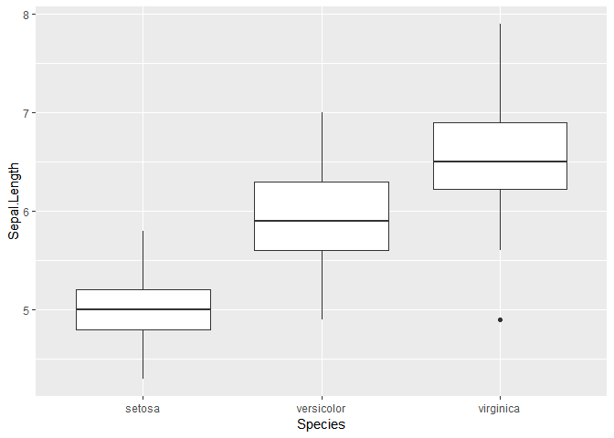<!-- -->

``` r
ggplot(iris, aes(x= Species, y = Sepal.Length)) + geom_boxplot(notch = T) + coord_flip()
```

<!-- -->

``` r
ggplot(iris, aes(x= Species, y = Sepal.Length)) +
  geom_boxplot(outlier.colour = "red", outlier.shape = 8, outlier.size = 4)
```

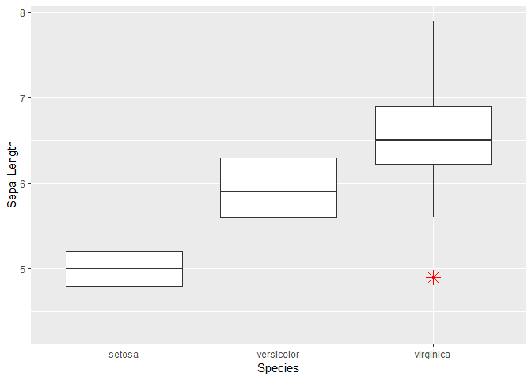<!-- -->

``` r
ggplot(iris, aes(x= Species, y = Sepal.Length)) +
  geom_boxplot(outlier.colour = "red", outlier.shape = 8, outlier.size = 4) +
  scale_x_discrete(limits = c("setosa", "virginica"))
```

    ## Warning: Removed 50 rows containing missing values (stat_boxplot).

<!-- -->

``` r
ggplot(iris, aes(x= Species, y = Sepal.Length)) +
  geom_boxplot(outlier.colour = "red", outlier.shape = 8, outlier.size = 4) +
  scale_x_discrete(limits = c("setosa", "virginica")) + # we can select x elements...
  geom_jitter()  
```

    ## Warning: Removed 50 rows containing missing values (stat_boxplot).

    ## Warning: Removed 50 rows containing missing values (geom_point).

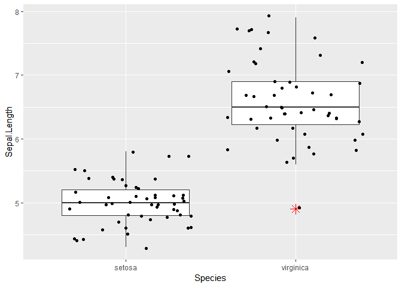<!-- -->

``` r
ggplot(iris, aes(x= Species, y = Sepal.Length, color = Species)) +
  geom_boxplot(outlier.colour = "red", outlier.shape = 8, outlier.size = 4, fill = "grey") +
  scale_x_discrete(limits = c("setosa", "virginica")) +
  geom_jitter() 
```

    ## Warning: Removed 50 rows containing missing values (stat_boxplot).
    
    ## Warning: Removed 50 rows containing missing values (geom_point).

<!-- -->

scatter plot…

``` r
plot(iris$Sepal.Length, iris$Sepal.Width,
     main = "Sepal Length vs Width of iris",
     xlab = "Sepal Length", ylab = "Petal Length", pch = 19)
lines(lowess(iris$Sepal.Length, iris$Sepal.Width))
```

<!-- -->

``` r
ggplot(iris, aes(Sepal.Length, Sepal.Width)) + 
  geom_point(aes(color = factor(Species))) +
  stat_smooth(method = "lm") +
  labs(title = "Sepal Length vs Width of iris",
       x = "Sepal Length of iris",
       y = "Sepal Length of iris")
```

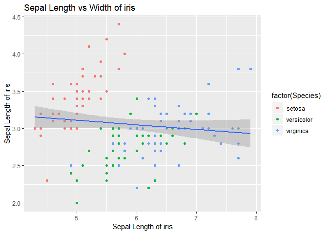<!-- -->

Lm with iris data…

``` r
m <- lm(Sepal.Length ~ ., data=iris)
summary(m) # Speciesversicolor, Speciesvirginica
```

    ## 
    ## Call:
    ## lm(formula = Sepal.Length ~ ., data = iris)
    ## 
    ## Residuals:
    ##      Min       1Q   Median       3Q      Max 
    ## -0.79424 -0.21874  0.00899  0.20255  0.73103 
    ## 
    ## Coefficients:
    ##                   Estimate Std. Error t value Pr(>|t|)    
    ## (Intercept)        2.17127    0.27979   7.760 1.43e-12 ***
    ## Sepal.Width        0.49589    0.08607   5.761 4.87e-08 ***
    ## Petal.Length       0.82924    0.06853  12.101  < 2e-16 ***
    ## Petal.Width       -0.31516    0.15120  -2.084  0.03889 *  
    ## Speciesversicolor -0.72356    0.24017  -3.013  0.00306 ** 
    ## Speciesvirginica  -1.02350    0.33373  -3.067  0.00258 ** 
    ## ---
    ## Signif. codes:  0 '***' 0.001 '**' 0.01 '*' 0.05 '.' 0.1 ' ' 1
    ## 
    ## Residual standard error: 0.3068 on 144 degrees of freedom
    ## Multiple R-squared:  0.8673, Adjusted R-squared:  0.8627 
    ## F-statistic: 188.3 on 5 and 144 DF,  p-value: < 2.2e-16

``` r
anova(m) # Species p-value check...What is the mean?
```

    ## Analysis of Variance Table
    ## 
    ## Response: Sepal.Length
    ##               Df Sum Sq Mean Sq  F value    Pr(>F)    
    ## Sepal.Width    1  1.412   1.412  15.0011 0.0001625 ***
    ## Petal.Length   1 84.427  84.427 896.8059 < 2.2e-16 ***
    ## Petal.Width    1  1.883   1.883  20.0055 1.556e-05 ***
    ## Species        2  0.889   0.444   4.7212 0.0103288 *  
    ## Residuals    144 13.556   0.094                       
    ## ---
    ## Signif. codes:  0 '***' 0.001 '**' 0.01 '*' 0.05 '.' 0.1 ' ' 1

``` r
plot(m, which = 1)
```

<!-- -->

``` r
plot(m, which = 2)
```

<!-- -->

``` r
plot(m, which = 3)
```

<!-- -->

``` r
plot(m, which = 4)
```

<!-- -->

``` r
plot(m, which = 5)
```

<!-- -->

``` r
plot(m, which = 6)
```

<!-- -->

Using dummy variables…

``` r
levels(iris$Species)
```

    ## [1] "setosa"     "versicolor" "virginica"

``` r
library(dummies)
```

    ## dummies-1.5.6 provided by Decision Patterns

``` r
str(iris)
```

    ## 'data.frame':    150 obs. of  5 variables:
    ##  $ Sepal.Length: num  5.1 4.9 4.7 4.6 5 5.4 4.6 5 4.4 4.9 ...
    ##  $ Sepal.Width : num  3.5 3 3.2 3.1 3.6 3.9 3.4 3.4 2.9 3.1 ...
    ##  $ Petal.Length: num  1.4 1.4 1.3 1.5 1.4 1.7 1.4 1.5 1.4 1.5 ...
    ##  $ Petal.Width : num  0.2 0.2 0.2 0.2 0.2 0.4 0.3 0.2 0.2 0.1 ...
    ##  $ Species     : Factor w/ 3 levels "setosa","versicolor",..: 1 1 1 1 1 1 1 1 1 1 ...

``` r
iris_dummy <- dummy.data.frame(iris, names=c('Species'), sep='_')
head(iris_dummy)
```

    ##   Sepal.Length Sepal.Width Petal.Length Petal.Width Species_setosa
    ## 1          5.1         3.5          1.4         0.2              1
    ## 2          4.9         3.0          1.4         0.2              1
    ## 3          4.7         3.2          1.3         0.2              1
    ## 4          4.6         3.1          1.5         0.2              1
    ## 5          5.0         3.6          1.4         0.2              1
    ## 6          5.4         3.9          1.7         0.4              1
    ##   Species_versicolor Species_virginica
    ## 1                  0                 0
    ## 2                  0                 0
    ## 3                  0                 0
    ## 4                  0                 0
    ## 5                  0                 0
    ## 6                  0                 0

``` r
iris %>%
  as_tibble() %>%
  tibble :: rowid_to_column("ID") %>%
  mutate(yesno = 1) %>%
  spread(Species, yesno, fill = 0) -> iris_dummy 

iris_dummy
```

    ## # A tibble: 150 x 8
    ##       ID Sepal.Length Sepal.Width Petal.Length Petal.Width setosa
    ##    <int>        <dbl>       <dbl>        <dbl>       <dbl>  <dbl>
    ##  1     1          5.1         3.5          1.4         0.2      1
    ##  2     2          4.9         3            1.4         0.2      1
    ##  3     3          4.7         3.2          1.3         0.2      1
    ##  4     4          4.6         3.1          1.5         0.2      1
    ##  5     5          5           3.6          1.4         0.2      1
    ##  6     6          5.4         3.9          1.7         0.4      1
    ##  7     7          4.6         3.4          1.4         0.3      1
    ##  8     8          5           3.4          1.5         0.2      1
    ##  9     9          4.4         2.9          1.4         0.2      1
    ## 10    10          4.9         3.1          1.5         0.1      1
    ## # … with 140 more rows, and 2 more variables: versicolor <dbl>,
    ## #   virginica <dbl>

``` r
m <- lm(Sepal.Length ~ ., data=iris_dummy)

summary(m)
```

    ## 
    ## Call:
    ## lm(formula = Sepal.Length ~ ., data = iris_dummy)
    ## 
    ## Residuals:
    ##      Min       1Q   Median       3Q      Max 
    ## -0.79388 -0.21809  0.00901  0.20300  0.73150 
    ## 
    ## Coefficients: (1 not defined because of singularities)
    ##                Estimate Std. Error t value Pr(>|t|)    
    ## (Intercept)   1.153e+00  4.411e-01   2.614  0.00991 ** 
    ## ID           -3.606e-05  1.767e-03  -0.020  0.98374    
    ## Sepal.Width   4.960e-01  8.645e-02   5.737 5.54e-08 ***
    ## Petal.Length  8.290e-01  6.973e-02  11.888  < 2e-16 ***
    ## Petal.Width  -3.150e-01  1.519e-01  -2.075  0.03982 *  
    ## setosa        1.019e+00  3.977e-01   2.562  0.01143 *  
    ## versicolor    2.979e-01  1.546e-01   1.928  0.05589 .  
    ## virginica            NA         NA      NA       NA    
    ## ---
    ## Signif. codes:  0 '***' 0.001 '**' 0.01 '*' 0.05 '.' 0.1 ' ' 1
    ## 
    ## Residual standard error: 0.3079 on 143 degrees of freedom
    ## Multiple R-squared:  0.8673, Adjusted R-squared:  0.8617 
    ## F-statistic: 155.8 on 6 and 143 DF,  p-value: < 2.2e-16

``` r
anova(m)
```

    ## Analysis of Variance Table
    ## 
    ## Response: Sepal.Length
    ##               Df Sum Sq Mean Sq  F value    Pr(>F)    
    ## ID             1 52.476  52.476 553.5445 < 2.2e-16 ***
    ## Sepal.Width    1  3.554   3.554  37.4889 8.401e-09 ***
    ## Petal.Length   1 30.757  30.757 324.4404 < 2.2e-16 ***
    ## Petal.Width    1  1.134   1.134  11.9576 0.0007172 ***
    ## setosa         1  0.339   0.339   3.5744 0.0606983 .  
    ## versicolor     1  0.352   0.352   3.7155 0.0558903 .  
    ## Residuals    143 13.556   0.095                       
    ## ---
    ## Signif. codes:  0 '***' 0.001 '**' 0.01 '*' 0.05 '.' 0.1 ' ' 1

One factor variable…(Success-Fail, binom.test)

barplot() \>\> table(), prop.table() \>\> binom.test

``` r
data("GermanCredit")
glimpse(GermanCredit)
```

    ## Observations: 1,000
    ## Variables: 62
    ## $ Duration                               <int> 6, 48, 12, 42, 24, 36, 24…
    ## $ Amount                                 <int> 1169, 5951, 2096, 7882, 4…
    ## $ InstallmentRatePercentage              <int> 4, 2, 2, 2, 3, 2, 3, 2, 2…
    ## $ ResidenceDuration                      <int> 4, 2, 3, 4, 4, 4, 4, 2, 4…
    ## $ Age                                    <int> 67, 22, 49, 45, 53, 35, 5…
    ## $ NumberExistingCredits                  <int> 2, 1, 1, 1, 2, 1, 1, 1, 1…
    ## $ NumberPeopleMaintenance                <int> 1, 1, 2, 2, 2, 2, 1, 1, 1…
    ## $ Telephone                              <dbl> 0, 1, 1, 1, 1, 0, 1, 0, 1…
    ## $ ForeignWorker                          <dbl> 1, 1, 1, 1, 1, 1, 1, 1, 1…
    ## $ Class                                  <fct> Good, Bad, Good, Good, Ba…
    ## $ CheckingAccountStatus.lt.0             <dbl> 1, 0, 0, 1, 1, 0, 0, 0, 0…
    ## $ CheckingAccountStatus.0.to.200         <dbl> 0, 1, 0, 0, 0, 0, 0, 1, 0…
    ## $ CheckingAccountStatus.gt.200           <dbl> 0, 0, 0, 0, 0, 0, 0, 0, 0…
    ## $ CheckingAccountStatus.none             <dbl> 0, 0, 1, 0, 0, 1, 1, 0, 1…
    ## $ CreditHistory.NoCredit.AllPaid         <dbl> 0, 0, 0, 0, 0, 0, 0, 0, 0…
    ## $ CreditHistory.ThisBank.AllPaid         <dbl> 0, 0, 0, 0, 0, 0, 0, 0, 0…
    ## $ CreditHistory.PaidDuly                 <dbl> 0, 1, 0, 1, 0, 1, 1, 1, 1…
    ## $ CreditHistory.Delay                    <dbl> 0, 0, 0, 0, 1, 0, 0, 0, 0…
    ## $ CreditHistory.Critical                 <dbl> 1, 0, 1, 0, 0, 0, 0, 0, 0…
    ## $ Purpose.NewCar                         <dbl> 0, 0, 0, 0, 1, 0, 0, 0, 0…
    ## $ Purpose.UsedCar                        <dbl> 0, 0, 0, 0, 0, 0, 0, 1, 0…
    ## $ Purpose.Furniture.Equipment            <dbl> 0, 0, 0, 1, 0, 0, 1, 0, 0…
    ## $ Purpose.Radio.Television               <dbl> 1, 1, 0, 0, 0, 0, 0, 0, 1…
    ## $ Purpose.DomesticAppliance              <dbl> 0, 0, 0, 0, 0, 0, 0, 0, 0…
    ## $ Purpose.Repairs                        <dbl> 0, 0, 0, 0, 0, 0, 0, 0, 0…
    ## $ Purpose.Education                      <dbl> 0, 0, 1, 0, 0, 1, 0, 0, 0…
    ## $ Purpose.Vacation                       <dbl> 0, 0, 0, 0, 0, 0, 0, 0, 0…
    ## $ Purpose.Retraining                     <dbl> 0, 0, 0, 0, 0, 0, 0, 0, 0…
    ## $ Purpose.Business                       <dbl> 0, 0, 0, 0, 0, 0, 0, 0, 0…
    ## $ Purpose.Other                          <dbl> 0, 0, 0, 0, 0, 0, 0, 0, 0…
    ## $ SavingsAccountBonds.lt.100             <dbl> 0, 1, 1, 1, 1, 0, 0, 1, 0…
    ## $ SavingsAccountBonds.100.to.500         <dbl> 0, 0, 0, 0, 0, 0, 0, 0, 0…
    ## $ SavingsAccountBonds.500.to.1000        <dbl> 0, 0, 0, 0, 0, 0, 1, 0, 0…
    ## $ SavingsAccountBonds.gt.1000            <dbl> 0, 0, 0, 0, 0, 0, 0, 0, 1…
    ## $ SavingsAccountBonds.Unknown            <dbl> 1, 0, 0, 0, 0, 1, 0, 0, 0…
    ## $ EmploymentDuration.lt.1                <dbl> 0, 0, 0, 0, 0, 0, 0, 0, 0…
    ## $ EmploymentDuration.1.to.4              <dbl> 0, 1, 0, 0, 1, 1, 0, 1, 0…
    ## $ EmploymentDuration.4.to.7              <dbl> 0, 0, 1, 1, 0, 0, 0, 0, 1…
    ## $ EmploymentDuration.gt.7                <dbl> 1, 0, 0, 0, 0, 0, 1, 0, 0…
    ## $ EmploymentDuration.Unemployed          <dbl> 0, 0, 0, 0, 0, 0, 0, 0, 0…
    ## $ Personal.Male.Divorced.Seperated       <dbl> 0, 0, 0, 0, 0, 0, 0, 0, 1…
    ## $ Personal.Female.NotSingle              <dbl> 0, 1, 0, 0, 0, 0, 0, 0, 0…
    ## $ Personal.Male.Single                   <dbl> 1, 0, 1, 1, 1, 1, 1, 1, 0…
    ## $ Personal.Male.Married.Widowed          <dbl> 0, 0, 0, 0, 0, 0, 0, 0, 0…
    ## $ Personal.Female.Single                 <dbl> 0, 0, 0, 0, 0, 0, 0, 0, 0…
    ## $ OtherDebtorsGuarantors.None            <dbl> 1, 1, 1, 0, 1, 1, 1, 1, 1…
    ## $ OtherDebtorsGuarantors.CoApplicant     <dbl> 0, 0, 0, 0, 0, 0, 0, 0, 0…
    ## $ OtherDebtorsGuarantors.Guarantor       <dbl> 0, 0, 0, 1, 0, 0, 0, 0, 0…
    ## $ Property.RealEstate                    <dbl> 1, 1, 1, 0, 0, 0, 0, 0, 1…
    ## $ Property.Insurance                     <dbl> 0, 0, 0, 1, 0, 0, 1, 0, 0…
    ## $ Property.CarOther                      <dbl> 0, 0, 0, 0, 0, 0, 0, 1, 0…
    ## $ Property.Unknown                       <dbl> 0, 0, 0, 0, 1, 1, 0, 0, 0…
    ## $ OtherInstallmentPlans.Bank             <dbl> 0, 0, 0, 0, 0, 0, 0, 0, 0…
    ## $ OtherInstallmentPlans.Stores           <dbl> 0, 0, 0, 0, 0, 0, 0, 0, 0…
    ## $ OtherInstallmentPlans.None             <dbl> 1, 1, 1, 1, 1, 1, 1, 1, 1…
    ## $ Housing.Rent                           <dbl> 0, 0, 0, 0, 0, 0, 0, 1, 0…
    ## $ Housing.Own                            <dbl> 1, 1, 1, 0, 0, 0, 1, 0, 1…
    ## $ Housing.ForFree                        <dbl> 0, 0, 0, 1, 1, 1, 0, 0, 0…
    ## $ Job.UnemployedUnskilled                <dbl> 0, 0, 0, 0, 0, 0, 0, 0, 0…
    ## $ Job.UnskilledResident                  <dbl> 0, 0, 1, 0, 0, 1, 0, 0, 1…
    ## $ Job.SkilledEmployee                    <dbl> 1, 1, 0, 1, 1, 0, 1, 0, 0…
    ## $ Job.Management.SelfEmp.HighlyQualified <dbl> 0, 0, 0, 0, 0, 0, 0, 1, 0…

``` r
class(GermanCredit$Class)
```

    ## [1] "factor"

``` r
x <- GermanCredit$Class
str(x); glimpse(x)
```

    ##  Factor w/ 2 levels "Bad","Good": 2 1 2 2 1 2 2 2 2 1 ...

    ##  Factor w/ 2 levels "Bad","Good": 2 1 2 2 1 2 2 2 2 1 ...

Convert ‘Bad’, ‘Good’ factor var into 0, 1 numeric data…

factor() ==\>
as.numeric()…

``` r
x <- as.numeric(factor(x, levels = c('Bad', 'Good'), labels = c(0, 1))) - 1
class(x)
```

    ## [1] "numeric"

``` r
x[1:10]
```

    ##  [1] 1 0 1 1 0 1 1 1 1 0

Instead ifelse()…

``` r
x <- GermanCredit$Class
x <- ifelse(GermanCredit$Class == "Bad", 0, 1)
class(x)
```

    ## [1] "numeric"

``` r
x[1:10]
```

    ##  [1] 1 0 1 1 0 1 1 1 1 0

Response var(y) ~ Explainary var(x)

continuous var x, continuous var y: lm model

Scatter Plot -\> Cor() -\> LM -\> LOESS…

``` r
head(mpg)
```

    ## # A tibble: 6 x 11
    ##   manufacturer model displ  year   cyl trans  drv     cty   hwy fl    class
    ##   <chr>        <chr> <dbl> <int> <int> <chr>  <chr> <int> <int> <chr> <chr>
    ## 1 audi         a4      1.8  1999     4 auto(… f        18    29 p     comp…
    ## 2 audi         a4      1.8  1999     4 manua… f        21    29 p     comp…
    ## 3 audi         a4      2    2008     4 manua… f        20    31 p     comp…
    ## 4 audi         a4      2    2008     4 auto(… f        21    30 p     comp…
    ## 5 audi         a4      2.8  1999     6 auto(… f        16    26 p     comp…
    ## 6 audi         a4      2.8  1999     6 manua… f        18    26 p     comp…

``` r
plot(hwy ~ cty, data=mpg)
```

<!-- -->

``` r
with(mpg, cor(cty, hwy))
```

    ## [1] 0.9559159

``` r
with(mpg, cor(cty, hwy, method='spearman')) # spearman : many outliers...
```

    ## [1] 0.9542104

``` r
model <- lm(hwy ~ cty, data=mpg)
summary(model) # t-value, p-value, adjusted R's means...
```

    ## 
    ## Call:
    ## lm(formula = hwy ~ cty, data = mpg)
    ## 
    ## Residuals:
    ##     Min      1Q  Median      3Q     Max 
    ## -5.3408 -1.2790  0.0214  1.0338  4.0461 
    ## 
    ## Coefficients:
    ##             Estimate Std. Error t value Pr(>|t|)    
    ## (Intercept)  0.89204    0.46895   1.902   0.0584 .  
    ## cty          1.33746    0.02697  49.585   <2e-16 ***
    ## ---
    ## Signif. codes:  0 '***' 0.001 '**' 0.01 '*' 0.05 '.' 0.1 ' ' 1
    ## 
    ## Residual standard error: 1.752 on 232 degrees of freedom
    ## Multiple R-squared:  0.9138, Adjusted R-squared:  0.9134 
    ## F-statistic:  2459 on 1 and 232 DF,  p-value: < 2.2e-16

``` r
par(mfrow=c(2, 2))
plot(model) # 4가지 그래프 해석
```

<!-- -->

``` r
par(mfrow=c(1,1))
```

가정 진단 :: 선형, 잔차의 분포 독립, 잔차의 분포 동일, 잔차의 정규분포 등
확인

``` r
plot(model, which = 1)
```

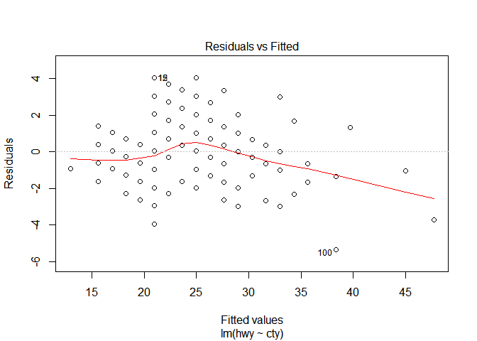<!-- -->

Residuals vs Fitted는 X 축에 선형 회귀로 예측된 Y 값, Y 축에는 잔차를 보여준다. 선형 회귀에서 오차는
평균이 0이고 분산이 일정한 정규 분포를 가정하였으므로, 예측된 Y 값과 무관하게 잔차의 평균은 0이고 분산은 일정해야
한다. 따라서 이 그래프에서는 기울기 0인 직선이 관측되는 것이
이상적이다.

``` r
plot(model, which = 2)
```

<!-- -->

``` r
plot(model, which = 3)
```

<!-- -->

Scale-Location은 X 축에 선형 회귀로 예측된 Y 값, Y 축에 표준화 잔차Standardized Residual3 를
보여준다. 이 경우도 기울기가 0인 직선이 이상적이다. 만약 특정 위치에서 0에서 멀리 떨어진 값이 관찰된다면 해당 점에 대해서
표준화 잔차가 크다, 즉, 회귀 직선이 해당 Y를 잘 적합하지 못한다는 의미다. 이런 점들은 이상치outlier일 가능성이
있다.

``` r
plot(model, which = 4)
```

<!-- -->

``` r
plot(model, which = 5)
```

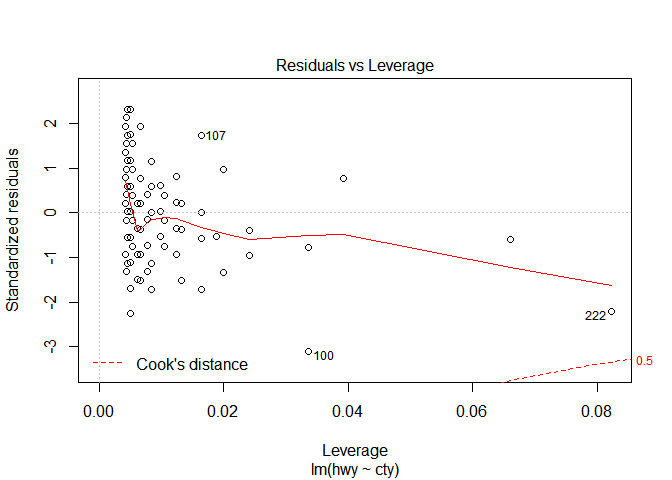<!-- -->

Residuals vs Leverage는 X 축에 레버리지Leverage, Y 축에 표준화 잔차를 보여준다. 레버리지는 설명
변수가 얼마나 극단에 치우쳐 있는지를 뜻한다. 예를 들어, 다른 데이터의 X 값은 모두 1 ~ 10 사이의 값인데 특정
데이터만 99999 값이라면 해당 데이터의 레버리지는 큰 값이 된다. 이런 데이터는 입력이 잘못되었거나, 해당 범위의 설명
변숫값을 가지는 데이터를 보충해야 하는 작업 등이 필요하므로 유심히 살펴봐야 한다.

네 번째 차트의 우측 상단과 우측 하단에는 선으로 쿡의 거리Cook’s Distance가 표시되어 있다. 쿡의 거리는 회귀 직선의
모양(기울기나 절편 등)에 크게 영향을 끼치는 점들을 찾는 방법이다. 쿡의 거리는 레버리지와 잔차에 비례하므로 두 값이 큰 우측
상단과 우측 하단에 쿡의 거리가 큰 값들이 위치하게
된다.

``` r
plot(model, which = 6)
```

<!-- -->

``` r
yhat_model <-predict(model, newdata = data.frame(cty=c(10,20,20))); yhat_model # newdata as data.frame() in predict()
```

    ##        1        2        3 
    ## 14.26660 27.64115 27.64115

``` r
plot(mpg$hwy, mpg$cty)
abline(coef(model)) 
```

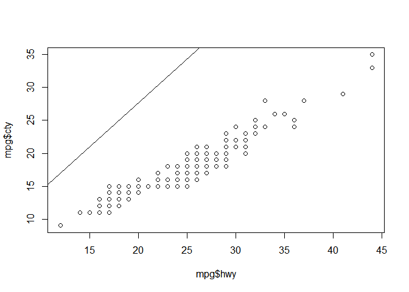<!-- -->

With cars data…

``` r
head(cars)
```

    ##   speed dist
    ## 1     4    2
    ## 2     4   10
    ## 3     7    4
    ## 4     7   22
    ## 5     8   16
    ## 6     9   10

``` r
plot(cars$speed, cars$dist)
abline(coef(model))
```

<!-- -->

LOESS…

``` r
str(mpg); unique(mpg$hwy)
```

    ## Classes 'tbl_df', 'tbl' and 'data.frame':    234 obs. of  11 variables:
    ##  $ manufacturer: chr  "audi" "audi" "audi" "audi" ...
    ##  $ model       : chr  "a4" "a4" "a4" "a4" ...
    ##  $ displ       : num  1.8 1.8 2 2 2.8 2.8 3.1 1.8 1.8 2 ...
    ##  $ year        : int  1999 1999 2008 2008 1999 1999 2008 1999 1999 2008 ...
    ##  $ cyl         : int  4 4 4 4 6 6 6 4 4 4 ...
    ##  $ trans       : chr  "auto(l5)" "manual(m5)" "manual(m6)" "auto(av)" ...
    ##  $ drv         : chr  "f" "f" "f" "f" ...
    ##  $ cty         : int  18 21 20 21 16 18 18 18 16 20 ...
    ##  $ hwy         : int  29 29 31 30 26 26 27 26 25 28 ...
    ##  $ fl          : chr  "p" "p" "p" "p" ...
    ##  $ class       : chr  "compact" "compact" "compact" "compact" ...

    ##  [1] 29 31 30 26 27 25 28 24 23 20 15 17 19 14 22 21 18 12 16 33 32 34 36
    ## [24] 35 37 44 41

``` r
with(mpg, plot(displ, hwy))
```

<!-- -->

``` r
model <- loess(hwy ~ displ, data=mpg)
plot(model)
```

<!-- -->

``` r
mpg %>% ggplot(aes(displ, hwy)) + geom_point() + geom_smooth()
```

    ## `geom_smooth()` using method = 'loess' and formula 'y ~ x'

<!-- -->

Factor var : x, Continuous var y: ANOVA…

수면제 종류에 따른 수면량 증가, 차종에 따라 연비 차이, 혈압약과 혈압 감소량

boxplot() -\> lm(y(연속형 변수) ~ x(범주형 변수)) -\> plot.lm()
잔차분포

``` r
mpg %>% ggplot(aes(class, hwy)) + geom_boxplot()
```

<!-- -->

``` r
m <- lm(hwy ~ class, data=mpg)
summary(m) # 다른 집단과 유의하게 다른 평균 연비
```

    ## 
    ## Call:
    ## lm(formula = hwy ~ class, data = mpg)
    ## 
    ## Residuals:
    ##     Min      1Q  Median      3Q     Max 
    ## -8.1429 -1.8788 -0.2927  1.1803 15.8571 
    ## 
    ## Coefficients:
    ##                 Estimate Std. Error t value Pr(>|t|)    
    ## (Intercept)       24.800      1.507  16.454  < 2e-16 ***
    ## classcompact       3.498      1.585   2.206   0.0284 *  
    ## classmidsize       2.493      1.596   1.561   0.1198    
    ## classminivan      -2.436      1.818  -1.340   0.1815    
    ## classpickup       -7.921      1.617  -4.898 1.84e-06 ***
    ## classsubcompact    3.343      1.611   2.075   0.0391 *  
    ## classsuv          -6.671      1.567  -4.258 3.03e-05 ***
    ## ---
    ## Signif. codes:  0 '***' 0.001 '**' 0.01 '*' 0.05 '.' 0.1 ' ' 1
    ## 
    ## Residual standard error: 3.37 on 227 degrees of freedom
    ## Multiple R-squared:  0.6879, Adjusted R-squared:  0.6797 
    ## F-statistic: 83.39 on 6 and 227 DF,  p-value: < 2.2e-16

연비의 총 변동량 중 차종으로 설명되는 비율, 모형의
    적합도

``` r
yhat_m <- predict(m, newdata=data.frame(class='pickup')); yhat_m[1:10]
```

    ##        1     <NA>     <NA>     <NA>     <NA>     <NA>     <NA>     <NA> 
    ## 16.87879       NA       NA       NA       NA       NA       NA       NA 
    ##     <NA>     <NA> 
    ##       NA       NA

가정진단 : 잔차의 분포 독립, 잔차의 분포 동일 (잔차는 정규분포) 분포 독립성과 이상치 유무 연속형 변수 x, 범주형 변수
y(예 : 성공, 실패) :: 온도와 O링의 실패 여부 등—- 산점도, 병렬상자 -\> glm() 로지스틱 & binomial
-\> plot() 잔차분포, 모형 가정
확인

``` r
chall <- read_table("data/o-ring-erosion-only.data.txt", col_names = FALSE)
```

    ## Parsed with column specification:
    ## cols(
    ##   X1 = col_double(),
    ##   X2 = col_double(),
    ##   X3 = col_double(),
    ##   X4 = col_double(),
    ##   X5 = col_double()
    ## )

``` r
head(chall)
```

    ## # A tibble: 6 x 5
    ##      X1    X2    X3    X4    X5
    ##   <dbl> <dbl> <dbl> <dbl> <dbl>
    ## 1     6     0    66    50     1
    ## 2     6     1    70    50     2
    ## 3     6     0    69    50     3
    ## 4     6     0    68    50     4
    ## 5     6     0    67    50     5
    ## 6     6     0    72    50     6

``` r
colnames(chall) <- c('o_ring_ct', 'distress_ct', 'temperature', 'pressure', 'flight_order')
glimpse(chall); head(chall)
```

    ## Observations: 23
    ## Variables: 5
    ## $ o_ring_ct    <dbl> 6, 6, 6, 6, 6, 6, 6, 6, 6, 6, 6, 6, 6, 6, 6, 6, 6, …
    ## $ distress_ct  <dbl> 0, 1, 0, 0, 0, 0, 0, 0, 1, 1, 1, 0, 0, 2, 0, 0, 0, …
    ## $ temperature  <dbl> 66, 70, 69, 68, 67, 72, 73, 70, 57, 63, 70, 78, 67,…
    ## $ pressure     <dbl> 50, 50, 50, 50, 50, 50, 100, 100, 200, 200, 200, 20…
    ## $ flight_order <dbl> 1, 2, 3, 4, 5, 6, 7, 8, 9, 10, 11, 12, 13, 14, 15, …

    ## # A tibble: 6 x 5
    ##   o_ring_ct distress_ct temperature pressure flight_order
    ##       <dbl>       <dbl>       <dbl>    <dbl>        <dbl>
    ## 1         6           0          66       50            1
    ## 2         6           1          70       50            2
    ## 3         6           0          69       50            3
    ## 4         6           0          68       50            4
    ## 5         6           0          67       50            5
    ## 6         6           0          72       50            6

``` r
chall %>% ggplot(aes(temperature, distress_ct)) + geom_point()
```

<!-- -->

``` r
chall %>% ggplot(aes(factor(distress_ct), temperature)) + geom_boxplot()
```

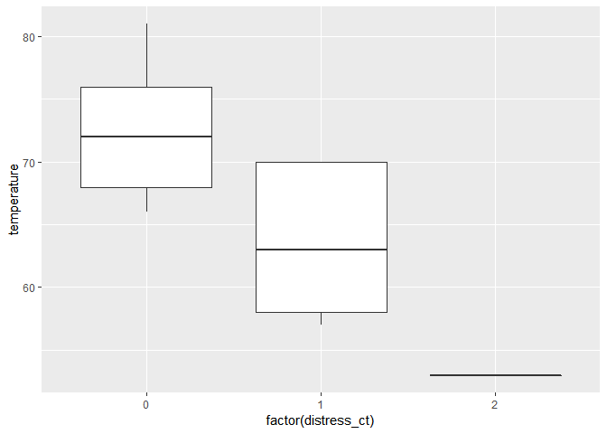<!-- -->

반응변수가 2차원 매트릭스(성공회수, 실패횟수)

``` r
model <- glm(cbind(distress_ct, o_ring_ct - distress_ct) ~ temperature, 
             data = chall, family='binomial') # 로지스틱 회귀
summary(model) # temperature의 효과 :: 온도 1도 상승할 때 로그 오즈비가 0.179 감소??
```

    ## 
    ## Call:
    ## glm(formula = cbind(distress_ct, o_ring_ct - distress_ct) ~ temperature, 
    ##     family = "binomial", data = chall)
    ## 
    ## Deviance Residuals: 
    ##     Min       1Q   Median       3Q      Max  
    ## -0.7526  -0.5533  -0.3388  -0.1901   1.5388  
    ## 
    ## Coefficients:
    ##             Estimate Std. Error z value Pr(>|z|)   
    ## (Intercept)  8.81692    3.60697   2.444  0.01451 * 
    ## temperature -0.17949    0.05822  -3.083  0.00205 **
    ## ---
    ## Signif. codes:  0 '***' 0.001 '**' 0.01 '*' 0.05 '.' 0.1 ' ' 1
    ## 
    ## (Dispersion parameter for binomial family taken to be 1)
    ## 
    ##     Null deviance: 20.706  on 22  degrees of freedom
    ## Residual deviance:  9.527  on 21  degrees of freedom
    ## AIC: 24.865
    ## 
    ## Number of Fisher Scoring iterations: 6

모형의 적합도 :: degree F가 1 줄었을때 deviance 충분히 감소 :: 적합

예측 ::
확률값

``` r
pred <- predict(model, data.frame(temperature=30), type='response'); pred[1:10]
```

    ##         1      <NA>      <NA>      <NA>      <NA>      <NA>      <NA> 
    ## 0.9686946        NA        NA        NA        NA        NA        NA 
    ##      <NA>      <NA>      <NA> 
    ##        NA        NA        NA

변수의 수가 많을 경우

1)  지도학습 :: 반응변수 예측(반응변수가 연속형변수 :: 회귀, 반응변수가 범주형변수 :: 분류)
2)  비지도학습 :: 변수들 간 / 관측치 간의 관계 군집 :: 관측치들 변수들간의 유사도로 그룹화 차원감소 :: 관측치들 간의
    유사도를 이용하여 변수의 수를 감소 분류 : 주어진 입력변수로 범주형 반응변수 예측(성공/실패)

신용카드 사용자 -\> 채무불이행 확률

투자할 회사 -\> 투자 성공 확률

웹 방문자, 사이트, 방문시간 -\> 광고 클릭 확률 선형회귀 (연속형, 수치형 반응변수 예측)—-

부동산 가격 예측 : 반응변수 medv

medv :: Median value of owner-occupied homes in $1000’s

``` r
read.table('./data/housing_data.csv') -> boston
names(boston) <- c('crim', 'zn', 'indus', 'chas', 'nox', 'rm', 'age', 'dis', 'rad',  
                   'tax', 'ptratio', 'black', 'lstat', 'medv')
glimpse(boston)
```

    ## Observations: 506
    ## Variables: 14
    ## $ crim    <dbl> 0.00632, 0.02731, 0.02729, 0.03237, 0.06905, 0.02985, 0.…
    ## $ zn      <dbl> 18.0, 0.0, 0.0, 0.0, 0.0, 0.0, 12.5, 12.5, 12.5, 12.5, 1…
    ## $ indus   <dbl> 2.31, 7.07, 7.07, 2.18, 2.18, 2.18, 7.87, 7.87, 7.87, 7.…
    ## $ chas    <int> 0, 0, 0, 0, 0, 0, 0, 0, 0, 0, 0, 0, 0, 0, 0, 0, 0, 0, 0,…
    ## $ nox     <dbl> 0.538, 0.469, 0.469, 0.458, 0.458, 0.458, 0.524, 0.524, …
    ## $ rm      <dbl> 6.575, 6.421, 7.185, 6.998, 7.147, 6.430, 6.012, 6.172, …
    ## $ age     <dbl> 65.2, 78.9, 61.1, 45.8, 54.2, 58.7, 66.6, 96.1, 100.0, 8…
    ## $ dis     <dbl> 4.0900, 4.9671, 4.9671, 6.0622, 6.0622, 6.0622, 5.5605, …
    ## $ rad     <int> 1, 2, 2, 3, 3, 3, 5, 5, 5, 5, 5, 5, 5, 4, 4, 4, 4, 4, 4,…
    ## $ tax     <dbl> 296, 242, 242, 222, 222, 222, 311, 311, 311, 311, 311, 3…
    ## $ ptratio <dbl> 15.3, 17.8, 17.8, 18.7, 18.7, 18.7, 15.2, 15.2, 15.2, 15…
    ## $ black   <dbl> 396.90, 396.90, 392.83, 394.63, 396.90, 394.12, 395.60, …
    ## $ lstat   <dbl> 4.98, 9.14, 4.03, 2.94, 5.33, 5.21, 12.43, 19.15, 29.93,…
    ## $ medv    <dbl> 24.0, 21.6, 34.7, 33.4, 36.2, 28.7, 22.9, 27.1, 16.5, 18…

``` r
set.seed(2018)
boston %>% sample_n(100) -> training
model <- lm(medv~., data=training)
summary(model) # 연관성이 높은 변수 :: lstat, rm
```

    ## 
    ## Call:
    ## lm(formula = medv ~ ., data = training)
    ## 
    ## Residuals:
    ##    Min     1Q Median     3Q    Max 
    ## -6.819 -2.243 -0.178  1.811 11.593 
    ## 
    ## Coefficients:
    ##               Estimate Std. Error t value Pr(>|t|)    
    ## (Intercept)  3.014e+01  9.038e+00   3.335  0.00126 ** 
    ## crim        -1.326e-01  8.043e-02  -1.648  0.10293    
    ## zn           5.400e-02  2.778e-02   1.944  0.05521 .  
    ## indus        9.344e-04  1.222e-01   0.008  0.99392    
    ## chas         1.599e+00  1.454e+00   1.100  0.27456    
    ## nox         -1.531e+01  6.871e+00  -2.228  0.02847 *  
    ## rm           4.107e+00  8.298e-01   4.949 3.67e-06 ***
    ## age          4.216e-02  2.292e-02   1.840  0.06929 .  
    ## dis         -1.021e+00  3.426e-01  -2.979  0.00375 ** 
    ## rad          4.206e-01  1.459e-01   2.883  0.00498 ** 
    ## tax         -1.813e-02  8.393e-03  -2.160  0.03357 *  
    ## ptratio     -8.383e-01  2.474e-01  -3.388  0.00106 ** 
    ## black        3.572e-03  4.739e-03   0.754  0.45308    
    ## lstat       -5.467e-01  9.720e-02  -5.624 2.28e-07 ***
    ## ---
    ## Signif. codes:  0 '***' 0.001 '**' 0.01 '*' 0.05 '.' 0.1 ' ' 1
    ## 
    ## Residual standard error: 3.732 on 86 degrees of freedom
    ## Multiple R-squared:  0.8195, Adjusted R-squared:  0.7922 
    ## F-statistic: 30.04 on 13 and 86 DF,  p-value: < 2.2e-16

lstat :: % lower status of the population

rm :: average number of rooms per
    dwelling

``` r
coef(model)
```

    ##   (Intercept)          crim            zn         indus          chas 
    ##  3.013755e+01 -1.325704e-01  5.399601e-02  9.344001e-04  1.599353e+00 
    ##           nox            rm           age           dis           rad 
    ## -1.531175e+01  4.106510e+00  4.215876e-02 -1.020776e+00  4.205842e-01 
    ##           tax       ptratio         black         lstat 
    ## -1.812666e-02 -8.383457e-01  3.572057e-03 -5.466580e-01

``` r
fitted(model)[1:4] # fitted value (171, 235, 31, 100 번째 데이터의 fitted value)
```

    ##        1        2        3        4 
    ## 21.99984 30.71507 12.30849 31.62034

``` r
boston$medv[c(171, 235, 31, 100)] # observed value
```

    ## [1] 17.4 29.0 12.7 33.2

``` r
residuals(model)[1:4] # observed value - fitted value
```

    ##          1          2          3          4 
    ## -4.5998368 -1.7150698  0.3915147  1.5796574

``` r
confint(model) # 신뢰구간 (정확한 의미 파악 필요)
```

    ##                     2.5 %      97.5 %
    ## (Intercept)  12.171283424 48.10382156
    ## crim         -0.292453076  0.02731231
    ## zn           -0.001230231  0.10922226
    ## indus        -0.242065760  0.24393456
    ## chas         -1.291991602  4.49069676
    ## nox         -28.971521821 -1.65197114
    ## rm            2.456995952  5.75602486
    ## age          -0.003400917  0.08771844
    ## dis          -1.701864282 -0.33968746
    ## rad           0.130526834  0.71064163
    ## tax          -0.034810644 -0.00144268
    ## ptratio      -1.330230982 -0.34646047
    ## black        -0.005849404  0.01299352
    ## lstat        -0.739883631 -0.35343230

``` r
par(mfrow=c(2, 2))
plot(model)
```

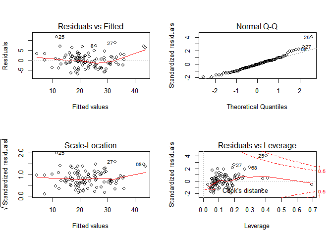<!-- -->

``` r
par(mfrow=c(1, 1))
```

with ad\_result.csv data—-

``` r
ad_result <- read_csv("data/ad_result.csv")
```

    ## Parsed with column specification:
    ## cols(
    ##   month = col_character(),
    ##   tvcm = col_double(),
    ##   magazine = col_double(),
    ##   install = col_double()
    ## )

``` r
m <- lm(install ~., data = ad_result[,c('install', 'tvcm', 'magazine')])
summary(m) # 유의미한 변수는?
```

    ## 
    ## Call:
    ## lm(formula = install ~ ., data = ad_result[, c("install", "tvcm", 
    ##     "magazine")])
    ## 
    ## Residuals:
    ##      Min       1Q   Median       3Q      Max 
    ## -1406.87  -984.49   -12.11   432.82  1985.84 
    ## 
    ## Coefficients:
    ##              Estimate Std. Error t value Pr(>|t|)   
    ## (Intercept) 1.882e+02  7.719e+03   0.024  0.98123   
    ## tvcm        1.361e-01  5.174e-02   2.630  0.03390 * 
    ## magazine    7.250e-01  1.693e-01   4.283  0.00364 **
    ## ---
    ## Signif. codes:  0 '***' 0.001 '**' 0.01 '*' 0.05 '.' 0.1 ' ' 1
    ## 
    ## Residual standard error: 1387 on 7 degrees of freedom
    ## Multiple R-squared:  0.9379, Adjusted R-squared:  0.9202 
    ## F-statistic: 52.86 on 2 and 7 DF,  p-value: 5.967e-05

``` r
data <- read.csv('./data/ad_result.csv'); head(data)
```

    ##    month  tvcm magazine install
    ## 1 Jan-13 63580    59550   53948
    ## 2 Feb-13 81760    60690   57300
    ## 3 Mar-13 68530    58620   52057
    ## 4 Apr-13 52710    52470   44044
    ## 5 May-13 64730    63650   54063
    ## 6 Jun-13 76820    65550   58097

``` r
data %>%
  select_if(is.numeric) %>%
  lm(install ~ ., .) -> m; summary(m)
```

    ## 
    ## Call:
    ## lm(formula = install ~ ., data = .)
    ## 
    ## Residuals:
    ##      Min       1Q   Median       3Q      Max 
    ## -1406.87  -984.49   -12.11   432.82  1985.84 
    ## 
    ## Coefficients:
    ##              Estimate Std. Error t value Pr(>|t|)   
    ## (Intercept) 1.882e+02  7.719e+03   0.024  0.98123   
    ## tvcm        1.361e-01  5.174e-02   2.630  0.03390 * 
    ## magazine    7.250e-01  1.693e-01   4.283  0.00364 **
    ## ---
    ## Signif. codes:  0 '***' 0.001 '**' 0.01 '*' 0.05 '.' 0.1 ' ' 1
    ## 
    ## Residual standard error: 1387 on 7 degrees of freedom
    ## Multiple R-squared:  0.9379, Adjusted R-squared:  0.9202 
    ## F-statistic: 52.86 on 2 and 7 DF,  p-value: 5.967e-05

``` r
coef(m)[1:10]
```

    ## (Intercept)        tvcm    magazine        <NA>        <NA>        <NA> 
    ## 188.1742748   0.1360921   0.7249809          NA          NA          NA 
    ##        <NA>        <NA>        <NA>        <NA> 
    ##          NA          NA          NA          NA

``` r
fitted(m)[1:10]
```

    ##        1        2        3        4        5        6        7        8 
    ## 52013.53 55314.16 52012.95 45401.34 55142.45 58165.27 48106.60 53227.89 
    ##        9       10 
    ## 49375.95 61369.87

``` r
residuals(m)[1:10]
```

    ##          1          2          3          4          5          6 
    ##  1934.4746  1985.8414    44.0508 -1357.3391 -1079.4531   -68.2707 
    ##          7          8          9         10 
    ##  -699.5959   105.1085   542.0546 -1406.8711

``` r
confint(m)[1:10]
```

    ##  [1] -1.806467e+04  1.373939e-02  3.247341e-01  1.844102e+04  2.584449e-01
    ##  [6]  1.125228e+00            NA            NA            NA            NA

with cars data—-

``` r
head(cars)
```

    ##   speed dist
    ## 1     4    2
    ## 2     4   10
    ## 3     7    4
    ## 4     7   22
    ## 5     8   16
    ## 6     9   10

``` r
m <- lm(dist ~ speed, data=cars)
predict(m, newdata = data.frame(speed=3)) # 예측
```

    ##         1 
    ## -5.781869

``` r
predict(m, newdata = data.frame(speed=3), interval = 'confidence') # 평균적인 차량의 신뢰구간
```

    ##         fit       lwr      upr
    ## 1 -5.781869 -17.02659 5.462853

``` r
predict(m, newdata = data.frame(speed=3), interval = 'prediction') # 특정속도 차량 한 대(오차)
```

    ##         fit       lwr      upr
    ## 1 -5.781869 -38.68565 27.12192

다중선형회귀—- Godd feature subsets contain features highly correlated with
the classification, yet uncorrelaetd to each other. 변수선택하기—-
전진선택법(forward selection), 후진소거법(backward selection),
단계선택법(step selection)…

``` r
m <- lm(medv ~., data = boston)
m2 <- step(m, direction = 'both')
```

    ## Start:  AIC=1589.64
    ## medv ~ crim + zn + indus + chas + nox + rm + age + dis + rad + 
    ##     tax + ptratio + black + lstat
    ## 
    ##           Df Sum of Sq   RSS    AIC
    ## - age      1      0.06 11079 1587.7
    ## - indus    1      2.52 11081 1587.8
    ## <none>                 11079 1589.6
    ## - chas     1    218.97 11298 1597.5
    ## - tax      1    242.26 11321 1598.6
    ## - crim     1    243.22 11322 1598.6
    ## - zn       1    257.49 11336 1599.3
    ## - black    1    270.63 11349 1599.8
    ## - rad      1    479.15 11558 1609.1
    ## - nox      1    487.16 11566 1609.4
    ## - ptratio  1   1194.23 12273 1639.4
    ## - dis      1   1232.41 12311 1641.0
    ## - rm       1   1871.32 12950 1666.6
    ## - lstat    1   2410.84 13490 1687.3
    ## 
    ## Step:  AIC=1587.65
    ## medv ~ crim + zn + indus + chas + nox + rm + dis + rad + tax + 
    ##     ptratio + black + lstat
    ## 
    ##           Df Sum of Sq   RSS    AIC
    ## - indus    1      2.52 11081 1585.8
    ## <none>                 11079 1587.7
    ## + age      1      0.06 11079 1589.6
    ## - chas     1    219.91 11299 1595.6
    ## - tax      1    242.24 11321 1596.6
    ## - crim     1    243.20 11322 1596.6
    ## - zn       1    260.32 11339 1597.4
    ## - black    1    272.26 11351 1597.9
    ## - rad      1    481.09 11560 1607.2
    ## - nox      1    520.87 11600 1608.9
    ## - ptratio  1   1200.23 12279 1637.7
    ## - dis      1   1352.26 12431 1643.9
    ## - rm       1   1959.55 13038 1668.0
    ## - lstat    1   2718.88 13798 1696.7
    ## 
    ## Step:  AIC=1585.76
    ## medv ~ crim + zn + chas + nox + rm + dis + rad + tax + ptratio + 
    ##     black + lstat
    ## 
    ##           Df Sum of Sq   RSS    AIC
    ## <none>                 11081 1585.8
    ## + indus    1      2.52 11079 1587.7
    ## + age      1      0.06 11081 1587.8
    ## - chas     1    227.21 11309 1594.0
    ## - crim     1    245.37 11327 1594.8
    ## - zn       1    257.82 11339 1595.4
    ## - black    1    270.82 11352 1596.0
    ## - tax      1    273.62 11355 1596.1
    ## - rad      1    500.92 11582 1606.1
    ## - nox      1    541.91 11623 1607.9
    ## - ptratio  1   1206.45 12288 1636.0
    ## - dis      1   1448.94 12530 1645.9
    ## - rm       1   1963.66 13045 1666.3
    ## - lstat    1   2723.48 13805 1695.0

``` r
formula(m2)
```

    ## medv ~ crim + zn + chas + nox + rm + dis + rad + tax + ptratio + 
    ##     black + lstat

predict(m2, newdata=…)

``` r
bio <- read.csv('./data/bio.csv')
glimpse(bio)
```

    ## Observations: 25
    ## Variables: 8
    ## $ age    <int> 7, 7, 8, 8, 8, 9, 11, 12, 12, 13, 13, 14, 14, 15, 16, 17,…
    ## $ weight <dbl> 13.1, 12.9, 14.1, 16.2, 21.5, 17.5, 30.7, 28.4, 25.1, 31.…
    ## $ bmp    <int> 68, 65, 64, 67, 93, 68, 89, 69, 67, 68, 89, 90, 93, 93, 6…
    ## $ fev    <int> 32, 19, 22, 41, 52, 44, 28, 18, 24, 23, 39, 26, 45, 45, 3…
    ## $ rv     <int> 258, 449, 441, 234, 202, 308, 305, 369, 312, 413, 206, 25…
    ## $ frc    <int> 183, 245, 268, 146, 131, 155, 179, 198, 194, 225, 142, 19…
    ## $ tlc    <int> 137, 134, 147, 124, 104, 118, 119, 103, 128, 136, 95, 121…
    ## $ pemax  <int> 95, 85, 100, 85, 95, 80, 65, 110, 70, 95, 110, 90, 100, 8…

``` r
str(bio)
```

    ## 'data.frame':    25 obs. of  8 variables:
    ##  $ age   : int  7 7 8 8 8 9 11 12 12 13 ...
    ##  $ weight: num  13.1 12.9 14.1 16.2 21.5 17.5 30.7 28.4 25.1 31.5 ...
    ##  $ bmp   : int  68 65 64 67 93 68 89 69 67 68 ...
    ##  $ fev   : int  32 19 22 41 52 44 28 18 24 23 ...
    ##  $ rv    : int  258 449 441 234 202 308 305 369 312 413 ...
    ##  $ frc   : int  183 245 268 146 131 155 179 198 194 225 ...
    ##  $ tlc   : int  137 134 147 124 104 118 119 103 128 136 ...
    ##  $ pemax : int  95 85 100 85 95 80 65 110 70 95 ...

전진소거법

``` r
step(lm(pemax~1, bio), 
     scope=list(lower=~1, upper=~age+weight+bmp+rv+frc+tlc), 
     direction = 'forward') # 변수를 weight와 bmp로 선택
```

    ## Start:  AIC=176.46
    ## pemax ~ 1
    ## 
    ##          Df Sum of Sq   RSS    AIC
    ## + weight  1   10827.2 16006 165.54
    ## + age     1   10098.5 16734 166.66
    ## + frc     1    4670.6 22162 173.68
    ## + rv      1    2671.8 24161 175.84
    ## <none>                26833 176.46
    ## + bmp     1    1413.5 25419 177.11
    ## + tlc     1     885.1 25948 177.62
    ## 
    ## Step:  AIC=165.55
    ## pemax ~ weight
    ## 
    ##        Df Sum of Sq   RSS    AIC
    ## + bmp   1   1914.94 14090 164.36
    ## <none>              16006 165.54
    ## + rv    1    274.55 15731 167.11
    ## + tlc   1    230.64 15775 167.18
    ## + age   1    216.51 15789 167.21
    ## + frc   1     27.34 15978 167.50
    ## 
    ## Step:  AIC=164.36
    ## pemax ~ weight + bmp
    ## 
    ##        Df Sum of Sq   RSS    AIC
    ## <none>              14090 164.36
    ## + age   1    681.28 13409 165.12
    ## + tlc   1     96.61 13994 166.19
    ## + frc   1     44.62 14046 166.28
    ## + rv    1     18.84 14072 166.33

    ## 
    ## Call:
    ## lm(formula = pemax ~ weight + bmp, data = bio)
    ## 
    ## Coefficients:
    ## (Intercept)       weight          bmp  
    ##     124.830        1.640       -1.005

후진소거법

``` r
step(lm(pemax~age+weight+bmp+rv+frc+tlc, bio), 
     direction = 'backward')
```

    ## Start:  AIC=168.53
    ## pemax ~ age + weight + bmp + rv + frc + tlc
    ## 
    ##          Df Sum of Sq   RSS    AIC
    ## - tlc     1    221.53 12310 166.98
    ## - age     1    858.27 12947 168.24
    ## - rv      1    918.75 13008 168.36
    ## <none>                12089 168.53
    ## - bmp     1   1241.20 13330 168.97
    ## - frc     1   1306.39 13395 169.09
    ## - weight  1   2960.06 15049 172.00
    ## 
    ## Step:  AIC=166.98
    ## pemax ~ age + weight + bmp + rv + frc
    ## 
    ##          Df Sum of Sq   RSS    AIC
    ## - rv      1     759.2 13070 166.48
    ## <none>                12310 166.98
    ## - frc     1    1090.7 13401 167.10
    ## - age     1    1263.1 13573 167.43
    ## - bmp     1    1984.6 14295 168.72
    ## - weight  1    3967.1 16277 171.97
    ## 
    ## Step:  AIC=166.48
    ## pemax ~ age + weight + bmp + frc
    ## 
    ##          Df Sum of Sq   RSS    AIC
    ## - frc     1     339.8 13409 165.12
    ## - age     1     976.4 14046 166.28
    ## <none>                13070 166.48
    ## - bmp     1    2716.5 15786 169.20
    ## - weight  1    3632.7 16702 170.61
    ## 
    ## Step:  AIC=165.12
    ## pemax ~ age + weight + bmp
    ## 
    ##          Df Sum of Sq   RSS    AIC
    ## - age     1     681.3 14090 164.36
    ## <none>                13409 165.12
    ## - bmp     1    2379.7 15789 167.21
    ## - weight  1    3324.7 16734 168.66
    ## 
    ## Step:  AIC=164.36
    ## pemax ~ weight + bmp
    ## 
    ##          Df Sum of Sq   RSS    AIC
    ## <none>                14090 164.36
    ## - bmp     1    1914.9 16006 165.54
    ## - weight  1   11328.6 25419 177.11

    ## 
    ## Call:
    ## lm(formula = pemax ~ weight + bmp, data = bio)
    ## 
    ## Coefficients:
    ## (Intercept)       weight          bmp  
    ##     124.830        1.640       -1.005

단계별
소거법

``` r
step(lm(pemax~1, bio), scope=list(lower=~1, upper=~age+weight+bmp+rv+frc+tlc), direction = 'both')
```

    ## Start:  AIC=176.46
    ## pemax ~ 1
    ## 
    ##          Df Sum of Sq   RSS    AIC
    ## + weight  1   10827.2 16006 165.54
    ## + age     1   10098.5 16734 166.66
    ## + frc     1    4670.6 22162 173.68
    ## + rv      1    2671.8 24161 175.84
    ## <none>                26833 176.46
    ## + bmp     1    1413.5 25419 177.11
    ## + tlc     1     885.1 25948 177.62
    ## 
    ## Step:  AIC=165.55
    ## pemax ~ weight
    ## 
    ##          Df Sum of Sq   RSS    AIC
    ## + bmp     1    1914.9 14090 164.36
    ## <none>                16006 165.54
    ## + rv      1     274.5 15731 167.11
    ## + tlc     1     230.6 15775 167.18
    ## + age     1     216.5 15789 167.21
    ## + frc     1      27.3 15978 167.50
    ## - weight  1   10827.2 26833 176.46
    ## 
    ## Step:  AIC=164.36
    ## pemax ~ weight + bmp
    ## 
    ##          Df Sum of Sq   RSS    AIC
    ## <none>                14090 164.36
    ## + age     1     681.3 13409 165.12
    ## - bmp     1    1914.9 16006 165.54
    ## + tlc     1      96.6 13994 166.19
    ## + frc     1      44.6 14046 166.28
    ## + rv      1      18.8 14072 166.33
    ## - weight  1   11328.6 25419 177.11

    ## 
    ## Call:
    ## lm(formula = pemax ~ weight + bmp, data = bio)
    ## 
    ## Coefficients:
    ## (Intercept)       weight          bmp  
    ##     124.830        1.640       -1.005

ANOVA 분산분석, 모델간 비교(다변량)—-

``` r
(full <- lm(dist ~ speed, data=cars))
```

    ## 
    ## Call:
    ## lm(formula = dist ~ speed, data = cars)
    ## 
    ## Coefficients:
    ## (Intercept)        speed  
    ##     -17.579        3.932

``` r
(reduced <- lm(dist ~ 1, data = cars))
```

    ## 
    ## Call:
    ## lm(formula = dist ~ 1, data = cars)
    ## 
    ## Coefficients:
    ## (Intercept)  
    ##       42.98

``` r
anova(reduced, full) # 1.49e-12 *** :: 이 두 모델간에는 유의한 차이가 있다.
```

    ## Analysis of Variance Table
    ## 
    ## Model 1: dist ~ 1
    ## Model 2: dist ~ speed
    ##   Res.Df   RSS Df Sum of Sq      F   Pr(>F)    
    ## 1     49 32539                                 
    ## 2     48 11354  1     21186 89.567 1.49e-12 ***
    ## ---
    ## Signif. codes:  0 '***' 0.001 '**' 0.01 '*' 0.05 '.' 0.1 ' ' 1

상호작용 확인—-

``` r
par(mfrow = c(1, 1))
head(Orange)
```

    ## Grouped Data: circumference ~ age | Tree
    ##   Tree  age circumference
    ## 1    1  118            30
    ## 2    1  484            58
    ## 3    1  664            87
    ## 4    1 1004           115
    ## 5    1 1231           120
    ## 6    1 1372           142

``` r
range(Orange$age)
```

    ## [1]  118 1582

``` r
with(Orange, interaction.plot(age, Tree, circumference)) # age, Tree와의 상호작용이 circumference에 어떤 영향??
```

<!-- -->

순서있는 범주형 -\> 순서없는 범주형 :: 이유는??

``` r
Orange[, 'ftree'] <- factor(Orange[, 'Tree'], ordered=F)

m <- lm(circumference ~ ftree*age, data=Orange)
m1 <- lm(circumference ~ ftree + age, data=Orange)
anova(m, m1) # p-value = 9.402e-05 *** 이므로 두 모형 간에는 유의한 차이가 있음, 교호작용이 있음.
```

    ## Analysis of Variance Table
    ## 
    ## Model 1: circumference ~ ftree * age
    ## Model 2: circumference ~ ftree + age
    ##   Res.Df    RSS Df Sum of Sq      F    Pr(>F)    
    ## 1     25 2711.0                                  
    ## 2     29 6753.9 -4   -4042.9 9.3206 9.402e-05 ***
    ## ---
    ## Signif. codes:  0 '***' 0.001 '**' 0.01 '*' 0.05 '.' 0.1 ' ' 1

``` r
model_2 <- lm(medv ~ .^2, data=training) # 2차 상호작용 모형
summary(model_2) # 대부분의 변수가 유의하지 않음
```

    ## 
    ## Call:
    ## lm(formula = medv ~ .^2, data = training)
    ## 
    ## Residuals:
    ##     Min      1Q  Median      3Q     Max 
    ## -3.7055 -0.3723  0.0000  0.3594  4.0787 
    ## 
    ## Coefficients: (5 not defined because of singularities)
    ##                 Estimate Std. Error t value Pr(>|t|)  
    ## (Intercept)   -7.283e+02  5.796e+02  -1.257   0.2310  
    ## crim          -9.672e+01  6.669e+01  -1.450   0.1707  
    ## zn             1.616e+00  5.050e+00   0.320   0.7541  
    ## indus         -1.208e+01  1.233e+01  -0.980   0.3449  
    ## chas           3.148e+02  1.981e+02   1.589   0.1360  
    ## nox            2.364e+02  4.632e+02   0.510   0.6183  
    ## rm             1.016e+02  4.447e+01   2.286   0.0397 *
    ## age            3.981e-01  1.543e+00   0.258   0.8004  
    ## dis           -2.077e+01  3.157e+01  -0.658   0.5220  
    ## rad           -1.455e+00  3.437e+01  -0.042   0.9669  
    ## tax            9.144e-01  1.829e+00   0.500   0.6254  
    ## ptratio        1.015e+01  2.175e+01   0.467   0.6483  
    ## black          8.413e-01  7.939e-01   1.060   0.3085  
    ## lstat          5.499e+00  5.799e+00   0.948   0.3603  
    ## crim:zn        1.230e+00  1.620e+00   0.759   0.4613  
    ## crim:indus    -2.883e-01  4.617e+00  -0.062   0.9512  
    ## crim:chas      4.204e+00  7.991e+00   0.526   0.6077  
    ## crim:nox       5.175e+00  5.372e+00   0.963   0.3529  
    ## crim:rm        9.991e-02  6.062e-01   0.165   0.8716  
    ## crim:age       1.196e-02  3.810e-02   0.314   0.7587  
    ## crim:dis       1.008e+00  8.722e-01   1.156   0.2685  
    ## crim:rad      -2.795e+00  6.028e+00  -0.464   0.6505  
    ## crim:tax       1.794e-01  4.487e-01   0.400   0.6958  
    ## crim:ptratio   2.084e+00  3.072e+00   0.678   0.5095  
    ## crim:black    -2.865e-03  1.914e-03  -1.497   0.1582  
    ## crim:lstat     3.386e-02  4.161e-02   0.814   0.4304  
    ## zn:indus      -9.560e-02  6.157e-02  -1.553   0.1445  
    ## zn:chas       -2.241e-01  5.033e-01  -0.445   0.6634  
    ## zn:nox        -2.828e-01  6.660e+00  -0.042   0.9668  
    ## zn:rm         -1.798e-01  2.658e-01  -0.676   0.5106  
    ## zn:age         2.373e-03  4.509e-03   0.526   0.6075  
    ## zn:dis        -4.294e-03  4.646e-02  -0.092   0.9278  
    ## zn:rad         4.478e-02  6.750e-02   0.663   0.5187  
    ## zn:tax        -1.249e-03  2.399e-03  -0.520   0.6115  
    ## zn:ptratio    -3.841e-02  4.807e-02  -0.799   0.4386  
    ## zn:black       2.213e-03  9.208e-03   0.240   0.8138  
    ## zn:lstat      -1.142e-02  3.333e-02  -0.343   0.7374  
    ## indus:chas    -5.382e+00  3.842e+00  -1.401   0.1847  
    ## indus:nox      9.060e+00  8.515e+00   1.064   0.3067  
    ## indus:rm       1.765e+00  1.180e+00   1.496   0.1586  
    ## indus:age     -4.014e-03  3.972e-02  -0.101   0.9211  
    ## indus:dis     -3.277e-01  4.923e-01  -0.666   0.5172  
    ## indus:rad      1.997e-01  5.848e-01   0.341   0.7382  
    ## indus:tax     -1.940e-03  1.086e-02  -0.179   0.8609  
    ## indus:ptratio -4.145e-01  3.393e-01  -1.221   0.2436  
    ## indus:black    1.177e-02  1.700e-02   0.692   0.5009  
    ## indus:lstat    8.974e-02  1.193e-01   0.752   0.4654  
    ## chas:nox       7.874e+01  2.119e+02   0.372   0.7161  
    ## chas:rm       -3.843e+01  2.624e+01  -1.464   0.1669  
    ## chas:age      -6.234e-01  5.904e-01  -1.056   0.3102  
    ## chas:dis      -4.234e+00  1.387e+01  -0.305   0.7650  
    ## chas:rad              NA         NA      NA       NA  
    ## chas:tax              NA         NA      NA       NA  
    ## chas:ptratio          NA         NA      NA       NA  
    ## chas:black            NA         NA      NA       NA  
    ## chas:lstat            NA         NA      NA       NA  
    ## nox:rm        -6.110e+01  4.289e+01  -1.425   0.1778  
    ## nox:age        1.411e+00  2.200e+00   0.641   0.5324  
    ## nox:dis        1.714e+01  3.493e+01   0.491   0.6317  
    ## nox:rad        6.181e+00  1.393e+01   0.444   0.6647  
    ## nox:tax       -7.280e-01  1.025e+00  -0.710   0.4900  
    ## nox:ptratio    9.463e-01  1.886e+01   0.050   0.9607  
    ## nox:black      2.700e-01  2.247e-01   1.202   0.2508  
    ## nox:lstat     -2.485e+00  4.272e+00  -0.582   0.5707  
    ## rm:age         4.645e-02  1.062e-01   0.437   0.6691  
    ## rm:dis         1.958e+00  3.147e+00   0.622   0.5445  
    ## rm:rad        -6.207e-01  2.333e+00  -0.266   0.7944  
    ## rm:tax        -2.902e-03  1.406e-01  -0.021   0.9838  
    ## rm:ptratio    -3.488e+00  1.949e+00  -1.789   0.0969 .
    ## rm:black      -3.749e-02  2.497e-02  -1.501   0.1571  
    ## rm:lstat      -4.625e-01  2.630e-01  -1.758   0.1022  
    ## age:dis        2.172e-02  5.682e-02   0.382   0.7084  
    ## age:rad        1.891e-02  4.376e-02   0.432   0.6727  
    ## age:tax       -1.641e-03  2.665e-03  -0.616   0.5486  
    ## age:ptratio    4.431e-03  4.688e-02   0.095   0.9261  
    ## age:black     -3.068e-03  1.211e-03  -2.533   0.0250 *
    ## age:lstat     -9.770e-03  1.681e-02  -0.581   0.5711  
    ## dis:rad       -5.087e-01  4.515e-01  -1.127   0.2803  
    ## dis:tax       -1.203e-03  2.175e-02  -0.055   0.9567  
    ## dis:ptratio    1.146e-01  1.011e+00   0.113   0.9115  
    ## dis:black     -1.094e-02  2.171e-02  -0.504   0.6228  
    ## dis:lstat      2.431e-01  3.332e-01   0.730   0.4785  
    ## rad:tax       -6.300e-03  1.318e-02  -0.478   0.6406  
    ## rad:ptratio   -6.217e-01  8.562e-01  -0.726   0.4806  
    ## rad:black      4.572e-02  3.209e-02   1.425   0.1778  
    ## rad:lstat     -6.989e-02  3.042e-01  -0.230   0.8219  
    ## tax:ptratio    4.143e-02  2.580e-02   1.606   0.1323  
    ## tax:black     -3.184e-03  2.268e-03  -1.404   0.1839  
    ## tax:lstat      6.717e-04  1.884e-02   0.036   0.9721  
    ## ptratio:black  1.519e-02  3.111e-02   0.488   0.6334  
    ## ptratio:lstat -1.321e-01  2.253e-01  -0.586   0.5677  
    ## black:lstat    4.708e-04  2.424e-03   0.194   0.8490  
    ## ---
    ## Signif. codes:  0 '***' 0.001 '**' 0.01 '*' 0.05 '.' 0.1 ' ' 1
    ## 
    ## Residual standard error: 2.524 on 13 degrees of freedom
    ## Multiple R-squared:  0.9875, Adjusted R-squared:  0.905 
    ## F-statistic: 11.96 on 86 and 13 DF,  p-value: 8.814e-06

``` r
length(coef(model_2)) # 많은 변수 : 과적합 / 해석 어려움
```

    ## [1] 92

선형회귀 실전—-

``` r
df_imdb <- read_csv('./data/imdb-5000-movie-dataset.zip')
```

    ## Parsed with column specification:
    ## cols(
    ##   .default = col_double(),
    ##   color = col_character(),
    ##   director_name = col_character(),
    ##   actor_2_name = col_character(),
    ##   genres = col_character(),
    ##   actor_1_name = col_character(),
    ##   movie_title = col_character(),
    ##   actor_3_name = col_character(),
    ##   plot_keywords = col_character(),
    ##   movie_imdb_link = col_character(),
    ##   language = col_character(),
    ##   country = col_character(),
    ##   content_rating = col_character()
    ## )

    ## See spec(...) for full column specifications.

``` r
summary(df_imdb)
```

    ##     color           director_name      num_critic_for_reviews
    ##  Length:5043        Length:5043        Min.   :  1.0         
    ##  Class :character   Class :character   1st Qu.: 50.0         
    ##  Mode  :character   Mode  :character   Median :110.0         
    ##                                        Mean   :140.2         
    ##                                        3rd Qu.:195.0         
    ##                                        Max.   :813.0         
    ##                                        NA's   :50            
    ##     duration     director_facebook_likes actor_3_facebook_likes
    ##  Min.   :  7.0   Min.   :    0.0         Min.   :    0.0       
    ##  1st Qu.: 93.0   1st Qu.:    7.0         1st Qu.:  133.0       
    ##  Median :103.0   Median :   49.0         Median :  371.5       
    ##  Mean   :107.2   Mean   :  686.5         Mean   :  645.0       
    ##  3rd Qu.:118.0   3rd Qu.:  194.5         3rd Qu.:  636.0       
    ##  Max.   :511.0   Max.   :23000.0         Max.   :23000.0       
    ##  NA's   :15      NA's   :104             NA's   :23            
    ##  actor_2_name       actor_1_facebook_likes     gross          
    ##  Length:5043        Min.   :     0         Min.   :      162  
    ##  Class :character   1st Qu.:   614         1st Qu.:  5340988  
    ##  Mode  :character   Median :   988         Median : 25517500  
    ##                     Mean   :  6560         Mean   : 48468408  
    ##                     3rd Qu.: 11000         3rd Qu.: 62309438  
    ##                     Max.   :640000         Max.   :760505847  
    ##                     NA's   :7              NA's   :884        
    ##     genres          actor_1_name       movie_title       
    ##  Length:5043        Length:5043        Length:5043       
    ##  Class :character   Class :character   Class :character  
    ##  Mode  :character   Mode  :character   Mode  :character  
    ##                                                          
    ##                                                          
    ##                                                          
    ##                                                          
    ##  num_voted_users   cast_total_facebook_likes actor_3_name      
    ##  Min.   :      5   Min.   :     0            Length:5043       
    ##  1st Qu.:   8594   1st Qu.:  1411            Class :character  
    ##  Median :  34359   Median :  3090            Mode  :character  
    ##  Mean   :  83668   Mean   :  9699                              
    ##  3rd Qu.:  96309   3rd Qu.: 13756                              
    ##  Max.   :1689764   Max.   :656730                              
    ##                                                                
    ##  facenumber_in_poster plot_keywords      movie_imdb_link   
    ##  Min.   : 0.000       Length:5043        Length:5043       
    ##  1st Qu.: 0.000       Class :character   Class :character  
    ##  Median : 1.000       Mode  :character   Mode  :character  
    ##  Mean   : 1.371                                            
    ##  3rd Qu.: 2.000                                            
    ##  Max.   :43.000                                            
    ##  NA's   :13                                                
    ##  num_user_for_reviews   language           country         
    ##  Min.   :   1.0       Length:5043        Length:5043       
    ##  1st Qu.:  65.0       Class :character   Class :character  
    ##  Median : 156.0       Mode  :character   Mode  :character  
    ##  Mean   : 272.8                                            
    ##  3rd Qu.: 326.0                                            
    ##  Max.   :5060.0                                            
    ##  NA's   :21                                                
    ##  content_rating         budget            title_year  
    ##  Length:5043        Min.   :2.180e+02   Min.   :1916  
    ##  Class :character   1st Qu.:6.000e+06   1st Qu.:1999  
    ##  Mode  :character   Median :2.000e+07   Median :2005  
    ##                     Mean   :3.975e+07   Mean   :2002  
    ##                     3rd Qu.:4.500e+07   3rd Qu.:2011  
    ##                     Max.   :1.222e+10   Max.   :2016  
    ##                     NA's   :492         NA's   :108   
    ##  actor_2_facebook_likes   imdb_score     aspect_ratio  
    ##  Min.   :     0         Min.   :1.600   Min.   : 1.18  
    ##  1st Qu.:   281         1st Qu.:5.800   1st Qu.: 1.85  
    ##  Median :   595         Median :6.600   Median : 2.35  
    ##  Mean   :  1652         Mean   :6.442   Mean   : 2.22  
    ##  3rd Qu.:   918         3rd Qu.:7.200   3rd Qu.: 2.35  
    ##  Max.   :137000         Max.   :9.500   Max.   :16.00  
    ##  NA's   :13                             NA's   :329    
    ##  movie_facebook_likes
    ##  Min.   :     0      
    ##  1st Qu.:     0      
    ##  Median :   166      
    ##  Mean   :  7526      
    ##  3rd Qu.:  3000      
    ##  Max.   :349000      
    ## 

``` r
df_imdb %>%
  ggplot(aes(content_rating)) + geom_bar()
```

<!-- -->

``` r
df_imdb %>% 
  filter(content_rating %in% c('G', 'PG', 'PG-13', 'R')) %>%
  ggplot(aes(content_rating, imdb_score)) + 
  geom_point(alpha=.3, color = 'grey') + 
  geom_jitter() + 
  geom_boxplot(alpha=.7)
```

<!-- -->

``` r
df_imdb %>%
  filter(content_rating %in% c("G", "PG", "PG-13", "R")) %>%
  ggplot(aes(imdb_score, fill=content_rating, linetype=content_rating)) + 
  geom_density(alpha=.3) # density plot..
```

<!-- -->

``` r
summary(lm(imdb_score ~ content_rating, 
           data = df_imdb %>% filter(content_rating %in% c('G', 'PG', 'PG-13', 'R'))))
```

    ## 
    ## Call:
    ## lm(formula = imdb_score ~ content_rating, data = df_imdb %>% 
    ##     filter(content_rating %in% c("G", "PG", "PG-13", "R")))
    ## 
    ## Residuals:
    ##     Min      1Q  Median      3Q     Max 
    ## -4.9295 -0.6271  0.0729  0.7425  2.7729 
    ## 
    ## Coefficients:
    ##                      Estimate Std. Error t value Pr(>|t|)    
    ## (Intercept)          6.529464   0.103061  63.356   <2e-16 ***
    ## content_ratingPG    -0.235028   0.110989  -2.118   0.0343 *  
    ## content_ratingPG-13 -0.271969   0.106938  -2.543   0.0110 *  
    ## content_ratingR     -0.002363   0.105750  -0.022   0.9822    
    ## ---
    ## Signif. codes:  0 '***' 0.001 '**' 0.01 '*' 0.05 '.' 0.1 ' ' 1
    ## 
    ## Residual standard error: 1.091 on 4388 degrees of freedom
    ## Multiple R-squared:  0.0139, Adjusted R-squared:  0.01322 
    ## F-statistic: 20.62 on 3 and 4388 DF,  p-value: 2.92e-13

등급 집단간에 평점 평균이 통계적으로 유의한 차이가 있음 ‘좋아요’ 개수와 리뷰 평점 사이의 관계

``` r
df_imdb %>%
  ggplot(aes(movie_facebook_likes)) + geom_histogram()
```

    ## `stat_bin()` using `bins = 30`. Pick better value with `binwidth`.

<!-- -->

``` r
df_imdb %>%
  ggplot(aes(movie_facebook_likes)) + geom_histogram(bins = 20) + scale_x_log10()
```

    ## Warning: Transformation introduced infinite values in continuous x-axis

    ## Warning: Removed 2181 rows containing non-finite values (stat_bin).

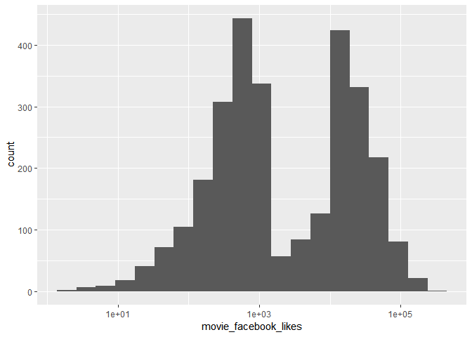<!-- -->

좋아요 개수와 스코어 간의 산점도

``` r
df_imdb %>%
  ggplot(aes(movie_facebook_likes, imdb_score)) + 
  geom_point() + 
  scale_x_log10() +
  geom_smooth()
```

    ## Warning: Transformation introduced infinite values in continuous x-axis
    
    ## Warning: Transformation introduced infinite values in continuous x-axis

    ## `geom_smooth()` using method = 'gam' and formula 'y ~ s(x, bs = "cs")'

    ## Warning: Removed 2181 rows containing non-finite values (stat_smooth).

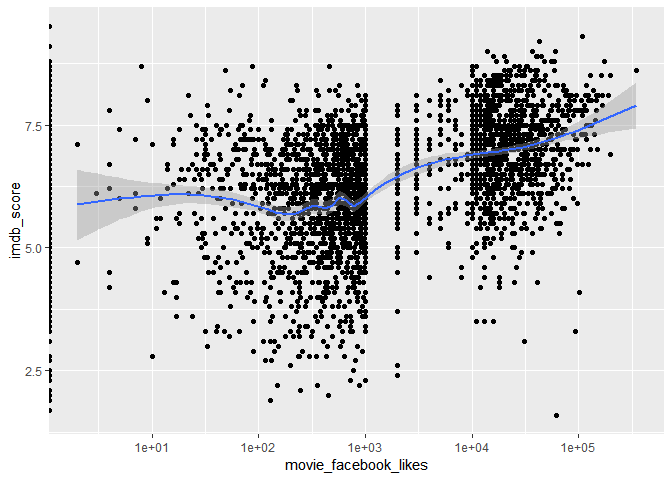<!-- -->

2010년 이전과 이후의 좋아요 개수의 분포가 상이함을 확인

``` r
df_imdb %>%
  ggplot(aes(as.factor(title_year), movie_facebook_likes)) +
  geom_boxplot() +
  scale_y_log10()
```

    ## Warning: Transformation introduced infinite values in continuous y-axis

    ## Warning: Removed 2181 rows containing non-finite values (stat_boxplot).

<!-- -->

``` r
df_imdb %>%
  filter(title_year > 2010 & country == 'USA') %>%
  ggplot(aes(movie_facebook_likes, imdb_score)) +
  geom_point() +
  scale_x_log10() +
  geom_smooth()
```

    ## Warning: Transformation introduced infinite values in continuous x-axis

    ## Warning: Transformation introduced infinite values in continuous x-axis

    ## `geom_smooth()` using method = 'loess' and formula 'y ~ x'

    ## Warning: Removed 230 rows containing non-finite values (stat_smooth).

<!-- -->

‘좋아요’ 100개 넘으면 두 변수 상관관계 높음

``` r
df_imdb_l00_more <- df_imdb %>%
  filter(title_year > 2010 & country == 'USA') %>%
  filter(movie_facebook_likes > 100)
head(df_imdb_l00_more); dim(df_imdb_l00_more)
```

    ## # A tibble: 6 x 28
    ##   color director_name num_critic_for_… duration director_facebo…
    ##   <chr> <chr>                    <dbl>    <dbl>            <dbl>
    ## 1 Color Christopher …              813      164            22000
    ## 2 Color Andrew Stant…              462      132              475
    ## 3 Color Joss Whedon                635      141                0
    ## 4 Color Zack Snyder                673      183                0
    ## 5 Color Gore Verbins…              450      150              563
    ## 6 Color Zack Snyder                733      143                0
    ## # … with 23 more variables: actor_3_facebook_likes <dbl>,
    ## #   actor_2_name <chr>, actor_1_facebook_likes <dbl>, gross <dbl>,
    ## #   genres <chr>, actor_1_name <chr>, movie_title <chr>,
    ## #   num_voted_users <dbl>, cast_total_facebook_likes <dbl>,
    ## #   actor_3_name <chr>, facenumber_in_poster <dbl>, plot_keywords <chr>,
    ## #   movie_imdb_link <chr>, num_user_for_reviews <dbl>, language <chr>,
    ## #   country <chr>, content_rating <chr>, budget <dbl>, title_year <dbl>,
    ## #   actor_2_facebook_likes <dbl>, imdb_score <dbl>, aspect_ratio <dbl>,
    ## #   movie_facebook_likes <dbl>

    ## [1] 667  28

``` r
cor(log10(df_imdb_l00_more$movie_facebook_likes), df_imdb_l00_more$imdb_score)
```

    ## [1] 0.4682827

‘좋아요’ 100개 넘으면 두 변수 상관관계 높음 로그변환 \>\> 선형모델의 해

``` r
m <- lm(imdb_score ~ log10(movie_facebook_likes), data=df_imdb_l00_more)
summary(m)
```

    ## 
    ## Call:
    ## lm(formula = imdb_score ~ log10(movie_facebook_likes), data = df_imdb_l00_more)
    ## 
    ## Residuals:
    ##     Min      1Q  Median      3Q     Max 
    ## -5.2173 -0.5197  0.0826  0.6478  2.9942 
    ## 
    ## Coefficients:
    ##                             Estimate Std. Error t value Pr(>|t|)    
    ## (Intercept)                  3.63497    0.20335   17.88   <2e-16 ***
    ## log10(movie_facebook_likes)  0.66405    0.04859   13.67   <2e-16 ***
    ## ---
    ## Signif. codes:  0 '***' 0.001 '**' 0.01 '*' 0.05 '.' 0.1 ' ' 1
    ## 
    ## Residual standard error: 1 on 665 degrees of freedom
    ## Multiple R-squared:  0.2193, Adjusted R-squared:  0.2181 
    ## F-statistic: 186.8 on 1 and 665 DF,  p-value: < 2.2e-16

다중공선성 :
(다변량)

``` r
ggpairs(mtcars[, c('mpg', 'disp', 'hp', 'wt', 'drat')]) # 독립변수간 높은 상관계수(.7 이상) 확인!
```

<!-- -->

``` r
m <- lm(mpg ~ disp + hp + wt + drat, data=mtcars)
summary(m)
```

    ## 
    ## Call:
    ## lm(formula = mpg ~ disp + hp + wt + drat, data = mtcars)
    ## 
    ## Residuals:
    ##     Min      1Q  Median      3Q     Max 
    ## -3.5077 -1.9052 -0.5057  0.9821  5.6883 
    ## 
    ## Coefficients:
    ##              Estimate Std. Error t value Pr(>|t|)    
    ## (Intercept) 29.148738   6.293588   4.631  8.2e-05 ***
    ## disp         0.003815   0.010805   0.353  0.72675    
    ## hp          -0.034784   0.011597  -2.999  0.00576 ** 
    ## wt          -3.479668   1.078371  -3.227  0.00327 ** 
    ## drat         1.768049   1.319779   1.340  0.19153    
    ## ---
    ## Signif. codes:  0 '***' 0.001 '**' 0.01 '*' 0.05 '.' 0.1 ' ' 1
    ## 
    ## Residual standard error: 2.602 on 27 degrees of freedom
    ## Multiple R-squared:  0.8376, Adjusted R-squared:  0.8136 
    ## F-statistic: 34.82 on 4 and 27 DF,  p-value: 2.704e-10

``` r
anova(m)
```

    ## Analysis of Variance Table
    ## 
    ## Response: mpg
    ##           Df Sum Sq Mean Sq  F value    Pr(>F)    
    ## disp       1 808.89  808.89 119.4502 2.041e-11 ***
    ## hp         1  33.67   33.67   4.9714  0.034281 *  
    ## wt         1  88.50   88.50  13.0694  0.001213 ** 
    ## drat       1  12.15   12.15   1.7947  0.191525    
    ## Residuals 27 182.84    6.77                       
    ## ---
    ## Signif. codes:  0 '***' 0.001 '**' 0.01 '*' 0.05 '.' 0.1 ' ' 1

분류모델평가—- with randomForest model applied with titanic dataset

``` r
read.csv('./data/titanic_preprocessed.csv') -> titanic; glimpse(titanic)
```

    ## Observations: 1,307
    ## Variables: 8
    ## $ pclass   <int> 1, 1, 1, 1, 1, 1, 1, 1, 1, 1, 1, 1, 1, 1, 1, 1, 1, 1, 1…
    ## $ sex      <int> 0, 1, 0, 1, 0, 1, 0, 1, 0, 1, 1, 0, 0, 0, 1, 1, 1, 0, 0…
    ## $ age      <dbl> 29.00, 0.92, 2.00, 30.00, 25.00, 48.00, 63.00, 39.00, 5…
    ## $ sibsp    <int> 0, 1, 1, 1, 1, 0, 1, 0, 2, 0, 1, 1, 0, 0, 0, 0, 0, 0, 0…
    ## $ parch    <int> 0, 2, 2, 2, 2, 0, 0, 0, 0, 0, 0, 0, 0, 0, 0, 0, 1, 1, 0…
    ## $ fare     <dbl> 211.3375, 151.5500, 151.5500, 151.5500, 151.5500, 26.55…
    ## $ embarked <int> 3, 3, 3, 3, 3, 3, 3, 3, 3, 1, 1, 1, 1, 3, 3, 3, 1, 1, 1…
    ## $ survived <fct> survived, survived, dead, dead, dead, survived, survive…

``` r
titanic$pclass <- as.factor(titanic$pclass)
titanic$sex <- as.factor(titanic$sex)
titanic$embarked <- as.factor(titanic$embarked)
glimpse(titanic)
```

    ## Observations: 1,307
    ## Variables: 8
    ## $ pclass   <fct> 1, 1, 1, 1, 1, 1, 1, 1, 1, 1, 1, 1, 1, 1, 1, 1, 1, 1, 1…
    ## $ sex      <fct> 0, 1, 0, 1, 0, 1, 0, 1, 0, 1, 1, 0, 0, 0, 1, 1, 1, 0, 0…
    ## $ age      <dbl> 29.00, 0.92, 2.00, 30.00, 25.00, 48.00, 63.00, 39.00, 5…
    ## $ sibsp    <int> 0, 1, 1, 1, 1, 0, 1, 0, 2, 0, 1, 1, 0, 0, 0, 0, 0, 0, 0…
    ## $ parch    <int> 0, 2, 2, 2, 2, 0, 0, 0, 0, 0, 0, 0, 0, 0, 0, 0, 1, 1, 0…
    ## $ fare     <dbl> 211.3375, 151.5500, 151.5500, 151.5500, 151.5500, 26.55…
    ## $ embarked <fct> 3, 3, 3, 3, 3, 3, 3, 3, 3, 1, 1, 1, 1, 3, 3, 3, 1, 1, 1…
    ## $ survived <fct> survived, survived, dead, dead, dead, survived, survive…

1)  학습/평가 데이터셋 분리

<!-- end list -->

``` r
nrow(titanic)
```

    ## [1] 1307

``` r
idx <- createDataPartition(titanic$survived, p=.8, list=F)
titanic.train <- titanic[idx, ]
titanic.test <- titanic[-idx, ]
head(titanic.train)
```

    ##   pclass sex   age sibsp parch     fare embarked survived
    ## 1      1   0 29.00     0     0 211.3375        3 survived
    ## 2      1   1  0.92     1     2 151.5500        3 survived
    ## 3      1   0  2.00     1     2 151.5500        3     dead
    ## 4      1   1 30.00     1     2 151.5500        3     dead
    ## 6      1   1 48.00     0     0  26.5500        3 survived
    ## 7      1   0 63.00     1     0  77.9583        3 survived

``` r
head(titanic.test)
```

    ##    pclass sex age sibsp parch     fare embarked survived
    ## 5       1   0  25     1     2 151.5500        3     dead
    ## 8       1   1  39     0     0   0.0000        3     dead
    ## 10      1   1  71     0     0  49.5042        1     dead
    ## 21      1   1  37     1     1  52.5542        3 survived
    ## 30      1   1  28     0     0  26.5500        3 survived
    ## 34      1   0  58     0     0  26.5500        3 survived

survived and dead ratio check between train dataset and test dataset

``` r
prop.table(table(titanic.train$survived))
```

    ## 
    ##      dead  survived 
    ## 0.6189112 0.3810888

``` r
prop.table(table(titanic.test$survived))
```

    ## 
    ##      dead  survived 
    ## 0.6192308 0.3807692

2)  각 모델에 동일한 평가방법 적용

<!-- end list -->

``` r
fitControl <- trainControl(method='repeatedcv', number=10, repeats=3)
```

머신러닝 알고리즘별 최적 모수를 찾기 위한 학습방법 사전 설정 예측 모델 작성\_1 ::: RandomForest

``` r
library(e1071)

titanic.train <- as.data.table(titanic.train)

rf_fit <- train(survived ~ ., data=titanic.train,
                preProcess = c("pca"),
                method='rf', ntree=100, verbose=F, trControl=fitControl)
```

    ## Warning in randomForest.default(x, y, mtry = param$mtry, ...): invalid
    ## mtry: reset to within valid range
    
    ## Warning in randomForest.default(x, y, mtry = param$mtry, ...): invalid
    ## mtry: reset to within valid range
    
    ## Warning in randomForest.default(x, y, mtry = param$mtry, ...): invalid
    ## mtry: reset to within valid range
    
    ## Warning in randomForest.default(x, y, mtry = param$mtry, ...): invalid
    ## mtry: reset to within valid range
    
    ## Warning in randomForest.default(x, y, mtry = param$mtry, ...): invalid
    ## mtry: reset to within valid range
    
    ## Warning in randomForest.default(x, y, mtry = param$mtry, ...): invalid
    ## mtry: reset to within valid range
    
    ## Warning in randomForest.default(x, y, mtry = param$mtry, ...): invalid
    ## mtry: reset to within valid range
    
    ## Warning in randomForest.default(x, y, mtry = param$mtry, ...): invalid
    ## mtry: reset to within valid range
    
    ## Warning in randomForest.default(x, y, mtry = param$mtry, ...): invalid
    ## mtry: reset to within valid range
    
    ## Warning in randomForest.default(x, y, mtry = param$mtry, ...): invalid
    ## mtry: reset to within valid range
    
    ## Warning in randomForest.default(x, y, mtry = param$mtry, ...): invalid
    ## mtry: reset to within valid range
    
    ## Warning in randomForest.default(x, y, mtry = param$mtry, ...): invalid
    ## mtry: reset to within valid range
    
    ## Warning in randomForest.default(x, y, mtry = param$mtry, ...): invalid
    ## mtry: reset to within valid range
    
    ## Warning in randomForest.default(x, y, mtry = param$mtry, ...): invalid
    ## mtry: reset to within valid range
    
    ## Warning in randomForest.default(x, y, mtry = param$mtry, ...): invalid
    ## mtry: reset to within valid range
    
    ## Warning in randomForest.default(x, y, mtry = param$mtry, ...): invalid
    ## mtry: reset to within valid range
    
    ## Warning in randomForest.default(x, y, mtry = param$mtry, ...): invalid
    ## mtry: reset to within valid range
    
    ## Warning in randomForest.default(x, y, mtry = param$mtry, ...): invalid
    ## mtry: reset to within valid range
    
    ## Warning in randomForest.default(x, y, mtry = param$mtry, ...): invalid
    ## mtry: reset to within valid range
    
    ## Warning in randomForest.default(x, y, mtry = param$mtry, ...): invalid
    ## mtry: reset to within valid range
    
    ## Warning in randomForest.default(x, y, mtry = param$mtry, ...): invalid
    ## mtry: reset to within valid range
    
    ## Warning in randomForest.default(x, y, mtry = param$mtry, ...): invalid
    ## mtry: reset to within valid range
    
    ## Warning in randomForest.default(x, y, mtry = param$mtry, ...): invalid
    ## mtry: reset to within valid range
    
    ## Warning in randomForest.default(x, y, mtry = param$mtry, ...): invalid
    ## mtry: reset to within valid range
    
    ## Warning in randomForest.default(x, y, mtry = param$mtry, ...): invalid
    ## mtry: reset to within valid range
    
    ## Warning in randomForest.default(x, y, mtry = param$mtry, ...): invalid
    ## mtry: reset to within valid range
    
    ## Warning in randomForest.default(x, y, mtry = param$mtry, ...): invalid
    ## mtry: reset to within valid range
    
    ## Warning in randomForest.default(x, y, mtry = param$mtry, ...): invalid
    ## mtry: reset to within valid range
    
    ## Warning in randomForest.default(x, y, mtry = param$mtry, ...): invalid
    ## mtry: reset to within valid range
    
    ## Warning in randomForest.default(x, y, mtry = param$mtry, ...): invalid
    ## mtry: reset to within valid range

``` r
predicted <- predict(rf_fit, newdata = titanic.test) # predicted values
actual <- titanic.test$survived # actual values
length(predicted)
```

    ## [1] 260

``` r
length(actual)
```

    ## [1] 260

``` r
xtabs(~ predicted + actual) # 분할표
```

    ##           actual
    ## predicted  dead survived
    ##   dead      134       32
    ##   survived   27       67

``` r
predicted == actual
```

    ##   [1] FALSE  TRUE  TRUE FALSE FALSE  TRUE  TRUE FALSE FALSE  TRUE  TRUE
    ##  [12]  TRUE FALSE  TRUE  TRUE  TRUE  TRUE FALSE  TRUE FALSE  TRUE FALSE
    ##  [23]  TRUE FALSE  TRUE  TRUE FALSE  TRUE FALSE  TRUE  TRUE  TRUE  TRUE
    ##  [34]  TRUE  TRUE  TRUE  TRUE  TRUE  TRUE  TRUE  TRUE  TRUE FALSE FALSE
    ##  [45]  TRUE  TRUE  TRUE FALSE  TRUE FALSE  TRUE  TRUE  TRUE  TRUE FALSE
    ##  [56]  TRUE  TRUE  TRUE FALSE  TRUE  TRUE  TRUE  TRUE  TRUE  TRUE  TRUE
    ##  [67] FALSE  TRUE  TRUE  TRUE  TRUE  TRUE  TRUE  TRUE  TRUE  TRUE  TRUE
    ##  [78]  TRUE  TRUE  TRUE FALSE  TRUE  TRUE  TRUE  TRUE FALSE  TRUE  TRUE
    ##  [89]  TRUE  TRUE  TRUE  TRUE  TRUE FALSE  TRUE  TRUE  TRUE  TRUE  TRUE
    ## [100]  TRUE  TRUE  TRUE  TRUE  TRUE  TRUE  TRUE  TRUE  TRUE  TRUE FALSE
    ## [111]  TRUE  TRUE  TRUE  TRUE  TRUE  TRUE  TRUE FALSE  TRUE  TRUE  TRUE
    ## [122] FALSE  TRUE FALSE  TRUE  TRUE  TRUE FALSE  TRUE  TRUE  TRUE FALSE
    ## [133]  TRUE  TRUE  TRUE  TRUE FALSE  TRUE  TRUE FALSE  TRUE  TRUE  TRUE
    ## [144]  TRUE  TRUE  TRUE  TRUE  TRUE  TRUE FALSE  TRUE  TRUE  TRUE  TRUE
    ## [155]  TRUE  TRUE FALSE  TRUE  TRUE FALSE FALSE  TRUE FALSE  TRUE  TRUE
    ## [166] FALSE  TRUE  TRUE  TRUE  TRUE FALSE  TRUE  TRUE  TRUE  TRUE  TRUE
    ## [177]  TRUE FALSE  TRUE  TRUE FALSE FALSE  TRUE  TRUE  TRUE  TRUE  TRUE
    ## [188] FALSE FALSE FALSE  TRUE  TRUE  TRUE  TRUE  TRUE FALSE  TRUE  TRUE
    ## [199] FALSE  TRUE  TRUE FALSE  TRUE  TRUE  TRUE  TRUE  TRUE  TRUE  TRUE
    ## [210]  TRUE  TRUE FALSE  TRUE  TRUE  TRUE  TRUE  TRUE  TRUE  TRUE FALSE
    ## [221]  TRUE  TRUE  TRUE FALSE FALSE  TRUE FALSE  TRUE  TRUE  TRUE FALSE
    ## [232] FALSE FALSE  TRUE  TRUE  TRUE FALSE  TRUE FALSE  TRUE  TRUE  TRUE
    ## [243]  TRUE FALSE  TRUE  TRUE  TRUE  TRUE  TRUE FALSE FALSE  TRUE  TRUE
    ## [254]  TRUE  TRUE  TRUE  TRUE  TRUE  TRUE  TRUE

``` r
sum(predicted == actual)
```

    ## [1] 201

``` r
length(actual)
```

    ## [1] 260

``` r
sum(predicted == actual) / length(actual) # or nrow(actual in case / accuracy
```

    ## [1] 0.7730769

ROC 커브 및 AUC

``` r
library(ROCR)
```

probs :: 분류 알고리즘이 예측한 점수(predicted probability)

labels는 실제 분류true class가 저장된 벡터(actual
vectors)

``` r
yhat_rf <- predict(rf_fit, newdata = titanic.test, type='prob')$survived ## the predicted prob of survived
head(yhat_rf) # probability...
```

    ## [1] 0.82 0.04 0.15 0.28 0.26 0.88

``` r
y_obs <- titanic.test$survived # label :: actual vectors
head(y_obs) # label...
```

    ## [1] dead     dead     dead     survived survived survived
    ## Levels: dead survived

ROCR package를 적용하기 위해 prediction 를 생성해야 함

``` r
pred_rf <- prediction(yhat_rf, y_obs)
plot(performance(pred_rf, 'tpr', 'fpr')) # ROC curve
abline(0,1)
```

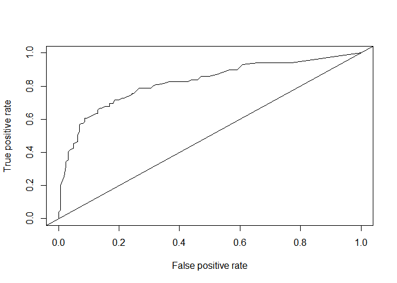<!-- -->

``` r
plot(performance(pred_rf, 'acc')) ## cutoff에 따른 accuracy 변화
```

<!-- -->

``` r
performance(pred_rf, 'auc')@y.values[[1]] # auc
```

    ## [1] 0.8218834

회귀모델 평가 RMSE :: 작을수록 정확—- with lm model applied with boston housing data

``` r
read.table('./data/housing_data.csv') -> boston
names(boston) <- c('crim', 'zn', 'indus', 'chas', 'nox', 'rm', 'age', 'dis', 'rad',  
                   'tax', 'ptratio', 'black', 'lstat', 'medv')
glimpse(boston)
```

    ## Observations: 506
    ## Variables: 14
    ## $ crim    <dbl> 0.00632, 0.02731, 0.02729, 0.03237, 0.06905, 0.02985, 0.…
    ## $ zn      <dbl> 18.0, 0.0, 0.0, 0.0, 0.0, 0.0, 12.5, 12.5, 12.5, 12.5, 1…
    ## $ indus   <dbl> 2.31, 7.07, 7.07, 2.18, 2.18, 2.18, 7.87, 7.87, 7.87, 7.…
    ## $ chas    <int> 0, 0, 0, 0, 0, 0, 0, 0, 0, 0, 0, 0, 0, 0, 0, 0, 0, 0, 0,…
    ## $ nox     <dbl> 0.538, 0.469, 0.469, 0.458, 0.458, 0.458, 0.524, 0.524, …
    ## $ rm      <dbl> 6.575, 6.421, 7.185, 6.998, 7.147, 6.430, 6.012, 6.172, …
    ## $ age     <dbl> 65.2, 78.9, 61.1, 45.8, 54.2, 58.7, 66.6, 96.1, 100.0, 8…
    ## $ dis     <dbl> 4.0900, 4.9671, 4.9671, 6.0622, 6.0622, 6.0622, 5.5605, …
    ## $ rad     <int> 1, 2, 2, 3, 3, 3, 5, 5, 5, 5, 5, 5, 5, 4, 4, 4, 4, 4, 4,…
    ## $ tax     <dbl> 296, 242, 242, 222, 222, 222, 311, 311, 311, 311, 311, 3…
    ## $ ptratio <dbl> 15.3, 17.8, 17.8, 18.7, 18.7, 18.7, 15.2, 15.2, 15.2, 15…
    ## $ black   <dbl> 396.90, 396.90, 392.83, 394.63, 396.90, 394.12, 395.60, …
    ## $ lstat   <dbl> 4.98, 9.14, 4.03, 2.94, 5.33, 5.21, 12.43, 19.15, 29.93,…
    ## $ medv    <dbl> 24.0, 21.6, 34.7, 33.4, 36.2, 28.7, 22.9, 27.1, 16.5, 18…

splitting total dataset into training and validation dataset

``` r
idx <- createDataPartition(boston$medv, p=c(.6, .4), list=F)
boston.train <- boston[idx, ]; dim(boston.train)
```

    ## [1] 306  14

``` r
boston.validation_test <- boston[-idx, ]; dim(boston.validation_test)
```

    ## [1] 200  14

splitting validation\_test dataset into validation and test
dataset

``` r
idx <- createDataPartition(boston.validation_test$medv, p=c(.5, .5), list=F)
boston.validation <- boston.validation_test[idx, ]; dim(boston.validation)
```

    ## [1] 101  14

``` r
boston.test <- boston.validation_test[-idx, ]; dim(boston.test)
```

    ## [1] 99 14

``` r
m <- lm(medv~., data=boston.train)
summary(m)
```

    ## 
    ## Call:
    ## lm(formula = medv ~ ., data = boston.train)
    ## 
    ## Residuals:
    ##      Min       1Q   Median       3Q      Max 
    ## -14.9770  -2.7194  -0.5434   1.4865  25.2762 
    ## 
    ## Coefficients:
    ##               Estimate Std. Error t value Pr(>|t|)    
    ## (Intercept)  40.762296   6.985324   5.835 1.42e-08 ***
    ## crim         -0.129439   0.049110  -2.636 0.008846 ** 
    ## zn            0.033519   0.017652   1.899 0.058569 .  
    ## indus         0.013875   0.077435   0.179 0.857917    
    ## chas          2.271297   1.091208   2.081 0.038264 *  
    ## nox         -19.045470   5.207134  -3.658 0.000302 ***
    ## rm            3.868263   0.546500   7.078 1.09e-11 ***
    ## age          -0.009225   0.017537  -0.526 0.599282    
    ## dis          -1.610960   0.270592  -5.953 7.52e-09 ***
    ## rad           0.378457   0.093703   4.039 6.87e-05 ***
    ## tax          -0.014999   0.005281  -2.840 0.004821 ** 
    ## ptratio      -1.106690   0.175208  -6.316 9.96e-10 ***
    ## black         0.009474   0.003571   2.653 0.008406 ** 
    ## lstat        -0.474642   0.067099  -7.074 1.12e-11 ***
    ## ---
    ## Signif. codes:  0 '***' 0.001 '**' 0.01 '*' 0.05 '.' 0.1 ' ' 1
    ## 
    ## Residual standard error: 4.844 on 292 degrees of freedom
    ## Multiple R-squared:  0.7417, Adjusted R-squared:  0.7302 
    ## F-statistic: 64.48 on 13 and 292 DF,  p-value: < 2.2e-16

defining rmse function—-

``` r
rmse <- function(y_obs, yhat) {
  sqrt(mean(y_obs - yhat)^2)
}

y_obs <- boston.validation$medv
yhat_m <- predict(m, newdata=boston.validation)

rmse(y_obs, yhat_m) # 작을 수록 정확한 모델
```

    ## [1] 0.04504305

로지스틱 회귀 :: income이 \<=50K“,”\>50K인지 여부 예측 with adult
data

``` r
# adult <- read.table("http://archive.ics.uci.edu/ml/machine-learning-databases/adult/adult.data",
#                   sep=",",
#                   header=F,
#                   col.names=c("age", "type_employer", "fnlwgt", "education", 
#                               "education_num","marital", "occupation", "relationship", "race","sex",
#                               "capital_gain", "capital_loss", "hr_per_week","country", "income"),
#                   fill=FALSE, 
#                   strip.white=T)
# 
# adult %>% write.csv("./data/adult.csv", row.names = F)
adult <- read_csv("./data/adult.csv")
```

    ## Parsed with column specification:
    ## cols(
    ##   age = col_double(),
    ##   type_employer = col_character(),
    ##   fnlwgt = col_double(),
    ##   education = col_character(),
    ##   education_num = col_double(),
    ##   marital = col_character(),
    ##   occupation = col_character(),
    ##   relationship = col_character(),
    ##   race = col_character(),
    ##   sex = col_character(),
    ##   capital_gain = col_double(),
    ##   capital_loss = col_double(),
    ##   hr_per_week = col_double(),
    ##   country = col_character(),
    ##   income = col_character()
    ## )

``` r
glimpse(adult)
```

    ## Observations: 32,561
    ## Variables: 15
    ## $ age           <dbl> 39, 50, 38, 53, 28, 37, 49, 52, 31, 42, 37, 30, 23…
    ## $ type_employer <chr> "State-gov", "Self-emp-not-inc", "Private", "Priva…
    ## $ fnlwgt        <dbl> 77516, 83311, 215646, 234721, 338409, 284582, 1601…
    ## $ education     <chr> "Bachelors", "Bachelors", "HS-grad", "11th", "Bach…
    ## $ education_num <dbl> 13, 13, 9, 7, 13, 14, 5, 9, 14, 13, 10, 13, 13, 12…
    ## $ marital       <chr> "Never-married", "Married-civ-spouse", "Divorced",…
    ## $ occupation    <chr> "Adm-clerical", "Exec-managerial", "Handlers-clean…
    ## $ relationship  <chr> "Not-in-family", "Husband", "Not-in-family", "Husb…
    ## $ race          <chr> "White", "White", "White", "Black", "Black", "Whit…
    ## $ sex           <chr> "Male", "Male", "Male", "Male", "Female", "Female"…
    ## $ capital_gain  <dbl> 2174, 0, 0, 0, 0, 0, 0, 0, 14084, 5178, 0, 0, 0, 0…
    ## $ capital_loss  <dbl> 0, 0, 0, 0, 0, 0, 0, 0, 0, 0, 0, 0, 0, 0, 0, 0, 0,…
    ## $ hr_per_week   <dbl> 40, 13, 40, 40, 40, 40, 16, 45, 50, 40, 80, 40, 30…
    ## $ country       <chr> "United-States", "United-States", "United-States",…
    ## $ income        <chr> "<=50K", "<=50K", "<=50K", "<=50K", "<=50K", "<=50…

``` r
levels(adult$income)
```

    ## NULL

``` r
adult$income <- factor(adult$income, levels=c("<=50K", ">50K" ), labels=c(0,1))
```

splitting dataset into train and test dataset

``` r
idx <- createDataPartition(adult$income, p=c(.8, .2), list=F)
```

trainig and test dataset defining

``` r
adult.train <- adult[idx, ]
adult.test <- adult[-idx, ]
```

modeling with training
    dateset

``` r
m <- glm(income ~., data=adult.train, family=binomial)
```

    ## Warning: glm.fit: fitted probabilities numerically 0 or 1 occurred

``` r
summary(m)
```

    ## 
    ## Call:
    ## glm(formula = income ~ ., family = binomial, data = adult.train)
    ## 
    ## Deviance Residuals: 
    ##     Min       1Q   Median       3Q      Max  
    ## -3.3167  -0.5033  -0.1787  -0.0234   3.7299  
    ## 
    ## Coefficients: (2 not defined because of singularities)
    ##                                     Estimate Std. Error z value Pr(>|z|)
    ## (Intercept)                       -9.420e+00  4.916e-01 -19.165  < 2e-16
    ## age                                2.614e-02  1.858e-03  14.067  < 2e-16
    ## type_employerFederal-gov           1.202e+00  1.727e-01   6.956 3.50e-12
    ## type_employerLocal-gov             4.891e-01  1.562e-01   3.131 0.001740
    ## type_employerNever-worked         -1.065e+01  3.199e+02  -0.033 0.973451
    ## type_employerPrivate               7.190e-01  1.391e-01   5.167 2.37e-07
    ## type_employerSelf-emp-inc          8.554e-01  1.672e-01   5.117 3.10e-07
    ## type_employerSelf-emp-not-inc      2.114e-01  1.525e-01   1.386 0.165630
    ## type_employerState-gov             3.685e-01  1.688e-01   2.183 0.029017
    ## type_employerWithout-pay          -1.226e+01  2.232e+02  -0.055 0.956207
    ## fnlwgt                             7.105e-07  1.922e-07   3.697 0.000218
    ## education11th                      7.996e-02  2.423e-01   0.330 0.741358
    ## education12th                      4.202e-01  3.086e-01   1.362 0.173306
    ## education1st-4th                  -3.047e-01  5.170e-01  -0.589 0.555610
    ## education5th-6th                  -1.032e-01  3.614e-01  -0.286 0.775232
    ## education7th-8th                  -3.312e-01  2.573e-01  -1.287 0.197953
    ## education9th                      -9.679e-02  2.984e-01  -0.324 0.745674
    ## educationAssoc-acdm                1.448e+00  2.015e-01   7.184 6.76e-13
    ## educationAssoc-voc                 1.404e+00  1.941e-01   7.234 4.69e-13
    ## educationBachelors                 2.015e+00  1.810e-01  11.135  < 2e-16
    ## educationDoctorate                 2.996e+00  2.427e-01  12.343  < 2e-16
    ## educationHS-grad                   8.808e-01  1.765e-01   4.989 6.06e-07
    ## educationMasters                   2.337e+00  1.925e-01  12.137  < 2e-16
    ## educationPreschool                -1.946e+01  1.665e+02  -0.117 0.906992
    ## educationProf-school               2.844e+00  2.267e-01  12.546  < 2e-16
    ## educationSome-college              1.225e+00  1.789e-01   6.851 7.34e-12
    ## education_num                             NA         NA      NA       NA
    ## maritalMarried-AF-spouse           2.748e+00  6.441e-01   4.266 1.99e-05
    ## maritalMarried-civ-spouse          2.445e+00  2.937e-01   8.326  < 2e-16
    ## maritalMarried-spouse-absent      -4.343e-02  2.775e-01  -0.156 0.875644
    ## maritalNever-married              -4.874e-01  9.937e-02  -4.905 9.33e-07
    ## maritalSeparated                   2.763e-02  1.735e-01   0.159 0.873473
    ## maritalWidowed                     1.299e-01  1.713e-01   0.758 0.448236
    ## occupationAdm-clerical             2.908e-02  1.104e-01   0.263 0.792248
    ## occupationArmed-Forces            -1.076e+00  1.560e+00  -0.689 0.490519
    ## occupationCraft-repair             1.299e-01  9.409e-02   1.381 0.167367
    ## occupationExec-managerial          8.599e-01  9.674e-02   8.889  < 2e-16
    ## occupationFarming-fishing         -9.884e-01  1.594e-01  -6.200 5.65e-10
    ## occupationHandlers-cleaners       -6.799e-01  1.667e-01  -4.080 4.51e-05
    ## occupationMachine-op-inspct       -1.151e-01  1.156e-01  -0.996 0.319396
    ## occupationOther-service           -7.330e-01  1.385e-01  -5.294 1.20e-07
    ## occupationPriv-house-serv         -4.060e+00  1.748e+00  -2.323 0.020157
    ## occupationProf-specialty           5.844e-01  1.039e-01   5.622 1.88e-08
    ## occupationProtective-serv          6.858e-01  1.452e-01   4.725 2.30e-06
    ## occupationSales                    3.258e-01  9.990e-02   3.261 0.001109
    ## occupationTech-support             6.721e-01  1.338e-01   5.022 5.10e-07
    ## occupationTransport-moving                NA         NA      NA       NA
    ## relationshipNot-in-family          7.664e-01  2.902e-01   2.641 0.008258
    ## relationshipOther-relative        -3.344e-01  2.649e-01  -1.262 0.206792
    ## relationshipOwn-child             -4.394e-01  2.813e-01  -1.562 0.118302
    ## relationshipUnmarried              7.192e-01  3.078e-01   2.337 0.019435
    ## relationshipWife                   1.366e+00  1.158e-01  11.789  < 2e-16
    ## raceAsian-Pac-Islander             3.772e-01  3.001e-01   1.257 0.208714
    ## raceBlack                          2.698e-01  2.558e-01   1.055 0.291396
    ## raceOther                          1.667e-02  3.955e-01   0.042 0.966376
    ## raceWhite                          4.746e-01  2.428e-01   1.955 0.050639
    ## sexMale                            8.817e-01  8.985e-02   9.813  < 2e-16
    ## capital_gain                       3.222e-04  1.132e-05  28.463  < 2e-16
    ## capital_loss                       6.611e-04  4.135e-05  15.988  < 2e-16
    ## hr_per_week                        2.881e-02  1.805e-03  15.966  < 2e-16
    ## countryCambodia                    1.714e+00  6.432e-01   2.665 0.007702
    ## countryCanada                      4.754e-01  3.200e-01   1.486 0.137353
    ## countryChina                      -2.174e-01  4.371e-01  -0.497 0.618980
    ## countryColumbia                   -2.231e+00  1.100e+00  -2.028 0.042523
    ## countryCuba                        5.722e-01  3.717e-01   1.540 0.123658
    ## countryDominican-Republic         -1.312e+00  1.060e+00  -1.237 0.216076
    ## countryEcuador                    -1.259e-01  9.090e-01  -0.139 0.889835
    ## countryEl-Salvador                -4.541e-01  5.648e-01  -0.804 0.421415
    ## countryEngland                     6.922e-01  3.768e-01   1.837 0.066210
    ## countryFrance                      1.114e+00  6.159e-01   1.809 0.070522
    ## countryGermany                     6.649e-01  3.144e-01   2.115 0.034440
    ## countryGreece                     -6.604e-01  6.379e-01  -1.035 0.300497
    ## countryGuatemala                   3.801e-01  7.839e-01   0.485 0.627738
    ## countryHaiti                       2.346e-01  6.941e-01   0.338 0.735343
    ## countryHoland-Netherlands         -1.009e+01  8.827e+02  -0.011 0.990876
    ## countryHonduras                   -1.061e+01  2.442e+02  -0.043 0.965348
    ## countryHong                        5.151e-01  7.215e-01   0.714 0.475256
    ## countryHungary                     2.093e-01  7.981e-01   0.262 0.793095
    ## countryIndia                       5.945e-02  3.539e-01   0.168 0.866588
    ## countryIran                       -2.191e-01  5.231e-01  -0.419 0.675262
    ## countryIreland                     1.110e+00  6.839e-01   1.624 0.104434
    ## countryItaly                       7.165e-01  4.081e-01   1.756 0.079128
    ## countryJamaica                    -1.189e-01  6.105e-01  -0.195 0.845576
    ## countryJapan                       9.454e-01  4.922e-01   1.921 0.054786
    ## countryLaos                        1.314e-01  9.006e-01   0.146 0.883995
    ## countryMexico                     -4.105e-01  2.883e-01  -1.424 0.154523
    ## countryNicaragua                  -1.007e+00  1.099e+00  -0.917 0.359168
    ## countryOutlying-US(Guam-USVI-etc) -1.162e+01  2.363e+02  -0.049 0.960771
    ## countryPeru                       -5.988e-01  8.643e-01  -0.693 0.488424
    ## countryPhilippines                 8.046e-01  3.154e-01   2.551 0.010740
    ## countryPoland                      1.043e-01  4.816e-01   0.216 0.828634
    ## countryPortugal                    6.461e-01  6.711e-01   0.963 0.335685
    ## countryPuerto-Rico                -6.078e-01  5.184e-01  -1.172 0.241015
    ## countryScotland                    4.634e-01  8.277e-01   0.560 0.575617
    ## countrySouth                      -4.777e-01  5.017e-01  -0.952 0.341014
    ## countryTaiwan                      3.696e-01  5.080e-01   0.728 0.466857
    ## countryThailand                    2.888e-01  8.854e-01   0.326 0.744296
    ## countryTrinadad&Tobago             6.374e-01  1.015e+00   0.628 0.530115
    ## countryUnited-States               4.434e-01  1.549e-01   2.864 0.004190
    ## countryVietnam                    -6.549e-01  6.280e-01  -1.043 0.297043
    ## countryYugoslavia                  4.807e-01  8.198e-01   0.586 0.557672
    ##                                      
    ## (Intercept)                       ***
    ## age                               ***
    ## type_employerFederal-gov          ***
    ## type_employerLocal-gov            ** 
    ## type_employerNever-worked            
    ## type_employerPrivate              ***
    ## type_employerSelf-emp-inc         ***
    ## type_employerSelf-emp-not-inc        
    ## type_employerState-gov            *  
    ## type_employerWithout-pay             
    ## fnlwgt                            ***
    ## education11th                        
    ## education12th                        
    ## education1st-4th                     
    ## education5th-6th                     
    ## education7th-8th                     
    ## education9th                         
    ## educationAssoc-acdm               ***
    ## educationAssoc-voc                ***
    ## educationBachelors                ***
    ## educationDoctorate                ***
    ## educationHS-grad                  ***
    ## educationMasters                  ***
    ## educationPreschool                   
    ## educationProf-school              ***
    ## educationSome-college             ***
    ## education_num                        
    ## maritalMarried-AF-spouse          ***
    ## maritalMarried-civ-spouse         ***
    ## maritalMarried-spouse-absent         
    ## maritalNever-married              ***
    ## maritalSeparated                     
    ## maritalWidowed                       
    ## occupationAdm-clerical               
    ## occupationArmed-Forces               
    ## occupationCraft-repair               
    ## occupationExec-managerial         ***
    ## occupationFarming-fishing         ***
    ## occupationHandlers-cleaners       ***
    ## occupationMachine-op-inspct          
    ## occupationOther-service           ***
    ## occupationPriv-house-serv         *  
    ## occupationProf-specialty          ***
    ## occupationProtective-serv         ***
    ## occupationSales                   ** 
    ## occupationTech-support            ***
    ## occupationTransport-moving           
    ## relationshipNot-in-family         ** 
    ## relationshipOther-relative           
    ## relationshipOwn-child                
    ## relationshipUnmarried             *  
    ## relationshipWife                  ***
    ## raceAsian-Pac-Islander               
    ## raceBlack                            
    ## raceOther                            
    ## raceWhite                         .  
    ## sexMale                           ***
    ## capital_gain                      ***
    ## capital_loss                      ***
    ## hr_per_week                       ***
    ## countryCambodia                   ** 
    ## countryCanada                        
    ## countryChina                         
    ## countryColumbia                   *  
    ## countryCuba                          
    ## countryDominican-Republic            
    ## countryEcuador                       
    ## countryEl-Salvador                   
    ## countryEngland                    .  
    ## countryFrance                     .  
    ## countryGermany                    *  
    ## countryGreece                        
    ## countryGuatemala                     
    ## countryHaiti                         
    ## countryHoland-Netherlands            
    ## countryHonduras                      
    ## countryHong                          
    ## countryHungary                       
    ## countryIndia                         
    ## countryIran                          
    ## countryIreland                       
    ## countryItaly                      .  
    ## countryJamaica                       
    ## countryJapan                      .  
    ## countryLaos                          
    ## countryMexico                        
    ## countryNicaragua                     
    ## countryOutlying-US(Guam-USVI-etc)    
    ## countryPeru                          
    ## countryPhilippines                *  
    ## countryPoland                        
    ## countryPortugal                      
    ## countryPuerto-Rico                   
    ## countryScotland                      
    ## countrySouth                         
    ## countryTaiwan                        
    ## countryThailand                      
    ## countryTrinadad&Tobago               
    ## countryUnited-States              ** 
    ## countryVietnam                       
    ## countryYugoslavia                    
    ## ---
    ## Signif. codes:  0 '***' 0.001 '**' 0.01 '*' 0.05 '.' 0.1 ' ' 1
    ## 
    ## (Dispersion parameter for binomial family taken to be 1)
    ## 
    ##     Null deviance: 28759  on 26048  degrees of freedom
    ## Residual deviance: 16398  on 25950  degrees of freedom
    ## AIC: 16596
    ## 
    ## Number of Fisher Scoring iterations: 13

``` r
fitted(m)[c(1:5, 51:55)] # 모델에 적합된 값 with probability
```

    ##           1           2           3           4           5          51 
    ## 0.119021455 0.413705325 0.071985870 0.662737131 0.824352501 0.150128774 
    ##          52          53          54          55 
    ## 0.224105493 0.023023242 0.650854629 0.004615909

``` r
ifelse(fitted(m) >= .5, 1,0)[c(1:5, 51:55)] # 모델에 적합된 값 with 1(">50K"), 0("<=50K")
```

    ##  1  2  3  4  5 51 52 53 54 55 
    ##  0  0  0  1  1  0  0  0  1  0

predicting with test
dataset

``` r
pred <- ifelse(predict(m, newdata = adult.test, type='response') >= .5, 1, 0)
```

    ## Warning in predict.lm(object, newdata, se.fit, scale = 1, type =
    ## ifelse(type == : prediction from a rank-deficient fit may be misleading

``` r
range(predict(m, newdata = adult.test, type='response'))
```

    ## Warning in predict.lm(object, newdata, se.fit, scale = 1, type =
    ## ifelse(type == : prediction from a rank-deficient fit may be misleading

    ## [1] 3.507568e-12 1.000000e+00

``` r
range(predict(m, newdata = adult.test))
```

    ## Warning in predict.lm(object, newdata, se.fit, scale = 1, type =
    ## ifelse(type == : prediction from a rank-deficient fit may be misleading

    ## [1] -26.37610  34.74214

evaluation

``` r
yhat_m_class <- ifelse(predict(m, newdata = adult.test, type='response') >= .5, 1, 0)
```

    ## Warning in predict.lm(object, newdata, se.fit, scale = 1, type =
    ## ifelse(type == : prediction from a rank-deficient fit may be misleading

``` r
y_obs <- adult.test$income

xtabs(~ yhat_m_class + y_obs)
```

    ##             y_obs
    ## yhat_m_class    0    1
    ##            0 4626  624
    ##            1  318  944

``` r
sum(yhat_m_class == y_obs) / length(y_obs)
```

    ## [1] 0.855344

``` r
yhat_m_class %>% class()
```

    ## [1] "numeric"

``` r
y_obs %>% class()
```

    ## [1] "factor"

``` r
confusionMatrix(as.factor(yhat_m_class), y_obs)
```

    ## Confusion Matrix and Statistics
    ## 
    ##           Reference
    ## Prediction    0    1
    ##          0 4626  624
    ##          1  318  944
    ##                                           
    ##                Accuracy : 0.8553          
    ##                  95% CI : (0.8466, 0.8638)
    ##     No Information Rate : 0.7592          
    ##     P-Value [Acc > NIR] : < 2.2e-16       
    ##                                           
    ##                   Kappa : 0.5761          
    ##                                           
    ##  Mcnemar's Test P-Value : < 2.2e-16       
    ##                                           
    ##             Sensitivity : 0.9357          
    ##             Specificity : 0.6020          
    ##          Pos Pred Value : 0.8811          
    ##          Neg Pred Value : 0.7480          
    ##              Prevalence : 0.7592          
    ##          Detection Rate : 0.7104          
    ##    Detection Prevalence : 0.8062          
    ##       Balanced Accuracy : 0.7689          
    ##                                           
    ##        'Positive' Class : 0               
    ## 

ROC curve and AUC—-

``` r
library(ROCR)
yhat_glm <- predict(m, newdata = adult.test, type='response')
```

    ## Warning in predict.lm(object, newdata, se.fit, scale = 1, type =
    ## ifelse(type == : prediction from a rank-deficient fit may be misleading

``` r
y_obs  <- adult.test$income

pred <- prediction(yhat_glm, y_obs)
plot(performance(pred, 'tpr', 'fpr'))
abline(0,1)
```

<!-- -->

``` r
plot(performance(pred, 'acc')) # cutoff 에 따른 accuracy의 변화
```

<!-- -->

``` r
performance(pred, 'auc')@y.values[[1]] # auc
```

    ## [1] 0.9048572

로지스틱 회귀 :: left or not인지 여부 예측 with hr data—-

``` r
hr <- read_csv("./data/hr_comma_sep.csv")
```

    ## Parsed with column specification:
    ## cols(
    ##   satisfaction_level = col_double(),
    ##   last_evaluation = col_double(),
    ##   number_project = col_double(),
    ##   average_montly_hours = col_double(),
    ##   time_spend_company = col_double(),
    ##   Work_accident = col_double(),
    ##   left = col_double(),
    ##   promotion_last_5years = col_double(),
    ##   sales = col_character(),
    ##   salary = col_character()
    ## )

``` r
colnames(hr) <- tolower(colnames(hr)); head(hr)
```

    ## # A tibble: 6 x 10
    ##   satisfaction_le… last_evaluation number_project average_montly_…
    ##              <dbl>           <dbl>          <dbl>            <dbl>
    ## 1             0.38            0.53              2              157
    ## 2             0.8             0.86              5              262
    ## 3             0.11            0.88              7              272
    ## 4             0.72            0.87              5              223
    ## 5             0.37            0.52              2              159
    ## 6             0.41            0.5               2              153
    ## # … with 6 more variables: time_spend_company <dbl>, work_accident <dbl>,
    ## #   left <dbl>, promotion_last_5years <dbl>, sales <chr>, salary <chr>

``` r
table(hr$left)
```

    ## 
    ##     0     1 
    ## 11428  3571

``` r
table(hr$sales)
```

    ## 
    ##  accounting          hr          IT  management   marketing product_mng 
    ##         767         739        1227         630         858         902 
    ##       RandD       sales     support   technical 
    ##         787        4140        2229        2720

``` r
table(hr$salary)
```

    ## 
    ##   high    low medium 
    ##   1237   7316   6446

``` r
hr %>% 
  select(-sales, -salary) %>%
  sample_n(500) %>%
  ggpairs()
```

<!-- -->

``` r
glimpse(hr)
```

    ## Observations: 14,999
    ## Variables: 10
    ## $ satisfaction_level    <dbl> 0.38, 0.80, 0.11, 0.72, 0.37, 0.41, 0.10, …
    ## $ last_evaluation       <dbl> 0.53, 0.86, 0.88, 0.87, 0.52, 0.50, 0.77, …
    ## $ number_project        <dbl> 2, 5, 7, 5, 2, 2, 6, 5, 5, 2, 2, 6, 4, 2, …
    ## $ average_montly_hours  <dbl> 157, 262, 272, 223, 159, 153, 247, 259, 22…
    ## $ time_spend_company    <dbl> 3, 6, 4, 5, 3, 3, 4, 5, 5, 3, 3, 4, 5, 3, …
    ## $ work_accident         <dbl> 0, 0, 0, 0, 0, 0, 0, 0, 0, 0, 0, 0, 0, 0, …
    ## $ left                  <dbl> 1, 1, 1, 1, 1, 1, 1, 1, 1, 1, 1, 1, 1, 1, …
    ## $ promotion_last_5years <dbl> 0, 0, 0, 0, 0, 0, 0, 0, 0, 0, 0, 0, 0, 0, …
    ## $ sales                 <chr> "sales", "sales", "sales", "sales", "sales…
    ## $ salary                <chr> "low", "medium", "medium", "low", "low", "…

x \<- model.matrix(~. -left, data=hr) \# 선형 모형 formualtion을 위한 문자열 문법

data splitting into training, validation, test dataset—-

``` r
set.seed(2018)
n <- nrow(hr)
idx <- 1:n
training_idx <- sample(idx, n*.6)
idx <- setdiff(idx, training_idx)
validate_idx <- sample(idx, n*.2)
test_idx <- setdiff(idx, validate_idx)

length(training_idx); length(validate_idx); length(test_idx)
```

    ## [1] 8999

    ## [1] 2999

    ## [1] 3001

``` r
training <- hr[training_idx, ]
validation <- hr[validate_idx, ]
test <- hr[test_idx, ]
```

modeling—-

``` r
hr_glm_full <- glm(left ~., data=training, family = binomial); summary(hr_glm_full)
```

    ## 
    ## Call:
    ## glm(formula = left ~ ., family = binomial, data = training)
    ## 
    ## Deviance Residuals: 
    ##     Min       1Q   Median       3Q      Max  
    ## -2.2100  -0.6651  -0.3957  -0.1103   3.0272  
    ## 
    ## Coefficients:
    ##                        Estimate Std. Error z value Pr(>|z|)    
    ## (Intercept)           -1.455692   0.249263  -5.840 5.22e-09 ***
    ## satisfaction_level    -4.186535   0.127452 -32.848  < 2e-16 ***
    ## last_evaluation        0.851920   0.193944   4.393 1.12e-05 ***
    ## number_project        -0.342823   0.027824 -12.321  < 2e-16 ***
    ## average_montly_hours   0.004367   0.000668   6.538 6.24e-11 ***
    ## time_spend_company     0.299719   0.020396  14.695  < 2e-16 ***
    ## work_accident         -1.549630   0.115861 -13.375  < 2e-16 ***
    ## promotion_last_5years -1.704416   0.368555  -4.625 3.75e-06 ***
    ## saleshr                0.220379   0.167740   1.314  0.18891    
    ## salesIT               -0.259694   0.156434  -1.660  0.09690 .  
    ## salesmanagement       -0.662334   0.211222  -3.136  0.00171 ** 
    ## salesmarketing         0.003492   0.169201   0.021  0.98353    
    ## salesproduct_mng      -0.162743   0.165019  -0.986  0.32403    
    ## salesRandD            -0.774054   0.186580  -4.149 3.34e-05 ***
    ## salessales            -0.112547   0.130328  -0.864  0.38782    
    ## salessupport          -0.060122   0.139022  -0.432  0.66540    
    ## salestechnical        -0.050055   0.135474  -0.369  0.71177    
    ## salarylow              1.946675   0.165152  11.787  < 2e-16 ***
    ## salarymedium           1.460032   0.166057   8.792  < 2e-16 ***
    ## ---
    ## Signif. codes:  0 '***' 0.001 '**' 0.01 '*' 0.05 '.' 0.1 ' ' 1
    ## 
    ## (Dispersion parameter for binomial family taken to be 1)
    ## 
    ##     Null deviance: 9893.5  on 8998  degrees of freedom
    ## Residual deviance: 7678.5  on 8980  degrees of freedom
    ## AIC: 7716.5
    ## 
    ## Number of Fisher Scoring iterations: 5

prediction accuracy visualization—-

``` r
y_obs <- validation$left
yhat_glm <- predict(hr_glm_full, newdata=validation, type='response')

ggplot(data.frame(y_obs, yhat_glm), 
       aes(yhat_glm, fill=factor(y_obs))) + geom_density(alpha=.5)
```

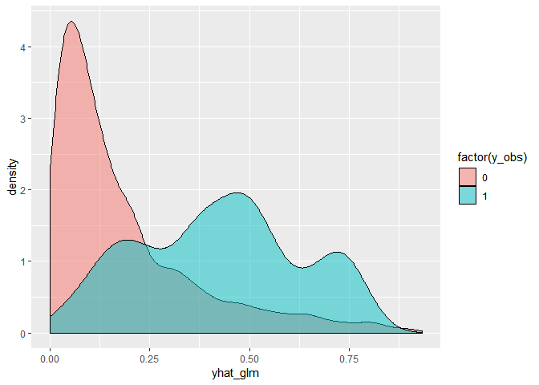<!-- -->

ROCR :: ROC curve and AUC—-

``` r
library(ROCR)
pred_glm <- prediction(yhat_glm, y_obs) # pred :: probability
perf_glm <- performance(pred_glm, 'tpr', 'fpr')
plot(perf_glm, main='ROC curve for glm model') # ROC curve
```

<!-- -->

``` r
performance(pred_glm, 'auc')@y.values[[1]] # auc
```

    ## [1] 0.8229465

로지스틱 회귀 :: cancer or not인지 여부 예측 with breast cancer—- data downloading
with curl—-

``` r
# library(curl)
# h <- new_handle(copypostfields = "moo=moomooo")
# handle_setheaders(h,
#                   "Content-Type" = "text/moo",
#                   "Cache-Control" = "no-cache",
#                   "User-Agent" = "A cow"
# )
# 
# tmp <- tempfile()
# 
# curl_download('https://archive.ics.uci.edu/ml/machine-learning-databases/breast-cancer-wisconsin/wdbc.data', tmp, handle=h)
# data <-read.csv(tmp, header=F)
# feature_names <- c('radius', 'texture', 'perimeter', 'area', 'smoothness',
#                    'compactness', 'concavity', 'concave_points', 'symmetry', 'fractal_dim')
# 
# names(data) <-
#   c('id', 'class',
#     paste0('mean_', feature_names),
#     paste0('se_', feature_names),
#     paste0('worst_', feature_names))
# 
# glimpse(data)
# 
# data %>% write.csv("./data/breast_cancer_wisconsin.csv", row.names = F)
data <- read_csv("./data/breast_cancer_wisconsin.csv")
```

    ## Parsed with column specification:
    ## cols(
    ##   .default = col_double(),
    ##   class = col_character()
    ## )

    ## See spec(...) for full column specifications.

define needed functions—-

``` r
rmse <- function(y_obs, yhat){
  sqrt(mean((y_obs - yhat)^2))
}

binomial_deviance <- function(y_obs, yhat){
  epsilon = 0.0001
  yhat = ifelse(yhat < epsilon, epsilon, yhat)
  yhat = ifelse(yhat > 1-epsilon, 1-epsilon, yhat)
  a = ifelse(y_obs==0, 0, y_obs * log(y_obs/yhat))
  b = ifelse(y_obs==1, 0, (1-y_obs) * log((1-y_obs)/(1-yhat)))
  return(2*sum(a + b))
}
```

Cleansing data—-

``` r
data <- data %>% select(-id)
data$class <- factor(ifelse(data$class == 'B', 0, 1))
glimpse(data)
```

    ## Observations: 569
    ## Variables: 31
    ## $ class                <fct> 1, 1, 1, 1, 1, 1, 1, 1, 1, 1, 1, 1, 1, 1, 1…
    ## $ mean_radius          <dbl> 17.990, 20.570, 19.690, 11.420, 20.290, 12.…
    ## $ mean_texture         <dbl> 10.38, 17.77, 21.25, 20.38, 14.34, 15.70, 1…
    ## $ mean_perimeter       <dbl> 122.80, 132.90, 130.00, 77.58, 135.10, 82.5…
    ## $ mean_area            <dbl> 1001.0, 1326.0, 1203.0, 386.1, 1297.0, 477.…
    ## $ mean_smoothness      <dbl> 0.11840, 0.08474, 0.10960, 0.14250, 0.10030…
    ## $ mean_compactness     <dbl> 0.27760, 0.07864, 0.15990, 0.28390, 0.13280…
    ## $ mean_concavity       <dbl> 0.30010, 0.08690, 0.19740, 0.24140, 0.19800…
    ## $ mean_concave_points  <dbl> 0.14710, 0.07017, 0.12790, 0.10520, 0.10430…
    ## $ mean_symmetry        <dbl> 0.2419, 0.1812, 0.2069, 0.2597, 0.1809, 0.2…
    ## $ mean_fractal_dim     <dbl> 0.07871, 0.05667, 0.05999, 0.09744, 0.05883…
    ## $ se_radius            <dbl> 1.0950, 0.5435, 0.7456, 0.4956, 0.7572, 0.3…
    ## $ se_texture           <dbl> 0.9053, 0.7339, 0.7869, 1.1560, 0.7813, 0.8…
    ## $ se_perimeter         <dbl> 8.589, 3.398, 4.585, 3.445, 5.438, 2.217, 3…
    ## $ se_area              <dbl> 153.40, 74.08, 94.03, 27.23, 94.44, 27.19, …
    ## $ se_smoothness        <dbl> 0.006399, 0.005225, 0.006150, 0.009110, 0.0…
    ## $ se_compactness       <dbl> 0.049040, 0.013080, 0.040060, 0.074580, 0.0…
    ## $ se_concavity         <dbl> 0.05373, 0.01860, 0.03832, 0.05661, 0.05688…
    ## $ se_concave_points    <dbl> 0.015870, 0.013400, 0.020580, 0.018670, 0.0…
    ## $ se_symmetry          <dbl> 0.03003, 0.01389, 0.02250, 0.05963, 0.01756…
    ## $ se_fractal_dim       <dbl> 0.006193, 0.003532, 0.004571, 0.009208, 0.0…
    ## $ worst_radius         <dbl> 25.38, 24.99, 23.57, 14.91, 22.54, 15.47, 2…
    ## $ worst_texture        <dbl> 17.33, 23.41, 25.53, 26.50, 16.67, 23.75, 2…
    ## $ worst_perimeter      <dbl> 184.60, 158.80, 152.50, 98.87, 152.20, 103.…
    ## $ worst_area           <dbl> 2019.0, 1956.0, 1709.0, 567.7, 1575.0, 741.…
    ## $ worst_smoothness     <dbl> 0.1622, 0.1238, 0.1444, 0.2098, 0.1374, 0.1…
    ## $ worst_compactness    <dbl> 0.6656, 0.1866, 0.4245, 0.8663, 0.2050, 0.5…
    ## $ worst_concavity      <dbl> 0.71190, 0.24160, 0.45040, 0.68690, 0.40000…
    ## $ worst_concave_points <dbl> 0.26540, 0.18600, 0.24300, 0.25750, 0.16250…
    ## $ worst_symmetry       <dbl> 0.4601, 0.2750, 0.3613, 0.6638, 0.2364, 0.3…
    ## $ worst_fractal_dim    <dbl> 0.11890, 0.08902, 0.08758, 0.17300, 0.07678…

``` r
summary(data)
```

    ##  class    mean_radius      mean_texture   mean_perimeter  
    ##  0:357   Min.   : 6.981   Min.   : 9.71   Min.   : 43.79  
    ##  1:212   1st Qu.:11.700   1st Qu.:16.17   1st Qu.: 75.17  
    ##          Median :13.370   Median :18.84   Median : 86.24  
    ##          Mean   :14.127   Mean   :19.29   Mean   : 91.97  
    ##          3rd Qu.:15.780   3rd Qu.:21.80   3rd Qu.:104.10  
    ##          Max.   :28.110   Max.   :39.28   Max.   :188.50  
    ##    mean_area      mean_smoothness   mean_compactness  mean_concavity   
    ##  Min.   : 143.5   Min.   :0.05263   Min.   :0.01938   Min.   :0.00000  
    ##  1st Qu.: 420.3   1st Qu.:0.08637   1st Qu.:0.06492   1st Qu.:0.02956  
    ##  Median : 551.1   Median :0.09587   Median :0.09263   Median :0.06154  
    ##  Mean   : 654.9   Mean   :0.09636   Mean   :0.10434   Mean   :0.08880  
    ##  3rd Qu.: 782.7   3rd Qu.:0.10530   3rd Qu.:0.13040   3rd Qu.:0.13070  
    ##  Max.   :2501.0   Max.   :0.16340   Max.   :0.34540   Max.   :0.42680  
    ##  mean_concave_points mean_symmetry    mean_fractal_dim    se_radius     
    ##  Min.   :0.00000     Min.   :0.1060   Min.   :0.04996   Min.   :0.1115  
    ##  1st Qu.:0.02031     1st Qu.:0.1619   1st Qu.:0.05770   1st Qu.:0.2324  
    ##  Median :0.03350     Median :0.1792   Median :0.06154   Median :0.3242  
    ##  Mean   :0.04892     Mean   :0.1812   Mean   :0.06280   Mean   :0.4052  
    ##  3rd Qu.:0.07400     3rd Qu.:0.1957   3rd Qu.:0.06612   3rd Qu.:0.4789  
    ##  Max.   :0.20120     Max.   :0.3040   Max.   :0.09744   Max.   :2.8730  
    ##    se_texture      se_perimeter       se_area        se_smoothness     
    ##  Min.   :0.3602   Min.   : 0.757   Min.   :  6.802   Min.   :0.001713  
    ##  1st Qu.:0.8339   1st Qu.: 1.606   1st Qu.: 17.850   1st Qu.:0.005169  
    ##  Median :1.1080   Median : 2.287   Median : 24.530   Median :0.006380  
    ##  Mean   :1.2169   Mean   : 2.866   Mean   : 40.337   Mean   :0.007041  
    ##  3rd Qu.:1.4740   3rd Qu.: 3.357   3rd Qu.: 45.190   3rd Qu.:0.008146  
    ##  Max.   :4.8850   Max.   :21.980   Max.   :542.200   Max.   :0.031130  
    ##  se_compactness      se_concavity     se_concave_points 
    ##  Min.   :0.002252   Min.   :0.00000   Min.   :0.000000  
    ##  1st Qu.:0.013080   1st Qu.:0.01509   1st Qu.:0.007638  
    ##  Median :0.020450   Median :0.02589   Median :0.010930  
    ##  Mean   :0.025478   Mean   :0.03189   Mean   :0.011796  
    ##  3rd Qu.:0.032450   3rd Qu.:0.04205   3rd Qu.:0.014710  
    ##  Max.   :0.135400   Max.   :0.39600   Max.   :0.052790  
    ##   se_symmetry       se_fractal_dim       worst_radius   worst_texture  
    ##  Min.   :0.007882   Min.   :0.0008948   Min.   : 7.93   Min.   :12.02  
    ##  1st Qu.:0.015160   1st Qu.:0.0022480   1st Qu.:13.01   1st Qu.:21.08  
    ##  Median :0.018730   Median :0.0031870   Median :14.97   Median :25.41  
    ##  Mean   :0.020542   Mean   :0.0037949   Mean   :16.27   Mean   :25.68  
    ##  3rd Qu.:0.023480   3rd Qu.:0.0045580   3rd Qu.:18.79   3rd Qu.:29.72  
    ##  Max.   :0.078950   Max.   :0.0298400   Max.   :36.04   Max.   :49.54  
    ##  worst_perimeter    worst_area     worst_smoothness  worst_compactness
    ##  Min.   : 50.41   Min.   : 185.2   Min.   :0.07117   Min.   :0.02729  
    ##  1st Qu.: 84.11   1st Qu.: 515.3   1st Qu.:0.11660   1st Qu.:0.14720  
    ##  Median : 97.66   Median : 686.5   Median :0.13130   Median :0.21190  
    ##  Mean   :107.26   Mean   : 880.6   Mean   :0.13237   Mean   :0.25427  
    ##  3rd Qu.:125.40   3rd Qu.:1084.0   3rd Qu.:0.14600   3rd Qu.:0.33910  
    ##  Max.   :251.20   Max.   :4254.0   Max.   :0.22260   Max.   :1.05800  
    ##  worst_concavity  worst_concave_points worst_symmetry   worst_fractal_dim
    ##  Min.   :0.0000   Min.   :0.00000      Min.   :0.1565   Min.   :0.05504  
    ##  1st Qu.:0.1145   1st Qu.:0.06493      1st Qu.:0.2504   1st Qu.:0.07146  
    ##  Median :0.2267   Median :0.09993      Median :0.2822   Median :0.08004  
    ##  Mean   :0.2722   Mean   :0.11461      Mean   :0.2901   Mean   :0.08395  
    ##  3rd Qu.:0.3829   3rd Qu.:0.16140      3rd Qu.:0.3179   3rd Qu.:0.09208  
    ##  Max.   :1.2520   Max.   :0.29100      Max.   :0.6638   Max.   :0.20750

Data EDA—-

``` r
library(gridExtra)
```

    ## 
    ## Attaching package: 'gridExtra'

    ## The following object is masked from 'package:randomForest':
    ## 
    ##     combine

    ## The following object is masked from 'package:dplyr':
    ## 
    ##     combine

``` r
p1 <- data %>% ggplot(aes(class)) + geom_bar()

p2 <- data %>% ggplot(aes(class, mean_concave_points)) +
  geom_jitter(col='gray') +
  geom_boxplot(alpha=.5)

p3 <- data %>% ggplot(aes(class, mean_radius)) +
  geom_jitter(col='gray') +
  geom_boxplot(alpha=.5)

p4 <- data %>% ggplot(aes(mean_concave_points, mean_radius)) +
  geom_jitter(col='gray') + geom_smooth()

grid.arrange(p1, p2, p3, p4, ncol=2)
```

    ## `geom_smooth()` using method = 'loess' and formula 'y ~ x'

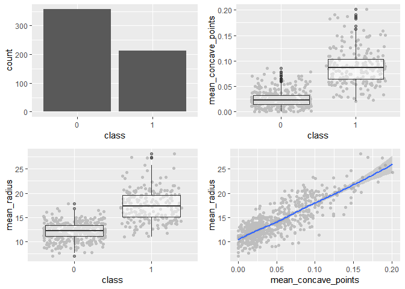<!-- -->

Data splitting

``` r
set.seed(1606)
n <- nrow(data)
idx <- 1:n
training_idx <- sample(idx, n*.6)
idx <- setdiff(idx, training_idx)
validate_idx <- sample(idx, n*.2)
test_idx <- setdiff(idx, validate_idx)
training <- data[training_idx, ]
validation <- data[validate_idx, ]
test <- data[test_idx, ]
```

Logistic regression
    modeling—-

``` r
data_lm_full <- glm(class ~., data=training, family=binomial)
```

    ## Warning: glm.fit: fitted probabilities numerically 0 or 1 occurred

``` r
summary(data_lm_full)
```

    ## 
    ## Call:
    ## glm(formula = class ~ ., family = binomial, data = training)
    ## 
    ## Deviance Residuals: 
    ##    Min      1Q  Median      3Q     Max  
    ##  -8.49    0.00    0.00    0.00    8.49  
    ## 
    ## Coefficients:
    ##                        Estimate Std. Error   z value Pr(>|z|)    
    ## (Intercept)          -7.068e+15  1.599e+08 -44204883   <2e-16 ***
    ## mean_radius          -5.027e+14  6.352e+07  -7913190   <2e-16 ***
    ## mean_texture         -1.549e+13  3.224e+06  -4804731   <2e-16 ***
    ## mean_perimeter        1.584e+14  8.966e+06  17671717   <2e-16 ***
    ## mean_area            -4.610e+12  2.135e+05 -21598315   <2e-16 ***
    ## mean_smoothness       2.168e+15  8.189e+08   2646790   <2e-16 ***
    ## mean_compactness     -2.273e+16  4.881e+08 -46559277   <2e-16 ***
    ## mean_concavity        9.349e+15  3.871e+08  24153537   <2e-16 ***
    ## mean_concave_points   8.721e+15  7.412e+08  11767131   <2e-16 ***
    ## mean_symmetry        -5.151e+15  2.940e+08 -17523162   <2e-16 ***
    ## mean_fractal_dim      5.016e+16  2.072e+09  24202673   <2e-16 ***
    ## se_radius             1.129e+15  1.206e+08   9357444   <2e-16 ***
    ## se_texture           -2.759e+14  1.603e+07 -17204167   <2e-16 ***
    ## se_perimeter          2.764e+14  1.561e+07  17704519   <2e-16 ***
    ## se_area              -1.733e+13  5.491e+05 -31555708   <2e-16 ***
    ## se_smoothness        -5.693e+16  2.870e+09 -19837441   <2e-16 ***
    ## se_compactness        3.112e+16  7.504e+08  41469105   <2e-16 ***
    ## se_concavity         -2.353e+16  4.459e+08 -52765839   <2e-16 ***
    ## se_concave_points     4.942e+16  1.980e+09  24959795   <2e-16 ***
    ## se_symmetry           2.449e+16  1.078e+09  22710313   <2e-16 ***
    ## se_fractal_dim       -2.045e+17  3.885e+09 -52636611   <2e-16 ***
    ## worst_radius         -1.558e+13  2.323e+07   -670467   <2e-16 ***
    ## worst_texture         7.540e+13  3.026e+06  24919290   <2e-16 ***
    ## worst_perimeter      -8.019e+13  2.361e+06 -33967023   <2e-16 ***
    ## worst_area            5.989e+12  1.266e+05  47315598   <2e-16 ***
    ## worst_smoothness      2.627e+15  5.821e+08   4513281   <2e-16 ***
    ## worst_compactness    -2.628e+15  1.329e+08 -19782715   <2e-16 ***
    ## worst_concavity       1.802e+15  9.572e+07  18822914   <2e-16 ***
    ## worst_concave_points  8.232e+15  3.250e+08  25328089   <2e-16 ***
    ## worst_symmetry        3.256e+15  1.964e+08  16581269   <2e-16 ***
    ## worst_fractal_dim     1.372e+16  8.855e+08  15488504   <2e-16 ***
    ## ---
    ## Signif. codes:  0 '***' 0.001 '**' 0.01 '*' 0.05 '.' 0.1 ' ' 1
    ## 
    ## (Dispersion parameter for binomial family taken to be 1)
    ## 
    ##     Null deviance: 452.32  on 340  degrees of freedom
    ## Residual deviance: 432.52  on 310  degrees of freedom
    ## AIC: 494.52
    ## 
    ## Number of Fisher Scoring iterations: 19

``` r
anova(data_lm_full)
```

    ## Warning: glm.fit: fitted probabilities numerically 0 or 1 occurred
    
    ## Warning: glm.fit: fitted probabilities numerically 0 or 1 occurred
    
    ## Warning: glm.fit: fitted probabilities numerically 0 or 1 occurred
    
    ## Warning: glm.fit: fitted probabilities numerically 0 or 1 occurred
    
    ## Warning: glm.fit: fitted probabilities numerically 0 or 1 occurred
    
    ## Warning: glm.fit: fitted probabilities numerically 0 or 1 occurred
    
    ## Warning: glm.fit: fitted probabilities numerically 0 or 1 occurred
    
    ## Warning: glm.fit: fitted probabilities numerically 0 or 1 occurred
    
    ## Warning: glm.fit: fitted probabilities numerically 0 or 1 occurred
    
    ## Warning: glm.fit: fitted probabilities numerically 0 or 1 occurred
    
    ## Warning: glm.fit: fitted probabilities numerically 0 or 1 occurred
    
    ## Warning: glm.fit: fitted probabilities numerically 0 or 1 occurred
    
    ## Warning: glm.fit: fitted probabilities numerically 0 or 1 occurred
    
    ## Warning: glm.fit: fitted probabilities numerically 0 or 1 occurred
    
    ## Warning: glm.fit: fitted probabilities numerically 0 or 1 occurred
    
    ## Warning: glm.fit: fitted probabilities numerically 0 or 1 occurred
    
    ## Warning: glm.fit: fitted probabilities numerically 0 or 1 occurred
    
    ## Warning: glm.fit: fitted probabilities numerically 0 or 1 occurred

    ## Warning: glm.fit: algorithm did not converge

    ## Warning: glm.fit: fitted probabilities numerically 0 or 1 occurred

    ## Warning: glm.fit: algorithm did not converge

    ## Warning: glm.fit: fitted probabilities numerically 0 or 1 occurred

    ## Warning: glm.fit: algorithm did not converge

    ## Warning: glm.fit: fitted probabilities numerically 0 or 1 occurred

    ## Warning: glm.fit: algorithm did not converge

    ## Warning: glm.fit: fitted probabilities numerically 0 or 1 occurred

    ## Warning: glm.fit: algorithm did not converge

    ## Warning: glm.fit: fitted probabilities numerically 0 or 1 occurred

    ## Warning: glm.fit: algorithm did not converge

    ## Warning: glm.fit: fitted probabilities numerically 0 or 1 occurred

    ## Warning: glm.fit: algorithm did not converge

    ## Warning: glm.fit: fitted probabilities numerically 0 or 1 occurred

    ## Warning: glm.fit: algorithm did not converge

    ## Warning: glm.fit: fitted probabilities numerically 0 or 1 occurred

    ## Analysis of Deviance Table
    ## 
    ## Model: binomial, link: logit
    ## 
    ## Response: class
    ## 
    ## Terms added sequentially (first to last)
    ## 
    ## 
    ##                      Df Deviance Resid. Df Resid. Dev
    ## NULL                                   340     452.32
    ## mean_radius           1  250.685       339     201.63
    ## mean_texture          1   17.828       338     183.81
    ## mean_perimeter        1   34.193       337     149.61
    ## mean_area             1    5.157       336     144.46
    ## mean_smoothness       1   40.438       335     104.02
    ## mean_compactness      1    0.553       334     103.47
    ## mean_concavity        1    8.458       333      95.01
    ## mean_concave_points   1    5.473       332      89.54
    ## mean_symmetry         1    1.688       331      87.85
    ## mean_fractal_dim      1    0.162       330      87.69
    ## se_radius             1    1.515       329      86.17
    ## se_texture            1    7.700       328      78.47
    ## se_perimeter          1    1.799       327      76.67
    ## se_area               1   16.315       326      60.36
    ## se_smoothness         1    2.718       325      57.64
    ## se_compactness        1    3.361       324      54.28
    ## se_concavity          1    3.408       323      50.87
    ## se_concave_points     1    1.488       322      49.38
    ## se_symmetry           1    0.069       321      49.31
    ## se_fractal_dim        1    1.878       320      47.43
    ## worst_radius          1   23.773       319      23.66
    ## worst_texture         1   23.662       318       0.00
    ## worst_perimeter       1    0.000       317       0.00
    ## worst_area            1    0.000       316       0.00
    ## worst_smoothness      1    0.000       315       0.00
    ## worst_compactness     1    0.000       314       0.00
    ## worst_concavity       1    0.000       313       0.00
    ## worst_concave_points  1    0.000       312       0.00
    ## worst_symmetry        1    0.000       311       0.00
    ## worst_fractal_dim     1    0.000       310     432.52

Predict—-

``` r
predict(data_lm_full, newdata = data[1:5, ], type='response') 
```

    ## 1 2 3 4 5 
    ## 1 1 1 1 1

``` r
data[1:5, ]$class
```

    ## [1] 1 1 1 1 1
    ## Levels: 0 1

Model validation—-

``` r
library(ROCR)
y_obs <- as.numeric(as.character(validation$class)) # factor -> character -> numeric
y_obs
```

    ##   [1] 0 0 0 1 0 1 0 1 1 1 0 0 1 1 0 1 1 0 0 1 1 0 0 0 0 0 1 0 1 0 0 0 0 1 0
    ##  [36] 0 0 0 1 1 1 0 0 1 1 0 0 0 0 0 1 1 0 1 1 1 0 1 0 1 0 0 0 0 1 0 0 0 0 1
    ##  [71] 0 0 1 0 1 0 0 0 0 1 0 0 0 0 0 0 0 1 0 0 0 0 0 1 0 1 0 0 0 0 0 0 0 1 0
    ## [106] 1 0 0 1 1 1 1 1

``` r
yhat_lm <- predict(data_lm_full, newdata=validation, type='response')
pred_lm <- prediction(yhat_lm, y_obs)
plot(performance(pred_lm, 'tpr', 'fpr'))
abline(0,1)
```

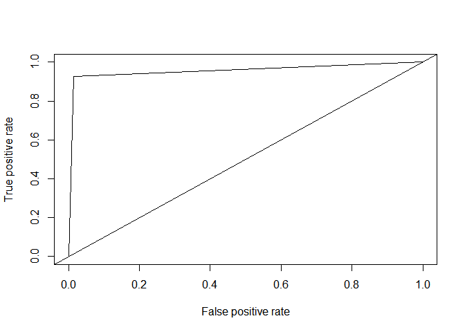<!-- -->

``` r
performance(pred_lm, 'auc')@y.values[[1]]
```

    ## [1] 0.9564702

``` r
binomial_deviance(y_obs, yhat_lm)
```

    ## [1] 73.70452
