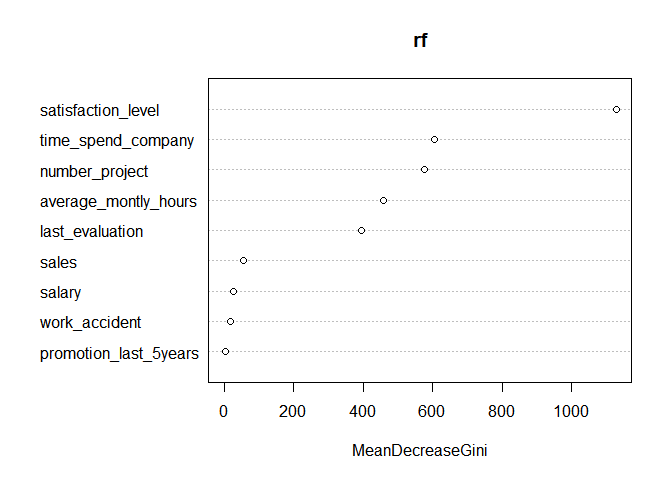
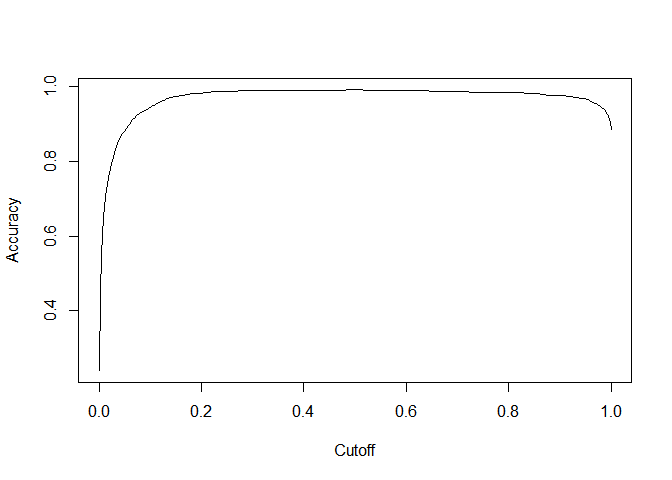

ADP STAT\_2
================
jakinpilla
2019-05-02

``` r
setwd("C:/Users/Daniel/ADP_performance_test")
getwd()
```

    ## [1] "C:/Users/Daniel/ADP_performance_test"

여러 개의 패키지를 한 번에 읽기

logistic regression with spambase———————————————

data loading(ham or spam)—-

``` r
# h <- new_handle(copypostfields = "moo=moomooo")
# handle_setheaders(h,
#                   "Content-Type" = "text/moo",
#                   "Cache-Control" = "no-cache",
#                   "User-Agent" = "A cow"
# )
# 
# tmp <- tempfile()
# 
# curl_download('https://archive.ics.uci.edu/ml/machine-learning-databases/spambase/spambase.data', tmp, handle=h)
# data <-read.csv(tmp, header=F)
# head(data)
# feature_names <- c('radius', 'texture', 'perimeter', 'area', 'smoothness',
#                    'compactness', 'concavity', 'concave_points', 'symmetry', 'fractal_dim')
# 
# names(data) <-
#   c('word_freq_make', 'word_freq_address', 'word_freq_all', 'word_freq_3d', 'word_freq_our',
#     'word_freq_over', 'word_freq_remove', 'word_freq_internet', 'word_freq_order', 'word_freq_mail',
#     'word_freq_receive', 'word_freq_will', 'word_freq_people', 'word_freq_report', 'word_freq_addresses',
#     'word_freq_free', 'word_freq_business', 'word_freq_email', 'word_freq_you', 'word_freq_credit',
#     'word_freq_your', 'word_freq_font', 'word_freq_000', 'word_freq_money', 'word_freq_hp',
#     'word_freq_hpl', 'word_freq_george', 'word_freq_650', 'word_freq_lab', 'word_freq_labs',
#     'word_freq_telnet', 'word_freq_857', 'word_freq_data', 'word_freq_415', 'word_freq_85',
#     'word_freq_technology', 'word_freq_1999', 'word_freq_parts', 'word_freq_pm', 'word_freq_direct',
#     'word_freq_cs', 'word_freq_meeting', 'word_freq_original', 'word_freq_project', 'word_freq_re',
#     'word_freq_edu', 'word_freq_table', 'word_freq_conference', 'char_freq_;', 'char_freq_(',
#     'char_freq_[', 'char_freq_!', 'char_freq_$', 'char_freq_#', 'capital_run_length_average',
#     'capital_run_length_longest', 'capital_run_length_total',
#     # 'spam'
#     'class'
#   )

# 
# data %>% 
#   write_csv("./data/word_counts_spam.csv")

data <- read_csv("./data/word_counts_spam.csv")
```

    ## Parsed with column specification:
    ## cols(
    ##   .default = col_double()
    ## )

    ## See spec(...) for full column specifications.

``` r
data$class <- factor(data$class); glimpse(data)
```

    ## Observations: 4,601
    ## Variables: 58
    ## $ word_freq_make             <dbl> 0.00, 0.21, 0.06, 0.00, 0.00, 0.00,...
    ## $ word_freq_address          <dbl> 0.64, 0.28, 0.00, 0.00, 0.00, 0.00,...
    ## $ word_freq_all              <dbl> 0.64, 0.50, 0.71, 0.00, 0.00, 0.00,...
    ## $ word_freq_3d               <dbl> 0, 0, 0, 0, 0, 0, 0, 0, 0, 0, 0, 0,...
    ## $ word_freq_our              <dbl> 0.32, 0.14, 1.23, 0.63, 0.63, 1.85,...
    ## $ word_freq_over             <dbl> 0.00, 0.28, 0.19, 0.00, 0.00, 0.00,...
    ## $ word_freq_remove           <dbl> 0.00, 0.21, 0.19, 0.31, 0.31, 0.00,...
    ## $ word_freq_internet         <dbl> 0.00, 0.07, 0.12, 0.63, 0.63, 1.85,...
    ## $ word_freq_order            <dbl> 0.00, 0.00, 0.64, 0.31, 0.31, 0.00,...
    ## $ word_freq_mail             <dbl> 0.00, 0.94, 0.25, 0.63, 0.63, 0.00,...
    ## $ word_freq_receive          <dbl> 0.00, 0.21, 0.38, 0.31, 0.31, 0.00,...
    ## $ word_freq_will             <dbl> 0.64, 0.79, 0.45, 0.31, 0.31, 0.00,...
    ## $ word_freq_people           <dbl> 0.00, 0.65, 0.12, 0.31, 0.31, 0.00,...
    ## $ word_freq_report           <dbl> 0.00, 0.21, 0.00, 0.00, 0.00, 0.00,...
    ## $ word_freq_addresses        <dbl> 0.00, 0.14, 1.75, 0.00, 0.00, 0.00,...
    ## $ word_freq_free             <dbl> 0.32, 0.14, 0.06, 0.31, 0.31, 0.00,...
    ## $ word_freq_business         <dbl> 0.00, 0.07, 0.06, 0.00, 0.00, 0.00,...
    ## $ word_freq_email            <dbl> 1.29, 0.28, 1.03, 0.00, 0.00, 0.00,...
    ## $ word_freq_you              <dbl> 1.93, 3.47, 1.36, 3.18, 3.18, 0.00,...
    ## $ word_freq_credit           <dbl> 0.00, 0.00, 0.32, 0.00, 0.00, 0.00,...
    ## $ word_freq_your             <dbl> 0.96, 1.59, 0.51, 0.31, 0.31, 0.00,...
    ## $ word_freq_font             <dbl> 0, 0, 0, 0, 0, 0, 0, 0, 0, 0, 0, 0,...
    ## $ word_freq_000              <dbl> 0.00, 0.43, 1.16, 0.00, 0.00, 0.00,...
    ## $ word_freq_money            <dbl> 0.00, 0.43, 0.06, 0.00, 0.00, 0.00,...
    ## $ word_freq_hp               <dbl> 0, 0, 0, 0, 0, 0, 0, 0, 0, 0, 0, 0,...
    ## $ word_freq_hpl              <dbl> 0, 0, 0, 0, 0, 0, 0, 0, 0, 0, 0, 0,...
    ## $ word_freq_george           <dbl> 0, 0, 0, 0, 0, 0, 0, 0, 0, 0, 0, 0,...
    ## $ word_freq_650              <dbl> 0.00, 0.00, 0.00, 0.00, 0.00, 0.00,...
    ## $ word_freq_lab              <dbl> 0, 0, 0, 0, 0, 0, 0, 0, 0, 0, 0, 0,...
    ## $ word_freq_labs             <dbl> 0, 0, 0, 0, 0, 0, 0, 0, 0, 0, 0, 0,...
    ## $ word_freq_telnet           <dbl> 0, 0, 0, 0, 0, 0, 0, 0, 0, 0, 0, 0,...
    ## $ word_freq_857              <dbl> 0, 0, 0, 0, 0, 0, 0, 0, 0, 0, 0, 0,...
    ## $ word_freq_data             <dbl> 0.00, 0.00, 0.00, 0.00, 0.00, 0.00,...
    ## $ word_freq_415              <dbl> 0, 0, 0, 0, 0, 0, 0, 0, 0, 0, 0, 0,...
    ## $ word_freq_85               <dbl> 0, 0, 0, 0, 0, 0, 0, 0, 0, 0, 0, 0,...
    ## $ word_freq_technology       <dbl> 0.00, 0.00, 0.00, 0.00, 0.00, 0.00,...
    ## $ word_freq_1999             <dbl> 0.00, 0.07, 0.00, 0.00, 0.00, 0.00,...
    ## $ word_freq_parts            <dbl> 0, 0, 0, 0, 0, 0, 0, 0, 0, 0, 0, 0,...
    ## $ word_freq_pm               <dbl> 0, 0, 0, 0, 0, 0, 0, 0, 0, 0, 0, 0,...
    ## $ word_freq_direct           <dbl> 0.00, 0.00, 0.06, 0.00, 0.00, 0.00,...
    ## $ word_freq_cs               <dbl> 0, 0, 0, 0, 0, 0, 0, 0, 0, 0, 0, 0,...
    ## $ word_freq_meeting          <dbl> 0, 0, 0, 0, 0, 0, 0, 0, 0, 0, 0, 0,...
    ## $ word_freq_original         <dbl> 0.00, 0.00, 0.12, 0.00, 0.00, 0.00,...
    ## $ word_freq_project          <dbl> 0.00, 0.00, 0.00, 0.00, 0.00, 0.00,...
    ## $ word_freq_re               <dbl> 0.00, 0.00, 0.06, 0.00, 0.00, 0.00,...
    ## $ word_freq_edu              <dbl> 0.00, 0.00, 0.06, 0.00, 0.00, 0.00,...
    ## $ word_freq_table            <dbl> 0, 0, 0, 0, 0, 0, 0, 0, 0, 0, 0, 0,...
    ## $ word_freq_conference       <dbl> 0, 0, 0, 0, 0, 0, 0, 0, 0, 0, 0, 0,...
    ## $ `char_freq_;`              <dbl> 0.000, 0.000, 0.010, 0.000, 0.000, ...
    ## $ `char_freq_(`              <dbl> 0.000, 0.132, 0.143, 0.137, 0.135, ...
    ## $ `char_freq_[`              <dbl> 0.000, 0.000, 0.000, 0.000, 0.000, ...
    ## $ `char_freq_!`              <dbl> 0.778, 0.372, 0.276, 0.137, 0.135, ...
    ## $ `char_freq_$`              <dbl> 0.000, 0.180, 0.184, 0.000, 0.000, ...
    ## $ `char_freq_#`              <dbl> 0.000, 0.048, 0.010, 0.000, 0.000, ...
    ## $ capital_run_length_average <dbl> 3.756, 5.114, 9.821, 3.537, 3.537, ...
    ## $ capital_run_length_longest <dbl> 61, 101, 485, 40, 40, 15, 4, 11, 44...
    ## $ capital_run_length_total   <dbl> 278, 1028, 2259, 191, 191, 54, 112,...
    ## $ class                      <fct> 1, 1, 1, 1, 1, 1, 1, 1, 1, 1, 1, 1,...

``` r
dim(data)
```

    ## [1] 4601   58

``` r
tmp <- as.data.frame(cor(data[,-58], as.numeric(data$class))); 
tmp
```

    ##                                      V1
    ## word_freq_make              0.126207575
    ## word_freq_address          -0.030223579
    ## word_freq_all               0.196987973
    ## word_freq_3d                0.057371390
    ## word_freq_our               0.241920438
    ## word_freq_over              0.232604300
    ## word_freq_remove            0.332117416
    ## word_freq_internet          0.206808476
    ## word_freq_order             0.231551431
    ## word_freq_mail              0.138962113
    ## word_freq_receive           0.234529271
    ## word_freq_will              0.007740737
    ## word_freq_people            0.132926726
    ## word_freq_report            0.060027316
    ## word_freq_addresses         0.195902457
    ## word_freq_free              0.263214699
    ## word_freq_business          0.263203983
    ## word_freq_email             0.204208139
    ## word_freq_you               0.273651287
    ## word_freq_credit            0.189761149
    ## word_freq_your              0.383233819
    ## word_freq_font              0.091860096
    ## word_freq_000               0.334787039
    ## word_freq_money             0.216110982
    ## word_freq_hp               -0.256722916
    ## word_freq_hpl              -0.232967687
    ## word_freq_george           -0.183404005
    ## word_freq_650              -0.158800249
    ## word_freq_lab              -0.133523188
    ## word_freq_labs             -0.171094588
    ## word_freq_telnet           -0.126912158
    ## word_freq_857              -0.114214033
    ## word_freq_data             -0.119931013
    ## word_freq_415              -0.112754185
    ## word_freq_85               -0.149225214
    ## word_freq_technology       -0.136134205
    ## word_freq_1999             -0.178045460
    ## word_freq_parts            -0.031035289
    ## word_freq_pm               -0.122830654
    ## word_freq_direct           -0.064801202
    ## word_freq_cs               -0.097374832
    ## word_freq_meeting          -0.136615372
    ## word_freq_original         -0.135664281
    ## word_freq_project          -0.094594042
    ## word_freq_re               -0.140408465
    ## word_freq_edu              -0.146138186
    ## word_freq_table            -0.044678563
    ## word_freq_conference       -0.084019802
    ## char_freq_;                -0.059629667
    ## char_freq_(                -0.089671981
    ## char_freq_[                -0.064709337
    ## char_freq_!                 0.241888367
    ## char_freq_$                 0.323628806
    ## char_freq_#                 0.065066729
    ## capital_run_length_average  0.109999143
    ## capital_run_length_longest  0.216096694
    ## capital_run_length_total    0.249164124

``` r
tmp <- tmp %>% rename(cor=V1) 
tmp$var <- rownames(tmp)
head(tmp)
```

    ##                           cor               var
    ## word_freq_make     0.12620757    word_freq_make
    ## word_freq_address -0.03022358 word_freq_address
    ## word_freq_all      0.19698797     word_freq_all
    ## word_freq_3d       0.05737139      word_freq_3d
    ## word_freq_our      0.24192044     word_freq_our
    ## word_freq_over     0.23260430    word_freq_over

What words are strongly related with spam mail? —————————–

``` r
tmp %>%
  ggplot(aes(reorder(var, cor), cor)) +
  geom_point() +
  coord_flip()
```

<!-- -->

Visualizing data ————————————————————-

``` r
p1 <- data %>% ggplot(aes(class)) + geom_bar()

p2 <- data %>% ggplot(aes(class, `char_freq_$`)) +
  geom_jitter(col='gray') +
  geom_boxplot(alpha=.5) +
  scale_y_sqrt()

p3 <- data %>% ggplot(aes(`char_freq_$`, group=class, fill=class)) +
  geom_density(alpha=.5) +
  scale_x_sqrt() + scale_y_sqrt()

p4 <- data %>% ggplot(aes(class, capital_run_length_longest)) +
  geom_jitter(col='gray') +
  geom_boxplot(alpha=.5) +
  scale_y_log10()

grid.arrange(p1, p2, p3, p4, ncol=2)
```

<!-- -->

Punc character change ————————————————————-

``` r
old_names <- names(data)
old_names
```

    ##  [1] "word_freq_make"             "word_freq_address"         
    ##  [3] "word_freq_all"              "word_freq_3d"              
    ##  [5] "word_freq_our"              "word_freq_over"            
    ##  [7] "word_freq_remove"           "word_freq_internet"        
    ##  [9] "word_freq_order"            "word_freq_mail"            
    ## [11] "word_freq_receive"          "word_freq_will"            
    ## [13] "word_freq_people"           "word_freq_report"          
    ## [15] "word_freq_addresses"        "word_freq_free"            
    ## [17] "word_freq_business"         "word_freq_email"           
    ## [19] "word_freq_you"              "word_freq_credit"          
    ## [21] "word_freq_your"             "word_freq_font"            
    ## [23] "word_freq_000"              "word_freq_money"           
    ## [25] "word_freq_hp"               "word_freq_hpl"             
    ## [27] "word_freq_george"           "word_freq_650"             
    ## [29] "word_freq_lab"              "word_freq_labs"            
    ## [31] "word_freq_telnet"           "word_freq_857"             
    ## [33] "word_freq_data"             "word_freq_415"             
    ## [35] "word_freq_85"               "word_freq_technology"      
    ## [37] "word_freq_1999"             "word_freq_parts"           
    ## [39] "word_freq_pm"               "word_freq_direct"          
    ## [41] "word_freq_cs"               "word_freq_meeting"         
    ## [43] "word_freq_original"         "word_freq_project"         
    ## [45] "word_freq_re"               "word_freq_edu"             
    ## [47] "word_freq_table"            "word_freq_conference"      
    ## [49] "char_freq_;"                "char_freq_("               
    ## [51] "char_freq_["                "char_freq_!"               
    ## [53] "char_freq_$"                "char_freq_#"               
    ## [55] "capital_run_length_average" "capital_run_length_longest"
    ## [57] "capital_run_length_total"   "class"

``` r
new_names <- make.names(names(data), unique=T) # make.names() : change punc character...
new_names
```

    ##  [1] "word_freq_make"             "word_freq_address"         
    ##  [3] "word_freq_all"              "word_freq_3d"              
    ##  [5] "word_freq_our"              "word_freq_over"            
    ##  [7] "word_freq_remove"           "word_freq_internet"        
    ##  [9] "word_freq_order"            "word_freq_mail"            
    ## [11] "word_freq_receive"          "word_freq_will"            
    ## [13] "word_freq_people"           "word_freq_report"          
    ## [15] "word_freq_addresses"        "word_freq_free"            
    ## [17] "word_freq_business"         "word_freq_email"           
    ## [19] "word_freq_you"              "word_freq_credit"          
    ## [21] "word_freq_your"             "word_freq_font"            
    ## [23] "word_freq_000"              "word_freq_money"           
    ## [25] "word_freq_hp"               "word_freq_hpl"             
    ## [27] "word_freq_george"           "word_freq_650"             
    ## [29] "word_freq_lab"              "word_freq_labs"            
    ## [31] "word_freq_telnet"           "word_freq_857"             
    ## [33] "word_freq_data"             "word_freq_415"             
    ## [35] "word_freq_85"               "word_freq_technology"      
    ## [37] "word_freq_1999"             "word_freq_parts"           
    ## [39] "word_freq_pm"               "word_freq_direct"          
    ## [41] "word_freq_cs"               "word_freq_meeting"         
    ## [43] "word_freq_original"         "word_freq_project"         
    ## [45] "word_freq_re"               "word_freq_edu"             
    ## [47] "word_freq_table"            "word_freq_conference"      
    ## [49] "char_freq_."                "char_freq_..1"             
    ## [51] "char_freq_..2"              "char_freq_..3"             
    ## [53] "char_freq_..4"              "char_freq_..5"             
    ## [55] "capital_run_length_average" "capital_run_length_longest"
    ## [57] "capital_run_length_total"   "class"

``` r
cbind(old_names, new_names) [old_names != new_names,] # beautiful coding...
```

    ##      old_names     new_names      
    ## [1,] "char_freq_;" "char_freq_."  
    ## [2,] "char_freq_(" "char_freq_..1"
    ## [3,] "char_freq_[" "char_freq_..2"
    ## [4,] "char_freq_!" "char_freq_..3"
    ## [5,] "char_freq_$" "char_freq_..4"
    ## [6,] "char_freq_#" "char_freq_..5"

``` r
names(data) <- new_names
```

Splitting dataset ————————————————————-

``` r
set.seed(2019)
n <- nrow(data)
idx <- 1:n
training_idx <- sample(idx, n * .6)
idx <- setdiff(idx, training_idx)
validate_idx <- sample(idx, n * .2)
test_idx <- setdiff(idx, validate_idx)
training <- data[training_idx, ]
validation <- data[validate_idx, ]
test <- data[test_idx, ]

training_idx %>% length()
```

    ## [1] 2760

``` r
validate_idx %>% length()
```

    ## [1] 920

``` r
test_idx %>% length()
```

    ## [1] 921

Logistic regression ————————————————————-

``` r
data_lm_full <- glm(class ~., data=training, family = binomial)
```

    ## Warning: glm.fit: fitted probabilities numerically 0 or 1 occurred

``` r
summary(data_lm_full)
```

    ## 
    ## Call:
    ## glm(formula = class ~ ., family = binomial, data = training)
    ## 
    ## Deviance Residuals: 
    ##     Min       1Q   Median       3Q      Max  
    ## -3.9828  -0.2044   0.0000   0.1245   4.3463  
    ## 
    ## Coefficients:
    ##                              Estimate Std. Error z value Pr(>|z|)    
    ## (Intercept)                -1.581e+00  2.065e-01  -7.657 1.91e-14 ***
    ## word_freq_make             -7.775e-01  3.481e-01  -2.234 0.025504 *  
    ## word_freq_address          -1.651e-01  8.568e-02  -1.927 0.053989 .  
    ## word_freq_all               1.314e-01  1.488e-01   0.883 0.377170    
    ## word_freq_3d                3.022e+00  1.956e+00   1.545 0.122367    
    ## word_freq_our               6.525e-01  1.532e-01   4.260 2.04e-05 ***
    ## word_freq_over              5.338e-01  2.549e-01   2.095 0.036200 *  
    ## word_freq_remove            1.701e+00  3.528e-01   4.822 1.42e-06 ***
    ## word_freq_internet          3.298e-01  1.884e-01   1.751 0.079946 .  
    ## word_freq_order             5.208e-01  4.061e-01   1.282 0.199681    
    ## word_freq_mail              8.236e-02  1.050e-01   0.784 0.432749    
    ## word_freq_receive          -4.699e-01  3.818e-01  -1.231 0.218367    
    ## word_freq_will             -1.311e-01  9.947e-02  -1.318 0.187427    
    ## word_freq_people           -2.457e-01  2.925e-01  -0.840 0.400994    
    ## word_freq_report            9.775e-03  1.810e-01   0.054 0.956928    
    ## word_freq_addresses         6.811e-01  7.492e-01   0.909 0.363347    
    ## word_freq_free              1.033e+00  1.897e-01   5.443 5.24e-08 ***
    ## word_freq_business          9.748e-01  3.311e-01   2.944 0.003237 ** 
    ## word_freq_email             2.576e-01  1.609e-01   1.600 0.109491    
    ## word_freq_you               3.092e-02  4.694e-02   0.659 0.510066    
    ## word_freq_credit            2.740e+00  1.084e+00   2.527 0.011503 *  
    ## word_freq_your              2.893e-01  6.920e-02   4.181 2.90e-05 ***
    ## word_freq_font              7.187e-02  1.804e-01   0.398 0.690316    
    ## word_freq_000               1.744e+00  5.556e-01   3.139 0.001698 ** 
    ## word_freq_money             2.870e-01  1.247e-01   2.302 0.021339 *  
    ## word_freq_hp               -3.100e+00  5.748e-01  -5.394 6.90e-08 ***
    ## word_freq_hpl              -4.926e-01  4.778e-01  -1.031 0.302570    
    ## word_freq_george           -7.335e+00  1.916e+00  -3.829 0.000128 ***
    ## word_freq_650               5.837e-01  3.068e-01   1.903 0.057105 .  
    ## word_freq_lab              -1.949e+00  1.495e+00  -1.304 0.192382    
    ## word_freq_labs             -3.652e-01  5.238e-01  -0.697 0.485633    
    ## word_freq_telnet            1.249e+00  1.590e+00   0.785 0.432163    
    ## word_freq_857               2.513e-01  3.087e+00   0.081 0.935123    
    ## word_freq_data             -9.655e-01  4.621e-01  -2.089 0.036677 *  
    ## word_freq_415               1.432e+00  2.307e+00   0.621 0.534735    
    ## word_freq_85               -1.458e+00  1.137e+00  -1.283 0.199476    
    ## word_freq_technology        9.402e-01  3.783e-01   2.485 0.012951 *  
    ## word_freq_1999              7.706e-02  2.357e-01   0.327 0.743677    
    ## word_freq_parts             9.072e-01  1.680e+00   0.540 0.589271    
    ## word_freq_pm               -9.684e-01  4.778e-01  -2.027 0.042693 *  
    ## word_freq_direct           -4.864e-01  4.176e-01  -1.165 0.244083    
    ## word_freq_cs               -3.562e+01  2.442e+01  -1.459 0.144621    
    ## word_freq_meeting          -1.989e+00  8.453e-01  -2.353 0.018602 *  
    ## word_freq_original         -7.915e-01  8.503e-01  -0.931 0.351953    
    ## word_freq_project          -1.901e+00  7.397e-01  -2.570 0.010177 *  
    ## word_freq_re               -1.097e+00  2.441e-01  -4.493 7.03e-06 ***
    ## word_freq_edu              -9.717e-01  2.897e-01  -3.355 0.000795 ***
    ## word_freq_table            -3.290e+00  3.023e+00  -1.088 0.276405    
    ## word_freq_conference       -3.418e+00  2.094e+00  -1.632 0.102587    
    ## char_freq_.                -1.106e+00  5.111e-01  -2.164 0.030429 *  
    ## char_freq_..1              -6.925e-01  4.486e-01  -1.544 0.122629    
    ## char_freq_..2              -6.456e-01  1.268e+00  -0.509 0.610638    
    ## char_freq_..3               4.995e-01  1.478e-01   3.380 0.000725 ***
    ## char_freq_..4               7.117e+00  1.131e+00   6.295 3.07e-10 ***
    ## char_freq_..5               1.950e+00  1.157e+00   1.686 0.091805 .  
    ## capital_run_length_average  1.050e-01  5.674e-02   1.851 0.064142 .  
    ## capital_run_length_longest  8.240e-03  3.433e-03   2.400 0.016379 *  
    ## capital_run_length_total    6.964e-04  2.730e-04   2.551 0.010734 *  
    ## ---
    ## Signif. codes:  0 '***' 0.001 '**' 0.01 '*' 0.05 '.' 0.1 ' ' 1
    ## 
    ## (Dispersion parameter for binomial family taken to be 1)
    ## 
    ##     Null deviance: 3716.6  on 2759  degrees of freedom
    ## Residual deviance: 1108.8  on 2702  degrees of freedom
    ## AIC: 1224.8
    ## 
    ## Number of Fisher Scoring iterations: 12

``` r
predict(data_lm_full, newdata = data[1:5, ], type='response')
```

    ##         1         2         3         4         5 
    ## 0.7314422 0.9819171 0.9999950 0.6967800 0.6968616

Predict ———————————————————————-

``` r
head(training)
```

    ## # A tibble: 6 x 58
    ##   word_freq_make word_freq_addre~ word_freq_all word_freq_3d word_freq_our
    ##            <dbl>            <dbl>         <dbl>        <dbl>         <dbl>
    ## 1           0.67             0             0               0          0   
    ## 2           0                0             0               0          0   
    ## 3           0.12             0.12          0.24            0          1.34
    ## 4           0.19             0             0               0          0   
    ## 5           0.16             0.32          0.65            0          0.32
    ## 6           0.53             0             1.07            0          0.53
    ## # ... with 53 more variables: word_freq_over <dbl>,
    ## #   word_freq_remove <dbl>, word_freq_internet <dbl>,
    ## #   word_freq_order <dbl>, word_freq_mail <dbl>, word_freq_receive <dbl>,
    ## #   word_freq_will <dbl>, word_freq_people <dbl>, word_freq_report <dbl>,
    ## #   word_freq_addresses <dbl>, word_freq_free <dbl>,
    ## #   word_freq_business <dbl>, word_freq_email <dbl>, word_freq_you <dbl>,
    ## #   word_freq_credit <dbl>, word_freq_your <dbl>, word_freq_font <dbl>,
    ## #   word_freq_000 <dbl>, word_freq_money <dbl>, word_freq_hp <dbl>,
    ## #   word_freq_hpl <dbl>, word_freq_george <dbl>, word_freq_650 <dbl>,
    ## #   word_freq_lab <dbl>, word_freq_labs <dbl>, word_freq_telnet <dbl>,
    ## #   word_freq_857 <dbl>, word_freq_data <dbl>, word_freq_415 <dbl>,
    ## #   word_freq_85 <dbl>, word_freq_technology <dbl>, word_freq_1999 <dbl>,
    ## #   word_freq_parts <dbl>, word_freq_pm <dbl>, word_freq_direct <dbl>,
    ## #   word_freq_cs <dbl>, word_freq_meeting <dbl>, word_freq_original <dbl>,
    ## #   word_freq_project <dbl>, word_freq_re <dbl>, word_freq_edu <dbl>,
    ## #   word_freq_table <dbl>, word_freq_conference <dbl>, char_freq_. <dbl>,
    ## #   char_freq_..1 <dbl>, char_freq_..2 <dbl>, char_freq_..3 <dbl>,
    ## #   char_freq_..4 <dbl>, char_freq_..5 <dbl>,
    ## #   capital_run_length_average <dbl>, capital_run_length_longest <dbl>,
    ## #   capital_run_length_total <dbl>, class <fct>

``` r
head(test)
```

    ## # A tibble: 6 x 58
    ##   word_freq_make word_freq_addre~ word_freq_all word_freq_3d word_freq_our
    ##            <dbl>            <dbl>         <dbl>        <dbl>         <dbl>
    ## 1           0                0             0               0          0.63
    ## 2           0                0             0               0          1.85
    ## 3           0.06             0.12          0.77            0          0.19
    ## 4           0                0             0.25            0          0.38
    ## 5           0                0             1.42            0          0.71
    ## 6           0                0             0               0          0   
    ## # ... with 53 more variables: word_freq_over <dbl>,
    ## #   word_freq_remove <dbl>, word_freq_internet <dbl>,
    ## #   word_freq_order <dbl>, word_freq_mail <dbl>, word_freq_receive <dbl>,
    ## #   word_freq_will <dbl>, word_freq_people <dbl>, word_freq_report <dbl>,
    ## #   word_freq_addresses <dbl>, word_freq_free <dbl>,
    ## #   word_freq_business <dbl>, word_freq_email <dbl>, word_freq_you <dbl>,
    ## #   word_freq_credit <dbl>, word_freq_your <dbl>, word_freq_font <dbl>,
    ## #   word_freq_000 <dbl>, word_freq_money <dbl>, word_freq_hp <dbl>,
    ## #   word_freq_hpl <dbl>, word_freq_george <dbl>, word_freq_650 <dbl>,
    ## #   word_freq_lab <dbl>, word_freq_labs <dbl>, word_freq_telnet <dbl>,
    ## #   word_freq_857 <dbl>, word_freq_data <dbl>, word_freq_415 <dbl>,
    ## #   word_freq_85 <dbl>, word_freq_technology <dbl>, word_freq_1999 <dbl>,
    ## #   word_freq_parts <dbl>, word_freq_pm <dbl>, word_freq_direct <dbl>,
    ## #   word_freq_cs <dbl>, word_freq_meeting <dbl>, word_freq_original <dbl>,
    ## #   word_freq_project <dbl>, word_freq_re <dbl>, word_freq_edu <dbl>,
    ## #   word_freq_table <dbl>, word_freq_conference <dbl>, char_freq_. <dbl>,
    ## #   char_freq_..1 <dbl>, char_freq_..2 <dbl>, char_freq_..3 <dbl>,
    ## #   char_freq_..4 <dbl>, char_freq_..5 <dbl>,
    ## #   capital_run_length_average <dbl>, capital_run_length_longest <dbl>,
    ## #   capital_run_length_total <dbl>, class <fct>

``` r
y_hat_lm_train <- predict(data_lm_full, newdata=training, type='response')
y_hat_lm_test <- predict(data_lm_full, newdata=test, type='response')
```

Model Evalidation —————————————————————–

``` r
rmse <- function(y_obs, yhat){
  sqrt(mean((y_obs - yhat)^2))
}

binomial_deviance <- function(y_obs, yhat){
  epsilon = 0.0001
  yhat = ifelse(yhat < epsilon, epsilon, yhat)
  yhat = ifelse(yhat > 1-epsilon, 1-epsilon, yhat)
  a = ifelse(y_obs==0, 0, y_obs * log(y_obs/yhat))
  b = ifelse(y_obs==1, 0, (1-y_obs) * log((1-y_obs)/(1-yhat)))
  return(2*sum(a + b))
}

validation$class %>% as.character() %>% as.numeric() -> y_obs
y_hat_lm <- predict(data_lm_full, newdata=validation, type='response')

# make prediction object...
pred_lm <- prediction(y_hat_lm, y_obs)

# make performance object...
perf_lm <- performance(pred_lm, 'tpr', 'fpr')

# ROC curve...
plot(perf_lm)
abline(0, 1, col = "red")
```

<!-- -->

``` r
# AUC value...
performance(pred_lm, 'auc')@y.values[[1]]
```

    ## [1] 0.96902

``` r
binomial_deviance(y_obs, y_hat_lm)
```

    ## [1] 435.5339

``` r
# confusion matrix...
range(y_hat_lm_test)
```

    ## [1] 2.220446e-16 1.000000e+00

``` r
y_hat_lm <- as.factor(ifelse(y_hat_lm_test > .5, 1, 0))
y_obs <- as.factor(test$class)
table(y_obs, y_hat_lm) -> cm; print(cm)
```

    ##      y_hat_lm
    ## y_obs   0   1
    ##     0 534  22
    ##     1  32 333

``` r
confusionMatrix(y_hat_lm, y_obs)
```

    ## Confusion Matrix and Statistics
    ## 
    ##           Reference
    ## Prediction   0   1
    ##          0 534  32
    ##          1  22 333
    ##                                           
    ##                Accuracy : 0.9414          
    ##                  95% CI : (0.9242, 0.9557)
    ##     No Information Rate : 0.6037          
    ##     P-Value [Acc > NIR] : <2e-16          
    ##                                           
    ##                   Kappa : 0.8769          
    ##  Mcnemar's Test P-Value : 0.2207          
    ##                                           
    ##             Sensitivity : 0.9604          
    ##             Specificity : 0.9123          
    ##          Pos Pred Value : 0.9435          
    ##          Neg Pred Value : 0.9380          
    ##              Prevalence : 0.6037          
    ##          Detection Rate : 0.5798          
    ##    Detection Prevalence : 0.6145          
    ##       Balanced Accuracy : 0.9364          
    ##                                           
    ##        'Positive' Class : 0               
    ## 

Multi-logistic regression with iris dataset & nnet package…—————– 다항
로지스틱 회귀 : 예측하고자 하는 분류 여러개 :: multinom ——————

``` r
library(nnet)
m_nnet <- multinom(Species ~., data=iris)
```

    ## # weights:  18 (10 variable)
    ## initial  value 164.791843 
    ## iter  10 value 16.177348
    ## iter  20 value 7.111438
    ## iter  30 value 6.182999
    ## iter  40 value 5.984028
    ## iter  50 value 5.961278
    ## iter  60 value 5.954900
    ## iter  70 value 5.951851
    ## iter  80 value 5.950343
    ## iter  90 value 5.949904
    ## iter 100 value 5.949867
    ## final  value 5.949867 
    ## stopped after 100 iterations

``` r
head(fitted(m_nnet))
```

    ##      setosa   versicolor    virginica
    ## 1 1.0000000 1.526406e-09 2.716417e-36
    ## 2 0.9999996 3.536476e-07 2.883729e-32
    ## 3 1.0000000 4.443506e-08 6.103424e-34
    ## 4 0.9999968 3.163905e-06 7.117010e-31
    ## 5 1.0000000 1.102983e-09 1.289946e-36
    ## 6 1.0000000 3.521573e-10 1.344907e-35

``` r
predict(m_nnet, newdata = iris[c(1,51,101), ], type='class')
```

    ## [1] setosa     versicolor virginica 
    ## Levels: setosa versicolor virginica

``` r
predict(m_nnet, newdata = iris[c(1,51,101), ], type='probs') # default :: probs
```

    ##           setosa   versicolor    virginica
    ## 1   1.000000e+00 1.526406e-09 2.716417e-36
    ## 51  2.427101e-07 9.999877e-01 1.201699e-05
    ## 101 9.453717e-25 2.718072e-10 1.000000e+00

Accuracy—-

``` r
y_hat_nnet <- predict(m_nnet, newdata=iris) 
sum(y_hat_nnet == iris$Species) / length(y_hat_nnet)
```

    ## [1] 0.9866667

``` r
xtabs(~ y_hat_nnet + iris$Species)
```

    ##             iris$Species
    ## y_hat_nnet   setosa versicolor virginica
    ##   setosa         50          0         0
    ##   versicolor      0         49         1
    ##   virginica       0          1        49

DT and RF modeling with titanic dataset————————————— Loading
titanic\_preprocessed dataset

``` r
read_csv('./data/titanic_preprocessed.csv') %>%
  mutate(survived = as.factor(survived))-> titanic; head(titanic)
```

    ## Parsed with column specification:
    ## cols(
    ##   pclass = col_double(),
    ##   sex = col_double(),
    ##   age = col_double(),
    ##   sibsp = col_double(),
    ##   parch = col_double(),
    ##   fare = col_double(),
    ##   embarked = col_double(),
    ##   survived = col_character()
    ## )

    ## # A tibble: 6 x 8
    ##   pclass   sex   age sibsp parch  fare embarked survived
    ##    <dbl> <dbl> <dbl> <dbl> <dbl> <dbl>    <dbl> <fct>   
    ## 1      1     0 29        0     0 211.         3 survived
    ## 2      1     1  0.92     1     2 152.         3 survived
    ## 3      1     0  2        1     2 152.         3 dead    
    ## 4      1     1 30        1     2 152.         3 dead    
    ## 5      1     0 25        1     2 152.         3 dead    
    ## 6      1     1 48        0     0  26.6        3 survived

``` r
titanic$pclass <- as.factor(titanic$pclass)
titanic$sex <- as.factor(titanic$sex)
titanic$embarked <- as.factor(titanic$embarked)
glimpse(titanic)
```

    ## Observations: 1,307
    ## Variables: 8
    ## $ pclass   <fct> 1, 1, 1, 1, 1, 1, 1, 1, 1, 1, 1, 1, 1, 1, 1, 1, 1, 1,...
    ## $ sex      <fct> 0, 1, 0, 1, 0, 1, 0, 1, 0, 1, 1, 0, 0, 0, 1, 1, 1, 0,...
    ## $ age      <dbl> 29.00, 0.92, 2.00, 30.00, 25.00, 48.00, 63.00, 39.00,...
    ## $ sibsp    <dbl> 0, 1, 1, 1, 1, 0, 1, 0, 2, 0, 1, 1, 0, 0, 0, 0, 0, 0,...
    ## $ parch    <dbl> 0, 2, 2, 2, 2, 0, 0, 0, 0, 0, 0, 0, 0, 0, 0, 0, 1, 1,...
    ## $ fare     <dbl> 211.3375, 151.5500, 151.5500, 151.5500, 151.5500, 26....
    ## $ embarked <fct> 3, 3, 3, 3, 3, 3, 3, 3, 3, 1, 1, 1, 1, 3, 3, 3, 1, 1,...
    ## $ survived <fct> survived, survived, dead, dead, dead, survived, survi...

DT with rpart package—-

수량형 변수를 팩터로 변환, 의사결정나무에 적합

Splitting dataset—-

``` r
set.seed(2019)
n <- nrow(titanic)
idx <- 1:n
training_idx <- sample(idx, n * .6)
idx <- setdiff(idx, training_idx)
validate_idx <- sample(idx, n * .2)
test_idx <- setdiff(idx, validate_idx)
titanic.train <- titanic[training_idx, ]
titanic.validation <- titanic[validate_idx, ]
titanic.test <- titanic[test_idx, ]
```

Plotting—-

``` r
m_dt <- rpart(survived ~ pclass + sex + age + sibsp + parch + fare + embarked, data=titanic.train)
plot(m_dt)
text(m_dt, cex=.8)
```

<!-- -->

The complexity parameter (cp) ….

CP is used to control the size of the decision tree and to select the
optimal tree size.

``` r
printcp(m_dt)
```

    ## 
    ## Classification tree:
    ## rpart(formula = survived ~ pclass + sex + age + sibsp + parch + 
    ##     fare + embarked, data = titanic.train)
    ## 
    ## Variables actually used in tree construction:
    ## [1] age    fare   pclass sex   
    ## 
    ## Root node error: 302/784 = 0.3852
    ## 
    ## n= 784 
    ## 
    ##         CP nsplit rel error  xerror     xstd
    ## 1 0.407285      0   1.00000 1.00000 0.045119
    ## 2 0.039735      1   0.59272 0.59272 0.038917
    ## 3 0.016556      2   0.55298 0.59272 0.038917
    ## 4 0.010000      5   0.50331 0.58609 0.038763

``` r
summary(m_dt)
```

    ## Call:
    ## rpart(formula = survived ~ pclass + sex + age + sibsp + parch + 
    ##     fare + embarked, data = titanic.train)
    ##   n= 784 
    ## 
    ##           CP nsplit rel error    xerror       xstd
    ## 1 0.40728477      0 1.0000000 1.0000000 0.04511926
    ## 2 0.03973510      1 0.5927152 0.5927152 0.03891699
    ## 3 0.01655629      2 0.5529801 0.5927152 0.03891699
    ## 4 0.01000000      5 0.5033113 0.5860927 0.03876288
    ## 
    ## Variable importance
    ##      sex     fare   pclass      age    parch embarked    sibsp 
    ##       48       18       16        6        6        4        3 
    ## 
    ## Node number 1: 784 observations,    complexity param=0.4072848
    ##   predicted class=dead      expected loss=0.3852041  P(node) =1
    ##     class counts:   482   302
    ##    probabilities: 0.615 0.385 
    ##   left son=2 (503 obs) right son=3 (281 obs)
    ##   Primary splits:
    ##       sex      splits as  RL,           improve=97.518090, (0 missing)
    ##       pclass   splits as  RRL,          improve=36.431330, (0 missing)
    ##       fare     < 15.1729  to the left,  improve=33.978980, (0 missing)
    ##       parch    < 0.5      to the left,  improve=11.987290, (0 missing)
    ##       embarked splits as  RLL,          improve= 9.504791, (0 missing)
    ##   Surrogate splits:
    ##       parch    < 0.5      to the left,  agree=0.673, adj=0.089, (0 split)
    ##       fare     < 82.7125  to the left,  agree=0.668, adj=0.075, (0 split)
    ##       embarked splits as  LRL,          agree=0.643, adj=0.004, (0 split)
    ## 
    ## Node number 2: 503 observations
    ##   predicted class=dead      expected loss=0.1988072  P(node) =0.6415816
    ##     class counts:   403   100
    ##    probabilities: 0.801 0.199 
    ## 
    ## Node number 3: 281 observations,    complexity param=0.0397351
    ##   predicted class=survived  expected loss=0.2811388  P(node) =0.3584184
    ##     class counts:    79   202
    ##    probabilities: 0.281 0.719 
    ##   left son=6 (124 obs) right son=7 (157 obs)
    ##   Primary splits:
    ##       pclass   splits as  RRL,          improve=31.702120, (0 missing)
    ##       fare     < 48.2     to the left,  improve=10.804680, (0 missing)
    ##       sibsp    < 2.5      to the right, improve= 8.462424, (0 missing)
    ##       embarked splits as  RLL,          improve= 5.491356, (0 missing)
    ##       age      < 3.5      to the left,  improve= 4.691817, (0 missing)
    ##   Surrogate splits:
    ##       fare     < 20.7875  to the left,  agree=0.822, adj=0.597, (0 split)
    ##       age      < 18.75    to the left,  agree=0.712, adj=0.347, (0 split)
    ##       embarked splits as  RLR,          agree=0.665, adj=0.242, (0 split)
    ##       sibsp    < 2.5      to the right, agree=0.598, adj=0.089, (0 split)
    ##       parch    < 3.5      to the right, agree=0.573, adj=0.032, (0 split)
    ## 
    ## Node number 6: 124 observations,    complexity param=0.01655629
    ##   predicted class=dead      expected loss=0.4516129  P(node) =0.1581633
    ##     class counts:    68    56
    ##    probabilities: 0.548 0.452 
    ##   left son=12 (18 obs) right son=13 (106 obs)
    ##   Primary splits:
    ##       fare     < 24.80835 to the right, improve=6.6059380, (0 missing)
    ##       sibsp    < 1.5      to the right, improve=4.8826670, (0 missing)
    ##       parch    < 1.5      to the right, improve=2.8044050, (0 missing)
    ##       embarked splits as  RRL,          improve=1.2342940, (0 missing)
    ##       age      < 27.5     to the right, improve=0.7073807, (0 missing)
    ##   Surrogate splits:
    ##       sibsp < 2.5      to the right, agree=0.935, adj=0.556, (0 split)
    ##       parch < 1.5      to the right, agree=0.895, adj=0.278, (0 split)
    ## 
    ## Node number 7: 157 observations
    ##   predicted class=survived  expected loss=0.07006369  P(node) =0.2002551
    ##     class counts:    11   146
    ##    probabilities: 0.070 0.930 
    ## 
    ## Node number 12: 18 observations
    ##   predicted class=dead      expected loss=0.05555556  P(node) =0.02295918
    ##     class counts:    17     1
    ##    probabilities: 0.944 0.056 
    ## 
    ## Node number 13: 106 observations,    complexity param=0.01655629
    ##   predicted class=survived  expected loss=0.4811321  P(node) =0.1352041
    ##     class counts:    51    55
    ##    probabilities: 0.481 0.519 
    ##   left son=26 (73 obs) right son=27 (33 obs)
    ##   Primary splits:
    ##       age      < 0.875    to the right, improve=1.3230340, (0 missing)
    ##       fare     < 7.5896   to the right, improve=0.9245283, (0 missing)
    ##       embarked splits as  RRL,          improve=0.2105028, (0 missing)
    ##       sibsp    < 0.5      to the right, improve=0.1239160, (0 missing)
    ##       parch    < 0.5      to the right, improve=0.1041073, (0 missing)
    ##   Surrogate splits:
    ##       embarked splits as  LRL,          agree=0.764, adj=0.242, (0 split)
    ##       fare     < 21.71665 to the left,  agree=0.708, adj=0.061, (0 split)
    ## 
    ## Node number 26: 73 observations,    complexity param=0.01655629
    ##   predicted class=dead      expected loss=0.4657534  P(node) =0.09311224
    ##     class counts:    39    34
    ##    probabilities: 0.534 0.466 
    ##   left son=52 (65 obs) right son=53 (8 obs)
    ##   Primary splits:
    ##       fare     < 7.69165  to the right, improve=3.0095360, (0 missing)
    ##       embarked splits as  RLR,          improve=0.5036305, (0 missing)
    ##       age      < 27.5     to the right, improve=0.4866619, (0 missing)
    ##       sibsp    < 0.5      to the right, improve=0.2917301, (0 missing)
    ##       parch    < 0.5      to the right, improve=0.1723045, (0 missing)
    ## 
    ## Node number 27: 33 observations
    ##   predicted class=survived  expected loss=0.3636364  P(node) =0.04209184
    ##     class counts:    12    21
    ##    probabilities: 0.364 0.636 
    ## 
    ## Node number 52: 65 observations
    ##   predicted class=dead      expected loss=0.4153846  P(node) =0.08290816
    ##     class counts:    38    27
    ##    probabilities: 0.585 0.415 
    ## 
    ## Node number 53: 8 observations
    ##   predicted class=survived  expected loss=0.125  P(node) =0.01020408
    ##     class counts:     1     7
    ##    probabilities: 0.125 0.875

Var Importance—-

``` r
varImp(m_dt) %>%
  mutate(var.name = rownames(.)) %>% 
  arrange(desc(Overall))
```

    ##     Overall var.name
    ## 1 97.518095      sex
    ## 2 68.133449   pclass
    ## 3 55.323660     fare
    ## 4 16.944574 embarked
    ## 5 15.068109    parch
    ## 6 13.760737    sibsp
    ## 7  7.208894      age

Model Evaluation—-

``` r
y_hat_dt <- predict(m_dt, newdata = titanic.validation); head(y_hat_dt)
```

    ##         dead  survived
    ## 1 0.58461538 0.4153846
    ## 2 0.80119284 0.1988072
    ## 3 0.80119284 0.1988072
    ## 4 0.80119284 0.1988072
    ## 5 0.07006369 0.9299363
    ## 6 0.07006369 0.9299363

``` r
ifelse(as.data.frame(predict(m_dt, newdata = titanic.validation))$survived > .5, 'survived', 'dead') -> y_hat_dt
y_hat_dt <- as.factor(y_hat_dt)
length(y_hat_dt)
```

    ## [1] 261

``` r
levels(y_hat_dt)
```

    ## [1] "dead"     "survived"

``` r
y_obs <- titanic.validation$survived; head(y_obs)
```

    ## [1] dead     dead     dead     dead     dead     survived
    ## Levels: dead survived

``` r
y_obs <- as.factor(y_obs)
length(y_obs)
```

    ## [1] 261

``` r
levels(y_obs)
```

    ## [1] "dead"     "survived"

``` r
confusionMatrix(y_hat_dt, y_obs)
```

    ## Confusion Matrix and Statistics
    ## 
    ##           Reference
    ## Prediction dead survived
    ##   dead      164       42
    ##   survived    8       47
    ##                                           
    ##                Accuracy : 0.8084          
    ##                  95% CI : (0.7554, 0.8543)
    ##     No Information Rate : 0.659           
    ##     P-Value [Acc > NIR] : 7.048e-08       
    ##                                           
    ##                   Kappa : 0.5305          
    ##  Mcnemar's Test P-Value : 3.058e-06       
    ##                                           
    ##             Sensitivity : 0.9535          
    ##             Specificity : 0.5281          
    ##          Pos Pred Value : 0.7961          
    ##          Neg Pred Value : 0.8545          
    ##              Prevalence : 0.6590          
    ##          Detection Rate : 0.6284          
    ##    Detection Prevalence : 0.7893          
    ##       Balanced Accuracy : 0.7408          
    ##                                           
    ##        'Positive' Class : dead            
    ## 

``` r
library(ROCR)
as.numeric(as.factor(titanic.validation$survived))
```

    ##   [1] 1 1 1 1 1 2 1 1 1 1 1 1 1 1 2 2 1 2 1 1 1 1 1 1 2 2 1 2 1 2 1 1 1 2 2
    ##  [36] 1 1 2 1 1 2 1 1 2 1 1 2 1 1 1 1 1 1 1 1 1 1 1 1 1 1 2 1 1 1 2 1 2 1 1
    ##  [71] 1 1 1 1 1 2 1 1 1 1 1 1 2 1 2 1 1 1 2 2 1 1 2 2 1 1 1 2 1 2 1 2 1 1 2
    ## [106] 1 2 2 1 2 1 1 2 1 2 2 2 1 1 1 1 1 2 2 1 2 1 1 1 1 1 1 1 2 2 1 1 1 1 2
    ## [141] 1 1 1 2 2 2 1 1 1 1 1 2 1 1 1 2 1 2 2 1 2 2 1 1 1 1 1 1 1 2 2 1 1 1 1
    ## [176] 1 2 2 2 1 1 1 2 1 2 1 1 2 2 1 1 1 2 1 2 2 1 1 2 1 1 1 2 2 1 2 1 1 1 2
    ## [211] 1 2 1 1 1 1 2 1 1 2 1 1 1 1 2 2 1 2 1 1 1 1 1 1 1 2 2 2 2 1 1 1 2 2 1
    ## [246] 1 1 2 2 2 2 2 2 1 2 1 2 1 2 2 1

``` r
as.numeric(as.factor(titanic.validation$survived)) - 1
```

    ##   [1] 0 0 0 0 0 1 0 0 0 0 0 0 0 0 1 1 0 1 0 0 0 0 0 0 1 1 0 1 0 1 0 0 0 1 1
    ##  [36] 0 0 1 0 0 1 0 0 1 0 0 1 0 0 0 0 0 0 0 0 0 0 0 0 0 0 1 0 0 0 1 0 1 0 0
    ##  [71] 0 0 0 0 0 1 0 0 0 0 0 0 1 0 1 0 0 0 1 1 0 0 1 1 0 0 0 1 0 1 0 1 0 0 1
    ## [106] 0 1 1 0 1 0 0 1 0 1 1 1 0 0 0 0 0 1 1 0 1 0 0 0 0 0 0 0 1 1 0 0 0 0 1
    ## [141] 0 0 0 1 1 1 0 0 0 0 0 1 0 0 0 1 0 1 1 0 1 1 0 0 0 0 0 0 0 1 1 0 0 0 0
    ## [176] 0 1 1 1 0 0 0 1 0 1 0 0 1 1 0 0 0 1 0 1 1 0 0 1 0 0 0 1 1 0 1 0 0 0 1
    ## [211] 0 1 0 0 0 0 1 0 0 1 0 0 0 0 1 1 0 1 0 0 0 0 0 0 0 1 1 1 1 0 0 0 1 1 0
    ## [246] 0 0 1 1 1 1 1 1 0 1 0 1 0 1 1 0

``` r
y_obs <- as.numeric(y_obs) - 1

predict(m_dt, newdata=titanic.validation) %>% class() # matrix
```

    ## [1] "matrix"

``` r
y_hat_dt <- as.data.frame(predict(m_dt, newdata=titanic.validation))$survived
pred_dt <- prediction(y_hat_dt, y_obs)
plot(performance(pred_dt, 'tpr', 'fpr'))
abline(0,1, col = "red")
```

<!-- -->

``` r
performance(pred_dt, 'auc')@y.values[[1]] 
```

    ## [1] 0.81526

DT with ctree package :: 조건부 추론나무—–

Modeling —-

``` r
m_ctree <- ctree(survived ~ pclass + sex + age + sibsp + parch + fare + embarked, data=titanic.train)
```

Plotting—-

``` r
plot(m_ctree)
```

<!-- -->

``` r
levels(titanic.train$survived)
```

    ## [1] "dead"     "survived"

Model Evaluating with ConfusionMatrix and ROC curve—-

ConfusionMatirx…

``` r
y_hat_ctree <- predict(m_ctree, newdata = titanic.validation, type = 'response')
head(y_hat_ctree)
```

    ## [1] survived dead     dead     dead     survived survived
    ## Levels: dead survived

``` r
y_obs <- titanic.validation$survived
head(y_obs)
```

    ## [1] dead     dead     dead     dead     dead     survived
    ## Levels: dead survived

``` r
confusionMatrix(y_hat_ctree, y_obs)
```

    ## Confusion Matrix and Statistics
    ## 
    ##           Reference
    ## Prediction dead survived
    ##   dead      152       27
    ##   survived   20       62
    ##                                           
    ##                Accuracy : 0.8199          
    ##                  95% CI : (0.7678, 0.8646)
    ##     No Information Rate : 0.659           
    ##     P-Value [Acc > NIR] : 5.852e-09       
    ##                                           
    ##                   Kappa : 0.5916          
    ##  Mcnemar's Test P-Value : 0.3815          
    ##                                           
    ##             Sensitivity : 0.8837          
    ##             Specificity : 0.6966          
    ##          Pos Pred Value : 0.8492          
    ##          Neg Pred Value : 0.7561          
    ##              Prevalence : 0.6590          
    ##          Detection Rate : 0.5824          
    ##    Detection Prevalence : 0.6858          
    ##       Balanced Accuracy : 0.7902          
    ##                                           
    ##        'Positive' Class : dead            
    ## 

ROC curve…

``` r
library(ROCR)
y_hat_ctree_1 <- as.numeric(y_hat_ctree ) - 1 
y_hat_ctree_1 %>% enframe() %>% select(-name) -> y_hat_ctree_2

y_obs_1 <- as.numeric(y_obs) - 1

# make prediction object...
pred_ctree <- prediction(y_hat_ctree_2, y_obs_1)

# make performance object...
perf_ctree <- performance(pred_ctree, "tpr", "fpr")

# ROC curve...
plot(perf_ctree)
abline(0, 1, col = "red")
```

<!-- -->

``` r
# AUC...
performance(pred_ctree, 'auc')@y.values[[1]] # 0.7901751
```

    ## [1] 0.7901751

RandomForest —————————————————————-

Modeling…

``` r
fitControl <- trainControl(method='repeatedcv', number=10, repeats=3)
rf_fit <- train(survived ~ ., data=titanic.train,
                preProcess = c("pca"),
                method='rf', ntree=100, verbose=F, trControl=fitControl)
```

    ## Warning in randomForest.default(x, y, mtry = param$mtry, ...): invalid
    ## mtry: reset to within valid range
    
    ## Warning in randomForest.default(x, y, mtry = param$mtry, ...): invalid
    ## mtry: reset to within valid range
    
    ## Warning in randomForest.default(x, y, mtry = param$mtry, ...): invalid
    ## mtry: reset to within valid range
    
    ## Warning in randomForest.default(x, y, mtry = param$mtry, ...): invalid
    ## mtry: reset to within valid range
    
    ## Warning in randomForest.default(x, y, mtry = param$mtry, ...): invalid
    ## mtry: reset to within valid range
    
    ## Warning in randomForest.default(x, y, mtry = param$mtry, ...): invalid
    ## mtry: reset to within valid range
    
    ## Warning in randomForest.default(x, y, mtry = param$mtry, ...): invalid
    ## mtry: reset to within valid range
    
    ## Warning in randomForest.default(x, y, mtry = param$mtry, ...): invalid
    ## mtry: reset to within valid range
    
    ## Warning in randomForest.default(x, y, mtry = param$mtry, ...): invalid
    ## mtry: reset to within valid range
    
    ## Warning in randomForest.default(x, y, mtry = param$mtry, ...): invalid
    ## mtry: reset to within valid range
    
    ## Warning in randomForest.default(x, y, mtry = param$mtry, ...): invalid
    ## mtry: reset to within valid range
    
    ## Warning in randomForest.default(x, y, mtry = param$mtry, ...): invalid
    ## mtry: reset to within valid range
    
    ## Warning in randomForest.default(x, y, mtry = param$mtry, ...): invalid
    ## mtry: reset to within valid range
    
    ## Warning in randomForest.default(x, y, mtry = param$mtry, ...): invalid
    ## mtry: reset to within valid range
    
    ## Warning in randomForest.default(x, y, mtry = param$mtry, ...): invalid
    ## mtry: reset to within valid range
    
    ## Warning in randomForest.default(x, y, mtry = param$mtry, ...): invalid
    ## mtry: reset to within valid range
    
    ## Warning in randomForest.default(x, y, mtry = param$mtry, ...): invalid
    ## mtry: reset to within valid range
    
    ## Warning in randomForest.default(x, y, mtry = param$mtry, ...): invalid
    ## mtry: reset to within valid range
    
    ## Warning in randomForest.default(x, y, mtry = param$mtry, ...): invalid
    ## mtry: reset to within valid range
    
    ## Warning in randomForest.default(x, y, mtry = param$mtry, ...): invalid
    ## mtry: reset to within valid range
    
    ## Warning in randomForest.default(x, y, mtry = param$mtry, ...): invalid
    ## mtry: reset to within valid range
    
    ## Warning in randomForest.default(x, y, mtry = param$mtry, ...): invalid
    ## mtry: reset to within valid range
    
    ## Warning in randomForest.default(x, y, mtry = param$mtry, ...): invalid
    ## mtry: reset to within valid range
    
    ## Warning in randomForest.default(x, y, mtry = param$mtry, ...): invalid
    ## mtry: reset to within valid range
    
    ## Warning in randomForest.default(x, y, mtry = param$mtry, ...): invalid
    ## mtry: reset to within valid range
    
    ## Warning in randomForest.default(x, y, mtry = param$mtry, ...): invalid
    ## mtry: reset to within valid range
    
    ## Warning in randomForest.default(x, y, mtry = param$mtry, ...): invalid
    ## mtry: reset to within valid range
    
    ## Warning in randomForest.default(x, y, mtry = param$mtry, ...): invalid
    ## mtry: reset to within valid range
    
    ## Warning in randomForest.default(x, y, mtry = param$mtry, ...): invalid
    ## mtry: reset to within valid range
    
    ## Warning in randomForest.default(x, y, mtry = param$mtry, ...): invalid
    ## mtry: reset to within valid range
    
    ## Warning in randomForest.default(x, y, mtry = param$mtry, ...): invalid
    ## mtry: reset to within valid range

Model Evaluating with confusion matrix and ROC curve—-

ConfusionMatrix…

``` r
y_hat_rf <- predict(rf_fit, titanic.validation)
y_obs <- titanic.validation$survived

confusionMatrix(y_hat_rf, y_obs)
```

    ## Confusion Matrix and Statistics
    ## 
    ##           Reference
    ## Prediction dead survived
    ##   dead      145       29
    ##   survived   27       60
    ##                                           
    ##                Accuracy : 0.7854          
    ##                  95% CI : (0.7306, 0.8337)
    ##     No Information Rate : 0.659           
    ##     P-Value [Acc > NIR] : 5.402e-06       
    ##                                           
    ##                   Kappa : 0.52            
    ##  Mcnemar's Test P-Value : 0.8937          
    ##                                           
    ##             Sensitivity : 0.8430          
    ##             Specificity : 0.6742          
    ##          Pos Pred Value : 0.8333          
    ##          Neg Pred Value : 0.6897          
    ##              Prevalence : 0.6590          
    ##          Detection Rate : 0.5556          
    ##    Detection Prevalence : 0.6667          
    ##       Balanced Accuracy : 0.7586          
    ##                                           
    ##        'Positive' Class : dead            
    ## 

ROC curve…

``` r
library(ROCR)
y_hat_rf_1 <- as.numeric(y_hat_rf ) - 1 
y_hat_rf_1 %>% enframe() %>% select(-name) -> y_hat_rf_2

y_obs_1 <- as.numeric(y_obs) - 1

# make predicton object...
pred_rf <- prediction(y_hat_rf_2, y_obs_1)

# make performance object...
perf_rf <- performance(pred_rf, "tpr", "fpr")

plot(perf_rf)
abline(0, 1, col = "red")
```

<!-- -->

``` r
# AUC...
performance(pred_rf, 'auc')@y.values[[1]] 
```

    ## [1] 0.7585903

Leave or not with HR dataset—————————————————

Data Loading….

``` r
hr <- read_csv("data/hr_comma_sep.csv")
```

    ## Parsed with column specification:
    ## cols(
    ##   satisfaction_level = col_double(),
    ##   last_evaluation = col_double(),
    ##   number_project = col_double(),
    ##   average_montly_hours = col_double(),
    ##   time_spend_company = col_double(),
    ##   Work_accident = col_double(),
    ##   left = col_double(),
    ##   promotion_last_5years = col_double(),
    ##   sales = col_character(),
    ##   salary = col_character()
    ## )

``` r
colnames(hr) <- tolower(colnames(hr)); glimpse(hr)
```

    ## Observations: 14,999
    ## Variables: 10
    ## $ satisfaction_level    <dbl> 0.38, 0.80, 0.11, 0.72, 0.37, 0.41, 0.10...
    ## $ last_evaluation       <dbl> 0.53, 0.86, 0.88, 0.87, 0.52, 0.50, 0.77...
    ## $ number_project        <dbl> 2, 5, 7, 5, 2, 2, 6, 5, 5, 2, 2, 6, 4, 2...
    ## $ average_montly_hours  <dbl> 157, 262, 272, 223, 159, 153, 247, 259, ...
    ## $ time_spend_company    <dbl> 3, 6, 4, 5, 3, 3, 4, 5, 5, 3, 3, 4, 5, 3...
    ## $ work_accident         <dbl> 0, 0, 0, 0, 0, 0, 0, 0, 0, 0, 0, 0, 0, 0...
    ## $ left                  <dbl> 1, 1, 1, 1, 1, 1, 1, 1, 1, 1, 1, 1, 1, 1...
    ## $ promotion_last_5years <dbl> 0, 0, 0, 0, 0, 0, 0, 0, 0, 0, 0, 0, 0, 0...
    ## $ sales                 <chr> "sales", "sales", "sales", "sales", "sal...
    ## $ salary                <chr> "low", "medium", "medium", "low", "low",...

``` r
table(hr$left)
```

    ## 
    ##     0     1 
    ## 11428  3571

``` r
table(hr$sales)
```

    ## 
    ##  accounting          hr          IT  management   marketing product_mng 
    ##         767         739        1227         630         858         902 
    ##       RandD       sales     support   technical 
    ##         787        4140        2229        2720

``` r
table(hr$salary)
```

    ## 
    ##   high    low medium 
    ##   1237   7316   6446

Splitting dataset—-

``` r
set.seed(2019)
n <- nrow(hr)
idx <- 1:n
training_idx <- sample(idx, n * .6)
idx <- setdiff(idx, training_idx)
validate_idx <- sample(idx, n * .2)
test_idx <- setdiff(idx, validate_idx)
hr.train <- hr[training_idx, ]
hr.validation <- hr[validate_idx, ]
hr.test <- hr[test_idx, ]
```

RF modeling—-

Factorising var for RF model….

``` r
rf <- randomForest(as.factor(left) ~., hr.train %>% 
                     mutate(salary = as.factor(salary),
                            sales = as.factor(sales)))
```

What are varables important?….

``` r
importance(rf) # not arranged...
```

    ##                       MeanDecreaseGini
    ## satisfaction_level         1128.695907
    ## last_evaluation             395.948293
    ## number_project              576.243967
    ## average_montly_hours        458.505600
    ## time_spend_company          605.594166
    ## work_accident                17.566123
    ## promotion_last_5years         2.643916
    ## sales                        53.857565
    ## salary                       26.564793

``` r
importance(rf)[, 1]
```

    ##    satisfaction_level       last_evaluation        number_project 
    ##           1128.695907            395.948293            576.243967 
    ##  average_montly_hours    time_spend_company         work_accident 
    ##            458.505600            605.594166             17.566123 
    ## promotion_last_5years                 sales                salary 
    ##              2.643916             53.857565             26.564793

``` r
data.frame(var=rownames(importance(rf)), gini_desc=importance(rf)[, 1]) -> var_imp_df
var_imp_df %>%
  arrange(desc(gini_desc))
```

    ##                     var   gini_desc
    ## 1    satisfaction_level 1128.695907
    ## 2    time_spend_company  605.594166
    ## 3        number_project  576.243967
    ## 4  average_montly_hours  458.505600
    ## 5       last_evaluation  395.948293
    ## 6                 sales   53.857565
    ## 7                salary   26.564793
    ## 8         work_accident   17.566123
    ## 9 promotion_last_5years    2.643916

``` r
varImpPlot(rf) ## 변수 중요도를 한 번에 시각화 가능
```

<!-- -->

How many trees are need to make model?

``` r
plot(rf) # MSE variance to decide how many trees
```

<!-- -->

Evaluaing—-

Prediction obj…

``` r
y_hat_rf <- predict(rf, newdata=hr.validation %>% 
                      mutate(left = as.factor(left), # 자료형을 training과 같게
                             salary = as.factor(salary), # 자료형을 training과 같게
                             sales = as.factor(sales)), type='prob')[, '1'] # left 인 경우만 선택

y_hat_rf[1:5]
```

    ##     1     2     3     4     5 
    ## 0.030 0.000 0.000 0.012 0.000

``` r
y_obs <- hr.validation$left; y_obs[1:5]
```

    ## [1] 0 0 0 0 0

``` r
pred_rf <- prediction(y_hat_rf, y_obs)
```

Performance obj…

``` r
perf_rf <- performance(pred_rf, 'tpr', 'fpr')
```

ROC curve…

``` r
plot(perf_rf)
abline(0, 1, col = "red")
```

<!-- -->

AUC…

``` r
plot(performance(pred_rf, 'acc'))
```

<!-- -->

``` r
performance(pred_rf, 'auc')@y.values[[1]]
```

    ## [1] 0.9949288

GLM—————————————————————————

Modeling…

``` r
hr_glm_full <- glm(left ~., data=hr.train, family = binomial); summary(hr_glm_full)
```

    ## 
    ## Call:
    ## glm(formula = left ~ ., family = binomial, data = hr.train)
    ## 
    ## Deviance Residuals: 
    ##     Min       1Q   Median       3Q      Max  
    ## -2.2799  -0.6602  -0.3979  -0.1050   3.0400  
    ## 
    ## Coefficients:
    ##                         Estimate Std. Error z value Pr(>|z|)    
    ## (Intercept)           -1.4561492  0.2513739  -5.793 6.92e-09 ***
    ## satisfaction_level    -4.2050913  0.1279227 -32.872  < 2e-16 ***
    ## last_evaluation        0.7886873  0.1934028   4.078 4.54e-05 ***
    ## number_project        -0.2990781  0.0277431 -10.780  < 2e-16 ***
    ## average_montly_hours   0.0040510  0.0006724   6.025 1.69e-09 ***
    ## time_spend_company     0.2875014  0.0202202  14.218  < 2e-16 ***
    ## work_accident         -1.5792510  0.1171164 -13.484  < 2e-16 ***
    ## promotion_last_5years -1.3085620  0.3156337  -4.146 3.39e-05 ***
    ## saleshr                0.2869491  0.1662361   1.726 0.084320 .  
    ## salesIT               -0.2737810  0.1581878  -1.731 0.083499 .  
    ## salesmanagement       -0.7290390  0.2124084  -3.432 0.000599 ***
    ## salesmarketing        -0.1494929  0.1700315  -0.879 0.379289    
    ## salesproduct_mng      -0.2189802  0.1661857  -1.318 0.187609    
    ## salesRandD            -0.8368286  0.1902435  -4.399 1.09e-05 ***
    ## salessales            -0.1654939  0.1307127  -1.266 0.205481    
    ## salessupport          -0.0411857  0.1395759  -0.295 0.767935    
    ## salestechnical         0.0006742  0.1364015   0.005 0.996056    
    ## salarylow              1.9756876  0.1689635  11.693  < 2e-16 ***
    ## salarymedium           1.4818436  0.1696057   8.737  < 2e-16 ***
    ## ---
    ## Signif. codes:  0 '***' 0.001 '**' 0.01 '*' 0.05 '.' 0.1 ' ' 1
    ## 
    ## (Dispersion parameter for binomial family taken to be 1)
    ## 
    ##     Null deviance: 9921.2  on 8998  degrees of freedom
    ## Residual deviance: 7666.7  on 8980  degrees of freedom
    ## AIC: 7704.7
    ## 
    ## Number of Fisher Scoring iterations: 5

Evaluatiing—-

Prediction obj…

``` r
y_hat_glm <- predict(hr_glm_full, newdata = hr.validation,  type='response')
y_obs <- hr.validation$left
pred_glm <- prediction(y_hat_glm, y_obs)
```

Performaec obj…

``` r
perf_glm <- performance(pred_glm, 'tpr', 'fpr')
```

ROC curve…

``` r
plot(perf_glm)
abline(0, 1, col = "red")
```

<!-- -->

AUC…

``` r
plot(performance(pred_glm, 'acc'))
```

<!-- -->

``` r
performance(pred_glm, 'auc')@y.values[[1]]
```

    ## [1] 0.8227664

Comparison betweem perf\_glm, perf\_rf—-

``` r
plot(perf_glm)
plot(perf_rf, add=T, col='blue')
abline(0, 1, col='red')
```

<!-- -->

‘AUC’ data.frame—-

``` r
data.frame(method=c('glm', 'rf'), 
           auc = c(performance(pred_glm, 'auc')@y.values[[1]], 
                   performance(pred_rf, 'auc')@y.values[[1]]))
```

    ##   method       auc
    ## 1    glm 0.8227664
    ## 2     rf 0.9949288
