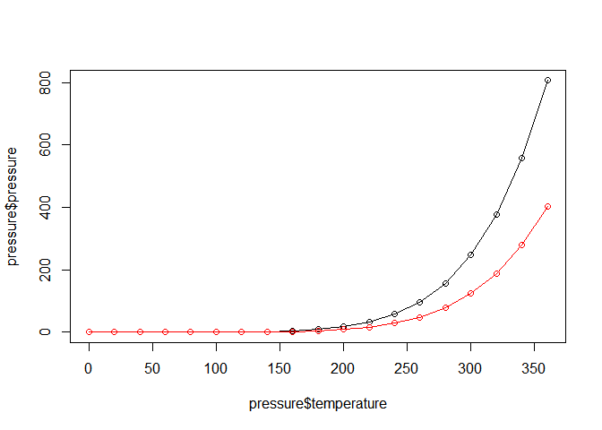
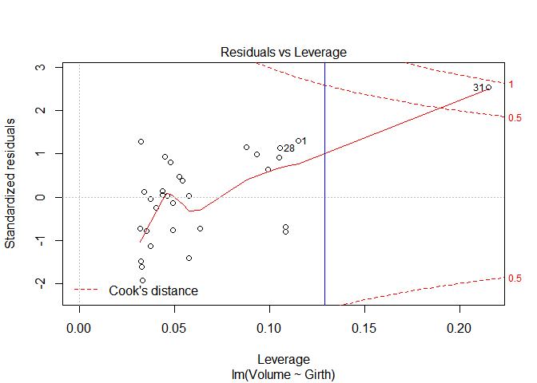

ADP STAT\_3
================
jakinpilla
2019-05-10

Data Wranggling ————————————————————-

dplyr basic —————————————————————–

``` r
library(nycflights13); flights
```

    ## Warning: package 'nycflights13' was built under R version 3.5.3

    ## # A tibble: 336,776 x 19
    ##     year month   day dep_time sched_dep_time dep_delay arr_time
    ##    <int> <int> <int>    <int>          <int>     <dbl>    <int>
    ##  1  2013     1     1      517            515         2      830
    ##  2  2013     1     1      533            529         4      850
    ##  3  2013     1     1      542            540         2      923
    ##  4  2013     1     1      544            545        -1     1004
    ##  5  2013     1     1      554            600        -6      812
    ##  6  2013     1     1      554            558        -4      740
    ##  7  2013     1     1      555            600        -5      913
    ##  8  2013     1     1      557            600        -3      709
    ##  9  2013     1     1      557            600        -3      838
    ## 10  2013     1     1      558            600        -2      753
    ## # ... with 336,766 more rows, and 12 more variables: sched_arr_time <int>,
    ## #   arr_delay <dbl>, carrier <chr>, flight <int>, tailnum <chr>,
    ## #   origin <chr>, dest <chr>, air_time <dbl>, distance <dbl>, hour <dbl>,
    ## #   minute <dbl>, time_hour <dttm>

``` r
filter(flights, month == 1, day == 1)
```

    ## # A tibble: 842 x 19
    ##     year month   day dep_time sched_dep_time dep_delay arr_time
    ##    <int> <int> <int>    <int>          <int>     <dbl>    <int>
    ##  1  2013     1     1      517            515         2      830
    ##  2  2013     1     1      533            529         4      850
    ##  3  2013     1     1      542            540         2      923
    ##  4  2013     1     1      544            545        -1     1004
    ##  5  2013     1     1      554            600        -6      812
    ##  6  2013     1     1      554            558        -4      740
    ##  7  2013     1     1      555            600        -5      913
    ##  8  2013     1     1      557            600        -3      709
    ##  9  2013     1     1      557            600        -3      838
    ## 10  2013     1     1      558            600        -2      753
    ## # ... with 832 more rows, and 12 more variables: sched_arr_time <int>,
    ## #   arr_delay <dbl>, carrier <chr>, flight <int>, tailnum <chr>,
    ## #   origin <chr>, dest <chr>, air_time <dbl>, distance <dbl>, hour <dbl>,
    ## #   minute <dbl>, time_hour <dttm>

``` r
flights[flights$month == 1 & flights$day == 1, ]
```

    ## # A tibble: 842 x 19
    ##     year month   day dep_time sched_dep_time dep_delay arr_time
    ##    <int> <int> <int>    <int>          <int>     <dbl>    <int>
    ##  1  2013     1     1      517            515         2      830
    ##  2  2013     1     1      533            529         4      850
    ##  3  2013     1     1      542            540         2      923
    ##  4  2013     1     1      544            545        -1     1004
    ##  5  2013     1     1      554            600        -6      812
    ##  6  2013     1     1      554            558        -4      740
    ##  7  2013     1     1      555            600        -5      913
    ##  8  2013     1     1      557            600        -3      709
    ##  9  2013     1     1      557            600        -3      838
    ## 10  2013     1     1      558            600        -2      753
    ## # ... with 832 more rows, and 12 more variables: sched_arr_time <int>,
    ## #   arr_delay <dbl>, carrier <chr>, flight <int>, tailnum <chr>,
    ## #   origin <chr>, dest <chr>, air_time <dbl>, distance <dbl>, hour <dbl>,
    ## #   minute <dbl>, time_hour <dttm>

``` r
arrange(flights, year, month, day)
```

    ## # A tibble: 336,776 x 19
    ##     year month   day dep_time sched_dep_time dep_delay arr_time
    ##    <int> <int> <int>    <int>          <int>     <dbl>    <int>
    ##  1  2013     1     1      517            515         2      830
    ##  2  2013     1     1      533            529         4      850
    ##  3  2013     1     1      542            540         2      923
    ##  4  2013     1     1      544            545        -1     1004
    ##  5  2013     1     1      554            600        -6      812
    ##  6  2013     1     1      554            558        -4      740
    ##  7  2013     1     1      555            600        -5      913
    ##  8  2013     1     1      557            600        -3      709
    ##  9  2013     1     1      557            600        -3      838
    ## 10  2013     1     1      558            600        -2      753
    ## # ... with 336,766 more rows, and 12 more variables: sched_arr_time <int>,
    ## #   arr_delay <dbl>, carrier <chr>, flight <int>, tailnum <chr>,
    ## #   origin <chr>, dest <chr>, air_time <dbl>, distance <dbl>, hour <dbl>,
    ## #   minute <dbl>, time_hour <dttm>

``` r
arrange(flights, desc(arr_delay))
```

    ## # A tibble: 336,776 x 19
    ##     year month   day dep_time sched_dep_time dep_delay arr_time
    ##    <int> <int> <int>    <int>          <int>     <dbl>    <int>
    ##  1  2013     1     9      641            900      1301     1242
    ##  2  2013     6    15     1432           1935      1137     1607
    ##  3  2013     1    10     1121           1635      1126     1239
    ##  4  2013     9    20     1139           1845      1014     1457
    ##  5  2013     7    22      845           1600      1005     1044
    ##  6  2013     4    10     1100           1900       960     1342
    ##  7  2013     3    17     2321            810       911      135
    ##  8  2013     7    22     2257            759       898      121
    ##  9  2013    12     5      756           1700       896     1058
    ## 10  2013     5     3     1133           2055       878     1250
    ## # ... with 336,766 more rows, and 12 more variables: sched_arr_time <int>,
    ## #   arr_delay <dbl>, carrier <chr>, flight <int>, tailnum <chr>,
    ## #   origin <chr>, dest <chr>, air_time <dbl>, distance <dbl>, hour <dbl>,
    ## #   minute <dbl>, time_hour <dttm>

``` r
select(flights, year, month, day)
```

    ## # A tibble: 336,776 x 3
    ##     year month   day
    ##    <int> <int> <int>
    ##  1  2013     1     1
    ##  2  2013     1     1
    ##  3  2013     1     1
    ##  4  2013     1     1
    ##  5  2013     1     1
    ##  6  2013     1     1
    ##  7  2013     1     1
    ##  8  2013     1     1
    ##  9  2013     1     1
    ## 10  2013     1     1
    ## # ... with 336,766 more rows

``` r
select(flights, year:day)
```

    ## # A tibble: 336,776 x 3
    ##     year month   day
    ##    <int> <int> <int>
    ##  1  2013     1     1
    ##  2  2013     1     1
    ##  3  2013     1     1
    ##  4  2013     1     1
    ##  5  2013     1     1
    ##  6  2013     1     1
    ##  7  2013     1     1
    ##  8  2013     1     1
    ##  9  2013     1     1
    ## 10  2013     1     1
    ## # ... with 336,766 more rows

``` r
select(flights, -(year:day))
```

    ## # A tibble: 336,776 x 16
    ##    dep_time sched_dep_time dep_delay arr_time sched_arr_time arr_delay
    ##       <int>          <int>     <dbl>    <int>          <int>     <dbl>
    ##  1      517            515         2      830            819        11
    ##  2      533            529         4      850            830        20
    ##  3      542            540         2      923            850        33
    ##  4      544            545        -1     1004           1022       -18
    ##  5      554            600        -6      812            837       -25
    ##  6      554            558        -4      740            728        12
    ##  7      555            600        -5      913            854        19
    ##  8      557            600        -3      709            723       -14
    ##  9      557            600        -3      838            846        -8
    ## 10      558            600        -2      753            745         8
    ## # ... with 336,766 more rows, and 10 more variables: carrier <chr>,
    ## #   flight <int>, tailnum <chr>, origin <chr>, dest <chr>, air_time <dbl>,
    ## #   distance <dbl>, hour <dbl>, minute <dbl>, time_hour <dttm>

``` r
select(flights, starts_with("dep"))
```

    ## # A tibble: 336,776 x 2
    ##    dep_time dep_delay
    ##       <int>     <dbl>
    ##  1      517         2
    ##  2      533         4
    ##  3      542         2
    ##  4      544        -1
    ##  5      554        -6
    ##  6      554        -4
    ##  7      555        -5
    ##  8      557        -3
    ##  9      557        -3
    ## 10      558        -2
    ## # ... with 336,766 more rows

``` r
select(flights, ends_with("delay"))
```

    ## # A tibble: 336,776 x 2
    ##    dep_delay arr_delay
    ##        <dbl>     <dbl>
    ##  1         2        11
    ##  2         4        20
    ##  3         2        33
    ##  4        -1       -18
    ##  5        -6       -25
    ##  6        -4        12
    ##  7        -5        19
    ##  8        -3       -14
    ##  9        -3        -8
    ## 10        -2         8
    ## # ... with 336,766 more rows

``` r
select(flights, contains("time"))
```

    ## # A tibble: 336,776 x 6
    ##    dep_time sched_dep_time arr_time sched_arr_time air_time
    ##       <int>          <int>    <int>          <int>    <dbl>
    ##  1      517            515      830            819      227
    ##  2      533            529      850            830      227
    ##  3      542            540      923            850      160
    ##  4      544            545     1004           1022      183
    ##  5      554            600      812            837      116
    ##  6      554            558      740            728      150
    ##  7      555            600      913            854      158
    ##  8      557            600      709            723       53
    ##  9      557            600      838            846      140
    ## 10      558            600      753            745      138
    ## # ... with 336,766 more rows, and 1 more variable: time_hour <dttm>

``` r
select(flights, matches("^dep"))
```

    ## # A tibble: 336,776 x 2
    ##    dep_time dep_delay
    ##       <int>     <dbl>
    ##  1      517         2
    ##  2      533         4
    ##  3      542         2
    ##  4      544        -1
    ##  5      554        -6
    ##  6      554        -4
    ##  7      555        -5
    ##  8      557        -3
    ##  9      557        -3
    ## 10      558        -2
    ## # ... with 336,766 more rows

``` r
select(flights, tail_num = tailnum)
```

    ## # A tibble: 336,776 x 1
    ##    tail_num
    ##    <chr>   
    ##  1 N14228  
    ##  2 N24211  
    ##  3 N619AA  
    ##  4 N804JB  
    ##  5 N668DN  
    ##  6 N39463  
    ##  7 N516JB  
    ##  8 N829AS  
    ##  9 N593JB  
    ## 10 N3ALAA  
    ## # ... with 336,766 more rows

``` r
rename(flights, tail_num = tailnum)
```

    ## # A tibble: 336,776 x 19
    ##     year month   day dep_time sched_dep_time dep_delay arr_time
    ##    <int> <int> <int>    <int>          <int>     <dbl>    <int>
    ##  1  2013     1     1      517            515         2      830
    ##  2  2013     1     1      533            529         4      850
    ##  3  2013     1     1      542            540         2      923
    ##  4  2013     1     1      544            545        -1     1004
    ##  5  2013     1     1      554            600        -6      812
    ##  6  2013     1     1      554            558        -4      740
    ##  7  2013     1     1      555            600        -5      913
    ##  8  2013     1     1      557            600        -3      709
    ##  9  2013     1     1      557            600        -3      838
    ## 10  2013     1     1      558            600        -2      753
    ## # ... with 336,766 more rows, and 12 more variables: sched_arr_time <int>,
    ## #   arr_delay <dbl>, carrier <chr>, flight <int>, tail_num <chr>,
    ## #   origin <chr>, dest <chr>, air_time <dbl>, distance <dbl>, hour <dbl>,
    ## #   minute <dbl>, time_hour <dttm>

``` r
mutate(flights,
       gain = arr_delay - dep_delay,
       speed = distance / air_time * 60
) # %>% View()
```

    ## # A tibble: 336,776 x 21
    ##     year month   day dep_time sched_dep_time dep_delay arr_time
    ##    <int> <int> <int>    <int>          <int>     <dbl>    <int>
    ##  1  2013     1     1      517            515         2      830
    ##  2  2013     1     1      533            529         4      850
    ##  3  2013     1     1      542            540         2      923
    ##  4  2013     1     1      544            545        -1     1004
    ##  5  2013     1     1      554            600        -6      812
    ##  6  2013     1     1      554            558        -4      740
    ##  7  2013     1     1      555            600        -5      913
    ##  8  2013     1     1      557            600        -3      709
    ##  9  2013     1     1      557            600        -3      838
    ## 10  2013     1     1      558            600        -2      753
    ## # ... with 336,766 more rows, and 14 more variables: sched_arr_time <int>,
    ## #   arr_delay <dbl>, carrier <chr>, flight <int>, tailnum <chr>,
    ## #   origin <chr>, dest <chr>, air_time <dbl>, distance <dbl>, hour <dbl>,
    ## #   minute <dbl>, time_hour <dttm>, gain <dbl>, speed <dbl>

``` r
transform(flights,
          gain = arr_delay - dep_delay,
          speed = distance / air_time * 60
) %>% as_tibble()
```

    ## # A tibble: 336,776 x 21
    ##     year month   day dep_time sched_dep_time dep_delay arr_time
    ##    <int> <int> <int>    <int>          <int>     <dbl>    <int>
    ##  1  2013     1     1      517            515         2      830
    ##  2  2013     1     1      533            529         4      850
    ##  3  2013     1     1      542            540         2      923
    ##  4  2013     1     1      544            545        -1     1004
    ##  5  2013     1     1      554            600        -6      812
    ##  6  2013     1     1      554            558        -4      740
    ##  7  2013     1     1      555            600        -5      913
    ##  8  2013     1     1      557            600        -3      709
    ##  9  2013     1     1      557            600        -3      838
    ## 10  2013     1     1      558            600        -2      753
    ## # ... with 336,766 more rows, and 14 more variables: sched_arr_time <int>,
    ## #   arr_delay <dbl>, carrier <chr>, flight <int>, tailnum <chr>,
    ## #   origin <chr>, dest <chr>, air_time <dbl>, distance <dbl>, hour <dbl>,
    ## #   minute <dbl>, time_hour <dttm>, gain <dbl>, speed <dbl>

``` r
mutate(flights,
       gain = arr_delay - dep_delay,
       gain_per_hour = gain / (air_time / 60)
)
```

    ## # A tibble: 336,776 x 21
    ##     year month   day dep_time sched_dep_time dep_delay arr_time
    ##    <int> <int> <int>    <int>          <int>     <dbl>    <int>
    ##  1  2013     1     1      517            515         2      830
    ##  2  2013     1     1      533            529         4      850
    ##  3  2013     1     1      542            540         2      923
    ##  4  2013     1     1      544            545        -1     1004
    ##  5  2013     1     1      554            600        -6      812
    ##  6  2013     1     1      554            558        -4      740
    ##  7  2013     1     1      555            600        -5      913
    ##  8  2013     1     1      557            600        -3      709
    ##  9  2013     1     1      557            600        -3      838
    ## 10  2013     1     1      558            600        -2      753
    ## # ... with 336,766 more rows, and 14 more variables: sched_arr_time <int>,
    ## #   arr_delay <dbl>, carrier <chr>, flight <int>, tailnum <chr>,
    ## #   origin <chr>, dest <chr>, air_time <dbl>, distance <dbl>, hour <dbl>,
    ## #   minute <dbl>, time_hour <dttm>, gain <dbl>, gain_per_hour <dbl>

transmute() —————————————————————–

``` r
transmute(flights,
          gain = arr_delay - dep_delay,
          gain_per_hour = gain / (air_time / 60)
)
```

    ## # A tibble: 336,776 x 2
    ##     gain gain_per_hour
    ##    <dbl>         <dbl>
    ##  1     9          2.38
    ##  2    16          4.23
    ##  3    31         11.6 
    ##  4   -17         -5.57
    ##  5   -19         -9.83
    ##  6    16          6.4 
    ##  7    24          9.11
    ##  8   -11        -12.5 
    ##  9    -5         -2.14
    ## 10    10          4.35
    ## # ... with 336,766 more rows

``` r
summarise(flights,
          delay = mean(dep_delay, na.rm = TRUE)
)
```

    ## # A tibble: 1 x 1
    ##   delay
    ##   <dbl>
    ## 1  12.6

sample\_n(), sample\_frac() —————————————————

``` r
sample_n(flights, 10)
```

    ## # A tibble: 10 x 19
    ##     year month   day dep_time sched_dep_time dep_delay arr_time
    ##    <int> <int> <int>    <int>          <int>     <dbl>    <int>
    ##  1  2013     7     2     1010           1000        10     1255
    ##  2  2013     2     2      652            651         1      902
    ##  3  2013     1    18     1850           1855        -5     2201
    ##  4  2013    11    10      847            845         2     1056
    ##  5  2013     3    15     1122           1115         7     1235
    ##  6  2013     4    24      858            830        28     1119
    ##  7  2013     9     3     1348           1355        -7     1524
    ##  8  2013    10    22     1929           1934        -5     2137
    ##  9  2013    10    13     2043           2025        18       14
    ## 10  2013    10    13     1450           1455        -5     1709
    ## # ... with 12 more variables: sched_arr_time <int>, arr_delay <dbl>,
    ## #   carrier <chr>, flight <int>, tailnum <chr>, origin <chr>, dest <chr>,
    ## #   air_time <dbl>, distance <dbl>, hour <dbl>, minute <dbl>,
    ## #   time_hour <dttm>

``` r
sample_frac(flights, 0.01)
```

    ## # A tibble: 3,368 x 19
    ##     year month   day dep_time sched_dep_time dep_delay arr_time
    ##    <int> <int> <int>    <int>          <int>     <dbl>    <int>
    ##  1  2013    10     7       NA           2129        NA       NA
    ##  2  2013     7    27     1348           1348         0     1451
    ##  3  2013    10    11     1725           1535       110     1901
    ##  4  2013     1     5      824            830        -6     1019
    ##  5  2013    10    25      801            808        -7      909
    ##  6  2013     7    27     1854           1855        -1     2301
    ##  7  2013     5    23     1303           1215        48     1411
    ##  8  2013     7    11     1210           1210         0     1344
    ##  9  2013     3    24      941            945        -4     1100
    ## 10  2013     8    20     1413           1415        -2     1632
    ## # ... with 3,358 more rows, and 12 more variables: sched_arr_time <int>,
    ## #   arr_delay <dbl>, carrier <chr>, flight <int>, tailnum <chr>,
    ## #   origin <chr>, dest <chr>, air_time <dbl>, distance <dbl>, hour <dbl>,
    ## #   minute <dbl>, time_hour <dttm>

group\_by() ——————————————————————

``` r
by_tailnum <- group_by(flights, tailnum)
delay <- summarise(by_tailnum,
                   count = n(),
                   dist = mean(distance, na.rm = TRUE),
                   delay = mean(arr_delay, na.rm = TRUE))
delay
```

    ## # A tibble: 4,044 x 4
    ##    tailnum count  dist    delay
    ##    <chr>   <int> <dbl>    <dbl>
    ##  1 <NA>     2512  710.  NaN    
    ##  2 D942DN      4  854.   31.5  
    ##  3 N0EGMQ    371  676.    9.98 
    ##  4 N10156    153  758.   12.7  
    ##  5 N102UW     48  536.    2.94 
    ##  6 N103US     46  535.   -6.93 
    ##  7 N104UW     47  535.    1.80 
    ##  8 N10575    289  520.   20.7  
    ##  9 N105UW     45  525.   -0.267
    ## 10 N107US     41  529.   -5.73 
    ## # ... with 4,034 more rows

``` r
by_dest <- group_by(flights, dest)
destinations <- summarise(by_dest,
                          planes = n_distinct(tailnum),
                          flights = n()
)
destinations
```

    ## # A tibble: 105 x 3
    ##    dest  planes flights
    ##    <chr>  <int>   <int>
    ##  1 ABQ      108     254
    ##  2 ACK       58     265
    ##  3 ALB      172     439
    ##  4 ANC        6       8
    ##  5 ATL     1180   17215
    ##  6 AUS      993    2439
    ##  7 AVL      159     275
    ##  8 BDL      186     443
    ##  9 BGR       46     375
    ## 10 BHM       45     297
    ## # ... with 95 more rows

``` r
daily <- group_by(flights, year, month, day)
(per_day <- summarise(daily, flights = n()))
```

    ## # A tibble: 365 x 4
    ## # Groups:   year, month [12]
    ##     year month   day flights
    ##    <int> <int> <int>   <int>
    ##  1  2013     1     1     842
    ##  2  2013     1     2     943
    ##  3  2013     1     3     914
    ##  4  2013     1     4     915
    ##  5  2013     1     5     720
    ##  6  2013     1     6     832
    ##  7  2013     1     7     933
    ##  8  2013     1     8     899
    ##  9  2013     1     9     902
    ## 10  2013     1    10     932
    ## # ... with 355 more rows

``` r
(per_month <- summarise(per_day, flights = sum(flights)))
```

    ## # A tibble: 12 x 3
    ## # Groups:   year [1]
    ##     year month flights
    ##    <int> <int>   <int>
    ##  1  2013     1   27004
    ##  2  2013     2   24951
    ##  3  2013     3   28834
    ##  4  2013     4   28330
    ##  5  2013     5   28796
    ##  6  2013     6   28243
    ##  7  2013     7   29425
    ##  8  2013     8   29327
    ##  9  2013     9   27574
    ## 10  2013    10   28889
    ## 11  2013    11   27268
    ## 12  2013    12   28135

``` r
(per_year <- summarise(per_month, flights = sum(flights)))
```

    ## # A tibble: 1 x 2
    ##    year flights
    ##   <int>   <int>
    ## 1  2013  336776

Chaining ——————————————————————–

``` r
a1 <- group_by(flights, year, month, day)
a2 <- select(a1, arr_delay, dep_delay)
```

    ## Adding missing grouping variables: `year`, `month`, `day`

``` r
a3 <- summarise(a2,
                arr = mean(arr_delay, na.rm = TRUE),
                dep = mean(dep_delay, na.rm = TRUE))
a4 <- filter(a3, arr > 30 | dep > 30)

filter(
  summarise(
    select(
      group_by(flights, year, month, day),
      arr_delay, dep_delay
    ),
    arr = mean(arr_delay, na.rm = TRUE),
    dep = mean(dep_delay, na.rm = TRUE)
  ),
  arr > 30 | dep > 30
)
```

    ## Adding missing grouping variables: `year`, `month`, `day`

    ## # A tibble: 49 x 5
    ## # Groups:   year, month [11]
    ##     year month   day   arr   dep
    ##    <int> <int> <int> <dbl> <dbl>
    ##  1  2013     1    16  34.2  24.6
    ##  2  2013     1    31  32.6  28.7
    ##  3  2013     2    11  36.3  39.1
    ##  4  2013     2    27  31.3  37.8
    ##  5  2013     3     8  85.9  83.5
    ##  6  2013     3    18  41.3  30.1
    ##  7  2013     4    10  38.4  33.0
    ##  8  2013     4    12  36.0  34.8
    ##  9  2013     4    18  36.0  34.9
    ## 10  2013     4    19  47.9  46.1
    ## # ... with 39 more rows

``` r
flights %>%
  group_by(year, month, day) %>%
  select(arr_delay, dep_delay) %>%
  summarise(
    arr = mean(arr_delay, na.rm = TRUE),
    dep = mean(dep_delay, na.rm = TRUE)
  ) %>%
  filter(arr > 30 | dep > 30)
```

    ## Adding missing grouping variables: `year`, `month`, `day`

    ## # A tibble: 49 x 5
    ## # Groups:   year, month [11]
    ##     year month   day   arr   dep
    ##    <int> <int> <int> <dbl> <dbl>
    ##  1  2013     1    16  34.2  24.6
    ##  2  2013     1    31  32.6  28.7
    ##  3  2013     2    11  36.3  39.1
    ##  4  2013     2    27  31.3  37.8
    ##  5  2013     3     8  85.9  83.5
    ##  6  2013     3    18  41.3  30.1
    ##  7  2013     4    10  38.4  33.0
    ##  8  2013     4    12  36.0  34.8
    ##  9  2013     4    18  36.0  34.9
    ## 10  2013     4    19  47.9  46.1
    ## # ... with 39 more rows

Scatter Plot —————————————————————-

``` r
# help(mtcars)
str(mtcars)
```

    ## 'data.frame':    32 obs. of  11 variables:
    ##  $ mpg : num  21 21 22.8 21.4 18.7 18.1 14.3 24.4 22.8 19.2 ...
    ##  $ cyl : num  6 6 4 6 8 6 8 4 4 6 ...
    ##  $ disp: num  160 160 108 258 360 ...
    ##  $ hp  : num  110 110 93 110 175 105 245 62 95 123 ...
    ##  $ drat: num  3.9 3.9 3.85 3.08 3.15 2.76 3.21 3.69 3.92 3.92 ...
    ##  $ wt  : num  2.62 2.88 2.32 3.21 3.44 ...
    ##  $ qsec: num  16.5 17 18.6 19.4 17 ...
    ##  $ vs  : num  0 0 1 1 0 1 0 1 1 1 ...
    ##  $ am  : num  1 1 1 0 0 0 0 0 0 0 ...
    ##  $ gear: num  4 4 4 3 3 3 3 4 4 4 ...
    ##  $ carb: num  4 4 1 1 2 1 4 2 2 4 ...

``` r
plot(mtcars$wt, mtcars$mpg)
```

<!-- -->

``` r
plot(mtcars$wt, mtcars$mpg,
     main="Scatter plot with base graphics",
     xlab="wt", ylab="mpg")
```

<!-- -->

qplot()

``` r
library(ggplot2)
qplot(mtcars$wt, mtcars$mpg) # qplot: quick plot
```

<!-- -->

``` r
qplot(wt, mpg, data=mtcars)
```

<!-- -->

This is equivalent to:

``` r
ggplot(mtcars, aes(x=wt, y=mpg)) + geom_point() # aes: aesthetics
```

<!-- -->

Creating a Line Graph ——————————————————-

``` r
str(pressure)
```

    ## 'data.frame':    19 obs. of  2 variables:
    ##  $ temperature: num  0 20 40 60 80 100 120 140 160 180 ...
    ##  $ pressure   : num  0.0002 0.0012 0.006 0.03 0.09 0.27 0.75 1.85 4.2 8.8 ...

``` r
plot(pressure$temperature, pressure$pressure, type="l")
```

<!-- -->

``` r
plot(pressure$temperature, pressure$pressure, type="l",
     main="Line graph with base graphics",
     xlab="temperature", ylab="pressure")
```

<!-- -->

``` r
plot(pressure$temperature, pressure$pressure, type="l")
points(pressure$temperature, pressure$pressure)

lines(pressure$temperature, pressure$pressure/2, col="red")
points(pressure$temperature, pressure$pressure/2, col="red")
```

<!-- -->

``` r
library(ggplot2)
qplot(pressure$temperature, pressure$pressure, geom="line")
```

<!-- -->

``` r
qplot(temperature, pressure, data=pressure, geom="line")
```

<!-- -->

``` r
# This is equivalent to:
ggplot(pressure, aes(x=temperature, y=pressure)) + geom_line()
```

<!-- -->

``` r
# Lines and points together
qplot(temperature, pressure, data=pressure, geom=c("line", "point"))
```

<!-- -->

``` r
# This is equivalent to:
ggplot(pressure, aes(x=temperature, y=pressure)) + geom_line() + geom_point()
```

<!-- -->

Creating a Bar Graph ——————————————————–

``` r
str(BOD)
```

    ## 'data.frame':    6 obs. of  2 variables:
    ##  $ Time  : num  1 2 3 4 5 7
    ##  $ demand: num  8.3 10.3 19 16 15.6 19.8
    ##  - attr(*, "reference")= chr "A1.4, p. 270"

``` r
barplot(BOD$demand, names.arg=BOD$Time)
```

<!-- -->

``` r
table(mtcars$cyl)
```

    ## 
    ##  4  6  8 
    ## 11  7 14

``` r
# There are 11 cases of the value 4, 7 cases of 6, and 14 cases of 8

# Generate a bar graph of counts
barplot(table(mtcars$cyl))
```

<!-- -->

``` r
library(ggplot2)
ggplot(BOD, aes(x=factor(Time), y=demand)) + geom_bar(stat="identity")
```

<!-- -->

``` r
qplot(mtcars$cyl)
```

    ## `stat_bin()` using `bins = 30`. Pick better value with `binwidth`.

<!-- -->

``` r
# Treat cylas discrete
qplot(factor(mtcars$cyl))
```

<!-- -->

``` r
qplot(factor(cyl), data=mtcars)
```

<!-- -->

``` r
# This is equivalent to:
ggplot(mtcars, aes(x=factor(cyl))) + geom_bar()
```

<!-- -->

Creating a Histogram ——————————————————–

``` r
hist(mtcars$mpg)
```

<!-- -->

``` r
# Specify approximate number of bins with breaks
hist(mtcars$mpg, breaks=10)
```

<!-- -->

``` r
library(ggplot2)
qplot(mtcars$mpg)
```

    ## `stat_bin()` using `bins = 30`. Pick better value with `binwidth`.

<!-- -->

``` r
qplot(mpg, data=mtcars, binwidth=4)
```

<!-- -->

``` r
# This is equivalent to:
ggplot(mtcars, aes(x=mpg)) + geom_histogram(binwidth=1)
```

<!-- -->

``` r
ggplot(mtcars, aes(x=mpg)) + geom_histogram(binwidth=4)
```

<!-- -->

Creating a Box Plot ———————————————————

``` r
str(ToothGrowth)
```

    ## 'data.frame':    60 obs. of  3 variables:
    ##  $ len : num  4.2 11.5 7.3 5.8 6.4 10 11.2 11.2 5.2 7 ...
    ##  $ supp: Factor w/ 2 levels "OJ","VC": 2 2 2 2 2 2 2 2 2 2 ...
    ##  $ dose: num  0.5 0.5 0.5 0.5 0.5 0.5 0.5 0.5 0.5 0.5 ...

``` r
plot(ToothGrowth$supp, ToothGrowth$len)

# Formula syntax
boxplot(len~ supp, data=ToothGrowth)
```

<!-- -->

``` r
# Put interaction of two variables on x-axis
boxplot(len~ supp+dose, data=ToothGrowth)
```

<!-- -->

``` r
#
library(ggplot2)
qplot(ToothGrowth$supp, ToothGrowth$len, geom="boxplot")
```

<!-- -->

``` r
qplot(supp, len, data=ToothGrowth, geom="boxplot")
```

<!-- -->

``` r
# This is equivalent to:
ggplot(ToothGrowth, aes(x=supp, y=len)) + geom_boxplot()
```

<!-- -->

``` r
qplot(interaction(supp, dose), len, data=ToothGrowth, geom="boxplot") # interaction...
```

<!-- -->

``` r
# This is equivalent to:
ggplot(ToothGrowth, aes(x=interaction(supp, dose), y=len)) + geom_boxplot() # interaction...
```

<!-- -->

Plotting a Function Curve —————————————————

curve(x^3-5\*x, from=-4, to=4)

\#’ Plot a user-defined function myfun\<-function(xvar) {
1/(1+exp(-xvar+10)) }

curve(myfun(x), from=0, to=20)

\#’ Add a line: curve(1-myfun(x), add=TRUE, col=“red”)

library(ggplot2) \# This is equivalent to: ggplot(data.frame(x=c(0,
20)), aes(x=x)) + stat\_function(fun=myfun, geom=“line”) Correlation
Analysis ——————————————————–

``` r
cov(trees$Height, trees$Volume)
```

    ## [1] 62.66

``` r
cov(trees)
```

    ##            Girth   Height    Volume
    ## Girth   9.847914 10.38333  49.88812
    ## Height 10.383333 40.60000  62.66000
    ## Volume 49.888118 62.66000 270.20280

``` r
cov(trees, use="pairwise")
```

    ##            Girth   Height    Volume
    ## Girth   9.847914 10.38333  49.88812
    ## Height 10.383333 40.60000  62.66000
    ## Volume 49.888118 62.66000 270.20280

``` r
# cov(trees, use="complete")

cor(trees$Height, trees$Volume)
```

    ## [1] 0.5982497

``` r
# same as cor(trees$Height, trees$Volume, method="pearson")
cor(trees) # same as cor(trees, method="pearson")
```

    ##            Girth    Height    Volume
    ## Girth  1.0000000 0.5192801 0.9671194
    ## Height 0.5192801 1.0000000 0.5982497
    ## Volume 0.9671194 0.5982497 1.0000000

``` r
cor(trees, use="pairwise")
```

    ##            Girth    Height    Volume
    ## Girth  1.0000000 0.5192801 0.9671194
    ## Height 0.5192801 1.0000000 0.5982497
    ## Volume 0.9671194 0.5982497 1.0000000

``` r
# cor(trees, use="complete")

cor(trees$Height, trees$Volume, method="spearman")
```

    ## [1] 0.5787101

``` r
cor(trees, method="spearman")
```

    ##            Girth    Height    Volume
    ## Girth  1.0000000 0.4408387 0.9547151
    ## Height 0.4408387 1.0000000 0.5787101
    ## Volume 0.9547151 0.5787101 1.0000000

``` r
cor(trees, method="spearman", use="pairwise")
```

    ##            Girth    Height    Volume
    ## Girth  1.0000000 0.4408387 0.9547151
    ## Height 0.4408387 1.0000000 0.5787101
    ## Volume 0.9547151 0.5787101 1.0000000

``` r
# cor(trees, method="spearman", use="complete")

cor.test(trees$Girth, trees$Volume)
```

    ## 
    ##  Pearson's product-moment correlation
    ## 
    ## data:  trees$Girth and trees$Volume
    ## t = 20.478, df = 29, p-value < 2.2e-16
    ## alternative hypothesis: true correlation is not equal to 0
    ## 95 percent confidence interval:
    ##  0.9322519 0.9841887
    ## sample estimates:
    ##       cor 
    ## 0.9671194

``` r
# cor.test(trees$Girth, trees$Volume, method="pearson")

M <- cor(mtcars)
# head(round(M, 2))

par(mfrow = c(2, 2))
# method = "circle""
corrplot(M, method = "circle")  

# method = "color"
corrplot(M, method = "color") 

# method = "number"
corrplot(M, method = "number")

# correlogram with hclust reordering
corrplot(M, order = "hclust")
```

<!-- -->

``` r
par(mfrow = c(1, 1))
```

Analyss of Variance ———————————————————

One-way ANOVA…

``` r
boxplot(weight ~ group, PlantGrowth,
        xlab = "group",
        ylab = "weight")
```

<!-- -->

``` r
plant.aov <- aov(weight ~ group, PlantGrowth)
summary(plant.aov)
```

    ##             Df Sum Sq Mean Sq F value Pr(>F)  
    ## group        2  3.766  1.8832   4.846 0.0159 *
    ## Residuals   27 10.492  0.3886                 
    ## ---
    ## Signif. codes:  0 '***' 0.001 '**' 0.01 '*' 0.05 '.' 0.1 ' ' 1

``` r
model.tables(plant.aov, type = "means")
```

    ## Tables of means
    ## Grand mean
    ##       
    ## 5.073 
    ## 
    ##  group 
    ## group
    ##  ctrl  trt1  trt2 
    ## 5.032 4.661 5.526

``` r
plant.ph <- TukeyHSD(plant.aov)
plant.ph
```

    ##   Tukey multiple comparisons of means
    ##     95% family-wise confidence level
    ## 
    ## Fit: aov(formula = weight ~ group, data = PlantGrowth)
    ## 
    ## $group
    ##             diff        lwr       upr     p adj
    ## trt1-ctrl -0.371 -1.0622161 0.3202161 0.3908711
    ## trt2-ctrl  0.494 -0.1972161 1.1852161 0.1979960
    ## trt2-trt1  0.865  0.1737839 1.5562161 0.0120064

``` r
plot(plant.ph)
```

<!-- -->

``` r
# Two-way ANOVA with tw.csv dataset...

tw <- read_csv("./data/tw.csv")
```

    ## Parsed with column specification:
    ## cols(
    ##   Format = col_character(),
    ##   Subject = col_character(),
    ##   Satisfaction = col_double()
    ## )

``` r
boxplot(Satisfaction ~ Format*Subject, tw,
        xlab = "interaction",
        ylab = "satisfaction")
```

<!-- -->

``` r
with(tw, 
     interaction.plot(Subject, Format, Satisfaction))
```

<!-- -->

``` r
tw.aov <- aov(Satisfaction~ Format*Subject, tw)
summary(tw.aov)
```

    ##                Df Sum Sq Mean Sq F value  Pr(>F)    
    ## Format          2     18       9       9 0.00195 ** 
    ## Subject         2    162      81      81   1e-09 ***
    ## Format:Subject  4      0       0       0 1.00000    
    ## Residuals      18     18       1                    
    ## ---
    ## Signif. codes:  0 '***' 0.001 '**' 0.01 '*' 0.05 '.' 0.1 ' ' 1

``` r
model.tables(tw.aov, type = "means")
```

    ## Tables of means
    ## Grand mean
    ##   
    ## 5 
    ## 
    ##  Format 
    ## Format
    ## Classroom    Hybrid    Online 
    ##         4         5         6 
    ## 
    ##  Subject 
    ## Subject
    ##    English    Science Statistics 
    ##          5          2          8 
    ## 
    ##  Format:Subject 
    ##            Subject
    ## Format      English Science Statistics
    ##   Classroom 4       1       7         
    ##   Hybrid    5       2       8         
    ##   Online    6       3       9

``` r
tw.format.ph <- TukeyHSD(tw.aov, which = "Format")
tw.format.ph
```

    ##   Tukey multiple comparisons of means
    ##     95% family-wise confidence level
    ## 
    ## Fit: aov(formula = Satisfaction ~ Format * Subject, data = tw)
    ## 
    ## $Format
    ##                  diff        lwr      upr     p adj
    ## Hybrid-Classroom    1 -0.2031012 2.203101 0.1135025
    ## Online-Classroom    2  0.7968988 3.203101 0.0013531
    ## Online-Hybrid       1 -0.2031012 2.203101 0.1135025

``` r
plot(tw.format.ph)
```

<!-- -->

``` r
tw.subject.ph <- TukeyHSD(tw.aov, which = "Subject")
tw.subject.ph
```

    ##   Tukey multiple comparisons of means
    ##     95% family-wise confidence level
    ## 
    ## Fit: aov(formula = Satisfaction ~ Format * Subject, data = tw)
    ## 
    ## $Subject
    ##                    diff       lwr       upr    p adj
    ## Science-English      -3 -4.203101 -1.796899 1.54e-05
    ## Statistics-English    3  1.796899  4.203101 1.54e-05
    ## Statistics-Science    6  4.796899  7.203101 0.00e+00

``` r
plot(tw.subject.ph)
```

<!-- -->

``` r
# Two-way ANOVA with pw.csv dataset...

pw <- read_csv("./data/pw.csv"); pw
```

    ## Parsed with column specification:
    ## cols(
    ##   height = col_double(),
    ##   plant = col_character(),
    ##   water = col_character()
    ## )

    ## # A tibble: 18 x 3
    ##    height plant    water
    ##     <dbl> <chr>    <chr>
    ##  1      9 vulgaris lo   
    ##  2     11 vulgaris lo   
    ##  3      6 vulgaris lo   
    ##  4     14 vulgaris mid  
    ##  5     17 vulgaris mid  
    ##  6     19 vulgaris mid  
    ##  7     28 vulgaris hi   
    ##  8     31 vulgaris hi   
    ##  9     32 vulgaris hi   
    ## 10      7 sativa   lo   
    ## 11      6 sativa   lo   
    ## 12      5 sativa   lo   
    ## 13     14 sativa   mid  
    ## 14     17 sativa   mid  
    ## 15     15 sativa   mid  
    ## 16     44 sativa   hi   
    ## 17     38 sativa   hi   
    ## 18     37 sativa   hi

``` r
boxplot(height ~ plant*water, pw,
        xlab = "interaction",
        ylab = "height")
```

<!-- -->

``` r
with(pw, 
     interaction.plot(water, plant, height))
```

<!-- -->

``` r
pw.aov <- aov(height ~ plant*water, pw)
summary(pw.aov)
```

    ##             Df Sum Sq Mean Sq F value   Pr(>F)    
    ## plant        1   14.2    14.2   2.462  0.14264    
    ## water        2 2403.1  1201.6 207.962 4.86e-10 ***
    ## plant:water  2  129.8    64.9  11.231  0.00178 ** 
    ## Residuals   12   69.3     5.8                     
    ## ---
    ## Signif. codes:  0 '***' 0.001 '**' 0.01 '*' 0.05 '.' 0.1 ' ' 1

``` r
model.tables(pw.aov, type ="means")
```

    ## Tables of means
    ## Grand mean
    ##          
    ## 19.44444 
    ## 
    ##  plant 
    ## plant
    ##   sativa vulgaris 
    ##   20.333   18.556 
    ## 
    ##  water 
    ## water
    ##    hi    lo   mid 
    ## 35.00  7.33 16.00 
    ## 
    ##  plant:water 
    ##           water
    ## plant      hi    lo    mid  
    ##   sativa   39.67  6.00 15.33
    ##   vulgaris 30.33  8.67 16.67

``` r
pw.ph <- TukeyHSD(pw.aov, which = "plant:water")
pw.ph
```

    ##   Tukey multiple comparisons of means
    ##     95% family-wise confidence level
    ## 
    ## Fit: aov(formula = height ~ plant * water, data = pw)
    ## 
    ## $`plant:water`
    ##                                diff          lwr        upr     p adj
    ## vulgaris:hi-sativa:hi     -9.333333 -15.92559686  -2.741070 0.0048138
    ## sativa:lo-sativa:hi      -33.666667 -40.25893019 -27.074403 0.0000000
    ## vulgaris:lo-sativa:hi    -31.000000 -37.59226353 -24.407736 0.0000000
    ## sativa:mid-sativa:hi     -24.333333 -30.92559686 -17.741070 0.0000004
    ## vulgaris:mid-sativa:hi   -23.000000 -29.59226353 -16.407736 0.0000007
    ## sativa:lo-vulgaris:hi    -24.333333 -30.92559686 -17.741070 0.0000004
    ## vulgaris:lo-vulgaris:hi  -21.666667 -28.25893019 -15.074403 0.0000014
    ## sativa:mid-vulgaris:hi   -15.000000 -21.59226353  -8.407736 0.0000684
    ## vulgaris:mid-vulgaris:hi -13.666667 -20.25893019  -7.074403 0.0001702
    ## vulgaris:lo-sativa:lo      2.666667  -3.92559686   9.258930 0.7490956
    ## sativa:mid-sativa:lo       9.333333   2.74106981  15.925597 0.0048138
    ## vulgaris:mid-sativa:lo    10.666667   4.07440314  17.258930 0.0016201
    ## sativa:mid-vulgaris:lo     6.666667   0.07440314  13.258930 0.0469217
    ## vulgaris:mid-vulgaris:lo   8.000000   1.40773647  14.592264 0.0149115
    ## vulgaris:mid-sativa:mid    1.333333  -5.25893019   7.925597 0.9810084

``` r
op <- par(mar = c(5, 8, 4, 2))
plot(pw.ph, cex.axis = .7, las = 1)
```

<!-- -->

Regression Analysis… ——————————————————

``` r
ggplot(data = iris, aes(x = Sepal.Length, y = Sepal.Width, color = Species)) +
  geom_point(aes(shape = Species), size = 1.5) +
  geom_smooth(method = "lm") +
  xlab("Sepal Length") + ylab("Sepal Width")
```

<!-- -->

ANCOVA model… ————————————————————-

``` r
sepals.lm <- lm(Sepal.Width ~ Sepal.Length*Species, data = iris)
anova(sepals.lm)
```

    ## Analysis of Variance Table
    ## 
    ## Response: Sepal.Width
    ##                       Df  Sum Sq Mean Sq  F value    Pr(>F)    
    ## Sepal.Length           1  0.3913  0.3913   5.2757   0.02307 *  
    ## Species                2 15.7225  7.8613 105.9948 < 2.2e-16 ***
    ## Sepal.Length:Species   2  1.5132  0.7566  10.2011  7.19e-05 ***
    ## Residuals            144 10.6800  0.0742                       
    ## ---
    ## Signif. codes:  0 '***' 0.001 '**' 0.01 '*' 0.05 '.' 0.1 ' ' 1

``` r
summary(sepals.lm)
```

    ## 
    ## Call:
    ## lm(formula = Sepal.Width ~ Sepal.Length * Species, data = iris)
    ## 
    ## Residuals:
    ##      Min       1Q   Median       3Q      Max 
    ## -0.72394 -0.16327 -0.00289  0.16457  0.60954 
    ## 
    ## Coefficients:
    ##                                Estimate Std. Error t value Pr(>|t|)    
    ## (Intercept)                     -0.5694     0.5539  -1.028 0.305622    
    ## Sepal.Length                     0.7985     0.1104   7.235 2.55e-11 ***
    ## Speciesversicolor                1.4416     0.7130   2.022 0.045056 *  
    ## Speciesvirginica                 2.0157     0.6861   2.938 0.003848 ** 
    ## Sepal.Length:Speciesversicolor  -0.4788     0.1337  -3.582 0.000465 ***
    ## Sepal.Length:Speciesvirginica   -0.5666     0.1262  -4.490 1.45e-05 ***
    ## ---
    ## Signif. codes:  0 '***' 0.001 '**' 0.01 '*' 0.05 '.' 0.1 ' ' 1
    ## 
    ## Residual standard error: 0.2723 on 144 degrees of freedom
    ## Multiple R-squared:  0.6227, Adjusted R-squared:  0.6096 
    ## F-statistic: 47.53 on 5 and 144 DF,  p-value: < 2.2e-16

``` r
iris2 = subset(iris, Species != "setosa", drop = T)
sepal2.lm <- lm(Sepal.Width ~ Sepal.Length*Species, data = iris2)
anova(sepal2.lm)
```

    ## Analysis of Variance Table
    ## 
    ## Response: Sepal.Width
    ##                      Df Sum Sq Mean Sq F value   Pr(>F)    
    ## Sepal.Length          1 3.3625  3.3625 42.9185 2.83e-09 ***
    ## Species               1 0.0171  0.0171  0.2179   0.6417    
    ## Sepal.Length:Species  1 0.0607  0.0607  0.7748   0.3809    
    ## Residuals            96 7.5213  0.0783                     
    ## ---
    ## Signif. codes:  0 '***' 0.001 '**' 0.01 '*' 0.05 '.' 0.1 ' ' 1

``` r
# ANCOVA model...
sepal3.lm <- lm(Sepal.Width ~ Sepal.Length + Species, data = iris2)
anova(sepal3.lm)
```

    ## Analysis of Variance Table
    ## 
    ## Response: Sepal.Width
    ##              Df Sum Sq Mean Sq F value    Pr(>F)    
    ## Sepal.Length  1 3.3625  3.3625 43.0184 2.647e-09 ***
    ## Species       1 0.0171  0.0171  0.2184    0.6413    
    ## Residuals    97 7.5820  0.0782                      
    ## ---
    ## Signif. codes:  0 '***' 0.001 '**' 0.01 '*' 0.05 '.' 0.1 ' ' 1

``` r
# ANCOVA model...
sepal4.lm <- lm(Sepal.Width ~ Sepal.Length, data = iris2)
summary(sepal4.lm)
```

    ## 
    ## Call:
    ## lm(formula = Sepal.Width ~ Sepal.Length, data = iris2)
    ## 
    ## Residuals:
    ##      Min       1Q   Median       3Q      Max 
    ## -0.67182 -0.14769  0.00938  0.17439  0.60085 
    ## 
    ## Coefficients:
    ##              Estimate Std. Error t value Pr(>|t|)    
    ## (Intercept)   1.13090    0.26586   4.254 4.81e-05 ***
    ## Sepal.Length  0.27804    0.04222   6.585 2.27e-09 ***
    ## ---
    ## Signif. codes:  0 '***' 0.001 '**' 0.01 '*' 0.05 '.' 0.1 ' ' 1
    ## 
    ## Residual standard error: 0.2785 on 98 degrees of freedom
    ## Multiple R-squared:  0.3068, Adjusted R-squared:  0.2997 
    ## F-statistic: 43.36 on 1 and 98 DF,  p-value: 2.27e-09

``` r
ggplot(data = iris2, aes(x=Sepal.Length, y=Sepal.Width)) +
  geom_point(aes(shape = Species, color = Species), size = 1.5) +
  geom_smooth(method = "lm") +
  xlab("Sepal Length") + ylab("Sepal Width")
```

<!-- -->

``` r
# ANCOVA model...
sepal5.lm <- lm(Sepal.Width ~ Sepal.Length + Species, data = iris)
anova(sepal5.lm)
```

    ## Analysis of Variance Table
    ## 
    ## Response: Sepal.Width
    ##               Df  Sum Sq Mean Sq F value  Pr(>F)    
    ## Sepal.Length   1  0.3913  0.3913  4.6851 0.03205 *  
    ## Species        2 15.7225  7.8613 94.1304 < 2e-16 ***
    ## Residuals    146 12.1931  0.0835                    
    ## ---
    ## Signif. codes:  0 '***' 0.001 '**' 0.01 '*' 0.05 '.' 0.1 ' ' 1

``` r
sepals.full <- lm(Sepal.Width ~ Sepal.Length + Species, data = iris)

sepal.rest <- lm(Sepal.Width ~ Sepal.Length, data = iris)

anova(sepals.full, sepal.rest)
```

    ## Analysis of Variance Table
    ## 
    ## Model 1: Sepal.Width ~ Sepal.Length + Species
    ## Model 2: Sepal.Width ~ Sepal.Length
    ##   Res.Df    RSS Df Sum of Sq     F    Pr(>F)    
    ## 1    146 12.193                                 
    ## 2    148 27.916 -2   -15.723 94.13 < 2.2e-16 ***
    ## ---
    ## Signif. codes:  0 '***' 0.001 '**' 0.01 '*' 0.05 '.' 0.1 ' ' 1

``` r
# Regression Analysis...
powerplant <- read_csv("./data/powerplant.csv")
```

    ## Parsed with column specification:
    ## cols(
    ##   Pressure = col_double(),
    ##   Temp = col_double(),
    ##   Output = col_double()
    ## )

``` r
lm(Output ~ Pressure + Temp, powerplant)
```

    ## 
    ## Call:
    ## lm(formula = Output ~ Pressure + Temp, data = powerplant)
    ## 
    ## Coefficients:
    ## (Intercept)     Pressure         Temp  
    ##    -32.8620       0.1858      -0.9916

``` r
lm(Output ~ Pressure*Temp, powerplant)
```

    ## 
    ## Call:
    ## lm(formula = Output ~ Pressure * Temp, data = powerplant)
    ## 
    ## Coefficients:
    ##   (Intercept)       Pressure           Temp  Pressure:Temp  
    ##      64.67539        0.08936      -11.74787        0.01060

``` r
lm.fit <- lm(Volume ~ Girth, trees)
lm.fit
```

    ## 
    ## Call:
    ## lm(formula = Volume ~ Girth, data = trees)
    ## 
    ## Coefficients:
    ## (Intercept)        Girth  
    ##     -36.943        5.066

``` r
summary(lm.fit)
```

    ## 
    ## Call:
    ## lm(formula = Volume ~ Girth, data = trees)
    ## 
    ## Residuals:
    ##    Min     1Q Median     3Q    Max 
    ## -8.065 -3.107  0.152  3.495  9.587 
    ## 
    ## Coefficients:
    ##             Estimate Std. Error t value Pr(>|t|)    
    ## (Intercept) -36.9435     3.3651  -10.98 7.62e-12 ***
    ## Girth         5.0659     0.2474   20.48  < 2e-16 ***
    ## ---
    ## Signif. codes:  0 '***' 0.001 '**' 0.01 '*' 0.05 '.' 0.1 ' ' 1
    ## 
    ## Residual standard error: 4.252 on 29 degrees of freedom
    ## Multiple R-squared:  0.9353, Adjusted R-squared:  0.9331 
    ## F-statistic: 419.4 on 1 and 29 DF,  p-value: < 2.2e-16

``` r
anova(lm.fit)
```

    ## Analysis of Variance Table
    ## 
    ## Response: Volume
    ##           Df Sum Sq Mean Sq F value    Pr(>F)    
    ## Girth      1 7581.8  7581.8  419.36 < 2.2e-16 ***
    ## Residuals 29  524.3    18.1                      
    ## ---
    ## Signif. codes:  0 '***' 0.001 '**' 0.01 '*' 0.05 '.' 0.1 ' ' 1

``` r
poly.fit <- lm(Volume ~ Girth + I(Girth^2), trees)
anova(lm.fit, poly.fit)
```

    ## Analysis of Variance Table
    ## 
    ## Model 1: Volume ~ Girth
    ## Model 2: Volume ~ Girth + I(Girth^2)
    ##   Res.Df    RSS Df Sum of Sq      F    Pr(>F)    
    ## 1     29 524.30                                  
    ## 2     28 311.38  1    212.92 19.146 0.0001524 ***
    ## ---
    ## Signif. codes:  0 '***' 0.001 '**' 0.01 '*' 0.05 '.' 0.1 ' ' 1

``` r
lm.fit <- lm(Volume ~ Girth, trees)
coef(lm.fit)
```

    ## (Intercept)       Girth 
    ##  -36.943459    5.065856

``` r
confint(lm.fit)
```

    ##                  2.5 %     97.5 %
    ## (Intercept) -43.825953 -30.060965
    ## Girth         4.559914   5.571799

``` r
plot(Volume ~ Girth, trees,
     main = "Scatter plot with polynomial curve")
abline(lm.fit, col = "red")
lines(lowess(trees$Girth, trees$Volume), col = "blue")
```

<!-- -->

``` r
poly.fit <- lm(Volume ~ Girth + I(Girth^2), trees)
b <- coef(poly.fit)

plot(Volume ~ Girth, trees,
     main = "Scatter plot with polynomial curve")
curve(b[1] + b[2]*x + b[3]*x^2, col = "red", add = T)
lines(lowess(trees$Girth, trees$Volume), col = "blue")
```

<!-- -->

``` r
lm.fit <- lm(Volume ~ Girth, trees)
newtrees <- data.frame(Girth = c(17.2, 12.0, 11.4))
predict(lm.fit, newtrees, interval = "prediction")
```

    ##        fit      lwr      upr
    ## 1 50.18927 41.13045 59.24809
    ## 2 23.84682 14.98883 32.70481
    ## 3 20.80730 11.92251 29.69210

``` r
head(faithful)
```

    ##   eruptions waiting
    ## 1     3.600      79
    ## 2     1.800      54
    ## 3     3.333      74
    ## 4     2.283      62
    ## 5     4.533      85
    ## 6     2.883      55

``` r
ggplot(faithful, aes(x = waiting, y = eruptions)) +
  geom_point() + geom_smooth(method = "lm")
```

<!-- -->

``` r
eruption.lm <- lm(eruptions ~ waiting, data = faithful)
summary(eruption.lm)
```

    ## 
    ## Call:
    ## lm(formula = eruptions ~ waiting, data = faithful)
    ## 
    ## Residuals:
    ##      Min       1Q   Median       3Q      Max 
    ## -1.29917 -0.37689  0.03508  0.34909  1.19329 
    ## 
    ## Coefficients:
    ##              Estimate Std. Error t value Pr(>|t|)    
    ## (Intercept) -1.874016   0.160143  -11.70   <2e-16 ***
    ## waiting      0.075628   0.002219   34.09   <2e-16 ***
    ## ---
    ## Signif. codes:  0 '***' 0.001 '**' 0.01 '*' 0.05 '.' 0.1 ' ' 1
    ## 
    ## Residual standard error: 0.4965 on 270 degrees of freedom
    ## Multiple R-squared:  0.8115, Adjusted R-squared:  0.8108 
    ## F-statistic:  1162 on 1 and 270 DF,  p-value: < 2.2e-16

``` r
anova(eruption.lm)
```

    ## Analysis of Variance Table
    ## 
    ## Response: eruptions
    ##            Df  Sum Sq Mean Sq F value    Pr(>F)    
    ## waiting     1 286.478 286.478  1162.1 < 2.2e-16 ***
    ## Residuals 270  66.562   0.247                      
    ## ---
    ## Signif. codes:  0 '***' 0.001 '**' 0.01 '*' 0.05 '.' 0.1 ' ' 1

``` r
coeffs <- coefficients(eruption.lm)
coeffs
```

    ## (Intercept)     waiting 
    ## -1.87401599  0.07562795

``` r
waiting <- 80

duration <- coeffs[1] + coeffs[2] * waiting
duration
```

    ## (Intercept) 
    ##     4.17622

``` r
newdata <- data.frame(waiting = 80)
predict(eruption.lm, newdata)
```

    ##       1 
    ## 4.17622

``` r
predict(eruption.lm, newdata, interval = "confidence")
```

    ##       fit      lwr      upr
    ## 1 4.17622 4.104848 4.247592

``` r
head(stackloss)
```

    ##   Air.Flow Water.Temp Acid.Conc. stack.loss
    ## 1       80         27         89         42
    ## 2       80         27         88         37
    ## 3       75         25         90         37
    ## 4       62         24         87         28
    ## 5       62         22         87         18
    ## 6       62         23         87         18

``` r
ggpairs(stackloss)
```

<!-- -->

``` r
stackloss.lm <- lm(stack.loss ~ Air.Flow + Water.Temp + Acid.Conc., 
                   data = stackloss)
summary(stackloss.lm)
```

    ## 
    ## Call:
    ## lm(formula = stack.loss ~ Air.Flow + Water.Temp + Acid.Conc., 
    ##     data = stackloss)
    ## 
    ## Residuals:
    ##     Min      1Q  Median      3Q     Max 
    ## -7.2377 -1.7117 -0.4551  2.3614  5.6978 
    ## 
    ## Coefficients:
    ##             Estimate Std. Error t value Pr(>|t|)    
    ## (Intercept) -39.9197    11.8960  -3.356  0.00375 ** 
    ## Air.Flow      0.7156     0.1349   5.307  5.8e-05 ***
    ## Water.Temp    1.2953     0.3680   3.520  0.00263 ** 
    ## Acid.Conc.   -0.1521     0.1563  -0.973  0.34405    
    ## ---
    ## Signif. codes:  0 '***' 0.001 '**' 0.01 '*' 0.05 '.' 0.1 ' ' 1
    ## 
    ## Residual standard error: 3.243 on 17 degrees of freedom
    ## Multiple R-squared:  0.9136, Adjusted R-squared:  0.8983 
    ## F-statistic:  59.9 on 3 and 17 DF,  p-value: 3.016e-09

``` r
stackloss.rlm <- lm(stack.loss ~ Air.Flow + Water.Temp, 
                   data = stackloss)
summary(stackloss.rlm)
```

    ## 
    ## Call:
    ## lm(formula = stack.loss ~ Air.Flow + Water.Temp, data = stackloss)
    ## 
    ## Residuals:
    ##     Min      1Q  Median      3Q     Max 
    ## -7.5290 -1.7505  0.1894  2.1156  5.6588 
    ## 
    ## Coefficients:
    ##             Estimate Std. Error t value Pr(>|t|)    
    ## (Intercept) -50.3588     5.1383  -9.801 1.22e-08 ***
    ## Air.Flow      0.6712     0.1267   5.298 4.90e-05 ***
    ## Water.Temp    1.2954     0.3675   3.525  0.00242 ** 
    ## ---
    ## Signif. codes:  0 '***' 0.001 '**' 0.01 '*' 0.05 '.' 0.1 ' ' 1
    ## 
    ## Residual standard error: 3.239 on 18 degrees of freedom
    ## Multiple R-squared:  0.9088, Adjusted R-squared:  0.8986 
    ## F-statistic: 89.64 on 2 and 18 DF,  p-value: 4.382e-10

``` r
anova(stackloss.lm, stackloss.rlm)
```

    ## Analysis of Variance Table
    ## 
    ## Model 1: stack.loss ~ Air.Flow + Water.Temp + Acid.Conc.
    ## Model 2: stack.loss ~ Air.Flow + Water.Temp
    ##   Res.Df    RSS Df Sum of Sq      F Pr(>F)
    ## 1     17 178.83                           
    ## 2     18 188.79 -1   -9.9654 0.9473  0.344

``` r
newdata <- data.frame(Air.Flow = 72, Water.Temp = 20)
predict(stackloss.rlm, newdata)
```

    ##        1 
    ## 23.87131

``` r
predict(stackloss.rlm, newdata, interval = "confidence")
```

    ##        fit      lwr      upr
    ## 1 23.87131 19.81199 27.93063

``` r
predict(stackloss.rlm, newdata, interval = "prediction")
```

    ##        fit      lwr      upr
    ## 1 23.87131 15.94833 31.79428

Model Diagnostics ——————————————————-

``` r
lm.fit <- lm(Volume ~ Girth, trees)
resids <- rstandard(lm.fit)
resid(lm.fit)
```

    ##          1          2          3          4          5          6 
    ##  5.1968508  3.6770939  2.5639226  0.1519667  1.5387954  1.9322098 
    ##          7          8          9         10         11         12 
    ## -3.1809615 -0.5809615  3.3124528  0.1058672  3.8992815  0.1926959 
    ##         13         14         15         16         17         18 
    ##  0.5926959 -1.0270610 -4.7468179 -6.2060887  5.3939113 -3.0324313 
    ##         19         20         21         22         23         24 
    ## -6.7587739 -8.0653595  0.5214692 -3.2917021 -0.2114590 -5.8102436 
    ##         25         26         27         28         29         30 
    ## -3.0300006  4.7041430  3.9909717  4.5646292 -2.7419565 -3.2419565 
    ##         31 
    ##  9.5868168

``` r
rstudent(lm.fit)
```

    ##           1           2           3           4           5           6 
    ##  1.31557278  0.91165148  0.62868269  0.03618103  0.36653703  0.46047073 
    ##           7           8           9          10          11          12 
    ## -0.76171800 -0.13774522  0.79326485  0.02505445  0.93646637  0.04554150 
    ##          13          14          15          16          17          18 
    ##  0.14012089 -0.24254305 -1.14397583 -1.51694101  1.30536686 -0.71890721 
    ##          19          20          21          22          23          24 
    ## -1.66507300 -2.03043980  0.12265438 -0.78292491 -0.04981346 -1.43318713 
    ##          25          26          27          28          29          30 
    ## -0.73053555  1.16550985  0.98530448  1.14096071 -0.67663367 -0.80263451 
    ##          31 
    ##  2.83773229

``` r
shapiro.test(resids)
```

    ## 
    ##  Shapiro-Wilk normality test
    ## 
    ## data:  resids
    ## W = 0.97676, p-value = 0.7179

``` r
plot(lm.fit, which = 1)
```

<!-- -->

``` r
plot(lm.fit, which = 2)
```

<!-- -->

``` r
plot(lm.fit, which = 3)
```

<!-- -->

``` r
plot(lm.fit, which = 4)
abline(h = 4/(31-1+1), col = "red")
```

<!-- -->

``` r
plot(lm.fit, which = 5)
abline(v=2*(1+1)/31, col = "blue")
```

<!-- -->

``` r
plot(lm.fit, which = 6)
```

<!-- -->

Multicollinearity ——————————————————-

``` r
mtcars %>%
  select(mpg, disp, hp, wt, drat) %>%
  ggpairs()
```

<!-- -->

``` r
fit <- lm(mpg ~ disp + hp + wt + drat, data = mtcars)

summary(fit)
```

    ## 
    ## Call:
    ## lm(formula = mpg ~ disp + hp + wt + drat, data = mtcars)
    ## 
    ## Residuals:
    ##     Min      1Q  Median      3Q     Max 
    ## -3.5077 -1.9052 -0.5057  0.9821  5.6883 
    ## 
    ## Coefficients:
    ##              Estimate Std. Error t value Pr(>|t|)    
    ## (Intercept) 29.148738   6.293588   4.631  8.2e-05 ***
    ## disp         0.003815   0.010805   0.353  0.72675    
    ## hp          -0.034784   0.011597  -2.999  0.00576 ** 
    ## wt          -3.479668   1.078371  -3.227  0.00327 ** 
    ## drat         1.768049   1.319779   1.340  0.19153    
    ## ---
    ## Signif. codes:  0 '***' 0.001 '**' 0.01 '*' 0.05 '.' 0.1 ' ' 1
    ## 
    ## Residual standard error: 2.602 on 27 degrees of freedom
    ## Multiple R-squared:  0.8376, Adjusted R-squared:  0.8136 
    ## F-statistic: 34.82 on 4 and 27 DF,  p-value: 2.704e-10

``` r
anova(fit)
```

    ## Analysis of Variance Table
    ## 
    ## Response: mpg
    ##           Df Sum Sq Mean Sq  F value    Pr(>F)    
    ## disp       1 808.89  808.89 119.4502 2.041e-11 ***
    ## hp         1  33.67   33.67   4.9714  0.034281 *  
    ## wt         1  88.50   88.50  13.0694  0.001213 ** 
    ## drat       1  12.15   12.15   1.7947  0.191525    
    ## Residuals 27 182.84    6.77                       
    ## ---
    ## Signif. codes:  0 '***' 0.001 '**' 0.01 '*' 0.05 '.' 0.1 ' ' 1

``` r
vif(fit)
```

    ##     disp       hp       wt     drat 
    ## 8.209402 2.894373 5.096601 2.279547

The “Best” Regression Model with state.x77 dataset ——————————————————-

``` r
state.x77 %>% 
  as_tibble() %>%
  select(Population, Income, Illiteracy, Frost, Murder) %>% GGally::ggpairs()
```

<!-- -->

``` r
state.x77 %>% as_tibble() -> tbl.state.x77
fit <- lm(Murder ~ Population + Illiteracy + Income + Frost, data = tbl.state.x77)
summary(fit)
```

    ## 
    ## Call:
    ## lm(formula = Murder ~ Population + Illiteracy + Income + Frost, 
    ##     data = tbl.state.x77)
    ## 
    ## Residuals:
    ##     Min      1Q  Median      3Q     Max 
    ## -4.7960 -1.6495 -0.0811  1.4815  7.6210 
    ## 
    ## Coefficients:
    ##              Estimate Std. Error t value Pr(>|t|)    
    ## (Intercept) 1.235e+00  3.866e+00   0.319   0.7510    
    ## Population  2.237e-04  9.052e-05   2.471   0.0173 *  
    ## Illiteracy  4.143e+00  8.744e-01   4.738 2.19e-05 ***
    ## Income      6.442e-05  6.837e-04   0.094   0.9253    
    ## Frost       5.813e-04  1.005e-02   0.058   0.9541    
    ## ---
    ## Signif. codes:  0 '***' 0.001 '**' 0.01 '*' 0.05 '.' 0.1 ' ' 1
    ## 
    ## Residual standard error: 2.535 on 45 degrees of freedom
    ## Multiple R-squared:  0.567,  Adjusted R-squared:  0.5285 
    ## F-statistic: 14.73 on 4 and 45 DF,  p-value: 9.133e-08

``` r
fit1 <- lm(Murder ~ Population + Illiteracy, data = tbl.state.x77)

fit2 <- lm(Murder ~ Population + Illiteracy + Income + Frost, data = tbl.state.x77)

anova(fit1, fit2)
```

    ## Analysis of Variance Table
    ## 
    ## Model 1: Murder ~ Population + Illiteracy
    ## Model 2: Murder ~ Population + Illiteracy + Income + Frost
    ##   Res.Df    RSS Df Sum of Sq      F Pr(>F)
    ## 1     47 289.25                           
    ## 2     45 289.17  2  0.078505 0.0061 0.9939

``` r
AIC(fit1, fit2)
```

    ##      df      AIC
    ## fit1  4 237.6565
    ## fit2  6 241.6429

``` r
fit1 <- lm(Murder ~ 1, data = tbl.state.x77)
fit2 <- lm(Murder ~ Population + Illiteracy + Income + Frost, data = tbl.state.x77)

stepAIC(fit2, direction = "backward")
```

    ## Start:  AIC=97.75
    ## Murder ~ Population + Illiteracy + Income + Frost
    ## 
    ##              Df Sum of Sq    RSS     AIC
    ## - Frost       1     0.021 289.19  95.753
    ## - Income      1     0.057 289.22  95.759
    ## <none>                    289.17  97.749
    ## - Population  1    39.238 328.41 102.111
    ## - Illiteracy  1   144.264 433.43 115.986
    ## 
    ## Step:  AIC=95.75
    ## Murder ~ Population + Illiteracy + Income
    ## 
    ##              Df Sum of Sq    RSS     AIC
    ## - Income      1     0.057 289.25  93.763
    ## <none>                    289.19  95.753
    ## - Population  1    43.658 332.85 100.783
    ## - Illiteracy  1   236.196 525.38 123.605
    ## 
    ## Step:  AIC=93.76
    ## Murder ~ Population + Illiteracy
    ## 
    ##              Df Sum of Sq    RSS     AIC
    ## <none>                    289.25  93.763
    ## - Population  1    48.517 337.76  99.516
    ## - Illiteracy  1   299.646 588.89 127.311

    ## 
    ## Call:
    ## lm(formula = Murder ~ Population + Illiteracy, data = tbl.state.x77)
    ## 
    ## Coefficients:
    ## (Intercept)   Population   Illiteracy  
    ##   1.6515497    0.0002242    4.0807366

``` r
stepAIC(fit1, direction = "forward", 
        scope = list(lower = fit1, upper = fit2))
```

    ## Start:  AIC=131.59
    ## Murder ~ 1
    ## 
    ##              Df Sum of Sq    RSS     AIC
    ## + Illiteracy  1    329.98 337.76  99.516
    ## + Frost       1    193.91 473.84 116.442
    ## + Population  1     78.85 588.89 127.311
    ## + Income      1     35.35 632.40 130.875
    ## <none>                    667.75 131.594
    ## 
    ## Step:  AIC=99.52
    ## Murder ~ Illiteracy
    ## 
    ##              Df Sum of Sq    RSS     AIC
    ## + Population  1    48.517 289.25  93.763
    ## <none>                    337.76  99.516
    ## + Frost       1     5.387 332.38 100.712
    ## + Income      1     4.916 332.85 100.783
    ## 
    ## Step:  AIC=93.76
    ## Murder ~ Illiteracy + Population
    ## 
    ##          Df Sum of Sq    RSS    AIC
    ## <none>                289.25 93.763
    ## + Income  1  0.057022 289.19 95.753
    ## + Frost   1  0.021447 289.22 95.759

    ## 
    ## Call:
    ## lm(formula = Murder ~ Illiteracy + Population, data = tbl.state.x77)
    ## 
    ## Coefficients:
    ## (Intercept)   Illiteracy   Population  
    ##   1.6515497    4.0807366    0.0002242

``` r
stepAIC(fit1, direction = "both")
```

    ## Start:  AIC=131.59
    ## Murder ~ 1

    ## 
    ## Call:
    ## lm(formula = Murder ~ 1, data = tbl.state.x77)
    ## 
    ## Coefficients:
    ## (Intercept)  
    ##       7.378

``` r
leaps <- regsubsets(Murder ~ Population + Illiteracy + Income + Frost, data = tbl.state.x77, nbest = 4)

plot(leaps, scale = "adjr2")
```

<!-- -->

``` r
plot(leaps, scale = "bic")
```

<!-- -->

Standardized Regression Coefficients ————————————-

``` r
fit1 <- lm(Murder ~ Population + Illiteracy, data = tbl.state.x77)
fit2 <- lm(scale(Murder) ~ scale(Population) + scale(Illiteracy), data = tbl.state.x77)

summary(fit2)
```

    ## 
    ## Call:
    ## lm(formula = scale(Murder) ~ scale(Population) + scale(Illiteracy), 
    ##     data = tbl.state.x77)
    ## 
    ## Residuals:
    ##      Min       1Q   Median       3Q      Max 
    ## -1.29085 -0.44862 -0.02434  0.39468  2.07930 
    ## 
    ## Coefficients:
    ##                     Estimate Std. Error t value Pr(>|t|)    
    ## (Intercept)       -2.052e-16  9.504e-02   0.000  1.00000    
    ## scale(Population)  2.711e-01  9.656e-02   2.808  0.00724 ** 
    ## scale(Illiteracy)  6.738e-01  9.656e-02   6.978 8.83e-09 ***
    ## ---
    ## Signif. codes:  0 '***' 0.001 '**' 0.01 '*' 0.05 '.' 0.1 ' ' 1
    ## 
    ## Residual standard error: 0.672 on 47 degrees of freedom
    ## Multiple R-squared:  0.5668, Adjusted R-squared:  0.5484 
    ## F-statistic: 30.75 on 2 and 47 DF,  p-value: 2.893e-09

``` r
# install.packages("QuantPsyc")
library(QuantPsyc)
lm.beta(fit1)
```

    ## Population Illiteracy 
    ##  0.2711272  0.6737958

Ridge and Lasso Regression ——————————————————– The glmnet() requires a
vector input and matrix of predictors.

alpha = 0 for ridge regression. (L2 Regularization)

alpha = 1 for lasso regression. (L1 Regularization)

Ridge :: it shrink the value of coefficients but doesn’t reached zero,
which suggests no feature selection

Lasso :: it shrink coefficients to zero (exactly zero), which certainly
helps ni feature selection

Ridge ——————————————————————-

``` r
mtcars %>% colnames()
```

    ##  [1] "mpg"  "cyl"  "disp" "hp"   "drat" "wt"   "qsec" "vs"   "am"   "gear"
    ## [11] "carb"

``` r
y <- mtcars$hp
x <- mtcars %>% select(mpg, wt, drat) %>% data.matrix()

cv_ridge <- cv.glmnet(x, y, alpha=0) # ridge
plot(cv_ridge)
```

<!-- -->

``` r
lambda_ridge <- cv_ridge$lambda.min
lambda_ridge
```

    ## [1] 12.10005

``` r
coef(cv_ridge)
```

    ## 4 x 1 sparse Matrix of class "dgCMatrix"
    ##                      1
    ## (Intercept) 189.000283
    ## mpg          -2.041633
    ## wt            9.301888
    ## drat         -8.680957

Lasso ——————————————————————-

``` r
cv_lasso <- cv.glmnet(x, y, alpha = 1)
plot(cv_lasso)
```

<!-- -->

``` r
lambda_lasso <- cv_lasso$lambda.min
lambda_lasso
```

    ## [1] 5.616345

``` r
coef(cv_lasso)
```

    ## 4 x 1 sparse Matrix of class "dgCMatrix"
    ##                      1
    ## (Intercept) 231.588511
    ## mpg          -4.225902
    ## wt            .       
    ## drat          .

PCA ———————————————————————

``` r
iris %>%
  select(-Species) -> ir

iris %>%
  select(Species) -> ir.species

cor(ir) %>% 
  as.data.frame() %>%
  rownames_to_column() %>%
  as_tibble()
```

    ## # A tibble: 4 x 5
    ##   rowname      Sepal.Length Sepal.Width Petal.Length Petal.Width
    ##   <chr>               <dbl>       <dbl>        <dbl>       <dbl>
    ## 1 Sepal.Length        1          -0.118        0.872       0.818
    ## 2 Sepal.Width        -0.118       1           -0.428      -0.366
    ## 3 Petal.Length        0.872      -0.428        1           0.963
    ## 4 Petal.Width         0.818      -0.366        0.963       1

``` r
ir %>% 
  prcomp(center = T, scale = T) -> ir.pca

ir.pca$rotation # about each axis
```

    ##                     PC1         PC2        PC3        PC4
    ## Sepal.Length  0.5210659 -0.37741762  0.7195664  0.2612863
    ## Sepal.Width  -0.2693474 -0.92329566 -0.2443818 -0.1235096
    ## Petal.Length  0.5804131 -0.02449161 -0.1421264 -0.8014492
    ## Petal.Width   0.5648565 -0.06694199 -0.6342727  0.5235971

``` r
ir.pca$x %>% as_tibble()  # about each data obj...
```

    ## # A tibble: 150 x 4
    ##      PC1     PC2     PC3      PC4
    ##    <dbl>   <dbl>   <dbl>    <dbl>
    ##  1 -2.26 -0.478   0.127   0.0241 
    ##  2 -2.07  0.672   0.234   0.103  
    ##  3 -2.36  0.341  -0.0441  0.0283 
    ##  4 -2.29  0.595  -0.0910 -0.0657 
    ##  5 -2.38 -0.645  -0.0157 -0.0358 
    ##  6 -2.07 -1.48   -0.0269  0.00659
    ##  7 -2.44 -0.0475 -0.334  -0.0367 
    ##  8 -2.23 -0.222   0.0884 -0.0245 
    ##  9 -2.33  1.11   -0.145  -0.0268 
    ## 10 -2.18  0.467   0.253  -0.0398 
    ## # ... with 140 more rows

``` r
plot(ir.pca, type = 'l')
```

<!-- -->

``` r
summary(ir.pca)
```

    ## Importance of components:
    ##                           PC1    PC2     PC3     PC4
    ## Standard deviation     1.7084 0.9560 0.38309 0.14393
    ## Proportion of Variance 0.7296 0.2285 0.03669 0.00518
    ## Cumulative Proportion  0.7296 0.9581 0.99482 1.00000

``` r
tail(ir, 2)
```

    ##     Sepal.Length Sepal.Width Petal.Length Petal.Width
    ## 149          6.2         3.4          5.4         2.3
    ## 150          5.9         3.0          5.1         1.8

``` r
predict(ir.pca, newdata = tail(ir, 2))
```

    ##           PC1         PC2        PC3         PC4
    ## 149 1.3682042 -1.00787793 -0.9302787  0.02604141
    ## 150 0.9574485  0.02425043 -0.5264850 -0.16253353

``` r
scale(tail(ir, 2)) %*% ir.pca$rotation # not same...why?
```

    ##            PC1        PC2        PC3        PC4
    ## 149  0.9878198 -0.9843965 -0.2129908 -0.0990483
    ## 150 -0.9878198  0.9843965  0.2129908  0.0990483

biplot with ggfortify() —————————————————————-

``` r
# install.packages("ggfortify")
library(ggfortify)
```

    ## Warning: package 'ggfortify' was built under R version 3.5.3

``` r
autoplot(ir.pca, data = iris, colour = "Species") -> p1

autoplot(ir.pca, data = iris, 
         colour = "Species",
         label = T) -> p2

autoplot(ir.pca, data = iris, 
         colour = "Species",
         # label = T,
         loadings = T, 
         loadings.colour = "steelblue",
         loadings.label = T
         ) -> p3

autoplot(ir.pca, data = iris, 
         colour = "Species",
         # label = T,
         loadings = T, 
         loadings.colour = "steelblue",
         loadings.label = T,
         scale = 0) -> p4

grid.arrange(p1, p2, p3, p4, ncol=2)
```

<!-- -->

Discriminant Analysis —————————————————

LDA : Linear Discriminant Analysis

``` r
set.seed(2019)

iris %>%
  select(-Species) -> ir


train.idx <- sample(c(T, F), nrow(iris), replace = T, prob= c(.6, .4))

ir.train <- iris[train.idx, ]
ir.test <- iris[!train.idx, ]

dim(ir.train)
```

    ## [1] 91  5

``` r
dim(ir.test)
```

    ## [1] 59  5

``` r
ir.lda <- lda(Species ~., ir.train)

plot(ir.lda, col = as.integer(ir.train$Species))
```

<!-- -->

``` r
plot(ir.lda, dimen = 1, type = "b")
```

<!-- -->

``` r
lda.train_pred <- predict(ir.lda)
ir.train$lda <- lda.train_pred$class
table(ir.train$lda, ir.train$Species)
```

    ##             
    ##              setosa versicolor virginica
    ##   setosa         28          0         0
    ##   versicolor      0         31         1
    ##   virginica       0          1        30

``` r
lda.test_pred <- predict(ir.lda, ir.test)
ir.test$lda <- lda.test_pred$class

table(ir.test$lda, ir.test$Species)
```

    ##             
    ##              setosa versicolor virginica
    ##   setosa         22          0         0
    ##   versicolor      0         18         0
    ##   virginica       0          0        19

Local Fisher Discriminant Analysis ————————————–

``` r
# install.packages("lfda")
library(lfda)
```

    ## Warning: package 'lfda' was built under R version 3.5.3

``` r
m.lfda <- lfda(ir, ir.species, r = 3, metric = "plain")

autoplot(m.lfda, 
         data = iris, 
         colour = "Species",
         frame = T, 
         frame.colour = 'Species')
```

<!-- -->

K-means —————————————————————–

``` r
# install.packages("rattle.data")
library(rattle.data)
```

    ## Warning: package 'rattle.data' was built under R version 3.5.3

    ## 
    ## Attaching package: 'rattle.data'

    ## The following object is masked from 'package:nycflights13':
    ## 
    ##     weather

``` r
data("wine")
head(wine)
```

    ##   Type Alcohol Malic  Ash Alcalinity Magnesium Phenols Flavanoids
    ## 1    1   14.23  1.71 2.43       15.6       127    2.80       3.06
    ## 2    1   13.20  1.78 2.14       11.2       100    2.65       2.76
    ## 3    1   13.16  2.36 2.67       18.6       101    2.80       3.24
    ## 4    1   14.37  1.95 2.50       16.8       113    3.85       3.49
    ## 5    1   13.24  2.59 2.87       21.0       118    2.80       2.69
    ## 6    1   14.20  1.76 2.45       15.2       112    3.27       3.39
    ##   Nonflavanoids Proanthocyanins Color  Hue Dilution Proline
    ## 1          0.28            2.29  5.64 1.04     3.92    1065
    ## 2          0.26            1.28  4.38 1.05     3.40    1050
    ## 3          0.30            2.81  5.68 1.03     3.17    1185
    ## 4          0.24            2.18  7.80 0.86     3.45    1480
    ## 5          0.39            1.82  4.32 1.04     2.93     735
    ## 6          0.34            1.97  6.75 1.05     2.85    1450

``` r
dim(wine)
```

    ## [1] 178  14

``` r
colnames(wine)
```

    ##  [1] "Type"            "Alcohol"         "Malic"          
    ##  [4] "Ash"             "Alcalinity"      "Magnesium"      
    ##  [7] "Phenols"         "Flavanoids"      "Nonflavanoids"  
    ## [10] "Proanthocyanins" "Color"           "Hue"            
    ## [13] "Dilution"        "Proline"

``` r
wine %>%
  select_if(is.numeric) -> wine.numeric

wine.numeric %>%
  scale() -> wine.scaled

wine.scaled %>% kmeans(., 3) -> wine.kmeans

wine.kmeans$centers
```

    ##      Alcohol      Malic        Ash Alcalinity   Magnesium     Phenols
    ## 1 -0.9234669 -0.3929331 -0.4931257  0.1701220 -0.49032869 -0.07576891
    ## 2  0.1644436  0.8690954  0.1863726  0.5228924 -0.07526047 -0.97657548
    ## 3  0.8328826 -0.3029551  0.3636801 -0.6084749  0.57596208  0.88274724
    ##    Flavanoids Nonflavanoids Proanthocyanins      Color        Hue
    ## 1  0.02075402   -0.03343924      0.05810161 -0.8993770  0.4605046
    ## 2 -1.21182921    0.72402116     -0.77751312  0.9388902 -1.1615122
    ## 3  0.97506900   -0.56050853      0.57865427  0.1705823  0.4726504
    ##     Dilution    Proline
    ## 1  0.2700025 -0.7517257
    ## 2 -1.2887761 -0.4059428
    ## 3  0.7770551  1.1220202

``` r
wine.kmeans$cluster
```

    ##   [1] 3 3 3 3 3 3 3 3 3 3 3 3 3 3 3 3 3 3 3 3 3 3 3 3 3 3 3 3 3 3 3 3 3 3 3
    ##  [36] 3 3 3 3 3 3 3 3 3 3 3 3 3 3 3 3 3 3 3 3 3 3 3 3 1 1 2 1 1 1 1 1 1 1 1
    ##  [71] 1 1 1 3 1 1 1 1 1 1 1 1 1 2 1 1 1 1 1 1 1 1 1 1 1 3 1 1 1 1 1 1 1 1 1
    ## [106] 1 1 1 1 1 1 1 1 1 1 1 1 1 2 1 1 3 1 1 1 1 1 1 1 1 2 2 2 2 2 2 2 2 2 2
    ## [141] 2 2 2 2 2 2 2 2 2 2 2 2 2 2 2 2 2 2 2 2 2 2 2 2 2 2 2 2 2 2 2 2 2 2 2
    ## [176] 2 2 2

``` r
wine.kmeans$size
```

    ## [1] 65 51 62

``` r
wine.kmeans$withinss
```

    ## [1] 558.6971 326.3537 385.6983

``` r
wssplot <- function(data, nc = 15, seed = 1234) {
  wss <- (nrow(data) - 1)*sum(apply(data, 2, var))
  for (i in 2:nc) {
    set.seed(seed)
    wss[i] <- sum(kmeans(data, centers = i)$withinss)}
  
  plot(1:nc, wss, type = "b",
       xlab = "Number of Clusters",
       ylab = "Within Groups Sum of Squares")
}

wssplot(wine.scaled, nc = 6)
```

<!-- -->

``` r
library(cluster)
```

    ## Warning: package 'cluster' was built under R version 3.5.3

``` r
clusplot(wine.scaled, wine.kmeans$cluster,
         main = '2D Representation of the Cluster solution',
         color = T, 
         shape = T, 
         labels = 2, 
         lines = 0)
```

    ## Warning in plot.window(...): "shape"는 그래픽 매개변수가 아닙니다

    ## Warning in plot.xy(xy, type, ...): "shape"는 그래픽 매개변수가 아닙니다

    ## Warning in axis(side = side, at = at, labels = labels, ...): "shape"는 그래
    ## 픽 매개변수가 아닙니다
    
    ## Warning in axis(side = side, at = at, labels = labels, ...): "shape"는 그래
    ## 픽 매개변수가 아닙니다

    ## Warning in box(...): "shape"는 그래픽 매개변수가 아닙니다

    ## Warning in title(...): "shape"는 그래픽 매개변수가 아닙니다

    ## Warning in polygon(z[[k]], density = if (shade) density[k] else 0, col =
    ## col.clus[jInd[i]], : "shape"는 그래픽 매개변수가 아닙니다
    
    ## Warning in polygon(z[[k]], density = if (shade) density[k] else 0, col =
    ## col.clus[jInd[i]], : "shape"는 그래픽 매개변수가 아닙니다
    
    ## Warning in polygon(z[[k]], density = if (shade) density[k] else 0, col =
    ## col.clus[jInd[i]], : "shape"는 그래픽 매개변수가 아닙니다

    ## Warning in plot.xy(xy.coords(x, y), type = type, ...): "shape"는 그래픽 매
    ## 개변수가 아닙니다
    
    ## Warning in plot.xy(xy.coords(x, y), type = type, ...): "shape"는 그래픽 매
    ## 개변수가 아닙니다
    
    ## Warning in plot.xy(xy.coords(x, y), type = type, ...): "shape"는 그래픽 매
    ## 개변수가 아닙니다

    ## Warning in text.default(xy, labels = labs, ...): "shape"는 그래픽 매개변수
    ## 가 아닙니다
    
    ## Warning in text.default(xy, labels = labs, ...): "shape"는 그래픽 매개변수
    ## 가 아닙니다

<!-- -->

``` r
table(wine[, 1], wine.kmeans$cluster)
```

    ##    
    ##      1  2  3
    ##   1  0  0 59
    ##   2 65  3  3
    ##   3  0 48  0

``` r
autoplot(wine.kmeans, data = wine) -> p1
autoplot(clara(wine.numeric, 3), label = T) -> p2
autoplot(fanny(wine.numeric, 3), frame = T) -> p3
autoplot(pam(wine.numeric, 3), frame.type = 'norm') -> p4

grid.arrange(p1, p2, p3, p4, ncol = 2)
```

<!-- -->

Hierarchical Clustering ————————————————-

``` r
wine.scaled %>% 
  dist(method = "euclidean") %>% 
  hclust(method = "ward.D") -> wine.hclust

wine.hclust %>% plot()
rect.hclust(wine.hclust, k=3, border = "red")
```

<!-- -->

``` r
groups <- cutree(wine.hclust, k=3)
table(wine[, 1], groups)
```

    ##    groups
    ##      1  2  3
    ##   1 58  1  0
    ##   2  7 58  6
    ##   3  0  0 48
