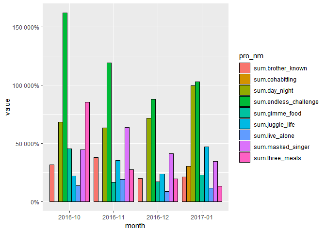

ADP TM\_1
================
jakinpilla
2019-04-28

``` r
setwd("C:/Users/Daniel/ADP_performance_test")
getwd()
```

    ## [1] "C:/Users/Daniel/ADP_performance_test"

``` r
rm(list = ls()); gc()
```

    ##          used (Mb) gc trigger (Mb) max used (Mb)
    ## Ncells 511025 27.3    1155497 61.8   609148 32.6
    ## Vcells 993965  7.6    8388608 64.0  1599023 12.2

``` r
# devtools::install_github('rstudio/rmarkdown')
```

단어 사전에 추가하기
——————————————————–

``` r
tvpro_nm <- read_csv("./data/tvprograms_name.txt", col_names = FALSE); tvpro_nm
```

    ## Parsed with column specification:
    ## cols(
    ##   X1 = col_character(),
    ##   X2 = col_character(),
    ##   X3 = col_character(),
    ##   X4 = col_character(),
    ##   X5 = col_character(),
    ##   X6 = col_character(),
    ##   X7 = col_character(),
    ##   X8 = col_character(),
    ##   X9 = col_character()
    ## )

    ## # A tibble: 1 x 9
    ##   X1      X2      X3       X4        X5      X6       X7      X8     X9    
    ##   <chr>   <chr>   <chr>    <chr>     <chr>   <chr>    <chr>   <chr>  <chr> 
    ## 1 한끼줍쇼~ 1박 2일 아는 형님~ 정글의 법칙~ 복면가왕~ 발칙한 동거~ 나혼자산다~ 무한도전~ 삼시세끼~

``` r
tvpro_nm_df <- as.data.frame(t(tvpro_nm))
rownames(tvpro_nm_df) <- NULL; tvpro_nm_df
```

    ##            V1
    ## 1    한끼줍쇼
    ## 2     1박 2일
    ## 3   아는 형님
    ## 4 정글의 법칙
    ## 5    복면가왕
    ## 6 발칙한 동거
    ## 7  나혼자산다
    ## 8    무한도전
    ## 9    삼시세끼

``` r
rep('ncn', nrow(tvpro_nm_df))
```

    ## [1] "ncn" "ncn" "ncn" "ncn" "ncn" "ncn" "ncn" "ncn" "ncn"

``` r
tvpro_nm_df <- data.frame(tvpro_nm = tvpro_nm_df$V1, tag=rep('ncn', nrow(tvpro_nm_df)))
rownames(tvpro_nm_df) <- NULL
tvpro_nm_df
```

    ##      tvpro_nm tag
    ## 1    한끼줍쇼 ncn
    ## 2     1박 2일 ncn
    ## 3   아는 형님 ncn
    ## 4 정글의 법칙 ncn
    ## 5    복면가왕 ncn
    ## 6 발칙한 동거 ncn
    ## 7  나혼자산다 ncn
    ## 8    무한도전 ncn
    ## 9    삼시세끼 ncn

``` r
pro_nm <- as.character(tvpro_nm_df$tvpro_nm)
pro_nm_pasted <- gsub(" ", "_", pro_nm)
pro_nm_pasted
```

    ## [1] "한끼줍쇼"    "1박_2일"     "아는_형님"   "정글의_법칙" "복면가왕"   
    ## [6] "발칙한_동거" "나혼자산다"  "무한도전"    "삼시세끼"

``` r
pro_nm_without_space <- gsub(" ", "", pro_nm)
pro_nm_without_space
```

    ## [1] "한끼줍쇼"   "1박2일"     "아는형님"   "정글의법칙" "복면가왕"  
    ## [6] "발칙한동거" "나혼자산다" "무한도전"   "삼시세끼"

``` r
tvpro_nm_union <- union(pro_nm_pasted, pro_nm_without_space)

user_d <- data.frame(tvpro_nm = tvpro_nm_union, "ncn" ) # using 'broadcasting'
user_d
```

    ##       tvpro_nm X.ncn.
    ## 1     한끼줍쇼    ncn
    ## 2      1박_2일    ncn
    ## 3    아는_형님    ncn
    ## 4  정글의_법칙    ncn
    ## 5     복면가왕    ncn
    ## 6  발칙한_동거    ncn
    ## 7   나혼자산다    ncn
    ## 8     무한도전    ncn
    ## 9     삼시세끼    ncn
    ## 10      1박2일    ncn
    ## 11    아는형님    ncn
    ## 12  정글의법칙    ncn
    ## 13  발칙한동거    ncn

Adding words into dic :: buildDictionary() ———————————-

``` r
dics <- c('sejong')
category <- 'TV 프로그램'
buildDictionary(ext_dic=dics, category_dic_nms = category, 
                user_dic = user_d, replace_usr_dic = F)
```

    ## 371343 words dictionary was built.

``` r
## mergeUserDic() ----
# mergeUserDic(data.frame("사이다", "ncn"))
# mergeUserDic(data.frame("한국은처음이지", "ncn"))
# mergeUserDic(data.frame(readLines("./data/000.txt"), "ncn"))
```

Data loadinng
—————————————————————

``` r
tvpro <- read_delim("data/tvprograms.txt", "\t", escape_double = FALSE, trim_ws = TRUE)
```

    ## Parsed with column specification:
    ## cols(
    ##   num = col_double(),
    ##   date = col_date(format = ""),
    ##   title = col_character(),
    ##   contents = col_character()
    ## )

``` r
head(tvpro, 10)
```

    ## # A tibble: 10 x 4
    ##      num date       title                      contents                    
    ##    <dbl> <date>     <chr>                      <chr>                       
    ##  1     1 2017-01-31 "\"성소X김종민, `한끼줍쇼` 밥동무 출연.~ ..끼줍쇼’에는 연예대상을 수상한 김종민과 대세 ~
    ##  2     2 2017-01-31 [리뷰] 안중근 의사의 후예, 안재욱의 뮤지컬~ ▲ 뮤지컬 ‘영웅(연출 윤호진)’ 공.. 최근 인~
    ##  3     3 2017-01-31 정준영, 솔로 앨범 '1인칭' 발표…복귀 청신~ 가수 정준영이 첫 솔로 정규 앨범을 발표한다. C~
    ##  4     4 2017-01-31 정준영 가수로 '컴백'…첫 정규앨범 발표~ 사진/뉴시스 ( <U+00A0> 최근 KBS 2T~
    ##  5     5 2017-01-31 주먹쥐고 뱃고동- 삼시세끼와 1박2일을 버무린~ '자산어보'를 바탕으로 현재의 바다 생태계를 확인~
    ##  6     6 2017-01-31 노홍철 ‘무한도전’ 복귀, 그때는 틀렸지만 지~ 그러나 지금은 그저 평범한 예능인으로 전락하고 말~
    ##  7     7 2017-01-31 '한끼줍쇼' 예능대상 김종민-예능대세 성소, ~ 방송: 2월 1일(수) 밤 10시 50분 예능대상~
    ##  8     8 2017-01-31 노홍철 복귀, 지금이 타이밍이다~ 의 개국공신 중 한명인 정형돈이 건강상의 이유로 ~
    ##  9     9 2017-01-31 '한끼줍쇼' 예능 대세 김종민X성소 뭉쳤다~ ..예능 ..'한끼줍쇼'에서 만났다.'한끼줍쇼'(~
    ## 10    10 2017-01-31 '한끼줍쇼' 예능대상 김종민-예능대세 성소, ~ 방송: 2월 1일(수) 밤 10시 50분 예능대상~

``` r
head(tvpro, 2)$date
```

    ## [1] "2017-01-31" "2017-01-31"

``` r
head(tvpro, 2)$title
```

    ## [1] "\"성소X김종민, `한끼줍쇼` 밥동무 출연.. \\\"대세들의 만남!\\\"\""       
    ## [2] "[리뷰] 안중근 의사의 후예, 안재욱의 뮤지컬 ‘영웅’ 출연은 필연이었을까"

``` r
head(tvpro, 2)$contents
```

    ## [1] "..끼줍쇼’에는 연예대상을 수상한 김종민과 대세 걸그룹으로 우뚝 선 우주소녀의 성소가 밥동무로 출연을 앞두고 ..‘한끼줍쇼’의 녹화에서는 강력한 예능의 기운을 몰고 온 김종민과 성소의 연희동 한 끼 도전기로 네 사람은 첫 만남부터 예사롭지 않았다고 전해졌다."
    ## [2] "▲ 뮤지컬 ‘영웅(연출 윤호진)’ 공.. 최근 인기 예능 프로그램 MBC ‘무한도전’ 팀과 역사 특집 ..형, 이정열, 리사, 박정아, 정재은, 허민진(크레용팝 초아), 이지민 외.<U+00A0> 관람료: VIP석 13만원, R석 11만원, S석 8만원, A석 6만원<U+00A0>"

``` r
dim(tvpro)
```

    ## [1] 9362    4

Titie text preprocessing —————————————————-

``` r
head(tvpro$title, 10)
```

    ##  [1] "\"성소X김종민, `한끼줍쇼` 밥동무 출연.. \\\"대세들의 만남!\\\"\""       
    ##  [2] "[리뷰] 안중근 의사의 후예, 안재욱의 뮤지컬 ‘영웅’ 출연은 필연이었을까"
    ##  [3] "정준영, 솔로 앨범 '1인칭' 발표…복귀 청신호?"                           
    ##  [4] "정준영 가수로 '컴백'…첫 정규앨범 발표"                                 
    ##  [5] "주먹쥐고 뱃고동- 삼시세끼와 1박2일을 버무린 예능, 정규편성 될까?"       
    ##  [6] "노홍철 ‘무한도전’ 복귀, 그때는 틀렸지만 지금은 맞다!"                 
    ##  [7] "'한끼줍쇼' 예능대상 김종민-예능대세 성소, 한 끼 도전!"                  
    ##  [8] "노홍철 복귀, 지금이 타이밍이다"                                         
    ##  [9] "'한끼줍쇼' 예능 대세 김종민X성소 뭉쳤다"                                
    ## [10] "'한끼줍쇼' 예능대상 김종민-예능대세 성소, 한 끼 도전!"

Remove punctuation ———————————————————

``` r
tvpro$title <- gsub("1박 2일", "1박_2일", tvpro$title)
tvpro$title <- gsub("아는 형님", "아는_형님", tvpro$title)
tvpro$title <- gsub("정글의 법칙", "정글의_법칙", tvpro$title)
tvpro$title <- gsub("발칙한 동거", "발칙한_동거", tvpro$title)

tvpro$contents <- gsub("1박 2일", "1박_2일", tvpro$contents)
tvpro$contents <- gsub("아는 형님", "아는_형님", tvpro$contents)

tvpro$contents <- gsub("정글의 법칙", "정글의_법칙", tvpro$contents)
tvpro$contents <- gsub("발칙한 동거", "발칙한_동거", tvpro$contents)

tvpro$title <- gsub('[[:punct:]]+', "", tvpro$title) #구두점 제거
tvpro$title <- gsub('2016년도', "", tvpro$title)  # 특정단어 제거
# tvpro$title <- gsub('\\d+', "", tvpro$title) # 숫자 제거 :: program_nm 내 숫자가 있으므로 여기서는 해선 안 됨
tvpro$title <- gsub('[ㄱ-ㅣ]', '', tvpro$title) # ㅋㅋㅋ, ㅜㅠ 등 제거
tvpro$title <- str_replace_all(tvpro$title, '[[:lower:]]', '') # 영어표현 모두 삭제
```

영문, 한글 아닌 것 전부 제거 하지만 띄어쓰기까지 모두 제거됨 —————–

``` r
# tvpro$title <- str_replace_all(tvpro$title, '[^[:alpha:]]', '') 

head(tvpro$title, 100)
```

    ##   [1] "성소X김종민 한끼줍쇼 밥동무 출연 대세들의 만남"                                    
    ##   [2] "리뷰 안중근 의사의 후예 안재욱의 뮤지컬 영웅 출연은 필연이었을까"                  
    ##   [3] "정준영 솔로 앨범 1인칭 발표복귀 청신호"                                            
    ##   [4] "정준영 가수로 컴백첫 정규앨범 발표"                                                
    ##   [5] "주먹쥐고 뱃고동 삼시세끼와 1박2일을 버무린 예능 정규편성 될까"                     
    ##   [6] "노홍철 무한도전 복귀 그때는 틀렸지만 지금은 맞다"                                  
    ##   [7] "한끼줍쇼 예능대상 김종민예능대세 성소 한 끼 도전"                                  
    ##   [8] "노홍철 복귀 지금이 타이밍이다"                                                     
    ##   [9] "한끼줍쇼 예능 대세 김종민X성소 뭉쳤다"                                             
    ##  [10] "한끼줍쇼 예능대상 김종민예능대세 성소 한 끼 도전"                                  
    ##  [11] "365℃ 김규리의 온도"                                                               
    ##  [12] "한끼줍쇼 성소편 우연히 벨 누른 집이 걸그룹 아이오아이의 집"                        
    ##  [13] "한끼줍쇼 예능 대세 김종민X성소 뭉쳤다"                                             
    ##  [14] "차트IS 무한도전도깨비 1월 차트 점령한 예능드라마"                                  
    ##  [15] "이슈DA다 권상우이상윤남상미 톱배우들의 예능 늦바람"                                
    ##  [16] "무한도전 도깨비 음원 지니 1월 월간차트 휩쓸어"                                     
    ##  [17] "365℃ 김규리의 온도"                                                               
    ##  [18] "우주소녀 성소 한끼줍쇼 출연연희동 찾아 거닐며 저 우주에서 왔어요"                  
    ##  [19] "ON인터뷰┃김주혁 따뜻함도 섹시함도 김주혁만의 매력으로"                            
    ##  [20] "한끼줍쇼 김종민성소 밥동무로 뭉쳤다연희동서 만난 반가운 얼굴은"                    
    ##  [21] "신드롬맨 솔비 핵사이다 공감 어록 눈길 진솔한 반전 매력"                            
    ##  [22] "SC초점 허각과 술 발라드무대가 그리웠던 노래쟁이의 고집종합"                        
    ##  [23] "아육대 성소 이번엔 한 끼 도전한끼줍쇼 이경규에게 해코지 당해"                      
    ##  [24] "김종민성소 한끼줍쇼 출연 연희동 간다"                                              
    ##  [25] "TV픽 한끼줍쇼 김종민X성소 아이오아이 집 방문 성공할까"                             
    ##  [26] "김종민우주소녀 성소 한끼줍쇼 출연유명 셰프와 만남"                                 
    ##  [27] "용기있는 솔비의 정치 발언 그 후 왜곡없이 진심 전달되길"                            
    ##  [28] "한끼줍쇼 예능대상 김종민예능대세 성소 뜬다"                                        
    ##  [29] "솔비 누구나 권력 욕심 있지만 태도가 너무 화 나 소신 발언"                          
    ##  [30] "성소X김종민 한끼줍쇼 밥동무 출연 대세들의 만남"                                    
    ##  [31] "록그룹 부활 출신 정동하 2월 11일 울산 공연"                                        
    ##  [32] "울산 현대예술관 라이브의 황제 정동하 콘서트"                                       
    ##  [33] "한끼줍쇼 김종민X우주소녀 성소 예능대세들의 한끼 도전티격태격 이유는"               
    ##  [34] "예능대상 김종민예능대세 성소 한끼줍쇼에서 밥동무로 출연"                           
    ##  [35] "예능대세 김종민성소 한끼줍쇼 출연 유명 셰프아이오아이 집 방문"                     
    ##  [36] "돌아온 정준영 2월 7일 첫 정규 앨범 1인칭 발매"                                     
    ##  [37] "아는형님 주간 비드라마 화제성 1위 팬텀싱어 2위"                                    
    ##  [38] "무한도전 도깨비의 인기 음원 차트에도 물들다"                                       
    ##  [39] "L K        T           "                                                           
    ##  [40] "365℃ 김규리의 온도"                                                               
    ##  [41] "부활 출신 보컬 정동하 오는 11일 현대예술관서 공연 개최"                            
    ##  [42] "단발병 부르는 홍진영 근황 최대한 말라볼게요"                                       
    ##  [43] "설특집 아는형님 비드라마 프로그램 화제성 1위"                                      
    ##  [44] "TV줌인 아형→아육대→안녕 차오루 설 연휴 씹어먹은 똑순이"                          
    ##  [45] "지상파3사 설 파일럿 대결MBC 발칙한동거 합격이오"                                   
    ##  [46] "지상파3사 설 파일럿 대결MBC 발칙한동거 합격이오"                                   
    ##  [47] "메트로신문 1월 31일 한줄뉴스"                                                      
    ##  [48] "스타강사 설민석 가장 기억에 남는 제자로 하하 꼽은 이유는 역사적 지식 無 촬영할수록"
    ##  [49] "아는형님 주간 비드라마 화제성 1위 팬텀싱어는 2위"                                  
    ##  [50] "앙순이들 안녕 영상 26개로 보는 아이오아이"                                         
    ##  [51] "설연휴 가장 바빴던 예능인 양세형의 전망은 밝다"                                    
    ##  [52] "복면가왕 꼬꼬댁 정체는 서현 제 목소리 알아채는 분 계실지설레고 긴장"               
    ##  [53] "최불암김주혁 통해 본 1박이 추구하는 훈훈한 웃음"                                   
    ##  [54] "1박2일 김주혁 차태현 이유영 언급에 당황함속 침착한 대응 눈길"                      
    ##  [55] "복면가왕 서현굉장히 설레고 긴장되는 순간 SNS에 소감 전해"                          
    ##  [56] "뜻밖의 미스터리 클럽 설 파일럿 예능에서 정규 편성으로누리꾼들 폭발적 반응"         
    ##  [57] "복면가왕 꼬꼬마인디언 정체는 최민수음악 숨 쉬는 것까지 좋아한다"                   
    ##  [58] "복면가왕 꼬꼬마인디언 최민수 아내 강주은이 소송걸고 싶다던 그 노래 정체는"         
    ##  [59] "인터뷰 김주혁 1박2일에서 배운 비움 덕에 배우로 성장했죠"                           
    ##  [60] "최불암김주혁 통해 본 1박이 추구하는 훈훈한 웃음"                                   
    ##  [61] "복면가왕 베짱이 폭풍 성량 감성 짙은 감동 대박이야"                                 
    ##  [62] "오빠생각엄마의 소개팅아육대 등 설연휴 막바지 파일럿 프로 관심 UP"                  
    ##  [63] "복면가왕 베짱이 폭풍 성량 감성 짙은 감동 대박이야"                                 
    ##  [64] "TF설특집 조인성부터 박보검까지올해는 나의 해 닭띠 ★들"                            
    ##  [65] "피플IS 윤두준 정유년 예능복 터졌다 열일하는 남자"                                  
    ##  [66] "TV줌인 1박2일 불멸의 진리 구탱이형X준영이는 통한다"                                
    ##  [67] "기행의 아이콘 최민수 탈탈 털렸다"                                                  
    ##  [68] "ONV｜방송 삶의 근원에 다가간 한끼줍쇼내집이 나타났다"                              
    ##  [69] "복면가왕 서현 출연 인증샷오늘 저의 정체가 공개됐네요"                              
    ##  [70] "복면가왕 서현 출연 인증샷오늘 저의 정체가 공개됐네요"                              
    ##  [71] "인터뷰 김주혁이 말하는 공조1박2일 주저는 빼고 여유는 더하고"                       
    ##  [72] "신드롬맨 정용화 2년만 예능복귀 어땠나"                                             
    ##  [73] "M인터뷰② 김주혁 1박2일 단톡방 나올 때 가장 씁쓸했다"                              
    ##  [74] "스타강사 설민석 가장 기억에 남는 제자 무한도전 하하 역사적 지식 無"                
    ##  [75] "냉부해 유현수 셰프 군단 합류한식 끝판 왕"                                          
    ##  [76] "발칙한동거 빈방 있음 리뷰 피오 김신영홍진영 잠 깨우기 방법은 귀여움 폭발"          
    ##  [77] "무한도전 7주 결방 프리랜서 작가 원고료 어떻게 지급할까"                            
    ##  [78] "김용우가 만난 사람 박상현 캐스터가 살아가는 법"                                    
    ##  [79] "발칙한동거 김구라 한은정을 위해 이것까지 눈길"                                     
    ##  [80] "★밤TV사십춘기 무한도전과 비교 아닌 정규 가능성 본다면"                            
    ##  [81] "신바 김종민 방송가 대우가 달라졌다"                                                
    ##  [82] "공조 김주혁 1박2일 출연 연기 인생에 도움됐다인터뷰②"                              
    ##  [83] "TV와치사십춘기 노답예능 무도에 못 미치지만 슬슬 빠져드네"                          
    ##  [84] "TV와치사십춘기 노답예능 무도에 못 미치지만 슬슬 빠져드네"                          
    ##  [85] "★밤TV발칙한동거 김구라 츤데레 매력으로 최고인기남 등극"                           
    ##  [86] "설연휴 TV가이드 엄마의 소개팅천국사무소오빠생각 등 특집예능 풍성"                  
    ##  [87] "신바 김종민 방송가 대우가 달라졌다"                                                
    ##  [88] "제약업계 광고 트렌드 중년 예능 스타 전성시대"                                      
    ##  [89] "제약업계 광고 트렌드 중년 예능 스타 전성시대"                                      
    ##  [90] "방탄소년단트와이스 1월 남녀가수 브랜드 평판 1위"                                   
    ##  [91] "딘딘 박명수 어이없을 정도로 날 아껴줘왜일까한복인터뷰②"                           
    ##  [92] "딘딘 박명수 어이없을 정도로 날 아껴줘왜일까한복인터뷰②"                           
    ##  [93] "한은정 다채로운 매력여신 포스 고혹적"                                              
    ##  [94] "가수 1월 빅데이터 분석 1위 방탄소년단 2위 트와이스 3위 엑소"                       
    ##  [95] "방탄소년단 1월 가수 브랜드평판 1위트와이스는 2위"                                  
    ##  [96] "방탄소년단 브랜드평판 1위 탈환 2위 트와이스3위 엑소"                               
    ##  [97] "신서유기3 측 암전좀비게임 시작강호동송민호 원수 된다"                              
    ##  [98] "블락비 피오 27일 모친상 같은 날 발칙한동거 속 웃는 모습에 안타까움"                
    ##  [99] "사십춘기 권상우 매력 부자X직진男의 예능 활약기 브로맨스"                           
    ## [100] "한은정 정글의법칙 차 뒤에서 노상방뇨멤버들 깜짝 놀라 털털매력"

Contents text preprocessing ————————————————-

``` r
# tvpro$contents <- gsub('[[:punct:]]+', "", tvpro$contents)
tvpro$contents <- gsub('2016년도', "", tvpro$contents)  # 특정단어 제거
tvpro$contents <- gsub('▲', "", tvpro$contents)  # 특정단어 제거
tvpro$contents <- gsub('U00A0', "", tvpro$contents)  # 특정단어 제거
tvpro$contents <- gsub('U00A07', "", tvpro$contents)  # 특정단어 제거
# tvpro$contents <- gsub('\\d+', "", tvpro$contents) # 숫자 제거
tvpro$contents <- gsub('[ㄱ-ㅣ]', '', tvpro$contents) # ㅋㅋㅋ, ㅜㅠ 등 제거
tvpro$contents <- str_replace_all(tvpro$contents, '[[:lower:]]', '') # 영어 소문자 표현 모두 삭제

head(tvpro$contents, 10)
```

    ##  [1] "..끼줍쇼’에는 연예대상을 수상한 김종민과 대세 걸그룹으로 우뚝 선 우주소녀의 성소가 밥동무로 출연을 앞두고 ..‘한끼줍쇼’의 녹화에서는 강력한 예능의 기운을 몰고 온 김종민과 성소의 연희동 한 끼 도전기로 네 사람은 첫 만남부터 예사롭지 않았다고 전해졌다."   
    ##  [2] " 뮤지컬 ‘영웅(연출 윤호진)’ 공.. 최근 인기 예능 프로그램 MBC ‘무한도전’ 팀과 역사 특집 ..형, 이정열, 리사, 박정아, 정재은, 허민진(크레용팝 초아), 이지민 외.<U+00A0> 관람료: VIP석 13만원, R석 11만원, S석 8만원, A석 6만원<U+00A0>"                       
    ##  [3] "가수 정준영이 첫 솔로 정규 앨범을 발표한다. C9 엔터테인먼트 관계자는 정준영 공식 SNS 및 팬카페 등을 통해 오는 7일 0시 정준영의 첫 솔로 정규 앨범.. 앞서 정준영은 약 4개월여의 공백을 딛고 최근 KBS 예능 프로그램 '1박2일'에 복귀했다."                         
    ##  [4] "사진/뉴시스 ( <U+00A0> 최근 KBS 2TV 예능 '1박2일'로 연예계 복귀를 알린 가수 정준영(28)이<U+00A0>오는 2월<U+00A0>7일 첫 정규 앨범을 발표한다. 소속사 C9엔터테인먼트는 31일 공식 SNS와 팬카페를 통해 정준영의 첫 정규 앨범 '1인칭'을 오는 7일 .."                
    ##  [5] "'자산어보'를 바탕으로 현재의 바다 생태계를 확인한다는 측면에서는 반가웠다.<U+00A0> 예능과 정보 사이; 삼시세끼와 1박2일의 정수 뽑아 새로운 자산어보를 만들겠다 김병만은 특화된 존재다...예능 의 산증인이라고 해도 과언이 아닌 김종민이 참여했다는 것도 흥미롭.."
    ##  [6] "그러나 지금은 그저 평범한 예능인으로 전락하고 말았다. 그에겐 더 이상 신선함이라든지 기존 예능 문법을 파괴하는 발칙한 모습이 보이지 않는다. 식스맨으로 광희가 합류하고 양세형이 새로운 멤버로 자리를 잡아가면서, ..예능프로그램 많은 이들이 에서 노홍철.."      
    ##  [7] "방송: 2월 1일(수) 밤 10시 50분 예능대상과 예능대세가 한 끼에 도전한다.'한끼줍쇼'의 녹화에서는 강력한 예능의 기운을 몰고 온 김종민과 성소의 연희동 한 끼 도전기가 그려졌다...예능대상 김종민과 예능대세 성소의 활약은 오는 2월 1일(수) 밤 .."                   
    ##  [8] "의 개국공신 중 한명인 정형돈이 건강상의 이유로 하차를 결정한 것이다. 식스맨으로 광희가 합류하고, 양세형이 새로운 멤버로 자리를 잡아가면서,  무한도전> 멤버들 ..무한도전> 많은 이들이 에서 노홍철을 보는 건 이제 어렵겠구나 하고.. 노홍철 무한도전"             
    ##  [9] "..예능 ..'한끼줍쇼'에서 만났다.'한끼줍쇼'(연출 방현영)에는 연예대상을 수상한 김종민과 대세 걸그룹으로 우뚝 선 우주소녀의 성소가 밥동무로 출연한다.'한끼줍쇼'의 녹화에서는 강력한 예능의 기운을 몰고 온 김종민과 성소의 연희동 한 끼 도전기가 그려졌다."        
    ## [10] "방송: 2월 1일(수) 밤 10시 50분 예능대상과 예능대세가 한 끼에 도전한다.'한끼줍쇼'의 녹화에서는 강력한 예능의 기운을 몰고 온 김종민과 성소의 연희동 한 끼 도전기가 그려졌다...예능대상 김종민과 예능대세 성소의 활약은 오는 2월 1일(수) 밤 .."

NA 값 제거—-

``` r
title.vec <- tvpro$title
title.vec[is.na(title.vec)]
```

    ## [1] NA

``` r
title.vec[is.na(title.vec)] <- 'dummy' # NA 있으면 추후 에러 발생, 제거 필ㅇ

contents.vec <- tvpro$contents
contents.vec[is.na(contents.vec)] # contents에는 NA 값 없음
```

    ## character(0)

``` r
# # ko.words() 함수 만들기
# ko.words <- function(doc) {
#   d <- as.character(doc)
#   extractNoun(d)
# }
```

SimplePos09() tagging ——————————————————-

``` r
length(title.vec)
```

    ## [1] 9362

``` r
title.vec[1:10]
```

    ##  [1] "성소X김종민 한끼줍쇼 밥동무 출연 대세들의 만남"                  
    ##  [2] "리뷰 안중근 의사의 후예 안재욱의 뮤지컬 영웅 출연은 필연이었을까"
    ##  [3] "정준영 솔로 앨범 1인칭 발표복귀 청신호"                          
    ##  [4] "정준영 가수로 컴백첫 정규앨범 발표"                              
    ##  [5] "주먹쥐고 뱃고동 삼시세끼와 1박2일을 버무린 예능 정규편성 될까"   
    ##  [6] "노홍철 무한도전 복귀 그때는 틀렸지만 지금은 맞다"                
    ##  [7] "한끼줍쇼 예능대상 김종민예능대세 성소 한 끼 도전"                
    ##  [8] "노홍철 복귀 지금이 타이밍이다"                                   
    ##  [9] "한끼줍쇼 예능 대세 김종민X성소 뭉쳤다"                           
    ## [10] "한끼줍쇼 예능대상 김종민예능대세 성소 한 끼 도전"

``` r
title.vec[1] %>% 
  SimplePos09() %>% 
  unlist() %>% 
  unname() %>% 
  strsplit("\\+") %>% 
  unlist() -> title.vec_1.tagged
```

Extracting Nouns
—————————————————————

``` r
noun.vec_1 <- title.vec_1.tagged[grep("/N", title.vec_1.tagged)]; noun.vec_1
```

    ## [1] "성소X김종민/N" "한끼줍쇼/N"    "밥동무/N"      "출연/N"       
    ## [5] "대세들/N"      "남/N"

Extracting adjectives
———————————————————-

``` r
adj.vec_1 <- title.vec_1.tagged[grep("/P", title.vec_1.tagged)]; adj.vec_1
```

    ## [1] "말/P"

``` r
noun.vec_1 %>% paste(collapse = " ")
```

    ## [1] "성소X김종민/N 한끼줍쇼/N 밥동무/N 출연/N 대세들/N 남/N"

Sample title vec prac —-

``` r
sam.vec <- title.vec[1:2]
sam.vec_taged <- NULL
for (i in 1:length(sam.vec)) {
  sam.vec[i] %>% 
    SimplePos09() %>% 
    unlist() %>% 
    unname() %>% 
    strsplit("\\+") %>% 
    unlist() -> ith.tagged
  
  ith.tagged[grep("/N", ith.tagged)] %>%
    paste(collapse = " ") -> ith.N_tagged
  
  sam.vec_taged <- append(sam.vec_taged, ith.N_tagged)
}

sam.vec_taged
```

    ## [1] "성소X김종민/N 한끼줍쇼/N 밥동무/N 출연/N 대세들/N 남/N"              
    ## [2] "리뷰/N 안중근/N 의사/N 후예/N 안재욱/N 뮤지컬/N 영웅/N 출연/N 필연/N"

Tagging on Title.vec and Extracting Nouns ————————————

``` r
# title_doc.vec <- NULL
# for (i in 1:length(title.vec)) {
#   
#   title.vec[i] %>% 
#     SimplePos09() %>% 
#     unlist() %>% 
#     unname() %>% 
#     strsplit("\\+") %>% 
#     unlist() -> ith.tagged
#   
#   ith.tagged[grep("/N", ith.tagged)] %>% # 형용사일 경우 "/P" 로 변경...
#     paste(collapse = " ") -> ith.N_tagged
#   
#   title_doc.vec <- c(title_doc.vec, ith.N_tagged)
# }
# 
# title_doc.vec %>% length()
# title_doc.vec <- gsub('[[:punct:]]+', "", title_doc.vec)
# # title_doc.vec <- gsub('[[:digit:]]+', "", title_doc.vec) # 1박 2일 때문에 안 됨.
# title_doc.vec <- gsub('[[:lower:]]+', "", title_doc.vec)
# title_doc.vec <- gsub("n", "", title_doc.vec)
# title_doc.vec <- gsub("N", "", title_doc.vec)
# 
# title_doc.vec %>%
#   enframe() %>%
#   rename(doc_num = name, 
#          title_tagged = value) %>%
#   write_csv("./data/df_title_tagged.csv")

df_title_tagged <- read_csv("./data/df_title_tagged.csv")
```

    ## Parsed with column specification:
    ## cols(
    ##   doc_num = col_double(),
    ##   title_tagged = col_character()
    ## )

``` r
df_title_tagged %>% colnames()
```

    ## [1] "doc_num"      "title_tagged"

불용문자 제거
—————————————————————

``` r
df_title_tagged$title_tagged <- gsub('[[:punct:]]+', "", df_title_tagged$title_tagged)
df_title_tagged$title_tagged <- gsub('[[:lower:]]+', "", df_title_tagged$title_tagged)
df_title_tagged$title_tagged <- gsub("n", "", df_title_tagged$title_tagged)
```

DTM for Title vector data
—————————————————

``` r
strsplit_space_tokenizer <- function(x) unlist(strsplit(as.character(x), " "))
df_title_tagged$title_tagged[1] %>% strsplit_space_tokenizer()
```

    ## [1] "성소X김종민" "한끼줍쇼"    "밥동무"      "출연"        "대세들"     
    ## [6] "남"

``` r
options(mc.cores=1)
cps <- tm::VCorpus(tm::VectorSource(df_title_tagged$title_tagged))
dtm_title <- DocumentTermMatrix(cps, 
                                control = list(tokenize = strsplit_space_tokenizer,
                                               removePunctuation=T,
                                               wordLengths=c(2, 6),
                                               weighting = weightTf))
dtm_title
```

    ## <<DocumentTermMatrix (documents: 9362, terms: 12245)>>
    ## Non-/sparse entries: 46139/114591551
    ## Sparsity           : 100%
    ## Maximal term length: 6
    ## Weighting          : term frequency (tf)

``` r
dtm_title_mat <- as.matrix(dtm_title)
dim(dtm_title_mat)
```

    ## [1]  9362 12245

만약 TDM이 너무 커서 as.matrix() 이후 메모리상에 할당되지 않을 때의 해결방법은??

Using `slam packaege` ——————————————————-

``` r
dtm_title %>%
  slam::col_sums(na.rm = T) %>%
  as.data.frame() %>% 
  rownames_to_column() %>%
  as_tibble() %>%
  rename(words = rowname) %>%
  rename(freq = ".") ->  df.title_word_count
  
df.title_word_count # %>% View()
```

    ## # A tibble: 12,245 x 2
    ##    words        freq
    ##    <chr>       <dbl>
    ##  1 ★shot           5
    ##  2 ★날선무비       3
    ##  3 ★다이제스트     1
    ##  4 ★들            10
    ##  5 ★들이           1
    ##  6 ★말말           1
    ##  7 ★말말말         5
    ##  8 ★밤tv           6
    ##  9 ★밤tv가슴       3
    ## 10 ★밤tv감동       3
    ## # ... with 12,235 more rows

``` r
df.title_word_count$words <- gsub("★", "", df.title_word_count$words)
df.title_word_count %>%
  slice(-grep("^\\d+$", words)) -> df.title_word_count  # eliminate all rows which contains only digit number character

df.title_word_count$words[1:10] # %>% View()
```

    ##  [1] "shot"       "날선무비"   "다이제스트" "들"         "들이"      
    ##  [6] "말말"       "말말말"     "밤tv"       "밤tv가슴"   "밤tv감동"

긍정, 부정 단어 사전, 카운트, 두 개의 집단으로 클러스터링, 시각화…

영화 댓글, 점수 크롤링 후 데이터셋 만들기 / 형용사 추출 / 긍부정과 관련있는 형용사는 무엇 영화의 긍부정 댓글 구분 월별
긍부정 추이 확인

tvpro\_nm\_union이 있는 행들만 추출 ——————————————-

``` r
# dimnames(dtm_title)
tvpro_nm_union
```

    ##  [1] "한끼줍쇼"    "1박_2일"     "아는_형님"   "정글의_법칙" "복면가왕"   
    ##  [6] "발칙한_동거" "나혼자산다"  "무한도전"    "삼시세끼"    "1박2일"     
    ## [11] "아는형님"    "정글의법칙"  "발칙한동거"

``` r
dtm_title_extracted <- dtm_title_mat[, dimnames(dtm_title)$Terms %in% tvpro_nm_union] # TDM 에서 추출한다.
dim(dtm_title_extracted) # 9개의 행들만 추출된 matrix
```

    ## [1] 9362    9

``` r
dtm_title_extracted %>% colnames()
```

    ## [1] "1박2일"     "나혼자산다" "무한도전"   "발칙한동거" "복면가왕"  
    ## [6] "삼시세끼"   "아는형님"   "정글의법칙" "한끼줍쇼"

``` r
title_mat <- dtm_title_extracted
str(title_mat)
```

    ##  num [1:9362, 1:9] 0 0 0 0 1 0 0 0 0 0 ...
    ##  - attr(*, "dimnames")=List of 2
    ##   ..$ Docs : chr [1:9362] "1" "2" "3" "4" ...
    ##   ..$ Terms: chr [1:9] "1박2일" "나혼자산다" "무한도전" "발칙한동거" ...

``` r
colnames(title_mat)
```

    ## [1] "1박2일"     "나혼자산다" "무한도전"   "발칙한동거" "복면가왕"  
    ## [6] "삼시세끼"   "아는형님"   "정글의법칙" "한끼줍쇼"

Title data만 보았을때 각 프로그램 이름이 들어간 문건의 횟수 확인

``` r
title_mat %>%
  as.data.frame() %>%
  col_sums() %>%
  as.data.frame() %>%
  rownames_to_column() %>%
  as_tibble() %>%
  rename(words = rowname) %>%
  rename(freq = ".")
```

    ## # A tibble: 9 x 2
    ##   words       freq
    ##   <chr>      <dbl>
    ## 1 1박2일       657
    ## 2 나혼자산다   198
    ## 3 무한도전     713
    ## 4 발칙한동거    98
    ## 5 복면가왕     464
    ## 6 삼시세끼     266
    ## 7 아는형님     202
    ## 8 정글의법칙   202
    ## 9 한끼줍쇼     355

``` r
dtm_title %>%
  slam::col_sums(na.rm = T) %>%
  as.data.frame() %>% 
  rownames_to_column() %>%
  as_tibble() %>%
  rename(words = rowname) %>%
  rename(freq = ".") ->  df.title_word_count

df.title_word_count %>%
  filter(words %in% tvpro_nm_union)
```

    ## # A tibble: 9 x 2
    ##   words       freq
    ##   <chr>      <dbl>
    ## 1 1박2일       657
    ## 2 나혼자산다   198
    ## 3 무한도전     713
    ## 4 발칙한동거    98
    ## 5 복면가왕     464
    ## 6 삼시세끼     266
    ## 7 아는형님     202
    ## 8 정글의법칙   202
    ## 9 한끼줍쇼     355

Contents data —————————————————————

``` r
contents.vec <- tvpro$contents
contents.vec[is.na(contents.vec)] # There is no NA in content vector...
```

    ## character(0)

``` r
# contents_doc.vec <- NULL
# for (i in 1:length(contents.vec)) {
#   
#   contents.vec[i] %>% 
#     SimplePos09() %>% 
#     unlist() %>% 
#     unname() %>% 
#     strsplit("\\+") %>% 
#     unlist() -> ith.tagged
#   
#   ith.tagged[grep("/N", ith.tagged)] %>%
#     paste(collapse = " ") -> ith.N_tagged
#   
#   contents_doc.vec <- c(contents_doc.vec, ith.N_tagged)
# }

# title_doc.vec %>%
#   enframe() %>%
#   rename(doc_num = name, 
#          title_tagged = value) %>%
#   write_csv("./data/df_title_tagged.csv")

# contents_doc.vec %>%
#   enframe() %>%
#   rename(doc_num = name,
#          contents_tagged = value) %>%
#   write_csv("./data/df_contents_tagged.csv")

df_contents_tagged <- read_csv("./data/df_contents_tagged.csv")
```

    ## Parsed with column specification:
    ## cols(
    ##   doc_num = col_double(),
    ##   contents_tagged = col_character()
    ## )

``` r
df_contents_tagged %>% colnames()
```

    ## [1] "doc_num"         "contents_tagged"

불용문자 제거
—————————————————————

``` r
df_contents_tagged$contents_tagged <- gsub('[[:punct:]]+', "", df_contents_tagged$contents_tagged)
df_contents_tagged$contents_tagged <- gsub('[[:lower:]]+', "", df_contents_tagged$contents_tagged)
df_contents_tagged$contents_tagged <- gsub("n", "", df_contents_tagged$contents_tagged)
df_contents_tagged$contents_tagged <- gsub("N", "", df_contents_tagged$contents_tagged)
```

DTM 생성 ——————————————————————–

``` r
options(mc.cores=1)
cps <- tm::VCorpus(tm::VectorSource(df_contents_tagged$contents_tagged))
strsplit_space_tokenizer <- function(x) unlist(strsplit(as.character(x), " "))

dtm_contents <- DocumentTermMatrix(cps, 
                                   control = list(tokenize = strsplit_space_tokenizer,
                                                  removePunctuation=T,
                                                  wordLengths=c(2, 6),
                                                  weighting = weightTf))

dtm_contents
```

    ## <<DocumentTermMatrix (documents: 9362, terms: 20842)>>
    ## Non-/sparse entries: 155417/194967387
    ## Sparsity           : 100%
    ## Maximal term length: 6
    ## Weighting          : term frequency (tf)

``` r
dtm_contents_mat <- as.matrix(dtm_contents) # 이렇게 하면 메모리 문제로 할당하지 못하는 경우가 많다.
dim(dtm_contents_mat)
```

    ## [1]  9362 20842

tvpro\_nm\_union 이 있는 행들만 추출
——————————————-

``` r
dtm_contents_extracted <- dtm_contents_mat[, dimnames(dtm_contents)$Terms %in% tvpro_nm_union]
contents_mat <- dtm_contents_extracted
str(contents_mat)
```

    ##  num [1:9362, 1:9] 0 0 1 1 1 0 0 0 0 0 ...
    ##  - attr(*, "dimnames")=List of 2
    ##   ..$ Docs : chr [1:9362] "1" "2" "3" "4" ...
    ##   ..$ Terms: chr [1:9] "1박2일" "나혼자산다" "무한도전" "발칙한동거" ...

``` r
colnames(contents_mat)
```

    ## [1] "1박2일"     "나혼자산다" "무한도전"   "발칙한동거" "복면가왕"  
    ## [6] "삼시세끼"   "아는형님"   "정글의법칙" "한끼줍쇼"

instead
———————————————————————

``` r
inspect(dtm_contents[, dimnames(dtm_contents)$Terms %in% tvpro_nm_union])
```

    ## <<DocumentTermMatrix (documents: 9362, terms: 9)>>
    ## Non-/sparse entries: 7271/76987
    ## Sparsity           : 91%
    ## Maximal term length: 5
    ## Weighting          : term frequency (tf)
    ## Sample             :
    ##       Terms
    ## Docs   1박2일 나혼자산다 무한도전 발칙한동거 복면가왕 삼시세끼 아는형님
    ##   1439      0          0        6          0        0        0        0
    ##   342       0          0        7          0        0        0        0
    ##   354       0          0        6          0        0        0        0
    ##   361       0          0        6          0        0        0        0
    ##   411       0          0        6          0        0        0        0
    ##   426       0          0        7          0        0        0        0
    ##   439       0          0        7          0        0        0        0
    ##   5311      0          0        0          0        8        0        0
    ##   8772      0          0        7          0        0        0        0
    ##   9047      1          0        4          0        1        0        1
    ##       Terms
    ## Docs   정글의법칙 한끼줍쇼
    ##   1439          0        0
    ##   342           0        0
    ##   354           0        0
    ##   361           0        0
    ##   411           0        0
    ##   426           0        0
    ##   439           0        0
    ##   5311          0        0
    ##   8772          0        0
    ##   9047          0        0

``` r
dtm_contents[, dimnames(dtm_contents)$Terms %in% tvpro_nm_union] %>% 
  as.matrix() ->  dtm_contents_extracted # 이렇게 하면 필요한 열만 가지는 matrix를 메모리 할당 문제 없이 진행할 수 있다.

contents_mat <- dtm_contents_extracted
```

contents data만 보았을때 각 프로그램 이름이 들어간 문건의 횟수 확인 ———

``` r
contents_mat %>%
  col_sums()
```

    ##     1박2일 나혼자산다   무한도전 발칙한동거   복면가왕   삼시세끼 
    ##       2366        326       3998        203       1367       1187 
    ##   아는형님 정글의법칙   한끼줍쇼 
    ##        896       1076        664

named vector를 date.frame으로 바꾸어서 그래프를 그리는 방법은? ————–

sum matrix ——————————————————————

``` r
total_mat <- title_mat + contents_mat
```

날짜연산 ——————————————————————–

``` r
glimpse(tvpro)
```

    ## Observations: 9,362
    ## Variables: 4
    ## $ num      <dbl> 1, 2, 3, 4, 5, 6, 7, 8, 9, 10, 11, 12, 13, 14, 15, 16...
    ## $ date     <date> 2017-01-31, 2017-01-31, 2017-01-31, 2017-01-31, 2017...
    ## $ title    <chr> "성소X김종민 한끼줍쇼 밥동무 출연 대세들의 만남", "리뷰 안중근 의사의 후예 안재욱의 뮤지컬...
    ## $ contents <chr> "..끼줍쇼’에는 연예대상을 수상한 김종민과 대세 걸그룹으로 우뚝 선 우주소녀의 성소가 밥동무로...

``` r
class(tvpro$date)
```

    ## [1] "Date"

월별 집계를 위해 년도\_월 변수 생성 ——————————————-

``` r
tvpro$month <- format(tvpro$date, '%Y-%m')
tvpro$month[1:5]
```

    ## [1] "2017-01" "2017-01" "2017-01" "2017-01" "2017-01"

Add date and month columns—-

``` r
head(as.data.frame(total_mat))
```

    ##   1박2일 나혼자산다 무한도전 발칙한동거 복면가왕 삼시세끼 아는형님
    ## 1      0          0        0          0        0        0        0
    ## 2      0          0        1          0        0        0        0
    ## 3      1          0        0          0        0        0        0
    ## 4      1          0        0          0        0        0        0
    ## 5      2          0        0          0        0        2        0
    ## 6      0          0        1          0        0        0        0
    ##   정글의법칙 한끼줍쇼
    ## 1          0        2
    ## 2          0        0
    ## 3          0        0
    ## 4          0        0
    ## 5          0        0
    ## 6          0        0

``` r
total_df <-  as.data.frame(total_mat)
dim(total_df)
```

    ## [1] 9362    9

``` r
date_df <- data.frame(date = tvpro$date, month=tvpro$month)
dim(date_df)
```

    ## [1] 9362    2

``` r
data <- cbind(date_df, total_df); head(data)
```

    ##         date   month 1박2일 나혼자산다 무한도전 발칙한동거 복면가왕
    ## 1 2017-01-31 2017-01      0          0        0          0        0
    ## 2 2017-01-31 2017-01      0          0        1          0        0
    ## 3 2017-01-31 2017-01      1          0        0          0        0
    ## 4 2017-01-31 2017-01      1          0        0          0        0
    ## 5 2017-01-31 2017-01      2          0        0          0        0
    ## 6 2017-01-31 2017-01      0          0        1          0        0
    ##   삼시세끼 아는형님 정글의법칙 한끼줍쇼
    ## 1        0        0          0        2
    ## 2        0        0          0        0
    ## 3        0        0          0        0
    ## 4        0        0          0        0
    ## 5        2        0          0        0
    ## 6        0        0          0        0

``` r
as.data.frame(total_mat) %>%
  as_tibble() %>%
  mutate(month = tvpro$month) -> data
```

월별 단어 출현 횟수 ———————————————————-

``` r
head(data)
```

    ## # A tibble: 6 x 10
    ##   `1박2일` 나혼자산다 무한도전 발칙한동거 복면가왕 삼시세끼 아는형님
    ##      <dbl>      <dbl>    <dbl>      <dbl>    <dbl>    <dbl>    <dbl>
    ## 1        0          0        0          0        0        0        0
    ## 2        0          0        1          0        0        0        0
    ## 3        1          0        0          0        0        0        0
    ## 4        1          0        0          0        0        0        0
    ## 5        2          0        0          0        0        2        0
    ## 6        0          0        1          0        0        0        0
    ## # ... with 3 more variables: 정글의법칙 <dbl>, 한끼줍쇼 <dbl>, month <chr>

``` r
class(data)
```

    ## [1] "tbl_df"     "tbl"        "data.frame"

``` r
colnames(data) <- c("day_night", "live_alone", "endless_challenge", "cohabitting",
                    "masked_singer", "three_meals", "brother_known",  "juggle_life",
                    "gimme_food", "month")

head(data)
```

    ## # A tibble: 6 x 10
    ##   day_night live_alone endless_challen~ cohabitting masked_singer
    ##       <dbl>      <dbl>            <dbl>       <dbl>         <dbl>
    ## 1         0          0                0           0             0
    ## 2         0          0                1           0             0
    ## 3         1          0                0           0             0
    ## 4         1          0                0           0             0
    ## 5         2          0                0           0             0
    ## 6         0          0                1           0             0
    ## # ... with 5 more variables: three_meals <dbl>, brother_known <dbl>,
    ## #   juggle_life <dbl>, gimme_food <dbl>, month <chr>

``` r
data %>% 
  group_by(month) %>%
  summarise(sum.day_night = sum(day_night),
            sum.live_alone = sum(live_alone),
            sum.endless_challenge = sum(endless_challenge),
            sum.cohabitting = sum(cohabitting),
            sum.masked_singer =sum(masked_singer),
            sum.three_meals = sum(three_meals),
            sum.brother_known = sum(brother_known),
            sum.juggle_life = sum(juggle_life),
            sum.gimme_food = sum(gimme_food)) -> data_mon_sum; data_mon_sum
```

    ## # A tibble: 4 x 10
    ##   month sum.day_night sum.live_alone sum.endless_cha~ sum.cohabitting
    ##   <chr>         <dbl>          <dbl>            <dbl>           <dbl>
    ## 1 2016~           683            136             1618               0
    ## 2 2016~           630            189             1189               0
    ## 3 2016~           714             85              876               0
    ## 4 2017~           996            114             1028             301
    ## # ... with 5 more variables: sum.masked_singer <dbl>,
    ## #   sum.three_meals <dbl>, sum.brother_known <dbl>, sum.juggle_life <dbl>,
    ## #   sum.gimme_food <dbl>

``` r
melted <- melt(data_mon_sum , id.vars = 'month'); head(melted)
```

    ##     month       variable value
    ## 1 2016-10  sum.day_night   683
    ## 2 2016-11  sum.day_night   630
    ## 3 2016-12  sum.day_night   714
    ## 4 2017-01  sum.day_night   996
    ## 5 2016-10 sum.live_alone   136
    ## 6 2016-11 sum.live_alone   189

``` r
data_mon_sum %>%
  gather(pro_nm, value, -month)
```

    ## # A tibble: 36 x 3
    ##    month   pro_nm                value
    ##    <chr>   <chr>                 <dbl>
    ##  1 2016-10 sum.day_night           683
    ##  2 2016-11 sum.day_night           630
    ##  3 2016-12 sum.day_night           714
    ##  4 2017-01 sum.day_night           996
    ##  5 2016-10 sum.live_alone          136
    ##  6 2016-11 sum.live_alone          189
    ##  7 2016-12 sum.live_alone           85
    ##  8 2017-01 sum.live_alone          114
    ##  9 2016-10 sum.endless_challenge  1618
    ## 10 2016-11 sum.endless_challenge  1189
    ## # ... with 26 more rows

Visualization —————————————————————

``` r
data_mon_sum %>%
  gather(pro_nm, value, -month) %>%
  ggplot(aes(x = month, y = value, fill = pro_nm)) +
  geom_bar(position = 'dodge', stat = 'identity', color = 'black') +
  scale_y_continuous()
```

<!-- -->

``` r
data_mon_sum %>%
  gather(pro_nm, value, -month) %>%
  ggplot(aes(x = month, y = value, fill = pro_nm)) +
  geom_bar(position = 'dodge', stat = 'identity', color = 'black') +
  scale_y_continuous(labels = scales::percent)
```

<!-- -->

Just guess what tv programes are with frequent words… ———————

word count, word cloud 등

``` r
dtm_contents %>%
  slam::col_sums() %>%
  as.data.frame() %>%
  rownames_to_column() %>% 
  rename(freq = ".") %>%
  rename(words = rowname) %>%
  filter(freq >= 50) %>% 
  as_tibble() ->  data.for_wordcloud; data.for_wordcloud
```

    ## # A tibble: 509 x 2
    ##    words  freq
    ##    <chr> <dbl>
    ##  1 10      110
    ##  2 10년     55
    ##  3 10시    125
    ##  4 10월    114
    ##  5 11       77
    ##  6 11시     90
    ##  7 11월    142
    ##  8 12      238
    ##  9 12월    133
    ## 10 13      160
    ## # ... with 499 more rows

text cleansing—-

``` r
data.for_wordcloud %>%
  slice(-grep("^\\d+$", words)) -> data.for_wordcloud  # eliminate all rows which contains only digit number character

data.for_wordcloud  # %>% View()
```

    ## # A tibble: 488 x 2
    ##    words     freq
    ##    <chr>    <dbl>
    ##  1 10년        55
    ##  2 10시       125
    ##  3 10월       114
    ##  4 11시        90
    ##  5 11월       142
    ##  6 12월       133
    ##  7 15분        70
    ##  8 1라운드     57
    ##  9 1박2일    2366
    ## 10 1박2일간    79
    ## # ... with 478 more rows

Wordcloud—-

``` r
windowsFonts(hy=windowsFont("HYGothic-Extra"))

wordcloud(words = data.for_wordcloud$words, 
          freq=(data.for_wordcloud$freq/min(data.for_wordcloud$freq)), 
          random.order=FALSE, 
          colors=brewer.pal(6,"Dark2"), 
          random.color=TRUE,
          family = 'hy')
```

<!-- -->

워드크라우드를 보고 프로그램명 유추 :: 무한도전, 복면가왕, 1박2일, 삼시세끼, 한끼줍쇼, 나혼자산다, 아는형님 등으로
유추가능
