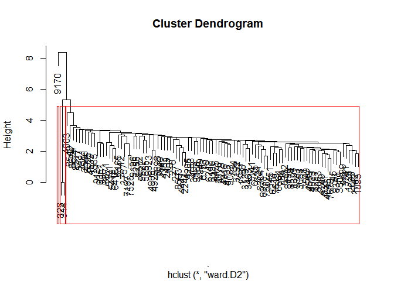
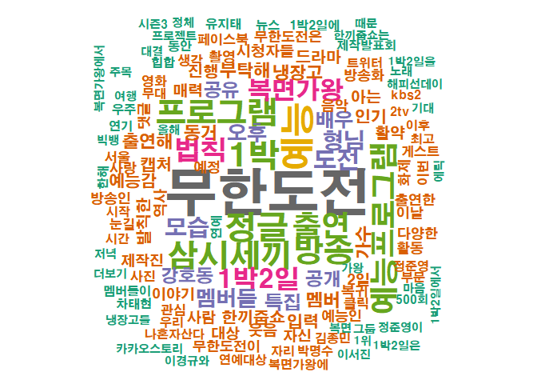

ADP TM\_2
================
jakinpilla
2019-04-28

``` r
setwd("C:/Users/Daniel/ADP_performance_test")
getwd()
```

    ## [1] "C:/Users/Daniel/ADP_performance_test"

loading needed packages—-

loading text data
———————————————————–

``` r
tvpro <- read_delim("data/tvprograms.txt", "\t", escape_double = FALSE, trim_ws = TRUE)
```

    ## Parsed with column specification:
    ## cols(
    ##   num = col_double(),
    ##   date = col_date(format = ""),
    ##   title = col_character(),
    ##   contents = col_character()
    ## )

``` r
head(tvpro$contents, 30)
```

    ##  [1] "..끼줍쇼’에는 연예대상을 수상한 김종민과 대세 걸그룹으로 우뚝 선 우주소녀의 성소가 밥동무로 출연을 앞두고 ..‘한끼줍쇼’의 녹화에서는 강력한 예능의 기운을 몰고 온 김종민과 성소의 연희동 한 끼 도전기로 네 사람은 첫 만남부터 예사롭지 않았다고 전해졌다."   
    ##  [2] "▲ 뮤지컬 ‘영웅(연출 윤호진)’ 공.. 최근 인기 예능 프로그램 MBC ‘무한도전’ 팀과 역사 특집 ..형, 이정열, 리사, 박정아, 정재은, 허민진(크레용팝 초아), 이지민 외.<U+00A0> 관람료: VIP석 13만원, R석 11만원, S석 8만원, A석 6만원<U+00A0>"                     
    ##  [3] "가수 정준영이 첫 솔로 정규 앨범을 발표한다. C9 엔터테인먼트 관계자는 정준영 공식 SNS 및 팬카페 등을 통해 오는 7일 0시 정준영의 첫 솔로 정규 앨범.. 앞서 정준영은 약 4개월여의 공백을 딛고 최근 KBS 예능 프로그램 '1박2일'에 복귀했다."                         
    ##  [4] "사진/뉴시스 ( <U+00A0> 최근 KBS 2TV 예능 '1박2일'로 연예계 복귀를 알린 가수 정준영(28)이<U+00A0>오는 2월<U+00A0>7일 첫 정규 앨범을 발표한다. 소속사 C9엔터테인먼트는 31일 공식 SNS와 팬카페를 통해 정준영의 첫 정규 앨범 '1인칭'을 오는 7일 .."                
    ##  [5] "'자산어보'를 바탕으로 현재의 바다 생태계를 확인한다는 측면에서는 반가웠다.<U+00A0> 예능과 정보 사이; 삼시세끼와 1박2일의 정수 뽑아 새로운 자산어보를 만들겠다 김병만은 특화된 존재다...예능 의 산증인이라고 해도 과언이 아닌 김종민이 참여했다는 것도 흥미롭.."
    ##  [6] "그러나 지금은 그저 평범한 예능인으로 전락하고 말았다. 그에겐 더 이상 신선함이라든지 기존 예능 문법을 파괴하는 발칙한 모습이 보이지 않는다. 식스맨으로 광희가 합류하고 양세형이 새로운 멤버로 자리를 잡아가면서, ..예능프로그램 많은 이들이 에서 노홍철.."      
    ##  [7] "방송: 2월 1일(수) 밤 10시 50분 예능대상과 예능대세가 한 끼에 도전한다.'한끼줍쇼'의 녹화에서는 강력한 예능의 기운을 몰고 온 김종민과 성소의 연희동 한 끼 도전기가 그려졌다...예능대상 김종민과 예능대세 성소의 활약은 오는 2월 1일(수) 밤 .."                   
    ##  [8] "의 개국공신 중 한명인 정형돈이 건강상의 이유로 하차를 결정한 것이다. 식스맨으로 광희가 합류하고, 양세형이 새로운 멤버로 자리를 잡아가면서, ▲ 무한도전> 멤버들 ..무한도전> 많은 이들이 에서 노홍철을 보는 건 이제 어렵겠구나 하고.. 노홍철 무한도전"           
    ##  [9] "..예능 ..'한끼줍쇼'에서 만났다.'한끼줍쇼'(연출 방현영)에는 연예대상을 수상한 김종민과 대세 걸그룹으로 우뚝 선 우주소녀의 성소가 밥동무로 출연한다.'한끼줍쇼'의 녹화에서는 강력한 예능의 기운을 몰고 온 김종민과 성소의 연희동 한 끼 도전기가 그려졌다."        
    ## [10] "방송: 2월 1일(수) 밤 10시 50분 예능대상과 예능대세가 한 끼에 도전한다.'한끼줍쇼'의 녹화에서는 강력한 예능의 기운을 몰고 온 김종민과 성소의 연희동 한 끼 도전기가 그려졌다...예능대상 김종민과 예능대세 성소의 활약은 오는 2월 1일(수) 밤 .."                   
    ## [11] "..예능 프로그램 ..끼는 그들의 연약한....아는 게 중요하다.▼ 의외로 작품보다 먼저〈쇼 미 더 머니〉〈복면가왕〉같은 예능 프로그램에서 만날 수 있겠는데? 하하.〈복면가왕〉에서 섭외 전화가 여러 번 왔는데, 내가 나가면 누구라도 금방 눈치챌 거 같아서 거절했다."  
    ## [12] "예능 대세 성소가 한끼줍쇼에 도전한다. 걸그룹 우주소녀 멤버 성소는 2월 1일 밤 10시 50분 방..‘한끼줍쇼’에는 연예대상을 수상한 김종민과 함께 밥동무로 출연한다. 성소는 이경규 강호동 김종민과 함께 서울 연희동를 찾아 한 끼 얻어 먹기에 도전했다."              
    ## [13] "..예능 ..'한끼줍쇼'에서 만났다.'한끼줍쇼'(연출 방현영)에는 연예대상을 수상한 김종민과 대세 걸그룹으로 우뚝 선 우주소녀의 성소가 밥동무로 출연한다.'한끼줍쇼'의 녹화에서는 강력한 예능의 기운을 몰고 온 김종민과 성소의 연희동 한 끼 도전기가 그려졌다."        
    ## [14] "\"SN.. 그 중심에는 MBC 예능 '무한도전'과 tvN 드라마 \\\"'무한도전'과  프로젝트 음원, OST곡 등 다양한 형태로 발매된 방송 음원들이 지니 1월 월간(1-25일) 차트 상위권을 휩쓸었다\\\"고 분석했다.'무한도전 '무한도전'의 효과를 톡톡히 봤다.\""                     
    ## [15] "..예능프로그램 출연에 오히려 적극적인 ..‘무한도전’ 휴방으로 3주간 특별 편성된 MBC ‘사십춘기’)를 통해 남다른 예능감을 발산하고 있다.‘왜 이제야 예능에 나왔을까’라는 의문을 자아낼 정도다. 그리고 그 방법 중에 하나로 예능을 택했다”고 이야기했다."       
    ## [16] "‘무한도전’ ‘도깨비’ 등 인기 예능 프로그램과 드라마를 통해 공개된 음원들이 음악서비스 지니 1월 월간차트(1월1∼25일) 상위권을 휩쓸었다. 1위는 MBC 예능프로그램 ‘무한도전 “예능 프로그램 ‘무한도전’과 드라마 ..형태로 발매된 방송 음원들이 지.."          
    ## [17] "..예능 프로그램 ..끼는 그들의 연약한....아는 게 중요하다.▼ 의외로 작품보다 먼저〈쇼 미 더 머니〉〈복면가왕〉같은 예능 프로그램에서 만날 수 있겠는데? 하하.〈복면가왕〉에서 섭외 전화가 여러 번 왔는데, 내가 나가면 누구라도 금방 눈치챌 거 같아서 거절했다."  
    ## [18] "'한끼줍쇼'에 출연한다...예능 대세로 떠오르고 있는 우..'한끼줍쇼'에 도전장을 내밀었다. 내일은 시구왕, 아육대, 정글의 법칙 등 출연한 예능마다 연일 화제가 되고 있는 걸그룹 우주소녀 멤버 성소가 2월 1일 방송 예정인 JTBC ‘한끼줍쇼’에 출연한다."               
    ## [19] "‘1박 2일’을 통해 이미지는 더 굳어졌다.‘1박 2일 통한 이질감도 고민됐다...형’ 좋지 않나.(웃음)” 갈증이 큰 상태에서 새로운 것을 도전하게 되면, 그것을 제대로 해내기 .. 때문에 관객들도 그의 끊임없는 도전기를 흥미롭게 지켜볼 수 있을 것 같다."              
    ## [20] "..예능대상' 김종민..'예능대세' 성소가 뭉쳤다.‘한끼줍쇼’에는 연예대상을 수상한 김종민과 대세 걸그룹으로 우뚝 선 우주소녀의 성소가 밥동무로 출연한다.‘한끼줍쇼’의 녹화에서는 이경규, 강호동, 김종민, 성소의 연희동 한 끼 도전기가 그려졌다.'한끼줍쇼'"       
    ## [21] "솔비가 진솔한 반전 매력으로 ‘신드롬맨’을.. 솔비는 30일 방송된 KBS 2TV 파일럿 예능프로그램  또 MC들은 이해하지 못하는 최민수와의 4차원 예능 케미로 진행능력까지 발휘해 눈길을 끌었다.‘정글의 법칙’을 시작으로 JTBC‘아는 형님’, MBC"                       
    ## [22] "예능 프로그램 '복면가왕'에 출연하며 공백을 채운 허각은 ..형식을 취한 이 앨범엔 이별 후에 경험할 수 있는 다양.. 지고릴라, 심현보, 김진환, MU-D9, 이정원, 기련(CLEF CREW) 등 실력파 프로듀서진이 참여해 허각에 맞춤형 노래를 선사했다."                          
    ## [23] "'한 끼'에 도전한다.<U+00A0>31일 JTBC에 따르면 내달 1일 방송되는 이 방송사의 예능프로그램 ..끼줍쇼'에는 대세 걸그룹 우주소녀의 성소와 최근 KBS 연예대상에서 대상을 수상한 김종..'한끼줍쇼' 녹화장에서는 강력한 예능의 기운을 몰고 온 김종민과 성소의"           
    ## [24] "김종민·성소, '한끼줍쇼' 출연… 연희동 간다 입력시간 | ..*****@******.**.** 기자의 다른 기사보기 독자의견 한끼줍쇼 ‘한끼’에 도전한다. 김종민과 성소는 1일 방송하는 종합편성채널 JTBC 예능프로그램 ‘한끼줍쇼’에 밥동무로 출연한다."                         
    ## [25] "‘예능 대세’ 성소가 한 끼에 도전한다...끼줍쇼’에는 지난해 KBS 연예대상을 수상한 김종민과 걸그룹 우주소녀의 성소가 밥 동..‘한끼줍쇼’에서는 김종민과 성소의 연희동 한 끼 도전기가 그려진다.‘한끼줍쇼’는 매주 수요일 오후 10시 50분에 방송된다.<U+00A0>"    
    ## [26] "홈 > 연예 > 방송ㆍTV (..* 축소 예능 대상자와 예능 대세가 한 끼에 도전한다.‘한끼줍쇼’에는 연예대상을 수상한 김종민과 대세 걸그룹 우주소녀의 성소가 밥동무로 나선다.'한끼줍쇼'의 녹화에서는 김종민과 성소의 서울 연희동 한 끼 도전기가 그려졌다."              
    ## [27] "News>방송 enews24<U+00A0> 입력. 20.. 솔비는 30일 방송된 KBS 2TV 파일럿 예능프로그램  또 MC들은 이해하지 못하는 최민수와의 4차원 예능 케미로 진행능력까지 발휘해 눈길을 끌었다.‘정글의 법칙’을 시작으로 JTBC‘아는 형님’, MBC"                               
    ## [28] "[뉴.. 예능대상과 예능대세가 한 끼에 도전한다.'한끼줍쇼'에는 연예대상을 수상한 김종민과 대세 걸그룹으로 우뚝 선 우주소녀 성소가 밥동무로 출연한다.'한끼줍쇼'의 녹화에서는 강력한 예능의 기운을 몰고 온 김종민과 성소의 연희동 한 끼 도전기가 펼쳐졌다."         
    ## [29] "[매일경제 스타투데이   솔비가 진솔한 반전.. 솔비는 30일 방송된 KBS 2TV 파일럿 예능프로그램  또 MC들은 이해하지 못하는 최민수와의 4차원 예능 케미로 진행능력까지 발휘해 눈길을 끌었다.‘정글의 법칙’을 시작으로 종편 ‘아는 형님’, MBC"                       
    ## [30] "..끼줍쇼’에는 연예대상을 수상한 김종민과 대세 걸그룹으로 우뚝 선 우주소녀의 성소가 밥동무로 출연을 앞두고 ..‘한끼줍쇼’의 녹화에서는 강력한 예능의 기운을 몰고 온 김종민과 성소의 연희동 한 끼 도전기로 네 사람은 첫 만남부터 예사롭지 않았다고 전해졌다."

Contents data —————————————————————

``` r
contents.vec <- tvpro$contents
contents.vec[is.na(contents.vec)] # contents에는 NA 값 없음
```

    ## character(0)

``` r
contents.vec %>% length()
```

    ## [1] 9362

``` r
head(contents.vec, 30)
```

    ##  [1] "..끼줍쇼’에는 연예대상을 수상한 김종민과 대세 걸그룹으로 우뚝 선 우주소녀의 성소가 밥동무로 출연을 앞두고 ..‘한끼줍쇼’의 녹화에서는 강력한 예능의 기운을 몰고 온 김종민과 성소의 연희동 한 끼 도전기로 네 사람은 첫 만남부터 예사롭지 않았다고 전해졌다."   
    ##  [2] "▲ 뮤지컬 ‘영웅(연출 윤호진)’ 공.. 최근 인기 예능 프로그램 MBC ‘무한도전’ 팀과 역사 특집 ..형, 이정열, 리사, 박정아, 정재은, 허민진(크레용팝 초아), 이지민 외.<U+00A0> 관람료: VIP석 13만원, R석 11만원, S석 8만원, A석 6만원<U+00A0>"                     
    ##  [3] "가수 정준영이 첫 솔로 정규 앨범을 발표한다. C9 엔터테인먼트 관계자는 정준영 공식 SNS 및 팬카페 등을 통해 오는 7일 0시 정준영의 첫 솔로 정규 앨범.. 앞서 정준영은 약 4개월여의 공백을 딛고 최근 KBS 예능 프로그램 '1박2일'에 복귀했다."                         
    ##  [4] "사진/뉴시스 ( <U+00A0> 최근 KBS 2TV 예능 '1박2일'로 연예계 복귀를 알린 가수 정준영(28)이<U+00A0>오는 2월<U+00A0>7일 첫 정규 앨범을 발표한다. 소속사 C9엔터테인먼트는 31일 공식 SNS와 팬카페를 통해 정준영의 첫 정규 앨범 '1인칭'을 오는 7일 .."                
    ##  [5] "'자산어보'를 바탕으로 현재의 바다 생태계를 확인한다는 측면에서는 반가웠다.<U+00A0> 예능과 정보 사이; 삼시세끼와 1박2일의 정수 뽑아 새로운 자산어보를 만들겠다 김병만은 특화된 존재다...예능 의 산증인이라고 해도 과언이 아닌 김종민이 참여했다는 것도 흥미롭.."
    ##  [6] "그러나 지금은 그저 평범한 예능인으로 전락하고 말았다. 그에겐 더 이상 신선함이라든지 기존 예능 문법을 파괴하는 발칙한 모습이 보이지 않는다. 식스맨으로 광희가 합류하고 양세형이 새로운 멤버로 자리를 잡아가면서, ..예능프로그램 많은 이들이 에서 노홍철.."      
    ##  [7] "방송: 2월 1일(수) 밤 10시 50분 예능대상과 예능대세가 한 끼에 도전한다.'한끼줍쇼'의 녹화에서는 강력한 예능의 기운을 몰고 온 김종민과 성소의 연희동 한 끼 도전기가 그려졌다...예능대상 김종민과 예능대세 성소의 활약은 오는 2월 1일(수) 밤 .."                   
    ##  [8] "의 개국공신 중 한명인 정형돈이 건강상의 이유로 하차를 결정한 것이다. 식스맨으로 광희가 합류하고, 양세형이 새로운 멤버로 자리를 잡아가면서, ▲ 무한도전> 멤버들 ..무한도전> 많은 이들이 에서 노홍철을 보는 건 이제 어렵겠구나 하고.. 노홍철 무한도전"           
    ##  [9] "..예능 ..'한끼줍쇼'에서 만났다.'한끼줍쇼'(연출 방현영)에는 연예대상을 수상한 김종민과 대세 걸그룹으로 우뚝 선 우주소녀의 성소가 밥동무로 출연한다.'한끼줍쇼'의 녹화에서는 강력한 예능의 기운을 몰고 온 김종민과 성소의 연희동 한 끼 도전기가 그려졌다."        
    ## [10] "방송: 2월 1일(수) 밤 10시 50분 예능대상과 예능대세가 한 끼에 도전한다.'한끼줍쇼'의 녹화에서는 강력한 예능의 기운을 몰고 온 김종민과 성소의 연희동 한 끼 도전기가 그려졌다...예능대상 김종민과 예능대세 성소의 활약은 오는 2월 1일(수) 밤 .."                   
    ## [11] "..예능 프로그램 ..끼는 그들의 연약한....아는 게 중요하다.▼ 의외로 작품보다 먼저〈쇼 미 더 머니〉〈복면가왕〉같은 예능 프로그램에서 만날 수 있겠는데? 하하.〈복면가왕〉에서 섭외 전화가 여러 번 왔는데, 내가 나가면 누구라도 금방 눈치챌 거 같아서 거절했다."  
    ## [12] "예능 대세 성소가 한끼줍쇼에 도전한다. 걸그룹 우주소녀 멤버 성소는 2월 1일 밤 10시 50분 방..‘한끼줍쇼’에는 연예대상을 수상한 김종민과 함께 밥동무로 출연한다. 성소는 이경규 강호동 김종민과 함께 서울 연희동를 찾아 한 끼 얻어 먹기에 도전했다."              
    ## [13] "..예능 ..'한끼줍쇼'에서 만났다.'한끼줍쇼'(연출 방현영)에는 연예대상을 수상한 김종민과 대세 걸그룹으로 우뚝 선 우주소녀의 성소가 밥동무로 출연한다.'한끼줍쇼'의 녹화에서는 강력한 예능의 기운을 몰고 온 김종민과 성소의 연희동 한 끼 도전기가 그려졌다."        
    ## [14] "\"SN.. 그 중심에는 MBC 예능 '무한도전'과 tvN 드라마 \\\"'무한도전'과  프로젝트 음원, OST곡 등 다양한 형태로 발매된 방송 음원들이 지니 1월 월간(1-25일) 차트 상위권을 휩쓸었다\\\"고 분석했다.'무한도전 '무한도전'의 효과를 톡톡히 봤다.\""                     
    ## [15] "..예능프로그램 출연에 오히려 적극적인 ..‘무한도전’ 휴방으로 3주간 특별 편성된 MBC ‘사십춘기’)를 통해 남다른 예능감을 발산하고 있다.‘왜 이제야 예능에 나왔을까’라는 의문을 자아낼 정도다. 그리고 그 방법 중에 하나로 예능을 택했다”고 이야기했다."       
    ## [16] "‘무한도전’ ‘도깨비’ 등 인기 예능 프로그램과 드라마를 통해 공개된 음원들이 음악서비스 지니 1월 월간차트(1월1∼25일) 상위권을 휩쓸었다. 1위는 MBC 예능프로그램 ‘무한도전 “예능 프로그램 ‘무한도전’과 드라마 ..형태로 발매된 방송 음원들이 지.."          
    ## [17] "..예능 프로그램 ..끼는 그들의 연약한....아는 게 중요하다.▼ 의외로 작품보다 먼저〈쇼 미 더 머니〉〈복면가왕〉같은 예능 프로그램에서 만날 수 있겠는데? 하하.〈복면가왕〉에서 섭외 전화가 여러 번 왔는데, 내가 나가면 누구라도 금방 눈치챌 거 같아서 거절했다."  
    ## [18] "'한끼줍쇼'에 출연한다...예능 대세로 떠오르고 있는 우..'한끼줍쇼'에 도전장을 내밀었다. 내일은 시구왕, 아육대, 정글의 법칙 등 출연한 예능마다 연일 화제가 되고 있는 걸그룹 우주소녀 멤버 성소가 2월 1일 방송 예정인 JTBC ‘한끼줍쇼’에 출연한다."               
    ## [19] "‘1박 2일’을 통해 이미지는 더 굳어졌다.‘1박 2일 통한 이질감도 고민됐다...형’ 좋지 않나.(웃음)” 갈증이 큰 상태에서 새로운 것을 도전하게 되면, 그것을 제대로 해내기 .. 때문에 관객들도 그의 끊임없는 도전기를 흥미롭게 지켜볼 수 있을 것 같다."              
    ## [20] "..예능대상' 김종민..'예능대세' 성소가 뭉쳤다.‘한끼줍쇼’에는 연예대상을 수상한 김종민과 대세 걸그룹으로 우뚝 선 우주소녀의 성소가 밥동무로 출연한다.‘한끼줍쇼’의 녹화에서는 이경규, 강호동, 김종민, 성소의 연희동 한 끼 도전기가 그려졌다.'한끼줍쇼'"       
    ## [21] "솔비가 진솔한 반전 매력으로 ‘신드롬맨’을.. 솔비는 30일 방송된 KBS 2TV 파일럿 예능프로그램  또 MC들은 이해하지 못하는 최민수와의 4차원 예능 케미로 진행능력까지 발휘해 눈길을 끌었다.‘정글의 법칙’을 시작으로 JTBC‘아는 형님’, MBC"                       
    ## [22] "예능 프로그램 '복면가왕'에 출연하며 공백을 채운 허각은 ..형식을 취한 이 앨범엔 이별 후에 경험할 수 있는 다양.. 지고릴라, 심현보, 김진환, MU-D9, 이정원, 기련(CLEF CREW) 등 실력파 프로듀서진이 참여해 허각에 맞춤형 노래를 선사했다."                          
    ## [23] "'한 끼'에 도전한다.<U+00A0>31일 JTBC에 따르면 내달 1일 방송되는 이 방송사의 예능프로그램 ..끼줍쇼'에는 대세 걸그룹 우주소녀의 성소와 최근 KBS 연예대상에서 대상을 수상한 김종..'한끼줍쇼' 녹화장에서는 강력한 예능의 기운을 몰고 온 김종민과 성소의"           
    ## [24] "김종민·성소, '한끼줍쇼' 출연… 연희동 간다 입력시간 | ..*****@******.**.** 기자의 다른 기사보기 독자의견 한끼줍쇼 ‘한끼’에 도전한다. 김종민과 성소는 1일 방송하는 종합편성채널 JTBC 예능프로그램 ‘한끼줍쇼’에 밥동무로 출연한다."                         
    ## [25] "‘예능 대세’ 성소가 한 끼에 도전한다...끼줍쇼’에는 지난해 KBS 연예대상을 수상한 김종민과 걸그룹 우주소녀의 성소가 밥 동..‘한끼줍쇼’에서는 김종민과 성소의 연희동 한 끼 도전기가 그려진다.‘한끼줍쇼’는 매주 수요일 오후 10시 50분에 방송된다.<U+00A0>"    
    ## [26] "홈 > 연예 > 방송ㆍTV (..* 축소 예능 대상자와 예능 대세가 한 끼에 도전한다.‘한끼줍쇼’에는 연예대상을 수상한 김종민과 대세 걸그룹 우주소녀의 성소가 밥동무로 나선다.'한끼줍쇼'의 녹화에서는 김종민과 성소의 서울 연희동 한 끼 도전기가 그려졌다."              
    ## [27] "News>방송 enews24<U+00A0> 입력. 20.. 솔비는 30일 방송된 KBS 2TV 파일럿 예능프로그램  또 MC들은 이해하지 못하는 최민수와의 4차원 예능 케미로 진행능력까지 발휘해 눈길을 끌었다.‘정글의 법칙’을 시작으로 JTBC‘아는 형님’, MBC"                               
    ## [28] "[뉴.. 예능대상과 예능대세가 한 끼에 도전한다.'한끼줍쇼'에는 연예대상을 수상한 김종민과 대세 걸그룹으로 우뚝 선 우주소녀 성소가 밥동무로 출연한다.'한끼줍쇼'의 녹화에서는 강력한 예능의 기운을 몰고 온 김종민과 성소의 연희동 한 끼 도전기가 펼쳐졌다."         
    ## [29] "[매일경제 스타투데이   솔비가 진솔한 반전.. 솔비는 30일 방송된 KBS 2TV 파일럿 예능프로그램  또 MC들은 이해하지 못하는 최민수와의 4차원 예능 케미로 진행능력까지 발휘해 눈길을 끌었다.‘정글의 법칙’을 시작으로 종편 ‘아는 형님’, MBC"                       
    ## [30] "..끼줍쇼’에는 연예대상을 수상한 김종민과 대세 걸그룹으로 우뚝 선 우주소녀의 성소가 밥동무로 출연을 앞두고 ..‘한끼줍쇼’의 녹화에서는 강력한 예능의 기운을 몰고 온 김종민과 성소의 연희동 한 끼 도전기로 네 사람은 첫 만남부터 예사롭지 않았다고 전해졌다."

Tagging and Nouns extraction ————————————————

``` r
# contents_doc.vec <- NULL
# for (i in 1:length(contents.vec)) {
# 
#   contents.vec[i] %>% # tagging...
#     SimplePos09() %>%
#     unlist() %>%
#     unname() %>%
#     as.character() %>%
#     strsplit("\\+") %>%
#     unlist() -> ith.tagged
# 
#   ith.tagged[grep("/N", ith.tagged)] %>% # extract only Nouns...
#     paste(collapse = " ") -> ith.N_tagged
# 
#   contents_doc.vec <- c(contents_doc.vec, ith.N_tagged)
# }
# 
# contents_doc.vec %>%
#   enframe() %>%
#   as_tibble() -> df_contents_tagged
# 
# df_contents_tagged %>% 
#   rename(doc_num = name, 
#          content_tagged = value) %>%
#   write_csv("./data/df_contents_tagged.csv")

df_contents_tagged <- read_csv("./data/df_contents_tagged.csv")
```

    ## Parsed with column specification:
    ## cols(
    ##   doc_num = col_double(),
    ##   content_tagged = col_character()
    ## )

``` r
df_contents_tagged %>% colnames()
```

    ## [1] "doc_num"        "content_tagged"

불용문자 제거
—————————————————————

``` r
df_contents_tagged$content_tagged <- gsub('[[:punct:]]+', "", df_contents_tagged$content_tagged)
df_contents_tagged$content_tagged <- gsub('[[:lower:]]+', "", df_contents_tagged$content_tagged)
df_contents_tagged$content_tagged <- gsub("n", "", df_contents_tagged$content_tagged)
df_contents_tagged$content_tagged <- gsub("N", "", df_contents_tagged$content_tagged)
df_contents_tagged$content_tagged <- gsub("■", "", df_contents_tagged$content_tagged)
df_contents_tagged$content_tagged <- gsub("△", "", df_contents_tagged$content_tagged)
df_contents_tagged$content_tagged <- gsub("<U+00A0>", "", df_contents_tagged$content_tagged)
df_contents_tagged$content_tagged <- gsub("▲", "", df_contents_tagged$content_tagged)
df_contents_tagged$content_tagged <- gsub("▷", "", df_contents_tagged$content_tagged)
df_contents_tagged$content_tagged <- gsub("▼", "", df_contents_tagged$content_tagged)
df_contents_tagged$content_tagged <- gsub("◇", "", df_contents_tagged$content_tagged)
df_contents_tagged$content_tagged <- gsub("◆", "", df_contents_tagged$content_tagged)
df_contents_tagged$content_tagged <- gsub("00a0", "", df_contents_tagged$content_tagged)
df_contents_tagged$content_tagged <- gsub("★", "", df_contents_tagged$content_tagged)
```

DTM 생성
——————————————————————–

``` r
strsplit_space_tokenizer <- function(x) unlist(strsplit(as.character(x), " "))
df_contents_tagged$content_tagged[1] %>% strsplit_space_tokenizer()
```

    ##  [1] "끼줍쇼에는" "연예대상"   "수상한"     "김종민과"   "대"        
    ##  [6] "걸그룹으로" "우주소녀"   "성소"       "밥동무로"   "출연"      
    ## [11] "한끼줍쇼"   "녹화"       "강력한"     "예능"       "기운"      
    ## [16] "김종민과"   "성소"       "연희동"     "한"         "끼"        
    ## [21] "도전기"     "사람"       "첫"         "예사"       "않았다"

``` r
options(mc.cores=1)
cps <- VCorpus(VectorSource(df_contents_tagged$content_tagged))
```

DTM inspect —————————————————————–

``` r
tm::inspect(dtm_contents[1:50, ])
```

    ## <<DocumentTermMatrix (documents: 50, terms: 18775)>>
    ## Non-/sparse entries: 958/937792
    ## Sparsity           : 100%
    ## Maximal term length: 6
    ## Weighting          : term frequency - inverse document frequency (normalized) (tf-idf)
    ## Sample             :
    ##     Terms
    ## Docs 기운 김종민과    도전기 밥동무로 성소 수상한 연희동 예능대상 우주소녀
    ##   19    0        0 0.5461734        0    0      0      0        0        0
    ##   2     0        0 0.0000000        0    0      0      0        0        0
    ##   22    0        0 0.0000000        0    0      0      0        0        0
    ##   39    0        0 0.0000000        0    0      0      0        0        0
    ##   4     0        0 0.0000000        0    0      0      0        0        0
    ##   46    0        0 0.0000000        0    0      0      0        0        0
    ##   47    0        0 0.0000000        0    0      0      0        0        0
    ##   49    0        0 0.0000000        0    0      0      0        0        0
    ##   5     0        0 0.0000000        0    0      0      0        0        0
    ##   8     0        0 0.0000000        0    0      0      0        0        0
    ##     Terms
    ## Docs 한끼줍쇼
    ##   19        0
    ##   2         0
    ##   22        0
    ##   39        0
    ##   4         0
    ##   46        0
    ##   47        0
    ##   49        0
    ##   5         0
    ##   8         0

``` r
dtm_contents %>% colnames() -> terms.of_dtm
```

연관어휘(findAssocs()) ——————————————————

``` r
findAssocs(dtm_contents, "1박2일", .2)
```

    ## $`1박2일`
    ##   김종민 1박2일에 1박2일은  시즌3을 1박2일이   정준영 
    ##     0.28     0.23     0.23     0.22     0.21     0.20

``` r
findAssocs(dtm_contents, "복면가왕", .2)
```

    ## $복면가왕
    ##     정체      4시 팝콘소녀 슬라이드  1라운드 tv리포팅     무대 
    ##     0.30     0.24     0.23     0.22     0.20     0.20     0.20

Word Count with slam package ————————————————

``` r
dtm_contents %>%
  slam::col_sums() %>%
  base::as.data.frame() %>%
  tibble::rownames_to_column() %>%
  as_tibble() %>%
  rename(words = rowname, freq = ".") %>%
  arrange(desc(freq))
```

    ## # A tibble: 18,775 x 2
    ##    words         freq
    ##    <chr>        <dbl>
    ##  1 무한도전      498.
    ##  2 예능          313.
    ##  3 00a0          284.
    ##  4 정글          284.
    ##  5 1박           282.
    ##  6 삼시세끼      279.
    ##  7 프로그램      270.
    ##  8 방송          266.
    ##  9 출연          252.
    ## 10 예능프로그램  251.
    ## # ... with 18,765 more rows

문서 유사도 구하기———————————————————–

``` r
as.matrix(dtm_contents) -> dtm_contents_mat; dim(dtm_contents_mat)
```

    ## [1]  9362 18775

``` r
n <- nrow(dtm_contents_mat)
idx <- 1:n

set.seed(2019)
sample_idx <- sample(idx, n * .2) # 20%만 문서 무작위 선택
sample_idx %>% length()
```

    ## [1] 1872

``` r
sample_dtm_mat = dtm_contents_mat[sample_idx, ]
dim(sample_dtm_mat)
```

    ## [1]  1872 18775

``` r
sample_dtm_mat[1:10, ] %>% rownames()
```

    ##  [1] "7208" "6673" "2840" "5787" "473"  "405"  "7674" "90"   "959"  "5692"

``` r
sample_idx[1:10]
```

    ##  [1] 7208 6673 2840 5787  473  405 7674   90  959 5692

dtm\_sample\_mat 의 9번째 문서와 1\~8번째 문서와의 유사도 계산 —————–

dtm\_sample\_mat 의 9번째 문서 번호…
    —————————————-

``` r
sample_idx[9] # 959 문서...
```

    ## [1] 959

``` r
contents.vec[959]
```

    ## [1] "'한끼줍쇼'는 연예인들이 평범한 이들의 집에 찾아가 저녁 한 끼를 함께 먹는 예능 프로그램이다. 웃자고 보는 예능에 나는 마냥 웃을 수가 없다...끼..'여성주의는 남녀 모두에게 자신과 사회를 아는 데 큰 도움을 준다'고."

``` r
cord <- sample_dtm_mat[9, ] %*% t(sample_dtm_mat)
cord[1:10]
```

    ##  [1] 0.000000000 0.000000000 0.353491630 0.196082318 0.148592913
    ##  [6] 0.008942788 0.011536808 0.000000000 2.564742067 0.039389831

문서 유사도순으로 배열하기
————————————————–

``` r
orders <- data.frame(doc = 'doc_959', scores = t(cord), stringsAsFactors = F)
orders %>%
  as_tibble() %>%
  rownames_to_column() %>%
  rename(doc.num = rowname) %>%
  arrange(desc(scores)) -> similarity.for_doc_9th

similarity.for_doc_9th
```

    ## # A tibble: 1,872 x 3
    ##    doc.num doc     scores
    ##    <chr>   <chr>    <dbl>
    ##  1 959     doc_959  2.56 
    ##  2 4755    doc_959  0.854
    ##  3 1035    doc_959  0.590
    ##  4 1775    doc_959  0.575
    ##  5 5297    doc_959  0.480
    ##  6 1577    doc_959  0.479
    ##  7 1681    doc_959  0.446
    ##  8 8526    doc_959  0.443
    ##  9 823     doc_959  0.399
    ## 10 832     doc_959  0.393
    ## # ... with 1,862 more rows

``` r
contents.vec[as.numeric(similarity.for_doc_9th$doc.num[1:10])]
```

    ##  [1] "'한끼줍쇼'는 연예인들이 평범한 이들의 집에 찾아가 저녁 한 끼를 함께 먹는 예능 프로그램이다. 웃자고 보는 예능에 나는 마냥 웃을 수가 없다...끼..'여성주의는 남녀 모두에게 자신과 사회를 아는 데 큰 도움을 준다'고."                                               
    ##  [2] "배우 박서준과 박형식이 KBS 2TV 예능프로그램 ‘해피선데이-1박2일 시즌3’(이하 ‘1박2일’)에 출연한다. '1박2일’ 관계자는 스타뉴스에 '1박2일'을 찾게 된 것. ..형식이 어떤 예능감을 선보일지, 또 이들이 ..'1박 2일'은 내달 중 방송된다."                           
    ##  [3] "\"[사진=비 인스타그램] 아주경제   가수 비(정지..'아는형님'에 출연해 예능감을 발휘해 화제를 모으고 있다.<U+00A0> 1982년 6월 25일생인 비은 개띠에 속한다.▶토끼띠 오늘의 운세 \\\"보석이 흙 속에 묻혀 있는 형상이다.- 믿는 도끼에 발등 찍힐 수 있다.\""           
    ##  [4] "▲'무한도전' 정준하 대상 프로젝트(MBC  7일 오후 방송된 MBC 예능프로그램 ..무한도전'에서는 대상 수상에 실패한 정준하를 위한 프로젝트에 돌입하는..'무한도전' 하나로는 안된다.'미국 혹은 아프리카 드라마 도전' '남자 버전 프로듀스 101 도전'"                      
    ##  [5] "\"News>방송 enews24<U+00A0>고수진 기자|입력. ..-tvN 예능 프로그램 '삼시세끼' 출연 당시 화제가 됐었다. 예능도 열어 뒀나? '삼시세끼' 출연은 워낙 자연을 좋아하기 때문에 옥순봉이 궁금해서 가 보고 싶은 마음에 성사됐던 거다.\\\" ..끼는 것 같다.\""               
    ##  [6] "\"입력 2017-01-09 11:37:50, 수정 2017-01-09 11:37:50 '복면가왕' 박혜수 춤실력에 신봉선 \\\"그냥 회사원이다\\\" * 확대 * 축소 * 프린트 * 메..'복면가왕'의  지난 8일 오후 방송된 MBC 예능프로그램 '복면가왕'에서는\""                                             
    ##  [7] "\"‘올해의 프로그램 상’을 수상한 국민 예능, 무한도전! 노홍철과 함께 막내라인을 형성하던  그에게 무한도전이란 은인 같은 프로그램이자, 삶 자체이기 때문이다. 국민 예능 무한도전의 뒷이야기와  이제 무한도전은 일부가 아니라 제 삶이예요\\\"라고 털어놨다.\""     
    ##  [8] "/사진=스타뉴스 'tvN 10 어워즈'에서 여자 배우상을 수상한 배우 김혜수의 행동이 화제다. 시상식 내내 톱 배우의 명성에 걸 맞는 프로다운 면모로 시.. 유해진은 tvN 예능 프로그램 '삼시세끼 어촌편'의 멤버로 이번 시상식에 참석해 자리를 빛냈다."                       
    ##  [9] "..도전했다...아는형님’ 출연진들 또한 비의 역대급 퍼포먼스에 놀라움을 금치 못하.. 3년 만에 국내 활동을 시작한 비는 오랜만에 예능 프로그램에 출연하며, 남다른 예능감을 뽐내 존재감을 과시했다.<U+00A0> 예능부터 음악 프로그램까지 비가 휩쓸고 간 자리는 그야말로"
    ## [10] "“예능프로그램 출연에 맞춘 것”이라고 설명했다. 비는 이번 컴백을 준비하면서 아이돌 위주의 음악방송보다는 주말 예능프로그램에 무게를 뒀다.‘아는 형님’ 방송을 통해 이미 팬들을 만났다.‘냉장고를 부탁해’에 출연한다...예능프로그램, 음악시상식, 라디오 등.."

문서 군집하기 —————————————————————

``` r
n <- nrow(dtm_contents_mat)
sample_idx <- sample(idx, n * .05)
dtm_sample_mat <- dtm_contents_mat[sample_idx, ]; dim(dtm_sample_mat)
```

    ## [1]   468 18775

``` r
dtm_sample_mat <- dtm_sample_mat[1:100, ]; dim(dtm_sample_mat) # 계산 시간 다대하여 데이터를 축소함.
```

    ## [1]   100 18775

``` r
# fit <- hclust(dist(dtm_sample_mat), method='ward.D2')
dtm_sample_mat %>%
  dist() %>%
  hclust(method = 'ward.D2') -> fit

plot(fit)
rect.hclust(fit, k=3)
```

<!-- -->

Wordcount 및 Wordcloud ——————————————————

``` r
dtm_contents %>%
  slam::col_sums() %>%
  base::as.data.frame() %>%
  tibble::rownames_to_column() %>%
  as_tibble() %>%
  rename(words = rowname, freq = ".") %>%
  arrange(desc(freq)) -> wordcnt.data

wordcnt.data %>%
  slice(-grep("^\\d+$", words)) %>% # eliminate all rows which contains only digit number character
  slice(-3) %>% # to discard 00a0 things...
  slice(-31) %>%
  slice(-35) -> wordcnt.data_1
```

Wordcloud….

``` r
# install.packages("extrafont")
library(extrafont)
```

    ## Registering fonts with R

``` r
# font_import()

windowsFonts(hy=windowsFont("HYGothic-Extra"))
wordcloud(words = wordcnt.data_1$words, freq=wordcnt.data_1$freq,
          min.freq= 50, 
          max.words = 300,
          random.order = F,
          family = "hy", 
          colors=brewer.pal(8, "Dark2"))
```

<!-- -->
